# 将图例放在绘图 matplotlib 之外

> 原文：<https://pythonguides.com/put-legend-outside-plot-matplotlib/>

[](https://sharepointsky.teachable.com/p/python-and-machine-learning-training-course)

在本 [Python 教程](https://pythonguides.com/learn-python/)中，我们将讨论**在 Python 中把图例放在 plot matplotlib** 之外。在这里，我们将使用 [matplotlib](https://pythonguides.com/what-is-matplotlib/) 来涵盖与图外图例相关的不同示例。我们还将讨论以下主题:

*   将图例放在绘图 matplotlib 之外
*   Matplotlib 在绘图外设置图例
*   Matplotlib 将图例设置在图的中央偏左位置
*   Matplotlib 将图例设置在图的下中心
*   Matplotlib 在外面设置支线剧情图例
*   Sns 将图例放在情节 matplotlib 之外
*   Sns 将图例设置在图的左上方
*   图外的 Matplotlib 图例被切断
*   Matplotlib 图例在地块右侧之外
*   Matplotlib 图例在图下方
*   图外图例 matplotlib tight_layout

目录

[](#)

*   [将图例放在绘图 matplotlib 之外](#Put_legend_outside_plot_matplotlib "Put legend outside plot matplotlib")
*   [Matplotlib 在图外设置图例](#Matplotlib_set_legend_outside_plot "Matplotlib set legend outside plot")
*   [Matplotlib 将图例设置在图的中央偏左处](#Matplotlib_set_legend_center-left_outside_plot "Matplotlib set legend center-left outside plot")
*   [Matplotlib 设置图例图外中上部](#Matplotlib_set_legend_upper-center_outside_plot "Matplotlib set legend upper-center outside plot")
*   [Matplotlib 在](#Matplotlib_set_subplots_legend_outside "Matplotlib set subplots legend outside")外设置支线剧情图例
*   [Sns 将图例放在绘图 matplotlib 外](#Sns_put_legend_outside_plot_matplotlib "Sns put legend outside plot matplotlib ")
*   [Sns 设置图例左上角外图](#Sns_set_legend_upper-left_outside_plot "Sns set legend upper-left outside plot")
*   [Matplotlib 图外图例切断](#Matplotlib_legend_outside_plot_cut_off "Matplotlib legend outside plot cut off")
*   [绘图右侧外的 Matplotlib 图例](#Matplotlib_legend_outside_plot_right "Matplotlib legend outside plot right")
*   [Matplotlib 图例在图下方](#Matplotlib_legend_outside_below_plot "Matplotlib legend outside below plot")
*   [图外图例 matplotlib tight_layout](#Legend_outside_plot_matplotlib_tight_layout "Legend outside plot matplotlib tight_layout")

## 将图例放在绘图 matplotlib 之外

在本节中，我们将学习如何在 Python 的 matplotlib 中将图例放在绘图之外。现在在开始这个话题之前，我们首先要了解一下**【传说】**是什么意思。

**图例**是概述图形元素的区域。

**以下步骤用于在 matplotlib 中绘制外部图例，概述如下:**

*   **定义库:**导入所需的重要库(用于数据创建和操作:Numpy 和 Pandas，用于数据可视化:来自 matplotlib 的 pyplot)。
*   **定义 X 轴和 Y 轴:**定义用于 X 轴和 Y 轴的数据坐标值。
*   **绘制图表或图形:**通过使用**条()**、**饼()**、**散点()**、 `plot()` 等方法，我们可以绘制出一个曲线图。
*   **在外面添加图例:**通过使用 `legend()` 方法，我们可以给一个情节添加一个图例。使用 `legend()` 函数的 `bbox_to_anchor` 属性在绘图之外指定它。
*   **生成绘图:**使用 `show()` 方法在用户窗口上可视化绘图。

读取[Python Matplotlib tick _ params](https://pythonguides.com/matplotlib-tick-params/)

## Matplotlib 在图外设置图例

在 Matplotlib 中，要在绘图之外设置图例，必须使用 `legend()` 方法，并向其传递 `bbox_to_anchor` 属性。

**设置外部图例的语法如下:**

```py
matplotlib.pyplot.legend(bbox_to_anchor=(x,y))
```

我们使用 bbox_to_anchor=(x，y)属性。这里 x 和 y 指定了图例的坐标。

**让我们来看一个在图外设置图例的例子:**

```py
**# Import Library**

import numpy as np
import matplotlib.pyplot as plt

**# Define Data**

x = [0, 1, 2, 3, 4, 5]    
y1 = [0, 2, 4, 6, 8, 10]
y2 = [0, 3, 6, 9, 12, 15]

**# Plot graph**

plt.plot(y1, label ="y = 2x")
plt.plot(y2, label ="y = 3x")

**# Add legend**

plt.legend(bbox_to_anchor =(0.65, 1.25))

**# Show plot**

plt.show()
```

*   在上面的例子中，首先我们导入库，如 `numpy` 和 `matplotlib` 。
*   接下来，我们定义数据，并通过使用 `plt.plot()` 方法绘制图表和标签。
*   `plt.legend()` 方法用于向绘图添加图例，我们传递 `bbox_to_anchor` 属性，并设置其 `x` 和 `y` 坐标值。

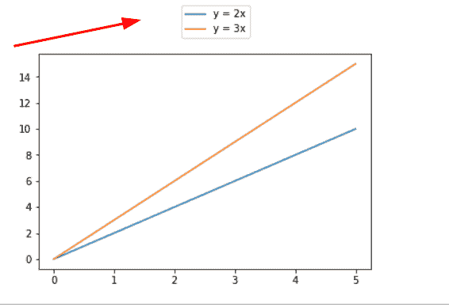

*” Legend outside the plot “*

另外，检查: [Matplotlib 改变背景颜色](https://pythonguides.com/matplotlib-change-background-color/)

## Matplotlib 将图例设置在图的中央偏左处

在这里，我们将学习如何将图例设置在图外的中左位置。

**其语法如下:**

```py
matplotlib.pyplot.legend(bbox_to_anchor=(x,y) , loc='center left')
```

**我们来看一个例子:**

```py
**# Import libraries**

import matplotlib.pyplot as plt
import pandas as pd

**# Define Data**

df = pd.DataFrame({
    'Maths': [12, 15, 10, 3, 1, 5],
    'Science': [15, 10, 5, 4, 3, 6],
    'Computers':[20, 12, 5, 3, 5, 2]
})

labels = ['A','B','C','D','E','Fail']

**# Plot bar chart**

ax = df.plot(stacked=True, kind='bar')

**# Set Tick labels**

ax.set_xticklabels(labels,rotation='horizontal')

ax.legend(title='SUBJECT',title_fontsize=30,loc='center left', bbox_to_anchor=(1, 0.5))

**# Display chart** 
plt.show()
```

*   在上面的例子中，我们导入了 `matplotlib.pyplot` 和 `pandas` 库。
*   之后，我们使用 pandas `DataFrame()` 方法定义标签和数据坐标，并使用 `plot()` 方法绘制条形图。
*   通过使用 `set_xticklabels()` 方法，我们设置了 `x` **标签**，还将其**旋转**设置为**水平**。
*   然后我们使用 `ax.legend()` 方法设置图例的标题，并传递 `title_fontsize` 参数，将其值设置为 `30` 。
*   我们还传递了 `loc` 和 **bbox_to_anchor=(x，y)** 属性，并将其值分别设置为**中左**和 **1，0.5** 。

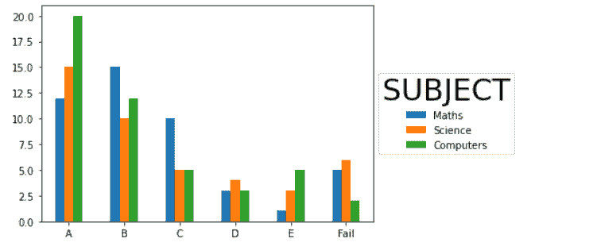

*” Legend at center-left “*

阅读: [Matplotlib 散点图标记](https://pythonguides.com/matplotlib-scatter-marker/)

## Matplotlib 设置图例图外中上部

在这里，我们将学习如何将图例设置在图外的中下部位置。

**其语法如下:**

```py
matplotlib.pyplot.legend(bbox_to_anchor=(x,y) , loc='lower center') 
```

**举例:**

```py
**# Import Library**

import numpy as np
import matplotlib.pyplot as plt

**# Define Data**

x = [0, 1, 2, 3, 4, 5]    

y = [0, 5, 10, 15, 20, 25]

**# Plot graph**

plt.plot(y1, label ="y = 5x")

**# Add legend**

plt.legend(bbox_to_anchor =(0.5,-0.27), loc='lower center')

**# Show plot**

plt.show()
```

*   在上面的图中，我们导入了 `numpy` 和 `matplotlib.pyplot` 库。
*   之后，我们定义数据并使用 `plt.plot()` 方法绘制图表。
*   通过使用 `plt.legend()` 方法，我们设置图例并通过 `bbox_to_anchor` 和 `loc` 属性分别将其值设置为( **0.5，-0.27** )和 `lower center` 。

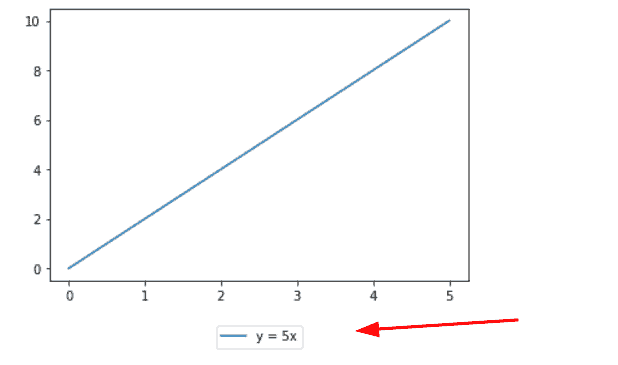

” Legend at the *lower center “*

阅读: [Matplotlib 虚线](https://pythonguides.com/matplotlib-dashed-line/)

## Matplotlib 在外设置支线剧情图例

一个图形中的多个情节称为支线情节。这里我们要绘制支线剧情，定义剧情之外的传奇。

**我们来看一个与此相关的例子:**

```py
**# Import Libraries**

import numpy as np
import matplotlib.pyplot as plt

**# Define Data**

x = np.linspace(10, 5, 1000)

**# Plot subplots** 
fig, ax = plt.subplots(2, 2)
for i in range(2):
    ax[1][i].plot(x, np.tan(x+i),
                 label = "y=tan(x+{})".format(i))

    ax[0][i].plot(x, np.tan(x+i), 
                  label = "y=tan(x+{})".format(i))

**# Add legends**

fig.legend(bbox_to_anchor=(1.3, 0.6))

**# Show plot**

fig.tight_layout()  
plt.show()
```

*   首先，我们导入 `numpy` 和 `matplotlib` 库。接下来，我们使用 numpy 的 `linespace()` 方法定义数据。
*   之后我们绘制支线剧情，使用 `"for loop"` 并定义一个****函数**来绘制支线剧情。**
*   **通过使用 `fig.legend()` 方法，我们将一个图例添加到绘图中，并将 `bbox_to_anchor` 属性传递给它。**
*   **我们分别使用 `fig.tight_layout()` 和 `plt.show()` 方法自动调整和可视化图形。**

**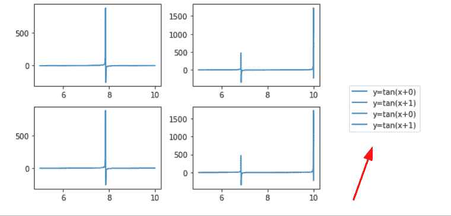

*” Legend outside the subplots “*

阅读: [Matplotlib plot_date](https://pythonguides.com/matplotlib-plot-date/)

## Sns 将图例放在绘图 matplotlib 外

这里我们要用 Python 中 matplotlib 中的 Seaborn 来绘制地块外的图例。

如果您的系统中没有安装 Seaborn，安装它最简单的方法是命令行终端。

**安装语法:**

```py
**# Command to install Seaborn**

pip install seaborn 
```

**我们来看一个剧情之外的 seaborn 传奇的例子:**

```py
**# Import Libraries**

import matplotlib.pyplot as plt
import pandas as pd
import seaborn as sns

**# Define Data**

df = pd.DataFrame({
    'X': [12, 15, 10, 3, 1, 5],
    'Y': [15, 10, 5, 4, 3, 6],
    'Label':['Pass','Pass','Fail','Pass','Fail','Fail']
})

**# Scatter plot**

sns.scatterplot(data=df, x='X',y='Y', hue='Label')

**# Legend plot**

plt.legend(bbox_to_anchor=(1.02, 1), loc='upper left')

**# Show**

plt.show()
```

*   首先我们导入 `matplotlib.pyplot` 、**熊猫**和 `seaborn` 库。
*   之后，我们使用 `DataFrame()` 方法定义数据。
*   然后使用 `sns.scatterplot()` 方法绘制 seaborn 图，使用 `plt.legend()` 方法在图外添加图例。

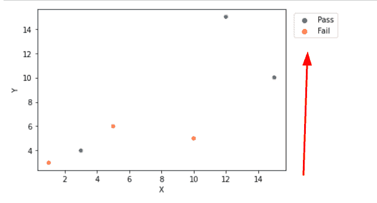

*” Seaborn plot “*

读取: [Matplotlib 日志日志图](https://pythonguides.com/matplotlib-log-log-plot/)

## Sns 设置图例左上角外图

在这里，我们将学习如何在 matplotlib 的 Seaborn 地块的左上角设置外部图例。

**举例:**

```py
**# Import libraries**

import matplotlib.pyplot as plt
import pandas as pd
import seaborn as sns

**# Define Data**

df = pd.DataFrame({
    'X': [12, 15, 10, 3, 1, 5],
    'Y': [15, 10, 5, 4, 3, 6],
    'Label':['Pass','Pass','Fail','Pass','Fail','Fail']
})

**# Scatter plot**

sns.lineplot(data=df, x='X',y='Y', hue='Label')

**# Legend plot**

plt.legend(bbox_to_anchor=(1.02, 0.15), loc='upper left', borderaxespad=0)

**# Show**

plt.show()
```

*   这里我们用 `sns.lineplot()` 的方法来绘制 seaborn 图。
*   使用 `plt.legend()` 方法添加一个图例，向其传递 `bbox_to_anchor` 参数和 `loc` 参数。
*   将自变量的值分别设置为 **(1.02，0.15)** 和**左上**。

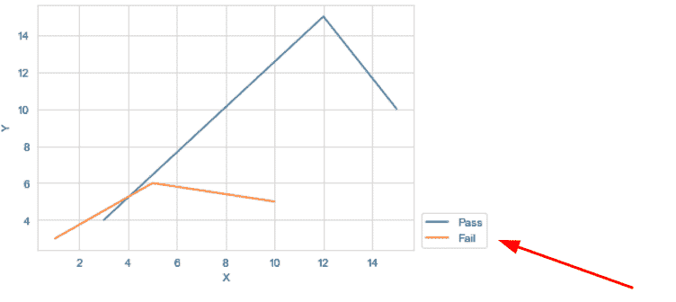

*” Upper-left legend outside the sns plot “*

阅读:[什么是 add_axes matplotlib](https://pythonguides.com/add_axes-matplotlib/)

## Matplotlib 图外图例切断

这里我们将学习如何使用 matplotlib 防止图例框被裁剪。为了防止图例被裁剪，我们将使用 `bbox_extra_artists` 和 `bbox_inches` 。

*   当计算紧 bbox 时将被考虑的艺术家列表由 `bbox_extra_artists` 指定。
*   如果 `bbox_inches` 设置为紧，将生成图形的紧 bbox。

**我们来看一个例子:**

```py
**# Import Libraries** 
import matplotlib.pyplot as plt
import numpy as np

**# Define Data** 
x = np.linspace(0, 10, 2)
y1 = np.cos(x)
y2 = np.exp(x)

**# Plot**

plt.plot(x, y1, label="cos(x)")
plt.plot(x, y2, label="exp(x)")

**# Legend** 

legend_outside = plt.legend(bbox_to_anchor=(1.05, 1.0), 
                            loc='upper left')

**# Savefig** 
plt.savefig('outside_legend.png', 
            dpi=150, 
            format='png', 
            bbox_extra_artists=(legend_outside,), 
            bbox_inches='tight')

**# Display**

plt.show()
```

*   将 `matplotlib.pyplot` 导入为 `plt` 进行数据可视化。
*   接下来，导入 `numpy` 作为 `np` 进行数据创建。
*   然后用 `linspace()` 、 `cos()` 和 `exp()` 的方法定义数据坐标。
*   为了绘制图表，我们使用了 `plot()` 函数。
*   为了在绘图之外添加图例，我们使用了 `legend()` 方法，并将 `bbox_to_anchor` 参数传递给它。
*   接下来，我们使用 `savefig()` 函数将绘图保存为 `png` 。
*   为了防止图例被裁剪，我们将 `bbox_extra_artists` 和 `bbox_inches` 作为参数传递给 `savefig()` 函数。
*   为了在用户屏幕上显示图形，我们使用了 `show()` 函数。

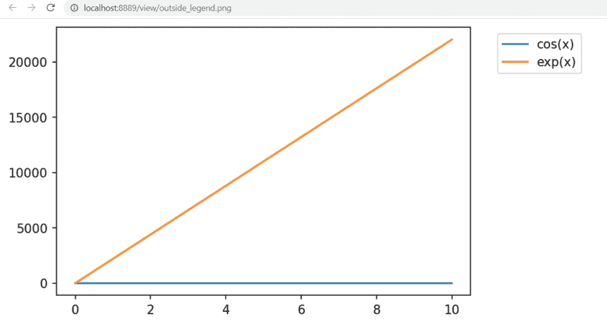

Matplotlib legend outside plot being cut off

阅读: [Matplotlib 二维表面图](https://pythonguides.com/matplotlib-2d-surface-plot/)

## 绘图右侧外的 Matplotlib 图例

在这一节中，我们将学习将图例的位置设置在绘图的右侧。为了设置正确的位置，我们将 `loc` 参数传递给 `legend()` 方法。 `loc` 的值可以是一个**数字**或一个**字符串。**

设置右的数值为 `5` ，字符串值为**右**。

**我们来看一个例子:**

```py
**# Import Libraries**

import matplotlib.pyplot as plt
import numpy as np

**# Define Data**

x = np.linspace(0, 30, 100)
y1 = np.sin(x)
y2 = np.cos(x)

**# Plot**

plt.plot(x, y1, label='Sin')
plt.plot(x, y2, label='Cos')

**# Legend** 
legend_outside = plt.legend(bbox_to_anchor=(1.20,0.89),                          
                            loc='right')

**# Display**

plt.show()
```

*   首先，我们导入 `matplotlib.pyplot` 和 `numpy` 库。
*   要定义数据坐标，使用 `linspace()` 、 `sin()` 和 `cos()` 函数。
*   为了绘制线图，我们使用了 `plot()` 函数。
*   要向绘图添加图例，请将**标签**参数传递给 `plot()` 函数。
*   要在外部设置图例，使用 `legend()` 函数，并向其传递 `loc` 参数，并将**右侧的**设置为字符串值。

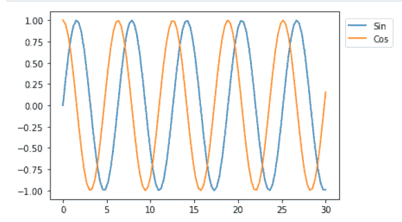

Matplotlib legend outside plot right

阅读: [Matplotlib 时间序列图](https://pythonguides.com/matplotlib-time-series-plot/)

## Matplotlib 图例在图下方

在这一节中，我们将学习在绘图下方设置图例框。我们可以将图例设置为左下方、右下方和中下方。

**语法:**

```py
matplotlib.pyplot.legend(bbox_to_anchor, loc = 'lower right'| 
                         'lower left' | 'lower center') 
```

你也可以用 loc 数字代替 loc 字符串，比如 3 代表左下，4 代表右下，8 代表中下。

**我们来看例子:**

**例#1**

在这里，我们将图例设置在右下角。

```py
**# Import Library** 
import numpy as np 
import matplotlib.pyplot as plt 

**# Define Data** 
name = ['Ava', 'Noah', 'Charlotte', 'Robert', 'Patricia']
weight_kg = [45, 60, 50, 75, 53]
height_cm = [162, 175, 155, 170, 168]

**# Plot**

plt.plot(name, weight_kg, marker ='o', label='Weight')
plt.plot(name, height_cm, marker='o', label='Height')

**# Legend**

plt.legend(bbox_to_anchor=(0.98,-0.3), loc='lower right')

**# Display**

plt.show()
```

*   首先导入必要的库，如 `numpy` 和 `matplotlib.pyplot` 。
*   接下来，定义数据坐标。
*   要绘制折线图，请使用 `plot()` 函数。
*   要向绘图添加图例，请使用 `legend()` 方法。
*   要在图外设置图例，请传递 `bbox_to_anchor` 参数，并将其位置设置到右下角，我们还需要 `loc` 参数。

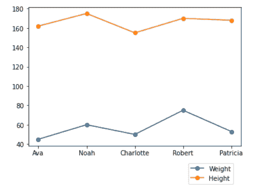

Matplotlib legend outside below plot

**例 2**

```py
**# Import Library**

import numpy as np 
import matplotlib.pyplot as plt 

**# Define Data** 
year = [1, 2, 3, 4, 5, 6, 7, 8, 9, 10]
profit = [80, 60, 50, 95, 75, 63, 35, 90, 68, 78]
loss = [20, 40, 50, 5, 25, 37, 65, 10, 32, 22]

**# Plot**

plt.scatter(year, profit, label='Profit')
plt.scatter(year, loss, label='Loss')

**# Set axis**

plt.xlim(0, 12)

**# Legend**

plt.legend(bbox_to_anchor=(-0.01,-0.3), loc=3)

**# Display**

plt.show()
```

这里，我们通过使用 `legend()` 函数，将图例设置在绘图的左下方位置。

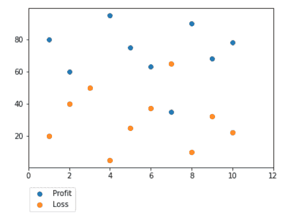

Matplotlib legend outside lower plot

读取: [Matplotlib 设置 y 轴范围](https://pythonguides.com/matplotlib-set-y-axis-range/)

## 图外图例 matplotlib tight_layout

在本节中，我们将学习使用 matplotlib 绘制带有外部图例的图形。

**我们来看一个例子:**

```py
**# Import Library** 
import numpy as np 
import matplotlib.pyplot as plt 

**# Define Data**

name = ['Ava', 'Noah', 'Charlotte', 'Robert', 'Patricia']
weight_kg = [45, 60, 50, 75, 53]
height_cm = [162, 175, 155, 170, 168]

**# Plot**

plt.plot(name, weight_kg, marker ='o', label='Weight')
plt.plot(name, height_cm, marker='o', label='Height')

**# Legend**

plt.legend(bbox_to_anchor=(0.60,-0.1), loc=1)

**# Auto adjust** 
plt.tight_layout()

**# Save Plot**

plt.savefig('Legend Plot.png', format='png')

**# Display**

plt.show()
```

*   这里，我们使用 `legend()` 函数来添加图例。
*   为了在绘图之外添加图例，我们传递了 `bbox_to_anchor` 参数。
*   为了防止图例被切断，我们使用了 `tight_layout()` 函数。
*   为了保存绘图，我们使用 `savefig()` 函数。
*   为了在用户屏幕上显示图形，我们使用了 `show()` 函数。

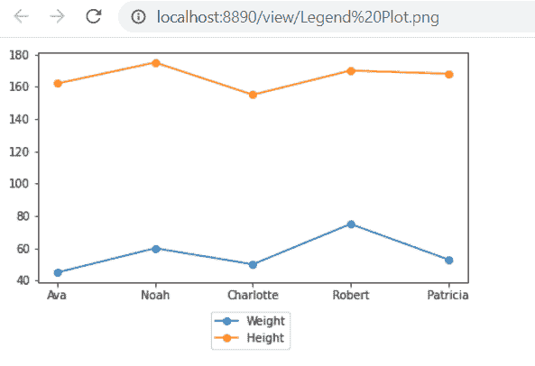

Legend outside plot matplotlib tight_layout

另外，看看更多关于 Matplotlib 的文章。

*   [Matplotlib 最佳拟合线](https://pythonguides.com/matplotlib-best-fit-line/)
*   [水平线 matplotlib](https://pythonguides.com/horizontal-line-matplotlib/)
*   [Matplotlib 3D scatter](https://pythonguides.com/matplotlib-3d-scatter/)
*   [Matplotlib x 轴标签](https://pythonguides.com/matplotlib-x-axis-label/)
*   [Matplotlib 支线剧情教程](https://pythonguides.com/matplotlib-subplot-tutorial/)
*   [画垂直线 matplotlib](https://pythonguides.com/draw-vertical-line-matplotlib/)
*   [Matplotlib 绘图条形图](https://pythonguides.com/matplotlib-plot-bar-chart/)
*   [Matplotlib 另存为 png](https://pythonguides.com/matplotlib-save-as-png/)
*   [Matplotlib 另存为 pdf](https://pythonguides.com/matplotlib-save-as-pdf/)

在本 Python 教程中，我们讨论了**“将图例放在绘图 matplotlib 之外”**，并且我们还介绍了一些与之相关的例子。这些是我们在本教程中讨论过的以下主题。

*   将图例放在绘图 matplotlib 之外
*   Matplotlib 在绘图外设置图例
*   Matplotlib 将图例设置在图的中央偏左位置
*   Matplotlib 将图例设置在图的下中心
*   Matplotlib 在外面设置支线剧情图例
*   Sns 将图例放在情节 matplotlib 之外
*   Sns 将图例设置在图的左上方
*   图外的 Matplotlib 图例被切断
*   Matplotlib 图例在地块右侧之外
*   Matplotlib 图例在图下方
*   图外图例 matplotlib tight_layout

[Bijay Kumar](https://pythonguides.com/author/fewlines4biju/)

Python 是美国最流行的语言之一。我从事 Python 工作已经有很长时间了，我在与 Tkinter、Pandas、NumPy、Turtle、Django、Matplotlib、Tensorflow、Scipy、Scikit-Learn 等各种库合作方面拥有专业知识。我有与美国、加拿大、英国、澳大利亚、新西兰等国家的各种客户合作的经验。查看我的个人资料。

[enjoysharepoint.com/](https://enjoysharepoint.com/)[](https://www.facebook.com/fewlines4biju "Facebook")[](https://www.linkedin.com/in/fewlines4biju/ "Linkedin")[](https://twitter.com/fewlines4biju "Twitter")**