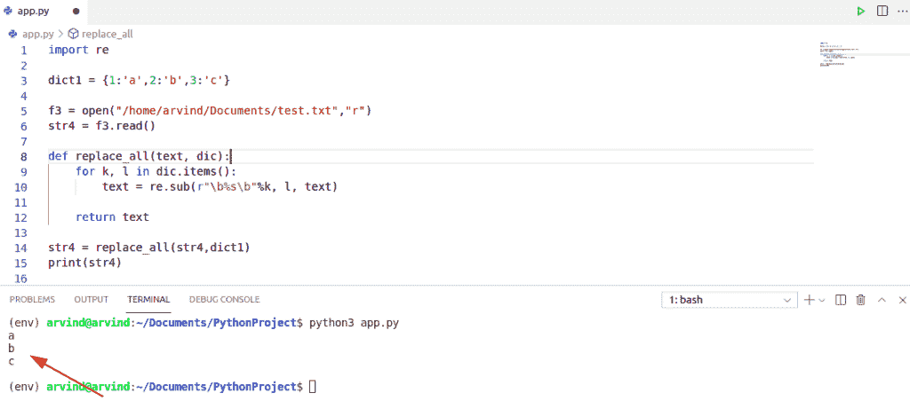

# Python 3 string replace()方法+ Python 替换文件中的字符串

> 原文：<https://pythonguides.com/python-3-string-replace/>

[](https://sharepointsky.teachable.com/p/python-and-machine-learning-training-course)

在本 [Python 教程](https://pythonguides.com/python-hello-world-program/)中，我们将通过几个例子来讨论如何使用 **Python 3 string replace()方法**。此外，我们将看到，如何在 Python 中替换文件中的字符串。我们将讨论下面的例子:

*   Python 3 字符串替换()方法
*   替换字符串 python 中的字母
*   Python 替换文件中的字符串
*   如何在 Python 中替换文件中的字符串
*   Python 替换文件 regex 中的字符串
*   Python 使用字典替换文件中的字符串
*   Python 替换 CSV 文件中的字符串
*   Python 替换 XML 文件中的字符串
*   Python 在一个文件中替换多个字符串
*   Python 替换文本文件中的字符串
*   替换文件中字符串的 Python 代码

目录

[](#)

*   [Python 3 的 string replace()方法](#Python_3_string_replace_method "Python 3 string replace() method")
*   [替换字符串 python 中的一个字母](#Replace_a_letter_in_a_string_python "Replace a letter in a string python")
*   [Python 替换文件中的字符串](#Python_replace_a_string_in_a_file "Python replace a string in a file")
*   [如何在 Python 中替换文件中的字符串](#How_to_replace_a_string_in_a_file_in_Python "How to replace a string in a file in Python")
*   [Python 替换文件 regex 中的字符串](#Python_replace_a_string_in_file_regex "Python replace a string in file regex")
*   [Python 使用字典替换文件中的字符串](#Python_replace_a_string_in_a_file_using_a_dictionary "Python replace a string in a file using a dictionary")
*   [Python 替换 CSV 文件中的字符串](#Python_replace_a_string_in_a_CSV_file "Python replace a string in a CSV file")
*   [Python 替换 XML 文件中的一个字符串](#Python_replace_a_string_in_the_XML_file "Python replace a string in the XML file")
*   [Python 替换一个文件中的多个字符串](#Python_replace_multiple_strings_in_a_file "Python replace multiple strings in a file")
*   [Python 替换文本文件中的字符串](#Python_replace_a_string_in_a_text_file "Python replace a string in a text file")
*   [Python 代码替换文件中的字符串](#Python_code_to_replace_a_string_in_a_file "Python code to replace a string in a file")

## Python 3 的 string replace()方法

让我们看看，如何使用 **Python 3 string replace()方法**。

**Python replace()方法**是 Python 中的内置函数。 `replace` ()方法返回一个字符串的副本，其中出现的旧字符串被替换为新字符串。

**举例:**

```py
my_string = "Python"
s = my_string.replace("Python", "PythonGuides")
print(s)
```

在编写了上面的代码(python 3 string replace)之后，您将打印出 `"s"` ，然后输出将显示为 **" PythonGuides "。**这里， `replace()` 方法用另一个指定的字符串替换指定的字符串。

可以参考下面截图 **python 3 string replace()方法**。


Python 3 string replace() method

这是 **Python string replace()方法**的一个简单例子。

阅读: [Python 从字符串中移除子串](https://pythonguides.com/python-remove-substring-from-a-string/)

## 替换字符串 python 中的一个字母

`replace()` 是 python 编程中的内置函数，用于替换字符串中的一个字母，替换后返回字符串的副本。

**举例:**

```py
str = ['P', 'y', 't', 'h', 'o', 'n', 'g', 'u', 'i', 'd', 'e', 's']
str[6] = 'G'
print (str)
```

为了得到输出，当你**打印(str)** 时，它将返回一个替换了字符串**中的字母后的字符串副本。**于是， **str[6]** 索引在输出中被替换为**‘G’**。

你可以参考下面的截图替换字符串 python 中的一个字母。


Replace a letter in a string python

## Python 替换文件中的字符串

替换字符串使我们能够通过创建一个新文件来替换内容和虾米，该文件显示被替换的联系人。

*   它用于从另一个字符或子串中删除指定的字符或子串。
*   Replace[]方法，将一个模式替换为另一个模式，并返回一个新字符串作为结果。

**语法:**

下面是 replace[]的语法

```py
replace[
        old_str1,
        new_str2,
        instance
]
```

在 python 中，有两种类型的文件二进制文件和文本文件。所以要么这个文件是一个包含 0 和 1 的二进制文件，要么它可以有一些文本。

文本文件由一系列行组成，每行都包含字符。每一行都以称为 EOL[行尾字符]的特殊字符结束。

## 如何在 Python 中替换文件中的字符串

*   让我们看看，如何在 Python 中**替换文件中的字符串。**
*   我们举个例子，我们会在 test.txt 文件中用 python 替换一个字符串文件，并用替换后的文本覆盖 test.txt 文件。

**语法:**

下面是替换文件中字符串的语法。

```py
str = open (" .txt"," ")
data = str.read()
```

**例子**

```py
#read input file
str1 = open("/home/arvind/Documents/test.txt", "rt")
data = str1.read()
data = data.replace('python', 'pyton')
#close the input file
str1.close()
str1 = open("/home/arvind/Documents/test.txt", "wt")
#overwrite the input file
str1.write(data)
str1.close()
print(data)
```

下面是下面给出的代码的截图。


Python replace string in file

上面的 Python 代码我们可以用来替换 Python 中一个文件中的字符串。

## Python 替换文件 regex 中的字符串

*   在本节中，我们将学习如何使用 Python 中的 regex 替换文件中的字符串。
*   **正则表达式**主要用于描述搜索模式，因此您可以使用正则表达式在大量数据中搜索特定字符串。
*   你可以验证字符串是否有正确的格式，你可以找到一个字符串并用另一个字符串替换它，你甚至可以将数据格式化成正确的格式以便导入，所以这些都是正则表达式的用法。
*   使用正则表达式模块我们使用了两个函数
    *   重新编译()
    *   re.escape()

1.  `re.compile` ()用于编译一个 regex 模式。
2.  `re.escape()` 用于对 regex 模式中的字符进行转义。

**语法:**

```py
re.compile(re.escape(text)
pattern.sub(subs)
```

**例子**

让我们举一个例子来检查如何在文件 regex 中替换一个字符串。

```py
import re
def replace(filePath, text, subs, flags=0):

   #open file
   with open(filepath, "r+") as file:
       #read the contents
       contents = file.read()
       text_pattern = re.compile(re.escape(text), flags)
       contents = text_pattern.sub(subs, contents)
       file.seek(0)
       file.truncate()
       file.write(contents)

filepath="/home/arvind/Documents/test.txt"
text="pyton"
subs="tinkter"
#calling the replace method
replace(filepath, text, subs)
print(subs) 
```

下面是以下代码的截图。


Python replace string in file regex

上面的 Python 代码，我们可以用 Python 中的 regex 来用**替换文件中的一个字符串。**

## Python 使用字典替换文件中的字符串

*   在本节中，我们将学习如何使用 Python 中的字典替换文件中的字符串。
*   我们可以很容易地使用 regex 方法，它主要用于描述搜索模式，因此您可以使用正则表达式在大量数据中搜索特定的字符串。

**语法**:

```py
text = re.sub(" .txt",k,l,text)
str4= replace_all(str4,dict)
```

**例子**

让我们举一个例子来检查 Python 使用字典替换文件中的字符串

```py
import re

dict1 = {1:'a',2:'b',3:'c'} 

f3 = open("/home/arvind/Documents/test.txt","r")
str4 = f3.read() 

def replace_all(text, dic):
    for k, l in dic.items():
        text = re.sub(r"\b%s\b"%k, l, text) 

    return text

str4 = replace_all(str4,dict1)
print(str4) 
```

下面是下面给出的代码的截图。



Python replace a string in file using Dictionary

阅读:[如何用 Python 把字典转换成 JSON](https://pythonguides.com/convert-dictionary-to-json-python/)

这是如何使用 Python 中的字典替换文件中的字符串。

## Python 替换 CSV 文件中的字符串

在本节中，我们将学习如何用 Python 替换 CSV 文件中的字符串。为了替换 CSV 文件中的字符串，我们可以很容易地使用 replace()方法。

**语法:**

```py
str4=str4.replace("ID NUMBER","UNIQUE ID")
```

**例子**

让我们举一个例子来检查如何替换 csv 文件中的字符串。

```py
 str4 = open("/home/arvind/Documents/app.csv", "r")
str4 = ''.join([i for i in str4]) 
str4 = str4.replace("ID NUMBER", "UNIQUE ID") 

y = open("output.csv","w")

y.writelines(str4)
y.close()
print(str4)
```

下面是以下代码的截图。


Python replace string in csv file

## Python 替换 XML 文件中的一个字符串

*   `XML` 代表可扩展标记语言。它在外观上类似于 HTML，但 XML 用于数据准备，而 HTML 用于定义正在使用的数据。
*   XML 专门用于在客户机和服务器之间发送和接收数据。
*   XML 也是一种元语言，这意味着，XML 可以用来描述另一种标记语言，如 XHTML，SVG，RDF。
*   XML 是作为数据存储和数据交换的标准而开发的。
*   XML 的主要优势是
    *   XML 是独立于设备和平台的。
    *   XML 不是用二进制语言编写的。
    *   XML 是人类和机器可读的。

*   在本节中，我们将学习如何替换 XML 文件中的字符串。
*   为了替换 XML 文件中的字符串，我们可以很容易地使用 pop()方法。

**例子**

让我们举一个例子来检查如何替换 XML 文件中的字符串

```py
import xml.etree.ElementTree as ET

tree = ET.parse("/home/arvind/Documents/test.xml")
root = tree.getroot()
root[0][0].attrib.pop('name', None)

tree.write('output.xml')
print(root)
```

阅读: [Python 熊猫 CSV 教程](https://pythonguides.com/python-pandas-csv/)

## Python 替换一个文件中的多个字符串

*   在这一节中，我们将学习如何在 Python 中替换一个文件中的多个字符串。
*   为了替换文件中的多个字符串，我们可以很容易地使用 replace()方法。

**例子**

让我们举一个例子来检查如何替换一个文件中的多个字符串

```py
str1 = open("/home/arvind/Documents/test.text", "rt")
data = str1.read()
data = data.replace('java is ', ' C++ is a')
#close the input file
str1.close()
str1 = open("/home/arvind/Documents/test.txt", "wt")
#overwrite the input file
str1.write(data)
str1.close()
print(data)
```

以下是给定代码的截图


Python replace multiple strings in a file

阅读:[如何将 Python 数组写入 CSV](https://pythonguides.com/python-write-array-to-csv/)

## Python 替换文本文件中的字符串

替换字符串使我们能够通过使用替换联系人创建新的显示来替换内容和虾米。

*   它用于从另一个字符或子串中删除指定的字符或子串。
*   Replace[]方法，将一个模式替换为另一个模式，并返回一个新字符串作为结果。
*   在本节中，我们将学习如何替换文件中的字符串。
*   我们举个例子，我们会在 test.txt 文件中用 python 替换一个字符串文件，并用替换后的文本覆盖 test.txt 文件。

**语法**:

下面是 replace[]的语法

```py
replace[
        old_str1,
        new_str2,
        instance
]
```

**例子**

让我们举一个例子来检查如何替换文本文件中的字符串

```py
#read input file
str1 = open("/home/arvind/Documents/test.txt", "rt")
data = str1.read()
data = data.replace('mongodb', 'SQL')
#close the input file
str1.close()
str1 = open("/home/arvind/Documents/test.txt", "wt")
#overwrite the input file
str1.write(data)
str1.close()
print(data)
```


Python replace a string in a text file

读取: [Python 读取 CSV 文件，写入 CSV 文件](https://pythonguides.com/python-read-csv-file/)

## Python 代码替换文件中的字符串

*   在这一节中，我们将学习如何用 Python 代码来替换文件中的字符串。
*   我们举个例子，我们会在 test.txt 文件中用 python 替换一个字符串文件，并用替换后的文本覆盖 test.txt 文件。

**例子**

让我们举一个例子来检查如何用 Python 代码替换文件中的字符串

```py
#read input file
str1 = open("test.txt", "rt")
data = str1.read()
data = data.replace('Python', 'JAVA')
#close the input file
str1.close()
str1 = open("test.txt", "wt")
#overwrite the input file
str1.write(data)
str1.close()
print(data)
```

以下是给定代码的截图


Python code to replace a string in a file

这就是如何在 Python 中**替换文件中的字符串。**

您可能会喜欢以下 Python 教程:

*   [Python 比较字符串](https://pythonguides.com/python-compare-strings/)
*   [Python 在字符串中查找子串](https://pythonguides.com/python-find-substring-in-string/)
*   [无法将字符串转换为浮点 Python](https://pythonguides.com/could-not-convert-string-to-float-python/)
*   [在 Python 中切片字符串](https://pythonguides.com/slicing-string-in-python/)

在这个 Python 教程中，我们通过几个例子学习了如何使用 **Python 3 string replace()方法**。

*   Python 3 字符串替换()方法
*   替换字符串 python 中的字母
*   Python 替换文件中的字符串
*   如何在 Python 中替换文件中的字符串
*   Python 替换文件 regex 中的字符串
*   Python 使用字典替换文件中的字符串
*   Python 替换 CSV 文件中的字符串
*   Python 替换 XML 文件中的字符串
*   Python 在一个文件中替换多个字符串
*   Python 替换文本文件中的字符串
*   替换文件中字符串的 Python 代码

[Bijay Kumar](https://pythonguides.com/author/fewlines4biju/)

Python 是美国最流行的语言之一。我从事 Python 工作已经有很长时间了，我在与 Tkinter、Pandas、NumPy、Turtle、Django、Matplotlib、Tensorflow、Scipy、Scikit-Learn 等各种库合作方面拥有专业知识。我有与美国、加拿大、英国、澳大利亚、新西兰等国家的各种客户合作的经验。查看我的个人资料。

[enjoysharepoint.com/](https://enjoysharepoint.com/)[](https://www.facebook.com/fewlines4biju "Facebook")[](https://www.linkedin.com/in/fewlines4biju/ "Linkedin")[](https://twitter.com/fewlines4biju "Twitter")