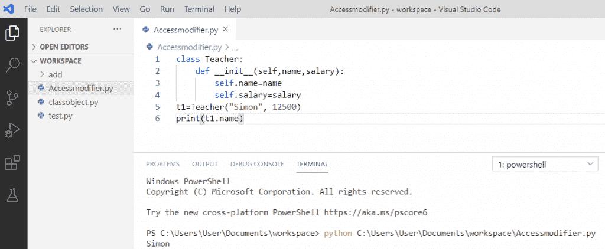
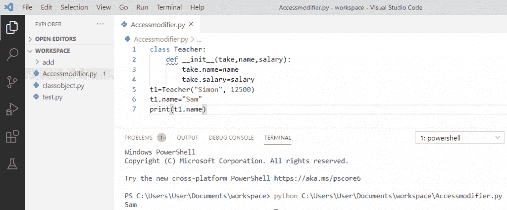
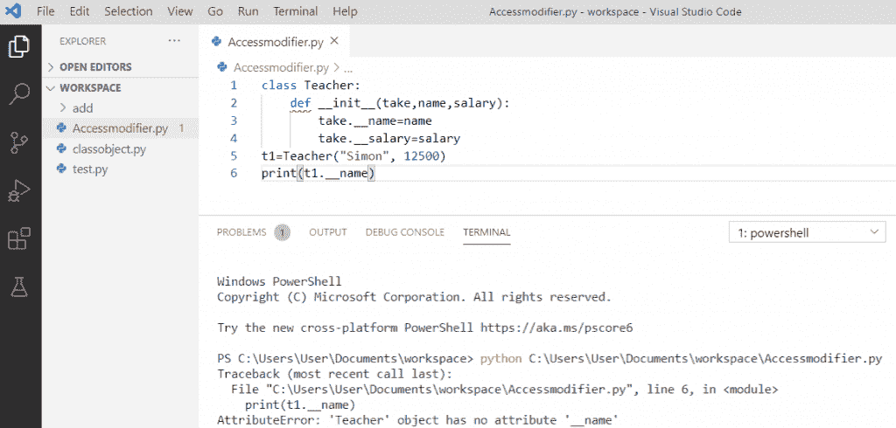
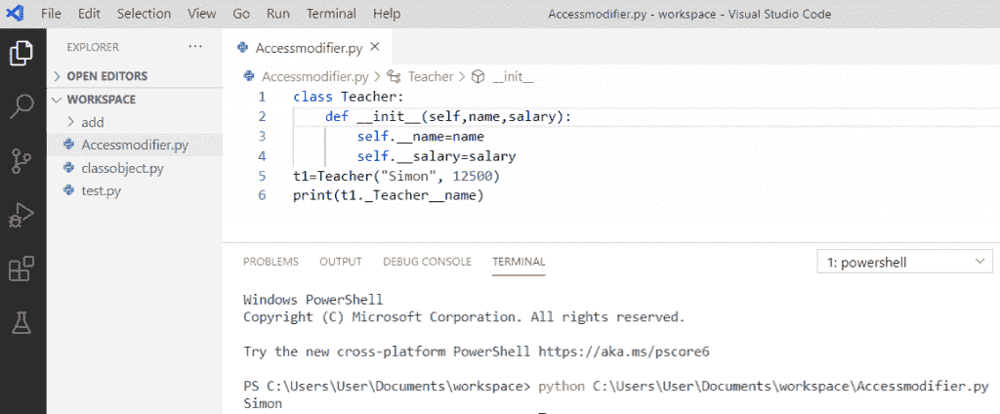
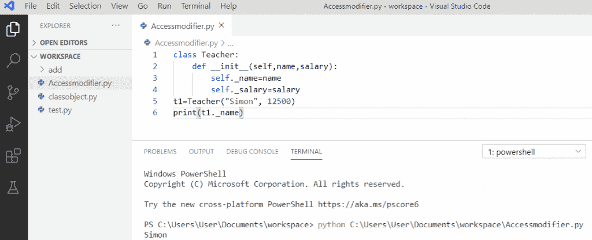
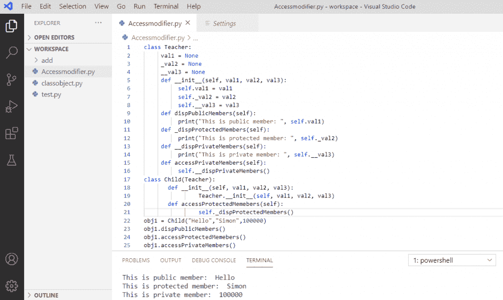

# Python 访问修饰符+示例

> 原文：<https://pythonguides.com/python-access-modifiers/>

[](https://sharepointsky.teachable.com/p/python-and-machine-learning-training-course)

在这个 [python 教程中，](https://pythonguides.com/python-hello-world-program/)你将通过例子学习 **python 访问修饰符**。这里我们将检查 **:**

*   什么是 python 访问修饰符
*   python 中的公共访问修饰符
*   python 中的私有访问修饰符
*   python 中的受保护访问修饰符
*   python 访问修饰符完整示例

目录

[](#)

*   [Python 访问修饰符](#Python_Access_Modifiers "Python Access Modifiers")
*   [python 中的公共访问修饰符](#Public_access_modifier_in_python "Public access modifier in python")
*   [Python 中的私有访问修饰符](#Private_access_modifier_in_Python "Private access modifier in Python")
*   [python 中的受保护访问修饰符](#Protected_access_modifier_in_python "Protected access modifier in python")
*   [Python 访问修饰符程序示例](#Python_access_modifiers_program_example "Python access modifiers program example")

## Python 访问修饰符

*   **Python 访问修饰符**用于修改变量的默认范围。python 中有三种类型的访问修饰符，它们是——**公共的**、**私有的**和**受保护的**。在 python 中，我们使用**下划线****“_”**符号来指定类中特定数据成员和成员函数的访问修饰符。
*   **Python 访问修饰符**在保护数据免受未授权访问方面发挥着重要作用。当实现继承时，由于不需要的数据从父类转移到子类，数据有被破坏的巨大风险。这就是使用访问修饰符的原因。

让我们详细讨论一下 Python 中的**类型的访问修饰符:**

*   公共
*   私人的
*   保护

*   [Python 命名约定](https://pythonguides.com/python-naming-conventions/)
*   [如何在 python 中创建变量](https://pythonguides.com/create-python-variable/)
*   [Python 下载安装步骤(Windows 10/Unix/Mac/Ubuntu/CentOS)](https://pythonguides.com/python-download-and-installation/)

## python 中的公共访问修饰符

在 python 中的**公共访问修饰符的情况下，python 类中的所有成员默认为**公共**。任何声明为 `public` 的成员都可以通过一个对象从类外部访问。**

**举例:**

```py
class Teacher:
def __init__(self,name,salary):
self.name=name
self.salary=salary
t1=Teacher("Simon", 12500)
print(t1.name)
```

*   写完上面的代码(python 中的公共访问修饰符)，你将打印出 `"t1.name"` ，然后输出将显示为**"西蒙"**。
*   这里，类的成员变量默认是公共的，因此我们可以访问 `"Teacher"` 类属性，并且我们还可以修改它们的值。

你可以参考下面 python 中公共访问修饰符的截图。



Public access modifier in python

在**公共访问修饰符中我们也可以修改它们的值**这里我们将借助一个例子来看。

**举例:**

```py
class Teacher:
def __init__(self,name,salary):
self.name=name
self.salary=salary
t1=Teacher("Simon", 12500)
t1.name="Sam"
print(t1.name)
```

写完上面的代码(python 中的公共访问修饰符)，你将打印出 `"t1.name"` ，然后输出将显示为 `" Sam"` 。在这里，我们得到修改后的值，这样，我们可以修改任何值。

你可以参考下面的截图。



## Python 中的私有访问修饰符

现在，让我们讨论一下 Python 中的**私有访问修饰符。**

双**下划线****“_ _”**使得**变量私有**并且安全，声明为私有的类的成员在该类中是可访问的。此外，也不可能在类外访问它们，因为这样会引发错误。

**举例:**

```py
class Teacher:
def __init__(self,name,salary):
self.__name=name
self.__salary=salary
t1=Teacher("Simon", 12500)
print(t1.__name)
```

*   写完上面的代码(python 中的私有访问修饰符)后，你将打印出 **"t1。__name"** 那么输出将抛出一个错误，如 **" AttributeError:'教师'对象没有属性' __name' "** 。
*   这里，我们试图访问类外的私有成员，因此，我们得到了这个错误。

你可以参考下面 python 中私有访问修饰符的截图。



Private access modifier in python

因此，**要访问一个类的私有成员**,我们需要用**名字处理私有变量**。每一个带双下划线的成员都将被改为**对象。_class__variable "** 然后可以从类外访问它。

**举例:**

```py
class Teacher:
def __init__(self,name,salary):
self.__name=name
self.__salary=salary
t1=Teacher("Simon", 12500)
print(t1._Teacher__name)
```

写完上面的代码，你会打印出 **" t1。_Teacher__name "** 那么输出会出现为**“西蒙”**。在这里，我们可以通过打印**对象来访问类外的私有成员。_ class _ _ 变量**。

你可以参考下面的截图来访问 python 中的私有成员。



Private access modifier in python

## python 中的受保护访问修饰符

现在，让我们用一个例子来讨论 Python 中的**保护访问修饰符**。

通过添加一个**单下划线“_”**，该类的数据成员被声明为受**保护的**，这阻止了它的访问。该类的受保护成员可以被该类中的其他成员访问，也可以被从它派生的类访问。

**举例:**

```py
class Teacher:
def __init__(self,name,salary):
self._name=name
self._salary=salary
t1=Teacher("Simon", 12500)
print(t1._name)
```

*   写完上面的代码(python 中的 protected access 修饰符)，你将打印出 **"t1。_name"** 那么输出将显示为**“西蒙”**。
*   这里，我们通过给**加下划线**来保护类变量 `name` 和 `salary` 。我们可以在对象的帮助下从外部类访问受保护的成员。

你可以参考下面的 python 中受保护的访问修饰符的截图。



Protected access modifier in python

## Python 访问修饰符程序示例

现在，让我们看一个带有完整程序的 **Python 访问修饰符**的例子。

我们已经通过一个例子分别看到了所有的 **Python 访问修饰符**，现在让我们将这三者结合到程序中来看看它是如何工作的。

**举例:**

```py
class Teacher:
val1 = None
_val2 = None
__val3 = None
def __init__(self, val1, val2, val3):
self.val1 = val1
self._val2 = val2
self.__val3 = val3
def dispPublicMembers(self):
print("This is public member: ", self.val1)
def _dispProtectedMembers(self):
print("This is protected member: ", self._val2)
def __dispPrivateMembers(self):
print("This is private member: ", self.__val3)
def accessPrivateMembers(self):
self.__dispPrivateMembers()
class Child(Teacher):
def __init__(self, val1, val2, val3):
Teacher.__init__(self, val1, val2, val3)
def accessProtectedMembers(self):
self._dispProtectedMembers()
obj1 = Child("Hello", "Simon", 100000)
obj1.dispPublicMembers()
obj1.accessProtectedMembers()
obj1.accessPrivateMembers()
```

*   用 python 写完上面的代码，输出会出现**“你好西蒙 100000”**。
*   这里，我们有父类作为**“教师”**，派生类作为**“子”**，私有成员通过使其成为公共成员函数**“def accessPrivateMembers”**来访问，它可以访问类的私有成员。
*   此外，我们有一个**“子”**类，它继承了父类的属性，还可以访问父类**“教师”**类的受保护成员的函数。

使用以上三个访问修饰符 [python](https://www.python.org) 可以参考下面的截图程序。



Python access modifiers

您可能会喜欢以下 Python 教程:

*   Python 中的[函数](https://pythonguides.com/function-in-python/)
*   [Python 数组与示例](https://pythonguides.com/python-array/)
*   [python 中的哈希表](https://pythonguides.com/hash-table-in-python/)
*   [Python 中的块缩进](https://pythonguides.com/block-indentation-in-python/)
*   [Python if else with examples](https://pythonguides.com/python-if-else/)
*   [Python if else with examples](https://pythonguides.com/python-if-else/)
*   [Python 中的乘法与例题](https://pythonguides.com/multiply-in-python/)
*   [Python 元组排序列表](https://pythonguides.com/python-sort-list-of-tuples/)

在本教程中，我们学习了 python 中的**访问修饰符，也看到了如何使用它，例如:**

*   Python 访问修饰符
*   python 中的公共访问修饰符
*   python 中的私有访问修饰符
*   python 中的受保护访问修饰符
*   Python 访问修饰符的完整示例

[Bijay Kumar](https://pythonguides.com/author/fewlines4biju/)

Python 是美国最流行的语言之一。我从事 Python 工作已经有很长时间了，我在与 Tkinter、Pandas、NumPy、Turtle、Django、Matplotlib、Tensorflow、Scipy、Scikit-Learn 等各种库合作方面拥有专业知识。我有与美国、加拿大、英国、澳大利亚、新西兰等国家的各种客户合作的经验。查看我的个人资料。

[enjoysharepoint.com/](https://enjoysharepoint.com/)[](https://www.facebook.com/fewlines4biju "Facebook")[](https://www.linkedin.com/in/fewlines4biju/ "Linkedin")[](https://twitter.com/fewlines4biju "Twitter")