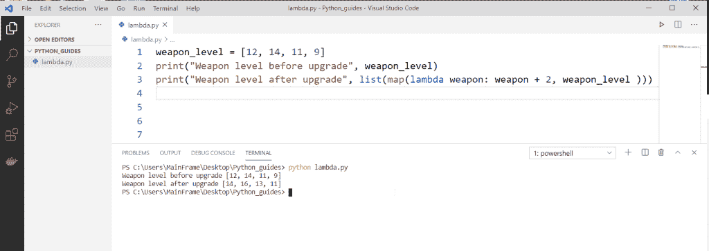
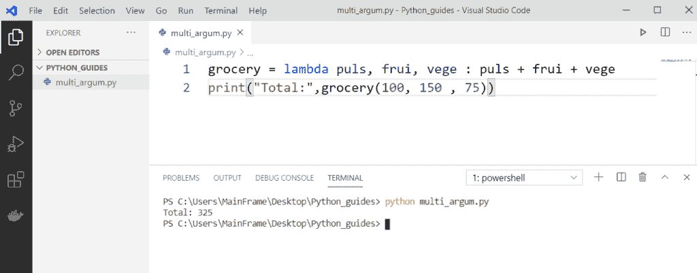

# Python 匿名函数(Lambda 函数)

> 原文：<https://pythonguides.com/python-anonymous-function/>

[](https://sharepointsky.teachable.com/p/python-and-machine-learning-training-course)

在本 [python 教程](https://pythonguides.com/python-hello-world-program/)中，我们将讨论什么是 **Python 匿名函数**，什么是 python 中的 **Lambda 函数。此外，我们将看到以下主题:**

*   Python 中带 lambda 的匿名函数
*   没有 lambda 的匿名函数
*   Python 中的匿名函数多行
*   Python 中作为参数的匿名函数
*   无参数匿名函数
*   Python 中的匿名函数示例
*   python 匿名函数回调
*   匿名函数多参数
*   Python 字典中的匿名函数
*   Python 匿名函数作为参数
*   Python 中的匿名函数映射
*   没有 if-else 的 Python lambda 函数
*   带过滤器的 Python lambda 函数
*   带有 if-else 的 Python lambda 函数
*   square 上的 Python lambda 函数示例
*   立方体上的 Python lambda 函数示例
*   带 reduce 的 Python lambda 函数

目录

[](#)

*   [Python 匿名函数](#Python_Anonymous_function "Python Anonymous function")
*   [带 lambda 的 Python 匿名函数](#Python_anonymous_function_with_lambda "Python anonymous function with lambda")
*   [没有 lambda 的 Python 匿名函数](#Python_anonymous_function_without_lambda "Python anonymous function without lambda")
*   [Python 匿名函数多行](#Python_anonymous_function_multiple_lines "Python anonymous function multiple lines")
*   [Python 中作为参数的匿名函数](#Anonymous_function_as_argument_in_Python "Anonymous function as argument in Python")
*   [没有参数的 Python 匿名函数](#Python_anonymous_function_without_argument "Python anonymous function without argument")
*   [Python 中的匿名函数回调](#Anonymous_function_callback_in_Python "Anonymous function callback in Python")
*   [匿名函数多参数](#Anonymous_function_multiple_arguments "Anonymous function multiple arguments")
*   [Python 字典中的匿名函数](#Anonymous_function_in_a_Python_dictionary "Anonymous function in a Python dictionary")
*   [Python 匿名函数作为参数](#Python_anonymous_function_as_a_parameter "Python anonymous function as a parameter")
*   [Python 中使用地图的匿名函数](#Anonymous_function_using_map_in_Python "Anonymous function using map in Python")
*   [Python 中的匿名函数示例](#Anonymous_function_examples_in_Python "Anonymous function examples in Python")
*   [没有 if-else 的 Python lambda 函数](#Python_lambda_function_without_if-else "Python lambda function without if-else")
*   [带过滤器的 Python lambda 函数](#Python_lambda_function_with_filter "Python lambda function with filter")
*   [带 if-else 的 Python lambda 函数](#Python_lambda_function_with_if-else "Python lambda function with if-else")
*   [Python lambda 函数在正方形上的例子](#Python_lambda_function_example_on_square "Python lambda function example on square")
*   [立方体上的 Python lambda 函数示例](#Python_lambda_function_example_on_cube "Python lambda function example on cube")
*   [Python lambda 函数带 reduce](#Python_lambda_function_with_reduce "Python lambda function with reduce ")

## Python 匿名函数

Python 有两种类型的函数，例如:

1.  **正常功能**:

Python 中一个普通的[函数是使用“ `def` 关键字定义的。我们可以写多行，它可以有多个表达式。](https://pythonguides.com/function-in-python/)

**举例:**

这是一个简单的程序，显示一个口袋妖怪的名字和力量。它接受两个参数并显示消息。


```py
def pokemon(name, power):
    return print(f'This is {name}, he can {power}.')

pokemon('pikachu', 'thunderbolt')
```

**输出**

这个程序在显示消息**后接受了名字&力量:这是皮卡丘，他会雷电。**

2.**匿名功能**:

*   Python 匿名函数也被称为 **Lambda 函数**。使用的关键字是**λ**，它们写在一行中，并且只能有一个表达式。这些函数不需要定义或命名，它们是一次性使用的。
*   Python 匿名函数在高级用户中很受欢迎，因为它省时省力&内存。虽然代码可读性变差了，但工作得很好。

## 带 lambda 的 Python 匿名函数

让我们看看如何用 lambda 创建一个 Python 匿名函数。

*   **Python Lambda 函数**是一个没有名字&的单行函数，用于一次性任务。
*   一次性任务，如执行算术运算、排序名称、循环等。
*   它使代码变得非常小，但是由于 lambda 是一个高级特性，代码变得可读性更差。

**语法:**

```py
lambda parameter : action(parameter)
```

**举例:**

在下面的例子中，玩家拥有的所有武器都可以免费升级。所以不管现在的武器等级是多少，都会升级 2 级。



Python anonymous function with lambda

**代码:**

```py
weapon_level = [12, 14, 11, 9]
print("Weapon level before upgrade", weapon_level)
print("Weapon level before upgrade",list(map(lambda weapon: weapon + 2, weapon_level )))
```

读取 [Python while 循环多个条件](https://pythonguides.com/python-while-loop-multiple-conditions/)

## 没有 lambda 的 Python 匿名函数

*   **Python 匿名函数**是用关键字' `lambda` 定义的，所以技术上没有 lambda 就没有匿名函数的作用域。
*   但是有实例表明可以使用构造函数来实现。
*   构造函数初始化一个类的对象，并使用关键字`__init__`来定义。
*   但另一方面，它不满足匿名函数的条件。由于**匿名函数**本身是完整的，没有名字&仅用于一次性任务。
*   总之，**构造函数**不能被认为是匿名函数。

**语法**:

```py
class <Name>(object):
     def __init__(self, n1, n2):
         self.n1 = n1
         self.n2 = n2 
```

**举例**:

这是一个 **Python 构造函数**的例子，其中将显示玩家的名字&排名。


Python anonymous function without lambda

**代码:**

```py
class Game():
    def __init__(self, name, rank):
       self.name = name
       self.rank = rank

p1 = Game('Alpha', 1)
p2 = Game('Delta', 4)
print(p1.name, p1.rank) 
```

**输出:**

因为我们只打印了 `p1` 的细节，所以输出将是 `Alpha 1`

## Python 匿名函数多行

*   **匿名函数**是应用于特定任务的单行命令或函数。
*   **Python lambda 函数**可以有多个参数，但只能有一个表达式。
*   所以看了上面的语句，没有办法创建多行 lambda 函数。
*   如果程序有多个表达式，建议创建普通函数。

## Python 中作为参数的匿名函数

*   实参是参数的输入。
*   如果有任何参数分配给函数，那么该参数需要一个用户参数作为值。
*   在添加功能中，如果“ **a & b** ”被指定为参数，那么用户需要提供输入，该输入将被放置在“ **a & b** ”中。比方说“ **2 & 3** ”。现在它会给出输出为**“2+3 = 5”**。

**举例**:

在下面的例子中，用户将提供一个参数，该参数将被添加到总账单中。


anonymous function as argument in python

**代码:**

```py
bill = lambda tip: tip + 10
print(bill(5))
```

所以在这里，函数被创建&参数**‘tip’**被传递。现在打印时，账单是 5 英镑+ 10 英镑作为小费，所以总共是 15 英镑。这里 5 是自变量。

**输出:**

在本例中，顾客购买了金额为`5`的商品，并支付了 `10` 作为小费。所以输出是 `5 + 10 = 15` 。这里 5 是用户提供的参数。

阅读 [Python 创建空集](https://pythonguides.com/python-create-empty-set/)

## 没有参数的 Python 匿名函数

*   参数是调用函数时需要传递的值。
*   参数使程序变得动态。
*   但有时我们想给程序提供静态值。在这种情况下，创建的函数没有任何参数&用户不需要提供任何参数。在下面的例子中，我们将看到一个没有参数的匿名函数。

**语法**

```py
variable_name = lambda : value
print(variable_name()) 
```

**举例:**

我们在一个水果市场，每个水果都有不同的价格。我们正在打印总价。这个匿名函数没有参数。因此，无论什么函数被称为关联价格，都将应用于它。


Python anonymous function without argument

**代码:**

```py
apple = lambda : 50
mango = lambda : 40
coconut = lambda : 35

print("Total:",apple()+mango())
```

**输出:**

由于苹果和芒果在这里被称为苹果**和芒果**所以定义价格 `50 + 40` 适用。总计变成: `90`****

## Python 中的匿名函数回调

*   程序员广泛使用一行语句来调用函数。
*   在这种情况下，使用 Python lambda 函数一次或多次调用预定义的函数。
*   最常见的例子是“计算器”，其中函数是通过每个键上的 lambda 函数单独创建和调用的。

**举例**:

这是一个计算器模块的例子，其中一个按钮被点击时打印出来。在后端，每次点击都会调用函数。


anonymous function callback in python

**代码:**

```py
from tkinter import *

numbers = "" 
def recClick(n): 
    global numbers
    numbers = numbers + str(n) 
    rec.set(numbers) 

if __name__ == "__main__": 
    w = Tk() 
    rec = StringVar() 
    disp = Entry(w, textvariable=rec).pack() 
    rec.set('') 
    Button(w, text=' 1 ', command=lambda: recClick(1)).pack()

    w.mainloop() 
```

**输出:**

代码打开时的输出窗口有**&**按钮**。按钮保持在文本栏上打印 `1` 。每当点击一个按钮，就会调用一个函数。**

 **## 匿名函数多参数

*   多个参数可以传递给一个类似于普通函数的匿名函数。
*   对于传递开发人员想要的任意多个参数没有限制，但是只能有一个表达式。
*   换句话说，不管通过了什么样的论点，任务都是一样的。让我们用一个例子来更好地理解它。

**举例:**

在本例中，杂货店有多种商品。用户购买很少。结账时，商店经理手动为每个商品提供值，以生成总账单。



Python anonymous function multiple arguments

**代码:**

```py
grocery = lambda puls, frui, vege : puls + frui + vege
print("Total:",grocery(100, 150 , 75))
```

**输出:**

所以在这里，以 **100，50，75** 形式的多个参数被传递&生成的输出是 `325` 这是所有项的总和。

## Python 字典中的匿名函数

*   **Python 匿名函数**用于在 [Python 字典](https://pythonguides.com/create-a-dictionary-in-python/)中存储一组指令，并在需要时使用。
*   它是以键值格式实现的。
*   Lambda 仅在值上实现。

**语法**:

```py
name = {
     'unique-key-name' : lambda parameter : expression
}
```

**举例:**

游戏中的健康、提升、升级等都存储在一个字典中&只要用户点击专用按钮，它们就会被调用。就像当用户点击心形图标时，健康栏会增加一定的百分比。


Python anonymous function in a dictionary

**代码:**

```py
extras = {
    'health' : lambda health : health + 5,
    'boost' : lambda speed : speed * 2,
    'upgrade' : lambda level : level + 1
}

print(extras['health'](5))
print(extras['boost'](100))
print(extras['upgrade'](10))
```

**输出:**

因此，在这个例子中，用户当前的生命值增加了 5 格，速度提高了 2 倍，等级提高了 1 级。所以上面代码的输出 doe 是 **10，200，11** 。

## Python 匿名函数作为参数

*   参数是创建函数时使用的名称。
*   `def toys(p,b):` p & b 是这里的参数。
*   参数起着重要的作用，因为它增加了程序的灵活性。
*   参数需要用户输入。

**举例:**

在本例中， **lambda 函数**在普通函数中作为参数被调用。餐馆的总账单包括小计(食物价格)+小费。


Python anonymous function as a parameter

**代码:**

```py
def restaurant(bill):
   return lambda tip :  tip + bill

sub_total = restaurant(200)
total = sub_total(20)
print(total)
```

**输出:**

食物的价格是 `200` 和 `20` 小费。因此，客户需要支付的总金额为 `200 + 20 = 220`

## Python 中使用地图的匿名函数

*   映射功能用于简化程序。
*   它以函数后跟迭代作为参数。
*   Map 是高级程序员广泛使用的函数之一，因为它便于在每次迭代中单独实现函数。

**语法**:

```py
map(function, iterations)
```

**例子**:

由于游戏中的一个小故障，每个人的钱包里都增加了 10 枚硬币。玩家已经有了一些平衡，现在又增加了 10 个。让我们在程序中看到这一点。


Python anonymous function using map

**代码:**

```py
cur_bal = [223, 112, 32, 71]
new_bal = lambda cur_bal : cur_bal + 10
print(list(map(new_bal, cur_bal)))
```

你可能会想为什么我们在这里使用了**列表**。如果没有 list，它将只给我们输出的内存位置。下面是不使用列表的输出。

```py
<map object at 0x00000257F97A9648>
```

**输出:**

因此，用户的当前余额为**【223，112，32，71】**，但在应用该功能后，余额变为`[233, 122, 42, 81 ]`

## Python 中的匿名函数示例

**Python 匿名函数**是 Python 中的重要概念之一，可以帮助你减少代码行数。下面是 Python 中匿名函数的几个**例子。**

**举例:**

*   在这里，我们分发巧克力和冰淇淋。但是条件是 10 分以下可以得到巧克力，10 分以上可以得到冰淇淋。我们在这里使用了过滤器和地图。过滤器用于根据年龄对学生进行分类。
*   地图用于显示 2 年后学生的年龄。这意味着每次迭代都加 2。

**过滤器:**

*   这是一个用于过滤列表项的函数。
*   它以函数和迭代作为参数。
*   如果该功能不适用，则**无**应提供。

**语法**:

```py
filter(function, iteration)
```


anonymous function example in python

**代码片段**:

```py
below_10 = lambda b10 : b10 < 10
above_10 = lambda a10 : a10 >= 10

student_age = [18, 10, 7, 16, 12, 5, 6, 8, 4]

below_ten = list(filter(below_10, student_age))
print("Chocolate: ",list(below_ten))

above_ten = list(filter(above_10, student_age))
print("ice cream : ", above_ten)

# age 2 years later
age_now = map(lambda age: age + 2, student_age)
print(list(age_now))
```

**输出:**

*   在第一种情况下，显示 10 岁以下的学生:巧克力:**【7，5，6，8，4】**
*   在第二种情况下，显示 10 岁以上的学生:冰淇淋:**【18，10，16，12】**
*   在第三种情况下，显示 2 岁后的学生年龄:**【20，12，9，18，14，7，8，10，6】**

lambda 函数是一个匿名函数，它可以接受许多参数，但只有一个表达式。

## 没有 if-else 的 Python lambda 函数

现在，我们可以看到 python 中没有 if-else 的 **lambda 函数**

*   在这个例子中，我将一个变量作为一个**数**并使用 lambda 函数，然后使用 **y > 5 和 y < 25** 条件。
*   为了得到输出，我使用了 **print(数字(10))** 和 **print(数字(30))** 。

示例:

```py
number = lambda y : y > 5 and y < 25
print(number(10))
print(number(30))
```

该条件对数字 10 有效，因此**输出为真**，对数字 30 无效，因此**输出为假**。您可以参考下面的输出截图。


Python lambda function without if-else

## 带过滤器的 Python lambda 函数

现在，我们可以看到 python 中带有过滤器的λ函数

 ***   在这个例子中，我将列表作为一个**号**，并将一些值赋给列表作为**号=【3，6，10，25，17，9，30，-5】**。
*   **multiple _ of _ 3 = list(filter(lambda n:n % 3 = = 0，number))** 用于获取新的列表。
*   为了得到新的列表，我使用了过滤函数。 `filter()` 方法从 iterable 的元素中构造一个迭代器。
*   lambda 函数对列表中的所有数字运行，并返回输出。
*   **n%3 == 0** 用于从给定列表中获取 3 的倍数。
*   为了得到输出，我使用了 `print(multiple_of_3)` 。

示例:

```py
number = [3,6,10, 25, 17, 9, 30, -5]
multiple_of_3 = list(filter(lambda n : n%3 == 0, number))
print(multiple_of_3) 
```

在下面的截图中，你可以看到输出是 3 的倍数。


Python lambda function with filter

## 带 if-else 的 Python lambda 函数

在这里，我们可以看到 python 中带有 if-else 的 **lambda 函数**

*   在这个例子中，我将一个变量作为一个**数**并使用了**λx**函数，这个函数有许多参数，并且只有一个表达式被求值并返回。
*   我使用了 if-else 条件，如果给定值满足 **if 条件**它返回 `true else` 它返回 false。
*   这里，我取了两个数字，比如 12 和 30，为了得到输出，我使用了 **print(number(12))、print(number(30))。**

示例:

```py
number= lambda x : True if (x >= 2 and x < 20) else False
print(number(12))
print(number(30)) 
```

数字 12 满足条件，所以它返回 true，而数字 30 不满足条件，所以它返回 false。您可以参考下面的输出截图。


Python lambda function with if-else

## Python lambda 函数在正方形上的例子

在这里，我们可以看到**如何在 python 中求数字**的平方

*   在这个例子中，我定义了一个函数 square 为 **def square(y):** 和 `return y*y` 用于计算给定数的平方。
*   我已经把 lambda 函数用成了 **square = lambda y: y*y** 。为了得到输出，我使用了 **print(square(4))。**

示例:

```py
def square(y): 
    return y*y
square = lambda y: y*y 
print(square(4)) 
```

在下面的截图中，我们可以看到 4 的平方是 16。


Python lambda function square example

## 立方体上的 Python lambda 函数示例

现在，我们可以看到**如何使用 python 中的 lambda 函数**找到该数字的立方

*   在这个例子中，我将一个函数立方体定义为一个 **def cube(y):** ，为了计算立方体值，我使用了 **return y*y*y，**和 lambda 函数 **cube = lambda y: y*y*y** 。
*   为了得到输出，我使用了 print(cube(2))。

示例:

```py
def cube(y): 
    return y*y*y
cube = lambda y: y*y*y
print(cube(2)) 
```

我们可以看到 2 的立方也就是 8 作为输出。您可以参考下面的输出截图。


Python lambda function cube example

## Python lambda 函数带 reduce

现在，我们可以看到 python 中带有 reduce 的 **lambda 函数**

*   `reduce` 函数用于将传入其参数的特定函数应用于列表中的所有元素。
*   在这个例子中，我从 `functools` 中导入了一个名为 `reduce` 的模块，我定义了一个列表为**list =【2，4，5】**，并声明了一个名为 `sum` 的变量来存储减少的值。
*   lambda 函数对列表中的所有项目运行，它返回列表中所有数字的乘积。
*   我已经用 `print(sum)` 打印了 reduce 函数返回的结果。

示例:

```py
from functools import reduce
list = [2,4,5]
sum = reduce (lambda a, b: a*b, list)
print(sum)
```

在下面的截图中，您可以看到列表中所有数字的乘积作为输出。


Python lambda function with reduce

您可能会喜欢以下 Python 教程:

*   [Python 访问修饰符+示例](https://pythonguides.com/python-access-modifiers/)
*   [Python 读取 CSV 文件并写入 CSV 文件](https://pythonguides.com/python-read-csv-file/)
*   [Python 数组与示例](https://pythonguides.com/python-array/)
*   [python 中的哈希表](https://pythonguides.com/hash-table-in-python/)
*   [Python 中的块缩进](https://pythonguides.com/block-indentation-in-python/)
*   [Python 从路径中获取文件名](https://pythonguides.com/python-get-filename-from-the-path/)
*   [Python For 循环示例](https://pythonguides.com/python-for-loop/)
*   [Python 创建空集](https://pythonguides.com/python-create-empty-set/)
*   [使用蟒蛇龟绘制彩色填充形状](https://pythonguides.com/draw-colored-filled-shapes-using-python-turtle/)
*   [使用 if-else 理解 Python 列表](https://pythonguides.com/python-list-comprehension-using-if-else/)
*   [Python Tkinter Stopwatch](https://pythonguides.com/python-tkinter-stopwatch/)

在本 python 教程中，我们学习了:

*   **什么是 Python 匿名函数**
*   **python 中的 Lambda 函数是什么**
*   带有 lambda 的 Python 匿名函数
*   Python 中不带 lambda 的匿名函数
*   匿名函数多行
*   匿名函数作为参数
*   Python 中无参数的匿名函数
*   Python 匿名函数示例
*   Python 中的匿名函数回调
*   Python 中的匿名函数多参数
*   字典中的 Python 匿名函数
*   Python 匿名函数作为参数
*   Python 匿名函数图
*   没有 if-else 的 Python lambda 函数
*   带过滤器的 Python lambda 函数
*   带有 if-else 的 Python lambda 函数
*   square 上的 Python lambda 函数示例
*   立方体上的 Python lambda 函数示例
*   带 reduce 的 Python lambda 函数

[Bijay Kumar](https://pythonguides.com/author/fewlines4biju/)

Python 是美国最流行的语言之一。我从事 Python 工作已经有很长时间了，我在与 Tkinter、Pandas、NumPy、Turtle、Django、Matplotlib、Tensorflow、Scipy、Scikit-Learn 等各种库合作方面拥有专业知识。我有与美国、加拿大、英国、澳大利亚、新西兰等国家的各种客户合作的经验。查看我的个人资料。

[enjoysharepoint.com/](https://enjoysharepoint.com/)[](https://www.facebook.com/fewlines4biju "Facebook")[](https://www.linkedin.com/in/fewlines4biju/ "Linkedin")[](https://twitter.com/fewlines4biju "Twitter")****