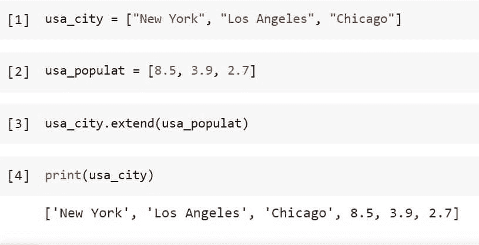
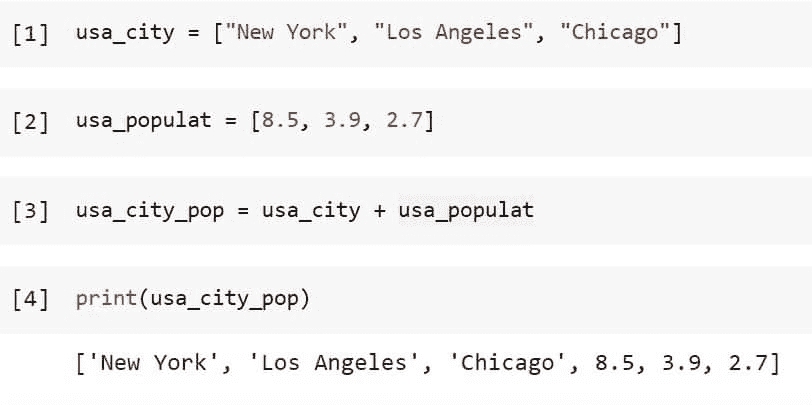
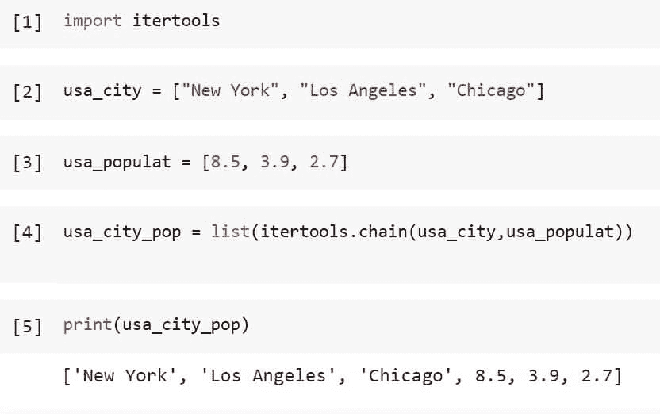
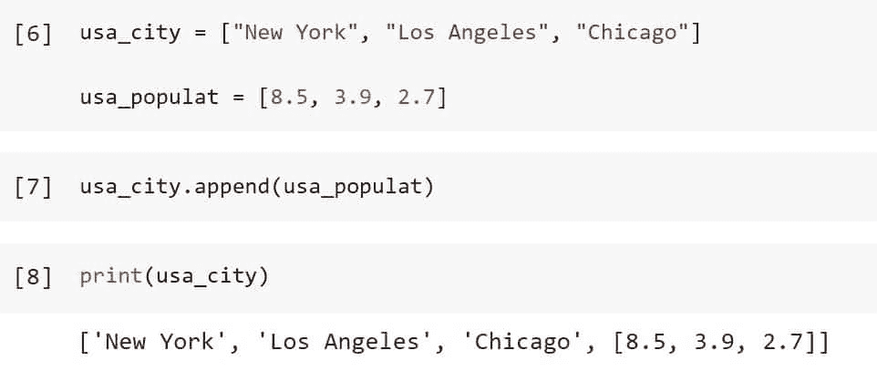
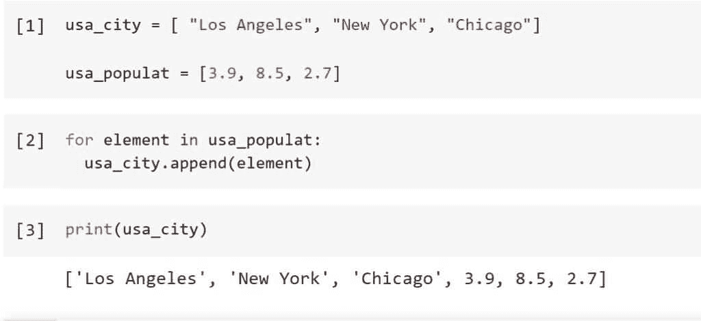
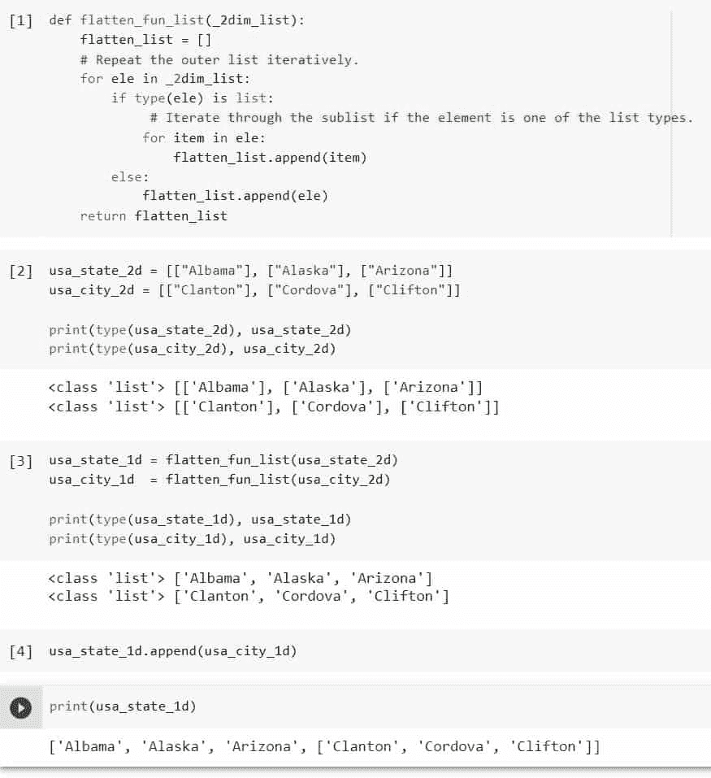
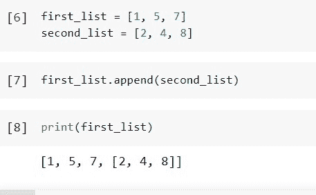
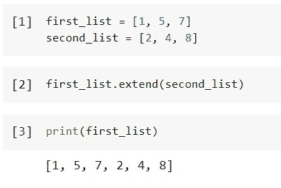

# 如何用 Python 将列表追加到另一个列表中

> 原文：<https://pythonguides.com/python-append-list-to-another-list/>

[](https://sharepointsky.teachable.com/p/python-and-machine-learning-training-course)

在这个 [Python 教程](https://pythonguides.com/python-programming-for-the-absolute-beginner/)中，我们将学习“ ***Python 追加列表到另一个列表*** ”，在这里我们将理解 ***如何使用下面的例子在 Python*** 中将一个列表追加到另一个列表。

*   如何在 Python 中将一个列表追加到另一个列表
*   如何在 Python 中使用 for 循环将一个列表追加到另一个列表
*   如何在 Python 中将一个列表追加到另一个列表展平
*   如何在 Python 中将一个列表附加到另一个没有括号的列表

目录

[](#)

*   [Python 将列表追加到另一个列表中](#Python_Append_List_to_Another_List "Python Append List to Another List")
    *   [如何使用 extend()方法在 Python 中将一个列表追加到另一个列表中](#How_to_append_a_list_to_another_list_in_Python_using_extend_method "How to append a list to another list in Python using extend() method")
    *   [如何在 Python 中使用串联(+)操作符将一个列表追加到另一个列表中](#How_to_append_a_list_to_another_list_in_Python_using_the_concatenation_operator "How to append a list to another list in Python using the concatenation (+) operator")
    *   [如何使用 chain()方法在 Python 中将一个列表追加到另一个列表中](#How_to_append_a_list_to_another_list_in_Python_using_the_chain_method "How to append a list to another list in Python using the chain() method")
    *   [如何使用 append()方法在 Python 中将一个列表追加到另一个列表中](#How_to_append_a_list_to_another_list_in_Python_using_the_append_method "How to append a list to another list in Python using the append() method")
*   [Python 将列表追加到另一个列表进行循环](#Python_Append_List_to_Another_List_For_Loop "Python Append List to Another List For Loop")
*   [Python 追加列表到另一个列表展平](#Python_Append_List_to_Another_List_Flatten "Python Append List to Another List Flatten")
*   [Python 将列表附加到另一个列表，不带括号](#Python_Append_List_to_Another_List_Without_Brackets "Python Append List to Another List Without Brackets")

## Python 将列表追加到另一个列表中

在本节中，我们将使用不同的方法将一个列表追加到另一个列表中。

### 如何使用 extend()方法在 Python 中将一个列表追加到另一个列表中

Python 中的列表有一个名为 `extend()` 的内置函数，它将一个 iterable 作为参数添加到当前 iterable 的末尾。当用于列表时，它将在主列表的最后一项后添加列表参数。

语法如下所示

```py
list_name1.extend(list_name2)
```

其中来自**列表名称 2** 的元素被添加到来自**列表名称 1** 的元素中。

例如，使用下面的代码创建两个列表，一个包含美国城市的名称，另一个包含该城市的人口。

```py
usa_city = ["New York", "Los Angeles", "Chicago"]

usa_populat = [8.5, 3.9, 2.7]
```

使用以下代码将第二个列表“usa_populat”追加到第一个列表“usa_city”中。

```py
usa_city.extend(usa_populat)
```

使用下面的代码检查第一个列表的第二个附加列表。

```py
print(usa_city)
```



Python Append List to Another List Using Extend Function

这就是如何使用 Python 的 *`extend()`* 将一个列表追加到另一个列表中。

### 如何在 Python 中使用串联(+)操作符将一个列表追加到另一个列表中

使用 Python 的列表连接特性，允许将几个列表加在一起的+操作符是另一个简单的选择。如果我们简单地对现有的列表变量使用串联(+)操作，那么输出将是一个按照操作数顺序排列的合并列表。

让我们通过一个例子来看看如何按照下面的步骤使用串联(+)操作符将一个列表附加到另一个列表:

使用下面的代码创建两个列表，一个包含美国城市的名称，另一个包含该城市的人口。

```py
usa_city = ["New York", "Los Angeles", "Chicago"]

usa_populat = [8.5, 3.9, 2.7]
```

使用串联(+)运算符将列表“usa_populat”添加到“usa_city ”,并使用以下代码将其存储在新列表中。

```py
usa_city_pop = usa_city + usa_populat
```

使用以下代码查看新列表“美国城市流行”。

```py
print(usa_city_pop)
```



Python Append List to Another List Using Concatenation Operator

这就是如何使用 Python 的 ***串联(+)运算符*** 将一个列表追加到另一个列表。

### 如何使用 chain()方法在 Python 中将一个列表追加到另一个列表中

itertools 是一个 Python 包，为 iterables 提供了快速有效的实用技术。此模块中的函数 `chain()` 接收相同类型的可变数量的可重复项，并根据参数以预定的顺序将它们连接起来。 `chain()` 函数可用于追加多个列表以创建单个列表。

使用下面的代码导入所需的库或方法。

```py
import itertools
```

使用下面的代码创建两个列表，一个包含美国城市的名称，另一个包含该城市的人口。

```py
usa_city = ["New York", "Los Angeles", "Chicago"]

usa_populat = [8.5, 3.9, 2.7]
```

使用 chain()函数将列表“usa_populat”添加到“usa_city”中，并使用以下代码将其存储在新列表中。

```py
usa_city_pop = list(itertools.chain(usa_city,usa_populat)) 
```

使用下面的代码打印新列表“usa_city_pop”的值。

```py
print(usa_city_pop)
```



Python Append List to Another List Using Chain Function

这就是如何使用 Python 中 itertools 模块的 *`chain()`* 函数将一个列表追加到另一个列表中。

### 如何使用 append()方法在 Python 中将一个列表追加到另一个列表中

使用下面的代码创建两个列表，一个包含美国城市的名称，另一个包含该城市的人口。

```py
usa_city = ["New York", "Los Angeles", "Chicago"]

usa_populat = [8.5, 3.9, 2.7]
```

使用 append()函数将列表“usa_populat”添加到“usa_city”中，并使用以下代码将其存储在新列表中。

```py
usa_city.append(usa_populat)
```

使用下面的代码查看添加到另一个列表的列表。

```py
print(usa_city)
```



Python Append List to Another List Using Append Function

这就是如何使用 Python 的 *`append()`* 函数将一个列表追加到另一个列表中。

阅读: [Python 检查变量是否为整数](https://pythonguides.com/python-check-if-the-variable-is-an-integer/)

## Python 将列表追加到另一个列表进行循环

此外，我们可以使用 `list.append()` 函数，通过在 for 循环中遍历第二个列表的元素，将第二个列表中的每个元素追加到第一个列表中。

让我们以下面的步骤为例:

使用下面的代码，创建两个列表，一个包含美国城市的名称，另一个包含每个城市的人口。

```py
usa_city = [ "Los Angeles", "New York", "Chicago"]

usa_populat = [3.9, 8.5, 2.7]
```

定义 for 循环，并在 for 循环中使用 append()函数，使用下面的代码将列表“usa_populat”追加到另一个列表“usa_city”中。

```py
for element in usa_populat:
  usa_city.append(element)
```

使用下面的代码检查附加列表“usa_populate”到另一个列表“usa_city”。

```py
print(usa_city)
```



Python Append List to Another List For Loop

这就是如何在 Python 的循环中使用 *`append()`* 函数将一个列表追加到另一个列表中。

阅读:[值错误:Python 中的数学域错误](https://pythonguides.com/valueerror-math-domain-error/)

## Python 追加列表到另一个列表展平

最灵活的 Python 数据结构是列表。与 2D 列表相反，它通常被称为列表的列表，是一个列表对象，其中每个项目本身就是一个列表。

当列表的列表被展平时，列表列表中的每一项都被取消嵌套到单个列表中，例如将[[2，1，3]，[6，5，4]，[7，9，8]]变为[2，1，3，6，5，4，7，9，8]。

根据嵌套列表的规则性和深度，在 Python 中可以通过嵌套列表理解、for 循环、内置函数或递归函数或者通过导入库来实现扁平化。

在本节中，我们首先将 2d 列表转换为 1d 列表，然后按照以下步骤将一个列表附加到另一个列表:

首先，使用下面的代码创建将二维列表转换为一维列表的函数。

```py
def flatten_fun_list(_2dim_list):
    flatten_list = []
    # Repeat the outer list iteratively.
    for ele in _2dim_list:
        if type(ele) is list:
             # Iterate through the sublist if the element is one of the list types.
            for item in ele:
                flatten_list.append(item)
        else:
            flatten_list.append(ele)
    return flatten_list
```

然后使用下面的代码创建两个 2d 列表。

```py
usa_state_2d = [["Albama"], ["Alaska"], ["Arizona"]]
usa_city_2d = [["Clanton"], ["Cordova"], ["Clifton"]]

print(type(usa_state_2d), usa_state_2d)
print(type(usa_city_2d), usa_city_2d)
```

通过使用下面的代码将上面的两个列表传递到函数“flatten_fun_list()”中，将它们展平为一个 1d 列表。

```py
usa_state_1d = flatten_fun_list(usa_state_2d)
usa_city_1d  = flatten_fun_list(usa_city_2d)

print(type(usa_state_1d), usa_state_1d)
print(type(usa_city_1d), usa_city_1d)
```

使用 Append()函数追加展平列表。

```py
usa_state_1d.append(usa_city_1d)
```

使用下面的代码查看附加列表。

```py
print(usa_state_1d)
```



Python Append List to Another List Flatten

阅读:[检查一个数是否是素数 Python](https://pythonguides.com/check-if-a-number-is-a-prime-python/)

## Python 将列表附加到另一个列表，不带括号

如果我们看一下上面的小节，append()函数用于将一个列表追加到另一个列表。结果是另一个列表中的列表，让我们以下面的步骤为例:

使用下面的代码创建两个不同的列表。

```py
first_list = [1, 5, 7]
second_list = [2, 4, 8]
```

使用 Append()函数将 second_list 追加到 first_list。

```py
first_list.append(second_list)
```

使用下面的代码查看附加列表。

```py
print(first_list)
```



Python Append List to Another List Without Brackets Example

在上面的输出中，我们可以看到“second_list”被附加到“first_list”作为一个单独的列表，或者用括号括起来作为[1，5，7，[2，4，8]]，但是我们希望它作为一个没有括号的“first_list”中的“second_list”的列表。为了实现这种列表，我们将使用另一个名为 extend()的函数。

使用下面的代码，使用 extend()函数将“second_list”附加到“first_list”后，不带括号。

```py
first_list.extend(second_list)
```

使用下面的代码检查列表。

```py
print(first_list)
```



Python Append List to Another List Without Brackets

这就是如何使用 Python Scipy 的函数 `extend()` 将一个列表附加到另一个列表中，而不用括号。

您可能也喜欢阅读以下 Python 教程。

*   [获取当前目录 Python](https://pythonguides.com/get-current-directory-python/)
*   [在 Python 中创建一个元组](https://pythonguides.com/create-a-tuple-in-python/)
*   [在 Python 中创建一个空数组](https://pythonguides.com/create-an-empty-array-in-python/)
*   [Python if else with examples](https://pythonguides.com/python-if-else/)
*   [使用 For 循环在 Python 中添加列表元素](https://pythonguides.com/add-elements-in-list-in-python-using-for-loop/)

在 Python 教程的最后，我们学习了如何在 Python 中将一个列表追加到另一个列表中。此外，我们还讨论了以下主题。

*   如何在 Python 中将一个列表追加到另一个列表
*   如何在 Python 中使用 for 循环将一个列表追加到另一个列表
*   如何在 Python 中将一个列表追加到另一个列表展平
*   如何在 Python 中将一个列表附加到另一个没有括号的列表

[Saurabh](https://pythonguides.com/author/saurabh/)

我叫 Kumar Saurabh，是一名 Python 开发人员，在 TSInfo Technologies 工作。此外，像 Python 编程，SciPy，机器学习，人工智能等技术的专业知识。是我喜欢做的事情。