# Python 数组及示例

> 原文：<https://pythonguides.com/python-array/>

[](https://sharepointsky.teachable.com/p/python-and-machine-learning-training-course)

在本 [Python 教程](https://pythonguides.com/python-download-and-installation/)中，我们将讨论什么是 Python 中的数组，以及如何将列表用作数组。我们还将通过在 [Python](https://pythonguides.com/python-hello-world-program/) 中导入一个数组模块来创建一个数组，我们还将看到一些例子。

*   python 中的数组
*   从数组中访问元素 python
*   Python 数组更新元素
*   python 中数组的长度
*   在 python 中添加数组元素
*   在 python 中删除数组元素
*   python 中数组元素的循环
*   python 中的数组模块是什么
*   创建 python 数组
*   在 python 中访问数组元素
*   在 python 数组中追加项目
*   在 python 数组中插入元素
*   在 python 中扩展数组
*   在 python 中从数组中移除元素
*   从数组 python 中移除最后一个元素
*   反转数组 python
*   Python 计算数组中元素的出现次数
*   在 python 中将数组转换为列表
*   在数组 python 中查找元素的索引
*   Python 更新数组中的元素
*   Python 列表与数组
*   Python 列表到 numpy 数组
*   数组的 Python 含义
*   两个数组的 Python 含义
*   python 数组的最小值
*   python 数组的最大值
*   2d 数组上的 Python 最小值
*   2d 数组上的 Python 最大值

让我们试着用例子来理解关于 **Python 数组**的细节。

目录

[](#)

*   [什么是 Python 数组？](#What_is_a_Python_Array "What is a Python Array?")
*   [从数组中访问元素 python](#Access_elements_from_Arrays_python "Access elements from Arrays python")
*   [Python 数组更新元素](#Python_Array_update_element "Python Array update element")
*   [Python 中数组的长度](#Length_of_an_Array_in_Python "Length of an Array in Python")
*   [在 Python 中添加数组元素](#Add_Array_elements_in_Python "Add Array elements in Python")
*   [删除 Python 中的数组元素](#Delete_Array_elements_in_Python "Delete Array elements in Python")
*   [在 Python 中循环数组元素](#Loop_in_Array_elements_in_Python "Loop in Array elements in Python")
*   [Python 中的数组模块是什么](#What_is_an_array_module_in_Python "What is an array module in Python")
*   [创建一个 Python 数组](#Create_a_Python_Array "Create a Python Array")
*   [在 Python 中访问数组元素](#Accessing_Array_elements_in_Python "Accessing Array elements in Python")
*   [在 Python 数组中追加项目](#Append_item_in_array_Python "Append item in array Python")
*   [在数组 Python 中插入元素](#Insert_element_in_array_Python "Insert element in array Python")
*   [在 Python 中扩展数组](#Extend_array_in_Python "Extend array in Python")
*   [在 Python 中从数组中移除元素](#Remove_element_from_an_array_in_Python "Remove element from an array in Python")
*   [从 Python 数组中移除最后一个元素](#Remove_the_last_element_from_Python_array "Remove the last element from Python array")
*   [在 Python 中反转一个数组](#Reverse_an_array_in_Python "Reverse an array in Python")
*   [Python 计算数组中一个元素的出现次数](#Python_count_occurrence_of_an_element_in_an_array "Python count occurrence of an element in an array")
*   [在 Python 中把数组转换成列表](#Convert_array_to_list_in_Python "Convert array to list in Python")
*   [查找数组中元素的索引 Python](#Find_index_of_an_element_in_an_array_Python "Find index of an element in an array Python")
*   [Python 更新数组中的元素](#Python_update_the_element_in_an_array "Python update the element in an array")
*   [Python 列表 vs 数组](#Python_lists_vs_arrays "Python lists vs arrays")
*   [Python 列表到 numpy 数组](#Python_list_to_numpy_arrays "Python list to numpy arrays")
*   [Python 意味着一个数组](#Python_mean_of_an_array "Python mean of an array")
*   [Python 两个数组的平均值](#Python_mean_of_two_arrays "Python mean of two arrays")
*   [数组 python 的最小值](#Minimum_value_of_array_python "Minimum value of array python")
*   [数组 python 的最大值](#Maximum_value_of_array_python "Maximum value of array python")
*   [二维数组上的 Python 最小值](#Python_minimum_value_on_2d_array "Python minimum value on 2d array")
*   [二维数组上的 Python 最大值](#Python_maximum_value_on_2d_array "Python maximum value on 2d array")

## 什么是 Python 数组？

**什么是 Python 数组？**一个 **Python 数组**是用来一起存储多个相同类型值的项目集合。

**举例:**

```py
food = [fat, protein, vitamin]
print(food)
```

写完上面的代码(python 中的数组)，你将打印出 `" food "` ，然后输出将显示为 **" ["脂肪"、"蛋白质"、"维生素"] "** 。这里，我们创建了一个包含食物名称的数组。

你可以参考下面 python 中的截图数组

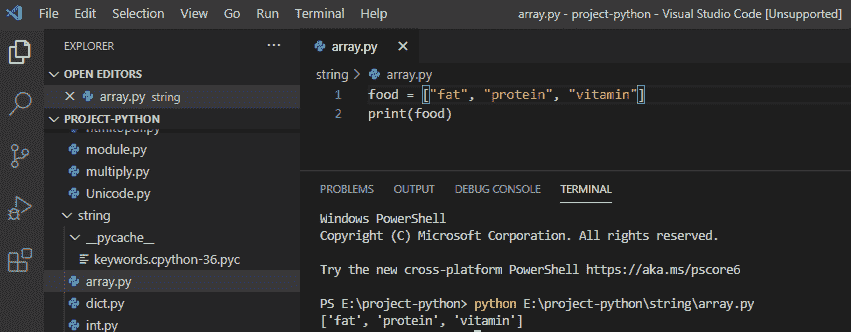

Python Array

## 从数组中访问元素 python

**如何从 Python 数组中访问元素？**在 python 中，访问数组项引用索引号。我们将使用索引操作符 **" [] "** 来访问数组中的条目。

```py
food = ["fat", "protein", "vitamin"]
a = [2]
print(a)
```

写完上面的代码(从 python 数组中访问元素)，你将打印出 `" a "` ，然后输出将显示为**"维生素"**。这里，我们使用索引号来访问数组中的元素。

你可以参考下面的截图访问数组 python 中的元素。

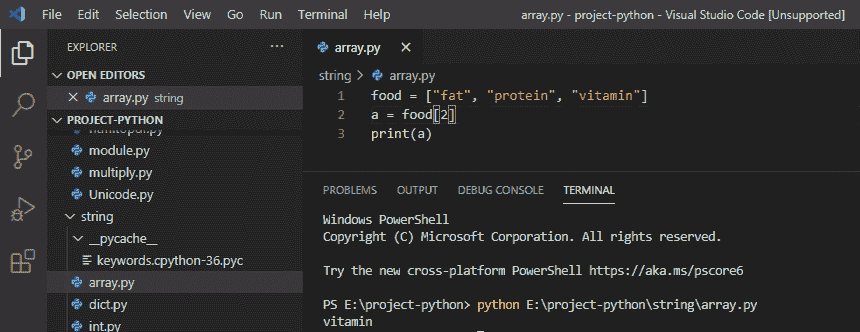

python access array elements

*   [如何在 python 中创建变量](https://pythonguides.com/create-python-variable/)
*   [Python 字典方法+示例](https://pythonguides.com/python-dictionary-methods/)
*   [11 Python 列表方法](https://pythonguides.com/python-list-methods/)

## Python 数组更新元素

**如何更新 Python 数组中的一个元素？**在 python 中，为了让**更新数组中的**元素，我们将为我们想要更新的指定索引重新分配一个新值。

```py
food = ["fat", "protein", "vitamin"]
food[0] = "mineral"
print(food)
```

写完上面的代码(python 数组更新元素)后，你将打印出 `" food "` ，然后输出将显示为 **" ["矿物质"、"蛋白质"、"维生素"]** `"` 。这里，我们将把新值重新分配给所需的索引。

你可以参考下面的截图 python 数组更新元素

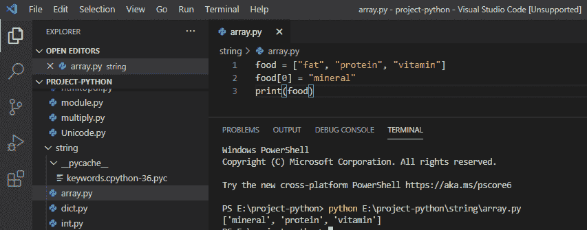

Python Array update element

## Python 中数组的长度

让我们检查一下**如何在 Python 中找到数组的长度？**在 python 中，我们将使用 `len()` 方法来寻找给定数组的长度。

```py
food = ["fat", "protein", "vitamin"]
a = len(food)
print(a)
```

写完上面的代码(python 中数组的长度)，你将打印出 `" a "` ，然后输出将显示为 **" 3 "。**这里，3 是一个数组的长度通过使用 len()方法我们得到一个数组的长度。

可以参考下面 python 中一个数组的截图长度

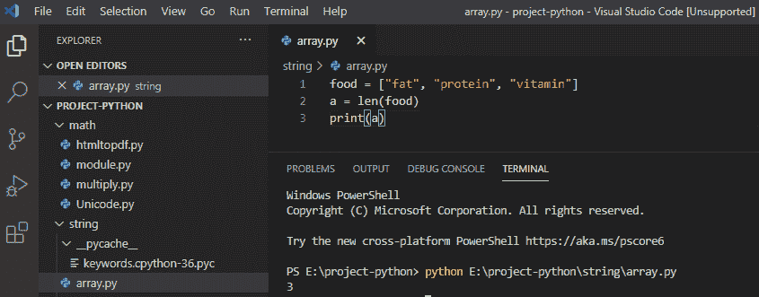

Length of an Array in python

*   [如何在 Python 中创建列表](https://pythonguides.com/create-list-in-python/)
*   [使用 Visual Studio 代码](https://pythonguides.com/python-hello-world-program/)用 python 创建一个 hello world 程序
*   [Python 字符串函数](https://pythonguides.com/string-methods-in-python/)

## 在 Python 中添加数组元素

现在，让我们看看如何向 Python 数组添加元素？在 Python 数组中添加元素，我们可以使用 `append()` 方法来添加元素。

```py
food = ["fat", "protein", "vitamin"]
food.append("mineral")
print(food)
```

写完上面的代码(在 python 中添加数组元素)，你将打印出 `" food "` ，然后输出将显示为 **"[ **"脂肪"，"蛋白质"，"维生素"， ****"矿物质"**** ]** 。**在这里,“矿物”被添加到列表中。

你可以参考下面的截图在 python 中添加数组元素

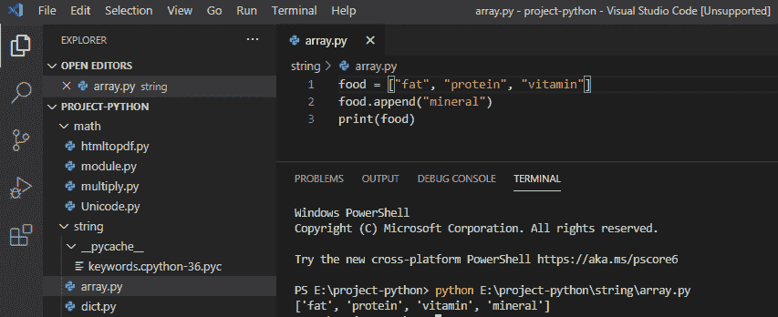

Python Add an element to an Array

## 删除 Python 中的数组元素

**如何在 Python 中删除数组元素？**在 python 中，要从数组中删除数组元素我们可以使用 `pop()` 方法来删除。

```py
food = ["fat", "protein", "vitamin"]
food.pop(0)
print(food)
```

写完上面的代码(在 python 中删除数组元素)，你将打印出 `" food "` ，然后输出将显示为 **"["protein "， **"vitamin"]** 。**这里，pop()方法将从数组中删除“fat”。

可以参考下面的截图用 python 删除数组元素

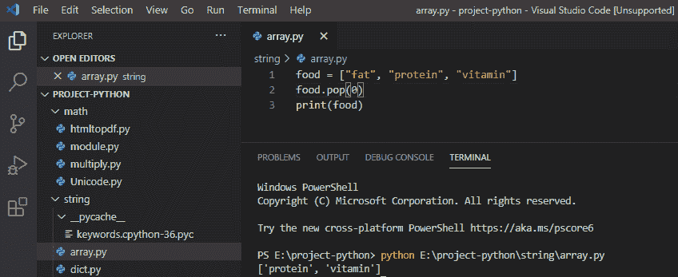

Delete Array elements in Python

## 在 Python 中循环数组元素

现在让我们讨论一下如何在 Python 中循环遍历数组元素？

在 python 中， **for 循环**用于遍历数组中的所有元素。

```py
food = ["fat", "protein", "vitamin"]
for a in food:
print(a)
```

写完上面的代码(在 python 中循环数组元素)，你将打印出 `" a "` ，然后输出将显示为**"脂肪蛋白质**维生素**。**这里，循环将遍历数组中的所有元素。

你可以参考下面 python 中数组元素的截图循环

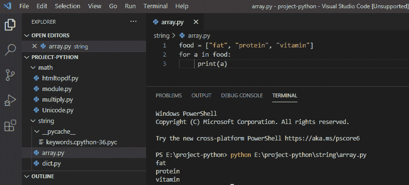

Loop in Array elements in Python

## Python 中的数组模块是什么

现在，让我们来了解一下`Python`中的数组模块是什么？数组是一种数据结构，用于存储相同数据类型的值。要在 python 中使用数组，我们需要**导入标准数组模块**，它给我们一个表示数组的对象。下面是如何用 python 导入数组模块的方法。

**举例:**

```py
from array import*
```

一旦导入了数组模块，就可以声明数组了。

*   [如何在 python 中把整数转换成字符串](https://pythonguides.com/convert-an-integer-to-string-in-python/)
*   [如何在 python 中连接字符串](https://pythonguides.com/concatenate-strings-in-python/)
*   [Python 命名约定](https://pythonguides.com/python-naming-conventions/)

## 创建一个 Python 数组

现在让我们看看如何用 Python 创建一个数组？

我们需要**导入数组模块**来在 python 中创建数值数组。这里，我们创建了一个整数类型的数组。字母“I”用作类型代码来表示数组的整数类型。

**举例:**

```py
from array import *
a = array('i',[10,11,12,13])
print(a)
```

写完上面的代码(创建一个 python 数组)，你将打印出 `" a "` ，然后输出将显示为 **" array('i '，[10，11，12，13])。**在这里，我们创建了一个整型数组。

你可以参考下面的截图创建一个 python 数组。

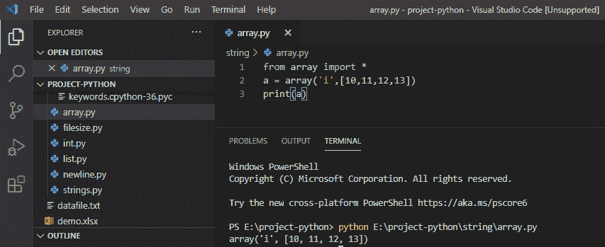

Create a Python Array

## 在 Python 中访问数组元素

要访问数组项，请参考 python 中的**索引号**。我们将使用索引来访问数组中的项，索引从“0”开始。

**举例:**

```py
from array import *
a = array('i',[10,11,12,13])
print(a[2])
```

写完上面的代码(在 python 中访问数组元素)，你将打印出 **" a[2] "** ，然后输出将显示为 **" 12 "。**这里，为了从数组中访问元素，我们使用索引号来访问元素。

你可以参考下面在 python 中访问数组元素的截图。

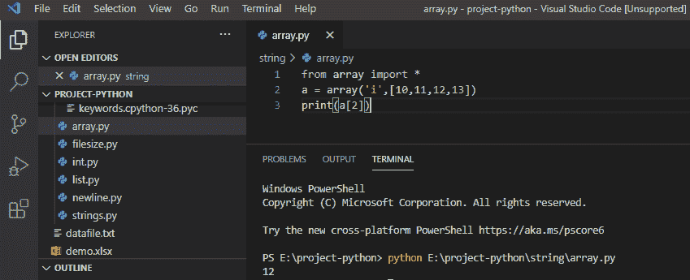

Accessing Array elements in Python

这就是我们如何从 Python 数组中访问元素。

## 在 Python 数组中追加项目

现在，让我们看看如何将一个项目追加到 Python 数组中？

要在现有数组中添加元素，我们可以使用 python 中的 `append()` 方法来添加元素。

**举例:**

```py
from array import *
a = array('i',[10,11,12,13])
a.append(14)
print(a)
```

写完上面的代码(在 python 数组中追加条目)，你将打印出 `" a "` ，然后输出将显示为 **" array('i '，[10，11，12，13，14])。**这里，项目“14”被附加到现有的数组值中。

可以参考下面截图在数组 python 中追加项。

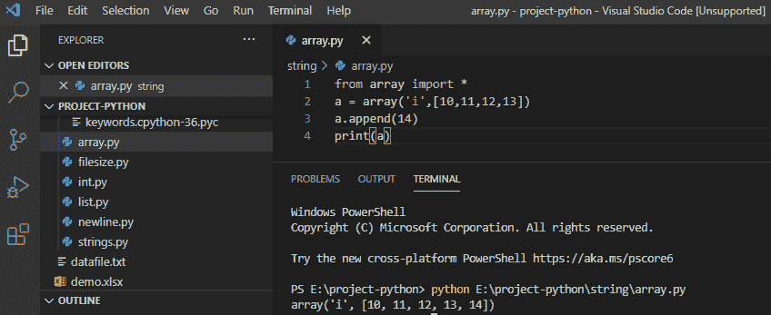

Append item in array Python

## 在数组 Python 中插入元素

现在，让我们看看如何在 Python 数组中插入元素？在 Python 中，要在数组的任意索引处插入值，我们将使用**`insert()`方法。这里，第一个参数用于索引，第二个参数用于值。**

 ****举例:**

```py
from array import *
a = array('i',[10,11,12,13])
a.insert(0,9)
print(a)
```

写完上面的代码(在数组 python 中插入一个元素)，你将打印出 `" a "` ，然后输出将显示为 **" array('i '，[9，10，11，12，13])。**这里，通过使用 insert()方法在索引“0”处插入值“9”。

可以参考下面截图的数组 python 中的 insert 元素。

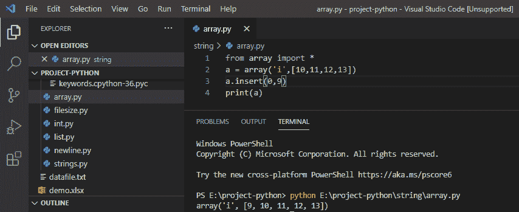

insert an element in a Python array

## 在 Python 中扩展数组

在 python 中，通过使用 `extend()` 方法，可以用多个值来扩展数组值。

**举例:**

```py
from array import *
my_array1 = array('i',[10,11,12,13])
my_array2 = array('i',[14,15,16,17])
my_array1.extend(my_array2)
print(my_array1)
```

写完上面的代码(用 python 扩展数组)，你将打印出 `" my_array1 "` ，然后输出将显示为 **" array('i '，[10，11，12，13，14，15，16，17])。**这里，我们使用 python 中的 extend()方法扩展数组中的多个值。

可以参考下面截图用 python 扩展数组。

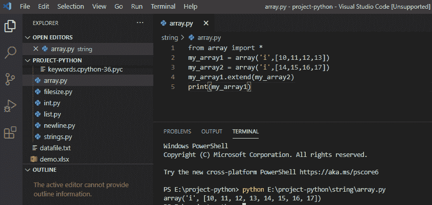

Extend array in Python

## 在 Python 中从数组中移除元素

现在，让我们看看如何在 Python 中从数组中移除元素？在 Python 中，要移除一个数组元素，我们可以使用 `remove()` 方法，它将从数组中移除指定的元素。

**举例:**

```py
from array import *
my_array = array('i',[10,11,12,13])
my_array.remove(12)
print(my_array)
```

写完上面的代码(在 python 中从数组中移除一个元素)，你将打印出 `"my_array"` ，然后输出将显示为 `" `array('i '，【10，11，13】**)。**这里，remove()方法将从数组中删除“12”。

你可以参考下面的截图在 python 中从数组中移除元素。


Remove element from an array in Python

## 从 Python 数组中移除最后一个元素

让我们看看如何从 Python 数组中移除最后一个元素？要从数组中移除最后一个元素，我们可以使用 `pop()` 方法，它将从 python 数组中移除最后一个元素。

**举例:**

```py
from array import *
my_array = array('i',[10,11,12,13])
my_array.pop()
print(my_array)
```

写完上面的代码后(从 python 数组中移除最后一个元素)，你将打印出 `"my_array"` ，然后输出将显示为 `" `array('i '，【10，11，12】**)。**这里，pop()方法将从数组中弹出元素“13”。

你可以参考下面的截图从数组 python 中移除最后一个元素。

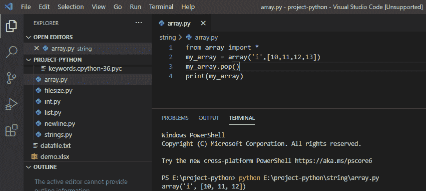

Remove the last element from Python array

## 在 Python 中反转一个数组

我们来讨论一下**如何在 python**n 中反转一个数组？在 python 中，为了反转一个数组，我们将使用 `reverse()` 方法，它将反转数组中的所有元素。

**举例:**

```py
from array import*
my_array = array('i',[10,11,12,13])
my_array.reverse()
print(my_array)
```

写完上面的代码(反转一个数组 python)，你会打印出 `"my_array"` 然后输出会显示为 `" `array('i '，【13，12，11，10】**)。**这里，reverse()方法将反转一个数组的元素。

你可以参考下面的截图反转一个数组 python。

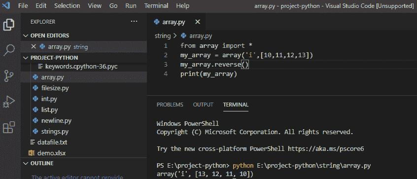

Reverse an array in Python

## Python 计算数组中一个元素的出现次数

**如何统计 Python 数组中一个元素的出现次数？**为了统计一个元素的出现次数，我们将使用 `count()` ，它将返回一个元素在数组中出现的次数。

**举例:**

```py
from array import*
my_array = array('i',[10,11,12,13,12])
a = my_array.count(12)
print(a)
```

写完上面的代码(python 计算数组中一个元素的出现次数)，你将打印出 `"a"` ，然后输出将显示为 **" `2` 。**在这里，count()方法将返回该元素出现的次数，在这里‘12’出现了‘2’次。

你可以参考下面的截图 python 计算一个数组中一个元素的出现次数。

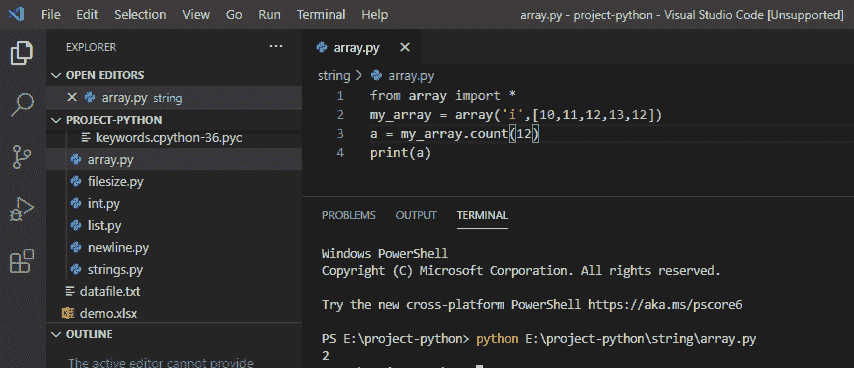

Python count occurrence of an element in an array

## 在 Python 中把数组转换成列表

Python 中如何把数组转换成列表？为了在 Python 中将数组转换成列表，我们将使用 `tolist()` 方法，它会将数组转换成列表对象。

**举例:**

```py
from array import*
my_array = array('i',[10,11,12,13])
a = my_array.tolist()
print(a)
```

写完上面的代码(在 python 中把数组转换成列表)，你将打印出 `"a"` ，然后输出将显示为`"`【10，11，12，13】**。这里，tolist()方法将把我的数组转换成一个列表。**

可以参考下面的截图用 python 把数组转换成列表。

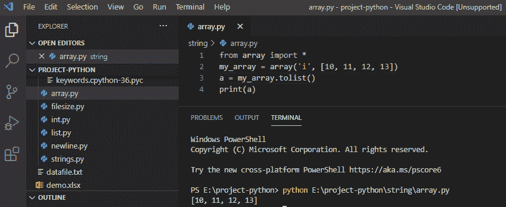

Convert array to list in Python

## 查找数组中元素的索引 Python

**如何在 Python 数组中找到一个元素的索引？**为了找到元素的索引，我们将使用 python 内置的 `index()` 方法从数组中搜索指定值的索引。

**举例:**

```py
from array import*
my_array = array('i',[10,11,12,13])
print(my_array.index(12)
```

写完上面的代码(在一个数组 python 中找到一个元素的索引)，你将打印出 `"my_array.index(12)"` ，然后输出将显示为 **" `2` 。**这里，index()方法将返回指定值的索引。

你可以参考下面的截图找到一个数组 python 中元素的索引。

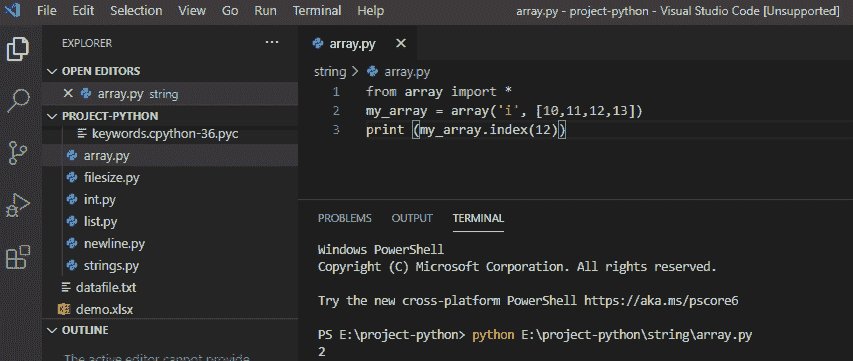

Find index of an element in an array Python

## Python 更新数组中的元素

**如何在 Python 中更新数组元素？**在 python 中，为了更新数组中给定索引处的元素，我们将**为我们想要更新的指定索引重新分配一个新值**，并且使用 for 循环来迭代该值。

**举例:**

```py
from array import*
my_array = array('i',[10,11,12,13])
my_array[1] = 20
for a in my_array:
print(a)
```

写完上面的代码(python 更新数组中的元素)，你将打印出 `"a"` ，然后输出将显示为 `" **10 20 12 13` 。**这里，我们将新值重新分配给索引‘1 ’,它在数组中被更新为值‘20’。

你可以参考下面的 python 截图更新数组中的元素。

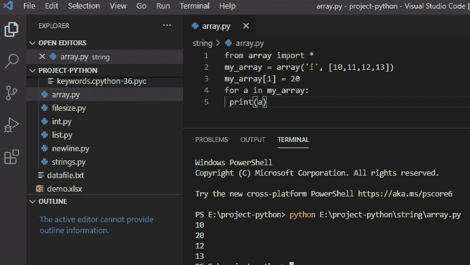

Python update the element in an array

## Python 列表 vs 数组

| **列表** | **数组** |
| Python 列表非常灵活，可以保存任意数据。 | Python 数组只是 C 数组的一个薄薄的包装。 |
| 列表是 python 的一部分，所以不需要首先声明它们。 | 数组需要首先从其他库(即 numpy)导入或声明。 |
| 它不能直接处理算术运算。 | 可以直接处理算术运算。 |
| 适用于较短的数据项序列。 | 首选较长的数据项序列。 |
| 更大的灵活性允许容易地修改数据。 | 灵活性较低，因为添加、删除必须按元素进行。 |
| 消耗更大的内存以方便添加元素。 | 内存大小相对更紧凑。 |

## Python 列表到 numpy 数组

要将列表转换成数组，我们首先需要 **import numpy。**然后我们将初始化一个列表，并使用 `numpy.array()` 将**列表转换为` `数组**。

**举例:**

```py
import numpy
my_lst = [10, 12, 16, 18, 20]
my_array = numpy.array(my_lst)
print ("Array:", my_array)
print (type(my_array))
```

写完上面的代码(python 列表到 numpy 数组)，你将打印出 `"my_array"` ，然后输出将显示为 **" Array: [10 12 16 18 20]"。**这里， `numpy.array()` 将列表作为参数，返回一个包含列表所有元素的数组。

你可以参考下面的截图 python 列表来 numpy 数组。

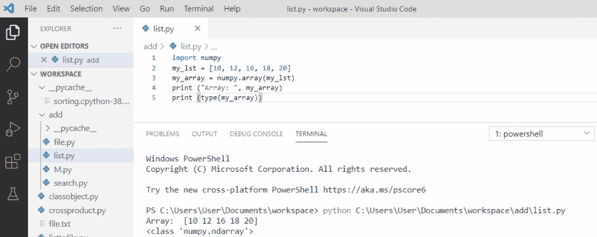

Python list to numpy arrays

## Python 意味着一个数组

现在，让我们看看**在 python** 中数组的含义。

我们将使用 `numpy.mean()` 作为数组的给定数据。该函数用于计算算术平均值。该函数将返回数组元素的平均值。

**举例:**

```py
import numpy as np
my_arr = [12, 4, 2, 7]
print("array:", my_arr)
print("Mean of an array:",np.mean(my_arr))
```

写完上面的代码(python mean of an array)，你会打印出 `"np.mean(my_array)"` 然后输出会显示为 **" array: [12，4，2，7]Mean of a array:6.25 "。**这里， `numpy.mean(my_arr)` 取数组并返回数组的平均值。

你可以参考下面的截图 python 意味着一个数组。

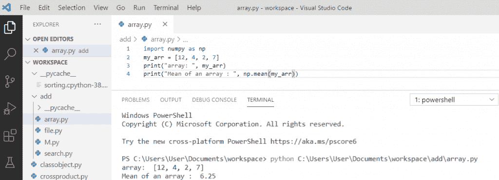

Python mean of an array

## Python 两个数组的平均值

对于**两个数组**的给定数据，我们将使用 `numpy.mean()` 。该函数用于计算算术平均值。该函数将返回两个数组元素的平均值。

**举例:**

```py
import numpy as np
my_arr = np.array([[10, 2], [5, 11]])
a = np.mean(my_arr)
print(a)
```

写完上面的代码(python mean of two arrays)，你将打印出 `"np.mean(my_arr)"` ，然后输出将显示为 **" 7.0 "。**这里， `numpy.mean(my_arr)` 取数组并返回两个数组的平均值。算术平均值是元素的总和除以元素的数量。

你可以参考下面的两个数组的 python 平均值截图。

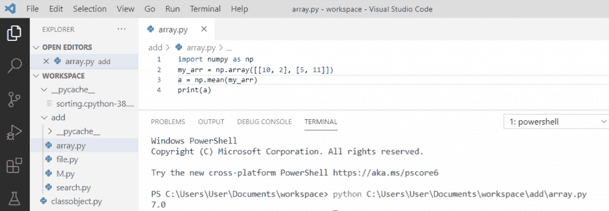

Python mean of two arrays

## 数组 python 的最小值

首先，我们将**导入 numpy** ，然后我们将创建一个数组。为了从数组中找到最小值，我们将使用**“numpy . min(my _ arr)”**函数。

**举例:**

```py
import numpy 
my_arr = numpy.array([1, 3, 5, 2, 8, 10]) 
min_element = numpy.min(my_arr) 
print('Minimum element in the array is: ',min_element)
```

写完上面的代码(数组 python 的最小值)，你将打印出 `"min_element"` ，然后输出将显示为**"数组中的最小元素是** : 1 **。**这里， `numpy.min(my_arr)` 将从数组中返回最小值。

关于数组 python 的最小值，可以参考下面的截图。

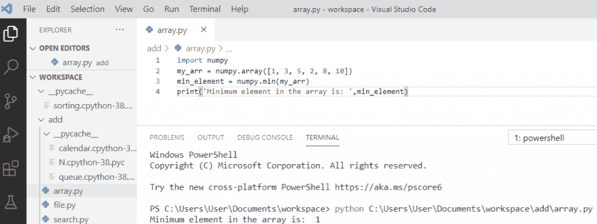

Minimum value of array python

## 数组 python 的最大值

首先，我们将**导入 numpy** ，然后我们将创建一个数组。为了从数组中找到最大值，我们将使用**“numpy . max(my _ arr)”**函数。

**举例:**

```py
import numpy 
my_arr = numpy.array([1, 3, 5, 2, 8, 10]) 
max_element = numpy.max(my_arr) 
print('Maximum element in the array is: ',max_element)
```

写完上面的代码(数组 python 的最大值)，你将打印出 `"max_element"` ，然后输出将显示为**"数组中的最大元素是** : **10 "。**这里， `numpy.max(my_arr)` 将从数组中返回最大值。

关于数组 python 的最大值，可以参考下面的截图。

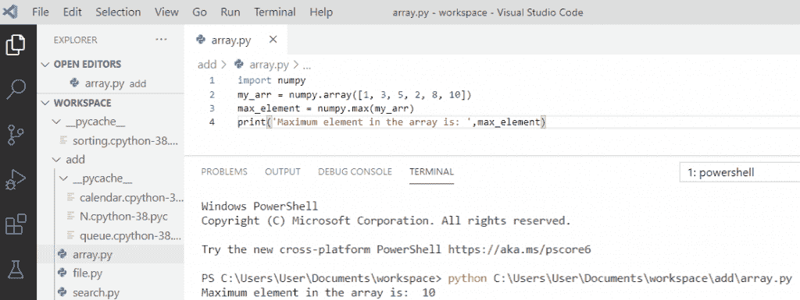

Maximum value of array python

## 二维数组上的 Python 最小值

首先，我们将**导入 numpy** ，然后我们将创建一个 2d 数组。为了从**二维**数组中找到最小值，我们将使用**“numpy . min(my _ arr)”**函数。

**举例:**

```py
import numpy 
my_arr = numpy.array([[15, 12, 3], [14, 25, 20], [9, 60, 80]]) 
min_element = numpy.min(my_arr) 
print('Minimum element on 2d array is:',min_element)
```

写完上面的代码(python 在 2d 数组上的最小值)，你将打印出 `"min_element"` ，然后输出将显示为**" 2d 数组上的最小元素是** : **3 "。**这里， `numpy.min(my_arr)` 将从 2d 数组中返回最小值。

你可以参考下面的 2d 数组上 python 最小值的截图。

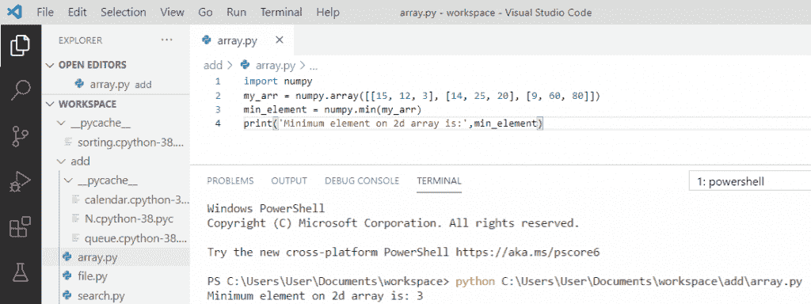

Python minimum value on 2d array

## 二维数组上的 Python 最大值

首先，我们将**导入 numpy** ，然后我们将创建一个 2d 数组。为了从**二维**数组中找到最大值，我们将使用**“numpy . max(my _ arr)”**函数。

**举例:**

```py
import numpy 
my_arr = numpy.array([[15, 12, 3], [14, 25, 20], [9, 60, 80]]) 
max_element = numpy.max(my_arr) 
print('Maximum element on 2d array is:',max_element)
```

写完上面的代码(python 在 2d 数组上的最大值)，你将打印出 `"max_element"` ，然后输出将显示为**" 2d 数组上的最大元素是:80 "。**这里， `numpy.max(my_arr)` 将从 2d 数组中返回最大值。

你可以参考下面的二维数组 python 最大值截图

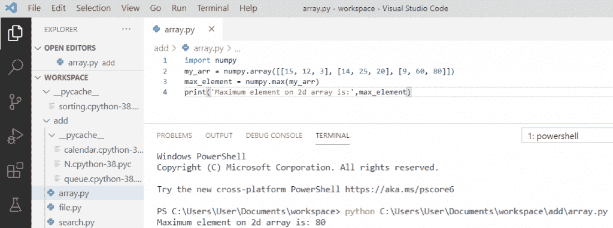

Python maximum value on 2d array

您可能会喜欢以下 Python 教程:

*   [python 中的哈希表](https://pythonguides.com/hash-table-in-python/)
*   [Python 中的块缩进](https://pythonguides.com/block-indentation-in-python/)
*   [Python 从路径中获取文件名](https://pythonguides.com/python-get-filename-from-the-path/)
*   [Python 类型错误:“列表”对象不可调用](https://pythonguides.com/python-typeerror-list-object-is-not-callable/)
*   [Python if else with examples](https://pythonguides.com/python-if-else/)
*   [Python For 循环示例](https://pythonguides.com/python-for-loop/)
*   [Python 读取 excel 文件并在 Python 中写入 Excel](https://pythonguides.com/python-read-excel-file/)
*   [在 Python 中创建一个元组](https://pythonguides.com/create-a-tuple-in-python/)
*   [Python 通过引用或值传递示例](https://pythonguides.com/python-pass-by-reference-or-value/)
*   [Python 从列表中选择+示例](https://pythonguides.com/python-select-from-a-list/)

在本 python 教程中，我们学习了 Python 数组以及如何使用它:

*   Python 中的数组是什么
*   从数组中访问元素 python
*   如何更新 Python 数组中的 am 元素
*   如何在 python 中获得数组的长度
*   如何在 python 中添加数组元素
*   在 python 中删除数组元素
*   python 中数组元素的循环
*   python 中的数组模块是什么
*   创建 python 数组
*   在 python 中访问数组元素
*   在 python 数组中追加项目
*   如何在 python 数组中插入元素
*   在 python 中扩展数组
*   在 python 中从数组中移除元素
*   如何从 Python 数组中移除最后一个元素
*   反转数组 python
*   Python 计算数组中元素的出现次数
*   在 python 中将数组转换为列表
*   在数组 python 中查找元素的索引
*   如何在 Python 中更新数组中的元素
*   Python 列表与数组
*   Python 列表到 numpy 数组
*   数组的 Python 含义
*   两个数组的 Python 含义
*   python 数组的最小值
*   python 数组的最大值
*   2d 数组上的 Python 最小值
*   2d 数组上的 Python 最大值

[Bijay Kumar](https://pythonguides.com/author/fewlines4biju/)

Python 是美国最流行的语言之一。我从事 Python 工作已经有很长时间了，我在与 Tkinter、Pandas、NumPy、Turtle、Django、Matplotlib、Tensorflow、Scipy、Scikit-Learn 等各种库合作方面拥有专业知识。我有与美国、加拿大、英国、澳大利亚、新西兰等国家的各种客户合作的经验。查看我的个人资料。

[enjoysharepoint.com/](https://enjoysharepoint.com/)[](https://www.facebook.com/fewlines4biju "Facebook")[](https://www.linkedin.com/in/fewlines4biju/ "Linkedin")[](https://twitter.com/fewlines4biju "Twitter")**