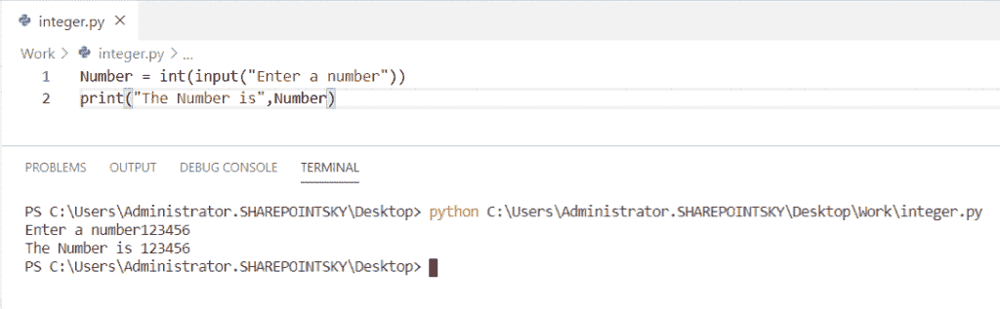
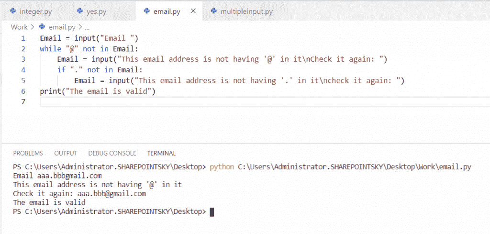

# Python 要求用户输入(示例)

> 原文：<https://pythonguides.com/python-ask-for-user-input/>

[](https://sharepointsky.teachable.com/p/python-and-machine-learning-training-course)

在这个 [python 教程中，](https://pythonguides.com/python-hello-world-program/)你将了解到 **Python 要求用户输入。**此外，我们将检查:

*   Python 再次要求用户输入
*   Python 要求用户输入密码
*   Python 要求用户输入整数
*   Python 要求用户输入是否
*   Python 要求用户输入电子邮件
*   Python 要求用户进行多次输入
*   Python 函数要求用户输入
*   Python 如何接受连续输入
*   Python 要求用户输入字符串
*   Python 要求用户输入文件

`Input()` 是一个方法，它读取输入设备输入的每一行，并将它们转换成一个字符串并返回。

目录

[](#)

*   [Python 要求用户输入](#Python_ask_for_user_input "Python ask for user input")
*   [Python 再次要求用户输入](#Python_ask_for_user_input_again "Python ask for user input again")
*   [Python 要求用户输入密码](#Python_ask_for_user_input_password "Python ask for user input password")
*   [Python 要求用户输入整数](#Python_ask_the_user_for_integer_input "Python ask the user for integer input")
*   [Python 要求用户输入是否](#Python_ask_for_user_input_yes_no "Python ask for user input yes no")
*   [Python 要求用户输入电子邮件](#Python_ask_the_user_for_Email_input "Python ask the user for Email input")
*   [Python 要求用户多次输入](#Python_ask_the_user_for_multiple_inputs "Python ask the user for multiple inputs")
*   [Python 函数要求用户输入](#Python_function_ask_for_user_input "Python function ask for user input")
*   [Python 如何取连续输入](#Python_how_to_take_continuous_input "Python how to take continuous input")
*   [Python 要求用户输入字符串](#Python_ask_the_user_for_a_string_input "Python ask the user for a string input")
*   [Python 要求用户输入一个文件](#Python_ask_the_user_for_a_file_input "Python ask the user for a file input")

## Python 要求用户输入

现在，我们可以看到**用户如何在 python 中请求输入**。

在这个例子中，我采用了两个输入，即 **A = int(input("输入第一个数字"))**、 **B = int(input("输入第二个数字"))**和用于输入的加法运算。

示例:

```py
A = int(input("enter 1st number"))
B = int(input("enter 2nd number"))
C = A + B
print(C)
```

为了得到输入的总和作为输出，我们必须使用 `print(C)` 。下面的截图显示了输出。


Python ask for user input

阅读: [Python NumPy linspace](https://pythonguides.com/python-numpy-linspace/)

## Python 再次要求用户输入

在这里，我们可以看到**用户如何在 Python 中再次要求输入**。

*   在这个例子中，我将输入设为**age = int(input(" Enter age:"))**和 while 循环。while 循环接受一个表达式并执行循环体。
*   while true 始终计算布尔值 true，并无限次执行循环体。使用 **try 和 except** ，try 用于**测试代码块的错误**和 `except` 块用于**处理错误。**
*   如果条件为真，则返回 If 语句，否则返回 else 语句。
*   continue 语句用于结束当前迭代并继续下一次迭代。

示例:

```py
while True:
  try:
    age = int(input("Enter age: ")) 
    if age<=20:
      print("The age is correct")
      break;
    else:
      print("The age is not correct")      
  except ValueError:
    print("Invalid")
    continue
```

当条件为真时，循环结束。我用过 **print("年龄正确")**当给定条件为真时。您可以参考下面的输出截图。


Python ask for user input again

## Python 要求用户输入密码

在这里，我们可以看到**用户如何在 python 中要求输入密码**。

*   在这个例子中，我导入了一个名为 **getpass 的模块。**该模块提供了一种安全的方式来维护密码。
*   Python 中的 `getpass()` 函数用于使用字符串提示符提示用户，并读取输入的字符串作为用户的密码。
*   提示字符串是在 `input()` 函数中传递的参数。

示例:

```py
import getpass
password = getpass.getpass()
print('The password is', password)
```

为了打印输入的**密码**作为输出，我使用了 **print('密码为'，password)** 。在下面的截图中，你可以看到输出。


Python ask for user input password

阅读: [Python NumPy concatenate](https://pythonguides.com/python-numpy-concatenate/)

## Python 要求用户输入整数

现在，我们可以看到**用户如何在 python 中请求整数输入**。

在这个例子中，我将输入设为`Number = int(input(" Enter a Number "))`。我们必须使用 **int 数据类型**作为整数输入。

示例:

```py
Number = int(input("Enter a number"))
print("The Number is",Number)
```

为了得到输出，我使用了**print(" Number is "，Number)** 。您可以参考下面的输出截图。



Python ask the user for integer input

## Python 要求用户输入是否

在这里，我们可以看到**用户如何在 python 中要求 yes no 输入**。

*   在这个例子中，我将输入设为**巧克力=输入("你想要巧克力吗")**。
*   我使用了 if 条件，如**if chocolate = = =(" yes "):**这意味着当用户输入" yes "时，它打印出来(" Have It ")，我还使用了 elif 条件。
*   **elif chocolate = = =(" no "):**如果用户输入 `"no"` ，它会打印(" ok Thank you ")。

示例:

```py
chocolate = input("Do you want chocolate")
if chocolate == ("yes"):
	print ("Have It")
elif chocolate == ("no"):
	print ("Ok Thank you")
```

为了得到输出，我使用了 print `("Have It")` 和 print `("Ok Thank you")` 。下面的截图显示了输出。


Python ask for user input yes no

## Python 要求用户输入电子邮件

在这里，我们可以看到**用户如何在 python 中请求电子邮件输入**。

*   在这个例子中，我将输入作为 `Email = input("Email "` )。
*   我使用了一个 while 循环来检查输入中是否存在 **@** ，如果不存在，while 循环将一直迭代，直到条件为真。
*   if 条件用于检查**。”**存在于给定输入中。如果给定的输入满足这两个条件。

示例:

```py
Email = input("Email ")
while "@" not in Email:
    Email = input("This email address is not having '@' in it\nCheck it again: ")
    if "." not in Email:
        Email = input("This email address is not having '.' in it\ncheck it again: ")
print("The email is valid")
```

为了打印输出，我使用了 **print(“电子邮件有效”)**。下面的截图显示了输出。



Python ask the user for Email input

## Python 要求用户多次输入

在这里，我们可以看到用户如何在 python 中要求多个输入。

*   在本例中，我将变量取为 a、b、c、d，并将输入取为 **a、b、c、d = input("输入四个值:")。拆分()**。
*   split()函数用于为用户获取多个值。split()通过指定的分隔符来分隔输入。如果没有指定分隔符，空白充当说明符。
*   为每个变量分离并分配了四个输入值。

示例:

```py
a,b,c,d = input("Enter a four value: ").split()
print(a)
print(b)
print(c)
print(d)
```

为了打印变量，我使用了 **print(a)，print(b)，print(c)，print(d)。**在下面的截图中，您可以看到输出，例如输入值被分割并分配给每个变量。


Python ask the user for multiple inputs

## Python 函数要求用户输入

现在，我们可以看到**函数如何在 python 中要求用户输入**。

函数被定义为执行动作的有组织的可重用代码块，python 有内置函数，比如 python 2 的 **raw_input 和 python 3** 的 `input()`

在这个例子中，我将一个输入作为 **a = input('pythonguides')** 。这里使用了内置函数 `input()` 。

示例:

```py
a = input('pythonguides')
print(a)
```

为了打印输入值，我使用了 `print(a)` 。您可以参考下面的输出截图。


Python function ask for user input

## Python 如何取连续输入

这里可以看到**如何在 python 中取连续输入**。

*   在这个例子中，我采用了像 a，b，c 这样的变量，并且我采用了输入作为 **a，b，c=map(int，input("输入数字")。分割('，')**
*   `split()` 函数用于获取用户的连续输入值。split()函数使用指定的分隔符来分隔输入。如果没有指定分隔符，空白充当说明符。在这里，我使用了****，【分隔符】**。**
*   **输入值被分离并分配给每个变量。 `map()` 函数用于返回值列表。**

 **示例:

```py
a,b,c=map(int,input("enter the numbers").split(','))
print(a)
print(b)
print(c)
```

为了打印变量，我使用了 **print(a)，print(b)，print(c)** 。在下面的屏幕截图中，您可以看到输出，如输入值被分割并分配给每个变量。在输入输入值时，我也使用了**、**分隔符。


Python how to take continuous input

## Python 要求用户输入字符串

在这里，我们可以**用户如何在 python 中要求一个字符串输入**。

*   在这个例子中，我取了两个输入作为`Name = input(" Enter student Name ")`，`Marks = input(" Enter Marks ")`， **print("\n")** 是为了得到新行中的每个字符串输入。输入的输入值被分配给变量**名称和标记。**

示例:

```py
Name = input("Enter student Name ")
Marks = input("Enter marks ")
print("\n")
print(Name, Marks)
```

为了打印变量，我使用了 **print(Name，Marks)。**下面的截图显示了输出。


Python ask the user for a string input

## Python 要求用户输入一个文件

现在，我们可以看到**用户如何在 python 中请求文件输入**。

*   在这个例子中，我将一个输入作为 **file = input("输入文件名:")**，并且我使用了**`split()`函数。**
*   **split()函数使用指定的分隔符来分隔输入。如果没有指定分隔符，空白充当说明符。**
*   **这里，我用了****’.”分隔符**和**T5 用于拆分功能，将输入拆分成文件名和扩展名。`**`
*   ****使用最大拆分[-1]，[-1]表示拆分次数没有限制。****

 ****示例:

```py
file = input("Enter the Filename: ")
extension = file.split(".")
print ("The extension is: " + (extension[-1])) 
```

为了将输出作为扩展名，我使用了 **print("扩展名是:"+(扩展名[-1])】)**。您可以参考下面的输出截图。


Python ask the user for a file input

您可能会喜欢以下 Python 教程:

*   [如何将 Python 字符串转换成字节数组并举例](https://pythonguides.com/python-string-to-byte-array/)
*   [Python 通过引用或值传递示例](https://pythonguides.com/python-pass-by-reference-or-value/)
*   [Python 从列表中选择+示例](https://pythonguides.com/python-select-from-a-list/)
*   [Python Tkinter Listbox–如何使用](https://pythonguides.com/python-tkinter-listbox/)
*   [Python 复制文件(示例)](https://pythonguides.com/python-copy-file/)
*   [Python 文件方法(附有用例子)](https://pythonguides.com/python-file-methods/)
*   [集合的并集 Python +实例](https://pythonguides.com/union-of-sets-python/)
*   [如何在 Python 中把字符串转换成日期时间](https://pythonguides.com/convert-a-string-to-datetime-in-python/)
*   [如何使用 Turtle 在 python 中绘制形状(Python 中的 Turtle 编程)](https://pythonguides.com/turtle-programming-in-python/)

在本 Python 教程中，我们已经了解了 **Python 要求用户输入**。此外，我们还讨论了以下主题:

*   Python 再次要求用户输入
*   Python 要求用户输入密码
*   Python 要求用户输入整数
*   Python 要求用户输入是否
*   Python 要求用户输入电子邮件
*   Python 要求用户进行多次输入
*   Python 函数要求用户输入
*   Python 如何接受连续输入
*   Python 要求用户输入字符串
*   Python 要求用户输入文件

[Bijay Kumar](https://pythonguides.com/author/fewlines4biju/)

Python 是美国最流行的语言之一。我从事 Python 工作已经有很长时间了，我在与 Tkinter、Pandas、NumPy、Turtle、Django、Matplotlib、Tensorflow、Scipy、Scikit-Learn 等各种库合作方面拥有专业知识。我有与美国、加拿大、英国、澳大利亚、新西兰等国家的各种客户合作的经验。查看我的个人资料。

[enjoysharepoint.com/](https://enjoysharepoint.com/)[](https://www.facebook.com/fewlines4biju "Facebook")[](https://www.linkedin.com/in/fewlines4biju/ "Linkedin")[](https://twitter.com/fewlines4biju "Twitter")`**`