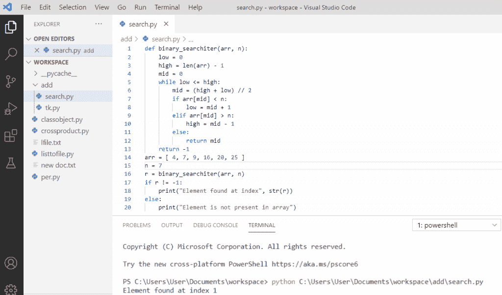
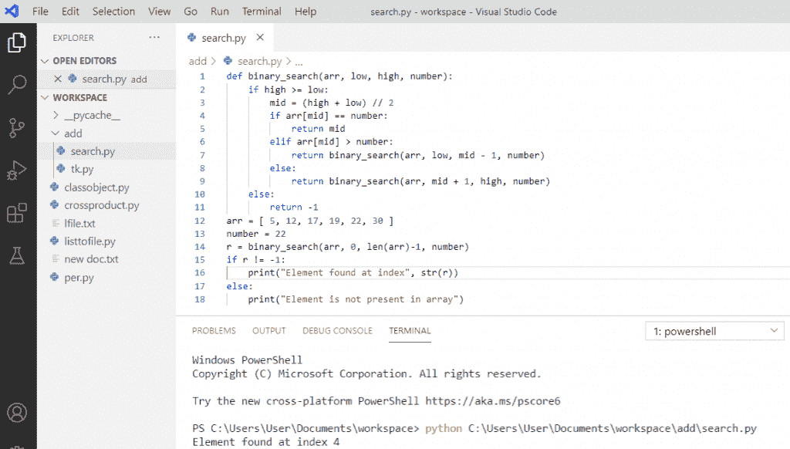
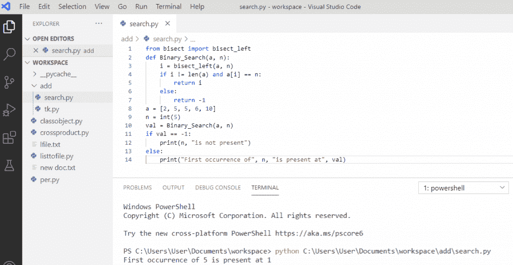
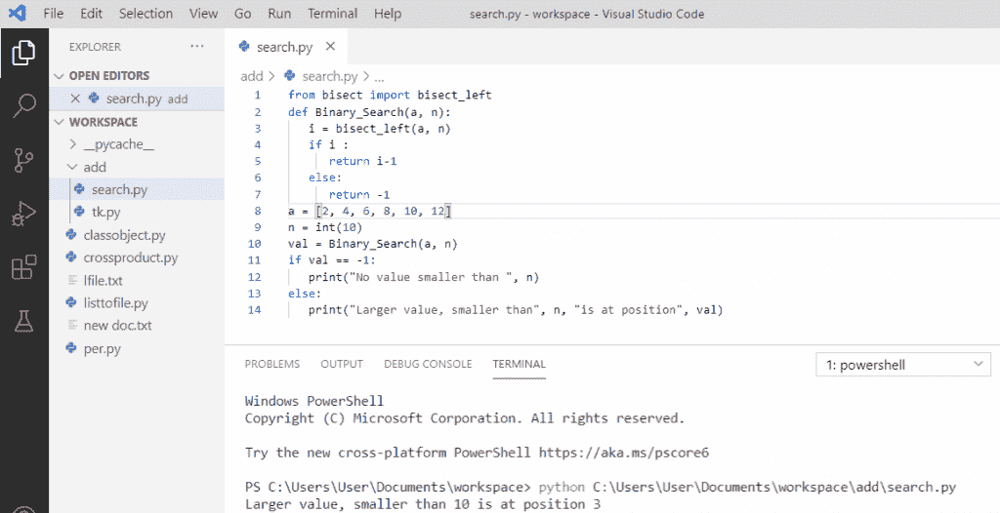
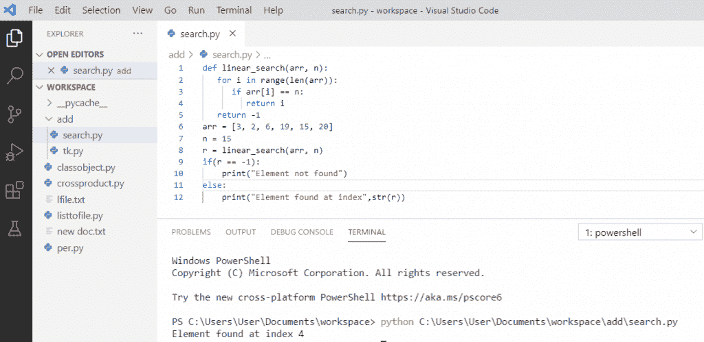
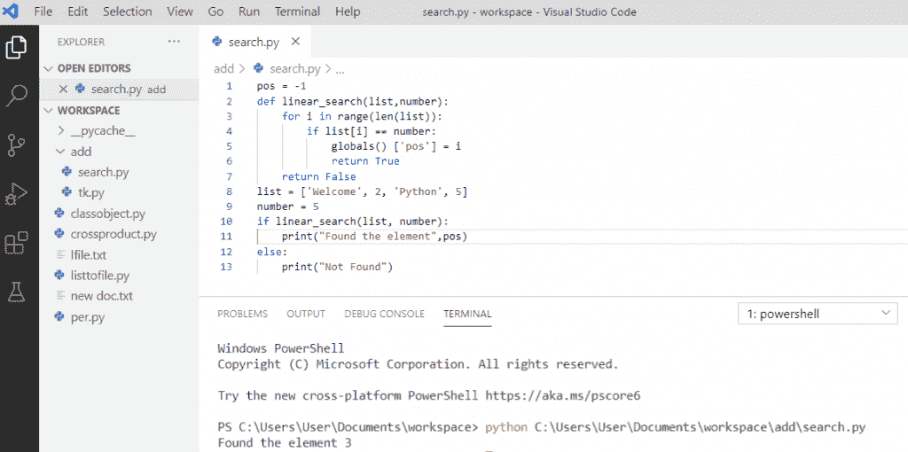

# Python 二分搜索法和线性搜索

> 原文：<https://pythonguides.com/python-binary-search/>

[](https://sharepointsky.teachable.com/p/python-and-machine-learning-training-course)

在这个 [python 教程中，](https://pythonguides.com/python-hello-world-program/)你将通过例子学习**二分搜索法和 python 中的线性搜索**。这里我们将检查 **:**

*   python 中的二分搜索法是什么？
*   没有递归的 python 中的二分搜索法
*   **Python 递归二分搜索法**
*   Python 二分搜索法使用库查找元素的第一次出现
*   用 Python 二分搜索法库求小于 n 的最大值
*   **python 中的线性搜索**
*   python 中使用列表的线性搜索
*   **python 中的线性搜索 vs 二分搜索法**

目录

[](#)

*   [python 中的二分搜索法是什么？](#What_is_binary_search_in_python "What is binary search in python?")
*   [python 中的二分搜索法没有递归](#Binary_search_in_python_without_recursion "Binary search in python without recursion")
*   [Python 递归二分搜索法](#Python_recursive_binary_search "Python recursive binary search")
*   [Python 二分搜索法使用库查找第一次出现的元素](#Python_binary_search_using_a_library_find_the_first_occurrence_of_an_element "Python binary search using a library find the first occurrence of an element")
*   [Python 二分搜索法用一个库找到小于 n 的最大值](#Python_binary_search_using_a_library_find_the_greatest_value_smaller_than_n "Python binary search using a library find the greatest value smaller than n")
*   [python 中的线性搜索](#Linear_search_in_python "Linear search in python")
*   [使用列表在 python 中进行线性搜索](#Linear_search_in_python_using_list "Linear search in python using list")
*   [python 中的线性搜索 vs 二分搜索法](#Linear_search_vs_Binary_search_in_python "Linear search vs Binary search in python")

## python 中的二分搜索法是什么？

*   一个**二分搜索法**是一种算法，用于在一个有序的[数组](https://pythonguides.com/python-array/)中找到一个元素的位置。
*   有两种方法可以执行**二分搜索法**。在这两种方法中，我们在一个[数组](https://pythonguides.com/create-an-empty-array-in-python/)中有最高和最低的位置。
*   第一种方法是迭代方法，第二种方法是递归方法。
*   二分搜索法是搜索数字列表的一种有效方式，它比线性搜索更有效，因为它将搜索减少了一半。

## python 中的二分搜索法没有递归

在一个 **Python 二分搜索法**中，我们将给出一个**排序列表**，我们将通过使用二分搜索法找到元素。在一个迭代方法中，我们将遍历我们的[列表](https://pythonguides.com/python-list-methods/)中的每一项，找到中间值，并继续这样做，直到搜索完成。

**举例:**

```py
def binary_searchiter(arr, n):
    low = 0
    high = len(arr) - 1
    mid = 0
    while low <= high:
        mid = (high + low) // 2
        if arr[mid] < n:
            low = mid + 1
        elif arr[mid] > n:
            high = mid - 1
        else: 
            return mid
    return -1
arr = [4, 7, 9, 16, 20, 25]
n = 7
r = binary_searchiter(arr, n)
if r != -1:
    print("Element found at index", str(r))
else: 
    print("Element is not present in array")
```

写完上面的代码(没有递归的 python 中的二分搜索法)，你将打印这些代码，然后输出将显示为在索引 1" 找到的**"元素。这里，使用迭代方法来查找列表中的数字。**

你可以参考下面的截图，没有递归的 python 中的**二分搜索法**



Binary search in python without recursion

## Python 递归二分搜索法

我们也可以在 Python 中对二分搜索法使用**递归。在递归二分搜索法中，我们将定义一个函数，它一直调用自己，直到满足条件。我们将首先计算中间的数字，并继续这样做，直到搜索完成。**

**举例**:

```py
def binary_search(arr, low, high, number):
    if high >= low:
        mid = (high + low) // 2
        if arr[mid] == number:
           return mid
        elif arr[mid] > number:
           return binary_search(arr, low, mid-1, number)
        else:
           return binary_search(arr, mid+1, high, number)
    else:
        return -1
arr = [5, 12, 17, 19, 22, 30]
number = 22
r = binary_search(arr, 0, len(arr)-1, number)
if r != -1:
    print("Element found at index", str(r))
else:
    print("Element is not present in array") 
```

在编写了上述代码(python 递归二分搜索法)之后，您将打印这些代码，然后输出将显示为在索引 4 " 处找到的**"元素。这里使用了递归方法，我们向 binary_search 函数传递两个新参数。**

可以参考下面 **python 递归二分搜索法**的截图。



Python recursive binary search

## Python 二分搜索法使用库查找第一次出现的元素

在此我们将使用库函数来做一个二分搜索法，我们需要从二等分导入**导入**和**二等分.二等分 _ 左(a，n)函数**用于返回一个排序列表中 n 的最左侧插入点。

**举例:**

```py
from  bisect import bisect_left
def Binary_Search(a, n):
    i = bisect_left(a, n)
    if i != len(a) and a[i] == n:
        return i
    else:
        return -1
a = [2, 5, 5, 6, 10]
n = int(5)
val = Binary_Search(a, n)
if val == -1:
    print(n, "is not present")
else:
    print("First occurence of", n, "is present at", val)
```

写完上面的代码后(python 二分搜索法使用库查找第一次出现的元素)，一旦打印，输出将显示为**“第一次出现的 5 出现在 1”**。这里，通过使用**二分左()**函数，它将返回列表中出现的第一个元素。

你可以参考下面的截图**找到第一次出现的元素**



Python binary search using a library find the first occurrence of an element

## 使用 Python 二分搜索法库找到小于 n 的最大值

我们可以通过使用**二等分 _ 左()**得到比 n 更大的值。

**举例:**

```py
from bisect import bisect_left
def Binary_search(a, n):
   i = bisect_left(a, n)
   if i :
      return i-1
   else:
      return -1
a = [2, 4, 6, 8, 10, 12]
n = int(10)
val = Binary_search(a, n)
if val == -1:
   print(n, "is not present")
else:
   print("Larger value, smaller than", n, "is at position", val)
```

编写上述代码后(python 二分搜索法使用库查找小于 n 的最大值)，一旦打印，输出将显示为**“大于 10 的值位于位置 3”**。这里，通过使用**二分左()**函数，它将返回小于 n 的较大值

你可以参考下面的截图找到小于 n 的最大值



Python binary search using a library find the greatest value smaller than n

## python 中的线性搜索

**Python 线性搜索**是最基本的一种搜索算法。当你从头到尾一个接一个地搜索列表中的项目，找到你要搜索的匹配时，就完成了一个**线性或顺序搜索**。

**举例:**

```py
def linear_search(arr, n):
   for i in range(len(arr)):
      if arr[i] == n:
         return i
   return -1
arr = [3, 2, 6, 19, 15, 20]
n = 15
r = linear_search(arr, n)
if(r == -1):
    print("Element not found")
else: 
    print("Element found at index",str(r))
```

在编写了上面的代码(python 中的**线性搜索**)之后，您将打印这些代码，然后输出将显示为在索引 4 处找到的**元素**。这里，线性搜索用于按顺序搜索列表中的元素，如果我们找到该元素，它将返回该特定元素的索引。

python 中的**线性搜索可以参考下面的截图。**



Linear search in python

## 使用列表在 python 中进行线性搜索

为了在 Python 中对列表执行**线性搜索，我们必须从列表最左边的元素开始，然后它将与列表中的每个元素进行比较，如果元素匹配，那么它将给出位置，否则它将返回 not found。**

**举例:**

```py
pos = -1
def linear_search(list,number):
    for i in range(len(list)):
        if list[i] == number:
            globals() ['pos'] = i
            return True
    return False
list = ['Welcome', 2, 'Python', 5]
number = 5
if linear_search(list, number):
    print("Found the element",pos)
else:
    print("Not Found")
```

在编写了上面的代码之后(在 python 中使用列表进行**线性搜索)，一旦打印，输出将显示为**“在索引 3 处找到元素”**。在这里，使用列表的线性搜索用于按顺序搜索列表中的元素，如果我们找到该元素，它将返回该特定元素的索引。**

你可以参考下面的截图，使用列表进行 python 中的线性搜索



Linear search in python using list

## python 中的线性搜索 vs 二分搜索法

| **线性搜索** | **二分搜索法** |
| 线性搜索本质上是迭代的，并且使用顺序方法。 | 二分搜索法实施分而治之的方法。 |
| 线性搜索中的最佳情况时间是针对第一个元素，即 O(1)。 | 在二分搜索法中，最好的情况是中间元素，即 O(1) |
| 线性搜索的时间复杂度是 O(N)。 | 二分搜索法的时间复杂度是 O(log N)。 |
| 线性搜索很容易使用。 | 二分搜索法很狡猾。 |
| 在线性搜索中，不需要任何顺序。 | 在二分搜索法，有必要按顺序排列。 |

Linear search vs Binary search in python

您可能会喜欢以下 Python 教程:

*   [Python 将列表转换成字符串](https://pythonguides.com/python-convert-list-to-string/)
*   [在 Python 中检查列表是否为空](https://pythonguides.com/check-if-a-list-is-empty-in-python/)
*   [Python 类型错误:“列表”对象不可调用](https://pythonguides.com/python-typeerror-list-object-is-not-callable/)
*   [Python 将元组转换为列表](https://pythonguides.com/python-convert-tuple-to-list/)
*   [Python 点积和叉积](https://pythonguides.com/python-dot-product/)
*   [Python 退出命令(quit()、exit()、sys.exit())](https://pythonguides.com/python-exit-command/)
*   [Python 输入和 raw_input 函数](https://pythonguides.com/python-input-and-raw_input-function/)
*   [Python 读取二进制文件](https://pythonguides.com/python-read-a-binary-file/)

在本教程中，我们学习了 Python 中的**二分搜索法和线性搜索，还通过一个例子了解了如何使用它:**

*   python 中的**二分搜索法是什么？**
*   没有递归的 python 中的二分搜索法
*   Python 递归二分搜索法
*   Python 二分搜索法使用库查找元素的第一次出现
*   用 Python 二分搜索法库求小于 n 的最大值
*   python 中的线性搜索
*   python 中使用列表的线性搜索
*   **python 中的线性搜索 vs 二分搜索法**

[Bijay Kumar](https://pythonguides.com/author/fewlines4biju/)

Python 是美国最流行的语言之一。我从事 Python 工作已经有很长时间了，我在与 Tkinter、Pandas、NumPy、Turtle、Django、Matplotlib、Tensorflow、Scipy、Scikit-Learn 等各种库合作方面拥有专业知识。我有与美国、加拿大、英国、澳大利亚、新西兰等国家的各种客户合作的经验。查看我的个人资料。

[enjoysharepoint.com/](https://enjoysharepoint.com/)[](https://www.facebook.com/fewlines4biju "Facebook")[](https://www.linkedin.com/in/fewlines4biju/ "Linkedin")[](https://twitter.com/fewlines4biju "Twitter")