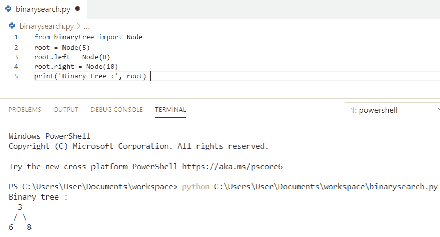
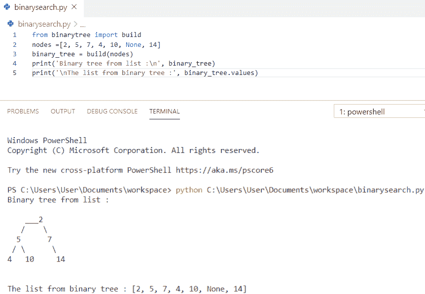
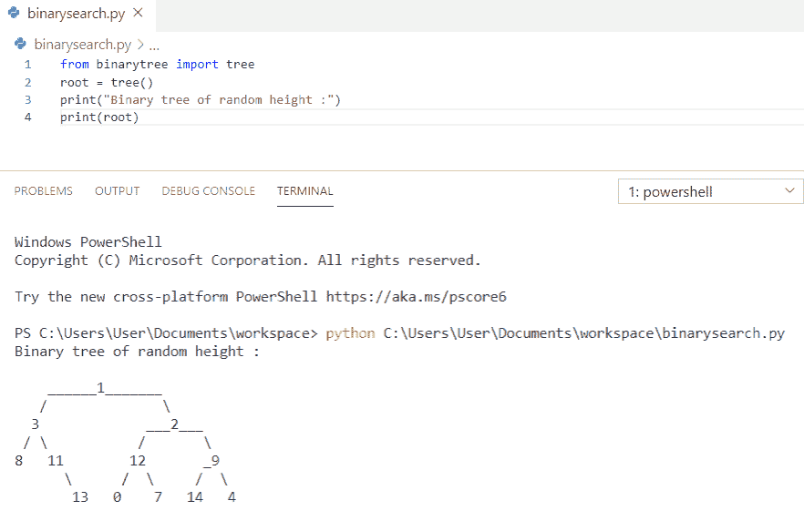
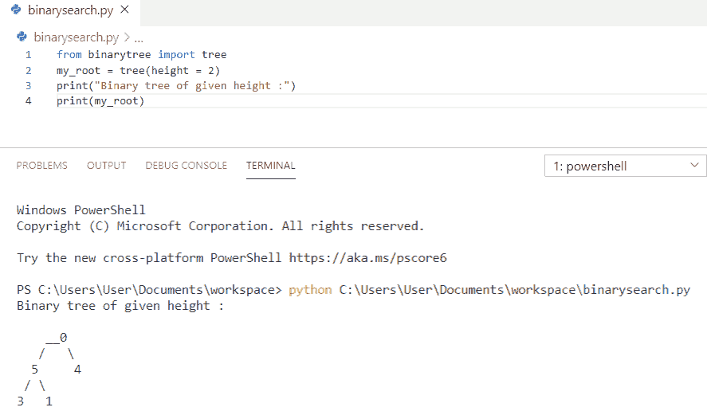
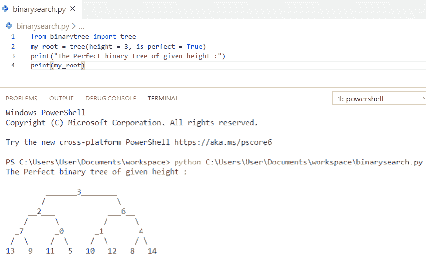

# Python 二叉树实现

> 原文：<https://pythonguides.com/python-binary-tree/>

[](https://sharepointsky.teachable.com/p/python-and-machine-learning-training-course)

在这个 [python 教程中，](https://pythonguides.com/python-hello-world-program/)你将通过例子了解到**二叉树在 python** 中的实现。这里我们将检查 **:**

*   python 中的二叉树是什么？
*   如何在 python 中安装二叉树
*   Python 二叉树实现
*   Python 从列表中构建了一棵二叉树
*   Python 构建了一个随机二叉树
*   Python 创建了一个给定高度随机二叉树
*   Python 创建了一个给定高度随机完美二叉树

目录

[](#)

*   [python 中的二叉树是什么？](#What_is_a_binary_tree_in_python "What is a binary tree in python?")
*   [如何在 python 中安装二叉树](#How_to_install_binary_tree_in_python "How to install binary tree in python")
*   [Python 二叉树实现](#Python_binary_tree_implementation "Python binary tree implementation")
*   [Python 从列表中构建二叉树](#Python_build_a_binary_tree_from_the_list "Python build a binary tree from the list")
*   [Python 构建随机二叉树](#Python_build_a_random_binary_tree "Python build a random binary tree")
*   [Python 创建给定高度的随机二叉树](#Python_create_a_random_binary_tree_of_a_given_height "Python create a random binary tree of a given height")
*   [Python 创建给定高度的随机完美二叉树](#Python_create_a_random_perfect_binary_tree_of_a_given_height "Python create a random perfect binary tree of a given height")

## python 中的二叉树是什么？

*   **二叉树**是一种数据结构，其中的元素最多有两个子元素，称为二叉树。
*   二叉树中的每个元素只能有两个子元素。
*   每个树由一个根节点作为父节点，左节点和右节点作为子节点组成。
*   二叉树可以用不同的数据结构以不同的方式表示，例如列表等。
*   二叉树库有助于直接实现二叉树。

你可能喜欢 Python 中的 [Groupby 熊猫](https://pythonguides.com/groupby-in-python-pandas/)和 Python 中的[如何减去两个数](https://pythonguides.com/subtract-two-numbers-in-python/)。

## 如何在 python 中安装二叉树

要在 python 中安装**二叉树**,我们必须在终端中输入下面的命令。一旦安装完毕，您就可以开始工作了。

```py
Pip install binarytree
```

## Python 二叉树实现

这里可以看到 **python 二叉树实现**。

首先，我们需要从 binarytree 导入节点"导入**，节点类表示二叉树中特定节点的结构。这个类的属性是值 left，right。**

**举例:**

```py
from binarytree import Node 
root = Node(5) 
root.left = Node(8) 
root.right = Node(10)  
print('Binary tree :', root) 
```

为了得到输出，我使用了 **print('二叉树:'，root)** 。您可以参考下面的输出截图。



Python binary tree implementation

你可能会喜欢，[如何在 Python 中交换两个数](https://pythonguides.com/swap-two-numbers-in-python/)。

## Python 从列表中构建二叉树

现在，我们将看到 **python 从列表**构建二叉树。

在这个例子中，我们将使用 `build()` 方法将值列表转换为二叉树，而不是 node 方法。给定的列表包含树的节点，它将建立一个二叉树。

**举例:**

```py
from binarytree import build 
nodes =[2, 5, 7, 4, 10, None, 14] 
binary_tree = build(nodes) 
print('Binary tree from list :\n', binary_tree) 
print('\nThe list from binary tree :', binary_tree.values) 
```

为了得到输出，我使用了 `print(binary_tree)` 和 `(binary_tree.values)` 。您可以参考下面的输出截图。



Python build a binary tree from the list

## Python 构建随机二叉树

我们来看 **python 构建随机二叉树**。

为了**在 python 中建立一个随机二叉树**，我们将使用 `tree()` ，它将生成一个随机二叉树并返回其根节点。

**举例:**

```py
from binarytree import tree 
root = tree() 
print("Binary tree of random height :") 
print(root) 
```

为了得到输出，我使用了 `print(root)` 。您可以参考下面的输出截图。



Python build a random binary tree

## Python 创建给定高度的随机二叉树

现在，我们将看到如何**创建一个给定高度**的随机二叉树。

为了**创建一个给定高度**的随机二叉树，我们必须指定参数为**高度**，其值可以在 0-9 之间。

**举例:**

```py
from binarytree import tree 
my_root = tree(height = 2) 
print("Binary tree of given height :") 
print(my_root) 
```

为了得到输出，我使用了 `print(my_root)` 。您可以参考下面的输出截图。



Python create a random binary tree of a given height

## Python 创建给定高度的随机完美二叉树

现在，我们将看到如何**创建一个给定高度**的随机完美二叉树。

为了**创建一个给定高度**的随机完美二叉树，我们将使用**是完美的` `=真的**，然后它将创建一个给定高度的完美二叉树。

**举例:**

```py
from binarytree import tree 
my_root = tree(height = 3, is_perfect = True) 
print("The Perfect binary tree of given height :") 
print(my_root)
```

为了得到输出，我使用了 `print(my_root)` 。您可以参考下面的输出截图。



Python create a random perfect binary tree of a given height

您可能会喜欢以下 Python 教程:

*   [Python 连接列表](https://pythonguides.com/python-concatenate-list/)
*   [Python 字符串格式化](https://pythonguides.com/python-string-formatting/)
*   [Python 串联元组](https://pythonguides.com/python-concatenate-tuples/)
*   [如何在 python 中连接字符串](https://pythonguides.com/concatenate-strings-in-python/)
*   [Python 串联字典](https://pythonguides.com/python-concatenate-dictionary/)

在本教程中，我们已经了解了 **Python 二叉树实现**，并且我们已经涵盖了以下主题:

*   python 中的二叉树是什么？
*   如何在 python 中安装二叉树
*   Python 二叉树实现
*   Python 从列表中构建了一棵二叉树
*   Python 构建了一个随机二叉树
*   Python 创建了一个给定高度随机二叉树
*   Python 创建了一个给定高度随机完美二叉树

[Bijay Kumar](https://pythonguides.com/author/fewlines4biju/)

Python 是美国最流行的语言之一。我从事 Python 工作已经有很长时间了，我在与 Tkinter、Pandas、NumPy、Turtle、Django、Matplotlib、Tensorflow、Scipy、Scikit-Learn 等各种库合作方面拥有专业知识。我有与美国、加拿大、英国、澳大利亚、新西兰等国家的各种客户合作的经验。查看我的个人资料。

[enjoysharepoint.com/](https://enjoysharepoint.com/)[](https://www.facebook.com/fewlines4biju "Facebook")[](https://www.linkedin.com/in/fewlines4biju/ "Linkedin")[](https://twitter.com/fewlines4biju "Twitter")