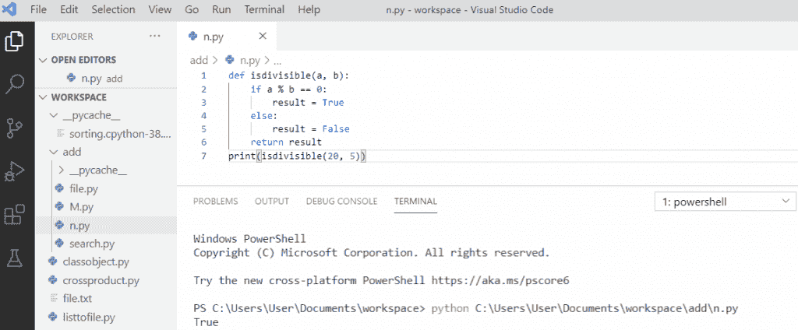

# python 布尔型

> 原文：<https://pythonguides.com/python-booleans/>

[](https://sharepointsky.teachable.com/p/python-and-machine-learning-training-course)

在本 [python 教程](https://pythonguides.com/python-hello-world-program/)中，我们将讨论 **Python 布尔值**。我们还将检查:

*   python 中的布尔是什么？
*   Python 布尔类型
*   python 中哪里用布尔？
*   python 中的函数返回布尔值
*   python 中的真与假
*   python 中的布尔字符串
*   Python 布尔变量
*   Python 布尔逻辑运算符
*   Python 将一个布尔值连接到一个字符串
*   Python 将布尔值转换为字符串
*   Python 将布尔值转换为整数
*   Python 将布尔值列表转换为整数
*   Python 布尔型空值检查
*   如果在列表中，则为 Python 布尔值

让我们看看 Python Boolean 及其类型。

目录

[](#)

*   [python 中的布尔是什么？](#What_is_Boolean_in_python "What is Boolean in python?")
*   [Python 布尔类型](#Python_Boolean_types "Python Boolean types")
*   [python 中哪里用布尔？](#Where_to_use_Boolean_in_python "Where to use Boolean in python?")
*   [python 中的函数返回布尔值](#Function_return_Boolean_in_python "Function return Boolean in python")
*   [python 中的真或假](#True_or_false_in_python "True or false in python")
*   [python 中的布尔字符串](#Boolean_string_in_python "Boolean string in python")
*   [Python 布尔变量](#Python_boolean_variable "Python boolean variable")
*   [Python 布尔逻辑运算符](#Python_boolean_logical_operators "Python boolean logical operators")
*   [Python 将一个布尔值连接成一个字符串](#Python_concatenate_a_boolean_to_a_string "Python concatenate a boolean to a string")
*   [Python 将布尔值转换为字符串](#Python_convert_boolean_to_string "Python convert boolean to string")
*   [Python 将布尔值转换为整数](#Python_convert_boolean_to_integer "Python convert boolean to integer")
*   [Python 布尔值统计一个列表中 True 的个数](#Python_booleans_count_the_number_of_True_in_a_list "Python booleans count the number of True in a list")
*   [Python 将布尔值列表转换为整数](#Python_convert_list_of_booleans_to_integer "Python convert list of booleans to integer")
*   [Python 布尔检查空值](#Python_boolean_check_for_null "Python boolean check for null")
*   [Python 布尔函数](#Python_boolean_function "Python boolean function")
*   [Python 布尔 if 在列表中](#Python_boolean_if_in_list "Python boolean if in list")

## python 中的布尔是什么？

*   在 python 中，Boolean 是一种用于存储两个值 True 和 False 的数据类型。
*   在 python 中，我们可以对任何表达式求值，可以得到两个答案中的一个。
*   在比较两个值时，表达式被评估为 true 或 false。
*   Bool 用于测试表达式。

## Python 布尔类型

类型 **bool 是内置的**，这意味着它在 python 中可用，不需要导入。 **Python 布尔**只有两种类型:

1.  真实的
2.  错误的

## python 中哪里用布尔？

在 python 中，当需要比较两个值时，可以使用**布尔值**。比较这些值后，它返回 true 或 false。

**你可以参考下面的例子**:

```py
my_string = "Hello Sam"
print(my_string.isalnum())
```

你可以参考下面的截图:


Where to use Boolean in python

读取: [Python NumPy 读取 CSV](https://pythonguides.com/python-numpy-read-csv/)

## python 中的函数返回布尔值

让我们看看如何用 Python 创建一个返回布尔值的函数。这里我们创建了函数**“def my function()”**，它返回 True。

**举例:**

```py
def myFunction():
  return True
print(myFunction())
```

可以参考下面截图`python`中函数返回布尔值。


Function return Boolean in python

## python 中的真或假

当我们比较两个值时，表达式被求值，它返回布尔答案，要么为真，要么为假。

**举例:**

```py
a = 10
b = 12
print(a>b)
```

写完上面的代码(python 中的 true 或 false)后，一旦我们打印，输出将显示为 `" False "` 。这里，a 不大于 b，所以它将输出返回 false。

你可以参考下面的截图来判断 python 中的真假。


True or false in python

## python 中的布尔字符串

在 python 中，可以测试字符串的布尔值。它的返回类型将是 true 或 false。

**举例:**

```py
my_string = "Hello David"
print(my_string.endswith('d'))
```

写完上面的代码(python 中的布尔字符串)后，一旦我们打印，输出将显示为 `" True "` 。这里创建了一个变量，它有一个值，在我们打印时会检查这个值。该字符串以**‘d’**结尾，因此它返回 `True` 。

可以参考下面截图`python`中的布尔字符串。


Boolean string in python

阅读: [Python NumPy 日志](https://pythonguides.com/python-numpy-log/)

## Python 布尔变量

在这里，我们可以看到 python 布尔变量。

`bool()` 函数允许你计算任何值，它返回**真**或**假**。

**举例:**

```py
var = "Python"
print(bool(var))
```

写完上面的代码(python 布尔变量)后，一旦你将打印 `"bool(var)"` 那么输出将显示为 `" True "` 。这里创建了一个变量，函数将计算该值并返回 True。

可以参考下面截图 python 布尔变量。


Python boolean variable

## Python 布尔逻辑运算符

python 中的逻辑运算符用于 True 或 False 的条件语句。python 中的逻辑运算符是 AND、OR 和 Not。

1.  **And 运算符**–如果操作数右侧和左侧都为真，则返回真。

**举例:**

```py
x = 8
print(x > 4 and x < 10)
```

写完上面的代码(python boolean AND 操作符)，一旦你打印出，那么输出将显示为**“真”**。这里使用了**和**运算符，它将返回 `True` ，因为 8 大于 4，8 小于 10。

可以参考下面截图 python 布尔和运算符。


`And operator`

2. **Or 运算符**–如果操作数右侧或左侧为真，则返回真。

**举例:**

```py
x = 6
print(x > 5 or x < 2)
```

写完上面的代码(python boolean Or 操作符)后，一旦打印出，输出将显示为**“真”**。这里使用了**或**运算符，它将返回 `True` ，因为其中一个条件为真。所以，6 大于 5，但 6 不小于 2。

可以参考下面截图 python 布尔 Or 运算符。


`OR operator`

3.**非运算符**–如果操作数为假，则返回真。

**举例:**

```py
x = 6
print(not(x > 5 and x < 10))
```

写完上面的代码(python boolean Not operator)，一旦你将打印那么输出将显示为**“假”**。这里使用了 `Not` 运算符，它将返回 `False` ，因为 Not 用于反转结果。

可以参考下面截图 python 布尔 Not 运算符。


`Not operator`

## Python 将一个布尔值连接成一个字符串

要将一个布尔值连接到一个字符串，我们首先将布尔值转换为一个字符串，然后将它附加到另一端。

**举例:**

```py
my_string = "The value is"
boolean_v = True
str_concat = my_string + str(boolean_v)
print(str_concat)
```

写完上面的代码(python 将一个布尔值连接成一个字符串)，一旦你打印出**“str _ concat”**，那么输出将显示为**“值为真”**。这里， `str(boolean_v)` 用于将布尔值转换为字符串。 `"+"` 运算符用于将值连接成一个字符串。

你可以参考下面的截图 python 把一个布尔值连接成一个字符串。


Python concatenate a boolean to a string

## Python 将布尔值转换为字符串

为了在 python 中**将 boolean 转换成 string** ，我们将使用 `str(bool)` 然后将其转换成 string。

**举例:**

```py
bool = True
my_string = str(bool)
print(my_string)
print(type(my_string))
```

写完上面的代码(python 将 boolean 转换为 string)，一旦你将打印`" my _ string and type(my _ string)"`那么输出将显示为 **" True < class 'str' > "** 。这里， `str(bool)` 用于将布尔值转换为字符串。

可以参考下面的截图 python 把 boolean 转换成 string。


Python convert boolean to string

## Python 将布尔值转换为整数

为了**在 python 中把 boolean 转换成 integer** ，我们会用 `int(bool)` 然后再把它转换成 integer。

**举例:**

```py
bool = True
my_integer = int(bool)
print(my_integer)
print(type(my_integer))
```

写完上面的代码(python 将 boolean 转换为 integer)，一旦你将打印`" my _ integer and type(my _ integer)"`那么输出将显示为 **" 1 < class 'int' > "** 。这里， `int(bool)` 用于将布尔值转换为整数值。

可以参考下面的截图 python 把 boolean 转换成 integer。


Python convert boolean to integer

## Python 布尔值统计一个列表中 True 的个数

从列表中计算**真布尔值**的数量，返回评估为真的布尔对象的数量。具有真值的布尔对象在 sum()函数中的计算结果为 1，它将从列表中返回真布尔的计数。

**举例:**

```py
bool_list = [True, False, True, False, True, True]
count_t = sum(bool_list)
print(count_t)
```

写完上面的代码(python booleans 统计一个列表中 True 的个数)，一旦你将打印 `"count_t"` 那么输出将出现为 `" 4 "` 。这里， `sum(bool_list)` 用来统计一个列表中真布尔的个数。

你可以参考下面截图中 python 布尔计数列表中的真数。


Python booleans count the number of True in a list

## Python 将布尔值列表转换为整数

将一个**布尔列表转换成整数**，我们将首先将一个布尔列表转换成整数。所以，我们将使用一个**地图(函数，可迭代**)。

**举例:**

```py
bool_list = [True, False]
convert = map(int, bool_list)
int_list = list(convert)
print(int_list)
```

写完上面的代码(python 将布尔值列表转换为整数)，一旦打印出 `"int_list"` ，那么输出将显示为 **" [1，0] "** 。这里，要将一个布尔值列表转换成整数，我们将使用 `list(iterable)` 和 `map()` 作为 iterable 来转换成一个列表。

你可以参考下面的截图 python 将布尔值转换为整数的列表。


Python convert list of booleans to integer

## Python 布尔检查空值

python 中没有 null，取而代之的是 `None` 。为了检查 `None` 的值，我们将使用**“is”**身份运算符。它将检查变量是否引用底层对象。

**举例:**

```py
value = None
print(value is None)
```

写完上面的代码(python boolean 检查 null)后，一旦打印出 `"value is None"` ，输出将显示为 `" True "` 。它将检查该值是否为 None。如果**值不为**，那么它将返回**真**否则为假。

你可以参考下面的截图 python 布尔检查空值。


Python boolean check for null

## Python 布尔函数

布尔函数的名字是 `isdivisible` 。 `isdivisible` 返回 True 或 False 来表示 a 是否能被 b 整除

**举例:**

```py
def isdivisible(a, b):
    if a % b == 0:
        result = True
    else:
        result = False
    return result
print(isdivisible(20, 5))
```

写完上面的代码(python 布尔函数)，一旦你打印出 `"isdivisible"` ，那么输出将显示为 `" True "` 。这里，任何表达式求值的结果都可以通过函数**“使用 return 语句”**返回。该函数将返回布尔值。

可以参考下面截图 python 布尔函数。



Python boolean function

## Python 布尔 if 在列表中

它检查这些项的计算结果是否为真。列表中的表达式 **True 将返回一个不可迭代的布尔值。**

**举例:**

```py
list = [True, False, False]
print(True in list)
```

写完上面的代码(python boolean if in list)，一旦打印出 `"True in list"` ，那么输出将显示为 `" True "` 。

如果在列表中，您可以参考下面的截图 python 布尔型


Python boolean if in list

您可能会喜欢以下 Python 教程:

*   [Python 打印 2 位小数](https://pythonguides.com/python-print-2-decimal-places/)
*   [Python 生成器](https://pythonguides.com/python-generators/)
*   [Python 计数器——详细教程](https://pythonguides.com/python-counter/)
*   [Python 递归](https://pythonguides.com/python-recursion/)
*   [Python Tkinter 菜单栏–如何使用](https://pythonguides.com/python-tkinter-menu-bar/)
*   [Python 格式数字加逗号](https://pythonguides.com/python-format-number-with-commas/)
*   [如何在 python 中使用正则表达式拆分字符串](https://pythonguides.com/python-split-string-regex/)
*   [如何在 Python 中创建字符串](https://pythonguides.com/create-a-string-in-python/)
*   [如何在 python 中创建变量](https://pythonguides.com/create-python-variable/)
*   [Python 中的正则表达式](https://pythonguides.com/regular-expressions-in-python/)
*   [集合的并集 Python +实例](https://pythonguides.com/union-of-sets-python/)

在本 Python 教程中，我们已经了解了 **Python 布尔函数**。此外，我们还讨论了以下主题:

*   python 中的布尔是什么？
*   Python 布尔类型
*   python 中哪里用布尔？
*   python 中的函数返回布尔值
*   python 中的真与假
*   python 中的布尔字符串
*   Python 布尔变量
*   Python 布尔逻辑运算符
*   Python 将一个布尔值连接到一个字符串
*   Python 将布尔值转换为字符串
*   Python 将布尔值转换为整数
*   Python 将布尔值列表转换为整数
*   Python 布尔型空值检查
*   如果在列表中，则为 Python 布尔值

[Bijay Kumar](https://pythonguides.com/author/fewlines4biju/)

Python 是美国最流行的语言之一。我从事 Python 工作已经有很长时间了，我在与 Tkinter、Pandas、NumPy、Turtle、Django、Matplotlib、Tensorflow、Scipy、Scikit-Learn 等各种库合作方面拥有专业知识。我有与美国、加拿大、英国、澳大利亚、新西兰等国家的各种客户合作的经验。查看我的个人资料。

[enjoysharepoint.com/](https://enjoysharepoint.com/)[](https://www.facebook.com/fewlines4biju "Facebook")[](https://www.linkedin.com/in/fewlines4biju/ "Linkedin")[](https://twitter.com/fewlines4biju "Twitter")