# Python 内置函数及示例

> 原文：<https://pythonguides.com/python-built-in-functions/>

[](https://sharepointsky.teachable.com/p/python-and-machine-learning-training-course)

在这个 [python 教程](https://pythonguides.com/python-hello-world-program/)中，你将通过几个例子了解不同的 **Python 内置函数**。在 [Python](https://pythonguides.com/create-list-in-python/) 中有各种内置函数可以使用。这里我们将检查 **:**

*   Python 绝对值
*   Python 类型函数
*   Python 任意函数
*   Python round 函数
*   Python 对象函数
*   Python 集合函数
*   Python 字符函数
*   Python getattr 函数
*   Python 排序函数
*   Python 反向函数
*   Python all 函数
*   Python 范围函数
*   Python ord()函数
*   Python vars()函数
*   Python eval()函数
*   Python pow()函数
*   Python 输入()函数
*   Python next()函数
*   在 python 中四舍五入到两位小数
*   Python 全局()函数

目录

[](#)

*   [Python 内置函数](#Python_built-in_functions "Python built-in functions")
    *   [Python 绝对值()值函数](#Python_absolute_value_function "Python absolute() value function")
    *   [Python type()函数](#Python_type_function "Python type() function")
    *   [Python any()函数](#Python_any_function "Python any() function")
    *   [Python round()函数](#Python_round_function "Python round() function")
    *   [Python 对象()函数](#Python_object_function "Python object() function")
    *   [Python set()函数](#Python_set_function "Python set() function")
    *   [Python character()函数](#Python_character_function "Python character() function")
    *   [Python getattr()函数](#Python_getattr_function "Python getattr() function")
    *   [Python 排序函数](#Python_sorted_function "Python sorted function")
    *   [Python 反转函数](#Python_reversed_function "Python reversed function")
*   [Python 所有函数](#Python_all_function "Python all function")
*   [Python 范围函数](#Python_range_function "Python range function")
*   [Python ord()函数](#Python_ord_function "Python ord() function")
*   [Python vars()函数](#Python_vars_function "Python vars() function")
*   [Python eval()函数](#Python_eval_function "Python eval() function")
*   [Python pow()函数](#Python_pow_function "Python pow() function")
*   [Python 输入()函数](#Python_input_function "Python input() function")
*   [Python next()函数](#Python_next_function "Python next() function")
*   [在 python 中四舍五入到两位小数](#Round_to_two_decimal_places_in_python "Round to two decimal places in python")
*   [Python globals()函数](#Python_globals_function "Python globals() function")

## Python 内置函数

现在，让我们通过一些例子来看看 **Python 内置函数**。

*   [Python 命名约定](https://pythonguides.com/python-naming-conventions/)
*   [Python 中的字符串方法及示例](https://pythonguides.com/string-methods-in-python/)
*   [Python While 循环示例](https://pythonguides.com/python-while-loop/)
*   [Python 中的字符串方法及示例](https://pythonguides.com/string-methods-in-python/)
*   [Python 数组与示例](https://pythonguides.com/python-array/)
*   [Python 退出命令(quit()、exit()、sys.exit())](https://pythonguides.com/python-exit-command/)
*   [Python 二分搜索法和线性搜索](https://pythonguides.com/python-binary-search/)

### Python 绝对值()值函数

在 python 中，为了**得到绝对值我们内置了函数 abs()** 。一个数的绝对值是一个不考虑符号的值。

**举例:**

```py
value = abs(-3.7)
print(value)
```

写完上面的代码(python 绝对值函数)，你将打印出 `"value"` ，然后输出将显示为 `" 3.7 "` 。这里，abs()函数用于通过移除符号来给出绝对值。

python 绝对值函数可以参考下面的截图。

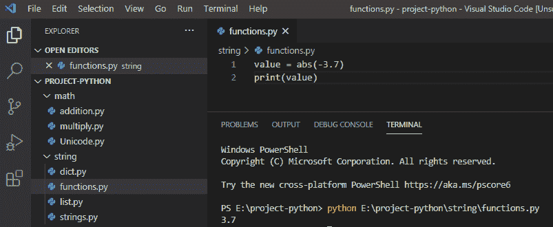

Python absolute() value function

### Python type()函数

在 python 中， `type()` 函数用于返回指定对象的类型。

**举例:**

```py
value = "Hello"
x = type(value)
print(x)
```

写完上述代码(python 类型函数)后，你将打印出 `" x "` ，然后输出将显示为 **" <类的‘str’>"**。这里，type()函数返回对象的类型，所以它是字符串类型。

你可以参考下面的 python 类型函数截图

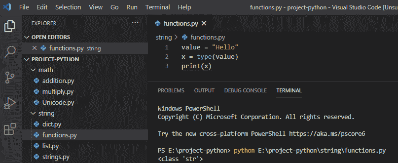

Python type() function

### Python any()函数

在 python 中， `any()` 函数用于检查列表中的任何项目是否为真，然后返回真，否则返回假。这是另一个我们经常使用的 Python 内置函数。

**举例:**

```py
value = [True, False, False]
check = any(value)
print(check)
```

写完上面的代码(python any function)，你将打印出**【check】**，然后输出将显示为**【True】**。这里，any()函数用于检查列表中存在的项目是否具有真值，如果为假，则返回假。

你可以参考下面 python 任意函数的截图

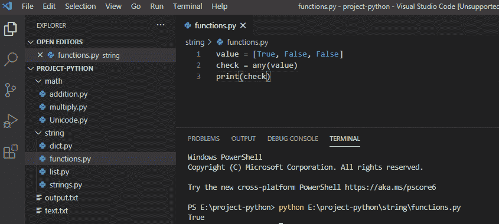

Python any() function

读取 [Python 返回函数](https://pythonguides.com/python-return-function/)

### Python round()函数

在 Python 内置函数列表中，另一个函数为 round()函数。`round()`Python 中的函数用于返回一个对指定数字进行舍入的浮点数，该函数将返回最接近的整数。

**举例:**

```py
value = round(22.34567)
print(value)
```

写完上面的代码(python round 函数)，你将打印出 `" value "` ，然后输出将显示为 `" 22 "` 。这里，round()函数用于返回浮点数，该浮点数将被舍入到指定的小数位数。

你可以参考下面的 python round 函数截图

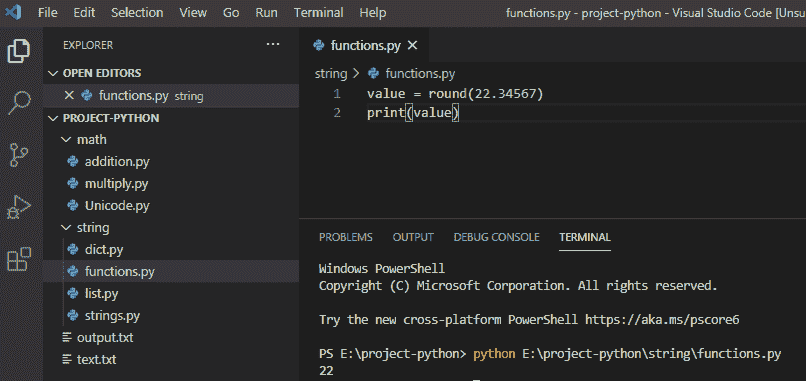

Python round() function

*   [名称错误:Python 中没有定义名称](https://pythonguides.com/nameerror-name-is-not-defined/)
*   [Python 检查变量是否为整数](https://pythonguides.com/python-check-if-the-variable-is-an-integer/)
*   [值错误:数学域错误](https://pythonguides.com/valueerror-math-domain-error/)
*   [检查一个数是否是素数 Python](https://pythonguides.com/check-if-a-number-is-a-prime-python/)
*   [Python GUI 编程](https://pythonguides.com/python-gui-programming/)

### Python 对象()函数

在 python 中， `object()` 函数返回一个空对象，它不接受任何参数。这个对象是所有类的基础，它有内置的属性，这是所有类的默认属性。

**举例:**

```py
value = object()
print(dir(value))
```

写完上面的代码(python round 函数)，你会打印出 `" dir(value) "` 然后输出就会出现。这里， `object()` 函数用于返回所有类的基类，而 `dir()` 用于获取所有属性。

你可以参考下面的 python 对象函数截图

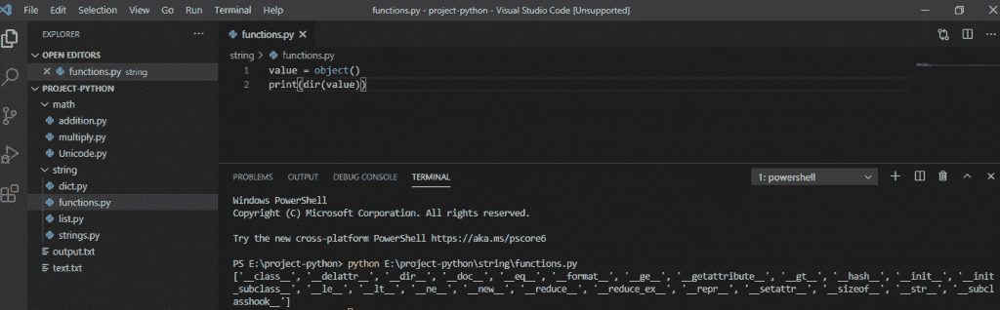

Python object() function

### Python set()函数

**Python set()函数**用于创建一个集合，其中的元素列表是无序的，它将以随机的形式出现，并删除重复项。

**举例:**

```py
value = set(('Alice', 'Mark', 'Andrew'))
print(value)
```

写完上面的代码(python set 函数)，你将打印出 `" value "` ，然后输出将显示为 **" {'Marks '，' Alice '，' Andrew'} "** 。这里，set()函数用于创建一个集合，其中的元素是无序的。

你可以参考下面 python set 函数的截图

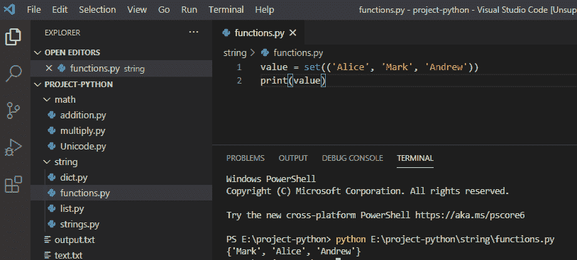

Python set() function

### Python character()函数

我们可以使用 **Python chr()函数**，来获取代表 Python 中指定 Unicode 的字符。这是另一个流行的 Python 内置函数。

**举例:**

```py
value = chr(97)
print(value)
```

写完上面的代码(python 字符函数)，你将打印出 `" value "` ，然后输出将显示为 `" a "` 。这里，chr()函数用于获取指定 Unicode 的字符。所以，Unicode“97”是代表“a”。

你可以参考下面的 python 字符函数截图

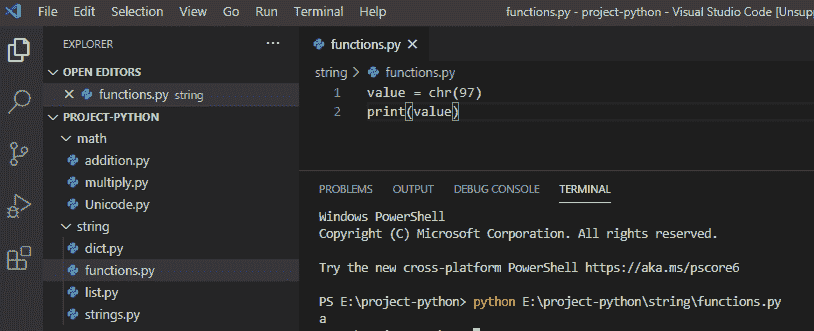

Python character() function

### Python getattr()函数

Python getattr()函数用于从对象中获取指定属性的值，getattr()可以带两个参数。

**举例:**

```py
class Employee:
Name = 'Aahana'
Age =36
Salary = 15000
value = getattr(Employee, 'Salary')
print(value)
```

写完上面的代码(python getattr 函数)，你将打印出 `" value "` ，然后输出将显示为 `" 15000 "` 。这里，getattr()函数用于从对象中获取指定的值，而“Salary”是指定的属性。

你可以参考下面 python getattr 函数的截图

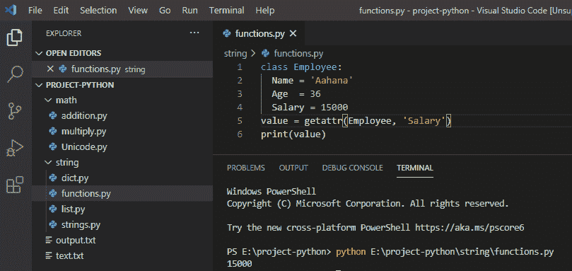

Python getattr() function

### Python 排序函数

**Python sorted()函数**用于默认情况下对元素进行升序排序，结果将按照排序后的顺序。查看 Python 内置函数的一个示例，这次是 sorted()函数。

**举例:**

```py
value = (15, 12, 10, 11, 14, 13)
s = sorted(value)
print(s)
```

写完上面的代码(python 排序函数)，你将打印出 `" s "` ，然后输出将显示为**"【10，11，12，13，14，15】"**。这里，sorted()函数按升序对数字项进行排序。

你可以参考下面的 python 排序函数截图

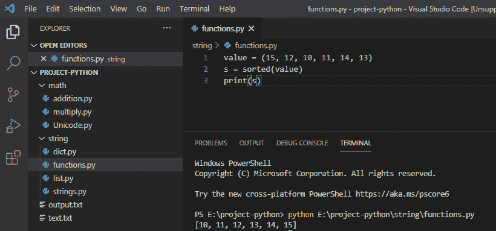

Python sorted function

同样，如果你想按降序对列表排序，那么我们将使用 sorted()(T3)函数和反向参数，如果反向是真的，那么它将按降序排序。

```py
value = (15, 12, 10, 11, 14, 13)
s = sorted(value, reverse=True)
print(s)
```

写完上面的代码(python 排序函数)，你将打印出 `" s "` ，然后输出将显示为**"【10，11，12，13，14，15】"**。这里，带有参数“reverse=True”的 sorted()函数将按降序对数字项进行排序。

你可以参考下面的 python 排序函数截图

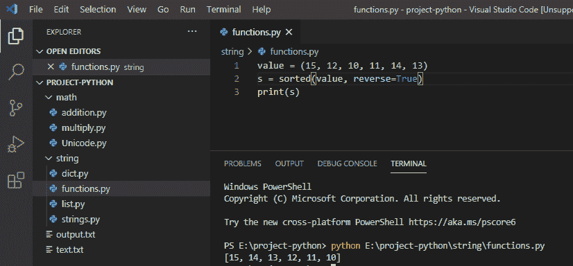

### Python 反转函数

在 python 中， `reversed()` 函数用于反转列表中出现的元素。

**举例:**

```py
value = ["tom", "alice", "sid", "zoe"]
store = reversed(value)
for a in store:
print(a)
```

写完上面的代码(python 反转函数)，你将打印出 `" a "` ，然后输出将显示为**"佐伊，希德，爱丽丝，汤姆"**。这里，reversed()函数用于反转项目的顺序。

你可以参考下面的 python 反函数截图

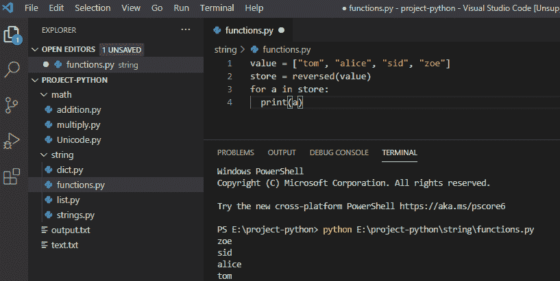

Python reversed() function

## Python 所有函数

在 python 中，内置的 `all()` 函数如果所有的元素都为真将返回真，否则如果任何一个元素为假将返回假。

**举例:**

```py
value = [11, 12, 13, 14, 15]
print(all(value))
```

写完上面的代码(python all 函数)，你将打印出 `" all() "` ，然后输出将显示为 `" True "` 。这里，all()函数用于检查 iterable 中的所有元素是否为真。

你可以参考下面的 python all 函数截图

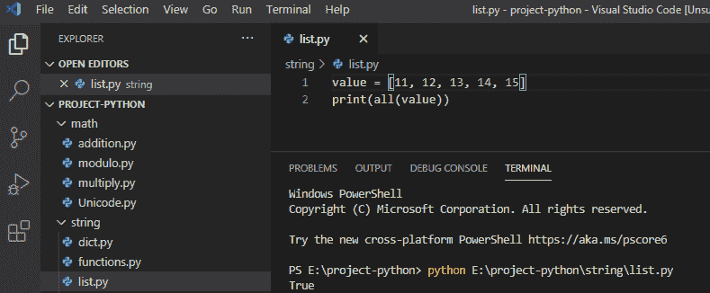

我们还将检查，如果任何元素为假，那么 `all()` 函数将返回假。

**举例:**

```py
value = [0, 12, 13, 14, 15]
print(all(value))
```

写完上面的代码(python all 函数)，你将打印出 `" all() "` ，然后输出将显示为 `" False "` 。这里，all()函数将进行检查，它将找到一个错误元素，即**“0”**，并返回 false。

你可以参考下面的 python all 函数截图

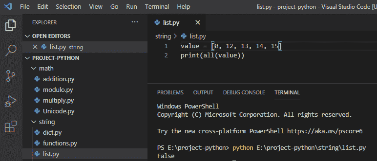

## Python 范围函数

在 python 中，内置的 `range()` 函数用于返回一个数字序列，默认情况下，它将从 0 开始，并在提到的范围之前停止。

**举例:**

```py
value = range(10)
for number in value:
print(number)
```

写完上面的代码(python range 函数)，你将打印出 `" number "` ，然后输出将显示为 `" 0 1 2 3 4 5 6 7 8 9 "` 。这里，range()函数将返回一个从 0 开始的数字，默认情况下，它将在提到的范围之前停止。

你可以参考下面 python range 函数的截图

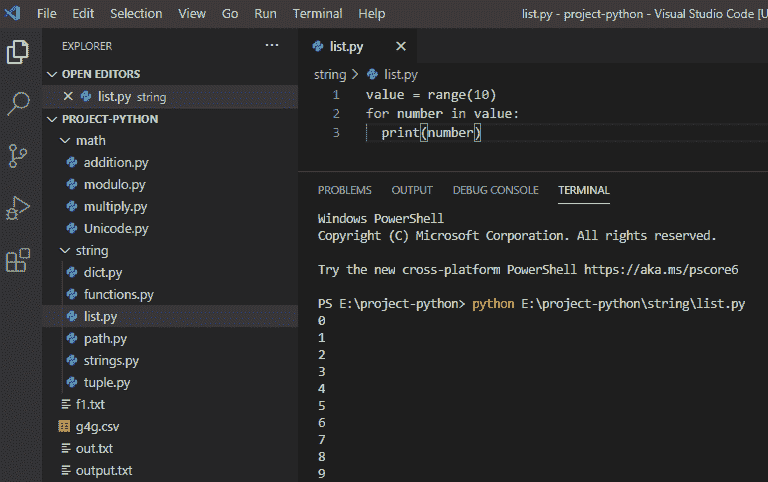

## Python ord()函数

`ord()` 函数返回一个表示 Unicode 字符的整数，而 ord()函数只接受一个参数。

**举例:**

```py
x = ord("B")
print(x)
```

写完上面的代码(python ord()函数)，你将打印出 `" x "` ，然后输出将显示为 `" 66 "` 。这里， `ord()` 函数将返回字符**‘B’**的 Unicode 码位值。

你可以参考下面 python ord()函数的截图

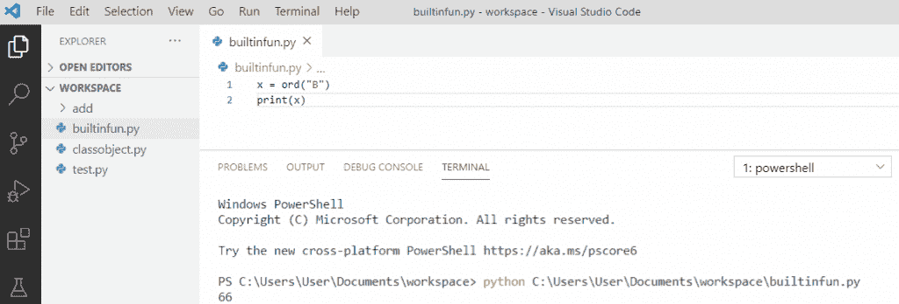

Python ord() function

## Python vars()函数

在 python 中， `vars()` 函数返回给定对象的 `__dict__` 属性。

**举例:**

```py
class Teacher:
def __init__(self, x = 15, y = 18):
self.x = x
self.y = y
t1 = Teacher()
print(vars(t1))
```

写完上面的代码(python vars()函数)，你将打印出 `" vars(t1)"` ，然后输出将显示为 **" {'x':15，' y':18} "** 。这里， `vars()` 函数将返回字典，它存储对象属性。

你可以参考下面 python vars()函数的截图

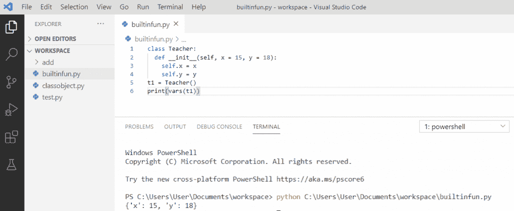

Python vars() function

## Python eval()函数

`eval()` 是一个内置函数，它评估传递给方法的表达式，如果表达式合法，那么它将执行。

**举例:**

```py
a = 1
print(eval('a + 10'))
```

写完上面的代码(python eval()函数)后，你将打印出 **" eval('a + 10') "** ，然后输出将显示为 `" 11 "` 。这里， `eval()` 返回表达式的计算结果。

你可以参考下面 python eval()函数的截图

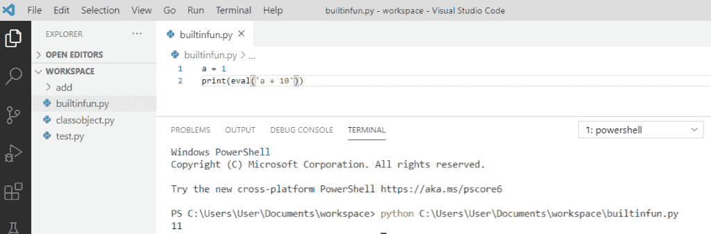

Python eval() function

## Python pow()函数

`pow()` 是一个内置函数，返回数字的幂。 `pow()` 函数有三个参数， **pow(x，y，z)** 其中 `"x"` 是**的底数**， `"y"` 是**的指数**， `"z"` 用于表示**的模数**。

**举例:**

```py
a = pow(5, 3)
print(a)
```

写完上面的代码(python pow()函数)，你将打印出 `" a "` ，然后输出将显示为 `" 125 "` 。这里， `pow()` 返回 5 的 3 次方值，得到 125。

可以参考下面 python pow()函数的截图

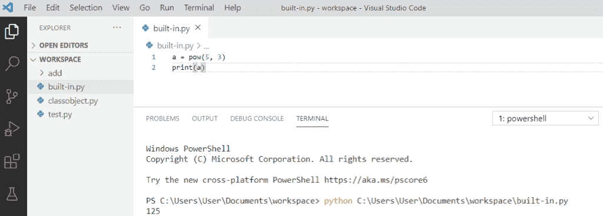

Python pow() function

## Python 输入()函数

`input()` 为内置函数，允许用户输入并打印。

**举例:**

```py
a = input("Enter a string: ")
print("Welcome, " + a)
```

编写上述代码(python input()函数)后，您将打印这些代码，然后输出将显示为**“欢迎，学生”**。这里， `input()` 函数将允许用户进行输入，然后打印出来。

你可以参考下面 python input()函数的截图

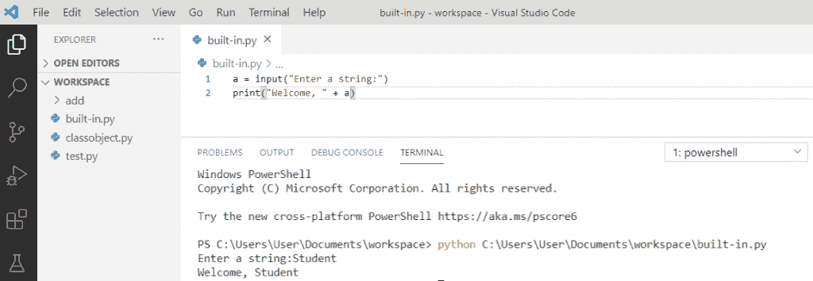

Python input() function

## Python next()函数

函数的作用是:返回迭代器中的下一项。列表是可迭代的，我们通过使用 python 中的 `iter()` 函数从列表中获取迭代器。

**举例:**

```py
f_list = iter(["rose","tulip"])
s = next(f_list)
print(s)
s = next(f_list)
print(s) 
```

在编写了上面的代码(python next()函数)之后，一旦你打印了 `" s "` ，那么输出将显示为**"玫瑰郁金香"**。这里， `next()` 函数从迭代器返回下一个条目，它将一个接一个地打印这个条目。

可以参考下面 python next()函数的截图

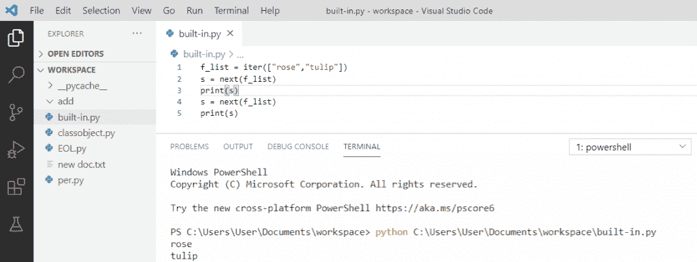

Python next() function

## 在 python 中四舍五入到两位小数

我们将使用 **round(numbers，ndigits)** 和一个 float 作为 number，ndigits 在 python 中将 float 四舍五入到两位小数。

**举例:**

```py
my_float = 5.13169
float_v = round(my_float, 2)
print(float_v)
```

写完上面的代码(在 python 中四舍五入到两位小数)，你将打印出 `" float_v "` ，然后输出将显示为 `" 5.13 "` 。这里， `round()` 函数用于在 python 中将浮点数限制到两位小数。

你可以参考下面的 python 截图，在 python 中四舍五入到两位小数

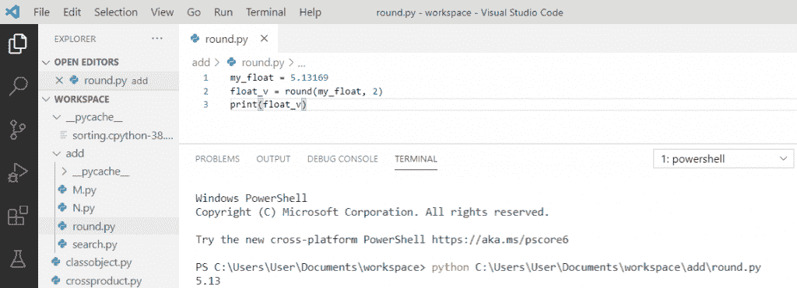

Round to two decimal places in python

## Python globals()函数

函数的作用是:返回当前全局符号表的字典。符号表包含当前程序的所有必要信息，包括方法、变量名等。

```py
s = globals()
print(s)
```

写完上面的代码(python globals()函数)，你将打印出 `" s "` 然后输出将会出现。这里， `globals()` 方法不接受任何参数，它返回当前全局符号表的字典。

你可以参考下面 python globals()函数的截图

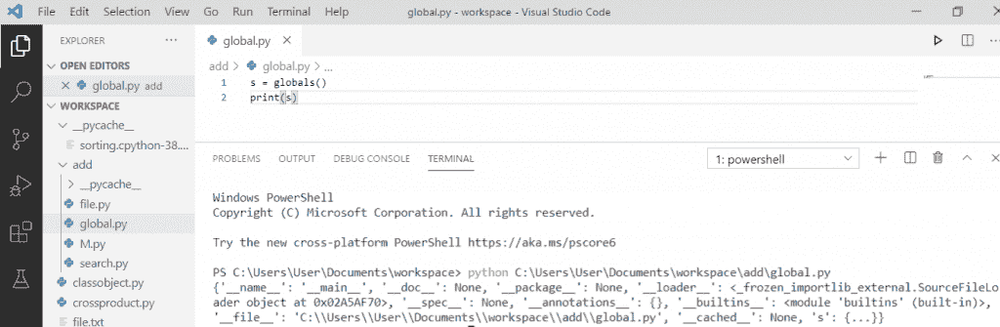

Python globals() function

这就是我们如何在 python 中使用**内置函数。**

您可以查看以下 Python 教程:

*   [获取当前目录 Python](https://pythonguides.com/get-current-directory-python/)
*   [语法错误返回外部函数 python](https://pythonguides.com/syntaxerror-return-outside-function-python/)
*   [从字符串 Python 中删除字符](https://pythonguides.com/remove-character-from-string-python/)
*   [如何在 Python 中处理 indexerror:字符串索引超出范围](https://pythonguides.com/indexerror-string-index-out-of-range-python/)
*   [删除 python 中的 Unicode 字符](https://pythonguides.com/remove-unicode-characters-in-python/)
*   [Python 将列表转换成字符串](https://pythonguides.com/python-convert-list-to-string/)
*   [Python 字符串函数](https://pythonguides.com/string-methods-in-python/)
*   [如何在 python 中把整数转换成字符串](https://pythonguides.com/convert-an-integer-to-string-in-python/)
*   [如何在 python 中连接字符串](https://pythonguides.com/concatenate-strings-in-python/)

在本教程中，我们学习了如何使用 python 中的各种内置函数，也看到了 **Python 内置函数示例**。

*   Python 绝对值
*   Python 类型函数
*   Python 任意函数
*   Python round 函数
*   Python 对象函数
*   Python 集合函数
*   Python 字符函数
*   Python getattr 函数
*   Python 排序函数
*   Python 反向函数
*   Python all 函数
*   Python 范围函数
*   Python ord()函数
*   Python vars()函数
*   Python eval()函数
*   Python pow()函数
*   Python 输入()函数
*   Python next()函数
*   在 python 中四舍五入到两位小数
*   Python 全局()函数

[Bijay Kumar](https://pythonguides.com/author/fewlines4biju/)

Python 是美国最流行的语言之一。我从事 Python 工作已经有很长时间了，我在与 Tkinter、Pandas、NumPy、Turtle、Django、Matplotlib、Tensorflow、Scipy、Scikit-Learn 等各种库合作方面拥有专业知识。我有与美国、加拿大、英国、澳大利亚、新西兰等国家的各种客户合作的经验。查看我的个人资料。

[enjoysharepoint.com/](https://enjoysharepoint.com/)[](https://www.facebook.com/fewlines4biju "Facebook")[](https://www.linkedin.com/in/fewlines4biju/ "Linkedin")[](https://twitter.com/fewlines4biju "Twitter")