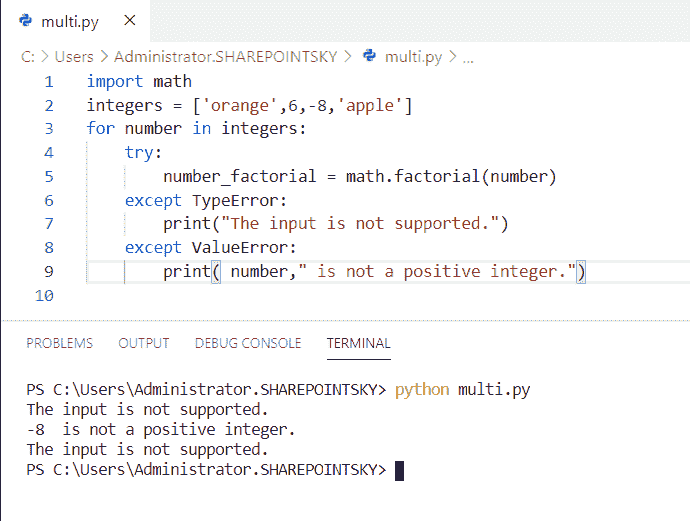
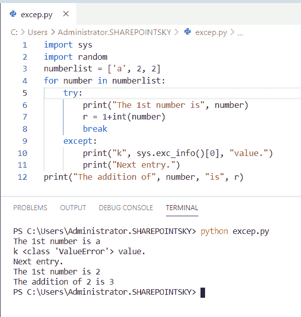
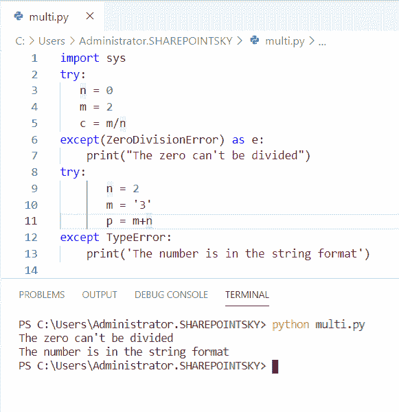
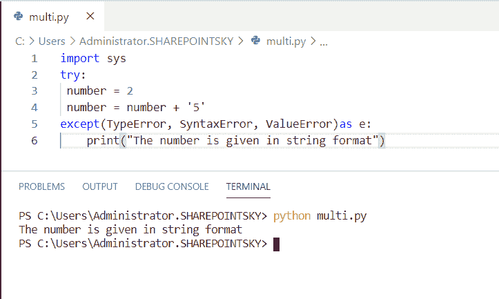
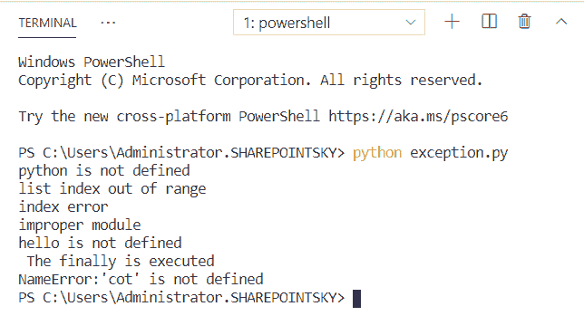
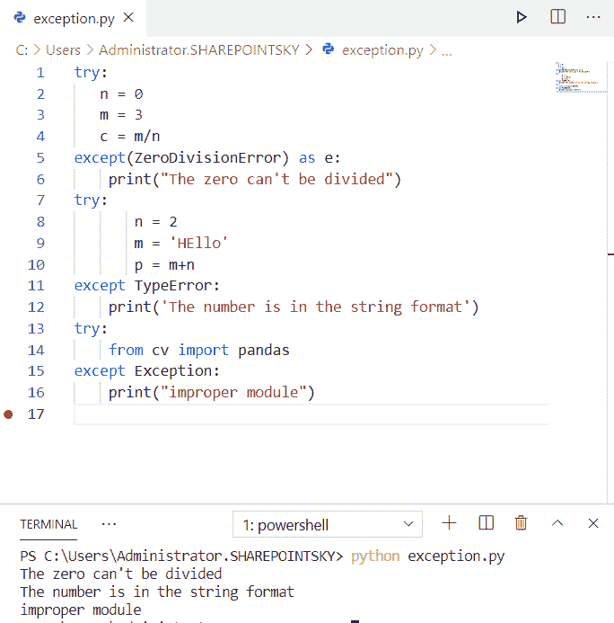
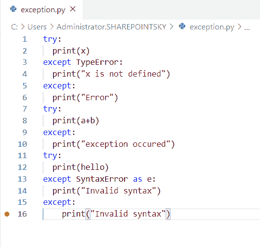
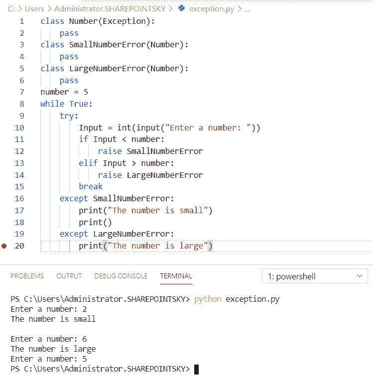
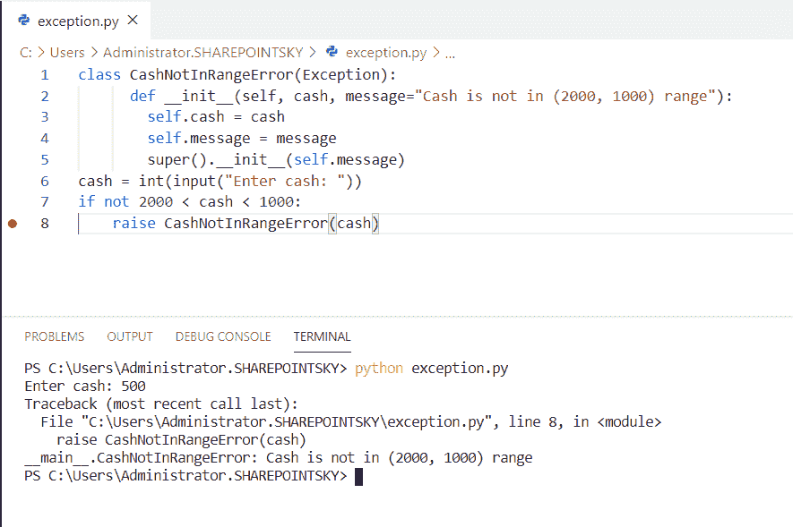

# Python 捕捉多个异常

> 原文：<https://pythonguides.com/python-catch-multiple-exceptions/>

[](https://sharepointsky.teachable.com/p/python-and-machine-learning-training-course)

在本 [Python 教程](https://pythonguides.com/python-programming-for-the-absolute-beginner/)中，我们将学习 **Python 捕捉多个异常**，我们还将涵盖以下主题:

*   Python 捕捉异常
*   Python 捕捉不同的异常类型
*   Python 在一行中捕获多个异常
*   Python 无所不包的异常
*   Python 处理不同的异常类型
*   捕捉多个异常 python3
*   python 中用户定义的异常
*   定制的例外类

目录

[](#)

*   [Python 捕捉多个异常](#Python_catch_multiple_exceptions "Python catch multiple exceptions")
*   [Python 捕捉异常](#Python_catching_exceptions "Python catching exceptions")
*   [Python 捕捉不同的异常类型](#Python_catch_different_exception_types "Python catch different exception types")
*   [Python 在一行中捕捉多个异常](#Python_catch_multiple_exceptions_in_one_line "Python catch multiple exceptions in one line")
*   [Python 无所不包的异常](#Python_catch-all_exceptions "Python catch-all exceptions")
*   [Python 处理不同的异常类型](#Python_handle_different_exception_types "Python handle different exception types")
*   [捕捉多个异常 python3](#Catch_multiple_exceptions_python3 "Catch multiple exceptions python3")
*   [python 中用户定义的异常](#User-defined_exceptions_in_python "User-defined exceptions in python")
*   [定制的例外类](#Customized_Excepting_classes "Customized Excepting classes")

## Python 捕捉多个异常

现在，我们可以看到**在 python 中捕捉多个异常**。

*   在这个例子中，我已经导入了一个名为 `math` 的模块，[将一个变量](https://pythonguides.com/create-python-variable/)声明为整数，并将其赋值为 **integers =['orange '，6，-8'apple']** 。
*   for 循环用于迭代，try 用于。try 语句允许定义一个代码块，在执行时测试错误。
*   如果出现任何错误，try 将被跳过，except 将执行。此处错误为“橙色”，因此 except 执行为“**不支持输入**”。
*   另一个输入是 `-8` ，它也是一个负数，只是当一个数不是正整数时执行，并显示错误消息。

示例:

```py
import math
integers = ['orange',6,-8,'apple']
for number in integers:
    try:
        number_factorial = math.factorial(number)
    except TypeError:
        print("The input is not supported.")
    except ValueError:
        print( number," is not a positive integer.")
```

在下面的屏幕截图中，我们可以看到输出的错误消息:



Python catch multiple exceptions

你可能还会喜欢 [Python 异常处理](https://pythonguides.com/python-exceptions-handling/)和 [Python 串联列表与示例](https://pythonguides.com/python-concatenate-list/)。

## Python 捕捉异常

现在，我们可以看到**在 python 中捕捉异常**。

*   在这个例子中，我已经导入了一个名为 `sys` 和 `random` 的模块，并将一个变量声明为 numberlist，并将 **numberlist = ['a '，2，2]。**
*   for 循环用于迭代，try 块用于列表中的第一个数字不是整数时出错。
*   所以 except 作为下一个条目执行，它也给出一个值 Error。
*   取第二个数，执行加法运算并显示结果。
*   `sys.exc_info` 用于获取结果格式等异常信息并打印文本。

示例:

```py
import sys
import random
numberlist = ['a', 2, 2]
for number in numberlist:
    try:
        print("The 1st number is", number)
        r = 1+int(number)
        break
    except:
        print("k", sys.exc_info()[0], "value.")
        print("Next entry.")
print("The addition of", number, "is", r)
```

下面的屏幕截图显示了输出:



Python catching exceptions

## Python 捕捉不同的异常类型

现在，我们可以看到**如何在 python 中捕捉不同的异常类型**。

*   在这个例子中，我已经导入了一个名为 **sys、**和 `try` 的模块用于识别错误。
*   执行除法运算，因为零不能被任何数整除**出现 ZeroDivisionError** ，除非执行并显示**“零不能被整除”**。
*   当输入以字符串格式给出时，执行加法运算，因此生成错误，并且异常以 TypeError 的形式给出。
*   因此 except 被执行并显示为'**'，数字是字符串格式的**。

示例:

```py
import sys
try:
   n = 0
   m = 2
   c = m/n
except(ZeroDivisionError) as e:
    print("The zero can't be divided")
try:
       n = 2
       m = '3'
       p = m+n
except TypeError:
    print('The number is in the string format')
```

您可以参考下面的输出截图:



Python catch different exception types

## Python 在一行中捕捉多个异常

现在，我们可以看到**如何在 python 的一行**中捕获多个异常。

*   在这个例子中，我已经导入了一个名为 `sys` 的模块，使用了 try 块并声明了一个作为数字的变量。
*   这里，**number = number+‘5’**并在 except 和 except 中的一行中赋值多个异常被执行。

示例:

```py
import sys
try:
    number = 2
    number = number+'5'
except(TypeError, SyntaxError, ValueError)as e:
    print("The number is given in string format")
```

您可以参考下面的输出截图:



Python catch multiple exceptions in one line

## Python 无所不包的异常

现在，我们可以看到**如何在 python 中捕捉所有异常**。

*   在这个例子中，我采取了不同的例外，除了不同的例子。
*   我使用了 try 块来检查错误，并使用了 excepts，如果错误存在，就执行 excepts。

示例:

```py
try:
  print(python)
except NameError:
  print("python is not defined")
try:
    list = [1,2,3]
    print(list[5])
except IndexError as e:
    print(e)
print("index error")
try:
    from cv import numpy
except Exception:
    print("improper module")
try:
  print(hello)
except:
  print("hello is not defined")
finally:
  print(" The finally is executed")
try:
    print(chair)
except NameError:  
    print ("NameError:'cot' is not defined")
else:  
    print ("word found no error")
```

下面的截图显示了输出。



Python catch-all exceptions

## Python 处理不同的异常类型

现在，我们可以看到**如何在 python 中处理不同的异常类型**。

*   在这个例子中，我采用了三种不同的异常类型作为 Exception**ZeroDivisionError、Exception type error、**和**Exception。**
*   我使用了 try 块来检查错误，并使用了 excepts，如果错误存在，就执行 excepts。

示例:

```py
try:
   n = 0
   m = 3
   c = m/n
except(ZeroDivisionError) as e:
    print("The zero can't be divided")
try:
       n = 2
       m = 'HEllo'
       p = m+n
except TypeError:
    print('The number is in the string format')
try:
    from cv import pandas
except Exception:
    print("improper module") 
```

下面的屏幕截图显示了包含不同例外情况的示例输出。



Python handle different exception types

## 捕捉多个异常 python3

现在，我们可以看到**如何捕捉多个异常 python3** 。

*   在这个例子中，我使用了多个异常，如 except TypeError、except、except SyntaxError 作为 e。
*   所有这些多重异常都用于不同的示例。
*   我使用了 try 块来检查错误，并使用了 excepts，如果错误存在，就执行 excepts。

示例:

```py
try:
  print(x)
except TypeError:
  print("x is not defined")
except:
  print("Error")
try:
  print(a+b)
except:
  print("exception occured")
try:
  print(hello)
except SyntaxError as e:
  print("Invalid syntax")
except:
    print("Invalid syntax")
```

下面的屏幕截图显示了输出:



Catch multiple exceptions python3

## python 中用户定义的异常

在这里，我们可以看到 python 中的**用户定义异常**。

*   在这个例子中，我将类定义为 `class Number(Exception)` ，另外两个类将定义异常以创建两个错误，如类 SmallNumberError(Number)。
*   另一个错误是类 LargeNumberError(Number)，当条件为真时我使用了 try 块，如果条件不满足则执行 except。

示例:

```py
class Number(Exception):
    pass
class SmallNumberError(Number):
    pass
class LargeNumberError(Number):
    pass
number = 5
while True:
    try:
        Input = int(input("Enter a number: "))
        if Input < number:
            raise SmallNumberError
        elif Input > number:
            raise LargeNumberError
        break
    except SmallNumberError:
        print("The number is small")
        print()
    except LargeNumberError:
        print("The number is large")
```

当条件不为真时，执行用户定义的异常。您可以参考下面的输出截图:



User-defined exceptions in python

## 定制的例外类

现在，我们可以看到**如何在 python 中定制异常类**。

*   在这个例子中，我们覆盖了异常类的构造函数来传递参数，比如 self、cash、message。
*   然后使用 super()调用父异常类的构造函数 `self.message` 。属性 `self.cash` 被定义。
*   为了得到错误信息，我写了**现金不在(2000，1000)范围内**。

示例:

```py
class CashNotInRangeError(Exception):
      def __init__(self, cash, message="Cash is not in (2000, 1000) range"):
        self.cash = cash
        self.message = message
        super().__init__(self.message)
cash = int(input("Enter cash: "))
if not 2000 < cash < 1000:
    raise CashNotInRangeError(cash)
```

下面的屏幕截图显示了输出:



Customized Excepting classes

您可能会喜欢以下 python 教程:

*   [什么是 Python 字典+用 Python 创建字典](https://pythonguides.com/create-a-dictionary-in-python/)
*   [无换行符的 Python 打印](https://pythonguides.com/python-print-without-newline/)
*   [Python 字典方法](https://pythonguides.com/python-dictionary-methods/)
*   [如何在 Python 中创建列表](https://pythonguides.com/create-list-in-python/)
*   [如何在 python 中把整数转换成字符串](https://pythonguides.com/convert-an-integer-to-string-in-python/)
*   [如何在 python 中连接字符串](https://pythonguides.com/concatenate-strings-in-python/)
*   [如何在 python 中使用正则表达式拆分字符串](https://pythonguides.com/python-split-string-regex/)
*   [Python 集合的交集](https://pythonguides.com/python-intersection-of-sets/)

在本教程中，我们已经学习了 **Python 捕捉多个异常**，并且我们已经涵盖了以下主题:

*   Python 捕捉异常
*   Python 捕捉不同的异常类型
*   Python 在一行中捕获多个异常
*   Python 无所不包的异常
*   Python 处理不同的异常类型
*   捕捉多个异常 python3
*   python 中用户定义的异常
*   自定义异常类

[Bijay Kumar](https://pythonguides.com/author/fewlines4biju/)

Python 是美国最流行的语言之一。我从事 Python 工作已经有很长时间了，我在与 Tkinter、Pandas、NumPy、Turtle、Django、Matplotlib、Tensorflow、Scipy、Scikit-Learn 等各种库合作方面拥有专业知识。我有与美国、加拿大、英国、澳大利亚、新西兰等国家的各种客户合作的经验。查看我的个人资料。

[enjoysharepoint.com/](https://enjoysharepoint.com/)[](https://www.facebook.com/fewlines4biju "Facebook")[](https://www.linkedin.com/in/fewlines4biju/ "Linkedin")[](https://twitter.com/fewlines4biju "Twitter")