# Python 更改 Django 版本

> 原文：<https://pythonguides.com/python-change-django-version/>

[](https://sharepointsky.teachable.com/p/python-and-machine-learning-training-course)

在这个 [Django 教程](https://pythonguides.com/what-is-python-django/)中，我们将学习**如何更改 Django 版本**，我们还将学习不同的技术来更改 Django 的版本。下面给出了本文涉及的主题列表。

*   升级 Django 版本的原因
*   如何检查 Django 版本
*   Python 更改 Django 版本
*   Python 改变 Django 版本 Pycharm

目录

[](#)

*   [更改 Django 版本的原因](#Reasons_to_change_Django_Version "Reasons to change Django Version")
*   [如何检查 Django 版本](#How_to_check_Django_Version "How to check Django Version")
*   [Python 改 Django 版本](#Python_change_Django_Version "Python change Django Version")
    *   [升级 Django 版本](#Upgrage_Django_Version "Upgrage Django Version")
    *   [降级 Django 版本](#Degrade_Django_Version "Degrade Django Version")
*   [Python 改 Django 版 Pycharm](#Python_change_Django_Version_Pycharm "Python change Django Version Pycharm")

## 更改 Django 版本的原因

虽然更改 Django 版本是一个复杂的过程，但它也有几个好处。因此在这一节中，我们将了解升级 Django 版本的原因。

1.  添加了额外的功能。
2.  已经做出了改进。
3.  错误已被修复。
4.  随着每个当前 Django 版本的发布，通过保持您的代码最新，减少了将来升级的痛苦
5.  “长期支持”(LTS)版本在一些 Django 框架版本中有所显示。在三年的时间里，LTS 版本会收到安全和漏洞补丁。如果您使用不支持的 Django 版本，您网站的安全风险会增加。
6.  它保护你的网站免受网络攻击。
7.  随时维护您的服务器。
8.  保护您的数据免受未经授权的访问和盗窃。
9.  在生产力方面有利于开发团队。
10.  它还帮助您的开发人员在安全性和 bug 上花费更少的时间和金钱。
11.  它还解放了您的开发团队，让他们专注于网站升级或创收项目。

另外，请阅读: [Python Django vs Flask](https://pythonguides.com/python-django-vs-flask/)

## 如何检查 Django 版本

在修改 Django 之前，您应该知道您使用的是哪个版本。在这一节中，我们将介绍检查 Django 版本的不同方法。

**第一种方法**是启动你的服务器并查看版本号。

**运行 Django 服务器的命令:**

```py
python manage.py runserver
```

打开一个终端窗口，导航到您的项目目录，然后键入命令来启动 Django 服务器。这是你将得到的结果:

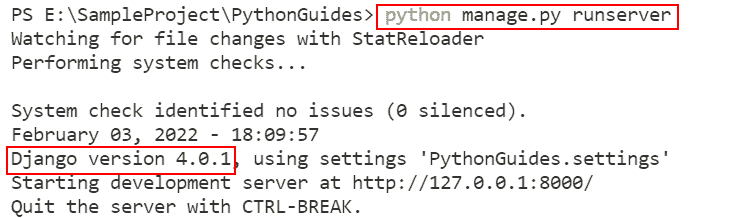

Django Version

检查 Django 版本的第二个技术是 pip 模块的冻结命令。这个命令显示我们通过 pip 安装的包，以及它们的版本。

**检查版本的命令:**

```py
pip freeze
```

当你在虚拟环境中时，打开一个终端窗口并输入这个命令来检查 Django 的版本。

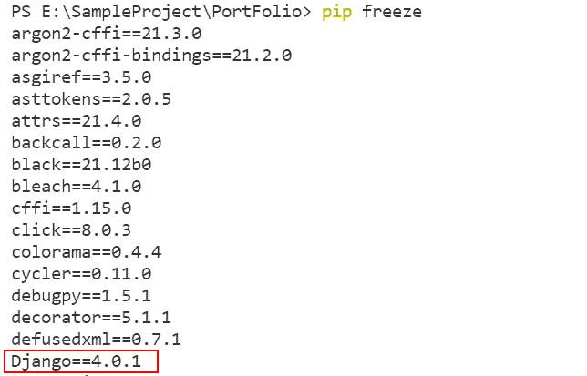

Django Version

检查 Django 版本的第三种技术是使用 mange.py shell。

**检查 Django 版本的代码:**

```py
import django
django.get_version()
```

首先停止服务器，然后打开一个终端窗口，然后键入 python manage.py shell 命令来启动 python manage shell。之后，输入上面提到的代码，回车运行。

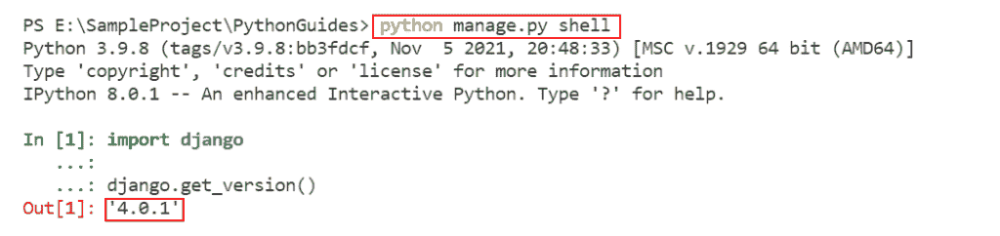

Django Version

**检查 Django 版本的第四种方法**是 manage.py 命令。

**命令:**

```py
python manage.py version
```

要获得 Django 版本，首先，停止服务器(如果您还没有)，然后打开一个终端窗口并键入上面提到的命令。

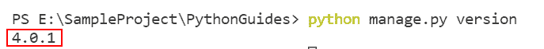

Django Version

阅读:[如何安装 Django](https://pythonguides.com/how-to-install-django/)

## Python 改 Django 版本

在这一节中，我们将看看几种可能的方法来改变 Django 的版本。我们可以将 Django 更新到最新版本，或者降级到旧版本。

### 升级 Django 版本

在许多情况下，您需要将与 Django 相关的依赖项更新到最新版本。因为您的一些依赖项可能还不支持新发布的 Django 版本，或者依赖项没有保持最新。在某些情况下，您可能需要等到依赖项的更新版本发布。

**升级 Django 版本的命令:**

```py
pip install django --upgrade
               **#OR**
python -m pip install -U django
               **#OR**
python -m pip install --upgrade django
```

打开终端窗口，键入上面列出的任何命令。它将升级到 Django 的最新版本，并自动卸载之前的版本。

**输出如下:**

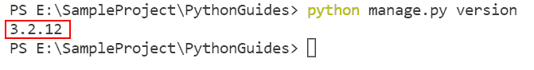

Django Version

可以看到我安装的 Django 版本是 3.2.12。

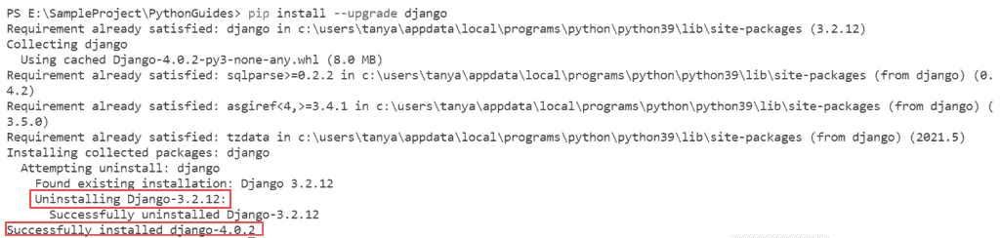

Upgrade Django Version

输出表明，它将删除 3.2.12 版本，并用最新的版本 4.0.2 代替。

### 降级 Django 版本

降级 Django 版本不是一个好主意，但是如果有特殊的需求，你可以这样做。下面列出的命令用于降级版本以及将版本更改为指定版本。

**命令:**

```py
pip install django==<specific version>
                   **#OR**
pip install --upgrade django==<specific version>
```

在终端窗口中键入上面给出的任何命令。它将删除以前的版本，并降级到某个版本或安装特定版本。

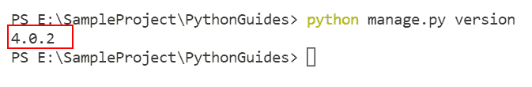

Check Version

如你所见，安装的 Django 版本是 4.0.2。

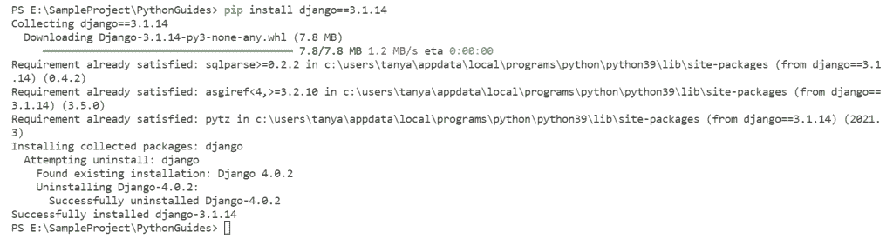

Downgrade Django Version

我们要卸载 Django 4 . 0 . 2 版，安装 Django 3 . 1 . 14 版。

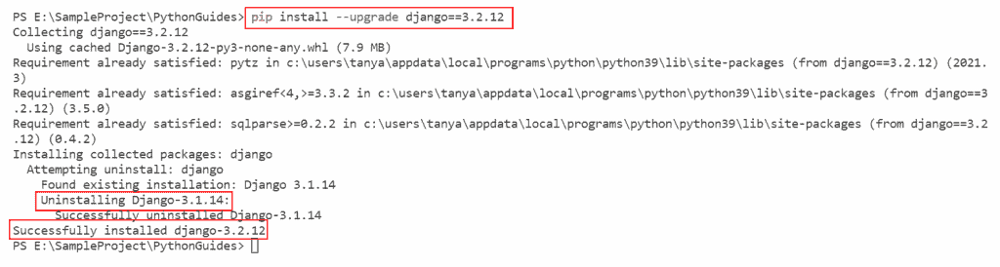

Upgrade Django to Specific Version

我们将把 Django 升级到特定的版本 3.2.12。

阅读:[如何设置 Django 项目](https://pythonguides.com/setup-django-project/)

## Python 改 Django 版 Pycharm

在这一节中，我们将学习如何使用 pycharm 编辑器通过 GUI 将 Django 版本更改为指定的版本。

**使用以下步骤:**

*   Pycharm 编辑器现在应该打开了。
*   在右上角的栏中，选择**文件**。然后转到**设置**选项卡。

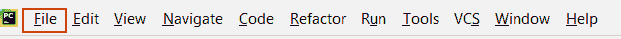

File

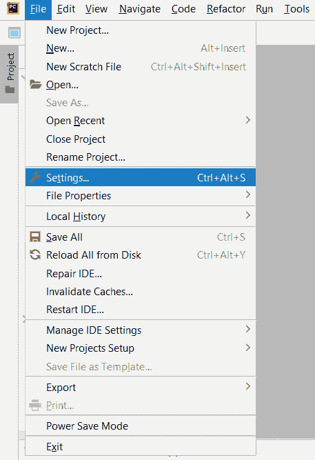

Settings

*   首先，我们需要选择项目。

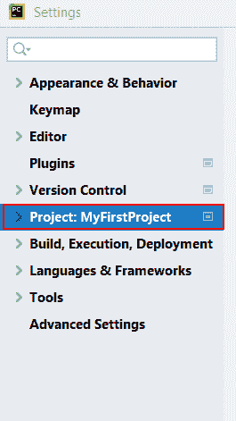

Project

*   然后，在项目下，选择 Python 解释器。

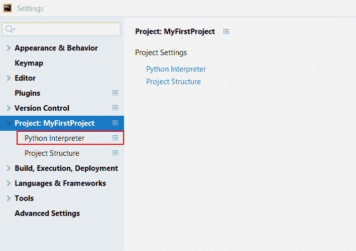

Python Interpreter

*   然后双击 Django 包打开它。

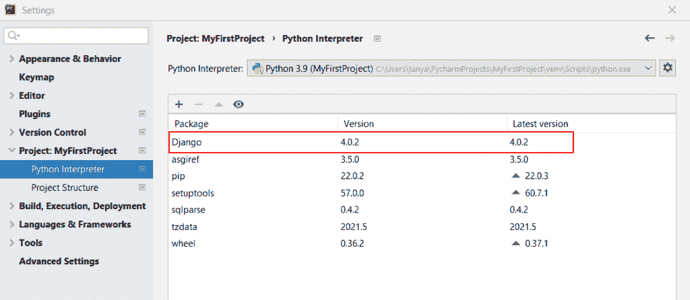

Django

*   通过选中“指定版本”框来选择您想要的版本。

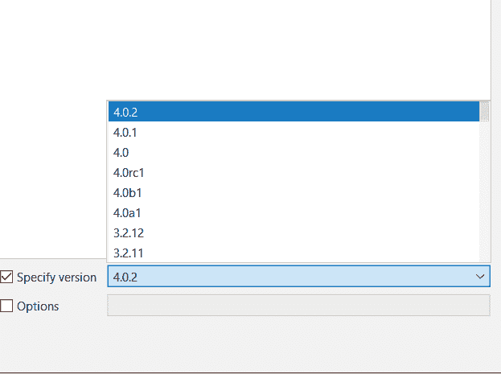

Specify Version

*   通过按下**安装包**按钮来安装包。

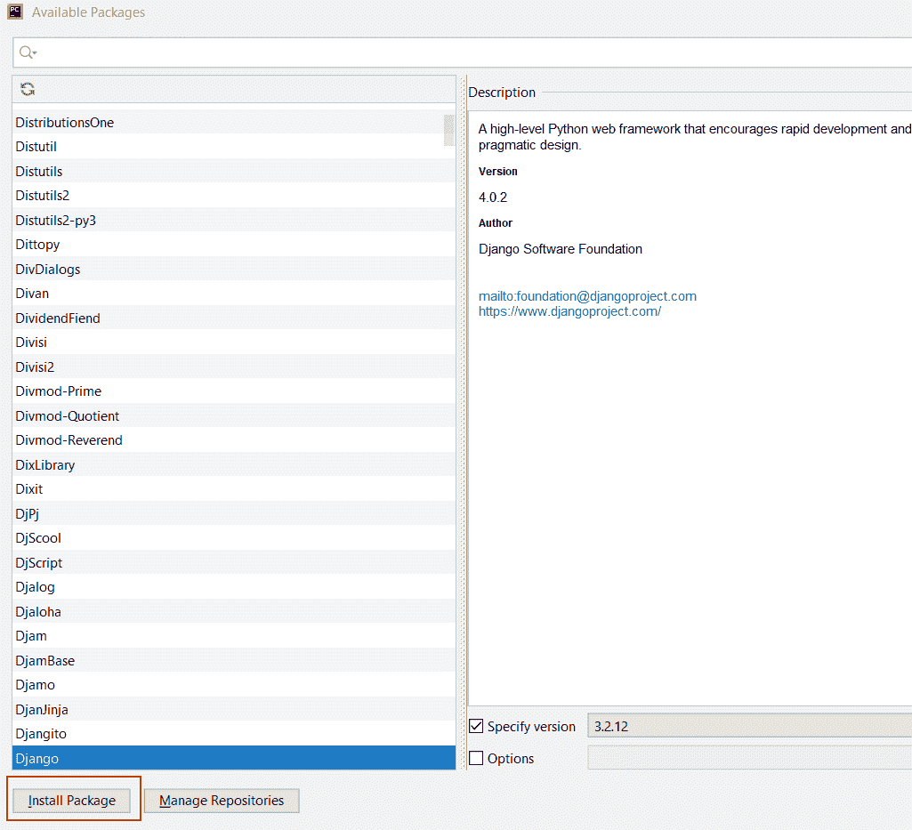

Install-Package

*   在后端，pip 命令安装指定版本的 Django。

要安装特定版本的 Django，只需使用上一节提到的 pip 命令。

你可能也喜欢阅读下面的 Django 教程。

*   [Python Django 获取管理员密码](https://pythonguides.com/python-django-get-admin-password/)
*   [Python Django 设置时区](https://pythonguides.com/python-django-set-timezone/)
*   [如何获取 Django 中的用户 IP 地址](https://pythonguides.com/get-user-ip-address-in-django/)
*   [在 Python Django 中登录系统](https://pythonguides.com/login-system-in-python-django/)
*   [如何在 Django 中创建模型](https://pythonguides.com/create-model-in-django/)
*   [Python Django 格式日期](https://pythonguides.com/python-django-format-date/)
*   [如何获取 Django 的当前时间](https://pythonguides.com/how-to-get-current-time-in-django/)
*   [Django 模板中的 If 语句](https://pythonguides.com/if-statement-in-django-template/)

在本教程中，我们将学习如何使用多种技术来更改 Django 版本。并且，我们还在帖子中讨论了以下话题。

*   升级 Django 版本的原因
*   如何检查 Django 版本
*   Python 更改 Django 版本
*   Python 改变 Django 版本 Pycharm

[Bijay Kumar](https://pythonguides.com/author/fewlines4biju/)

Python 是美国最流行的语言之一。我从事 Python 工作已经有很长时间了，我在与 Tkinter、Pandas、NumPy、Turtle、Django、Matplotlib、Tensorflow、Scipy、Scikit-Learn 等各种库合作方面拥有专业知识。我有与美国、加拿大、英国、澳大利亚、新西兰等国家的各种客户合作的经验。查看我的个人资料。

[enjoysharepoint.com/](https://enjoysharepoint.com/)[](https://www.facebook.com/fewlines4biju "Facebook")[](https://www.linkedin.com/in/fewlines4biju/ "Linkedin")[](https://twitter.com/fewlines4biju "Twitter")