# Python 检查变量是否为数字

> 原文：<https://pythonguides.com/python-check-if-a-variable-is-a-number/>

[](https://sharepointsky.teachable.com/p/python-and-machine-learning-training-course)

在本 [Python 教程](https://pythonguides.com/python-hello-world-program/)中，我们将讨论 **Python 检查变量是否为数字**，并涵盖以下几点:

*   如何在 Python 中检查变量是否为整数
*   检查变量是否不是 Python 中的数字
*   Python 检查变量是数字还是字符串
*   如何在 Python 中检查变量是数字还是数组
*   Python 检查变量是数字还是列表
*   在 Python 中检查变量是否为整数
*   Python 检查变量是否为实数
*   如何在 Python 中检查变量是否包含数字
*   Python 检查变量是否在两个数字之间

Python 变量就像一个存储值的内存位置。要声明一个变量，我们只需要给它赋值。你不需要给出任何额外的命令，不像 C，C++，Java 这样的编程语言，你需要给出一个额外的命令来声明和赋值。

目录

[](#)

*   [Python 检查变量是否为数字](#Python_Check_if_a_variable_is_a_number "Python Check if a variable is a number")
*   [Python 中如何检查变量是否为整数](#How_to_check_if_a_variable_is_an_integer_in_Python "How to check if a variable is an integer in Python")
*   [Python 检查变量是否不是数字](#Python_check_if_a_variable_is_not_a_number "Python check if a variable is not a number")
*   [Python 检查变量是数字还是字符串](#Python_check_if_variable_is_number_or_string "Python check if variable is number or string")
*   [Python 检查变量是数字还是数组](#Python_check_if_variable_is_number_or_array "Python check if variable is number or array")
*   [Python 检查变量是数字还是列表](#Python_check_if_variable_is_number_or_list "Python check if variable is number or list")
*   [Python 检查变量是否为整数](#Python_check_if_a_variable_is_a_whole_number "Python check if a variable is a whole number")
*   [Python 检查变量是否为实数](#Python_check_if_variable_is_real_number "Python check if variable is real number")
*   [Python 检查变量是否在两个数字之间](#Python_check_if_variable_is_between_two_numbers "Python check if variable is between two numbers")

## Python 检查变量是否为数字

*   在本节中，我们将学习如何在 Python 中检查变量是否为数字。
*   我们可以使用一个方法来检查一个变量是否是一个数字，方法是使用一个 try-except 块。在 try 块中，我们可以将给定的变量用于 int 或 float。

**语法:**

下面是 try-except 块的语法

```py
try:
   print()
except:
   print()
```

**例子**

让我们举一个例子来检查一个变量是否是一个数字

```py
Variable = "JOHN"
try:
    a = int(Variable)
    print('The variable a number')
except:
    print('The variable is not a number')
```

以下是给定代码的截图

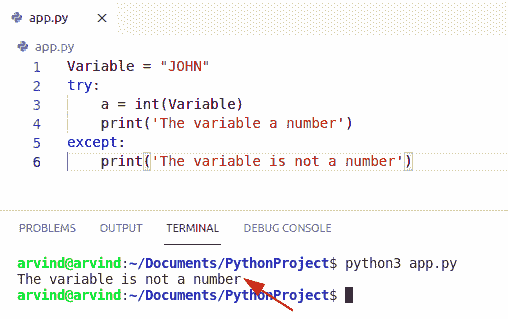

Python check if a variable is a number

阅读: [Python NumPy 追加](https://pythonguides.com/python-numpy-append/) + 9 个例子

## Python 中如何检查变量是否为整数

假设程序中有两个变量 A 和 B，A 有一个整数值，而 B 有一个小数值，那么你如何检查 A 是否是一个整数，B 是否也是一个整数。

*   在本节中，我们将学习如何在 Python 中检查变量是否为整数。
*   现在我们要用的方法是，检查变量是否是整数。
    *   Isinstance 方法()
    *   Try-except 方法()
    *   舍入方法()

Isinstance 方法()是 python 中的内置方法，当指定的对象是指定类型的实例时，该方法返回 true，否则将返回 false。

**语法:**

```py
isinstance (var,int)
```

**例子**

让我们举个例子来检查 variabe 是否是整数。

```py
b = 3
c = 3.4
print(isinstance (b,int))
print(isinstance (c,int))
```

以下是给定代码的截图

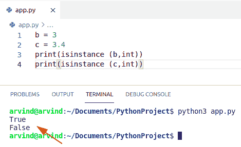

Python check if a variable is an integer isinstance method

*   在 Try-except 块中，我们可以将给定的变量用于 int 或 float。
*   我们可以使用一个方法来检查一个变量是否是一个整数。

**语法:**

下面是 try-except 块的语法

```py
try:
   print()
except:
   print()
```

**例子**

我们举个例子，检查一个变量是不是整数。

```py
Variable = 3
try:
    a = int(Variable)
    print('Variable is integer')
except:
    print('variable is not an integer')
```

以下是给定代码的截图

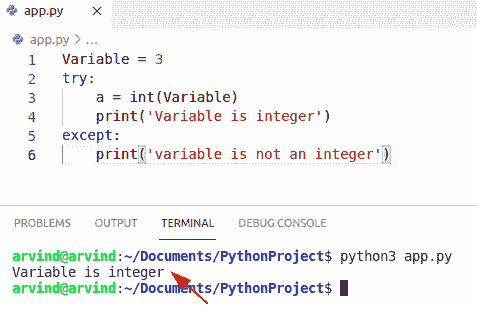

Python check if a variable is an integer try except method

当没有值传递给可选的数字参数时，Python 中的 Round 方法返回最接近的整数。

**语法:**

下面是 Round 方法的语法

```py
round(number,number of digits)
```

**例子**

让我们举个例子来检查一个变量是否是整数

```py
def is_int(value):
   if value == round(value):
     print("True")
   else:
     print("False")

c=4
d=4.5
is_int(c)
is_int(d)
```

以下是给定代码的截图

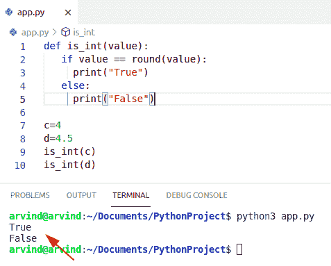

Python check if a variable is an integer round method

阅读:[如何在 python 中创建变量](https://pythonguides.com/create-python-variable/)

## Python 检查变量是否不是数字

*   在这一节中，我们将学习如何在 Python 中检查变量是否不是数字。
*   我们可以使用一个 try-except 方法来检查一个变量是否不是一个数字。在 try 块中，我们可以将给定的变量用于 int 或 float。

**语法:**

下面是 try-except 块的语法

```py
try:
   print()
except:
   print()
```

**例子**

让我们举一个例子来检查变量是否不是数字

```py
Variable = "Micheal"
try:
    a = int(Variable)
    print('Variable is a number')
except:
    print('variable is not a number')
```

以下是给定代码的截图

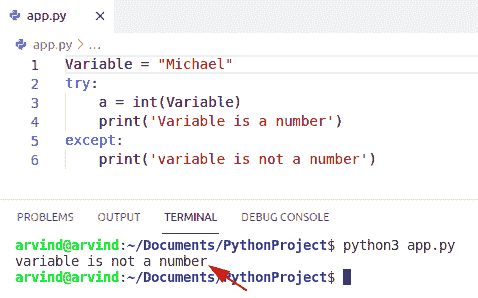

Python check if a variable is not a number

阅读:[如何在 Python 中求一个数的位数之和](https://pythonguides.com/sum-of-digits-of-a-number-in-python/)

## Python 检查变量是数字还是字符串

*   在本节中，我们将学习如何在 Python 中检查变量是数字还是字符串。
*   我们可以很容易地使用 isinstance 方法来检查变量是数字还是字符串正在使用 isinstance()方法。
*   Isinstance 方法()是 python 中的内置方法，当指定的对象是指定类型的实例时，该方法返回 true，否则将返回 false。

**语法:**

```py
isinstance (var,int)
```

**例子**

让我们举个例子来检查一个变量是数字还是字符串

```py
Variable = "Micheal"
try:
    a = int(Variable)
    print('The variable a number')
except:
    print(' variable is string')
    print(isinstance (Variable,str))
```

以下是给定代码的截图

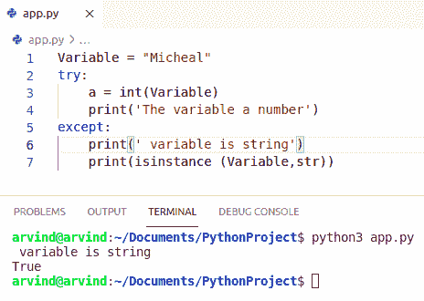

Python check if variable is number or string

这就是如何在 Python 中检查变量是数字还是字符串。

阅读:[如何在 python 中使用正则表达式拆分字符串](https://pythonguides.com/python-split-string-regex/)

## Python 检查变量是数字还是数组

*   在这一节中，我们将学习如何在 Python 中检查变量是数字还是数组。
*   我们可以使用一个 try-except 方法来检查一个变量是否是一个数字或者数组是否使用了一个 try-except 块。在 try 块中，我们可以将给定的变量用于 int 或 float。

**语法:**

下面是 try-except 块的语法

```py
try:
   print()
except:
   print()
```

**例子**

让我们举个例子来检查一个变量是数字还是数组

```py
import numpy as np

Variable = ([1,2,3])
try:
    a = int(Variable)
    print(' variable is number')
except:
    print(' variable is array')
```

以下是给定代码的截图

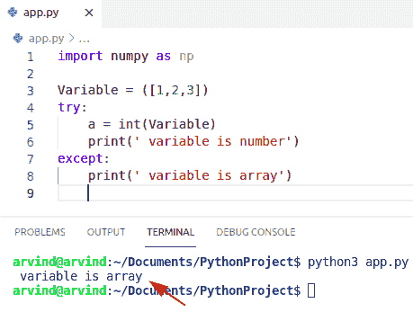

Python check if variable is number or array

这就是如何在 Python 中**检查变量是数字还是数组。**

阅读 [Python 字典更新示例](https://pythonguides.com/python-dictionary-update/)

## Python 检查变量是数字还是列表

*   在这一节中，我们将学习如何在 Python 中**检查变量是数字还是列表。**
*   我们可以使用一个 try-except 方法来检查一个变量是一个数字还是一个列表正在使用一个 try-except 块。在 try 块中，我们可以将给定的变量用于 int 或 float。

**语法:**

下面是 try-except 块的语法

**例子**

让我们举个例子来检查一个变量是数字还是列表

```py
 Var = [1,2,3,4,"John"]
try:
    a = int(Var)
    print(' variable is number')
except:
    print(' variable is a list') 
```

以下是给定代码的截图

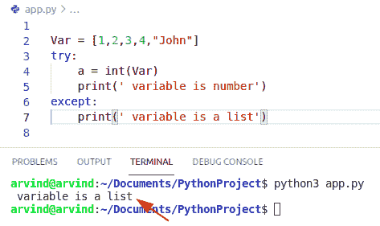

Python check if variable is number or list

这就是如何在 Python 中检查变量是数字还是列表。

阅读:[在 Python 中检查列表是否为空](https://pythonguides.com/check-if-a-list-is-empty-in-python/)

## Python 检查变量是否为整数

*   在本节中，我们将学习如何在 Python 中检查变量是否为整数。
*   现在我们要用的方法是，检查变量是否是一个整数。
    *   int()方法
    *   尝试例外方法

int()函数是一个内置函数，可以将任何字符串或浮点数转换成整数形式。

**语法:**

下面是 int()方法的语法

```py
int(String,base)
```

**例子**

让我们举一个例子来检查变量是否是整数。

```py
y = 3.2
print(y - int(y) == 0)
# true if y is a whole number
# false if it is decimal number
```

下面是以下代码的截图。

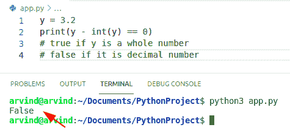

Python check if variable is whole number

*   现在另一个方法是 Try-except 块，我们可以将给定的变量用于 int 或 float。
*   我们可以使用这种方法，通过使用 try-except 块来检查变量是否为整数。

**语法:**

下面是 try-except 块的语法

```py
try:
   print()
except:
   print()
```

**例子**

让我们举一个例子来检查变量是否是整数。

```py
Var = 4
try:
    a = int(Var)
    print(' variable is whole number')
except:
    print(' variable is not a whole number') 
```

下面是以下代码的截图。

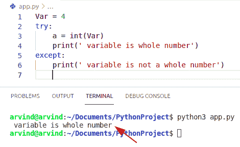

Python check if variable is whole number try except method

## Python 检查变量是否为实数

*   在 Python 中，可以绘制在数轴上的任何数字都称为实数。
*   在这一节，我们将学习如何检查一个变量是否是实数。
*   我们可以使用一个 try-except 方法来检查一个变量是一个数字还是一个列表正在使用一个 try-except 块。在 try 块中，我们可以将给定的变量用于 int 或 float。

**语法:**

```py
try:
   print()
except:
   print()
```

**例子**

让我们举一个例子来检验变量是否是实数。

```py
Var = 4.333
try:
    a = int(Var)
    print(' variable is a real number')
except:
    print(' variable is not a whole number')
```

下面是以下代码的截图。

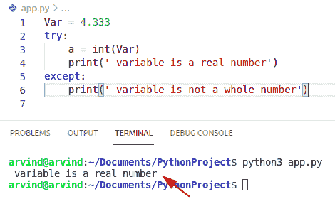

Python check if a variable is a real number

这就是如何在 Python 中检查变量是否为实数。

阅读:[如何在 Python 中把列表转换成字符串](https://pythonguides.com/python-convert-list-to-string/)

## Python 检查变量是否在两个数字之间

*   在这一节中，我们将学习如何在 Python 中检查一个变量是否在两个数字之间。
*   创建一个从开始到结束的整数范围。使用关键字 integers 检查变量是否介于两个数字之间。

**语法:**

```py
range(start,stop)
```

**例子**

让我们举一个例子来检查变量是否在两个数字之间。

```py
Var = 9
is_between = 9 in range(6, 18)
#Check if 9 lies between 6 and 18

print(is_between)
```

下面是以下代码的截图。

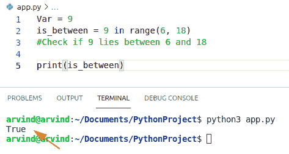

Python check if variable is between two numbers

这就是如何在 Python 中检查变量是否在两个数字之间。

您可能会喜欢以下 Python 教程:

*   [检查 Python 中的 NumPy 数组是否为空](https://pythonguides.com/check-if-numpy-array-is-empty/)
*   [Python 从字符串中移除子串](https://pythonguides.com/python-remove-substring-from-a-string/)
*   [Python Tkinter 文本框小工具](https://pythonguides.com/python-tkinter-text-box/)
*   [Python 3 的 string replace()方法](https://pythonguides.com/python-3-string-replace/)
*   [Python 比较字符串](https://pythonguides.com/python-compare-strings/)
*   [Python 3 字符串方法及示例](https://pythonguides.com/string-methods-in-python/)

在本 Python 教程中，我们学习了**如何在 Python** 和下面的例子中检查变量是否为数字:

1.  Python 检查变量是否为数字
2.  Python 检查变量是否为整数
3.  Python 检查变量是否不是数字
4.  Python 检查变量是数字还是字符串
5.  Python 检查变量是数字还是数组
6.  Python 检查变量是数字还是列表
7.  Python 检查变量是否是整数
8.  Python 检查变量是否为实数
9.  Python 检查变量是否在两个数字之间

[Bijay Kumar](https://pythonguides.com/author/fewlines4biju/)

Python 是美国最流行的语言之一。我从事 Python 工作已经有很长时间了，我在与 Tkinter、Pandas、NumPy、Turtle、Django、Matplotlib、Tensorflow、Scipy、Scikit-Learn 等各种库合作方面拥有专业知识。我有与美国、加拿大、英国、澳大利亚、新西兰等国家的各种客户合作的经验。查看我的个人资料。

[enjoysharepoint.com/](https://enjoysharepoint.com/)[](https://www.facebook.com/fewlines4biju "Facebook")[](https://www.linkedin.com/in/fewlines4biju/ "Linkedin")[](https://twitter.com/fewlines4biju "Twitter")