# Python 检查变量是否为整数

> 原文：<https://pythonguides.com/python-check-if-the-variable-is-an-integer/>

[](https://sharepointsky.teachable.com/p/python-and-machine-learning-training-course)

在本 [Python 教程](https://pythonguides.com/python-download-and-installation/)中，我们将讨论**如何在 Python** 中检查变量是否为整数。我们还将检查:

*   Python 检查变量是否为整数
*   Python 检查变量是否是字符串
*   检查变量在 python 中是列表还是元组
*   检查 python 中的变量是否不为空
*   获取 python 中对象的类型
*   检查变量是否存在 python
*   UnboundLocalError:在赋值 python 之前引用了局部变量
*   Python 大于运算符
*   Python 小于运算符
*   Python 检查用户输入是数字还是字符串
*   Python 从另一个文件导入变量
*   Python 动态变量名

目录

[](#)

*   [Python 检查变量是否为整数](#Python_check_if_the_variable_is_an_integer "Python check if the variable is an integer")
*   [Python 检查变量是否为字符串](#Python_check_if_the_variable_is_a_string "Python check if the variable is a string")
*   [在 python 中检查变量是列表还是元组](#Check_if_the_variable_is_a_list_or_a_tuple_in_python "Check if the variable is a list or a tuple in python")
*   [在 python 中检查变量是否不为空](#Check_if_the_variable_is_not_null_in_python "Check if the variable is not null in python")
*   [获取 python 中对象的类型](#Get_the_type_of_object_in_python "Get the type of object in python")
*   [检查变量是否存在 python](#Check_if_the_variable_exists_python "Check if the variable exists python")
*   [unboundlocalrerror:在赋值 python](#UnboundLocalError_local_variable_referenced_before_assignment_python "UnboundLocalError: local variable referenced before assignment python") 之前引用了局部变量
*   [Python 大于运算符](#Python_greater_than_operator "Python greater than operator")
*   [Python 小于运算符](#Python_less_than_operator "Python less than operator")
*   [Python 检查用户输入是数字还是字符串](#Python_check_if_user_input_is_a_number_or_string "Python check if user input is a number or string")
*   [Python 从另一个文件导入变量](#Python_import_variable_from_another_file "Python import variable from another file")
*   [Python 动态变量名](#Python_dynamic_variable_name "Python dynamic variable name")

## Python 检查变量是否为整数

为了**在 Python** 中检查变量是否是整数，我们将使用 `isinstance()` ，它将返回一个布尔值，不管变量是否是整数类型。

*   [如何在 python 中创建一个字符串+在 Python 中将其赋给一个变量](https://pythonguides.com/create-a-string-in-python/)
*   [如何在 python 中创建变量](https://pythonguides.com/create-python-variable/)
*   Python 中的[函数](https://pythonguides.com/function-in-python/)

**举例:**

```py
my_variable = 56
print(isinstance(my_variable, int))
```

写完上面的代码后(python 检查变量是否为整数)，你将打印出 `" isinstance() "` ，然后输出将显示为 `" True "` 。这里，isinstance()将检查变量是否是整数，如果是整数，则返回 true，否则返回 false。

可以参考下面的截图来**检查变量是否为整数**。

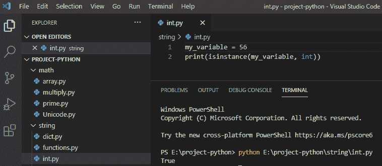

## Python 检查变量是否为字符串

在 python 中，为了让**检查变量是否为字符串**，我们将使用内置函数 `isinstance()` ，该函数将返回一个布尔值，无论变量是否为字符串类型。

**举例:**

```py
my_string = "Welcome"
print(isinstance(my_string, str))
```

写完上面的代码后(python 检查变量是否为字符串)，你将打印出 `" isinstance() "` ，然后输出将显示为 `" True "` 。这里，isinstance()将检查变量是否是字符串，如果是字符串，则返回 true，否则返回 false。

你可以参考下面的截图来检查变量是否是一个字符串。

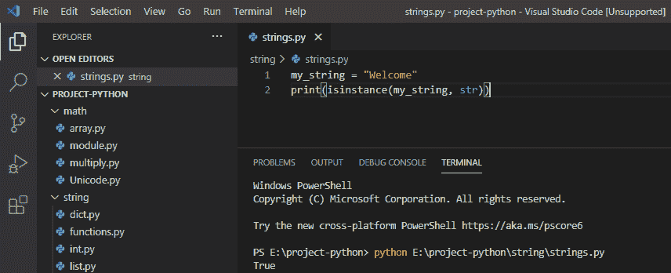

*   [从字符串 Python 中删除字符](https://pythonguides.com/remove-character-from-string-python/)
*   [如何在 Python 中处理 indexerror:字符串索引超出范围](https://pythonguides.com/indexerror-string-index-out-of-range-python/)
*   [Python 将列表转换成字符串](https://pythonguides.com/python-convert-list-to-string/)
*   [Python 字符串函数](https://pythonguides.com/string-methods-in-python/)

## 在 python 中检查变量是列表还是元组

**在 Python** 中检查变量是列表还是元组，我们可以使用 `type()` 来检查 Python 中变量的数据类型。

**举例:**

```py
value = ['Tim', 'John', 'Mark']
if type (value) == tuple:
print('value is a tuple')
else:
print('value is list)
```

在编写了上面的代码(python 检查变量是列表还是 python 中的元组)之后，您将打印这些代码，然后输出将显示为 `" value is list "` 。这里，type(value)是变量名，用于检查变量是列表还是元组。

如果变量是 python 中的列表或元组，您可以看到下面的截图

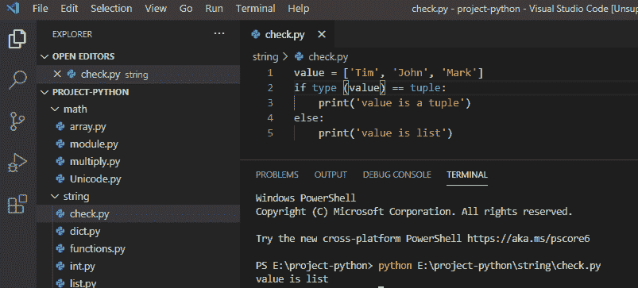

## 在 python 中检查变量是否不为空

**为了检查 Python** 中的变量是否不为空，我们将使用 **if 条件**来检查变量是否为 none 或者不为 none。

**举例:**

```py
value = 'New to python'
if value is not None:
print('Value is not null')
```

写完上面的代码(python 检查变量在 python 中是否不为空)后，您将打印这些代码，然后输出将显示为`" Value not null "`。这里，if 条件用于检查值是否为 none。

如果变量在 python 中不为空，您可以看到下面的截图

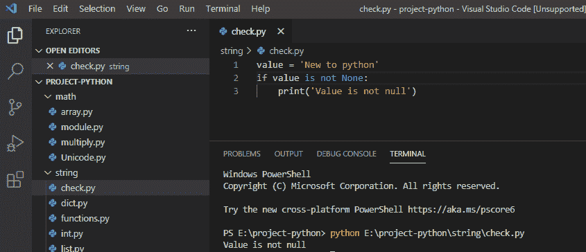

## 获取 python 中对象的类型

在 python 中，为了让**获取 python** 中对象的类型，我们将使用 `type()` 并将参数传递给 type 以获取对象的类型。

**举例:**

```py
new_set = {'X', 'Y', 'Z'}
print("Type is : ",type(new_set))
```

写完上面的代码(在 python 中获得对象的类型)，你将打印出来，然后输出将显示为一个**" Type is:<class ' set '>"**。这里，type()用于获取变量的类类型。

你可以看到下面的截图来获取对象的类型

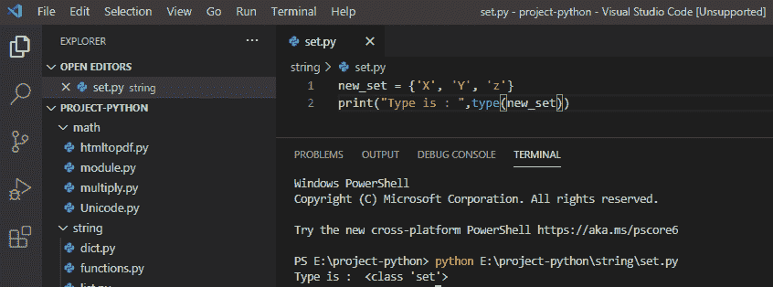

## 检查变量是否存在 python

在 python 中，**如果一个变量存在**，那么它被局部或全局定义。定义在函数内部的变量称为局部函数，定义在函数外部的变量称为全局变量。

**举例:**

```py
def fun1():
my_variable = 10
my_local = "my_variable" in locals()
print(my_locals)
fun1()
```

写完上面的代码后(检查变量是否存在 python)，你将打印出 `"my_local"` ，然后输出将显示为 `" True "` ，因为它是本地定义的。这里，我们使用 locals()来检查变量是局部的还是全局的。

你可以看到下面的截图检查变量是否存在 python

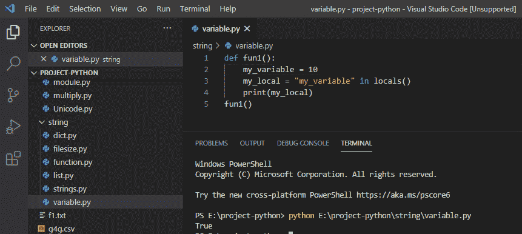

## unboundlocalrerror:在赋值 python 之前引用了局部变量

**赋值前引用的局部变量**当我们试图使用一个在局部范围内赋值前的变量时，就会出现这个错误。

**举例:**

```py
val = 10
def fun():
print(val)
val = val+1
fun()
```

写完上面的代码后，我们得到一个错误。你将打印出 `" val "` 的错误，然后错误将显示为**" unboundlocalrerror:赋值前引用的局部变量' val ' "。**出现这个错误是因为我们给一个没有**局部作用域**的变量赋值，所以它抛出一个错误。

您可以在下面的截图中看到在分配 python 之前引用的局部变量

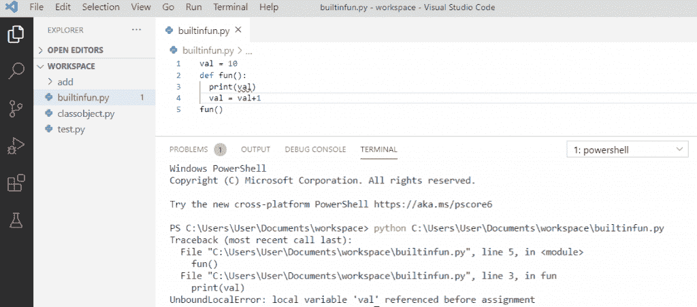

在这里，我们将看到如何解决****“赋值前引用局部变量”**错误。为了解决这个错误，我们需要在全局环境中定义它。**

 ****举例:**

```py
val = 10
def fun():
global val
print(val)
val = val+1
print(val)
fun()
```

写完上面的代码。你将打印出**“val”**然后输出将显示为**“10 11”。**这里，在定义了函数之后，我们将在函数中明确指定**全局变量**来操作值。我们将打印出`val`，所以我的全局变量值是 10，它会增加到 1。

你可以看到下面的截图 UnboundLocalError 已解决。

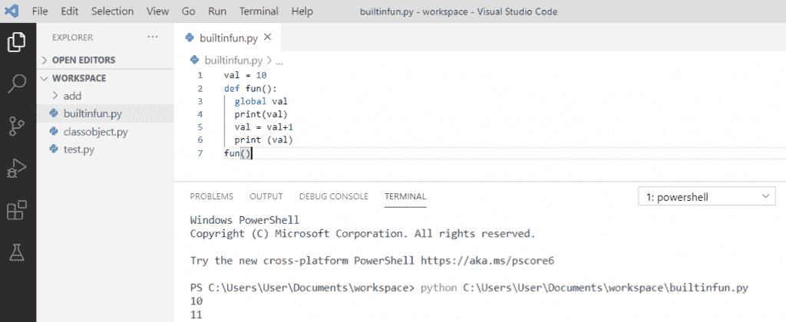

## Python 大于运算符

**大于**运算符用 **( > )** 表示，它检查左边的值是否大于右边的值。

**举例:**

```py
a1 = 15
a2 = 13
print(a1 > a2)
```

写完上面的代码(python 大于操作符)，你将打印出来，然后输出将显示为 `" True "` 。这里，左边的值**【a1】**大于右边的值**【a2】**，所以返回 true。

您可以看到下面 python 大于运算符的屏幕截图

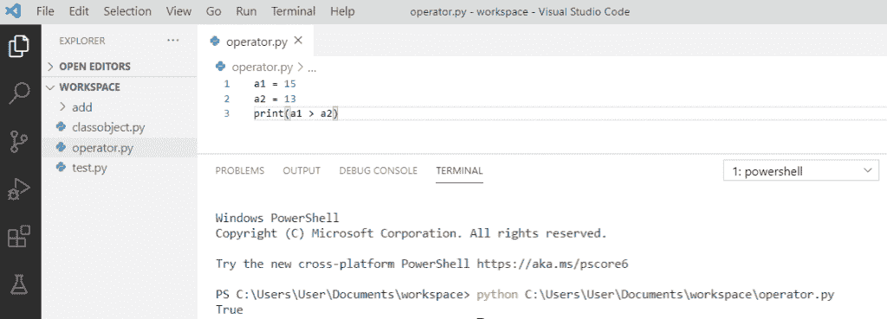

Python greater than operator

## Python 小于运算符

**小于**运算符在 Python 中用 **( < )** 表示，它检查左边的值是否小于右边的值。

**举例:**

```py
a1 = 20
a2 = 44
print(a1 < a2)
```

写完上面的代码(python 小于 operator)，你将打印出来，然后输出将显示为 `" True "` 。这里，左边的值**【a1】**小于右边的值**【a2】**，所以返回 true。

您可以看到下面 python 小于运算符的屏幕截图

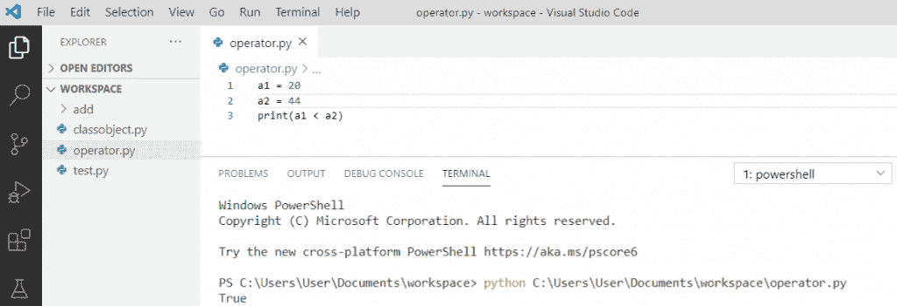

Python less than operator

## Python 检查用户输入是数字还是字符串

使用 `isdigit()` 方法我们可以检查，用户输入的输入是数字还是字符串。如果它是一个数字，那么它将返回输入的是数字，否则它将返回输入的是字符串。

**举例:**

```py
val = input("Enter the number: ")
if val.isdigit():
    print("User input is number")
else:
    print("User input is string")
```

在编写了上面的代码(python 检查用户输入是数字还是字符串)之后，您将打印这些代码，然后输出将显示为**"输入数字:22 用户输入是数字"**。在这里，如果输入的数字是一个数字， `"isdigit()"` 将返回 true。

你可以看到下面的截图 python 检查用户输入是数字还是字符串

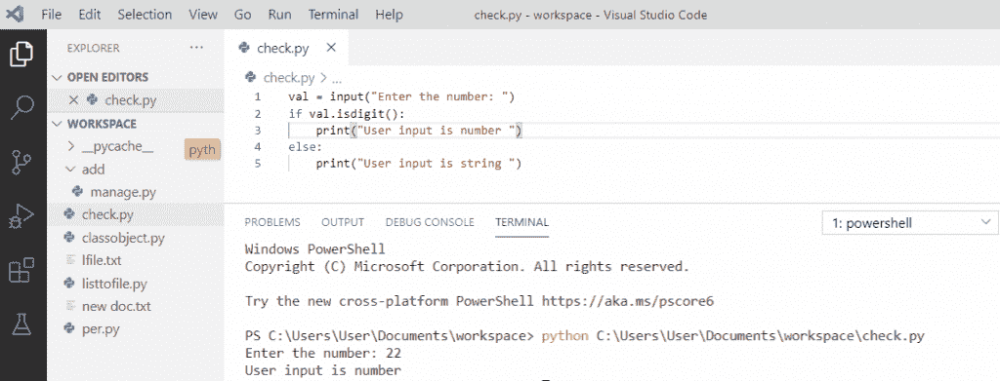

Python check if user input is a number or string

## Python 从另一个文件导入变量

*   导入文件使当前程序可以访问该文件中定义的变量和函数。我们将使用 `import` 从另一个文件中检索所有变量和函数。
*   我们把两个文件 `N.py` 和 `M.py` 放在同一个文件夹里。

**举例:**

```py
# In N.py
n = 12
print('Saying hello in N')
```

你可以看到下面的截图:

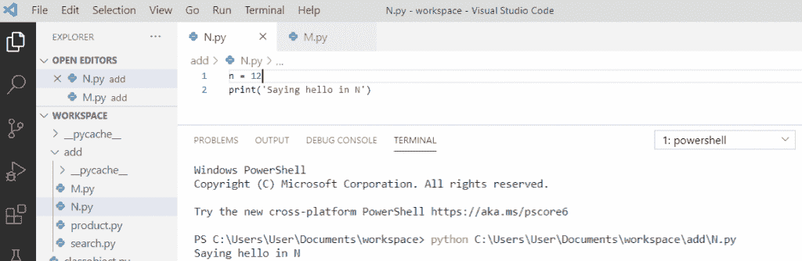

Python import variable from another file

**举例:**

```py
# In M.py
from N import n
print('The value of n is %s in M' % str(n))
```

写完上面的代码(python 从另一个文件导入变量)，一执行 `M.py` 输出就会出现**“在 N 中打招呼 N 的值在 M 中是 12”**。从 N 导入 n 的行**被执行。它采用被引用的脚本(N.py)。因此，M.py 拥有另一个文件中的变量。**

你可以从另一个文件中看到 python 导入变量的截图

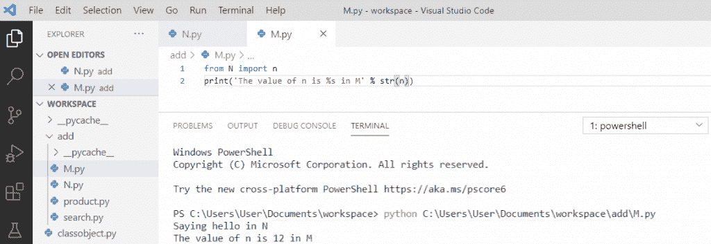

Python import variable from another file

## Python 动态变量名

为了创建一个动态变量名的**，我们将使用一个字典。字典有一个键和值，而键作为变量名对应值，它可以是各种类型的字符串或整数。**

**举例:**

```py
name = "Joe"
value = False
my_dict = {name: value}
print(my_dict["Joe"])
```

写完上面的代码(python 动态变量名)，你将打印出 **"my_dict["Joe"]"** 输出将显示为 `" False "` 。这里，我们可以动态地取变量名。

你可以看到下面的 python 动态变量名截图

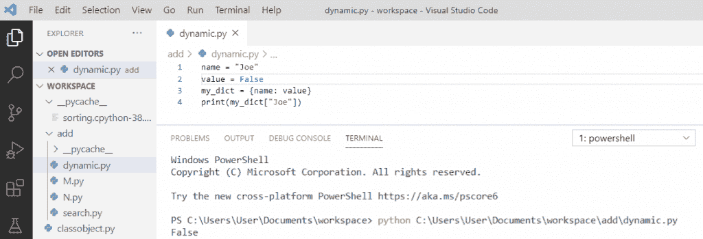

Python dynamic variable name

这样我们就可以**在 python 中检查变量是否为整数。**

您可能会喜欢以下 Python 教程:

*   [如何在 python 中连接字符串](https://pythonguides.com/concatenate-strings-in-python/)
*   [如何在 python 中把整数转换成字符串](https://pythonguides.com/convert-an-integer-to-string-in-python/)
*   [如何在 python 中使用正则表达式拆分字符串](https://pythonguides.com/python-split-string-regex/)
*   [值错误:数学域错误](https://pythonguides.com/valueerror-math-domain-error/)
*   [Python – stderr, stdin and stdout](https://pythonguides.com/python-stderr-stdin-and-stdout/)
*   [Python GUI 编程](https://pythonguides.com/python-gui-programming/)
*   [Python 输入和 raw_input 函数](https://pythonguides.com/python-input-and-raw_input-function/)

在本教程中，我们学习了如何在 python 中检查变量。

*   Python 检查变量是否为整数
*   Python 检查变量是否是字符串
*   检查变量在 python 中是列表还是元组
*   检查 python 中的变量是否不为空
*   获取 python 中对象的类型
*   检查变量是否存在于 python 中
*   UnboundLocalError:在赋值 python 之前引用了局部变量
*   Python 大于运算符
*   Python 小于运算符
*   Python 检查用户输入是数字还是字符串
*   Python 从另一个文件导入变量
*   Python 动态变量名

[Bijay Kumar](https://pythonguides.com/author/fewlines4biju/)

Python 是美国最流行的语言之一。我从事 Python 工作已经有很长时间了，我在与 Tkinter、Pandas、NumPy、Turtle、Django、Matplotlib、Tensorflow、Scipy、Scikit-Learn 等各种库合作方面拥有专业知识。我有与美国、加拿大、英国、澳大利亚、新西兰等国家的各种客户合作的经验。查看我的个人资料。

[enjoysharepoint.com/](https://enjoysharepoint.com/)[](https://www.facebook.com/fewlines4biju "Facebook")[](https://www.linkedin.com/in/fewlines4biju/ "Linkedin")[](https://twitter.com/fewlines4biju "Twitter")**