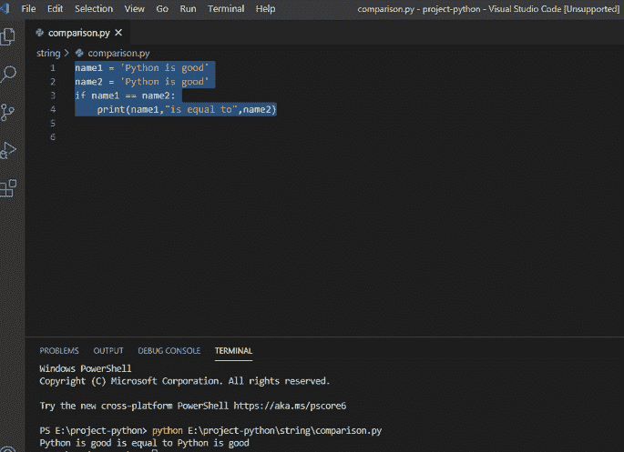
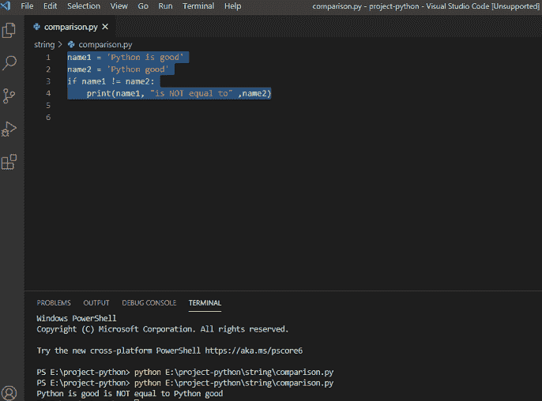
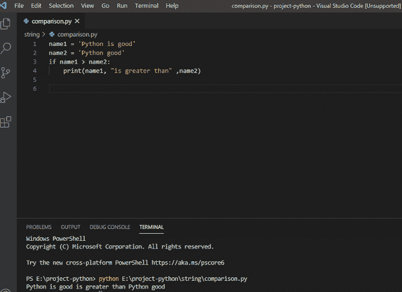
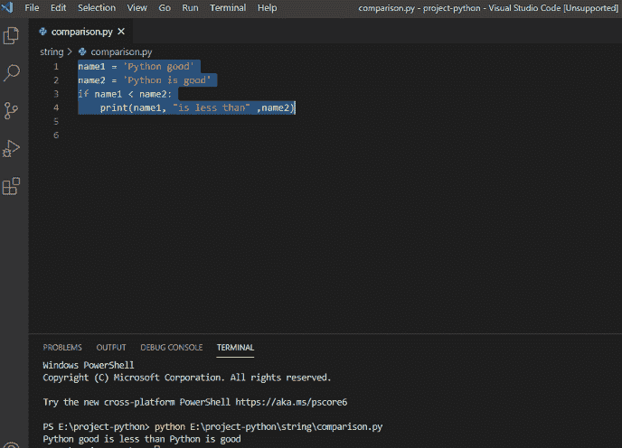

# Python 比较字符串(完整指南)

> 原文：<https://pythonguides.com/python-compare-strings/>

[](https://sharepointsky.teachable.com/p/python-and-machine-learning-training-course)

在本 [Python 教程](https://pythonguides.com/numpy/)中，我们来讨论一下 **Python 比较字符串**。我们将看到 python 比较两个字符串的各种例子。我们将看到各种 **Python 字符串比较**的例子。

*   Python 字符串比较示例
*   如何在 Python 中使用==运算符比较两个字符串
*   如何比较两个字符串使用！Python 中的=运算符
*   如何在 Python 中使用>运算符比较两个字符串
*   如何在 Python 中使用

目录

[](#)

*   [Python 字符串比较](#Python_string_comparison "Python string comparison")
*   [Python 使用==运算符](#Python_Compare_two_strings_using_operator "Python Compare two strings using == operator")比较两个字符串
*   Python 使用！比较两个字符串！=操作员
*   [Python 使用>操作符](#Python_Compare_two_string_using_%3E_operator "Python Compare two string using > operator")比较两个字符串
*   [如何使用<运算符](#How_to_compare_two_string_using_%3C_operator "How to compare two string using < operator")比较两个字符串

## Python 字符串比较

*   为了比较两个字符串，我们有 python 字符串比较操作符，可以使用等式 `(==)` 和不同的比较，如 **( >，<，！=)** 运算符。
*   为了比较两个字符串，我们需要两个字符串中的字符。
*   该函数可以接受任何字符串值作为输入。
*   我们需要取 2 个字符串值。在下面的 python 代码中，你可以看到，我已经取值为**“Python 好”**。
*   两根弦完全一样，因此它们相等。所以等式操作符返回 True 作为输出。

## Python 使用==运算符比较两个字符串

让我们看看如何在 Python 中使用==操作符来比较两个字符串。

```py
name1 = 'Python is good'
name2 = 'Python is good'
if name1 == name2:
print(name1,'is equal to',name2)
```

*   写完上面的 Python 代码来检查(字符串等于)，你会打印出**“name 1，‘等于’，name 2”**然后输出会出现**“name 1”**和**“name 2”**等于。另外，你可以参考下面的截图。



Python Compare two strings using == operator

上面的 python 代码我们可以用来**在 Python** 中使用==运算符比较两个字符串。

阅读: [Python 从字符串中移除子串](https://pythonguides.com/python-remove-substring-from-a-string/)

## Python 使用！=操作员

让我们看看如何使用！= Python 中的运算符。

下面表示不等于比较的 python 代码字符串。

```py
name1 = 'Python is good'
name2 = 'Python good'
if name1 != name2:
print(name1,'is NOT equal to',name2)
```

*   写完上面的 Python 代码检查(字符串不等于)，你会打印出 **"name1，'不等于'，name2"** 然后输出会出现 `"name1"` 和 `"name2"` 不等于。另外，你可以参考下面的截图。



Python Compare two strings using != operator

这就是如何使用！= Python 中的运算符。

阅读: [Python NumPy arange +示例](https://pythonguides.com/python-numpy-arange/)

## Python 使用>操作符比较两个字符串

现在，我们将看到如何使用大于比较运算符来比较 Python 中的两个字符串函数。

下面代表 python 代码字符串 is >(大于)比较。

```py
name1 = 'Python is good'
name2 = 'Python good'
if name1 > name2:
print(name1,'is greater than',name2)
```

*   写完上面的 Python 代码来检查(字符串大于)，你会打印出**“name 1，‘大于’，name 2”**然后输出就会出现。另外，你可以参考下面的截图。



Python Compare two string using > operator

这就是如何使用 Python 中的>操作符**比较两个字符串。**

阅读 [Python NumPy nan](https://pythonguides.com/python-numpy-nan/)

## 如何使用<运算符比较两个字符串

现在，我们将看到如何使用小于比较运算符来比较 Python[中的两个字符串函数。](https://python.org)

下面表示 python 代码字符串是

```py
name1 = 'Python good'
name2 = 'Python is good'
if name1 < name2:
print(name1,'is less than',name2)
```

*   写完上面的 Python 代码来检查(字符串小于)，你会打印出 **"name1，'小于'，name2"** 然后输出就会出现。另外，你可以参考下面的截图。



How to compare two string using < operator

上面的 python 代码，我们可以使用 Python 中的<操作符来**比较两个字符串。**

您可能会喜欢以下 Python 教程:

*   [Python 在字符串中查找子串](https://pythonguides.com/python-find-substring-in-string/)
*   [无法将字符串转换为浮点 Python](https://pythonguides.com/could-not-convert-string-to-float-python/)
*   [在 Python 中切片字符串+示例](https://pythonguides.com/slicing-string-in-python/)
*   [Python 字符串格式化示例](https://pythonguides.com/python-string-formatting/)
*   [如何在 Python 中求一个字符串的长度](https://pythonguides.com/find-the-length-of-a-string-in-python/)
*   [通过索引](https://pythonguides.com/remove-character-from-python-string-through-index/)从 Python 字符串中删除一个字符
*   [Python 程序反转字符串的例子](https://pythonguides.com/python-program-to-reverse-a-string/)

在本 Python 教程中，我们学习了， **Python 比较字符串**。

*   Python 字符串比较
*   Python 使用==运算符比较两个字符串
*   Python 比较两个字符串使用！=运算符
*   Python 使用>运算符比较两个字符串
*   如何使用

[Bijay Kumar](https://pythonguides.com/author/fewlines4biju/)

Python 是美国最流行的语言之一。我从事 Python 工作已经有很长时间了，我在与 Tkinter、Pandas、NumPy、Turtle、Django、Matplotlib、Tensorflow、Scipy、Scikit-Learn 等各种库合作方面拥有专业知识。我有与美国、加拿大、英国、澳大利亚、新西兰等国家的各种客户合作的经验。查看我的个人资料。

[enjoysharepoint.com/](https://enjoysharepoint.com/)[](https://www.facebook.com/fewlines4biju "Facebook")[](https://www.linkedin.com/in/fewlines4biju/ "Linkedin")[](https://twitter.com/fewlines4biju "Twitter")