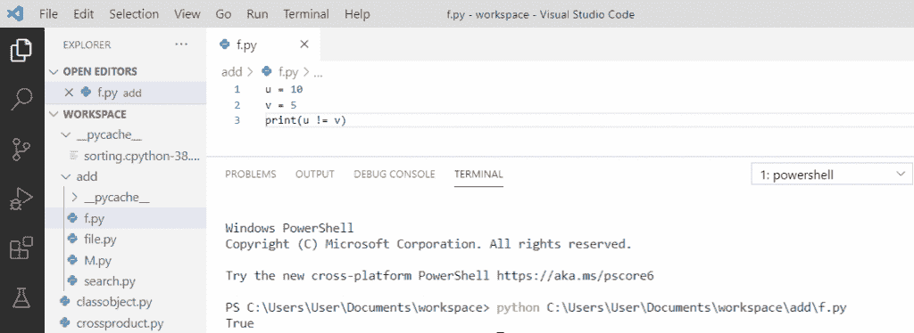
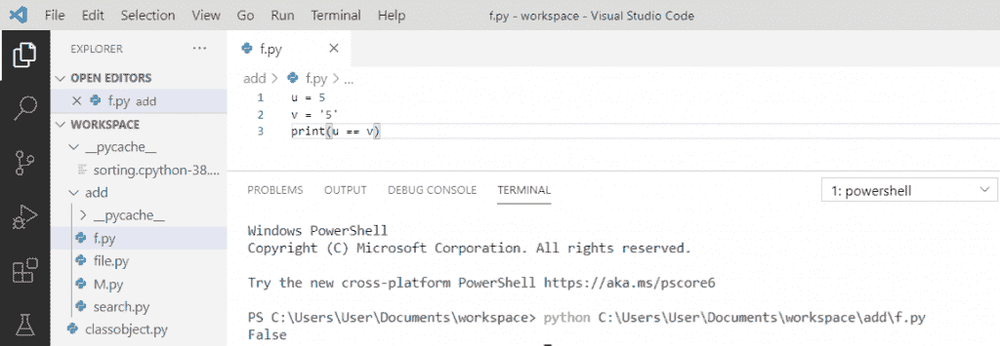
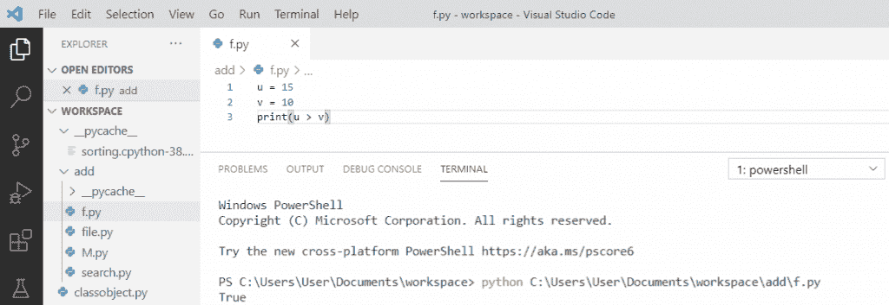
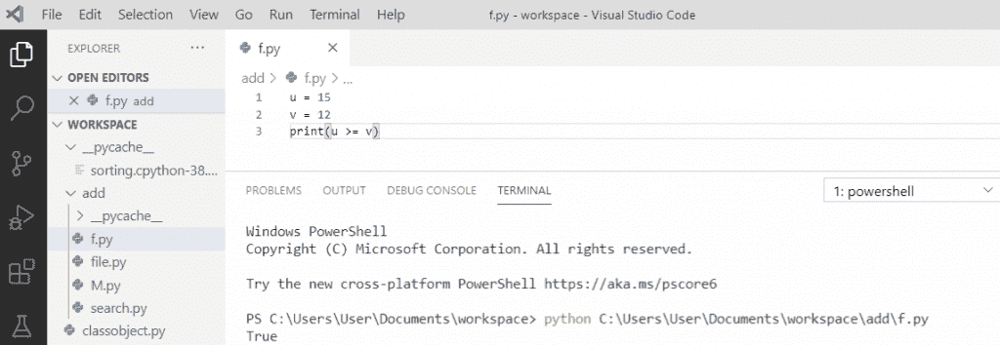
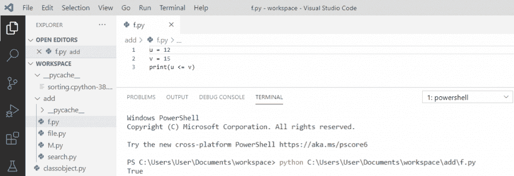

# Python 比较运算符

> 原文：<https://pythonguides.com/python-comparison-operators/>

[](https://sharepointsky.teachable.com/p/python-and-machine-learning-training-course)

在本 [python 教程](https://pythonguides.com/python-hello-world-program/)中，我们将讨论 **python 比较运算符**。我们还将检查:

*   python 中的比较运算符是什么
*   什么会！= python 中的 mean
*   在 python 中==是什么意思
*   python 中的>是什么意思
*   python 中的
*   在 python 中> =是什么意思
*   在 python 中< =是什么意思

目录

[](#)

*   [python 中的比较运算符是什么](#What_is_comparison_operators_in_python "What is comparison operators in python")
*   [有什么用！= python 中的 mean](#What_does_mean_in_python "What does != mean in python")
*   [python 中的==是什么意思](#What_does_mean_in_python-2 "What does == mean in python")
*   [python 中的>是什么意思](#What_does_%3E_mean_in_python "What does > mean in python")
*   [python 中的<是什么意思](#What_does_%3C_mean_in_python "What does < mean in python")
*   [python 中的> =是什么意思](#What_does_%3E_mean_in_python-2 "What does >= mean in python")
*   [python 中的< =是什么意思](#What_does "What does <= mean in python")

## python 中的比较运算符是什么

python 中的**比较运算符**也称为**关系运算符**。它比较两个操作数的值，并根据满足的条件返回**真或假**。因此，python 中有六个比较运算符，包括小于、大于、小于或等于、大于或等于、等于和不等于。

那么，就让我们一个一个的去了解吧。

## 有什么用！= python 中的 mean

Python **不等于**用**来表示(！=)** 运算符，如果运算符两边的值不相等，则返回 `True` 。

**举例:**

```py
u = 10
v = 5

print(u != v)
```

写完上面的代码(什么呢！= python 中的 mean)，一旦我们打印，输出将显示为**“True”**。这里，u 不等于 v，所以它将输出返回为 True。

你可以参考下面的截图 **what does！= python 中的 mean**。



What does != mean in python

你可能会喜欢 Python 熊猫里的 [Crosstab。](https://pythonguides.com/crosstab-in-python-pandas/)

## python 中的==是什么意思

Python **等于**由 `(==)` 运算符表示，如果运算符两边的值相等，则返回 True。

**举例:**

```py
u = 5
v = '5'
print(u == v)
```

写完上面的代码(python 中==是什么意思)，一旦我们打印，输出将显示为 `" False "` 。在这里，我们可以看到 5 是一个整数，而' 5 '是一个不相等的字符串。因此，它将输出返回 False。

可以参考下面截图**在 python** 中==是什么意思。



What does == mean in python

## python 中的>是什么意思

让我们看看比较运算符中的(>)是什么意思

在 python 中，**大于**的运算符用 **( > )** 表示。它检查左边的值是否大于右边的值，如果大于，则返回 True。

**举例:**

```py
u = 15
v = 10
print(u > v)
```

写完上面的代码(python 中的>是什么意思)，一旦我们打印，输出将显示为 `" True "` 。在这里，我们可以看到 15 大于 10。因此，它将输出返回为 True。

可以参考下面截图**>在 python** 中是什么意思。



What does > mean in python

阅读[如何在 Python Pygame 中把屏幕放在特定位置](https://pythonguides.com/how-to-put-screen-in-specific-spot-in-python-pygame/)

## python 中的<是什么意思

现在，让我们看看(

在 python 中，**小于**由 **( < )** 运算符表示，它检查左边的值是否小于右边的值。如果左值小于右值，则返回 True。

**举例:**

```py
u = 10
v = 12
print(u < v)
```

写完上面的代码(什么< mean in python), Once we will print then the output will appear as **“真”**)。在这里，我们可以看到 10 小于 12。因此，它将输出返回为 True。

可以参考下面截图**<在 python** 中是什么意思。


What does < mean in python

## python 中的> =是什么意思

大于或等于的**运算符表示为 **( > =)** 。只有当左边的值大于或等于右边的值时，该运算符才返回 True，否则将返回 False。**

**举例:**

```py
u = 15
v = 12
print(u >= v)
```

写完上面的代码后(python 中> =是什么意思)，一旦我们打印，输出将显示为 `" True "` 。在这里，我们可以看到 15 大于或等于 12。因此，它将输出返回为 True。

可以参考下面截图**>=在 python** 中是什么意思。



What does >= mean in python

## python 中的< =是什么意思

小于或等于运算符的**用(< =)表示。只有当运算符左边的值小于或等于右边的值时，它才返回 True。**

示例:

```py
u = 12
v = 15
print(u <= v)
```

写完上面的代码(什么<= mean in python), Once we will print then the output will appear as **“真”**)。在这里，我们可以看到 12 小于或等于 15。因此，它将输出返回为 True。

可以参考下面截图**<=在 python** 中是什么意思。



What does <= mean in python

您可能会喜欢以下 Python 教程:

*   [Python 中的链表](https://pythonguides.com/linked-lists-in-python/)
*   [如何用 Python 显示日历](https://pythonguides.com/display-calendar-in-python/)
*   [如何用 Python 制作计算器](https://pythonguides.com/make-a-calculator-in-python/)
*   [Python 布尔函数](https://pythonguides.com/python-booleans/)
*   [Python 中的正则表达式](https://pythonguides.com/regular-expressions-in-python/)
*   [Python 打印 2 位小数](https://pythonguides.com/python-print-2-decimal-places/)
*   [Python 生成器(Python 生成器 vs 迭代器)](https://pythonguides.com/python-generators/)
*   [Python 计数器——详细教程](https://pythonguides.com/python-counter/)

在本 Python 教程中，我们学习了 **python 比较运算符**。此外，我们还讨论了以下主题:

*   python 中的比较运算符是什么
*   什么会！= python 中的 mean
*   在 python 中==是什么意思
*   python 中的>是什么意思
*   python 中的
*   在 python 中> =是什么意思
*   在 python 中< =是什么意思

[Bijay Kumar](https://pythonguides.com/author/fewlines4biju/)

Python 是美国最流行的语言之一。我从事 Python 工作已经有很长时间了，我在与 Tkinter、Pandas、NumPy、Turtle、Django、Matplotlib、Tensorflow、Scipy、Scikit-Learn 等各种库合作方面拥有专业知识。我有与美国、加拿大、英国、澳大利亚、新西兰等国家的各种客户合作的经验。查看我的个人资料。

[enjoysharepoint.com/](https://enjoysharepoint.com/)[](https://www.facebook.com/fewlines4biju "Facebook")[](https://www.linkedin.com/in/fewlines4biju/ "Linkedin")[](https://twitter.com/fewlines4biju "Twitter")