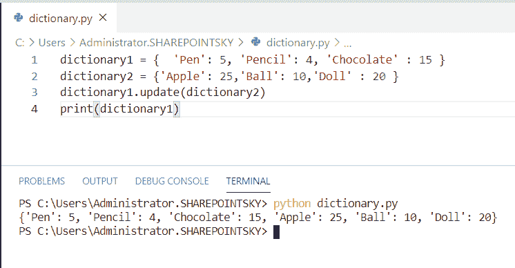
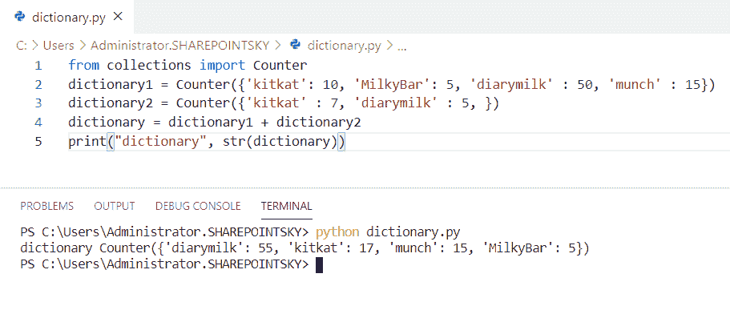
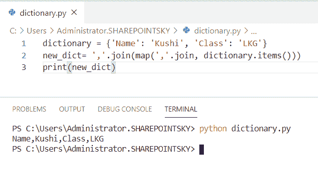
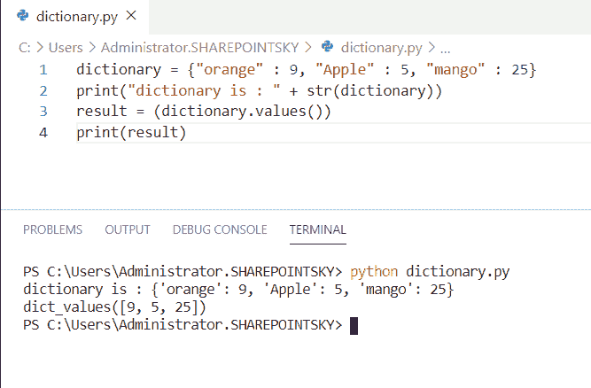
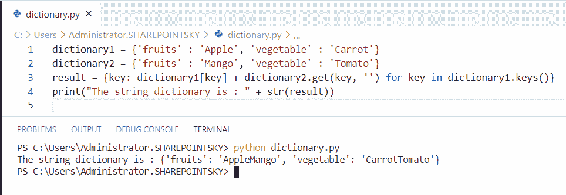
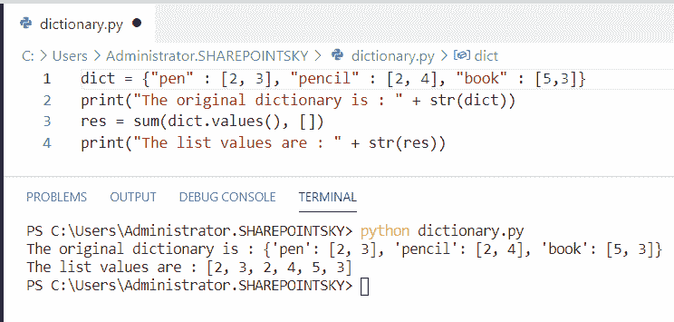
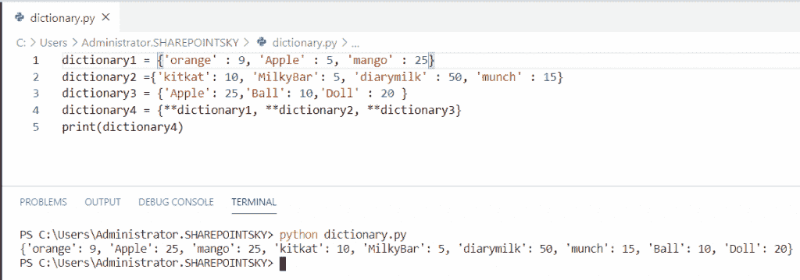
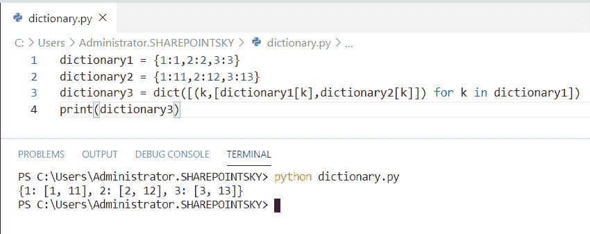
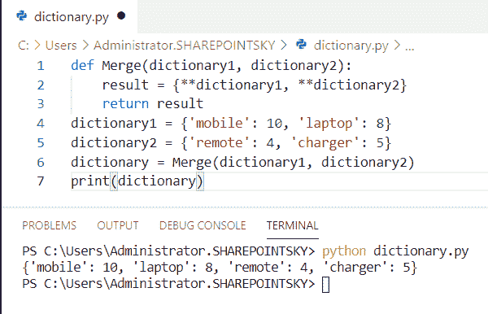
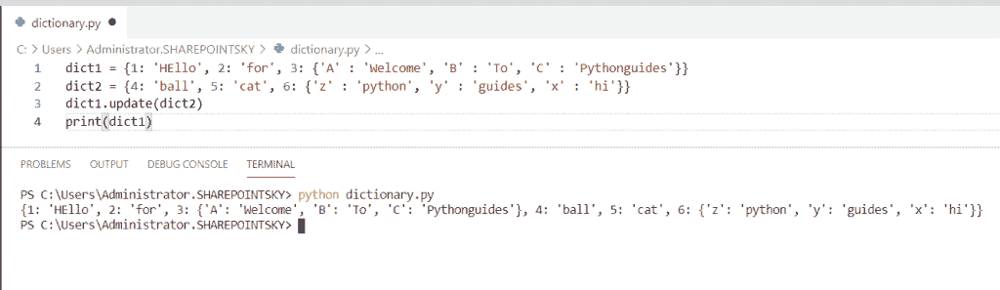

# Python 串联字典+示例

> 原文：<https://pythonguides.com/python-concatenate-dictionary/>

[](https://sharepointsky.teachable.com/p/python-and-machine-learning-training-course)

在本 [python 教程中，](https://pythonguides.com/python-hello-world-program/)我们将讨论 **Python 连接字典**，我们还将涉及以下主题:

*   Python 连接字典
*   Python 用相同的键连接字典
*   Python 连接字典键和值
*   Python 连接字典值
*   Python 串联字典值字符串
*   Python 连接列表字典
*   Python 3 连接字典
*   Python 在键上连接字典
*   如何用 python 连接两个字典
*   合并多个字典 python
*   Python 串联嵌套字典

目录

[](#)

*   [Python 串联字典](#Python_concatenate_dictionaries "Python concatenate dictionaries")
*   [Python 用相同的键连接字典](#Python_concatenate_dictionaries_with_same_keys "Python concatenate dictionaries with same keys")
*   [Python 连接字典键和值](#Python_concatenate_dictionary_key_and_value "Python concatenate dictionary key and value")
*   [Python 串联字典值](#Python_concatenate_dictionary_values "Python concatenate dictionary values")
*   [Python 串联字典值字符串](#Python_concatenate_dictionary_value_string "Python concatenate dictionary value string")
*   [Python 连接列表字典](#Python_concatenate_dictionary_of_lists "Python concatenate dictionary of lists")
*   [Python 3 串联字典](#Python_3_concatenate_dictionaries "Python 3 concatenate dictionaries")
*   [Python 在键上连接字典](#Python_join_dictionaries_on_key "Python join dictionaries on key")
*   [如何用 python 连接两个字典](#How_to_concatenate_two_dictionaries_in_python "How to concatenate two dictionaries in python")
*   [合并多个字典 python](#Merge_multiple_dictionaries_python "Merge multiple dictionaries python")
*   [Python 串联嵌套字典](#Python_concatenate_nested_dictionaries "Python concatenate nested dictionaries")

## Python 串联字典

在这里，我们可以看到**如何在 python 中连接字典**。

*   在这个例子中，我拿了**两本字典**。将 [Python 字典](https://pythonguides.com/create-a-dictionary-in-python/) **串联起来。使用更新**。
*   **。update()** 方法用于将指定的条目插入到字典中。
*   为了得到输出，我使用了 `print(dictionary1)` 。

示例:

```py
dictionary1 = {  'Pen': 5, 'Pencil': 4, 'Chocolate' : 15 }
dictionary2 = {'Apple': 25,'Ball': 10,'Doll' : 20 }
dictionary1.update(dictionary2)
print(dictionary1)
```

我们可以看到连接的字典作为输出。您可以参考下面的输出截图。



Python concatenate dictionaries

上面的 Python 代码我们可以用来**连接字典**。

你可能也喜欢， [Python 程序打印数组](https://pythonguides.com/python-program-to-print-element-in-an-array/)中的元素。

## Python 用相同的键连接字典

在这里，我们可以看到**如何用 python 中的相同键**连接字典

*   在这个例子中，我从**集合**中导入了一个名为**计数器**的模块。计数器是用于计算键值对象的子类。
*   计数器将数据保存在一个无序的集合中，就像一个可散列的对象一样。
*   为了连接字典，我使用了`dictionary =****dictionary 1+dictionary 2`。
*   为了得到输出，我使用了 **print("dictionary "，str(dictionary))** 。

示例:

```py
from collections import Counter 
dictionary1 = Counter({'kitkat': 10, 'MilkyBar': 5, 'diarymilk' : 50, 'munch' : 15}) 
dictionary2 = Counter({'kitkat' : 7, 'diarymilk' : 5, })
dictionary = dictionary1 + dictionary2 
print("dictionary", str(dictionary))
```

我们可以看到连接起来的字符串作为输出。你可以参考下面的截图，在 Python 中用相同的键连接字典**。**



Python concatenate dictionaries with the same keys

上面的代码我们可以用 python 中相同的键来连接字典。

## Python 连接字典键和值

在这里，我们可以看到**如何在 python 中连接字典键和值**。

*   在这个例子中，我使用了一个带有**键**和**值**的字典。连接字典**的键和值。使用了 join** 和**'，**分隔符。
*   **。items()** 方法返回 view 对象，该对象返回包含键值对的对象。
*   `map()` 方法用于映射键和值，它保存每次迭代的列表。

示例:

```py
dictionary = {'Name': 'Kushi', 'Class': 'LKG'}
new_dict= ','.join(map(','.join, dictionary.items()))
print(new_dict)
```

为了得到输出，我使用了 `print(new_dict)` 。键和值对连接在一起作为输出。下面的截图显示了输出。



Python concatenate dictionary key and value

这就是如何连接 Python 字典的键和值。

阅读 [Python 字典索引](https://pythonguides.com/python-dictionary-index/)

## Python 串联字典值

在这里，我们可以看到**如何在 python 中连接字典值**。

*   在这个例子中，我拿了一本字典。要将值转换成字符串**，需要使用 str()** 。
*   仅连接字典**的值。使用 value()** 方法。
*   **。value()** 是返回字典值的内置方法。

示例:

```py
dictionary = {"orange" : 9, "Apple" : 5, "mango" : 25} 
print("dictionary is : " + str(dictionary)) 
result = (dictionary.values()) 
print(result)
```

为了得到输出，我使用了 `print(result)` 。我们可以看到只有值被连接起来作为输出。下面的截图显示了输出。



Python concatenate dictionary values

这就是如何在 Python 中连接字典值。

## Python 串联字典值字符串

在这里，我们可以看到**如何在 python 中连接字典值字符串**。

*   在这个例子中，我拿了两个字典，如 **dictionary1，dictionary2** 。
*   连接值字符串字典**。使用 get()** 。**。get()** 方法返回字典中指定键的值。
*   循环中的**用于迭代，获取字符串格式的值时使用 `str()` 方法。**

示例:

```py
dictionary1 = {'fruits' : 'Apple', 'vegetable' : 'Carrot'} 
dictionary2 = {'fruits' : 'Mango', 'vegetable' : 'Tomato'} 
result = {key: dictionary1[key] + dictionary2.get(key, '') for key in dictionary1.keys()} 
print("The string dictionary is : " + str(result)) 
```

字典的字符串值被连接起来作为输出。下面的截图显示了输出。



Python concatenate dictionary value string

## Python 连接列表字典

在这里，我们可以看到**如何在 python 中连接列表字典**。

*   在这个例子中，我取了一个字典，字典的值在**列表**中赋值。
*   为了连接列表中的值，创建一个空列表，并使用**将值存储在创建的列表中。value()** 。

示例:

```py
dict = {"pen" : [2, 3], "pencil" : [2, 4], "book" : [5,3]} 
print("The original dictionary is : " + str(dict)) 
res = sum(dict.values(), []) 
print("The list values are : " + str(res)) 
```

为了得到输出，我使用了 **print("列表值是:"+ str(res))** 。下面的屏幕截图显示了存储在创建的列表中的字典值的输出。



Python concatenate dictionary of lists

这就是如何在 Python 中**连接列表字典。**

## Python 3 串联字典

在这里，我们可以看到**如何在 python 中连接字典**。

*   在这个例子中，我取了三个字典作为 **dictionary1、dictionary2、dictionary3** 。
*   为了连接三个字典 `**` 被使用。**用于直接使用字典向函数传递多个参数。

示例:

```py
dictionary1 = {'orange' : 9, 'Apple' : 5, 'mango' : 25} 
dictionary2 ={'kitkat': 10, 'MilkyBar': 5, 'diarymilk' : 50, 'munch' : 15}
dictionary3 = {'Apple': 25,'Ball': 10,'Doll' : 20 }
dictionary4 = {**dictionary1, **dictionary2, **dictionary3}
print(dictionary4)
```

为了得到输出，我使用了 `print(dictionary4)` 。下面的截图显示了输出。



Python 3 concatenate dictionaries

这就是如何在 Python 3 中**串联字典。**

## Python 在键上连接字典

在这里，我们可以看到**如何在 python 中连接键**上的字典。

*   在这个例子中，我将两本词典分别作为**词典 1** 、**词典 2** 。为了连接键上的字典，我在 dictionary1 中使用 for 循环作为 k 的**。**
*   为了得到输出，我使用了 `print(dictionary3)`

示例:

```py
dictionary1 = {1:1,2:2,3:3}
dictionary2 = {1:11,2:12,3:13}
dictionary3 = dict([(k,[dictionary1[k],dictionary2[k]]) for k in dictionary1])
print(dictionary3)
```

我们可以看到同一个键的值被连接在一起。您可以参考下面的输出截图。



Python join dictionaries on key

这是如何在 Python 中连接键上的字典。

## 如何用 python 连接两个字典

现在，我们可以看到**如何在 python 中连接两个字典**。

*   在这个例子中，我拿了两本字典。为了连接两个字典，我使用了**。**方法更新()。
*   **。update()** 方法将指定的项插入到字典中。
*   为了得到输出，我使用了 `print(dictionary1)` 。

示例:

```py
dictionary1 = {  'Pen': 5, 'Pencil': 4, 'Chocolate' : 15 }
dictionary2 = {'Apple': 25,'Ball': 10,'Doll' : 20 }
dictionary1.update(dictionary2)
print(dictionary1)
```

我们可以看到连接的字典作为输出。关于**用 python** 连接两个字典，可以参考下面的截图。


How to concatenate two dictionaries in python

上面的代码，我们可以用 python 中的**连接两个字典。**

## 合并多个字典 python

这里可以看到**如何在 python 中合并多个字典**。

*   在这个例子中，我定义了一个函数为 `def Merge` ，并将两个字典作为参数传递。为了合并字典，我使用了 `**` 。
*   `**` 用于直接使用字典向函数传递多个参数。
*   然后函数返回，为了合并字典，我用了 **Merge(dictionary1，dictionary2)** 。
*   为了得到输出，我使用了 `print(dictionary)` 。

示例:

```py
def Merge(dictionary1, dictionary2):
	result = {**dictionary1, **dictionary2}
	return result
dictionary1 = {'mobile': 10, 'laptop': 8}
dictionary2 = {'remote': 4, 'charger': 5}
dictionary = Merge(dictionary1, dictionary2)
print(dictionary)
```

为了得到输出，我使用了 `print(dictionary)` 。您可以看到连接的字典作为输出。下面的截图显示了**合并多个字典 python** 的输出。



Merge multiple dictionaries python

这是**如何在 python 中合并多个字典**。

## Python 串联嵌套字典

在这里，我们可以看到**如何在 python 中连接嵌套字典**。

*   在这个例子中，我将两个嵌套的字典作为 `dict1` 、 **dict2。**
*   为了连接字典，我使用了 `dict1.update(dict2)` 。
*   **。update()** 方法用于将指定的条目插入到字典中。
*   为了得到输出，我使用了 `print(dict1)` 。

示例:

```py
dict1 = {1: 'HEllo', 2: 'for', 3: {'A' : 'Welcome', 'B' : 'To', 'C' : 'Pythonguides'}} 
dict2 = {4: 'ball', 5: 'cat', 6: {'z' : 'python', 'y' : 'guides', 'x' : 'hi'}} 
dict1.update(dict2)
print(dict1)
```

你可以参考下面的截图，看看 Python 中**连接嵌套字典的输出。**



Python concatenate nested dictionaries

这就是如何在 Python 中连接嵌套字典。

您可能会喜欢以下 Python 教程:

*   [Python 中的索引和切片](https://pythonguides.com/indexing-and-slicing-in-python/)
*   [Python 串联数组](https://pythonguides.com/python-concatenate-arrays/)
*   [Python Tkinter 拖拽](https://pythonguides.com/python-tkinter-drag-and-drop/)
*   [Python 集合的交集](https://pythonguides.com/python-intersection-of-sets/)
*   [Python 逐行读取文件示例](https://pythonguides.com/python-read-a-file-line-by-line/)
*   [用 Python 创建和修改 PDF 文件](https://pythonguides.com/create-and-modify-pdf-file-in-python/)
*   [使用 Python Pygame 创建游戏](https://pythonguides.com/create-a-game-using-python-pygame/)

在本教程中，我们学习了 **Python 连接字典**，并且我们还涵盖了以下主题:

*   Python 连接字典
*   Python 用相同的键连接字典
*   Python 连接字典键和值
*   Python 连接字典值
*   Python 串联字典值字符串
*   Python 连接列表字典
*   Python 3 连接字典
*   Python 在键上连接字典
*   如何用 python 连接两个字典
*   合并多个字典 python
*   Python 串联嵌套字典

[Bijay Kumar](https://pythonguides.com/author/fewlines4biju/)

Python 是美国最流行的语言之一。我从事 Python 工作已经有很长时间了，我在与 Tkinter、Pandas、NumPy、Turtle、Django、Matplotlib、Tensorflow、Scipy、Scikit-Learn 等各种库合作方面拥有专业知识。我有与美国、加拿大、英国、澳大利亚、新西兰等国家的各种客户合作的经验。查看我的个人资料。

[enjoysharepoint.com/](https://enjoysharepoint.com/)[](https://www.facebook.com/fewlines4biju "Facebook")[](https://www.linkedin.com/in/fewlines4biju/ "Linkedin")[](https://twitter.com/fewlines4biju "Twitter")