# Python 连接列表和示例

> 原文：<https://pythonguides.com/python-concatenate-list/>

[](https://sharepointsky.teachable.com/p/python-and-machine-learning-training-course)

在本 [python 教程中，](https://pythonguides.com/python-hello-world-program/)我们将讨论 **Python 连接列表，**我们还将涉及以下主题:

*   Python 用分隔符连接列表元素
*   Python 连接了一系列列表
*   Python 将一系列整数连接成一个字符串
*   Python 连接了元组列表
*   Python 连接了一个 NumPy 数组列表
*   Python 用分隔符连接字符串列表
*   Python 连接了一个字典列表
*   Python 连接了一个字节列表
*   Python 将列表连接成字符串
*   Python 连接了一个数组列表
*   Python 连接了一个整数列表
*   Python 连接没有重复的列表
*   Python 将对象列表连接到字符串
*   Python 连接多个列表
*   合并列表 python 唯一

目录

[](#)

*   [Python 连接列表](#Python_concatenate_list "Python concatenate list")
*   [Python 用分隔符](#Python_concatenate_list_elements_with_delimiter "Python concatenate list elements with delimiter")连接列表元素
*   [Python 串联了一个列表列表](#Python_concatenates_a_list_of_lists "Python concatenates a list of lists")
*   [Python 将一列整数连接成一个字符串](#Python_concatenate_a_list_of_integers_into_a_string "Python concatenate a list of integers into a string")
*   [Python 串联了一个元组列表](#Python_concatenate_a_list_of_tuples "Python concatenate a list of tuples")
*   [Python 串联了一个 NumPy 数组列表](#Python_concatenate_a_list_of_NumPy_arrays "Python concatenate a list of NumPy arrays")
*   [Python 用分隔符](#Python_concatenate_a_list_of_strings_with_a_separator "Python concatenate a list of strings with a separator")连接一串字符串
*   [Python 串联了一个字典列表](#Python_concatenate_a_list_of_dictionaries "Python concatenate a list of dictionaries")
*   [Python 串联一个字节列表](#Python_concatenate_a_list_of_bytes "Python concatenate a list of bytes")
*   [Python 将列表连接成字符串](#Python_concatenate_list_to_string "Python concatenate list to string")
*   [Python 串联了一个数组列表](#Python_concatenates_a_list_of_arrays "Python concatenates a list of arrays")
*   [Python 串联一个整数列表](#Python_concatenate_a_list_of_integers "Python concatenate a list of integers")
*   [Python 串联无重复列表](#Python_concatenate_lists_without_duplicates "Python concatenate lists without duplicates")
*   [Python 将对象列表连接到字符串](#Python_join_list_of_objects_to_string "Python join list of objects to string")
*   [Python 串联多个列表](#Python_concatenate_multiple_lists "Python concatenate multiple lists")
*   [合并列表 python 特有的](#Merge_lists_python_unique "Merge lists python unique")

## Python 连接列表

在这里，我们可以看到**如何在 python 中连接列表**。

*   在这个例子中，我取了两个列表作为 **list1，list2** 。for 循环用于连接列表。
*   **。append** 用于将 list2 中的项目追加到 list1 中，我已经使用了 `print(list1)` 来获得输出。

示例:

```py
list1 = [1, 3, 5, 7, 9] 
list2 = [2, 4, 6, 8, 10] 
for i in list2 : 
    list1.append(i) 
print(list1)
```

我们可以看到这两个列表作为输出出现。下面的截图显示了输出。

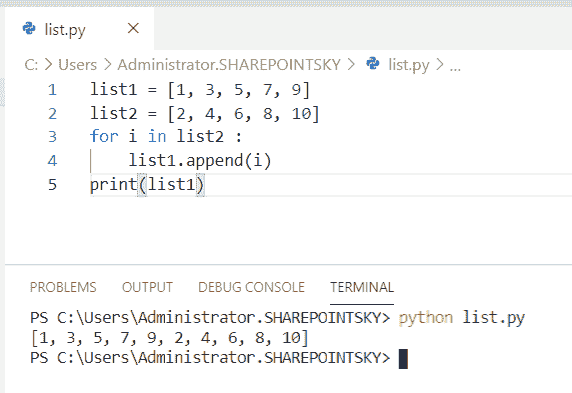

Python concatenate list

你可能喜欢[如何在 Python 中创建一个列表](https://pythonguides.com/create-list-in-python/)和[在 Python 中检查一个列表是否为空](https://pythonguides.com/check-if-a-list-is-empty-in-python/)。

## Python 用分隔符连接列表元素

这里可以看到**在 python 中如何用分隔符**串联列表元素？

*   在这个例子中，我将 as list 作为 **list = ['1 '，' 2 '，' 3 '，' 4']** 。**“本例中使用了分隔符**和**。join()** 用于连接列表中的元素。
*   我已经用 `print(a)` 得到了输出。

示例:

```py
list = ['1','2','3','4'] 
newlist = "."
a = newlist.join(list) 
print(a) 
```

下面的屏幕截图显示了 python 中带分隔符的连接列表作为输出。

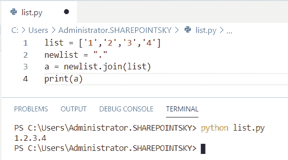

Python concatenate list elements with delimiter

## Python 串联了一个列表列表

现在，我们可以看到**如何在 python 中连接一个列表列表**。

*   在这个例子中，我取了一个列表为 **List=[[2，4]，[6，8，10]，[36，47，58，69]]** ，创建了一个空的。
*   使用循环将列表连接到空列表中。**。append()** 用于连接列表。
*   我已经用 `print(empty_list)` 得到了输出。

示例:

```py
List=[[2,4],[6,8,10],[36,47,58,69]]
empty_list=[]
for i in List:
  for j in i:
    empty_list.append(j)
print (empty_list)
```

在这里，我们可以看到列表的连接列表是输出。您可以参考下面的输出截图。

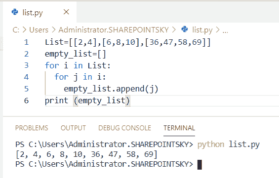

Python concatenates a list of lists

这就是如何在 Python 中**连接一个列表的列表。**

你可能喜欢 [11 Python 列表方法](https://pythonguides.com/python-list-methods/)和[如何在 Python 中减去两个数](https://pythonguides.com/subtract-two-numbers-in-python/)。

## Python 将一列整数连接成一个字符串

现在，我们可以看到**如何在 python 中将一列整数连接成一个字符串**。

*   在这个例子中，我取了一个列表为**integer =【2，8，12】**。我已经使用 `str(int)` 将一列整数转换成一个字符串。
*   来连接**。”**分隔符，**。使用 join()** 方法。
*   我已经用 `print(string)` 得到了输出。

示例:

```py
integer = [2,8,12]
string = [str(int) for int in integer]
string = ".".join(string)
print(string)
```

下面的屏幕截图显示了带分隔符的串联字符串的输出。您可以参考下面的输出截图。

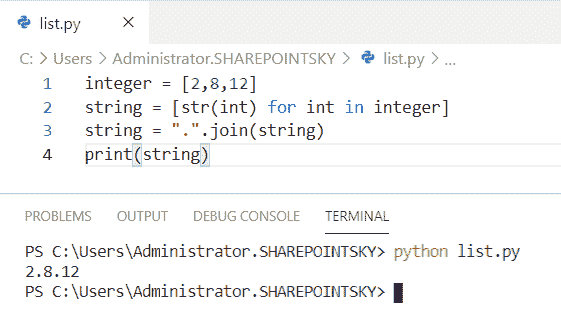

Python concatenate a list of integers into a string

这是如何在 Python 中将一列整数连接成一个字符串。

查看， [Python 程序求 n 个数之和](https://pythonguides.com/python-program-to-find-sum-of-n-numbers/)和[如何在 Python 中交换两个数](https://pythonguides.com/swap-two-numbers-in-python/)。

## Python 串联了一个元组列表

在这里，我们可以看到**如何在 python 中连接元组列表**

*   在这个例子中，我在一个列表中取了两个元组，并定义了一个名为 tuplestring(tuple)的函数。
*   为了返回字符串，我使用了**。**join(tuple)用于串联
*   `map()` 用于将给定的函数应用于元组的每个 iterable 项，并返回结果列表。
*   `print(list(result))` 用于获取输出。**列表(结果)**用于检查地图中的元素。

示例:

```py
tuples = [('x', 'y', 'z'), ('welcome', 'to', 'python', 'guides')]
def tuplestring(tuple):
   return ' '.join(tuple)
result = map(tuplestring, tuples)
print(list(result))
```

我们可以看到连接的元组作为输出。下面的输出截图。

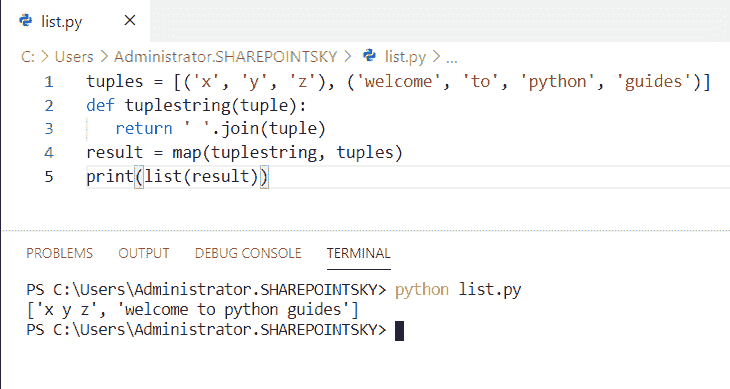

Python concatenate a list of tuples

这就是我们如何在 Python 中**连接一个元组列表。**

## Python 串联了一个 NumPy 数组列表

在这里，我们可以看到**如何在 python 中连接一个 Numpy 数组列表**(Python 中的[Numpy](https://pythonguides.com/numpy/))

*   在这个例子中，我导入了一个名为 **numpy 的模块作为 np** 。
*   我取了两个列表为 **a = np.array([[2，4]，[6，8]])** ， **b = np.array([[1，3]])**
*   我已经使用了 `np.concatenate` 来连接一个列表。
*   轴 0 代表行，轴 1 代表列，**”。T"** 用于转置一个数组。
*   **print(c)，print(d)** 用于得到输出。

示例:

```py
import numpy as np
a = np.array([[2, 4], [6, 8]])
b = np.array([[1, 3]])
c= np.concatenate((a, b), axis=0)
d = np.concatenate((a, b.T), axis=1)
print(c)
print(d)
```

我们可以看到级联列表的输出。你可以参考下面的截图。

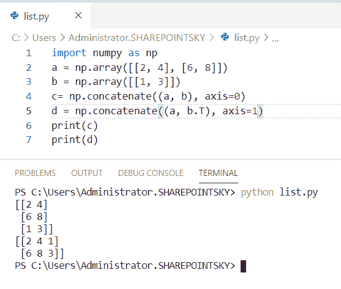

Python concatenate a list of NumPy arrays

这就是如何在 Python 中**连接 NumPy 数组列表。**

你可能还喜欢， [Python 把列表转换成字符串](https://pythonguides.com/python-convert-list-to-string/)和 [Python 对元组列表排序](https://pythonguides.com/python-sort-list-of-tuples/)。

## Python 用分隔符连接一串字符串

在这里，我们可以看到**如何在 python 中用分隔符**连接字符串列表

*   我已经把 list 当成 **list = ['3 '，' 6 '，' 9 '，' 12']** 。 `"-"` 是我用来连接字符串的分隔符。
*   `string.join(list)` 用于用分隔符连接字符串列表。
*   `print(string_list)` 用于获取输出。

示例:

```py
list = ['3','6','9','12'] 
string = "-"
string_list = string.join(list)
print(string_list)
```

我们可以看到带分隔符的连接列表作为输出。下面的截图显示了输出。

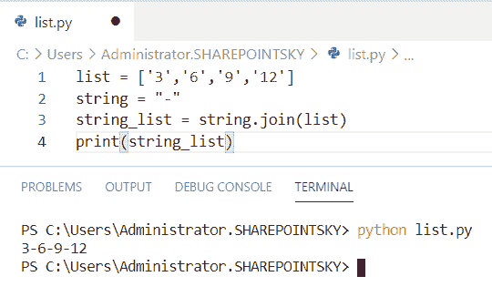

Python concatenate a list of strings with a separator

这就是如何在 Python 中用分隔符连接字符串列表。

查看 [Python 字符串格式化示例](https://pythonguides.com/python-string-formatting/)和 [Python 连接元组示例](https://pythonguides.com/python-concatenate-tuples/)。

## Python 串联了一个字典列表

在这里，我们可以看到**如何在 python 中连接一个字典列表**

*   在这个例子中，我从**集合**中导入了一个名为 `defaultdict` 的模块。默认 dict 是 dict 类的一个子类，它返回 dictionary 对象。
*   在这里，我拿了两本字典作为**字典 1** 、**字典 2** 。for 循环用于连接字典列表。
*   **extend 方法()**将字典中的所有元素添加到列表的末尾。
*   **。items** 返回字典的键值对。为了得到输出，我使用了 `print(dict)` 。

示例:

```py
from collections import defaultdict 
dict1 = [{'roll': ['2243', '1212'], 'number': 1}, {'roll': ['14'], 'number': 2}] 
dict2 = [{'roll': ['473427'], 'number': 2}, {'roll': ['092112'], 'number': 5}] 
dictionary = defaultdict(list) 
for elem in dict1: 
	dictionary[elem['number']].extend(elem['roll']) 
for elem in dict2: 
	dictionary[elem['number']].extend(elem['roll']) 
dict = [{"roll":y, "number":x} for x, y in dictionary.items()] 
print(dict) 
```

我们可以看到字典的**键值**对被连接起来作为输出。您可以参考下面的输出截图。

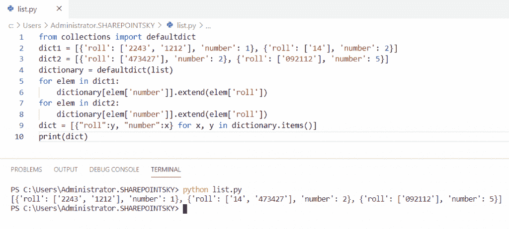

Python concatenate a list of dictionaries

这就是我们如何在 Python 中**连接一个字典列表。**

## Python 串联一个字节列表

现在，我们可以看到**如何在 python 中连接一个字节列表**。

*   在这个例子中，我取了一个字节列表。为了连接一个字节列表，我使用了 **'-'** 分隔符和**。加入()**方法。

示例:

```py
list = [b'Welcome', b'to', b'pythonguides']
print(b'- '.join(list))
```

字节串被连接作为输出。下面的截图显示了输出。

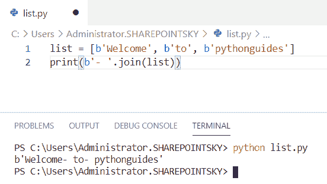

Python concatenate a list of bytes

这就是如何在 Python 中连接一个字节列表。

## Python 将列表连接成字符串

现在，我们可以看到**如何在 python 中将列表连接到字符串**。

*   在这个例子中，我取了一个列表作为**句子= ['welcome '，' to '，' python '，' guides']** 。
*   为了将列表连接成字符串，使用了 `string = ""` 。for 循环用于迭代。
*   `"-"` 用作分隔符。**字符串[:-1]** 表示列表中的最后一个元素。

示例:

```py
sentence = ['welcome','to','python','guides']
string = ""
for i in sentence:
    string += str(i) + "-"
string = string[:-1]
print(string)
```

下面的屏幕截图显示了用分隔符连接的字符串作为输出。您可以参考下面的输出截图。

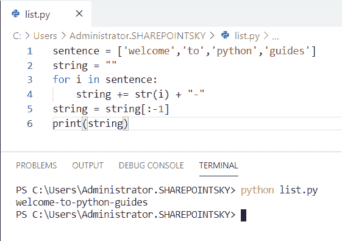

Python concatenate list to string

这样，我们可以用 Python 将列表**连接成字符串。**

## Python 串联了一个数组列表

在这里，我们可以看到**如何在 python 中连接数组列表**。

*   在这个例子中，我导入了一个名为 **numpy 的模块作为 np** 。
*   我取了一个数组列表，a = [[2，4]，[6，8]]，b = [[1，3]，[9，0]]
*   我已经使用了 `np.concatenate` 来连接一个列表。
*   `print(c)` 用于获取输出。

示例:

```py
import numpy as np
a = [[2, 4], [6, 8]]
b = [[1, 3],[9, 0]]
c= np.concatenate((a, b))
print(c)
```

我们可以看到数组的连接列表作为输出。您可以参考下面的输出截图。

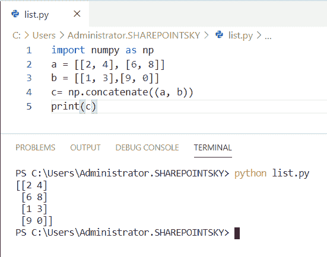

Python concatenates a list of arrays

这就是如何在 Python 中**连接一个数组列表。**

## Python 串联一个整数列表

现在，我们可以看到**如何在 python 中连接一个整数列表**

*   在这个例子中，我取了两个整数列表，分别为 `integers_list1` 、 `integers_list2` 。
*   为了连接一个整数列表，一个空列表被创建为 **newlist = []** 。
*   **extend 方法()**将列表中的所有元素相加，直到结束。
*   为了连接整数列表**，使用了“+”**。
*   `print(newlist)` 用于获取输出。

示例:

```py
integers_list1 = [1,2,3]
integers_list2 = [4,5,6]
newlist = []
newlist.extend(integers_list1)
newlist.extend(integers_list2)
joinedlist = integers_list1 + integers_list2
print(newlist)
```

我们可以看到整数列表被连接起来作为输出。您可以参考下面的输出截图。

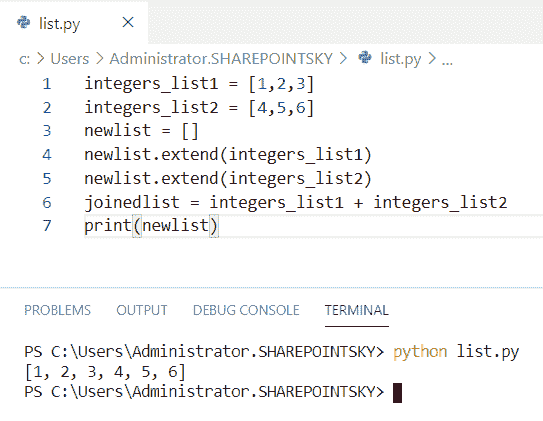

Python concatenate a list of integers

## Python 串联无重复列表

在这里，我们可以看到**如何在 python 中连接没有重复的列表**

*   在这个例子中，我取了两个列表作为**列表 1** 、**列表 2** 。为了连接没有重复的列表，我使用了**set(list 2)–set(list 1)**来找出两个列表之间的差异。
*   通过使用**“+”**运算符，列表和新列表**被**连接。
*   `print(new)` 用于获取新的列表
*   `print(list)` 用于获取输出。

示例:

```py
list1 = [2, 4, 6, 8]
list2 = [2, 2, 5, 5, 5, 6, 6]
new = set(list2) - set(list1)
list = list1 + list(new)
print(new)
print(list)
```

我们可以看到，作为输出，这个列表被连接起来，没有重复。你可以参考下面的截图。

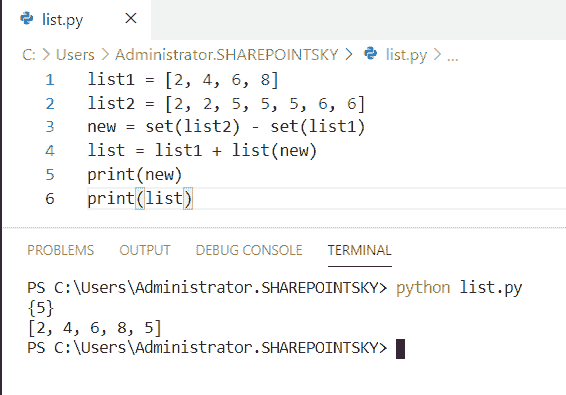

Python concatenate lists without duplicates

这就是如何在 Python 中**连接没有重复的列表。**

## Python 将对象列表连接到字符串

在这里，我们可以看到**如何在 python 中将对象列表连接到字符串**

*   在这个例子中，我定义了一个名为 `Obj` 的类。
*   `__str__(self)` 为 `__str__ method()` 将类对象表示为字符串，list 为 `Obj()` 。
*   加入名单**。使用 join()** 和 `str(x)` 将对象列表转换成一个字符串。
*   for 循环用于迭代，我已经用 `print(string)` 得到输出。

例子

```py
class Obj:
	def __str__(self):
		return 'pythonguides'
list = [Obj(), Obj(), Obj()]
string = ', '.join([str(x) for x in list])
print(string)
```

下面的屏幕截图显示了输出。

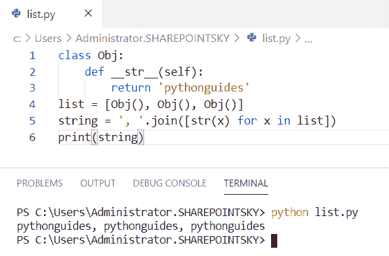

Python join list of objects to string

这是如何在 Python 中将对象列表连接到字符串。

## Python 串联多个列表

现在，我们可以看到**如何在 python 中连接多个列表**

*   在这个例子中，我采用了多个列表，如 list1、list2、list3。*用于解包列表以连接多个列表。
*   `print(list)` 用于获取输出。

示例:

```py
list1 = [1, 5, 8, 70] 
list2 = [22, 26, 47, 68] 
list3 = [25, 65, 28, 78] 
list = [*list1, *list2, *list3] 
print(list) 
```

下面的截图显示了输出。

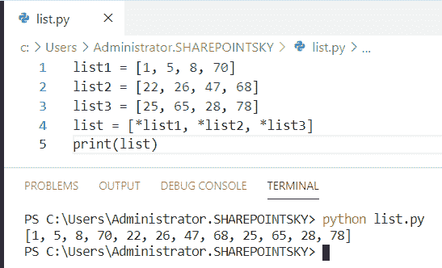

Python concatenate multiple lists

这样，我们可以在 Python 中连接多个列表。

## 合并列表 python 特有的

这里我们可以看到**如何合并 python 中唯一的列表**

*   在这个例子中，我取了两个列表作为 **list1，list2** 。为了连接没有重复的列表，我使用了**set(list 2)–set(list 1)**来找出两个列表之间的差异。
*   通过使用**“+”**运算符，列表和新列表**被**连接。
*   `print(new)` 用于获取新的列表
*   `print(list)` 用于获取输出。

示例:

```py
list1 = [1,3,5,7]
list2 = [2, 2, 5, 5, 5, 6, 6]
new = set(list2) - set(list1)
list = list1 + list(new)
print(new)
print(list)
```

下面的截图显示了输出。

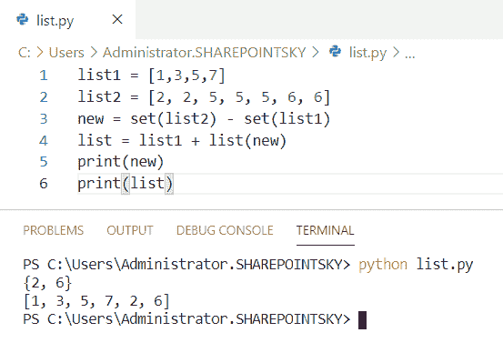

Merge lists python unique

您可能会喜欢以下 Python 教程:

*   [如何在 python 中连接字符串](https://pythonguides.com/concatenate-strings-in-python/)
*   [Python 中的索引和切片](https://pythonguides.com/indexing-and-slicing-in-python/)
*   [Python 串联字典](https://pythonguides.com/python-concatenate-dictionary/)
*   [Python 串联数组](https://pythonguides.com/python-concatenate-arrays/)
*   [Python 逐行读取文件示例](https://pythonguides.com/python-read-a-file-line-by-line/)

在本教程中，我们已经了解了 **Python 连接列表**，并且涵盖了以下主题:

*   Python 用分隔符连接列表元素
*   Python 连接了一系列列表
*   Python 将一系列整数连接成一个字符串
*   Python 连接了元组列表
*   Python 连接了一个 NumPy 数组列表
*   Python 用分隔符连接字符串列表
*   Python 连接了一个字典列表
*   Python 连接了一个字节列表
*   Python 将列表连接成字符串
*   Python 连接了一个数组列表
*   Python 连接了一个整数列表
*   Python 连接没有重复的列表
*   Python 将对象列表连接到字符串
*   Python 连接多个列表
*   合并列表 python 唯一

[Bijay Kumar](https://pythonguides.com/author/fewlines4biju/)

Python 是美国最流行的语言之一。我从事 Python 工作已经有很长时间了，我在与 Tkinter、Pandas、NumPy、Turtle、Django、Matplotlib、Tensorflow、Scipy、Scikit-Learn 等各种库合作方面拥有专业知识。我有与美国、加拿大、英国、澳大利亚、新西兰等国家的各种客户合作的经验。查看我的个人资料。

[enjoysharepoint.com/](https://enjoysharepoint.com/)[](https://www.facebook.com/fewlines4biju "Facebook")[](https://www.linkedin.com/in/fewlines4biju/ "Linkedin")[](https://twitter.com/fewlines4biju "Twitter")