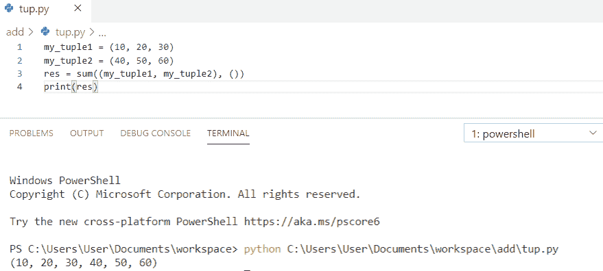
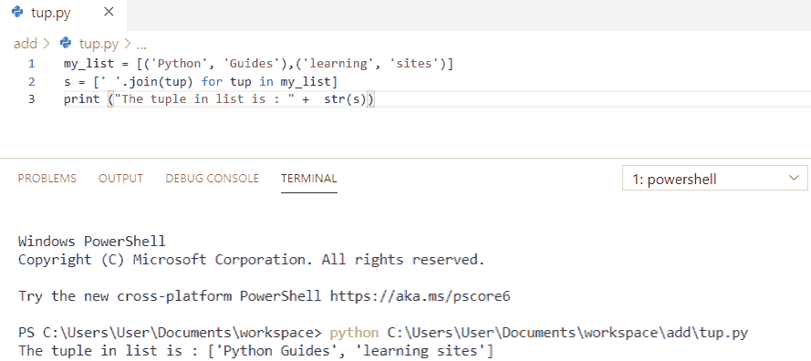
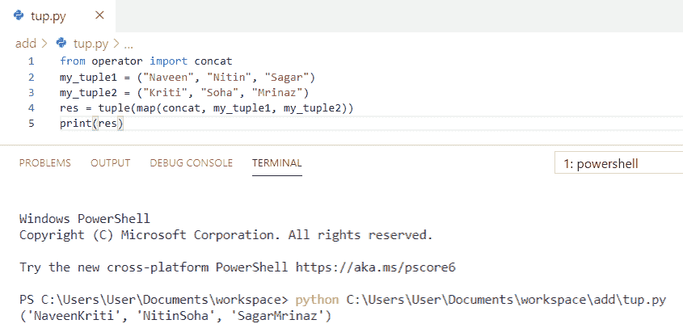
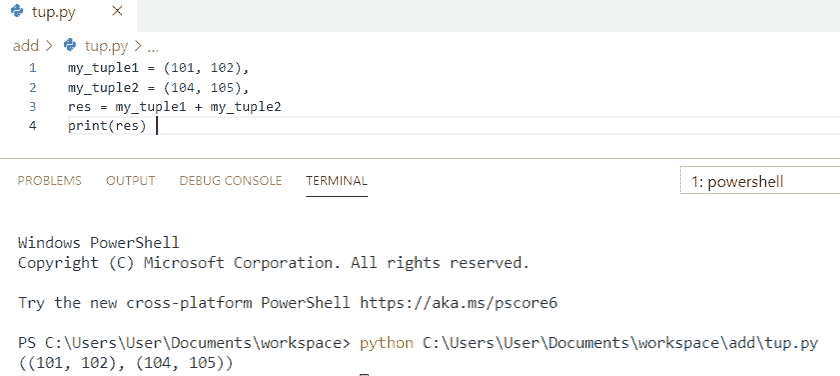
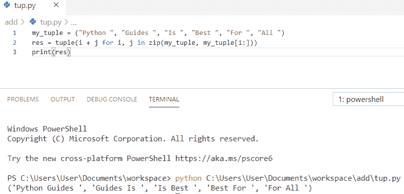

# Python 用例子连接元组

> 原文：<https://pythonguides.com/python-concatenate-tuples/>

[](https://sharepointsky.teachable.com/p/python-and-machine-learning-training-course)

在本 [python 教程中，](https://pythonguides.com/python-hello-world-program/)我们将讨论 **Python 连接元组**，我们还将涵盖以下主题:

*   Python 将元组连接在一个列表中
*   Python 连接元组
*   Python 连接两个元组
*   Python 连接字符串元组
*   Python 将元组连接成嵌套元组
*   Python 连接元组中的连续元素

目录

[](#)

*   [Python 串联元组](#Python_concatenate_tuples "Python concatenate tuples")
*   [Python 将元组串联成一个列表](#Python_concatenate_tuples_in_a_list "Python concatenate tuples in a list")
*   [Python 连接两个元组](#Python_concatenate_two_tuples "Python concatenate two tuples")
*   [Python 串联字符串元组](#Python_concatenate_string_tuples "Python concatenate string tuples")
*   [Python 将元组连接成嵌套元组](#Python_concatenate_tuples_to_nested_tuples "Python concatenate tuples to nested tuples")
*   [Python 串联元组中的连续元素](#Python_concatenate_consecutive_elements_in_tuples "Python concatenate consecutive elements in tuples")

## Python 串联元组

让我们看看如何在 python 中**串联元组` `。**

为了**连接元组**，我们将使用**“sum”**函数，它将连接元组值。

**举例:**

```py
my_tuple1 = (10, 20, 30)
my_tuple2 = (40, 50, 60)
res = sum((my_tuple1, my_tuple2), ()) 
print(res)
```

为了得到输出，我使用了 `print(res)` 。您可以参考下面的输出截图。



Python concatenate tuples

这就是我们在 Python 中连接元组的方式。

*   [在 Python 中创建一个元组](https://pythonguides.com/create-a-tuple-in-python/)
*   [如何用 Python 将两个数相加](https://pythonguides.com/add-two-numbers-in-python/)

## Python 将元组串联成一个列表

这里，我们将看到如何在列表中**连接元组。**

`join()` 函数用于将每个元组元素相互连接，列表理解用于处理通过元组进行迭代的任务。

**举例:**

```py
my_list = [('Python', 'Guides'),('learning', 'sites')]
s = [' '.join(tup) for tup in my_list] 
print ("The tuple in list is : " +  str(s)) 
```

为了得到输出，我使用了`print(`**列表中的元组是:"+ str(s))** )。您可以参考下面的输出截图。



Python concatenate tuples in a list

这就是**如何在 Python** 中串联一个列表中的元组。

你可能还会喜欢， [Python 字符串格式化的例子](https://pythonguides.com/python-string-formatting/)和[如何在 Python 中减去两个数](https://pythonguides.com/subtract-two-numbers-in-python/)。

## Python 连接两个元组

现在，我们将看到 **python 连接两个元组**。

为了**连接两个元组**，我们将在 python 中使用**“+”操作符**来连接。

**举例:**

```py
my_tuple1 = ('New York', 'Texas', 'Houston')
my_tuple2 = ('Chicago', 'California')
res = my_tuple1 + my_tuple2
print(res)
```

为了得到输出，我使用了 `print(res)` 。输出如下所示:

```py
('New York', 'Texas', 'Houston', 'Chicago', 'California')
```

这就是我们如何在 Python 中**连接两个元组。**

阅读:[如何在 Python 中创建元组列表](https://pythonguides.com/list-of-tuples-in-python/)

## Python 串联字符串元组

现在，我们将看到**如何连接字符串元组**。

在这个例子中，我们将使用 `concat` 来扩展连接的逻辑，并且通过使用 **map()来完成映射。**这样，我们将执行 python 连接字符串元组。

**举例:**

```py
from operator import concat  
my_tuple1 = ("Naveen", "Nitin", "Sagar")
my_tuple2 = ("Kriti", "Soha", "Mrinaz")
res = tuple(map(concat, my_tuple1, my_tuple2))  
print(res) 
```

为了得到输出，我使用了 `print(res)` 。您可以参考下面的输出截图。



Python concatenate string tuples

这就是我们如何在 Python 中**连接字符串元组。**

## Python 将元组连接成嵌套元组

在这里，我们将看到如何在 Python 中将元组 **和嵌套元组**连接起来。

为了**将元组连接到嵌套元组**，我们将在元组元素中执行通常的**加法**。为了初始化元组，我们必须在元组后添加一个逗号。

**举例:**

```py
my_tuple1 = (101, 102),
my_tuple2 = (104, 105),
res = my_tuple1 + my_tuple2
print(res) 
```

为了得到输出，我使用了 `print(res)` 。您可以参考下面的输出截图。



Python concatenate tuples to nested tuples

我们在这里检查了，如何在 Python 中**将元组连接成嵌套元组。**

## Python 串联元组中的连续元素

让我们看看如何**连接元组**中的连续元素。

为了**连接元组**中的连续元素，我们将使用**生成器表达式**来提供连接逻辑，并且**“zip()”**用于配对。使用 `tuple()` 将结果转换为元组形式。

**举例:**

```py
my_tuple = ("Python ", "Guides ", "Is ", "Best ", "For ", "All ")  
res = tuple(i + j for i, j in zip(my_tuple, my_tuple[1:])) 
print(res)
```

为了得到输出，我使用了 `print(res)` 。您可以参考下面的输出截图。



Python concatenate consecutive elements in tuples

这就是我们如何在 Python 中**连接元组中的连续元素。**

您可能会喜欢以下 Python 教程:

*   [如何在 python 中连接字符串](https://pythonguides.com/concatenate-strings-in-python/)
*   [Python 中熊猫缺失数据](https://pythonguides.com/missing-data-in-pandas/)
*   [Python 串联字典](https://pythonguides.com/python-concatenate-dictionary/)
*   [Python 串联数组](https://pythonguides.com/python-concatenate-arrays/)
*   [Python Tkinter 拖拽](https://pythonguides.com/python-tkinter-drag-and-drop/)

在本教程中，我们已经了解了 **Python 连接元组**，并且我们已经涵盖了以下主题:

*   Python 将元组连接在一个列表中
*   Python 连接元组
*   Python 连接两个元组
*   Python 连接字符串元组
*   Python 将元组连接成嵌套元组
*   Python 连接元组中的连续元素

[Bijay Kumar](https://pythonguides.com/author/fewlines4biju/)

Python 是美国最流行的语言之一。我从事 Python 工作已经有很长时间了，我在与 Tkinter、Pandas、NumPy、Turtle、Django、Matplotlib、Tensorflow、Scipy、Scikit-Learn 等各种库合作方面拥有专业知识。我有与美国、加拿大、英国、澳大利亚、新西兰等国家的各种客户合作的经验。查看我的个人资料。

[enjoysharepoint.com/](https://enjoysharepoint.com/)[](https://www.facebook.com/fewlines4biju "Facebook")[](https://www.linkedin.com/in/fewlines4biju/ "Linkedin")[](https://twitter.com/fewlines4biju "Twitter")