# Python 将二进制转换为十进制+ 15 个示例

> 原文：<https://pythonguides.com/python-convert-binary-to-decimal/>

[](https://sharepointsky.teachable.com/p/python-and-machine-learning-training-course)

在本 [Python 教程](https://pythonguides.com/python-hello-world-program/)中，我们将学习在 Python 中**将二进制数转换为十进制数的各种方法。我们将讨论一些内置方法，并创建我们自己的将二进制字符串转换成十进制字符串的方法。**

*   如何在 Python 中将二进制字符串转换成十进制
*   将二进制转换为整数的 Python 程序
*   Python 将二进制转换为浮点数
*   Python 程序将二进制转换为八进制
*   Python 中的二进制到十进制，没有内置函数
*   Python 中的二进制字符串到十进制字符串，没有内置函数
*   使用 while 循环将二进制转换为十进制的 Python 程序
*   使用递归将二进制转换为十进制的 Python 程序
*   Python 程序将二进制转换为十六进制
*   使用 while 循环将二进制转换为十六进制的 Python 程序
*   将二进制转换为 ASCII 的 Python 程序
*   将二进制列表转换为十进制 Python
*   Python 程序将十进制转换为二进制，反之亦然
*   Python 程序将二进制转换为十进制、八进制和十六进制

目录

[](#)

*   [如何在 Python 中将二进制字符串转换成十进制](#How_to_convert_binary_string_to_decimal_in_Python "How to convert binary string to decimal in Python")
*   [Python 程序将二进制转换为整数](#Python_program_to_convert_binary_to_integer "Python program to convert binary to integer")
*   [Python 将二进制转换成浮点数](#Python_convert_binary_to_float "Python convert binary to float")
*   [Python 程序将二进制转换为八进制](#Python_program_to_convert_binary_to_octal "Python program to convert binary to octal")
    *   [例 1:取二进制字符串输入，使用内置函数进行转换](#Example_1_Taking_binary_string_input_and_use_the_in-built_functions_for_conversion "Example 1: Taking binary string input and use the in-built functions for conversion")
    *   [例 2:取一个二进制数，用我们自己的逻辑进行转换。](#Example_2_Taking_a_binary_number_and_using_our_own_logic_for_conversion "Example 2: Taking a binary number and using our own logic for conversion.")
*   [没有内置函数的 Python 中的二进制到十进制](#Binary_to_decimal_in_Python_without_inbuilt_function "Binary to decimal in Python without inbuilt function")
*   [没有内置函数的 Python 中二进制字符串到十进制的转换](#Binary_string_to_decimal_in_Python_without_inbuilt_function "Binary string to decimal in Python without inbuilt function")
*   [使用 while 循环将二进制转换为十进制的 Python 程序](#Python_program_to_convert_binary_to_decimal_using_while_loop "Python program to convert binary to decimal using while loop")
*   [使用递归将二进制转换为十进制的 Python 程序](#Python_program_to_convert_binary_to_decimal_using_recursion "Python program to convert binary to decimal using recursion")
*   [Python 程序将二进制转换成十六进制](#Python_program_to_convert_binary_to_hexadecimal "Python program to convert binary to hexadecimal")
*   [Python 程序使用 while 循环将二进制转换为十六进制](#Python_program_to_convert_binary_to_hexadecimal_using_while_loop "Python program to convert binary to hexadecimal using while loop")
*   [Python 程序将二进制转换成 ASCII 码](#Python_program_to_convert_binary_to_ASCII "Python program to convert binary to ASCII")
*   [将二进制列表转换成十进制 Python](#Convert_binary_list_to_decimal_Python "Convert binary list to decimal Python")
*   [Python 程序将十进制转换为二进制，反之亦然](#Python_program_to_convert_decimal_to_binary_and_vice_versa "Python program to convert decimal to binary and vice versa")
*   [Python 程序将二进制转换为十进制八进制和十六进制](#Python_program_to_convert_binary_to_decimal_octal_and_hexadecimal "Python program to convert binary to decimal octal and hexadecimal")

## 如何在 Python 中将二进制字符串转换成十进制

让我们借助一个例子来理解这种转换背后的逻辑。

考虑二进制数: `1011`

现在，我们将从单位的位置开始，将每个单个数字乘以 2 的倍数。然后我们将所有的结果值相加。计算结果如下:

小数= 1 * 2³+0 * 2²+1 * 2¹+1 * 2⁰，

相当于 8 + 0 + 2 + 1 = `11`

在 Python 中，可以用多种方法将二进制字符串转换成十进制字符串。可以使用 int()或 float()函数分别将二进制字符串转换为整数或浮点数。

另一种方法是使用我们自己的逻辑创建一个 Python 程序。我们将使用我们在上面的解释中看到的逻辑。

阅读 [Python 检查变量是否为数字](https://pythonguides.com/python-check-if-a-variable-is-a-number/)

## Python 程序将二进制转换为整数

首先，让我们用 Python 中的 `int()` 函数将二进制字符串转换成整数。以下是将二进制字符串转换为整数的简单 Python 程序:

```py
number= input('Enter a Binary number:')
dec_number= int(number, 2)
print('The decimal conversion is:', dec_number)
print(type(dec_number))
```

*   在上面的程序中，我们接受一个字符串输入。这个字符串应该是一个二进制数。
*   其次，我们使用了 `int()` 函数，并将二进制字符串传递给这个函数。
*   第二个参数，即 `2` 表示我们正在转换一个二进制数。现在让我们看看输出。

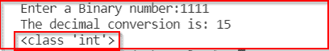

Binary to int conversion

*   您可以看到，该数字被转换为十进制，数据类型为 `int` ，即整数。

这样，您可以使用内置函数将二进制字符串转换为整数。

读取[检查 Python 中的 NumPy 数组是否为空](https://pythonguides.com/check-if-numpy-array-is-empty/)

## Python 将二进制转换成浮点数

让我们看一个 **Python 程序将二进制字符串转换成浮点数**。在这个例子中，我们将使用 `float()` 方法。

```py
number= input('Enter a Binary number:')
int_number= int(number, 2)
float_number= float(int_number)
print('The float conversion is:', float_number)
print(type(float_number))
```

*   不能使用 `float()` 函数将二进制字符串直接转换为浮点值。我们可以使用 int()函数将二进制字符串转换为整数，然后使用 `float()` 函数将数据类型转换为 `float` 。

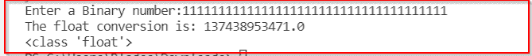

Binary to float conversion

阅读 [Python 从字符串中移除子串+示例](https://pythonguides.com/python-remove-substring-from-a-string/)

## Python 程序将二进制转换为八进制

有多种方法可以将二进制数转换成八进制数。我将展示这种转换的各种例子。

### **例 1:** 取二进制字符串输入并使用内置函数进行转换

```py
binary_num= input('Enter a binary to convert into octal:')
decimal_num= int(binary_num, 2)
octal_num = oct(decimal_num)
print('Octal number representation is:', octal_num)
```

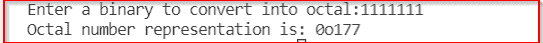

Binary to octal conversion using the in-built functions

这是将二进制字符串转换成八进制数的最简单的方法。让我们看另一个例子。

### **例二:**取一个二进制数，用我们自己的逻辑进行转换。

在 Python 中，如果要把二进制数转换成八进制数，就得先把二进制数转换成十进制数，再把这个十进制数转换成八进制数。

```py
# Taking user input
binary_num = input("Enter the Binary Number: ")
dec_num = 0
oct_num=0
m = 1

# Converting binary into decimal
for digit in binary_num:
    digit= int(digit)
    dec_num = dec_num + (digit * m)
    m = m * 2

# Converting decimal into octal
m = 1 
while (dec_num != 0):
    oct_num += (dec_num % 8) * m;
    dec_num = int(dec_num/8)
    m *= 10;

print("Equivalent Octal Value = ", oct_num)
```

*   在上面的程序中，我们使用了 for 循环将二进制转换成十进制。
*   然后我们使用 while 循环将十进制转换成八进制。
*   为了将一个数从十进制转换成八进制，我们不断地将一个数除以 8，并在每次除法运算后收集所有的余数，直到这个数变为零。
*   然后，这些余数被放置在它们各自的位置，即从单元的位置开始。

*   让我们看一个例子。考虑二进制数 `11111` ，它在十进制中相当于 31。
    *   31 可以写成 `31 = 8 * 3 + 7` 。余数即 `7` 将是八进制数的一位数字。
    *   商即 `3` 是我们的新数，可以写成: **3 = 8 * 0 +3，**剩下 `3` 作为余数。这个余数，即 `3` 将是十的数字。
*   商变成了 `0` 。因此，我们将在这里停止，得到的八进制数将是 `37` 。

因此，您可能已经学习了如何使用 Python 中的各种方法将二进制转换为八进制。

阅读 [Python 3 的 string replace()方法](https://pythonguides.com/python-3-string-replace/)

## 没有内置函数的 Python 中的二进制到十进制

在本节中，您将学习如何**将二进制字符串转换成十进制，而不使用 Python** 中的任何内置函数。我们将实现自己的逻辑来执行这项任务。看下面这个 Python 程序。

```py
binary_num = int(input("Enter the Binary Number: "))
dec_num = 0
m = 1
length = len(str(binary_num))

for k in range(length):
    reminder = binary_num % 10
    dec_num = dec_num + (reminder * m)
    m = m * 2
    binary_num = int(binary_num/10)

print("Equivalent Decimal Value = ", dec_num)
```

让我解释程序的一些部分。

*   `dec_num` 是我们将得到的结果的十进制数。最初，它的值为零。
*   循环内的 `m` 变量是每次循环后 2 的指数项的值。
*   我们将二进制数的每一位乘以 m 的值。
*   最后，将所有乘以 2 的乘方后的值相加，我们将得到最终结果。

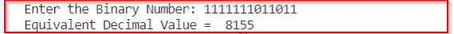

Binary number to decimal conversion

因此，您可能已经学会了如何在不使用 Python 中任何内置函数的情况下将二进制数转换为十进制数。

还有一些其他的替代方法。您将在接下来的章节中找到它们。

此外，查看 [Python 3 string 方法示例](https://pythonguides.com/string-methods-in-python/)

## 没有内置函数的 Python 中二进制字符串到十进制的转换

在上一节中，我们用 Python 将二进制数字数据类型转换成了十进制。这一次，我们将把二进制字符串转换成十进制，即输入将是一个字符串。

```py
binary_num = input("Enter the Binary Number: ")
dec_num = 0
m = 1

for digit in binary_num:
    digit= int(digit)
    dec_num = dec_num + (digit * m)
    m = m * 2

print("Equivalent Decimal Value = ", dec_num)
```

*   在上面的程序中，我们接受二进制字符串输入，并使用 for 循环对其进行迭代。
*   在循环内部，我们将每个二进制字符转换成整数数据类型。
*   之后，我们将二进制数字乘以 2 的指数值的后续项。
*   最后，我们将结果值相加并存储在一个变量中。

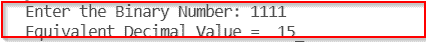

Binary string to decimal conversion

因此，您可能已经学会了如何在不使用 Python 中任何内置函数的情况下将二进制字符串转换为十进制字符串。

阅读 [Python 比较字符串](https://pythonguides.com/python-compare-strings/)

## 使用 while 循环将二进制转换为十进制的 Python 程序

在本节中，您将看到一个使用 while 循环将二进制数转换为十进制数的 Python 程序。Python 程序编写如下:

```py
def BinaryToDecimal(num):
    expo =1
    dec_num= 0
    while(num):
        digit = num % 10
        num = int(num / 10)

        dec_num += digit * expo
        expo = expo * 2
    return dec_num

# Taking user input
num = int(input('Enter a binary number: '))

# Displaying Output
print('The decimal value is =', BinaryToDecimal(num))
```

*   在上面的 Python 程序中，我们创建了一个使用 while 循环将二进制数转换为十进制数的函数。
*   然后，我们接受用户输入，并将该输入传递给函数，同时通过 print 语句显示结果。
*   让我们给出一个样本输入并检查我们的程序。

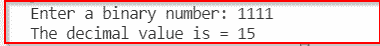

Binary to decimal conversion using the while loop

因此，通过这种方式，您可以使用 Python 中的 while 循环将二进制数转换为十进制数。

读取 [Python 在字符串](https://pythonguides.com/python-find-substring-in-string/)中查找子串

## 使用递归将二进制转换为十进制的 Python 程序

在 Python 中，还可以使用递归技术将二进制数转换成十进制数。我将用一个例子来说明这一点。

递归是一种技术，在这种技术中，一个函数在它的主体内部为特定的条件调用它自己。如果条件满足，它将调用自己。否则，程序将终止。

以下是使用递归方法将二进制数转换为十进制数的 Python 程序:

```py
# Defining the function
def BinaryToDecimal(num, expo=1):
    if num== 0:
        return 0
    else:
        digit= num % 10
        num= int(num / 10)
        digit= digit * expo
        return digit + BinaryToDecimal(num, expo * 2)

# Taking user input
num = int(input('Enter a binary number: '))

# Displaying Output
print('The decimal value is =', BinaryToDecimal(num))
```

*   在上面的程序中，我们定义了一个带两个参数的函数，即一个二进制数和 2 的指数值。
*   最初，指数值将为 1(即 2 ⁰ )。
*   我们已经指定了一个条件，如果函数变为零，它将不再调用自己。
*   然后，我们将分离二进制数的最后一位，将其乘以当前的指数项 2，并用递归调用的函数返回其和。
*   这一次，我们将把不带最后一位的二进制数和下一个指数项 2 传递给被调用的函数。

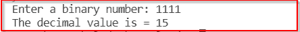

Binary to decimal conversion using recursion

简单来说，这个函数每次都会返回一个十进制数，在所有执行结束时，这些十进制数会被相加，我们就会得到计算出来的十进制数。

另请参阅，[无法将字符串转换为浮点 Python](https://pythonguides.com/could-not-convert-string-to-float-python/)

## Python 程序将二进制转换成十六进制

在本节中，您将学习如何用 Python 将二进制数转换成十六进制数。

首先，你必须把二进制数转换成十进制数。然后你可以把这个十进制数转换成十六进制数。

您可以使用内置函数简单地将二进制数转换为十六进制数。下面是您可以使用的 Python 代码片段。

```py
# Taking binary input from user
binary_num = input('Enter a binary number: ')

# Converting the binary input into decimal
dec_num = int(binary_num, 2)

# Converting the decimal number into hexadecimal
hex_num= hex(dec_num)
print('Hexadecimal representation of this binary number is :', hex_num)
```

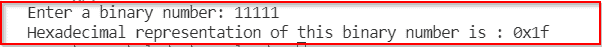

Binary to hexadecimal conversion

因此，通过这种方式，你可以在 Python 中将二进制数转换成十进制数。

读取 Python 中的[切片字符串](https://pythonguides.com/slicing-string-in-python/)

## Python 程序使用 while 循环将二进制转换为十六进制

在本例中，我将使用 Python 中的 while 循环，使用用户定义的函数将二进制输入转换为十六进制。

这种方法与我们上面讨论的将二进制数转换成八进制数的方法相同。首先，我们将二进制数转换成十进制数，然后将这个十进制数转换成十六进制数。

我们将定义一个十六进制字符列表，并在每次迭代后将余数从十进制转换为十六进制时用这个列表进行映射。

```py
def convertToHex(binary_num):
    # Converting binary into decimal
    dec_num = 0
    m = 1
    for digit in binary_num:
        digit= int(digit)
        dec_num = dec_num + (digit * m)
        m = m * 2
    # defining the list of hexadecimal characters
    hex_table = ['0', '1', '2', '3', '4', '5', '6', '7', '8', '9', 'A' , 'B', 'C', 'D', 'E', 'F']

    # converting decimal into hexadecimal
    hexadecimal = ''
    while(dec_num > 0):
        remainder = dec_num % 16
        hexadecimal = hex_table[remainder]+ hexadecimal
        dec_num = dec_num//16

    return hexadecimal

#Calling the function
print('The hexadecimal representation of the bianry is: ', convertToHex('11100111101'))
```


Binary to hexadecimal conversion

这样，您可以使用 Python 中的 while 循环将二进制数转换为十六进制数。

阅读[从 PDF Python 中提取文本](https://pythonguides.com/extract-text-from-pdf-python/)

## Python 程序将二进制转换成 ASCII 码

在本节中，您将了解 Python 中与二进制和 ASCII 值相关的各种转换。我将解释一些例子，在这些例子中，您将了解这些类型的转换的各种用例。

假设你有一个二进制的字符串，你想把它转换成 ASCII 值。让我们首先使用 Python 程序创建一个二进制字符串。

```py
message = "hello world"
binary_text= ' '.join(format(ord(x), 'b') for x in message)
print(binary_text)
```

上面的代码将为我们的消息创建一个二进制字符串，在特定字母字符的每个二进制字符串之间有一个空格。生成的二进制字符串将是:

```py
1101000 1100101 1101100 1101100 1101111 100000 1110111 1101111 1110010 1101100 1100100
```

现在让我们将这些二进制字符串转换成它们相应的 ASCII 值。

```py
binary_text = '1101000 1100101 1101100 1101100 1101111 100000 1110111 1101111 1110010 1101100 1100100'
binary_values = binary_text.split()
list1 = []
for i in binary_values:
    list1.append(int(i, 2))
print(list1)
```

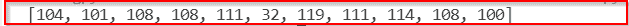

Binary to ASCII conversion

我们使用 int()函数将二进制值转换成相应的 ASCII 值。

因此，通过这种方式，您可以在 Python 中将二进制字符串转换为 ASCII。

阅读 [PdfFileWriter Python 示例(20 个示例)](https://pythonguides.com/pdffilewriter-python-examples/)

## 将二进制列表转换成十进制 Python

在这一节。我将解释一个例子，在这个例子中，我将创建一个二进制数的列表，并用 Python 将它们转换成小数。看看下面的代码:

```py
binary_list = ['1011', '10101', '1101', '11111', '11100011']
decimal_list= (int(element, 2) for element in binary_list)
for element in decimal_list:
    print(element)
```

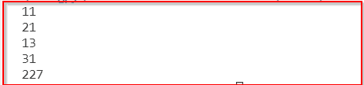

Conversion of a binary list into decimal

此外，如果您有一个包含整数数据类型的二进制小数的列表，您必须将元素转换为字符串数据类型。例如:

```py
binary_list = [1011, 110110, 110111111, 1100011, 1010101]
decimal_list= (int(str(element), 2) for element in binary_list)
for element in decimal_list:
    print(element)
```

在上面的例子中，您可以看到列表中的元素是整数数据类型。因此，在将它们转换成十进制之前，我们必须将它们转换成字符串。

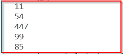

Conversion of a binary list into decimal

因此，您可能已经学习了如何在 Python 中将二进制列表转换成小数。

在 Python 中读取[转换字符串为浮点数](https://pythonguides.com/convert-string-to-float-in-python/)

## Python 程序将十进制转换为二进制，反之亦然

现在让我们创建一个 Python 程序，它将十进制数转换成二进制数，也将二进制数转换成十进制数。

我将使用内置函数进行转换。 `int()` 函数可用于将二进制字符串转换为十进制，而 `bin()` 函数可用于将十进制数转换为二进制。

```py
def binToDeci():
    binary_num = input('Enter a binary string:')
    dec_num = int(binary_num, 2)
    return dec_num

def deciToBin():
    dec_num = int(input('Enter a decimal number:'))
    binary_num= bin(dec_num).replace('0b', '')
    return binary_num

print('''Enter 1 for Binary to decimal conversion
Enter 2 for Decimal to Binary conversion ''')
choice = int(input('Enter your choice: '))

if choice == 1:
    print('Decimal conversion of the binary number is:', binToDeci())
elif choice == 2:
    print('Binary represntation of the decimal number is:', deciToBin())
else:
    print('Invalid Choice')
```

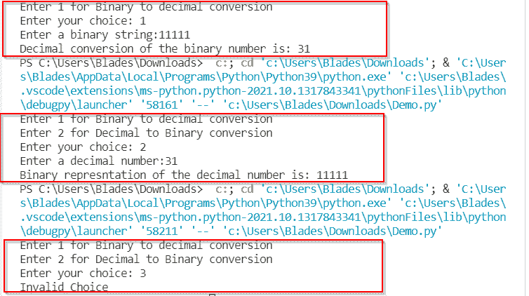

Output in call test cases

使用这个 Python 程序，您可以将任何十进制数转换成二进制数，反之亦然。

阅读[将 float 转换为 int Python +示例](https://pythonguides.com/convert-float-to-int-python/)

## Python 程序将二进制转换为十进制八进制和十六进制

在本节中，您将看到一个 Python 程序，它将二进制数作为用户输入，并返回等价的十进制、八进制和十六进制数。

```py
def binToDeci(binary_num):
    dec_num = int(binary_num, 2)
    return dec_num

def binToOct(binary_num):
    dec_num = int(binary_num, 2)
    oct_num= oct(dec_num)
    return oct_num

def binToHex(binary_num):
    dec_num = int(binary_num, 2)
    hex_num= hex(dec_num)
    return hex_num

binary_num = input('Enter a binary string:')
print('Decimal representation of the binary number is:', binToDeci(binary_num))
print('Octal representation of the binary number is:', binToOct(binary_num))
print('Hexadecimal representation of the binary number is:', binToHex(binary_num)) 
```

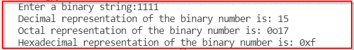

Converting binary to various number systems

数字前的 `0o` 表示该数字是八进制的， `0x` 表示该数字是十六进制的。如果不希望它们出现在输出中，可以使用 replace()函数，如下所示:

```py
def binToDeci(binary_num):
    dec_num = int(binary_num, 2)
    return dec_num

def binToOct(binary_num):
    dec_num = int(binary_num, 2)
    oct_num= oct(dec_num).replace('0o', '')
    return oct_num

def binToHex(binary_num):
    dec_num = int(binary_num, 2)
    hex_num= hex(dec_num).replace('0x', '')
    return hex_num

binary_num = input('Enter a binary string:')
print('Decimal representation of the binary number is:', binToDeci(binary_num))
print('Octal representation of the binary number is:', binToOct(binary_num))
print('Hexadecimal representation of the binary number is:', binToHex(binary_num)) 
```

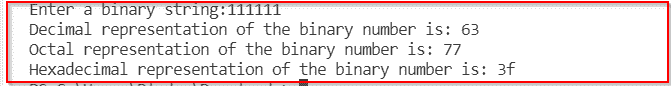

Output using the replace() function

您可能会喜欢以下 Python 教程:

*   [Python 统计文件中的字数](https://pythonguides.com/python-count-words-in-file/)
*   [将元组列表转换为 Python 中的字符串](https://pythonguides.com/convert-list-of-tuples-to-string-in-python/)
*   [Python 中的 Case 语句](https://pythonguides.com/case-statement-in-python/)
*   [在 python 中反转一个列表](https://pythonguides.com/reverse-a-list-in-python/)
*   [获取字典 Python 中的第一个键](https://pythonguides.com/get-first-key-in-dictionary-python/)
*   [Python 字典增量值](https://pythonguides.com/python-dictionary-increment-value/)
*   [Python Tkinter Spinbox](https://pythonguides.com/python-tkinter-spinbox/)

这样，您可以创建一个 **Python 程序，将二进制数转换成十进制**、八进制和十六进制数。

*   如何在 Python 中将二进制字符串转换成十进制
*   将二进制转换为整数的 Python 程序
*   Python 将二进制转换为浮点数
*   Python 程序将二进制转换为八进制
*   Python 中的二进制到十进制，没有内置函数
*   Python 中的二进制字符串到十进制字符串，没有内置函数
*   使用 while 循环将二进制转换为十进制的 Python 程序
*   使用递归将二进制转换为十进制的 Python 程序
*   Python 程序将二进制转换为十六进制
*   使用 while 循环将二进制转换为十六进制的 Python 程序
*   将二进制转换为 ASCII 的 Python 程序
*   将二进制列表转换为十进制 Python
*   Python 程序将十进制转换为二进制，反之亦然
*   Python 程序将二进制转换为十进制、八进制和十六进制

[Bijay Kumar](https://pythonguides.com/author/fewlines4biju/)

Python 是美国最流行的语言之一。我从事 Python 工作已经有很长时间了，我在与 Tkinter、Pandas、NumPy、Turtle、Django、Matplotlib、Tensorflow、Scipy、Scikit-Learn 等各种库合作方面拥有专业知识。我有与美国、加拿大、英国、澳大利亚、新西兰等国家的各种客户合作的经验。查看我的个人资料。

[enjoysharepoint.com/](https://enjoysharepoint.com/)[](https://www.facebook.com/fewlines4biju "Facebook")[](https://www.linkedin.com/in/fewlines4biju/ "Linkedin")[](https://twitter.com/fewlines4biju "Twitter")