# Python 将数据帧转换为列表

> 原文：<https://pythonguides.com/python-convert-dataframe-to-list/>

[](https://sharepointsky.teachable.com/p/python-and-machine-learning-training-course)

在这个 Python 教程中，我们将学习如何使用 Python 将熊猫数据帧转换成列表。此外，我们将涵盖这些主题。

*   Python 将数据帧转换成字典列表
*   Python 将数据帧转换为列表列表
*   Python 将数据帧转换成元组列表
*   Python 将数据帧转换为 2d 列表
*   Python 将数据帧转换成 scala 列表
*   将数据帧转换为嵌套列表
*   Python 将数据帧转换为字符串列表
*   Python 将数据帧转换为 json 列表
*   Python 将数据帧转换为列列表
*   Python 将数据帧转换为序列列表
*   Python 将数据帧转换为不带索引的列表
*   Python 将列表转换为带标题的熊猫数据帧

目录

[](#)

*   [Python 将数据帧转换为列表](#Python_convert_DataFrame_to_list "Python convert DataFrame to list")
    *   [通过使用 df.values.tolist()](#By_using_dfvaluestolist "By using df.values.tolist()")
    *   [通过使用 iloc 方法](#By_using_iloc_method "By using iloc method")
*   [Python 将数据帧转换成字典列表](#Python_convert_Dataframe_to_list_of_dictionaries "Python convert Dataframe to list of dictionaries")
*   [Python 将数据帧转换为列表列表](#Python_convert_DataFrame_to_list_of_lists "Python convert DataFrame to list of lists")
*   [Python 将数据帧转换成元组列表](#Python_convert_DataFrame_to_list_of_tuples "Python convert DataFrame to list of tuples")
*   [Python 将数据帧转换为列表 2d 列表](#Python_convert_DataFrame_to_list_2d_list "Python convert DataFrame to list 2d list")
*   [Python 将数据帧转换为嵌套列表 Python](#Python_convert_DataFrame_to_nested_list_Python "Python convert DataFrame to nested list Python")
*   [Python 将数据帧转换成字符串列表](#Python_convert_DataFrame_to_list_of_strings "Python convert DataFrame to list of strings")
*   [Python 将数据帧转换为 JSON 列表](#Python_convert_DataFrame_to_list_of_JSON "Python convert DataFrame to list of JSON")
*   [Python 将数据帧转换为列列表](#Python_convert_DataFrame_to_list_of_Columns "Python convert DataFrame to list of Columns")
*   [Python 将数据帧转换为序列列表](#Python_convert_DataFrame_to_list_of_Series "Python convert DataFrame to list of Series")
*   [Python 将数据帧转换成不带索引的列表](#Python_convert_DataFrame_to_list_without_index "Python convert DataFrame to list without index")
*   [Python 将列表转换为熊猫数据帧转换为标题](#Python_convert_list_to_Pandas_DataFrame_to_header "Python convert list to Pandas DataFrame to header")

## Python 将数据帧转换为列表

*   在这个程序中，我们将讨论如何在 Python 中将 Pandas 数据帧转换成列表。
*   在 Python 中，数据帧就像是行和列形式的数据结构，如果你想存储数据，你可以很容易地使用数据帧的概念。而 Python 列表也用于存储数据。
*   让我们讨论并看看如何将数据帧转换为列表。将 DataFrame 转换为 list 的方法有很多。
    *   通过使用 df.values.tolist()
    *   通过使用 iloc 方法
    *   通过使用 df。Series.tolist()

> **注:** 首先我们要用 Python 中的 Pandas 模块创建一个 DataFrame。要创建一个 DataFrame，首先，我们需要存储 list 的特定数据，所以现在我们将创建一个字典，其中 key 元素是列名，value 元素是值列表。

另外，请阅读[如何在 Python Pandas](https://pythonguides.com/set-column-as-index-in-python-pandas/) 中将列设置为索引

### 通过使用 df.values.tolist()

该方法将帮助用户将数据帧的数据项转换成列表。让我们在一个例子中使用这个方法，并检查我们将如何在 Pandas 中使用 `tolist()` 函数。

**举例:**

```py
import pandas as pd

employee_info = {'emp_name':['Chris', 'Adam', 'Oliva', 'Elijah' ] ,
		'emp_id': [68,39,118,724] }

new_df = pd.DataFrame(employee_info)

d = new_df['emp_name'].tolist()
print("Convert dataframe to list:",d) 
```

在上面的代码中，我们使用了 **pd。Dataframe()** 函数从字典中声明数据帧，然后使用 `tolist()` 函数将数据帧转换为包含列 **'emp_name '的所有行的列表。**一旦你将打印**‘d’**，那么输出将以列表的形式显示。

下面是以下给定代码的执行过程

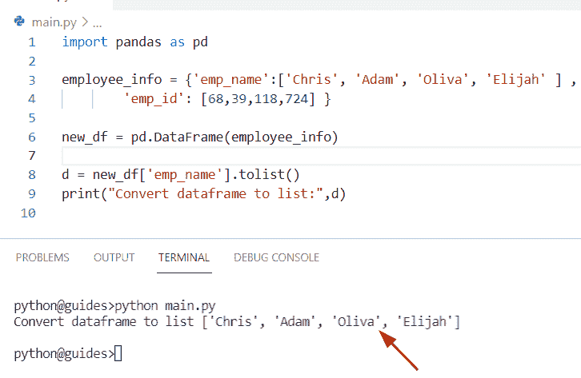

Python Convert Dataframe to list

### 通过使用 iloc 方法

在这里，我们可以看到如何使用 iloc 方法将列转换为列表。Python 提供了一个方法 **DataFrame。iloc()** 当 DataFrame 和的索引标签总是返回一个整数位置时使用这个方法。

**语法:**

下面是 DataFrame.iloc 方法的语法

```py
Pandas.DataFrame.iloc[]
```

> **注**:iloc 按行号选择数据

**源代码:**

```py
import pandas as pd

new_dictionary = {
    'Country_name': ['Germany', 'Australia', 'France','England'],
    'Values': [843,290,179,926],
    'City':['paris','Japna','Kenya','Newzealand']

}
z = pd.DataFrame(new_dictionary)
print(z)
m = z.iloc[:, 0].tolist()
u = z.iloc[:, 1].tolist()
w = z.iloc[:, 2].tolist()
print("list of val:",m)
print("list of val:",u)
print("list of val:",w)
```

下面是以下给定代码的执行过程

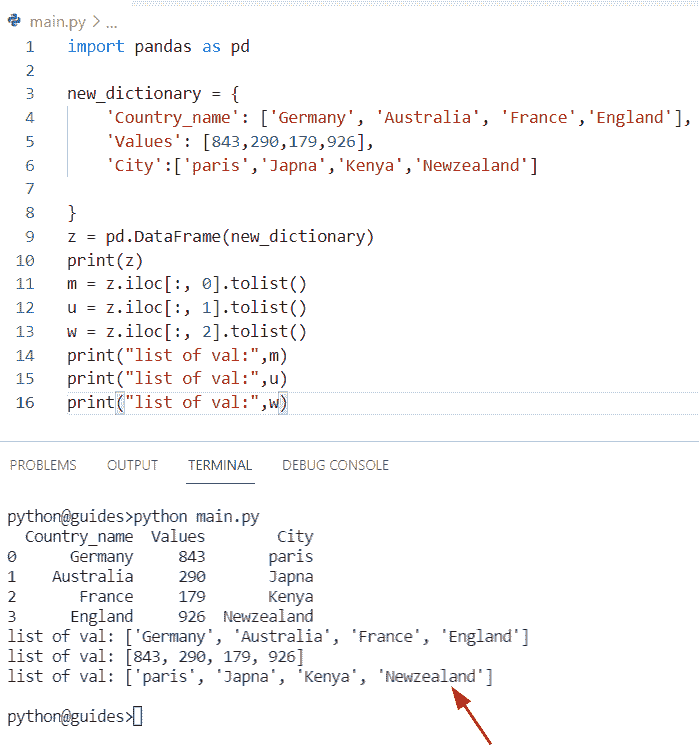

Python Convert Dataframe to list

这是如何将一个数据帧转换成一个列表。

阅读: [Python 将字典转换为数组](https://pythonguides.com/python-convert-dictionary-to-an-array/)

## Python 将数据帧转换成字典列表

*   让我们看看如何使用 `df.to_dict()` 方法将数据帧转换成字典列表。
*   在 Python **中，DataFrame.to_dict()** 方法用于将数据帧转换成字典列表。让我们举个例子，首先创建一个数据帧，它有三列**‘学生姓名’，‘学生 id’**和**‘学生地址’**。

**语法:**

下面是 df.to_dict 的语法

```py
DataFrame.to_dict(orient='dict',into)
```

> **注意:** 在这个例子中，我们已经在 `df.to_dict()` 方法中传递了**【记录】**作为参数。在 Python 中，记录方向定义了转换列的类型，并且每个列都是一个字典。

**源代码:**

```py
import pandas as pd

df = pd.DataFrame({'student_name': ['Hayden', 'Mathew','James','George'],
                   'student_id': [854,778,290,160],
                  'Student_address':['China', 'Moscow','Russia','France']})
print("Display dataframe:",df)
b = df.to_dict('records')
print("Convert Dataframe to list of dictionaries:",b)
```

在上面的代码中，我们必须将 orient 改为 records，它将返回字典列表，每个字典存储单独的行。

你可以参考下面的截图

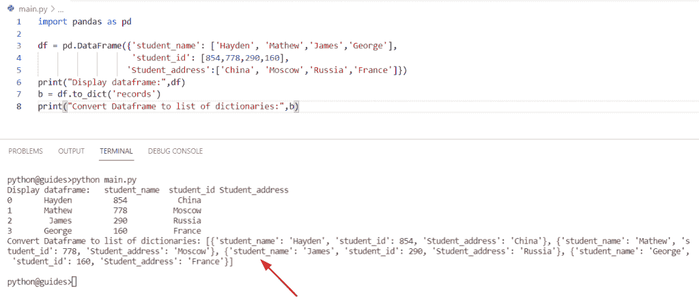

Python Convert DataFrame to list of dictionaries

这就是如何将一个数据帧转换成一个字典列表。

阅读: [Python 将字典转换为列表](https://pythonguides.com/python-convert-dictionary-to-list/)

## Python 将数据帧转换为列表列表

*   在这个程序中，我们将看到如何将一个数据帧转换成一个列表的列表。
*   为了执行这个特定的任务，我们可以使用函数的概念。在 Python 中 `values.tolist()` 方法将帮助用户将数据帧中的数据项转换成列表。

**举例:**

```py
import pandas as pd

df = pd.DataFrame([[85,28,191],[924,167,335]])
m = df.values.tolist()
print("Convert Dataframe to list of lists:",m)
```

在上面的代码中，我们首先导入了一个 Pandas 库，然后创建了一个 data frame**‘df’**，它分配了一个元组对列表。现在如果我们想得到一个包含列表中每个元素的列表。一旦你要打印“m ”,那么输出将以列表的形式显示。

下面是以下给定代码的输出

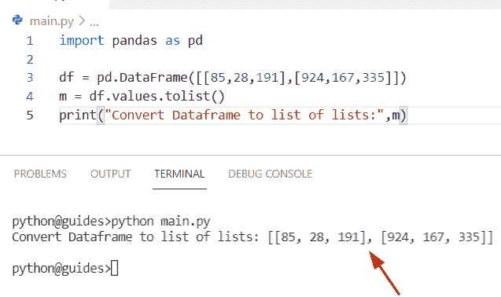

Convert DataFrame to list of lists

阅读:[无法将字符串转换为浮点 Python](https://pythonguides.com/could-not-convert-string-to-float-python/)

## Python 将数据帧转换成元组列表

*   这里我们可以看到如何将熊猫数据帧转换成元组列表。
*   通过使用 `Pandas.to_records()` 方法，我们可以轻松地执行这项任务，该方法将帮助用户将数据帧转换为 NumPy 记录数组，在该函数中，我们将 index 作为参数传递。索引将被视为记录 NumPy 数组的第一个字段，默认情况下，其值为 True。

**语法:**

下面是 Pandas.to_records 的语法

```py
DataFrame.to_records(
                     index=True,
                     column_dtypes=None,
                     index_dtypes=None
                    )
```

**源代码:**

```py
import pandas as pd

new_data = pd.DataFrame({'George': [72,56,39], 'Micheal': [623,745,845]})
new_val = new_data.to_records(index=False)
output = list(new_val)
print("Convert Dataframe to list of tuples:",output)
```

在上面的程序中，我们还应用了 `list(iterable)` 方法将打包的元组转换成一个列表。

你可以参考下面的截图

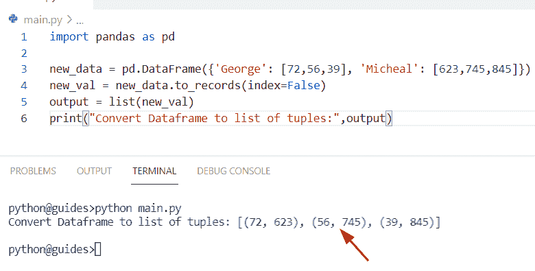

Python DataFrame to list of tuples

阅读:[在 Python 中把字符串转换成浮点数](https://pythonguides.com/convert-string-to-float-in-python/)

## Python 将数据帧转换为列表 2d 列表

*   这里我们可以看到如何将一个数据帧转换成一个 2d 列表。
*   通过使用 to_numpy()的概念。通过转换每行或每列，我们可以很容易地将 Pandas 数据帧转换成一个 2d 列表。为此，我们首先要创建一个元组列表，然后创建一个 dataframe 对象**‘new _ val’**。
*   在 Python 中 `to_numpy()` 函数用于返回一个 ndarray，它包含给定序列或索引形式的值。

**语法:**

```py
DataFrame.to_numpy(
                   dtype=None,
                   copy=False,
                   na_value=Nodefault.no_default
                  )
```

**源代码:**

```py
import pandas as pd

Country_name = [('Newzealand', 34, 'Switzerland', 155),
            ('Germany', 31, 'Australia', 177.5),
            ('France', 16, 'Paris', 81),

        ]
new_val = pd.DataFrame(Country_name)
result = new_val.to_numpy().tolist()
new_output = new_val.to_numpy()
print(new_output) 
```

在上面的程序中，获取每一行后作为一个列表并声明这些列表中的一个列表

下面是以下给定代码的执行过程

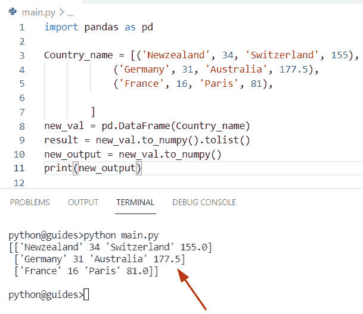

Python Convert DataFrame to list 2d list

阅读:[将 float 转换为 int Python](https://pythonguides.com/convert-float-to-int-python/)

## Python 将数据帧转换为嵌套列表 Python

*   在这个程序中，我们将看到如何将熊猫数据帧转换成 Python 嵌套列表。
*   在 Python 中为 dataframe 创建嵌套列表，我们必须使用 `tolist()` 和 for 循环方法，每个内部列表包含指定行的所有列。

**源代码:**

```py
import pandas as pd

employee_data = {'emp_name':['Lucas', 'William', 'Liam', 'Noah' ] ,'emp_id': [623,884,167,134] }

df = pd.DataFrame(employee_data)
new_output=[]

for new_col in df.columns:

	new_val = df[new_col].tolist()

	new_output.append(new_val)
print(new_output) 
```

在上面的代码中，我们首先创建了一个字典**‘employee _ data’**来存储数据项，然后创建一个数据框来使用 Pandas 模块。现在初始化一个空列表并遍历 DataFrame 的列。

你可以参考下面的截图

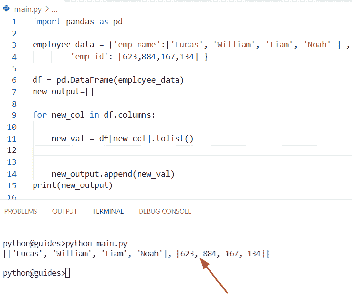

Convert DataFrame to nested list Python

阅读:[如何用 Python 把 DateTime 转换成 UNIX 时间戳](https://pythonguides.com/convert-datetime-to-unix-timestamp-in-python/)

## Python 将数据帧转换成字符串列表

*   在这个程序中，我们将看到如何将一个数据帧转换成一个字符串列表。
*   在 Python 中，tolist()函数用于将数据帧转换为列表，该函数可用于以下示例，并将所需的数据帧转换为字符串列表。这个函数总是返回一个值列表。

**语法:**

下面是 tolist()函数的语法

```py
df.values.tolist()
```

**举例:**

```py
import pandas as pd

student_info = {'stu_name':['Hayden', 'Gilchrist', 'Adam', 'James' ] ,
		'stu_id': [167,992,489,119] }

new_data = pd.DataFrame(student_info)

new_val = new_data['stu_name'].tolist()

print("Convert DataFrame to list of strings:",new_val)
```

在这个程序中，我们创建了一个字典**‘student _ info’**，它以键和值的形式存储数据。在这个例子中，我们将把关键元素看作列名，然后创建一个 data frame**‘new _ data’**。现在，要将数据帧转换成包含字符串元素的列表，我们可以使用函数 `tolist()` 。

下面是以下给定代码的执行过程

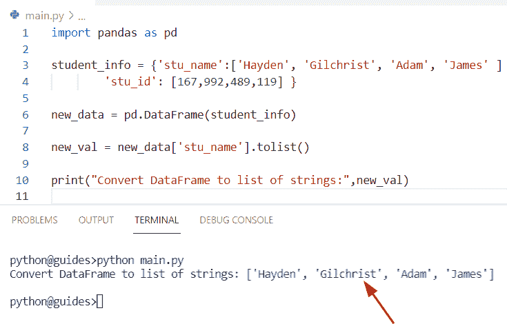

Convert DataFrame to list of strings

阅读:[如何用 Python 把字典转换成 JSON](https://pythonguides.com/convert-dictionary-to-json-python/)

## Python 将数据帧转换为 JSON 列表

*   这里我们可以看到如何将数据帧转换成 JSON 字符串列表。
*   在这个例子中，我们可以使用 `df.to_json` 的概念。这个方法将帮助用户将一个数据帧转换成一个 json 列表。在 Python 中，JSON 依赖于 orient 参数，默认情况下，它的值是**‘记录’**。

**语法:**

下面是 DataFrame.to_json()方法的语法

```py
DataFrame.to_json(
                  path_or_buf=None,
                  orient=None,
                  date_format=None,
                  double_precision=10,
                  force_ascii=True,
                  date_unit='ms',
                  default_handler=None,
                  Lines=False,
                  Compression='infer',
                  index=True,
                  Storage_options=None
                 )
```

*   它由几个参数组成
    *   **path_or_bf:** 该参数用于设置文件路径，如果未给定，则输出以字符串形式返回。
    *   **Orient:** 该参数指定字符串格式的表示，下面我们将**‘记录’**格式作为参数传递，列表类似于 **[{column - > value}]** 。
    *   **data_format:** 默认情况下，其值为 None，并且总是依赖于 orient。对于 **orient='table'** ，默认为 **'iso'** 。
    *   **double_precision:** 默认情况下，其值为整数 10。
    *   **force_ascii:** 该参数指定编码字符串。默认情况下，它将**‘True’**作为参数传递。
    *   **日期单位:**当我们需要将时间单位转换为编码时使用。
    *   **default_handler:** 默认情况下其值为 None。
    *   **行:**该参数检查“orient”是否为“records ”,然后使用 JSON 格式，默认情况下其值为“False”。
    *   **压缩** : **{ '推断'，' gzip '，' bz2 '，' zip'}** 。
    *   **Index:** 默认情况下，索引值为‘False ’,它指定 JSON 字符串中的索引值。
    *   **Storage_options:** dict，是可选参数。

**举例:**

```py
import pandas as pd

df = pd.read_json('[{"China" : 840, "Australia" : 197}, {"Mexico" : 134, "Russia" : 104}]', orient='records')
new_str = list()
print (df.to_json(orient='records'))
```

在上面的程序中，我们首先导入了一个 pandas 模块，然后创建了一个 dataframe，我们在其中传递了 JSON 格式，它取决于参数 **orient =' record'** 的值。

你可以参考下面的截图

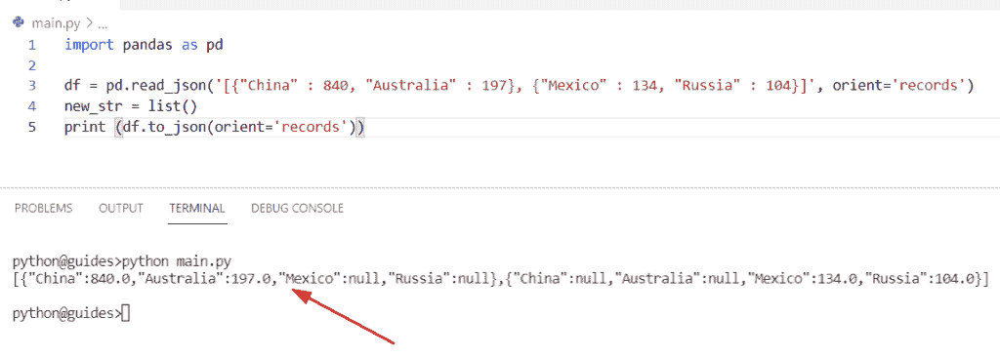

Python Convert DataFrame to list of JSON

阅读:[如何将 Python 字符串转换成字节数组](https://pythonguides.com/python-string-to-byte-array/)

## Python 将数据帧转换为列列表

*   在这个程序中，我们将看到如何将一个数据帧转换成列的列表。
*   在这个例子中我们可以使用 `dict.keys()` 的概念方法。在 Python 中，这个函数返回一个包含字典中所有可用键的列表。在本例中，我们将关键字视为列**‘斯图 _ 名字’**和**‘斯图 _ id’**。

**源代码:**

```py
import pandas as pd

student_info = {'stu_name':['Hayden', 'Gilchrist', 'Adam', 'James' ] ,
		'stu_id': [732,881,589,149] }
d= student_info.keys()
print(d)
```

在上面的程序中，我们已经创建了一个字典**‘student _ info’**，然后使用**的 dict.keys()** 方法将帮助用户将一个 dataframe 转换成一个 list。

下面是以下给定代码的执行过程

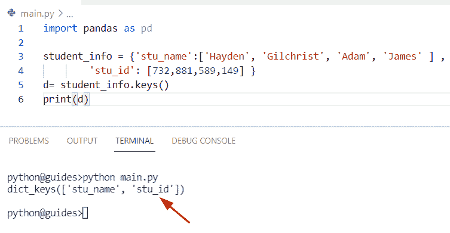

Python Convert DataFrame to list of Columns

检查如何将数据帧转换成列列表的另一种方法。

在这个例子中，我们将一个 CSV 文件读入一个数据帧，然后应用 `series.tolist()` 函数将一个数据帧转换成一个列列表。在下面的代码中，我们使用[]操作符选择列**【中国】**，该操作符总是返回一个序列项。

**语法:**

下面是熊猫的句法。Series.tolist()

```py
Series.tolist()
```

> **注意:** 它不包含参数，返回一列值。

**源代码:**

```py
import pandas as pd

info_dt = pd.read_csv("test1.csv")
df = info_dt.head(3)

new_val = df["China"].tolist()

print("Convert dataframe to list of column:",new_val) 
```

下面是 CSV 文件的截图和输出代码

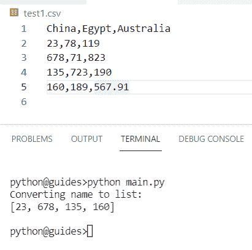

Python convert DataFrame to list of columns CSV

您可以参考下面的截图，将数据帧转换为列列表

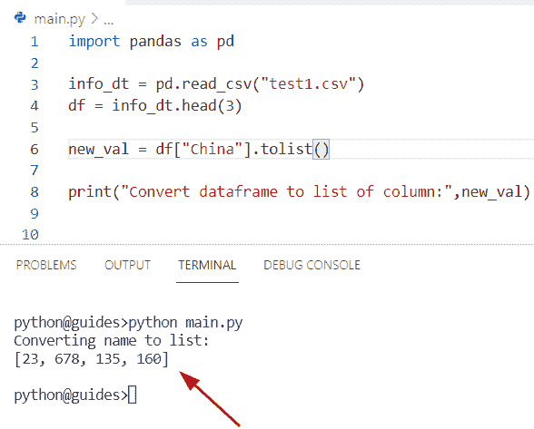

Python Convert DataFrame to list of Columns

阅读:[如何在 Python 中把字符串转换成日期时间](https://pythonguides.com/convert-a-string-to-datetime-in-python/)

## Python 将数据帧转换为序列列表

*   让我们看看如何在 Python 中将数据帧转换成序列列表。
*   为了执行这个任务，我们可以使用 `values.tolist()` 方法的概念。该函数将帮助用户将数据帧的数据项转换成列表。在下面的例子中，我们首先通过使用值将 dataframe 转换为 numpy 数组，然后将其转换为 list。之后，我们创建了一个新系列，其索引来自' **new_dt'** 。

**源代码:**

```py
import pandas as pd

new_dt = pd.DataFrame([[39,55,15,93], [54,39,12,14]], ['Rose', 'Tulip'])
print (pd.Series(new_dt.values.tolist(), index=new_dt.index))
```

下面是以下代码的截图

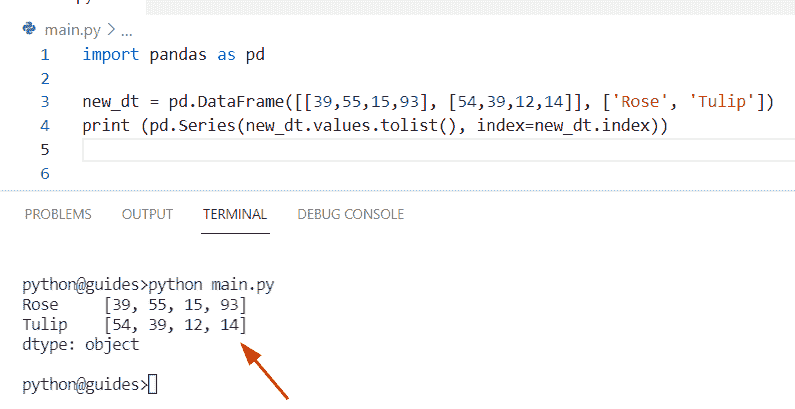

Python Convert DataFrame to list of Series

阅读:[如何将 Python 角度转换为弧度](https://pythonguides.com/python-degrees-to-radians/)

## Python 将数据帧转换成不带索引的列表

*   在这个程序中，我们将讨论如何在 Python 中将一个数据帧转换成一个没有索引的列表。
*   这里我们可以使用 `DataFrame.to_numpy()` 函数的概念。在 Python 中，此方法返回 NumPy ndarray 类型的对象。

**语法:**

下面是熊猫的句法。DataFrame.to_Numpy

```py
DataFrame.to_Numpy(
                  dtype=None,
                  copy=False,
                  na_value=NoDefault.no_default
                 )
```

*   它由几个参数组成
    *   **dtype:** 该参数用于指定数据的类型。
    *   **Copy:** 该参数用于返回给定数组的完全相同的副本，默认情况下，Copy 会分配一个参数 **'False'** 。
    *   **na_value:** 这是一个可选参数，默认情况下 Pandas 返回 na 值。

**举例:**

```py
import pandas as pd

df = pd.DataFrame({'0' : ['82','16','72','118'],
       '1' : ['109','116','179','482'],
       '2' : ['467','915','119','222'],
       '3' : ['655','882','639','193']})
b = df.to_numpy('int').tolist()
print("Convert df to list without index:",b)
```

在上面的代码中，我们从熊猫数据帧中创建了一个嵌套列表，然后应用函数 `df.to_numpy()` 和函数 `tolist()` 。一旦您将打印**‘b’**，那么输出将显示一个没有索引值的列表。

下面是以下给定代码的实现

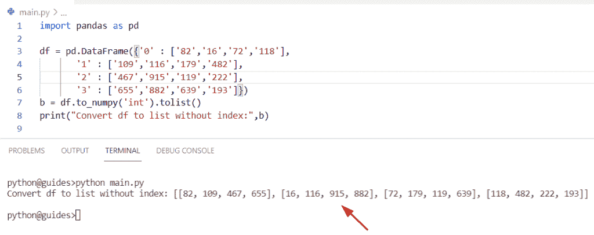

Python Convert DataFrame to list without index

阅读: [Python 将元组转换为列表](https://pythonguides.com/python-convert-tuple-to-list/)

## Python 将列表转换为熊猫数据帧转换为标题

*   让我们看看如何将一个列表转换成一个带有表头的熊猫数据帧。
*   通过使用切片和熊猫。DataFrame 构造函数，我们可以将一个列表转换成一个 dataframe。在这个例子中，我们提到了给定列表中的数据和作为单独列表的列名。

**源代码:**

```py
import pandas as pd
new_info = [['stu_name','stu_age'],
              ['George', 45],
                ['Micheal', 22],
                ['Hyaden', 18],
                   ['Chris', 26],
                ['Potter', 34]]

new_val = pd.DataFrame(new_info[1:],columns=new_info[0])
print(new_val) 
```

在上面的程序中，我们已经为 **pd 指定了第一个索引。DataFrame()** 方法。一旦您将打印**‘new _ val’**，那么输出将显示包含行和列形式的元素以及标题的数据帧。

你可以参考下面的截图

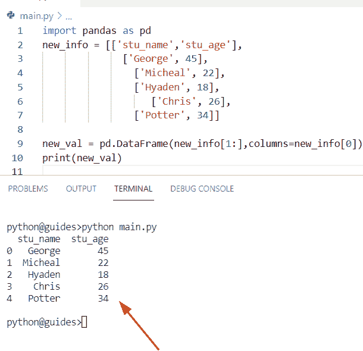

Python Convert list to Pandas DataFrame to a header

检查如何将列表转换为标题的另一种方法。

通过使用 `zip()` 方法，我们可以执行这个特定的任务。在 Python 中，zip()方法将 iterable 作为一个元组，并且还包含相同索引的元素。

**举例:**

```py
import pandas as pd

new_lis1 = ['Seria','oliva','Elijah','Jefer','William','john','potter']

new_lis2 = [62,19,35,92,45,91,29]

df = pd.DataFrame(list(zip(new_lis1, new_lis2)),
			columns =['emp_name', 'emp_id'])

print("Convert list to dataframe with header:",df)
```

在上面的例子中，我们创建了两个列表**‘new _ lis 1’**和**‘new _ lis 2’**。现在我们想通过调用一个 **pd 来合并这两个列表并创建一个数据帧。在其中指定了列名的构造函数。**

下面是以下给定代码的执行。

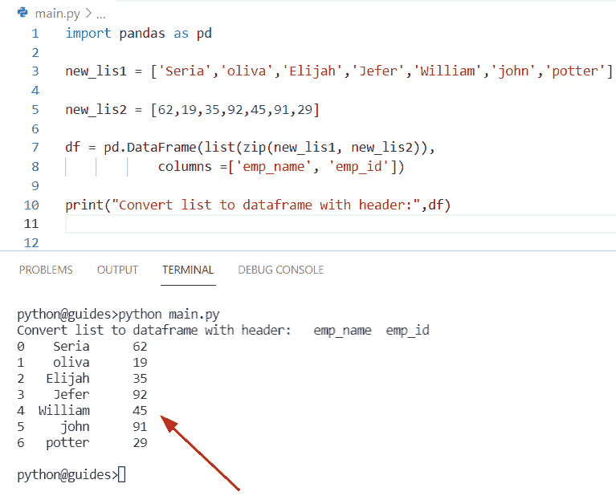

Python Convert list to Pandas DataFrame to a header

检查如何将 python 列表转换成 pandas 数据帧的另一种方法。

通过使用多维列表，我们可以创建一个熊猫数据框架。

**源代码:**

```py
import pandas as pd

new_val = [['z', 119], ['u', 821],
	['p', 654], ['t', 701]]

df = pd.DataFrame(new_val, columns =['Alphabet', 'Value'])
print("Convert a list to Pandas with header:",df) 
```

下面是以下代码的截图

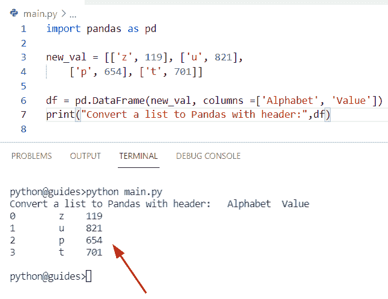

Python Convert list to pandas dataframe to a header

这是如何从列表中创建一个熊猫数据框架。

你也喜欢看下面的文章。

*   [如何在 Python 中把列表转换成字符串](https://pythonguides.com/python-convert-list-to-string/)
*   [获取字典 Python 中的第一个键](https://pythonguides.com/get-first-key-in-dictionary-python/)
*   [如何在 python 中把整数转换成字符串](https://pythonguides.com/convert-an-integer-to-string-in-python/)
*   [Python 字典增量值](https://pythonguides.com/python-dictionary-increment-value/)
*   [Python 熊猫写数据帧到 Excel](https://pythonguides.com/python-pandas-write-dataframe-to-excel/)

在本教程中，我们学习了如何使用 Python 将 Pandas 数据帧转换为列表。此外，我们已经讨论了这些主题。

*   Python 将数据帧转换成字典列表
*   Python 将数据帧转换成字典列表
*   Python 将数据帧转换为列表列表
*   Python 将数据帧转换成元组列表
*   Python 将数据帧转换为 2d 列表
*   Python 将数据帧转换成 scala 列表
*   将数据帧转换为嵌套列表
*   Python 将数据帧转换为字符串列表
*   Python 将数据帧转换为 json 列表
*   Python 将数据帧转换为列列表
*   Python 将数据帧转换为序列列表
*   Python 将数据帧转换为不带索引的列表
*   Python 将列表转换为带标题的熊猫数据帧

[Bijay Kumar](https://pythonguides.com/author/fewlines4biju/)

Python 是美国最流行的语言之一。我从事 Python 工作已经有很长时间了，我在与 Tkinter、Pandas、NumPy、Turtle、Django、Matplotlib、Tensorflow、Scipy、Scikit-Learn 等各种库合作方面拥有专业知识。我有与美国、加拿大、英国、澳大利亚、新西兰等国家的各种客户合作的经验。查看我的个人资料。

[enjoysharepoint.com/](https://enjoysharepoint.com/)[](https://www.facebook.com/fewlines4biju "Facebook")[](https://www.linkedin.com/in/fewlines4biju/ "Linkedin")[](https://twitter.com/fewlines4biju "Twitter")