# Python 将字典转换为数组

> 原文：<https://pythonguides.com/python-convert-dictionary-to-an-array/>

[](https://sharepointsky.teachable.com/p/python-and-machine-learning-training-course)

在本 Python 教程中，我们将讨论关于 **Python 将字典转换为数组。**在这里，我们还将介绍以下示例:

*   Python 将字典转换为 numpy 数组
*   Python 将字典转换为字节数组
*   Python 将字典值转换为数组
*   Python 将字典转换为 2d 数组
*   Python 将字典键转换为数组
*   Python 将字典数组转换为数据帧
*   Python 将字典转换为 json 数组

目录

[](#)

*   [Python 将字典转换成数组](#Python_convert_dictionary_to_an_array "Python convert dictionary to an array")
    *   [通过使用 dict.items()](#By_using_dictitems "By using dict.items()")
    *   [通过使用 numpy.array()](#By_using_numpyarray "By using numpy.array()")
    *   [利用 numpy 数组和列表相结合的理解方法](#By_using_the_combination_of_numpy_array_and_list_comprehension_method "By using the combination of numpy array and list comprehension method")
*   [Python 将字典转换为 numpy 数组](#Python_convert_dictionary_to_numpy_array "Python convert dictionary to numpy array")
*   [Python 将字典转换成字节数组](#Python_convert_dictionary_to_byte_array "Python convert dictionary to byte array")
*   [Python 将字典值转换为数组](#Python_convert_dictionary_values_to_array "Python convert dictionary values to array")
*   [Python 将字典转换成 2d 数组](#Python_convert_dictionary_to_2d_array "Python convert dictionary to 2d array")
*   [Python 将字典键转换为数组](#Python_convert_dictionary_keys_to_array "Python convert dictionary keys to array")
*   [Python 将字典数组转换为数据帧](#Python_convert_array_of_dictionary_to_dataframe "Python convert array of dictionary to dataframe")
    *   [将数组的字典转换成数据帧的另一个例子](#Alternative_example_to_convert_dictionary_of_an_array_into_dataframe "Alternative example to convert dictionary of an array into dataframe")

## Python 将字典转换成数组

*   让我们看看如何在 Python 中将字典转换成数组
*   Python 提供了一个简单的内置函数来执行这个特定的任务。有多种方法来执行该操作。
    *   通过使用 `dict.items()` 方法
    *   通过使用 `numpy.array()` 方法
    *   通过使用组合 `numpy.array()` 和 `dict.items()` 的方法

### 通过使用 dict.items()

在 Python 中要返回字典中键值元素的组合，我们可以使用 `dict.items()` 方法。在这个例子中，我们可以在 `list()` 中使用这个方法作为参数。这个方法帮助用户将字典转换成列表。

**语法:**

下面是 `dict.items()` 方法的语法

```py
dictionary.items()
```

**注意:**这个方法不需要任何参数。它以列表的形式返回一个对象，该列表包含字典中的键值对元素。

**举例:**

让我们举一个例子，检查如何使用 `dict.items()` 方法将字典转换为数组

```py
import numpy as np

new_dictionary = {"Micheal": 18, "Elon": 17}
new_lis = list(new_dictionary.items())
con_arr = np.array(new_lis)
print("Convert dict to arr:",con_arr) 
```

首先在上面的代码中，我们将导入一个 numpy 模块。现在创建一个字典，使用 `numpy.array()` 方法将字典转换为数组。

下面是以下代码的截图

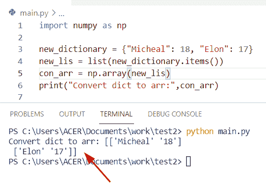

Python convert dictionary to an array

### 通过使用 numpy.array()

在 Python 中，如果我们想把一个字典转换成一个数组，那么这个方法将引导你执行这个操作。

**语法:**

下面是 `numpy.array()` 的语法

```py
numpy.array(
            object,
            dtype=None,
            copy=True,
            order='K',
            subok=False,
            ndim=0,
            like=None
           )
```

*   它由几个参数组成:
    *   **Object:** 其方法总是返回 numpy 数组的对象或项目。
    *   **dtype:** 如果参数中未给出数据类型，则它将被确定为最小类型。
    *   **Copy:** 这是一个可选参数，如果对象是一个嵌套序列，那么它满足任何其他要求。
    *   **顺序:**在这种情况下，如果对象不在数组中，那么它将是“C”顺序。如果 F 和 C 顺序被保留，那么它将是“K”顺序。
    *   **ndim:** 可选参数，指定最小维数。
    *   **Return:** 返回一个包含元素个数的对象。

**举例:**

```py
import numpy as np

my_new_dict = {15: 'oliva',
		18: 'Hayden',
		19: {'n': 'George',
			'z': 'China',
			'p': 'Egypt'}
		}

new_val = my_new_dict.items()
elemen = list(new_val)
con_arr = np.array(elemen)
print(con_arr)
```

首先在上面的代码中，我们将声明一个嵌套的字典并包含键值对元素。现在使用 numpy.array()方法并传递 **'elemen'** 变量作为参数，然后打印结果，它将显示三维数组。

下面是以下给定代码的执行过程

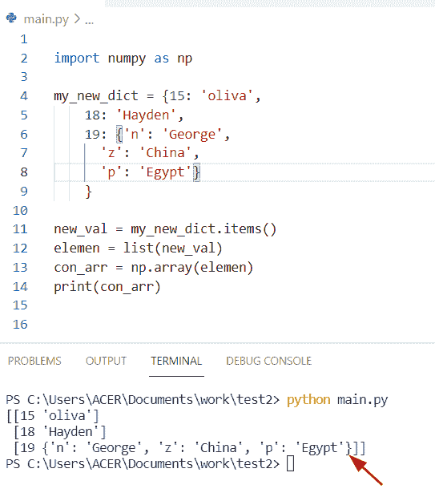

Python convert dictionary to array numpy method

### 利用 numpy 数组和列表相结合的理解方法

在这个例子中，我们使用了列表理解方法的概念和 numpy 数组。

**源代码:**

```py
import numpy as np
from ast import literal_eval

new_str = """{
"student_info": {"stu_name": "George",
"last_nam": "lucid", "skills": "Python"},

"student_info2": {"stu_name": "Oliva",
"last_nam": "xender", "skills": "Java"},

"student_info3": {"stu_name": "cravy",
"last_nam": "lucifier", "skills": "sql"},

"student_info2": {"stu_name": "Elon",
"last_nam": "Mathew", "skills": "Mongodb"},

}"""
n = literal_eval(new_str)

out_arr = np.array([[new_val[z] for z in ['stu_name', 'last_nam',
										'skills']] for key, new_val in n.items()])

print("Convert dict to array:",out_arr)
print(type(out_arr))
```

在上面的代码中，我们首先导入一个“literal_eval”库，然后创建一个新字符串类。在 Python 中， **'literal_eval'** 方法帮助用户将字符串类型转换为字典。现在我们想将一个字典转换成一个数组，这样我们就可以使用 `numpy.array()` 方法。

下面是以下给定代码的输出

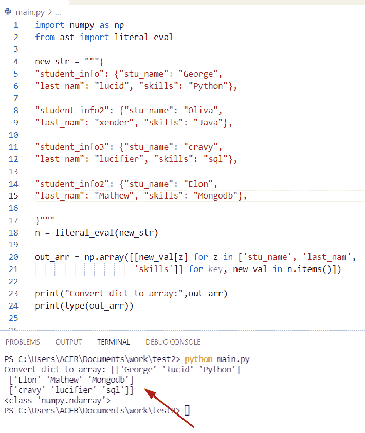

Python convert dictionary to array list comprehension method

阅读: [Python 元组字典](https://pythonguides.com/python-dictionary-of-tuples/)

## Python 将字典转换为 numpy 数组

*   这里我们可以看到如何将字典转换成 numpy 数组。
*   在这个例子中，我们可以应用结构化数组的概念。在 Python 中，结构化数组包含相同类型的数据，也称为字段。这里的**‘新值’**是一个包含键值对的字典。现在创建一个**‘EMP _ info’**变量，它的数据类型是一个包含两个字段的结构。

**源代码:**

```py
import numpy as np
new_values = {16:2.33, 19: 3.4456, 8: 199.9, 117: 172.89}

emp_info = ['emp_id','information']
new_format = ['f8','f8']
dtype = dict(names = emp_info, formats=new_format)
con_arr = np.array(list(new_values.items()), dtype=dtype)

print(repr(con_arr))
```

下面是以下给定代码的执行过程

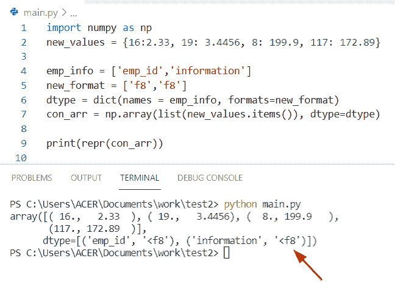

Python convert dictionary to numpy array

将字典转换成 numpy 数组的另一个例子

**举例:**

```py
import numpy as np

my_dict = {12: 14, 15: 18, 25: 89, 13: 99,
				78: 25, 19: 416, 17: 189}

converted_arr = np.array(list(my_dict.items()))
print(converted_arr) 
```

下面是以下代码的截图

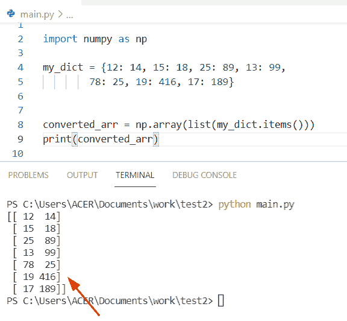

Python convert dictionary to numpy array method

阅读:[从字典中获取所有值 Python](https://pythonguides.com/get-all-values-from-a-dictionary-python/)

## Python 将字典转换成字节数组

*   让我们看看如何将 Python 字典转换成字节数组。
*   在 Python 中，字节数组对象允许我们改变字典中可用的元素。它是一个介于 0 到 256 之间的整数序列。

**语法:**

```py
bytearray
         (
          source,
          encoding,
          errors
         )
```

*   它由几个参数组成。
    *   **Source:** 将 iterable 转换成字节数组。
    *   **encoding:** 可选参数，如果给定的可迭代序列是字符串，则执行字符串的编码。

**源代码:**

```py
import json

my_new_dictionary = {'stu_name': 'Brenda', 'code': 'dr-02'}
user_info = json.dumps(my_new_dictionary, indent=3).encode('utf-8')
print(user_info)
```

下面是以下代码的截图

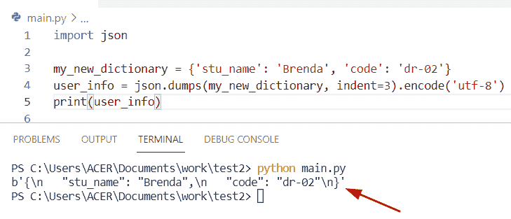

Python convert dictionary to byte array

阅读: [Python 从两个列表中创建了一个字典](https://pythonguides.com/python-creates-a-dictionary-from-two-lists/)

## Python 将字典值转换为数组

在这个例子中，我有一个字典，用**‘values’**变量作为键，用一个整数列表作为值。现在我将把列表转换成一个 numpy 数组，并使用 dict comprehension 方法修改字典。

**源代码:**

```py
import numpy as np

def new_arr(dictionary):

    return {new_k:np.array(new_v) for new_k, new_v in dictionary.items()}

my_dict = {
    'val1': [789, 156, 178, 198],
    'val2': [872, 199, 156, 189],
    'val3': [100, 1345, 190, 167]
}

print("Convert values into arr",new_arr(my_dict))
```

下面是以下给定代码的实现

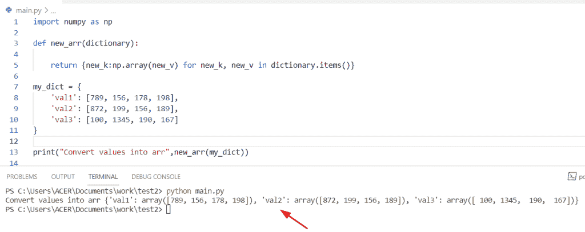

Python convert dictionary values to array

阅读: [Python 字典 pop](https://pythonguides.com/python-dictionary-pop/)

## Python 将字典转换成 2d 数组

*   让我们看看如何将字典转换成二维数组。
*   为了执行这个任务，我们可以结合使用列表理解和 `numpy.array()` 方法。
*   在这个例子中，对 I 在**‘new _ keys’**中的内部理解将迭代**‘new _ dict’**变量中的行。

**举例:**

下面是一些使用 numpy 模块声明 2d 数组的代码。现在我们必须按顺序使用键的列表，因为字典不存储键-值对元素

```py
import numpy as np

new_dict = {'George':(6,12,9,3), 'Micheal':(16,99,22,33)}
new_keys = ['George','Micheal']

new_2d_arr = np.array([new_dict[i] for i in new_keys])

print (new_2d_arr)
```

下面是以下代码的截图

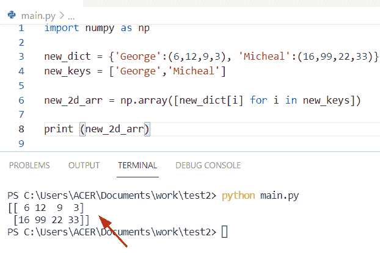

Python convert dictionary to 2d array

阅读: [Python 字典包含](https://pythonguides.com/python-dictionary-contains/)

## Python 将字典键转换为数组

*   这里我们可以看到如何将 Python 字典键转换成数组。
*   通过使用 `loop()+zip()+map()` 函数可以解决这个问题。在这个例子中，我们将看到如何将字典关键字元素转换成一个数组。
*   如果我们想从 map()函数返回一个值，那么我们必须传递一个类似 set()的方法[来声明一个集合]。
*   在 Python 中，zip()方法接受可迭代项，并以元组的形式返回一个对象，如果 zip()方法中没有可用的参数，则它返回一个空迭代器。

**源代码:**

```py
my_new_dict = {'k' : {},
			'c' : {},
			'd' : {},
            'j':{}}

new_val = list(my_new_dict.values())
m = set()
for new_element in new_val:
	for u in new_element:
		m.add(u)
new_output = []
new_output.append(m)
for new_k, new_v in my_new_dict.items():
	con_key = []
	for u in m:
		con_key.append(new_v.get(u, 0))
	new_output.append(con_key)

new_output = [[u for u, new_v in my_new_dict.items()]] + list(map(list, zip(*new_output)))
print("Convert dict keys into arr : ",new_output)
```

首先在上面的代码中，我们将初始化一个字典并分配一个键值对元素。现在我声明一个变量，并使用 list 函数传递一个原始字典作为参数。然后创建一个空列表来存储一个 keys 元素，对于**列表理解**方法，我们可以应用多个方法作为参数。

下面是以下给定代码的执行过程

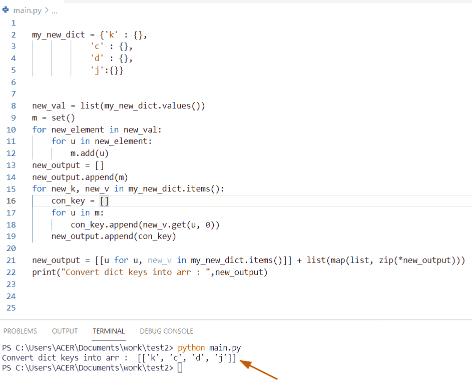

Python convert dictionary keys to array

阅读: [Python 字典理解](https://pythonguides.com/python-dictionary-comprehension/)

## Python 将字典数组转换为数据帧

*   在 Python 中，要将字典数组转换成数据帧，我们可以很容易地使用函数 **dict.items()。**通过使用 `dict.items()` 得到一个类似字典的具有键值对的集合。
*   在这个例子中，我们使用 pandas 库创建了一个 dataframe，然后初始化了一个字典。现在使用 `list(iterable)` 方法将一个对象转换成一个列表。

让我们举一个例子，检查如何将字典数组转换为 dataframe。

**代码:**

```py
import pandas as pd
my_dictionary = {'m': [17,31], 'p': [90,16], 'q': [78,116]}
v = pd.DataFrame(list(my_dictionary.items()))
print(v)
```

下面是以下给定代码的执行过程

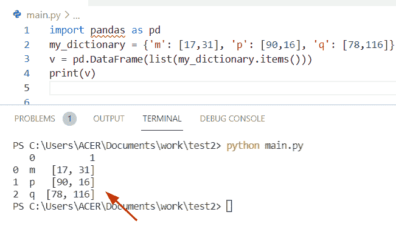

Python convert array of a dictionary to dataframe

如您所见，数组的字典被转换成了 pandas dataframe。

### 将数组的字典转换成数据帧的另一个例子

通过使用索引和列关键字，我们可以轻松地执行这个特定的任务

**举例:**

```py
 import pandas as pd

new_dict = [{'Micheal': 'value', 'John': 'value', 'oliva': 'values'},
		{'adam':10, 'hayden': 20, 'George': 30}]

new_data = pd.DataFrame(new_dict, index =['ind1', 'ind2'],
					columns =['val1', 'val2'])

new_data2 = pd.DataFrame(new_dict, index =['index1', 'index2'])

print ("Convert arr of dict to dataframe:",new_data2)
```

在这个例子中，我们将演示如何通过字典列表创建一个熊猫数据框架。为此，我们将初始化一个包含两列索引的列表元素，索引的值与字典键的值相同。

下面是以下给定代码的实现

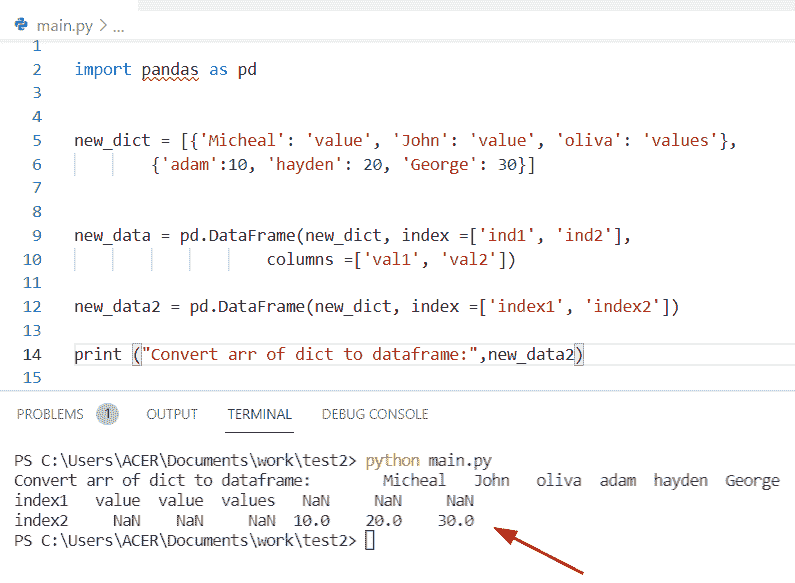

Python convert array of a dictionary to dataframe method

你可能也喜欢阅读下面的教程。

*   [Python 字典按值查找键](https://pythonguides.com/python-dictionary-find-a-key-by-value/)
*   [Python 字典计数+例子](https://pythonguides.com/python-dictionary-count/)
*   [Python 将字典转换为列表](https://pythonguides.com/python-convert-dictionary-to-list/)
*   [Python 字典删除](https://pythonguides.com/python-dictionary-remove/)
*   [Python 字典到 CSV](https://pythonguides.com/python-dictionary-to-csv/)
*   [如何创建一个空的 Python 字典](https://pythonguides.com/how-to-create-an-empty-python-dictionary/)
*   [Python 字典多键](https://pythonguides.com/python-dictionary-multiple-keys/)

在本 Python 教程中，我们已经讨论了关于 **Python 将字典转换为数组。**在这里，我们还讨论了以下主题:

*   Python 将字典转换为 numpy 数组
*   Python 将字典转换为字节数组
*   Python 将字典值转换为数组
*   Python 将字典转换为 2d 数组
*   Python 将字典键转换为数组
*   Python 将字典数组转换为数据帧
*   Python 将字典转换为 json 数组

[Bijay Kumar](https://pythonguides.com/author/fewlines4biju/)

Python 是美国最流行的语言之一。我从事 Python 工作已经有很长时间了，我在与 Tkinter、Pandas、NumPy、Turtle、Django、Matplotlib、Tensorflow、Scipy、Scikit-Learn 等各种库合作方面拥有专业知识。我有与美国、加拿大、英国、澳大利亚、新西兰等国家的各种客户合作的经验。查看我的个人资料。

[enjoysharepoint.com/](https://enjoysharepoint.com/)[](https://www.facebook.com/fewlines4biju "Facebook")[](https://www.linkedin.com/in/fewlines4biju/ "Linkedin")[](https://twitter.com/fewlines4biju "Twitter")