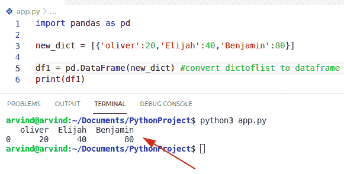

# Python 将字典转换为列表

> 原文：<https://pythonguides.com/python-convert-dictionary-to-list/>

[](https://sharepointsky.teachable.com/p/python-and-machine-learning-training-course)

在这个 Python 教程中，我们将讨论 **Python 将字典转换成列表。**这里我们还将涵盖下面的例子:

*   Python 将字典转换为键值对列表
*   Python 将字典转换为元组列表
*   Python 将字典转换为字典列表
*   Python 将字典转换为值列表
*   Python 将字典转换为键列表
*   Python 将字典转换成对列表
*   Python 把字典变成列表
*   Python 将嵌套字典转换为列表
*   Python 将字典列表转换为字符串
*   Python 将列表转换为数据帧

目录

[](#)

*   [Python 将字典转换为列表](#Python_convert_dictionary_to_list "Python convert dictionary to list")
    *   [通过使用。items()方法](#By_using_items_method "By using .items() method")
    *   [通过使用。values()方法](#By_using_values_method "By using .values() method")
    *   [通过使用 zip()函数](#By_using_zip_function "By using zip() function")
    *   [通过使用。keys()方法](#By_using_keys_method "By using .keys() method")
    *   [用列表理解法](#By_using_list_comprehension_method "By using list comprehension method")
    *   [通过使用 map()函数](#By_using_map_function "By using map() function")
*   [Python 将字典转换为键值对列表](#Python_convert_dictionary_to_list_of_key-value_pairs "Python convert dictionary to list of key-value pairs")
*   [Python 将字典转换为元组列表](#Python_convert_dictionary_to_list_of_tuples "Python convert dictionary to list of tuples")
*   [Python 将字典转换为字典列表](#Python_convert_dictionary_to_list_of_dictionaries "Python convert dictionary to list of dictionaries")
*   [Python 将字典转换为值列表](#Python_convert_dictionary_to_list_of_values "Python convert dictionary to list of values")
*   [Python 将字典转换为键列表](#Python_convert_dictionary_to_list_of_keys "Python convert dictionary to list of keys")
*   [Python 将字典转换成对列表](#Python_convert_dict_to_list_of_pairs "Python convert dict to list of pairs")
*   [Python 翻字典列表](#Python_turn_dictionary_to_list "Python turn dictionary to list")
*   [Python 将嵌套字典转换为列表](#Python_convert_nested_dictionary_to_list "Python convert nested dictionary to list")
*   [Python 将字典列表转换为字符串](#Python_convert_dictionary_list_to_string "Python convert dictionary list to string")
*   [Python 将列表转换为数据帧](#Python_convert_dict_of_list_to_dataframe "Python convert dict of list to dataframe")
    *   [通过使用 pd.dataframe(data)](#By_using_pddataframedata "By using pd.dataframe(data)")
    *   [通过使用 PD . data frame . from _ dict(data)](#By_using_pddataframefrom_dictdata "By using pd.dataframe.from_dict(data)")
    *   [采用指数法](#By_using_index_method "By using index method")

## Python 将字典转换为列表

*   这里我们可以看到如何用 python 将字典转换成列表。
*   在 python 中，列表是简单的顺序数据，而字典是键值对的组合。
*   现在的任务是我们必须将一个键-值对的字典转换成一个列表。
*   为了完成这个特殊的任务，有许多方法可以将字典转换成列表。
    *   通过使用**。**项()【方法
    *   通过使用。 `values()` 方法
    *   通过使用 `zip()` 函数
    *   通过使用**。keys()** 方法
    *   通过使用列表理解方法
    *   通过使用地图功能

### 通过使用。items()方法

第一种方法是 **dict。items()** 将字典转换成列表。该方法用于迭代字典的元素。使用 `list()` 我们将把所有的条目转换成列表。

**举例:**

```py
my_dict ={"b":20,"c":10}

con_lis = list(my_dict.items())
print("Converted dict to list:",con_lis)
```

首先在上面的代码中，我们将使用花括号创建一个字典，并给它们分配键值对。需要将 `con_lis` 变量转换成一个列表，这样我们就可以使用 list()函数，然后将结果存储在 `con_lis` 变量中。

**输出:**


Python convert dictionary to list

### 通过使用。values()方法

使用 `dict.values()` 方法我们可以很容易地得到一个值列表，要将值转换成列表，我们可以使用 list()函数

**举例:**

让我们举一个例子，看看如何将字典转换成列表

```py
to_dict ={"d":50,"f":10,"g":40}

new_val = list(to_dict.values())
print("Converted dict to list:",new_val)
```

下面是以下代码的截图


Python convert dictionary to list values method

### 通过使用 zip()函数

在这个例子中，我们可以结合使用 `zip()` 、 `keys()` 和 values 方法将字典转换成列表。为了创建一个元组列表，我们可以使用 `zip()` 函数。在 Python 中， `zip()` 函数主要用于组合两个迭代器。

这是源代码

```py
to_dict ={"i":160,"w":110,"s":340}

m = list(zip(to_dict.keys(), to_dict.values()))
print("Convert dictionary to list:",m)
```

下面是以下给定代码的实现


Python convert dictionary to list zip method

### 通过使用。keys()方法

`keys()` 方法用于从字典中获取键的列表。为了获得所有键的列表，我们可以将 list()函数与 `keys()` 方法结合起来。

**举例:**

```py
new_dict ={"z":320,"p":430,"o":245}

n_val = list(new_dict.keys())
print("Convert dictionary to list",n_val)
```

**输出:**


Python convert dictionary to list keys method

### 用列表理解法

为了在 Python 中创建一个列表，我们可以使用列表理解方法。要从字典中收集键值，我们必须使用 `dict.items()` 方法，然后添加到列表中。

**举例:**

```py
n_dictionary ={"James":240,"William":180,"Chris":140}

n_lis = [(key, value) for key, value in n_dictionary.items()] 
print(n_lis)
```

检查以下给定代码的执行情况


Python convert dictionary to list comprehension method

### 通过使用 map()函数

map 函数将一个函数和一个序列作为参数，并将该函数应用于 iterables 并返回一个新的列表。在这个例子中，您可以结合 map 和 list 函数将字典转换成列表。

**源代码:**

```py
my_dict ={"Newzealand":860,"Swizerland":780,"Moscow":340}

con_val= list(map(list,my_dict.items()))
print(con_val)
```

**输出:**


Python convert dictionary to list map function

这就是如何将字典转换成列表

## Python 将字典转换为键值对列表

*   让我们看看如何将字典转换成包含键值对的列表。
*   在这个例子中，我们可以使用 `loop+items()` 方法来执行这个特定的任务。 `loop()` 方法将遍历所有对并将它们提取到列表中，items()方法用于迭代字典中的元素。

这是源代码

```py
dictionary = {"u":67, "m":18,"f":92}

my_lis = [] 
for new_k, new_v in dictionary.items(): 
    my_lis.append([new_k, new_v]) 
print("Dictionary to list",my_lis)
```

下面是以下给定代码的实现


Python convert dictionary to list of key-value pairs

将字典转换成包含键值对的列表的另一种方法是

通过使用列表理解方法，我们将键值对转换成列表。

**举例:**

```py
to_dictionary = {"h":[51], "g":[198],"l":[912]}

output = [[new_key] + new_val for new_key, new_val in to_dictionary.items()]
print(output)
```

下面是以下代码的截图


Python convert dictionary to list of key-value pairs comprehension method

阅读:[在 Python 中把字符串转换成浮点数](https://pythonguides.com/convert-string-to-float-in-python/)

## Python 将字典转换为元组列表

*   在 Python 中，要将字典转换成元组列表，我们可以使用迭代方法来执行这个特定的任务。
*   迭代器基本上是一个存储特定数量的可数项的对象，它用于迭代一系列项。
*   在这个例子中，我们必须使用 `append()` 方法在列表的末尾插入一个元素。

**举例:**

让我们举一个例子，看看如何将一个字典转换成一个元组列表

```py
con_dict = { 'Pink': 176, 'Brown': 94, 'Blue': 24 }

my_lis = [] #empty list
for e in con_dict:
   t = (e, con_dict[e])
   my_lis.append(t)
print("List of tuple:",my_lis)
```

**实施:**


Python convert dictionary to list of tuples

检查如何将字典转换成元组列表的另一个例子

通过使用 collection 方法，我们可以初始化一个名为 tuple 的**函数。这个函数创建带有名称字段的元组子类。**

这是源代码

```py
import collections

my_dictionary = { "U.S.A": 74, "Algeria":82, "Cambodia": 51 }
new_tup_lis = collections.namedtuple('my_lis', 'Country val')

convert_lis = list(new_tup_lis(*item) for item in my_dictionary.items())
print(convert_lis)
```

下面是以下代码的截图


Output

阅读:[将 float 转换为 int Python](https://pythonguides.com/convert-float-to-int-python/)

## Python 将字典转换为字典列表

通过使用列表理解方法，我们可以遍历每个字典键-值对，并将列表中的字典转换为字典列表。

**举例:**

```py
new_dictiy = { "p" : [4, 9], "d" : [5, 8], "l" : [19, 18] }

con_li_dic = [{new_k : new_val[x] for new_k, new_val in new_dictiy.items()}
         for x in range(2)]
print ("Convert list into dictionaries:",con_li_dic)
```

下面是以下给定代码的执行过程


Python convert dictionary to list of dictionaries

## Python 将字典转换为值列表

用于将字典中的值转换为列表。首先，我们将创建一个列表，其中每个键值对都是字典中的一个值。通过使用 dict.values()方法，我们可以得到一个值列表。

**代码:**

```py
new_dict = {"j": 77, "o": 87,"s":97}

n_val = new_dict.values()
new_lis = list(n_val)
print(new_lis)
```

**输出:**


Python convert dictionary to list of values

阅读:[如何用 Python 把 DateTime 转换成 UNIX 时间戳](https://pythonguides.com/convert-datetime-to-unix-timestamp-in-python/)

## Python 将字典转换为键列表

在 Python 中，将字典的键转换为列表。首先，我们必须声明一个字典，并将其插入到键值对中。现在我们将使用 dict.keys()方法从字典中获取键的列表。

**举例:**

让我们举一个例子，检查如何将字典的键转换成列表。

```py
ne_dic = {'v':79, 'w': 659, 'y': 192}

new_key = list(ne_dic.keys())
print(new_key)
```

**输出:**


Python convert dictionary to list of keys

## Python 将字典转换成对列表

在 Python 中，字典提供了方法 `items()` ，该方法返回字典中所有元素的可迭代序列。 `items()` 方法基本上将字典转换为列表，同时我们还可以使用 `list()` 函数来获得元组/对的列表。

**举例:**

让我们举一个例子，看看如何将一个字典转换成一个对列表

```py
var_dict = {'i':94, 'y':93, 'x': 83}

ne_lis = list(var_dict.items())
print(ne_lis)
```

下面是以下代码的截图


Python convert dict to list of pairs

阅读:[如何用 Python 把字典转换成 JSON](https://pythonguides.com/convert-dictionary-to-json-python/)

## Python 翻字典列表

*   在 python 中' `turn` 这个词的意思是' `convert` ，所以我们已经讨论过这个例子了。正如你在上面的主题中看到的，我们已经介绍了 python 将字典转换成列表。

## Python 将嵌套字典转换为列表

*   让我们看看如何将嵌套字典转换成列表。
*   要完成这项任务，我们可以很容易地使用列表理解方法。

下面是源代码:

```py
my_dict = { 'new_dic1': {'Country': 'Indonesia', 'Value': '240'},
         'new_dic2': {'student': 'George', 'stu_age': '39'}}
new_val = [(ne_key, ne_value) for ne_key, ne_value in my_dict.items()] 
print(new_val)
```

**输出:**


This is how to convert a nested dictionary to a list

阅读:[如何将 Python](https://pythonguides.com/python-string-to-byte-array/) [s](https://pythonguides.com/python-string-to-byte-array/) [tring 转换为字节数组](https://pythonguides.com/python-string-to-byte-array/)

## Python 将字典列表转换为字符串

*   这里我们可以看到如何将一个字典转换成一个字符串列表。
*   在 Python 中， `str()` 函数可以将值转换成字符串。

**举例:**

```py
to_dictionary = [{ "Country_name" : "England",
          "emp_name" : "POtter",
          "dict_name" : "Try-catch"}]

print(type(to_dictionary))
print("Starting dictionary = ", to_dictionary)

output = str(to_dictionary)
print ("\n", type(output))
print ("last string = ", output)
```

下面是以下给定代码的执行过程


Python convert dictionary list to string

## Python 将列表转换为数据帧

*   要将您的列表字典转换为数据帧，有多种方法可以完成这项任务
    *   通过使用 pd.dataframe(data)
    *   通过使用 pd.dataframe.from_dict(data)
    *   通过使用索引方法

### 通过使用 pd.dataframe(data)

Dataframe 是二维的，数据的大小是可变的，它将以表格数据的形式显示结果。

**举例:**

```py
import pandas as pd

new_dict = [{'oliver':20,'Elijah':40,'Benjamin':80}]

df1 = pd.DataFrame(new_dict) #convert dictoflist to dataframe
print(df1)
```

**输出:**



Python convert dict of the list to dataframe

### 通过使用 PD . data frame . from _ dict(data)

*   在 python 中， `from_dict()` 方法用于将字典转换为 dataframe 对象。

**语法:**

```py
DataFrame.from_dict
                   (
                    data,
                    orient='columns'
                    dtype=None,
                    columns=None
                   )
```

**代码:**

```py
import pandas as pd

dict_my = [{'Spain':120,'Syria':410,'Turkey':710}]

df2 = pd.DataFrame.from_dict(dict_my) #convert dictoflist to dataframe
print(df2)
```

下面是以下代码的截图


Python convert dict of the list to dataframe method

### 采用指数法

该实现的源代码如下:

```py
import pandas as pd

dictionary = [{'Kenya':431,'Jordan':124,'Norway':987}]

df3 = pd.DataFrame(dictionary, index=['Value1','value2']) 
print(df3)
```

下面是以下给定代码的执行过程


Python convert dict of list to dataframe index method

你可能也喜欢读下面的文章。

*   [如何在 Python 中把字符串转换成日期时间](https://pythonguides.com/convert-a-string-to-datetime-in-python/)
*   [Python 字典计数+例子](https://pythonguides.com/python-dictionary-count/)
*   [如何将 Python 角度转换为弧度](https://pythonguides.com/python-degrees-to-radians/)
*   [Python 将元组转换为列表](https://pythonguides.com/python-convert-tuple-to-list/)
*   [如何在 Python 中把列表转换成字符串](https://pythonguides.com/python-convert-list-to-string/)
*   [Python 字典按值查找键](https://pythonguides.com/python-dictionary-find-a-key-by-value/)
*   [Python 字典流行](https://pythonguides.com/python-dictionary-pop/)

在本 Python 教程中，我们讨论了 **Python 将字典转换为列表。**在这里，我们还介绍了以下示例:

*   Python 将字典转换为键值对列表
*   Python 将字典转换为元组列表
*   Python 将字典转换为字典列表
*   Python 将字典转换为值列表
*   Python 将字典转换为键列表
*   Python 将字典转换成对列表
*   Python 把字典变成列表
*   Python 将嵌套字典转换为列表
*   Python 将字典列表转换为字符串
*   Python 将列表转换为数据帧

[Bijay Kumar](https://pythonguides.com/author/fewlines4biju/)

Python 是美国最流行的语言之一。我从事 Python 工作已经有很长时间了，我在与 Tkinter、Pandas、NumPy、Turtle、Django、Matplotlib、Tensorflow、Scipy、Scikit-Learn 等各种库合作方面拥有专业知识。我有与美国、加拿大、英国、澳大利亚、新西兰等国家的各种客户合作的经验。查看我的个人资料。

[enjoysharepoint.com/](https://enjoysharepoint.com/)[](https://www.facebook.com/fewlines4biju "Facebook")[](https://www.linkedin.com/in/fewlines4biju/ "Linkedin")[](https://twitter.com/fewlines4biju "Twitter")