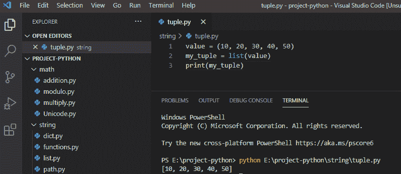

# Python 将元组转换为列表

> 原文：<https://pythonguides.com/python-convert-tuple-to-list/>

[](https://sharepointsky.teachable.com/p/python-and-machine-learning-training-course)

在本 [Python 教程](https://pythonguides.com/python-programming-for-the-absolute-beginner/)中，我们将讨论如何在 python 中**将 tuple 转换为 list。此外，我们还将讨论:**

*   Python 将元组转换为列表
*   Python 将元组转换为字典
*   Python 将元组转换为字符串
*   Python 将列表转换为元组
*   Python 将元组转换为数组

Python 中如何把元组转换成列表？**要将 tuple 转换成 list Python，我们可以使用 list()函数值= (10，20，30，40，50)；my_tuple = list(value)**

目录

[](#)

*   [Python 将元组转换为列表](#Python_convert_tuple_to_list "Python convert tuple to list")
*   [Python 将元组转换成字典](#Python_convert_tuple_to_dictionary "Python convert tuple to dictionary")
*   [Python 将元组转换成字符串](#Python_convert_a_tuple_to_string "Python convert a tuple to string")
*   [Python 将列表转换成元组](#Python_convert_list_to_a_tuple "Python convert list to a tuple")
*   [Python 将元组转换成数组](#Python_convert_a_tuple_to_an_array "Python convert a tuple to an array")

## Python 将元组转换为列表

我们可以在 Python 中使用 `list()` 函数**将元组转换为列表。**

**举例:**

```py
value = (10, 20, 30, 40, 50)
my_tuple = list(value)
print(my_tuple)
```

写完上面的代码后，你将打印出 `" my_tuple "` ，然后输出将显示为 **" [10，20，30，40，50] "** 。

这里，list()函数将把元组转换成列表。参考 python 将元组转换为列表的截图。



这样，我们就可以在 python 中将一个 tuple 转换成 list。

读取 [Python 字符串以列出](https://pythonguides.com/python-string-to-list/)

## Python 将元组转换成字典

在 python 中，为了将元组转换成字典，我们将使用 `dict()` 函数和元组作为参数。它将包含键值对。

**举例:**

```py
value = ((20, 'Ahana'), (21, 'Tom'))
my_dictionary = dict(value)
print(my_dictionary)
```

写完上面的代码(Python 将 tuple 转换为 dictionary)，你将打印出 `" my_dictionary "` ，然后输出将显示为 **" {20: 'Ahana '，21: 'Tom'} "** 。这里，dict()函数将把元组转换成字典。

可以参考下面 **python 将元组转换成字典**的截图。


convert tuple to dictionary in python

这样我们就可以用 python 把一个 tuple 转换成[字典。](https://pythonguides.com/create-a-dictionary-in-python/)

您可能会喜欢以下 Python 字典教程:

*   [Python 字典追加示例](https://pythonguides.com/python-dictionary-append/)
*   [Python 字典方法+示例](https://pythonguides.com/python-dictionary-methods/)

## Python 将元组转换成字符串

在 python 中，为了将 tuple 转换成 string，我们将使用 `join()` 方法来附加 tuple 的所有元素以形成一个 string。

**举例:**

```py
value = ('s', 't', 'r', 'i', 'n', 'g')
my_string = ''.join(value)
print(my_string)
```

写完上面的代码(Python 将 tuple 转换成 string)，你将打印出 `" my_string "` ，然后输出将显示为 `" string "` 。在这里，join()函数将追加所有条目，并将元组转换为字符串。

可以参考下面 **python 将 tuple 转换成 string** 的截图。


convert tuple to string python

这样，我们就可以在 python 中将一个 tuple 转换成 string。

您可能会喜欢以下 Python 字符串教程:

*   [如何在 Python 中创建字符串](https://pythonguides.com/create-a-string-in-python/)
*   [如何在 python 中使用正则表达式拆分字符串](https://pythonguides.com/python-split-string-regex/)
*   [如何在 python 中连接字符串](https://pythonguides.com/concatenate-strings-in-python/)
*   [如何在 python 中把整数转换成字符串](https://pythonguides.com/convert-an-integer-to-string-in-python/)
*   [Python 将列表转换成字符串](https://pythonguides.com/python-convert-list-to-string/)
*   [Python 字符串函数](https://pythonguides.com/string-methods-in-python/)
*   [如何用 Python 将列表转换成数据帧](https://pythonguides.com/convert-a-list-to-dataframe-in-python/)
*   [Python 二分搜索法和线性搜索](https://pythonguides.com/python-binary-search/)

## Python 将列表转换成元组

在 python 中，为了将列表转换成元组，我们将使用 `tuple()` 方法将列表转换成元组。

**举例:**

```py
value = ['Tim', 'John', 'Mark']
my_tuple = tuple(value)
print(my_tuple)
```

写完上面的代码(Python 将 list 转换为 tuple)，你将打印出 `" my_tuple "` ，然后输出将显示为 **" ('Tim '，' John '，' Mark') "** 。这里，tuple()方法将把列表转换成一个元组。

关于 **python 将 list 转换成 tuple** 可以参考下面的截图。


convert list to a tuple in python

## Python 将元组转换成数组

在 python 中，为了将元组转换成数组，我们将使用 python 中的 list 构造函数。

**举例:**

```py
my_tuple = (101, 102, 103)
value = list(my_tuple)
print(value)
```

写完上面的代码(Python 将一个元组转换成一个数组)，你将打印出 `" value "` ，然后输出将显示为 **" [101，102，103] "** 。这里，元组将被转换为数组列表。

你可以参考下面的截图将一个元组转换成一个数组


Python convert a tuple to an array

这样，我们就可以**用 python** 把 list 转换成 tuple。

您可能会喜欢以下 Python 列表教程:

*   [如何在 Python 中创建列表](https://pythonguides.com/create-list-in-python/)
*   [11 Python 列表方法](https://pythonguides.com/python-list-methods/)
*   [Python 将列表转换成字符串](https://pythonguides.com/python-convert-list-to-string/)
*   [在 Python 中检查列表是否为空](https://pythonguides.com/check-if-a-list-is-empty-in-python/)
*   [Python 元组排序列表](https://pythonguides.com/python-sort-list-of-tuples/)
*   [在 Python 中创建一个元组](https://pythonguides.com/create-a-tuple-in-python/)
*   [Python 数组与示例](https://pythonguides.com/python-array/)
*   Python 中的[函数](https://pythonguides.com/function-in-python/)
*   [Python 读取 CSV 文件并写入 CSV 文件](https://pythonguides.com/python-read-csv-file/)
*   [Python 退出命令](https://pythonguides.com/python-exit-command/)
*   [Python 串联元组](https://pythonguides.com/python-concatenate-tuples/)

在本教程中，我们学习了如何在 Python 中将 tuple 转换为 list，Python 将 tuple 转换为 dictionary，Python 将 tuple 转换为 string，Python 将 list 转换为 tuple，Python 将 tuple 转换为 array。

[Bijay Kumar](https://pythonguides.com/author/fewlines4biju/)

Python 是美国最流行的语言之一。我从事 Python 工作已经有很长时间了，我在与 Tkinter、Pandas、NumPy、Turtle、Django、Matplotlib、Tensorflow、Scipy、Scikit-Learn 等各种库合作方面拥有专业知识。我有与美国、加拿大、英国、澳大利亚、新西兰等国家的各种客户合作的经验。查看我的个人资料。

[enjoysharepoint.com/](https://enjoysharepoint.com/)[](https://www.facebook.com/fewlines4biju "Facebook")[](https://www.linkedin.com/in/fewlines4biju/ "Linkedin")[](https://twitter.com/fewlines4biju "Twitter")