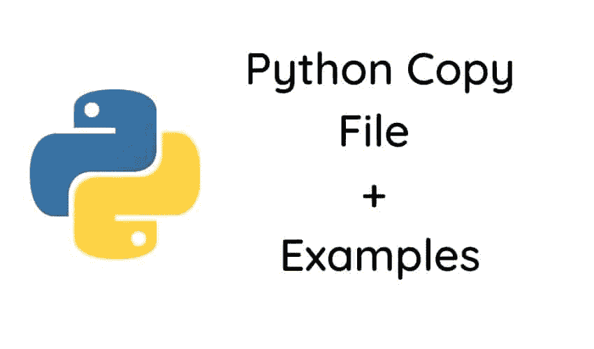
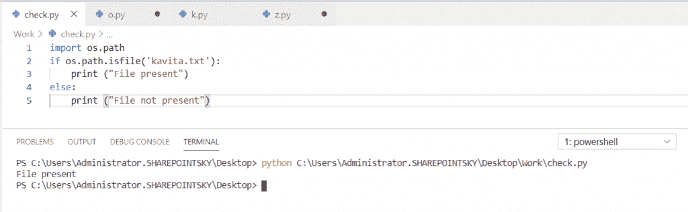
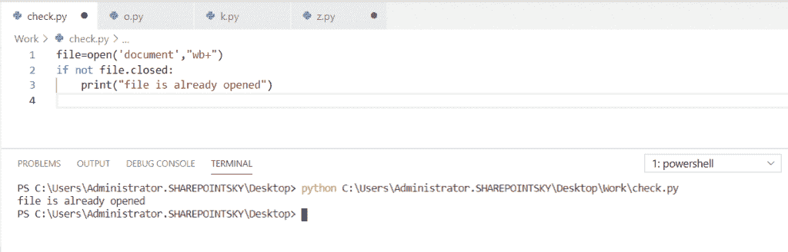
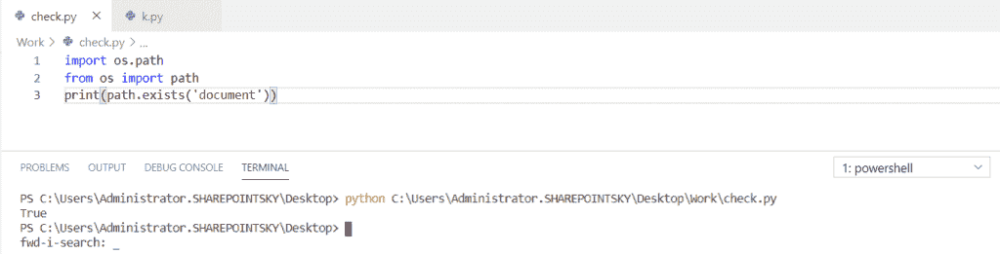

# Python 复制文件(示例)

> 原文：<https://pythonguides.com/python-copy-file/>

[](https://sharepointsky.teachable.com/p/python-and-machine-learning-training-course)

在本 [python 教程中，](https://pythonguides.com/python-hello-world-program/)我们将讨论 **Python 复制文件**。我们还将检查:

*   Python 将文件复制到文件夹
*   Python 将文件从一个位置复制到另一个位置
*   Python 将文件从一个目录复制到另一个目录
*   Python 将文件复制到 USB
*   Python 将文件内容复制到另一个文件
*   Python 复制文件并重命名
*   Python 将文件从子文件夹复制到一个文件夹
*   Python 将文件复制到当前目录
*   Python 逐行复制文件
*   Python 复制文件覆盖

让我们用几个例子来看看如何在 Python 中复制文件。



Python copy file

目录

[](#)

*   [Python shutil.copy()方法](#Python_shutilcopymethod "Python shutil.copy()method")
*   [Python 将文件复制到文件夹](#Python_copy_file_to_folder "Python copy file to folder")
*   [Python 将文件从一个位置复制到另一个位置](#Python_copy_files_from_one_location_to_another "Python copy files from one location to another")
*   [Python 将文件从一个目录复制到另一个目录](#Python_copy_file_from_one_directory_to_another "Python copy file from one directory to another")
*   [Python 将文件复制到 USB](#Python_copy_file_to_USB "Python copy file to USB")
*   [Python 将文件内容复制到另一个文件](#Python_copy_file_content_to_another_file "Python copy file content to another file")
*   [Python 复制文件并重命名](#Python_copy_file_and_rename "Python copy file and rename")
*   [Python 将文件从子文件夹复制到一个文件夹](#Python_copy_file_from_subfolders_to_one_folder "Python copy file from subfolders to one folder")
*   [Python 复制文件到当前目录](#Python_copy_file_to_the_current_directory "Python copy file to the current directory")
*   [Python 逐行复制文件](#Python_copy_file_line_by_line "Python copy file line by line")
*   [Python 复制文件覆盖](#Python_copy_file_overwrite "Python copy file overwrite")
*   [Python 检查文件是否打开](#Python_check_if_a_file_is_open "Python check if a file is open")
*   [Python 检查文件是否已经打开](#Python_check_if_a_file_is_already_opened "Python check if a file is already opened")
*   [Python 检查文件是否存在](#Python_check_if_a_file_exists "Python check if a file exists")

## Python shutil.copy()方法

Python 中的 `shutil.copy()` 方法用于将文件或目录从源位置复制到目标位置。源必须代表文件，目标可以是文件或目录。

这个函数提供了对文件的收集和操作，也有助于文件和目录的复制和删除。

检出[文件不存在 Python](https://pythonguides.com/file-does-not-exist-python/) 。

## Python 将文件复制到文件夹

现在，我们可以看到**如何在 python 中复制文件**。

*   在这个例子中，我导入了两个名为 shutil、和 `os` 的**模块。这个模块有助于自动复制和删除文件和目录。**
*   我们必须为源和目的地写一个路径。我们必须使用 **shutil.copyfile(src，dst)** 将文件从源位置复制到目标位置。**伴随着路径，文件的名字和它的扩展名**应该被写。
*   src = r'C:\Users\Administrator。SharePoint sky \ Desktop \ Work \ name . txt '是源路径。 `name.txt` 是我用**创建的文件名。txt** 分机。
*   dst = r'C:\Users\Administrator。SharePoint sky \ Desktop \ new folder \ name . txt '是目标路径。在这里，我创建了一个名为 **`Newfolder`** 的文件夹来复制 `Newfolder` 中的 **`name.txt`** 文件。

示例:

```py
import shutil
import os
src = r'C:\Users\Administrator.SHAREPOINTSKY\Desktop\Work\name.txt'
dst =  r'C:\Users\Administrator.SHAREPOINTSKY\Desktop\Newfolder\name.txt'
shutil.copyfile(src, dst)
```

## Python 将文件从一个位置复制到另一个位置

在这里，我们可以看到**如何用 Python 将文件从一个位置复制到另一个位置**

*   在这个例子中，我导入了两个模块，分别叫做 `shutil` 和 **os。**在这里， `shutil` 模块有助于自动化复制和删除文件和目录的过程。
*   `src`= r ' c:\ new file \ file 2 . txt '是源路径。 `file2.txt` 是我用**创建的文件名。txt** 分机。
*   `dst` = r'D:\file2.txt '目标路径。 `file2.txt` 是我用**创建的文件名。txt** 分机。
*   在这里，我已经将文件从 **C 盘**复制到了 **D 盘**
*   要将文件从一个位置复制到另一个位置，我们必须使用 **shutil.copyfile(src，dst)** 。

示例:

```py
import shutil
import os
src= r'C:\Newfile\file2.txt'
dst = r'D:\file2.txt'
shutil.copyfile(src, dst)
```

## Python 将文件从一个目录复制到另一个目录

在这里，我们可以看到**如何在 Python** 中将文件从一个目录复制到另一个目录。

*   在这个例子中，我用 Python 导入了名为 `shutil` 和 `os` 的模块。 `shutil` 模块有助于自动复制和删除文件和目录。
*   r'C:\Users\Administrator。“SharePoint sky \ Desktop \ Work \ file 2 . txt”是源路径。 `file2.txt` 是带有**的文件名。txt** 分机。
*   dst =r ' c:\ Users \ Administrator。“SharePoint sky \ Desktop \ new folder \ file 2 . txt”是目标路径。 `file2.txt` 是带有**的文件名。txt** 分机。
*   **工作和新文件夹**是两个目录。
*   要将文件从一个目录复制到另一个目录，我们必须使用 **shutil.copyfile(src，dst)** 。

示例:

```py
import shutil
import os
src = r'C:\Users\Administrator.SHAREPOINTSKY\Desktop\Work\file2.txt'
dst = r'C:\Users\Administrator.SHAREPOINTSKY\Desktop\Newfolder\file2.txt'
shutil.copyfile(src, dst)
```

示例:

## Python 将文件复制到 USB

在这里，我们可以看到**如何用 Python 将一个文件复制到 USB** 中。

*   在这个例子中，我导入了名为 `shutil` 和 **os 的模块。**`shutil`模块有助于自动复制和删除文件和目录。
*   我已经用 **shutil.copy(src，dst)** 把文件拷贝到 USB。
*   r'C:\Users\Administrator。SharePoint sky \ Desktop \ Work \ name . txt 是文件的路径， `name.txt` 是我用**创建的文件名。txt** 分机。
*   “r'D:\lakshmi\name.txt”是 USB 的路径。 `name.txt` 是我用**创建的文件名。txt** 分机。在这个" `lakshm` i "是文件夹名，文件名是 `name.txt` ，它被复制到**" r ' d:\ Lakshmi \ name . txt ' "**(也就是我们的 u 盘)。
*   除了路径之外，还应该写下文件名及其扩展名。

示例:

```py
import shutil
shutil.copy(src=r'C:\Users\Administrator.SHAREPOINTSKY\Desktop\Work\name.txt', dst=r'D:\lakshmi\name.txt') 
```

这就是如何在 Python 中**将文件复制到 USB。**

## Python 将文件内容复制到另一个文件

现在，我们可以看到**如何在 Python 中将文件内容复制到另一个文件**中。

*   在这个例子中，我导入了两个模块，分别叫做 `os` 和 `sys` 。**系统**模块提供用于操作程序的函数和变量。
*   f = open(r ' c:\ Users \ Administrator。' SharePoint sky \ Desktop \ Work \ employee . txt '，" r") 为源路径。 `employee.txt` 是我用**创建的文件名。txt** 分机。
*   copy = open(r ' c:\ Users \ Administrator。' SharePoint sky \ Desktop \ new folder \ employee . txt '，" wt") 是目的路径。 `employee.txt` 是我用**创建的文件名。txt** 分机。
*   `line = f.read()` 从一个文件中读取指定的字节到另一个文件中。
*   `copy.write(str(line))` 用于写入文件中的每一行。
*   `f.close` 用于关闭打开的文件。在 python 中迭代文件时需要使用 `copy.close()` 。

示例:

```py
import os
import sys
f = open(r'C:\Users\Administrator.SHAREPOINTSKY\Desktop\Work\employee.txt',"r")
copy = open(r'C:\Users\Administrator.SHAREPOINTSKY\Desktop\Newfolder\employee.txt',"wt")
line = f.read()
copy.write(str(line))
f.close()
copy.close()
```

这就是我们如何在 Python 中**将文件内容复制到另一个文件。**

## Python 复制文件并重命名

在这里，我们可以看到**如何在 Python 中复制文件和重命名**。

*   在这个例子中，我导入了名为 `shutil` 和 **os 的 Python 模块。**
*   首先，我们必须将文件从源位置复制到目标位置，然后重命名复制的文件。
*   src= r ' c:\ Users \ Administrator。“SharePoint sky \ Desktop \ Work \ name . txt”是源路径。 `name.txt` 是我用**创建的文件名。txt** 分机。
*   dst= r ' c:\ Users \ Administrator。“SharePoint sky \ Desktop \ new folder \ name . txt”是目标路径。 `name.txt` 是我用**创建的文件名。txt** 分机。
*   `os.rename` 用于重命名文件夹名称。为了重命名文件，我使用了**OS . rename(r ' c:\ Users \ Administrator。' SharePoint sky \ Desktop \ Work \ name . txt '，r'C:\Users\Administrator。SharePoint sky \ Desktop \ new folder \ details . txt ')**
*   **shutil.copyfile(src，dst)** 用于将文件从源位置复制到目标位置。
*   `name.txt` 文件名现在被重新命名为 `details.txt` 。

示例:

```py
import shutil
import os
src = r'C:\Users\Administrator.SHAREPOINTSKY\Desktop\Work\name.txt'
dst = r'C:\Users\Administrator.SHAREPOINTSKY\Desktop\Newfolder\name.txt'

shutil.copyfile(src, dst)

os.rename(r'C:\Users\Administrator.SHAREPOINTSKY\Desktop\Work\name.txt',r'C:\Users\Administrator.SHAREPOINTSKY\Desktop\Newfolder\details.txt' )
```

上面的代码，我们可以用 Python 中的**复制文件并重命名**。

## Python 将文件从子文件夹复制到一个文件夹

在这里，我们将看到**如何在 Python 中将文件从子文件夹复制到一个文件夹**。

*   在这个例子中，我使用了两个模块，分别叫做 **shutil、**和 os。 `shutil` 模块有助于自动复制和删除文件和目录。
*   操作系统模块包括许多功能，比如与文件系统交互。
*   src= r'C:\Users\Administrator。SharePoint sky \ Desktop \ Work \ office \ employee . txt '。是源路径， `employee.txt` 是我用**创建的文件名。txt** 分机。
*   dst = r'C:\Users\Administrator。SharePoint sky \ Desktop \ new folder \ employee . txt'。是目标路径。 `employee.txt` 是我用**创建的文件名。txt** 分机。
*   在这个例子中，**办公室是子文件夹**，而**新文件夹**是**另一个文件夹**。

示例:

```py
import shutil
import os
src =  r'C:\Users\Administrator.SHAREPOINTSKY\Desktop\Work\office\employee.txt'
dst = r'C:\Users\Administrator.SHAREPOINTSKY\Desktop\Newfolder\employee.txt'
shutil.copyfile(src, dst) 
```

这就是如何在 Python 中**将文件从子文件夹复制到一个文件夹。**

## Python 将文件复制到当前目录

现在，我们可以看到**如何在 Python 中将文件复制到当前目录**中。

*   在这个例子中，我使用了两个模块，分别叫做 `shutil` 和 `os` 。 `shutil` 模块有助于自动复制和删除文件和目录。
*   os 模块包括许多功能，比如与文件系统交互。
*   src= r ' c:\ Users \ Administrator。“SharePoint sky \ Desktop \ Work \ office \ employee . txt”是源路径。 `employee.txt` 是我用**创建的文件名。txt** 分机。
*   dst= r ' c:\ Users \ Administrator。“SharePoint sky \ Desktop \ Work \ employee . txt”是目标路径。 `employee.txt` 是我用**创建的文件名。txt** 分机。
*   `Work` 在本例中是当前目录。
*   shutil.copyfile(src，dst)用于将文件复制到当前目录。

示例:

```py
import shutil
import os
src = r'C:\Users\Administrator.SHAREPOINTSKY\Desktop\Work\office\employee.txt'
dst = r'C:\Users\Administrator.SHAREPOINTSKY\Desktop\Work\employee.txt'
shutil.copyfile(src, dst) 
```

这就是如何在 Python 中**将文件复制到当前目录。**

## Python 逐行复制文件

现在，我们可以看到**如何在 python 中逐行复制文件**。

*   在这个例子中，我导入了两个模块，分别叫做 `os` 和 `sys` 。sys 模块提供了用于操作程序的函数和变量。
*   src = open(r ' c:\ Users \ Administrator。' SharePoint sky \ Desktop \ Work \ employee . txt '，" r ")是源路径。 `employee.txt` 是我用**创建的文件名。txt** 扩展名。
*   dst = open(r ' c:\ Users \ Administrator。' SharePoint sky \ Desktop \ new folder \ employee . txt '，" wt ")是目标路径。 `employee.txt` 是我用**创建的文件名。txt** 扩展名。
*   我已经使用迭代函数在范围 **i = 1 和 i < 3** 内迭代文件对象。因此，文件中只有 2 行将被复制。****【str(line))**用于将单个字符串写入文件。**
*   ****【r】**模式用于读取文件，**【wt】**模式用于写入文件。 `f.close` 用于关闭文件。**
*   **`f.read` 从文件中返回指定的字节数。**

 **示例:

```py
import os
import sys
i = 1
src = open(r'C:\Users\Administrator.SHAREPOINTSKY\Desktop\Work\employee.txt',"r")
dst = open(r'C:\Users\Administrator.SHAREPOINTSKY\Desktop\Newfolder\employee.txt',"wt")
while i < 3:
    line = f.readline()
copy.write(str(line))
i = i +1
f.close()
copy.close()
```

这就是如何在 Python 中**逐行复制文件。**

## Python 复制文件覆盖

在这里，我们可以看到**如何在 python 中复制文件和覆盖**。

*   在这个例子中，我导入了一个名为 shutil 的**模块、**和 `os` 。 `shutil` 模块有助于自动复制和删除文件和目录。
*   src = r'C:\Users\Administrator。' SharePoint sky \ Desktop \ Work \ employee . txt '。是源文件的路径。 `employee.txt` 是我用**创建的文件名。txt** 分机。
*   dst = r'C:\Users\Administrator。' SharePoint sky \ Desktop \ Work \ employee . txt '。是目标文件的路径。 `employee.txt` 是我用**创建的文件名。txt** 分机。
*   **shutil.move(src，dst)** 用于将文件从源位置复制到目标位置。
*   如果文件已经存在，它将被移动到另一个目录，然后文件被覆盖。 **shutil.move(src，dst)** 用于移动文件和覆盖。**作品**是文件夹名。

示例:

```py
import shutil
import os
src = r'C:\Users\Administrator.SHAREPOINTSKY\Desktop\Work\employee.txt'
dst = r'C:\Users\Administrator.SHAREPOINTSKY\Desktop\Work\employee.txt'
shutil.move(src, dst)
```

## Python 检查文件是否打开

这里，我们将看到**如何使用 python 中的 os.system** 来检查文件是否存在。

*   在这个例子中，我导入了一个名为 `os.path` 的模块。这个模块是操作系统的路径模块。它用于本地路径。
*   `if os.path.isfile()` 是用于检查给定文件是否存在的方法。**‘kavita . txt’**是文件名。这里使用 `else` 条件来检查条件是否为真，然后返回存在的文件，否则返回不存在的文件。

示例:

```py
import os.path
if os.path.isfile('kavita.txt'):
    print ("File present")
else:
    print ("File not present")
```

当文件存在时，它在输出中返回文件存在。您可以参考下面的输出截图。



Python check if a file is open with os.system

这就是如何在 Python 中**检查文件是否打开。**

## Python 检查文件是否已经打开

在这里，我们可以看到**如何在 python 中检查文件是否已经打开**

在本例中，我已经使用**“w b+”模式**打开了一个名为**文档**的文件，该模式用于读取和写入文件，当文件被创建并且已经存在时，它会给出输出，因为文件已经被打开。**‘文档’**是文件名。

示例:

```py
file=open('document',"wb+")
if not file.closed:
    print("file is already opened")
```

为了检查文件是否已经打开，我使用了 **print(“文件已经打开”)**。您可以参考下面的输出截图。



Python check if a file is already opened

这就是如何**检查一个文件是否已经在 Python** 中打开。

## Python 检查文件是否存在

现在，我们可以看到**如何在 python 中检查一个文件是否存在**。

*   在这个例子中，我导入了一个名为 `os.path` 的模块。该模块是操作系统的路径模块，用于本地路径。
*   `path.exists()` 是一个方法，如果文件存在则返回 `true` ，否则返回 **false。**这里，**‘文档’**是文件名。

示例:

```py
import os.path
from os import path
print(path.exists('document')) 
```

为了检查文件是否存在，我使用了**print(path . exists(' document '))**。下面的截图显示了输出。



Python check if a file exists

上面的编码器，我们可以用来**检查一个文件是否存在于 Python** 中。

您可能会喜欢以下 Python 教程:

*   [Python 文件方法(附有用例子)](https://pythonguides.com/python-file-methods/)
*   [Python tkinter messagebox +示例](https://pythonguides.com/python-tkinter-messagebox/)
*   [集合的并集 Python +实例](https://pythonguides.com/union-of-sets-python/)
*   [Python 接口介绍](https://pythonguides.com/python-interface/)
*   [如何在 Python 中把字符串转换成日期时间](https://pythonguides.com/convert-a-string-to-datetime-in-python/)
*   [Python 中的转义序列](https://pythonguides.com/escape-sequence-in-python/)
*   [Python 列表理解λ](https://pythonguides.com/python-list-comprehension/)
*   [Python 线程和多线程](https://pythonguides.com/python-threading-and-multithreading/)
*   [如何将 Python 角度转换为弧度](https://pythonguides.com/python-degrees-to-radians/)
*   [Python 比较运算符](https://pythonguides.com/python-comparison-operators/)
*   [Python 从列表中选择](https://pythonguides.com/python-select-from-a-list/)

在本 Python 教程中，我们学习了 Python 中的**复制文件。此外，我们还讨论了以下主题:**

*   Python 将文件复制到文件夹
*   Python 将文件从一个位置复制到另一个位置
*   Python 将文件从一个目录复制到另一个目录
*   Python 将文件复制到 USB
*   Python 将文件内容复制到另一个文件
*   Python 复制文件并重命名
*   Python 将文件从子文件夹复制到一个文件夹
*   Python 将文件复制到当前目录
*   Python 逐行复制文件
*   Python 复制文件覆盖

[Bijay Kumar](https://pythonguides.com/author/fewlines4biju/)

Python 是美国最流行的语言之一。我从事 Python 工作已经有很长时间了，我在与 Tkinter、Pandas、NumPy、Turtle、Django、Matplotlib、Tensorflow、Scipy、Scikit-Learn 等各种库合作方面拥有专业知识。我有与美国、加拿大、英国、澳大利亚、新西兰等国家的各种客户合作的经验。查看我的个人资料。

[enjoysharepoint.com/](https://enjoysharepoint.com/)[](https://www.facebook.com/fewlines4biju "Facebook")[](https://www.linkedin.com/in/fewlines4biju/ "Linkedin")[](https://twitter.com/fewlines4biju "Twitter")**