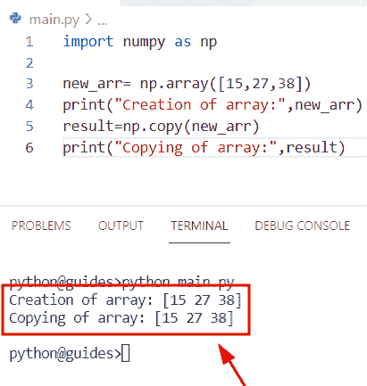
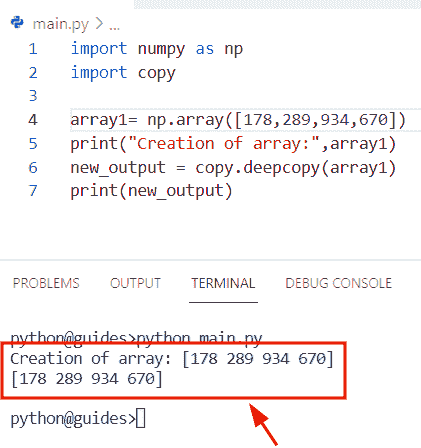

# Python 复制 NumPy 数组

> 原文：<https://pythonguides.com/python-copy-numpy-array/>

[](https://sharepointsky.teachable.com/p/python-and-machine-learning-training-course)

在这个 [Python NumPy 教程](https://pythonguides.com/numpy/)中，我们将学习**如何在 Python** 中复制 NumPy 数组。通过 **Python NumPy 复制函数**，我们将涵盖这些主题。

*   Python 复制 numpy 数组未引用
*   Python 将 numpy 数组复制到剪贴板
*   Python 重复 numpy 数组
*   Python 将列表复制到 numpy 数组
*   Python 复制 numpy 数组的一部分
*   Python 将数据复制到 numpy 数组
*   Python 深度复制 numpy 数组

目录

[](#)

*   [Python 复制 numpy 数组](#Python_copy_numpy_array "Python copy numpy array")
*   [Python 复制 numpy 数组不引用](#Python_copy_numpy_array_not_reference "Python copy numpy array not reference")
*   [Python 将 numpy 数组复制到剪贴板](#Python_copy_numpy_array_to_clipboard "Python copy numpy array to clipboard")
*   [Python 重复 numpy 数组](#Python_duplicate_numpy_array "Python duplicate numpy array")
*   [Python 将列表复制到 numpy 数组](#Python_copy_list_to_numpy_array "Python copy list to numpy array")
*   [Python 复制 numpy 数组的一部分](#Python_copy_part_of_numpy_array "Python copy part of numpy array")
*   [Python 将数据复制到 numpy 数组](#Python_copy_data_to_numpy_array "Python copy data to numpy array")
*   [Python 深度复制 numpy 数组](#Python_deep_copy_numpy_array "Python deep copy numpy array")

## Python 复制 numpy 数组

*   在这一节中，我们将讨论如何在 Python numpy 数组中用另一个数组复制一个 [numpy 数组](https://pythonguides.com/python-numpy-array/)。
*   在 Python 中，numpy 模块提供了一个 `numpy.copy()` 函数，这个函数将帮助用户将一个 numpy 数组复制到另一个数组中。
*   例如，我们有一个原始数组，我们想从原始数组中获取新的实例。简而言之，我们可以说将数组数据复制到另一个数组。

**语法:**

让我们看一下语法，了解一下 `Python numpy.copy()` 函数的工作原理。

```py
numpy.copy
          (
           a,
           order='K',
           subok=False
          )
```

*   它由几个参数组成
    *   **a:** 该参数表示输入的数组数据
    *   **order:** 默认取**‘K’**值，表示数组的布局。
    *   **subok:** 这是一个可选参数，默认情况下，它采用**‘False’**值。

**举例:**

让我们举一个例子，看看如何使用 `numpy.copy()` 函数将 numpy 数组复制到另一个数组中

**源代码:**

```py
import numpy as np

new_arr= np.array([15,27,38])
print("Creation of array:",new_arr)
result=np.copy(new_arr)
print("Copying of array:",result)
```

在上面的代码中，我们首先导入了 numpy 库，然后使用 `np.array()` 函数来创建一个 numpy 数组。之后，我们声明了一个变量**‘结果’**，并分配了一个 `numpy.copy()` 函数。这个函数将帮助用户返回一个新的 numpy 数组，其元素值与原始数组的元素值完全相同。

下面是以下给定代码的实现。



Python copy numpy array

另外，阅读:[检查 Python 中的 NumPy 数组是否为空](https://pythonguides.com/check-if-numpy-array-is-empty/)

## Python 复制 numpy 数组不引用

在这个例子中，我们将使用 `deepcopy()` 方法，因为**浅拷贝**将对象的引用存储在内存中，而深拷贝生成一个新的复合对象。

**举例:**

```py
import numpy as np
import copy

array1= np.array([178,289,934,670])
print("Creation of array:",array1)
new_output = copy.deepcopy(array1)
print(new_output)
```

在上面的代码中，我们使用了 `copy.deepcopy()` 方法，在这个方法中，我们将数组作为参数传递。一旦你打印了**‘new _ output’**，那么结果将显示原始数组中存在的元素。

你可以参考下面的截图。



Python copy numpy array not reference

阅读: [Python 反向 NumPy 数组](https://pythonguides.com/python-reverse-numpy-array/)

## Python 将 numpy 数组复制到剪贴板

*   在这个程序中，我们将讨论如何使用剪贴板将 Python numpy 数组中的原始元素复制到另一个元素中。
*   为了执行这个特定的任务，我们将首先导入 pandas 和 numpy 库，然后使用 `np.array()` 函数初始化一个数组。接下来，我们将声明一个变量**‘df’**，并指定 `pd.dataframe()` 函数，在该函数中，我们必须将数组指定为参数。

**源代码**:

```py
import numpy as np
import pandas as pd

new_arr=np.array([16,23,45,67,89])
df = pd.DataFrame(new_arr)
df.to_clipboard(index=True)
print(df)
```

下面是下面给出的代码的截图。


Python copy numpy array to clipboard

阅读: [Python 排序 NumPy 数组](https://pythonguides.com/python-sort-numpy-array/)

## Python 重复 numpy 数组

*   在这一节中，我们将讨论如何从原始数组中获取重复值。
*   在 Python 中， `numpy.tile()` 函数用于重复数组中出现的值的数量。例如，假设我们有一个包含**【16，56，92，67】**的 numpy 数组，那么这个函数将帮助用户一次性获得重复的元素，并创建一个新的 numpy 数组。
*   该方法在 NumPy 包模块中可用，并且总是返回平铺的输出数组。

**语法:**

下面是 `numpy.tile()` 函数的语法

```py
numpy.tile
          (
            A,
            reps
           )
```

*   它由几个参数组成
    *   **答:**该参数定义了输入数组。
    *   **reps:** 该参数表示如何沿轴重复数组和重复次数。

**举例:**

我们举个例子，了解一下 Python `numpy.tile()` 函数的工作原理。

**源代码:**

```py
import numpy as np

new_arr = np.array([16, 56, 92,67])
print("Creation of array:",new_arr)
result=np.tile(new_arr, 1)
print("Duplicated values:",result)
```

在下面给出的代码中，我们通过使用 `numpy.tile()` 函数简单地乘以了一个 numpy 数组。首先我们导入了 numpy 库，然后初始化了一个数组。然后使用 `numpy.tile()` 函数并传递**‘new _ arr’**和重复值作为参数。

下面是以下给定代码的执行。


Python duplicate numpy array

正如您在屏幕截图中看到的，输出显示了从原始阵列复制的新阵列。

阅读: [Python NumPy 2d 数组+示例](https://pythonguides.com/python-numpy-2d-array/)

## Python 将列表复制到 numpy 数组

*   这里我们可以看到如何用 Python 中的 numpy 数组复制列表元素。
*   为了完成这个任务，我们将使用 `numpy.asarray()` 函数。在 Python 中， `numpy.asarray()` 函数用于转换带有 numpy 数组的实例对象，对象将是列表、元组、字符串，该方法在 numpy 包模块中可用。
*   这个方法只接受很少的参数，并且总是返回一个包含 Python 列表中所有值的 numpy 数组。

**语法:**

让我们看一下语法，了解一下 `numpy.asarray()` 函数的工作原理。

```py
numpy.asarray
             (
              a,
              dtype=None,
              order=None,
              *
```

*   它由几个参数组成
    *   **a:** 该参数表示我们要用数组转换的输入数据。
    *   **dtype:** 默认情况下，它不取值，数据类型从输入数据中推断出来。
    *   **order:** 可选参数，用于 column-major 或 row-major。

**举例:**

让我们举一个例子，看看如何从一个列表中复制元素，并将它们存储到一个数组中。

**源代码:**

```py
import numpy as np

new_list=[16,25,87,93]
print("Creation of list:",new_list)
result=np.asarray(new_list)
print("Copy elements into array:",result)
```

在上面的代码中，我们导入了 numpy 库，然后初始化列出的输入数据。接下来，我们必须使用 np.asarray()函数，它会将列表转换为具有相同元素的数组。

下面是以下给定代码的实现。


Python copy list of numpy array

阅读: [Python NumPy 3d 数组+示例](https://pythonguides.com/python-numpy-3d-array/)

## Python 复制 numpy 数组的一部分

*   在这个程序中，我们将讨论如何在 Python 中复制 numpy 数组的元素。
*   通过使用赋值操作符，我们可以很容易地执行这项任务。首先，我们将导入 numpy 库，然后使用 `np.array()` 函数创建一个数组。之后，我们声明了一个变量**‘new _ arr 2’**，并将原数组**‘new _ arr’**赋值。
*   一旦您将打印 **'new_arr2'** ，那么输出将显示 numpy 原始数组的副本。

**源代码:**

```py
import numpy as np

new_arr = np.array([[8, 2, 3],
              [4, 7, 6]])
print("Creation of array:",new_arr)
new_arr2 = new_arr
print(" Coping elements into another array:",new_arr2)
```

你可以参考下面的截图。


Python copy part of numpy array

阅读: [Python NumPy Replace +示例](https://pythonguides.com/python-numpy-replace/)

## Python 将数据复制到 numpy 数组

*   在这一节中，我们将讨论如何在 Python 中从 numpy 数组复制数据。
*   为了执行这个特定的任务，我们将使用 `numpy.empty_like()` 函数。在 Python 中，该函数用于声明一个新数组，其大小和形状与原始数组相同。
*   该方法在 numpy 包模块中可用，原型的数据类型定义了返回的 Numpy 数组的相同属性。

**语法:**

下面是 Python`numpy . empty _ like()`函数的语法。

```py
numpy.empty_like
                (
                 prototype,
                 dtype=None,
                 order='K',
                 subok=True,
                 shape=None,
                )
```

*   它由几个参数组成
    *   **prototype:** 该参数表示返回的 numpy 数组的属性。
    *   **顺序:**默认取**‘K’**值，可以是**‘C’或‘F’**连续。
    *   **dtype:** 可选参数，不取值。

**举例:**

让我们举一个例子，看看如何用 Python 从 numpy 数组中复制数据。

**源代码:**

```py
import numpy as np

new_arr = ([17, 34, 98], 
           [56, 192, 345])
print("Creation of array:",new_arr)
new_output = np.empty_like(new_arr, dtype = int)
new_output[:]=new_arr
print("Copy array:",new_output)
```

在下面的代码中，我们导入了 numpy 库，然后初始化了一个数组。在那之后，我们声明一个变量并赋值给 `np.empty_like()` 函数，在这个函数中，我们将数组作为参数传递。

接下来，我们已经分配了一个数组进行复制，一旦您打印' `new_output` ，那么结果将显示相同的数组。

下面是以下给定代码的执行过程


Python copy data to numpy array

阅读: [Python NumPy 添加教程](https://pythonguides.com/python-numpy-add/)

## Python 深度复制 numpy 数组

*   在本节中，我们将讨论如何在 Python NumPy 数组中使用 `deep.copy()` 函数。
*   在 Python 中， `deepcopy()` 方法用于将给定数组的每个元素复制到被复制的数组中。
*   该方法在 NumPy 包模块中可用，它创建一个新对象并递归地添加复制值。该函数将一个数组作为参数，并返回 numpy 数组的深层副本。

**源代码:**

```py
import numpy as np
import copy

new_arr= np.array([45,26,78,91])
print("Creation of array:",new_arr)
result = copy.deepcopy(new_arr)
print(result)
```

下面是下面给出的代码的截图。


Python deep copy numpy array

另外，看看更多关于 Python NumPy 的教程。

*   [Python NumPy 索引–详细指南](https://pythonguides.com/python-numpy-indexing/)
*   [Python NumPy 过滤器+ 10 个例子](https://pythonguides.com/python-numpy-filter/)
*   [Python NumPy 最小教程](https://pythonguides.com/python-numpy-minimum/)
*   [Python NumPy Median +示例](https://pythonguides.com/python-numpy-median/)
*   [Python NumPy 删除–完整教程](https://pythonguides.com/python-numpy-delete/)

所以，在这个 Python NumPy 教程中，我们已经学习了**如何在 Python** 中复制 NumPy 数组。此外，通过 **Python NumPy 复制函数**，我们也涵盖了这些主题。

*   Python 复制 numpy 数组未引用
*   Python 将 numpy 数组复制到剪贴板
*   Python 重复 numpy 数组
*   Python 将列表复制到 numpy 数组
*   Python 复制 numpy 数组的一部分
*   Python 将数据复制到 numpy 数组
*   Python 深度复制 numpy 数组

[Bijay Kumar](https://pythonguides.com/author/fewlines4biju/)

Python 是美国最流行的语言之一。我从事 Python 工作已经有很长时间了，我在与 Tkinter、Pandas、NumPy、Turtle、Django、Matplotlib、Tensorflow、Scipy、Scikit-Learn 等各种库合作方面拥有专业知识。我有与美国、加拿大、英国、澳大利亚、新西兰等国家的各种客户合作的经验。查看我的个人资料。

[enjoysharepoint.com/](https://enjoysharepoint.com/)[](https://www.facebook.com/fewlines4biju "Facebook")[](https://www.linkedin.com/in/fewlines4biju/ "Linkedin")[](https://twitter.com/fewlines4biju "Twitter")