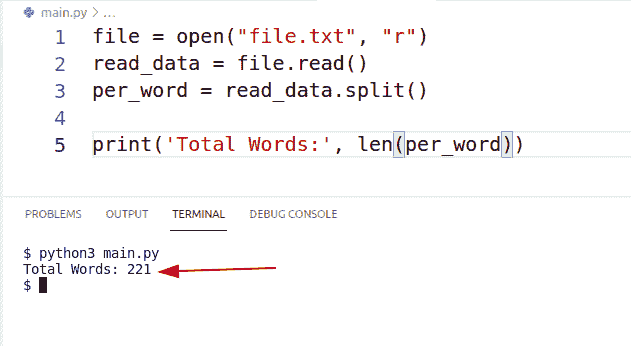
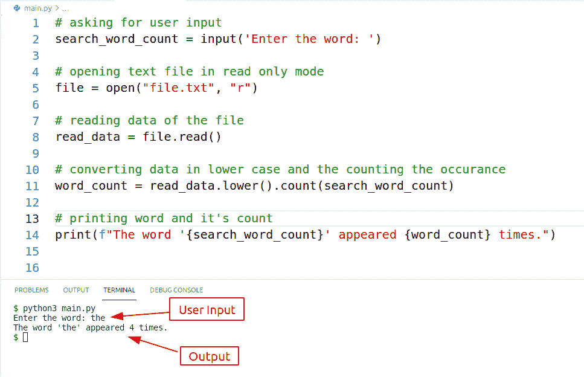
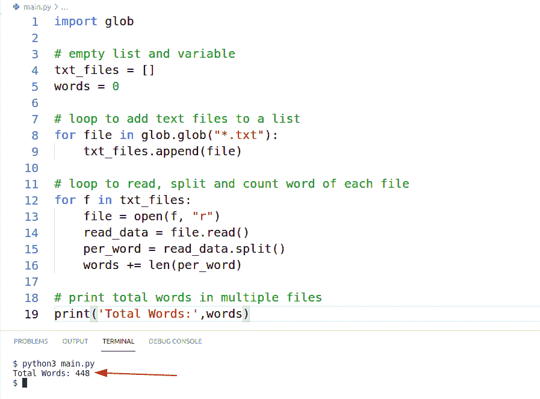
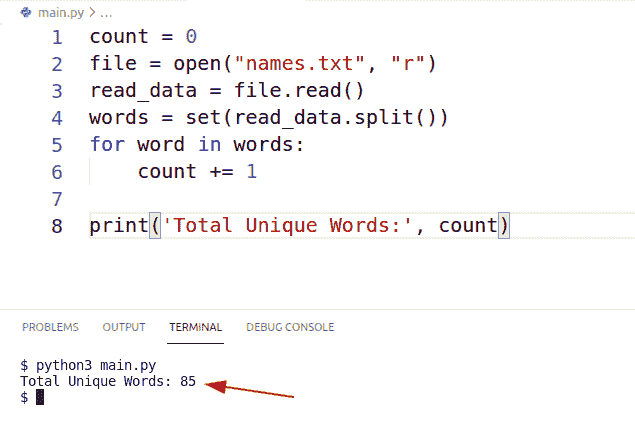

# Python 计算文件中的字数

> 原文：<https://pythonguides.com/python-count-words-in-file/>

[](https://sharepointsky.teachable.com/p/python-and-machine-learning-training-course)

在本 Python 教程中，我们将学习 **Python 对文件**中的单词进行计数。这里我们假设文件是一个简单的文本文件(。txt)。此外，我们将涵盖这些主题。

*   Python 计算文件中的字数
*   Python 计算文件中的特定单词
*   Python 计算多个文件中的单词
*   Python 计算唯一单词文件
*   Python 统计 Excel 文件中的字数
*   Python 计算文本文件中唯一单词
*   Python 程序计算文件中的字数
*   Python 统计文件中的词频
*   Python 字数 CSV 文件

目录

[](#)

*   [Python 统计文件中的字数](#Python_Count_Words_in_File "Python Count Words in File")
*   [Python 统计文件中的特定单词](#Python_Count_Specific_Words_in_File "Python Count Specific Words in File")
*   [Python 统计多个文件中的字数](#Python_Count_Words_in_Multiple_Files "Python Count Words in Multiple Files")
*   [Python 统计文件中的唯一单词](#Python_Count_Unique_Words_in_a_File "Python Count Unique Words in a File")
*   [Python 统计 Excel 文件中的字数](#Python_Count_Words_in_Excel_File "Python Count Words in Excel File")
*   [Python 统计文本文件中的唯一单词](#Python_Count_Unique_Words_in_Text_File "Python Count Unique Words in Text File")
*   [Python 程序计算文件字数](#Python_Program_to_Count_Number_of_Words_in_File "Python Program to Count Number of Words in File")
*   [Python 统计文件中的词频](#Python_Count_Word_Frequency_in_a_File "Python Count Word Frequency in a File")
*   [Python 字数 CSV 文件](#Python_Word_Count_CSV_File "Python Word Count CSV File")

## Python 统计文件中的字数

在这一节中，我们将学习 python 计算文件中的单词。换句话说，我们将学习使用 Python 计算文本文件的总字数。

*   整个过程分为三个简单的步骤:
    *   以只读模式打开文本文件
    *   读取文件信息
    *   把句子分解成单词，并找出 len。
*   使用`**file = open('file.txt', 'r')**`,我们可以以只读模式打开文件，并将该信息存储在文件变量中。
*   ``read_data = file.read()``该语句用于一次性读取全部数据，并存储在一个名为 read_data 的变量中。
*   是时候将句子拆分成单词了，这可以使用
    **`per_word = read_data.split()`** 来完成。这里使用 split()方法来拆分 read_data 中的每个句子，所有这些信息都存储在一个名为 per_word 的变量中。
*   最后一步是打印 per_word 变量的长度。请注意，lenght 是计算文件中的总字数。下面是打印总字数为`**print('Total Words: ', len(per_word))**`的消息的语句。

**源代码:**

下面是在文件中实现 Python 字数统计的源代码。

```py
file = open('file.txt', 'r')
read_data = file.read()
per_word = read_data.split()

print('Total Words:', len(per_word))
```

**输出:**

下面是使用 Python 对文件中的单词进行计数的输出。在这个输出中，我们使用的文本文件有 221 个单词。



Python Count Words in a File

阅读: [Python 计数器](https://pythonguides.com/python-counter/)

## Python 统计文件中的特定单词

在本节中，我们将了解到 **Python 对文件**中的特定单词进行计数。用户将提供任何单词，我们的程序将显示该单词的总出现次数。

*   特定单词的出现可以通过 5 个简单的步骤来计数:
    *   要求用户输入
    *   以只读模式打开文件
    *   读取文件的数据
    *   将数据转换成小写，并统计特定单词的出现次数
    *   打印计数
*   在这段代码中，用户输入被收集并存储在一个变量中。无论用户在这里输入什么单词，都将在文件中进行搜索。
*   txt 是一个以只读模式打开的文件，结果存储在“文件”变量中。
*   一旦我们打开了一个文件，下一步就是读取其中的数据，所以使用代码 **`read_data = file.read()`** 我们已经读取了整个数据，并将信息存储在一个名为‘read _ data’的变量中。
*   **word_count = read_data.lower()。count(search_word_count)** 在这段代码中，我们将数据转换为小写，并使用 count 方法搜索用户提供的单词。整个结果存储在一个名为“word_count”的变量中。
*   流程的最后一步是打印带有 count 的消息。我们使用格式化字符串来描述我们的消息。这是代码。
    **`print(f"The word '{search_word_count}' appeard {word_count} times.")`**

**源代码**

这里是完整的源代码来执行 python 计数文件中的特定单词。

```py
# asking for user input
search_word_count = input('Enter the word: ')

# opening text file in read only mode
file = open("file.txt", "r")

# reading data of the file
read_data = file.read()

# converting data in lower case and the counting the occurrence 
word_count = read_data.lower().count(search_word_count)

# printing word and it's count
print(f"The word '{search_word_count}' appeared {word_count} times.") 
```

**输出:**

下面是 Python Count 文件中特定单词的输出。在这个输出中，我们在一个文本文件中搜索单词“the”。结果显示,“The”在文本文件中出现了 4 次。



Python Count Specific Words in File

阅读: [Python 获取目录](https://pythonguides.com/python-get-all-files-in-directory/)中的所有文件

## Python 统计多个文件中的字数

在这一节中，我们将了解到 **Python 在多个文件中统计字数**。我们将使用三个文本文件，我们将计算所有这些文件中的字数。

*   从多个文件中统计单词可以通过五个简单的步骤来完成:
    *   在 Python 中导入 glob 模块
    *   创建一个空列表来存储文本文件和一个默认值为 0 的计数器。
    *   开始一个循环，使用 glob 识别文本文件，并将其添加到我们在上一步中创建的条目列表中。
    *   在空列表上开始另一个循环，文件总数将决定循环运行的次数。每次循环运行时，一个文件被打开、读取、拆分成单词，然后总单词长度被添加到单词变量中。
    *   最后打印单词变量和描述信息。
*   glob 用于返回带有特定扩展名的所有文件。因为我们需要所有的文件。txt 扩展名，所以我们在这里使用了 glob。
*   **`text_file=[]`** 这个空列表将存储所有的文件。txt 扩展名。 **`word=0`** 这将跟踪多个文件中的所有单词。

```py
for file in glob.glob("*.txt"):
    txt_files.append(file)
```

*   在这段代码中，我们开始了一个循环，glob 用于扫描所有文件。txt 扩展名。
*   每个文件都添加到一个空列表中。因此，每次循环运行时，当前文件夹中扩展名为 txt 的文件名都会添加到一个空列表中。

```py
for f in txt_files:
    file = open(f, "r")
    read_data = file.read()
    per_word = read_data.split()
    words += len(per_word)
```

*   在这段代码中，我们在空列表上开始了一个循环，因为空列表中并没有所有的文本文件。
*   每次循环运行时，打开并读取一个文件，所有的句子被拆分成单词，单词总数被添加到一个变量中。
*   这样，假设文件一有 20 个单词，文件二有 30 个单词，那么单词变量将在循环结束时显示 50 (20+30)个单词。
*   **`print('Total Words:',words)`** 总字都打印有描述性消息。

**源代码:**

下面是在多个文件中实现 Python 字数统计的源代码。

```py
import glob

# empty list and variable
txt_files = []
words = 0

# loop to add text files to a list
for file in glob.glob("*.txt"):
    txt_files.append(file)

# loop to read, split and count word of each file
for f in txt_files:
    file = open(f, "r")
    read_data = file.read()
    per_word = read_data.split()
    words += len(per_word)

# print total words in multiple files
print('Total Words:',words)
```

**输出:**

下面是上面的源代码在多个文件中实现 Python Count Words 的输出。



Python Count Words in Multiple Files

阅读: [Python 列表字典](https://pythonguides.com/python-dictionary-of-lists/)

## Python 统计文件中的唯一单词

在这一节中，我们将了解到 **Python 对文件**中的唯一字进行计数。python 程序将检查文本文件中每个单词的出现次数，然后只计算文件中唯一的单词。

*   使用 Python，我们可以通过六个简单的步骤来计算文件中的唯一单词:
    *   创建一个计数器，并将默认值赋为零
    *   以只读模式打开文件。
    *   读取文件数据
    *   将数据拆分成单词并存储在一个集合中
    *   开始一个 for 循环，并随着每个单词不断增加计数器。
    *   最终，打印计数器
*   ``count = 0`` 是默认值设置为零的计数器。该计数器稍后将递增。
*   **`file = open("names.txt", "r")`** 在这段代码中，我们以只读模式打开一个文本文件，信息存储在一个文件变量中。
*   **`read_data = file.read()`** 在这段代码中，我们正在读取存储在文件中的数据。
*   **`words = set(read_data.split())`** 在这段代码中，我们拆分了数据，也删除了重复的值。设置总是只保留唯一的数据。
*   我们已经在总字数上启动了一个 for 循环，每次循环运行时，计数器都加 1。因此，如果有 35 个唯一的字，那么循环将运行 35 次，计数器将有 35 次。
*   最后，count 作为输出被打印出来。

**源代码:**

下面是实现 Python 计算文件中唯一单词的源代码。

```py
count = 0
file = open("names.txt", "r")
read_data = file.read()
words = set(read_data.split())
for word in words:
    count += 1

print('Total Unique Words:', count)
```

**输出:**

下面是使用 Python 计算文件中唯一单词的程序输出。在这个输出中，我们读取了一个文件，其中有 85 个唯一的单词。



Python Count Unique Words File

阅读: [Python 字典转 CSV](https://pythonguides.com/python-dictionary-to-csv/)

## Python 统计 Excel 文件中的字数

在本节中，我们将学习 Excel 文件中的 **Python 统计单词。**

*   使用 python 计算 excel 文件字数的最好方法是使用 python 中的 Pandas 模块。
*   你需要在你的设备上安装熊猫

```py
# anaconda 
conda install pandas

# pip
pip install pandas
```

*   在 pandas 中使用 ``df.count()`` 方法，我们可以计算一个包含列的文件中的总字数。
*   使用 **`df.count().sum()`** 我们可以得到一个文件中总字数的最终值。
*   下面是在 Jupyter 笔记本上的实现。