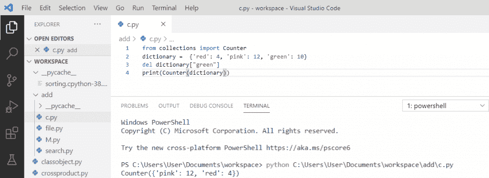

# Python 计数器–详细教程

> 原文：<https://pythonguides.com/python-counter/>

[](https://sharepointsky.teachable.com/p/python-and-machine-learning-training-course)

在本 [Python 教程](https://pythonguides.com/python-gui-programming/)中，我们将讨论****Python 计数器**。此外，我们将看到以下主题:**

 ***   python 计数器是什么？
*   计数器()python
*   Python 计数器字符串
*   Python 计数器列表
*   Python 计数器字典
*   Python 计数器元组
*   Python 更新计数器
*   Python 计数器减法()
*   从计数器中删除元素
*   Python 计数器按频率排序
*   Python 反迭代
*   Python 计数器增量

目录

[](#)

*   [什么是 python 计数器？](#What_is_the_python_counter "What is the python counter?")
*   [计数器()python](#Counter_python "Counter() python")
*   [Python 计数器字符串](#Python_counter_string "Python counter string")
*   [Python 计数器列表](#Python_counter_list "Python counter list")
*   [Python 计数器字典](#Python_counter_dictionary "Python counter dictionary")
*   [Python 计数器元组](#Python_counter_tuple "Python counter tuple")
*   [Python 更新计数器](#Python_updating_counter "Python updating counter")
*   [Python 计数器 subtract()](#Python_counter_subtract "Python counter subtract()")
*   [从计数器中删除一个元素](#Deleting_an_element_from_a_counter "Deleting an element from a counter")
*   [Python 计数器按频率排序](#Python_counter_sort_by_frequency "Python counter sort by frequency")
*   [Python 反迭代](#Python_counter_iterate "Python counter iterate")
*   [Python 计数器增量](#Python_counter_increment "Python counter increment")

## 什么是 python 计数器？

*   `Python counter` 是一个容器，保存容器中存在的每个元素的计数。
*   Python `counter` 是一个无序的项目集合，其中的项目存储为字典键值对。
*   python 中的 `Counter` 类是**集合模块**的一部分，也是字典的子类。
*   当您尝试访问一个不存在的元素时，计数器对象将返回零。

## 计数器()python

现在，让我们来了解一下 python 中的 **counter()。**

*   在 python 中 `counter()` 是 dictionary 类的子类。
*   要使用计数器，我们将首先从集合导入计数器导入**。**
*   我们需要将列表传递给 `counter()` 函数。
*   它将返回**字典**，其中包含每个元素的**计数。**

**举例:**

```py
from collections import Counter
l = ['rose','tulips','sunflowers','tulips','rose']
my_count = counter(l)
print(my_count)
```

写完上面的代码(counter() python)，当你要打印 `"my_count"` 那么输出会出现为 **"Counter({'rose': 2，' tulips': 2，'向日葵':1})"** 。这里，列表中有玫瑰、郁金香和向日葵元素。当我们使用这个列表中的**计数器**时，它会计算玫瑰、郁金香和向日葵出现的次数。

**计数器()python** 可以参考下面的截图。


Counter() python

## Python 计数器字符串

*   在 python 中，**字符串**可以通过用双引号括住字符来创建。
*   一个字符串被传递给**计数器**。它返回带有**键**和**值对**的字典格式。
*   这里，**键**是**元素**，而**值**是**计数**，它给出了字符串中空格的计数。

**举例:**

```py
from collections import Counter
my_str = "Welcome to all"
my_count = counter(my_str)
print(my_count)
```

写完上面的代码(python counter string)，当你要打印 `"my_count"` 时，那么输出会出现为 **"Counter({'l': 3，' e': 2，【T3]' o ':2**， **' ': 2** ， **'W': 1** ， **'c': 1，` `'m': 1，' t' : 1，' a' : 1})"** 。在这里， `my_str` 就是**“欢迎大家”**。当我们在这个字符串上使用**计数器时，它将计算元素的值。它还将空间视为一个元素。**

关于 **python 计数器字符串**，可以参考下面的截图


Python counter string

阅读: [Python NumPy concatenate](https://pythonguides.com/python-numpy-concatenate/)

## Python 计数器列表

在 python 中，列表是一个可迭代的对象。**列表**中的元素被提供给**计数器**，它将对其进行转换。其中元素将变成键，值将是给定的 [Python 列表](https://pythonguides.com/python-list-methods/)的元素计数。

**举例:**

```py
from collections import Counter
my_lst = ['y', 'u', 'm', 'm', 'y']
my_count = counter(my_lst)
print(my_count)
```

写完上面的代码(python counter list)，当你要打印 `"my_count"` 那么输出会出现为 **"Counter({'y': 2，' m': 2，' u': 1})"** 。这里，列表有元素['y '，' u '，' m '，' m '，' y']。当我们在这个列表中使用**计数器**时，它会对列表中的每个元素进行计数。

你可以参考下面的 python 计数器列表截图。


Python counter list

## Python 计数器字典

python 中的**字典**是**键-值**对。当字典被交给**计数器**时，它将被转换成一个 hashtable 对象。元素将变成键，值将是来自 [Python 字典](https://pythonguides.com/create-a-dictionary-in-python/)的元素的计数。

**举例:**

```py
from collections import Counter
my_dictionary = ['y':2, 'u':1, 'm':1, 'y':2]
my_count = counter(my_dictionary)
print(my_count)
```

写完上面的代码(python counter dictionary)，当你要打印 `"my_count"` 那么输出会出现为 **"Counter({'y': 2，' u': 1，' m': 1})"** 。这里，字典有一个键值对。当**字典被提供给计数器**时，计数器函数将从给定的字典中找到每个键的计数。

**python 计数器字典**可以参考下面截图。


Python counter dictionary

## Python 计数器元组

在 python 中，**元组**是写在圆括号内的对象的集合。一旦**元组被提供给计数器**，它将被转换成一个哈希表对象。这里，元素将是键，值将是来自 [Python 元组](https://pythonguides.com/create-a-tuple-in-python/)的元素的计数。

**举例:**

```py
from collections import Counter
my_tuple = ('red', 'pink', 'green', 'pink', 'green', 'red')
my_count = counter(my_tuple)
print(my_count)
```

写完上面的代码(python counter tuple)，当你要打印 `"my_count"` 那么输出会出现为 **"Counter({'red': 2，' pink': 2，' green': 2})"** 。这里，tuple 有元素(' red '、' pink '、' green '、' pink '、' green '、' red ')。当**元组被提供给计数器**时，该值将是来自给定元组的元素的计数。

**python 计数器元组**可以参考下面的截图。


Python counter tuple

## Python 更新计数器

我们可以使用 `update()` 方法给计数器加值。这里，我们创建了一个空计数器 `"my_count = Counter()"` ，并使用 `" my_counter.update()"` 方法进行更新。

**举例:**

```py
from collections import Counter
my_count = Counter()
my_counter.update([101, 201, 101, 301, 201])
print(my_count)
my_counter.update([101, 301, 201])
print(my_count)
```

写完上面的代码(python 更新计数器)，当你要打印 `"my_count"` 那么输出会出现为 **"Counter({101: 2，201: 2，301: 1}) Counter({101: 3，201: 3，301: 2})"** 。这里， `update()` 方法用于更新数据。更新后，计数器数据将增加。

你可以参考下面的 python 更新计数器的截图。


Python updating counter

## Python 计数器 subtract()

在这里我们将看到 `counter subtract()` 函数是如何工作的

Counter `subtract()` 方法用于从另一个计数器中减去一个元素计数。它用于从另一个计数器中扣除元素。

**举例:**

```py
from collections import Counter
my_counter1 = Counter({'a':8, 'b':12, 'c':20})
my_counter2 = Counter({'a':5,  'b':5})
my_counter1.subtract(my_counter2)
print(my_counter1)
```

写完上面的代码(python counter subtract())，当你要打印 `"my_counter1"` 时，那么输出会出现为 **"Counter({'c': 20，' b': 7，' a':3})"** 。这里，计数器将在从另一个计数器中扣除元素后返回字典。

python counter subtract()可以参考下面的截图。


Python counter subtract()

## 从计数器中删除一个元素

现在，让我们看看**如何从计数器**中删除一个元素。

为了从计数器中删除一个元素，我们将使用 `del` ，然后，这个特定的元素将被删除，它将返回一个包含其余元素的字典。

**举例:**

```py
from collections import Counter
dictionary = {'red':4, 'pink':12, 'green':10}
del dictionary["green"]
print(counter(dictionary))
```

写完上面的代码(从计数器中删除一个元素)，当你打印 `"Counter(dictionary)"` 时，输出将显示为 **"Counter({'pink': 12，' red': 4})"** 。这里， **del 字典[“绿色”]** 用于删除特定的元素。

您可以参考下面的屏幕截图从计数器中删除元素



Deleting an element from a counter

## Python 计数器按频率排序

在 python 中，为了按频率排序，我们将使用一个内置的**计数器**，它将按排序顺序返回每个单词及其相关的频率计数。

**举例:**

```py
from collections import Counter
val = {'x', 'b', 'x', 'b', 'g', 'x'}
s = Counter(val)
print(s)
```

写完上面的代码(python counter sort by frequency)，当你要打印 `"s"` 的时候，那么输出会显示为 **"Counter({'x': 3，' b': 2，' g':1})"** 。这里，计数器将按排序顺序返回带有关键字和相关频率的字典。

你可以参考下面的 python 计数器按频率排序的截图。


Python counter sort by frequency

## Python 反迭代

循环的**用于**通过每个元素迭代**。**计数器**将有一个字符串作为可迭代项。计数器对象将为所有元素返回 itertool。**

**举例:**

```py
import collections import Counter
c = Counter('pythonguides')
for i in c.elements():
   print(i, end = " ")
```

写完上面的代码(python 反迭代)，当你打印时，输出将显示为 `"p y t h o n g u i d e s"` 。在这里，我们可以看到字符串迭代，它将打印计数器对象的元素。

可以参考下面 **python 反迭代**的截图


Python counter iterate

## Python 计数器增量

我们将使用来自**收集模块**的**计数器对象**。我们已经创建了一个空计数器()，每当值**增加**`1`时，它就计算该值的频率。

**举例:**

```py
from collection import Counter
f = Counter()
for i in range(0, 8):
    f[i] += 1
print(f)
```

写完上面的代码(python counter increment)，当你要打印**“f”**那么输出会出现**“Counter({ 0:1，1: 1，2: 1，3: 1，4: 1，5: 1，6: 1，7:1 })”**。在这里，计数器将返回具有该范围内的键和相关频率的字典。

**python 计数器增量**可以参考下面的截图。


Python counter increment

您可能会喜欢以下 Python 教程:

*   [Python 将元组转换为列表](https://pythonguides.com/python-convert-tuple-to-list/)
*   [Python 将变量写入文件+示例](https://pythonguides.com/python-write-variable-to-file/)
*   [Python 递归](https://pythonguides.com/python-recursion/)
*   [Python Tkinter 菜单栏–如何使用](https://pythonguides.com/python-tkinter-menu-bar/)
*   [Python 格式数字加逗号](https://pythonguides.com/python-format-number-with-commas/)
*   [Python 生成随机数和字符串](https://pythonguides.com/python-generate-random-number/)
*   [命令出错，退出状态为 1 python](https://pythonguides.com/command-errored-out-with-exit-status-1-python/)
*   [Python 将字符串写入文件](https://pythonguides.com/python-write-string-to-a-file/)
*   [Python Tkinter 进度条](https://pythonguides.com/python-tkinter-progress-bar/)

在本 Python 教程中，我们学习了 `**`python 计数器`**` 。此外，我们还讨论了以下主题:

*   python 计数器是什么？
*   计数器()python
*   Python 计数器字符串
*   Python 计数器列表
*   Python 计数器字典
*   Python 计数器元组
*   Python 更新计数器
*   Python 计数器减法()
*   从计数器中删除元素
*   Python 计数器按频率排序
*   Python 反迭代
*   Python 计数器增量

[Bijay Kumar](https://pythonguides.com/author/fewlines4biju/)

Python 是美国最流行的语言之一。我从事 Python 工作已经有很长时间了，我在与 Tkinter、Pandas、NumPy、Turtle、Django、Matplotlib、Tensorflow、Scipy、Scikit-Learn 等各种库合作方面拥有专业知识。我有与美国、加拿大、英国、澳大利亚、新西兰等国家的各种客户合作的经验。查看我的个人资料。

[enjoysharepoint.com/](https://enjoysharepoint.com/)[](https://www.facebook.com/fewlines4biju "Facebook")[](https://www.linkedin.com/in/fewlines4biju/ "Linkedin")[](https://twitter.com/fewlines4biju "Twitter")**