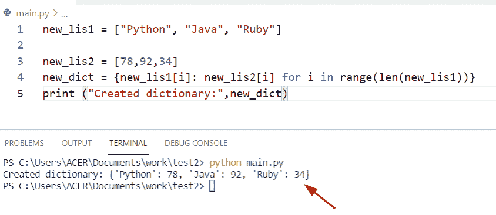
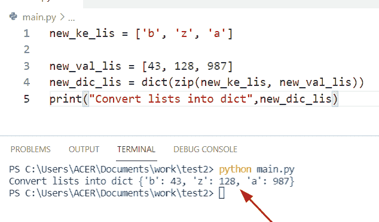
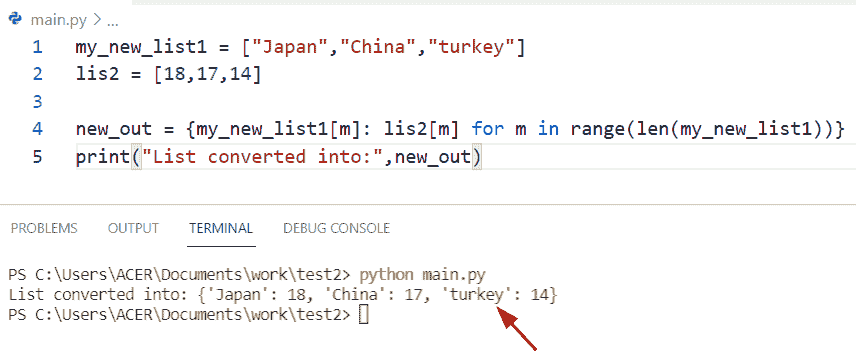
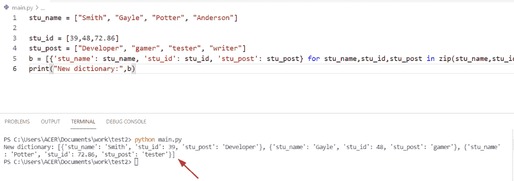
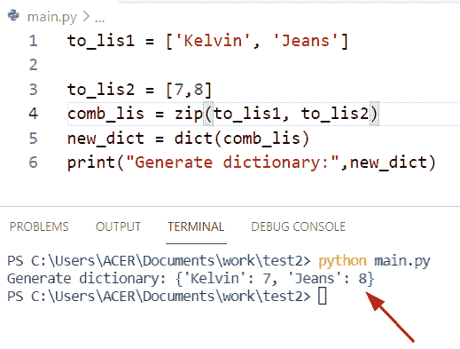
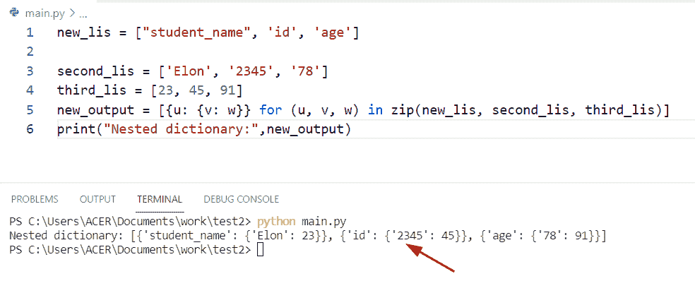
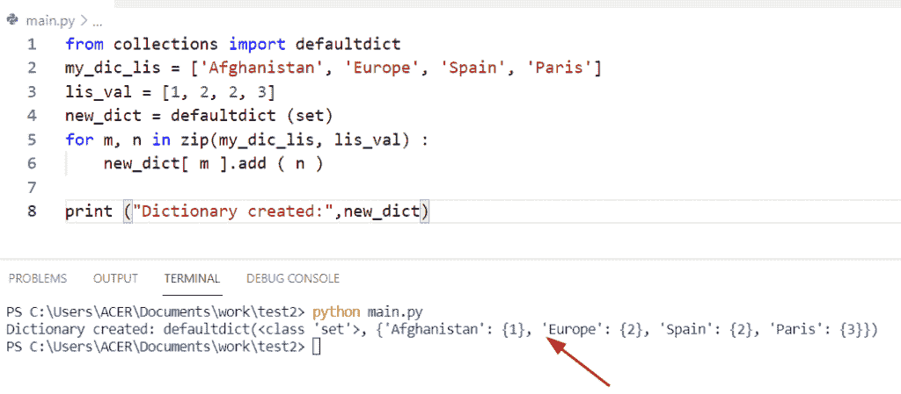

# 如何用 python 从两个列表创建字典

> 原文：<https://pythonguides.com/python-creates-a-dictionary-from-two-lists/>

[](https://sharepointsky.teachable.com/p/python-and-machine-learning-training-course)

在这个 Python 教程中，我们将讨论 **Python 从两个列表中创建一个字典。**在这里，我们还将介绍以下示例:

*   如何用 python 从两个列表创建字典
*   Python 从多个列表中创建一个字典
*   Python 从两个列表中生成 dict
*   Python 从两个列表中创建了嵌套字典
*   Python 程序从两个列表中创建一个字典，而不会丢失重复值

目录

[](#)

*   [Python 从两个列表中创建一个字典](#Python_creates_a_dictionary_from_two_lists "Python creates a dictionary from two lists")
    *   [通过使用 zip()和 dict()方法](#By_using_zip_and_dict_method "By using zip() and dict() method")
    *   [通过使用 for 循环和 range 方法](#By_using_for_loop_and_range_method "By using for loop and range method")
*   [Python 从多个列表中创建字典](#Python_creates_a_dictionary_from_multiple_lists "Python creates a dictionary from multiple lists")
*   [Python 从两个列表生成 dict】](#Python_generate_dict_from_two_lists "Python generate dict from two lists")
*   [Python 从两个列表中创建了嵌套字典](#Python_created_nested_dictionary_from_two_lists "Python created nested dictionary from two lists")
*   [Python 程序在不丢失重复值的情况下从两个列表创建字典](#Python_program_to_create_a_dictionary_from_two_lists_without_losing_duplicate_values "Python program to create a dictionary from two lists without losing duplicate values")

## Python 从两个列表中创建一个字典

*   这里我们可以看到如何用 Python 从两个列表中声明一个字典。
*   为此，我们将创建包含字典键的第一个列表，在另一个列表中，我们将包含 values 元素。在 Python 中创建一个列表，我们应该使用方括号[]并将元素放入其中。每个元素由一个逗号表示。
*   有多种方法可以完成这项任务
    *   通过使用字典理解方法
    *   通过使用 `zip()` 和 `dict()` 方法
    *   通过使用 for 循环和 range 方法

**例子:**

让我们举一个例子，看看如何使用字典理解方法从 Python 中的两个列表创建一个字典

**代码:**

```py
new_lis1 = ["Python", "Java", "Ruby"]

new_lis2 = [78,92,34]
new_dict = {new_lis1[i]: new_lis2[i] for i in range(len(new_lis1))}
print ("Created dictionary:",new_dict)
```

在 Python 中，字典理解方法非常容易将两个列表转换为一个字典，因为它节省时间，并且比列表理解方法更快。

首先在上面的代码中，我们将初始化列表并将元素放入其中。现在使用字典理解方法将列表转换为字典。

下面是以下给定代码的实现



Python creates a dictionary from two lists

### 通过使用 zip()和 dict()方法

zip()方法接受多个可迭代对象作为参数，比如列表和元组，并返回一个迭代器。在 Python 中， `dict()` 方法创建一个空字典。在这个例子中，dict 和 `zip()` 方法一起将列表转换成字典。

**语法:**

```py
dict(zip(keys,values))
```

**源代码:**

```py
new_ke_lis = ['b', 'z', 'a']

new_val_lis = [43, 128, 987]
new_dic_lis = dict(zip(new_ke_lis, new_val_lis))
print("Convert lists into dict",new_dic_lis)
```

下面是以下给定代码的输出



Python creates a dictionary from two lists using dict

### 通过使用 for 循环和 range 方法

在这里，我们可以看到如何将元素放入 for 循环中以创建一对值和键。在 Python 中， `len()` 方法返回元素的数量，而 `range()` 函数用于创建一个数字集合。

**举例:**

```py
my_new_list1 = ["Japan","China","turkey"]
lis2 = [18,17,14]

new_out = {my_new_list1[m]: lis2[m] for m in range(len(my_new_list1))}
print("List converted into:",new_out)
```

下面是以下给定代码的执行过程



Python creates a dictionary from two lists using a range

这是如何用 Python 从两个列表中创建一个字典。

阅读: [Python 字典 pop](https://pythonguides.com/python-dictionary-pop/)

## Python 从多个列表中创建字典

在 python 中要把多个列表转换成一个字典，我们可以很容易地使用 zip 方法。方法帮助用户将三个列表组合在一起，我们也可以使用列表理解方法将列表转换成字典

**源代码:**

```py
stu_name = ["Smith", "Gayle", "Potter", "Anderson"]

stu_id = [39,48,72.86]
stu_post = ["Developer", "gamer", "tester", "writer"]
b = [{'stu_name': stu_name, 'stu_id': stu_id, 'stu_post': stu_post} for stu_name,stu_id,stu_post in zip(stu_name,stu_id,stu_post)]
print("New dictionary:",b)
```

首先在上面的代码中，我们将创建多个列表**‘stu _ name’**，**‘stu _ id’**，**‘stu _ post’**，并为它们分配字典键和值。现在声明一个变量，并使用 zip()和 list comprehension 方法将列表转换成字典。

下面是以下代码的截图



python creates a dictionary from multiple lists

这就是如何从多个列表中创建一个字典。

阅读: [Python 字典包含](https://pythonguides.com/python-dictionary-contains/)

## Python 从两个列表生成 dict】

*   让我们看看如何用 Python 从两个列表生成一个字典。
*   通过使用 **zip()和 dict()** 方法，我们将从两个列表中创建一个字典。在这个例子中，我们将传递两个 iterable items 作为参数‘to _ lis 1’和‘to _ lis 2’。现在我们将通过使用 dict()方法将这个迭代器转换成一个字典键值元素。

**源代码:**

```py
to_lis1 = ['Kelvin', 'Jeans']

to_lis2 = [7,8]
comb_lis = zip(to_lis1, to_lis2)
new_dict = dict(comb_lis)
print("Generate dictionary:",new_dict)
```

下面是以下给定代码的执行过程



Python generate dict from two lists

阅读: [Python 字典理解](https://pythonguides.com/python-dictionary-comprehension/)

## Python 从两个列表中创建了嵌套字典

让我们看看如何使用 zip()和 list comprehension 方法从两个列表创建一个嵌套字典

**源代码:**

```py
new_lis = ["student_name", 'id', 'age']

second_lis = ['Elon', '2345', '78']
third_lis = [23, 45, 91]
new_output = [{u: {v: w}} for (u, v, w) in zip(new_lis, second_lis, third_lis)]
print("Nested dictionary:",new_output) 
```

下面是以下给定代码的输出



Python created a nested dictionary from two lists

阅读: [Python 字典按值查找键](https://pythonguides.com/python-dictionary-find-a-key-by-value/)

## Python 程序在不丢失重复值的情况下从两个列表创建字典

*   让我们看看如何在 Python 中从两个列表创建一个字典而不丢失重复值。
*   在本例中，我有两个列表‘my _ DIC _ lists’和‘lis _ val’。现在我们创建一个缺省字典，其中缺省值是一个集合，然后我们必须以键的形式添加值。

**源代码:**

```py
from collections import defaultdict
my_dic_lis = ['Afghanistan', 'Europe', 'Spain', 'Paris']
lis_val = [1, 2, 2, 3]
new_dict = defaultdict (set)
for m, n in zip(my_dic_lis, lis_val) :
    new_dict[ m ].add ( n )

print ("Dictionary created:",new_dict)
```

下面是以下代码的截图



Python program to create a dictionary from two lists without losing duplicate values

你可能也喜欢读下面的文章。

*   [Python 将字典转换为列表](https://pythonguides.com/python-convert-dictionary-to-list/)
*   [Python 字典删除](https://pythonguides.com/python-dictionary-remove/)
*   [Python 绝对值](https://pythonguides.com/python-absolute-value/)
*   [Python 字典长度](https://pythonguides.com/python-dictionary-length/)
*   [Python 字典索引](https://pythonguides.com/python-dictionary-index/)
*   [Python 元组字典](https://pythonguides.com/python-dictionary-of-tuples/)
*   [从字典中获取所有值 Python](https://pythonguides.com/get-all-values-from-a-dictionary-python/)
*   [Python 将字典转换成数组](https://pythonguides.com/python-convert-dictionary-to-an-array/)
*   [如何创建一个空的 Python 字典](https://pythonguides.com/how-to-create-an-empty-python-dictionary/)

在这个 Python 教程中，我们已经讨论了 **Python 从两个列表中创建了一个字典。**在这里，我们还介绍了以下示例:

*   Python 从多个列表中创建一个字典
*   Python 从两个列表中生成 dict
*   Python 从两个列表中创建了嵌套字典
*   Python 程序从两个列表中创建一个字典，而不会丢失重复值

[Bijay Kumar](https://pythonguides.com/author/fewlines4biju/)

Python 是美国最流行的语言之一。我从事 Python 工作已经有很长时间了，我在与 Tkinter、Pandas、NumPy、Turtle、Django、Matplotlib、Tensorflow、Scipy、Scikit-Learn 等各种库合作方面拥有专业知识。我有与美国、加拿大、英国、澳大利亚、新西兰等国家的各种客户合作的经验。查看我的个人资料。

[enjoysharepoint.com/](https://enjoysharepoint.com/)[](https://www.facebook.com/fewlines4biju "Facebook")[](https://www.linkedin.com/in/fewlines4biju/ "Linkedin")[](https://twitter.com/fewlines4biju "Twitter")