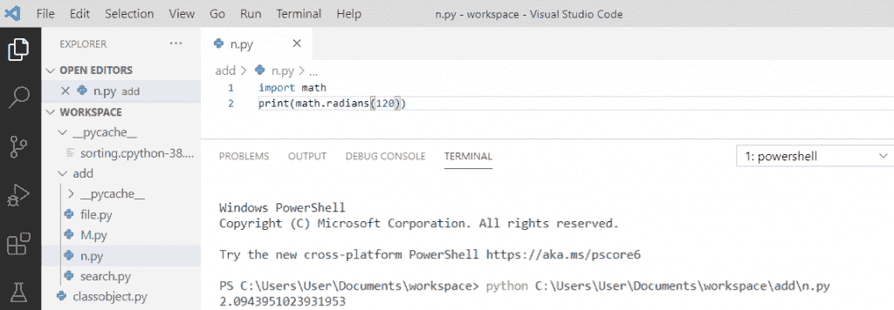
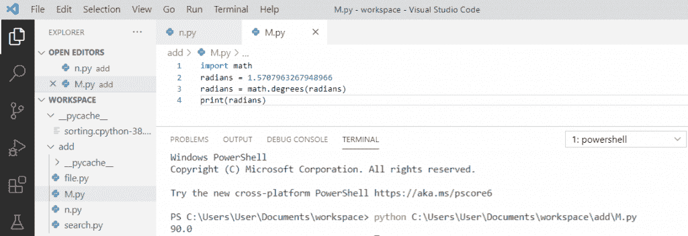
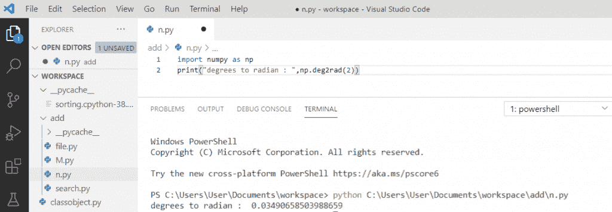
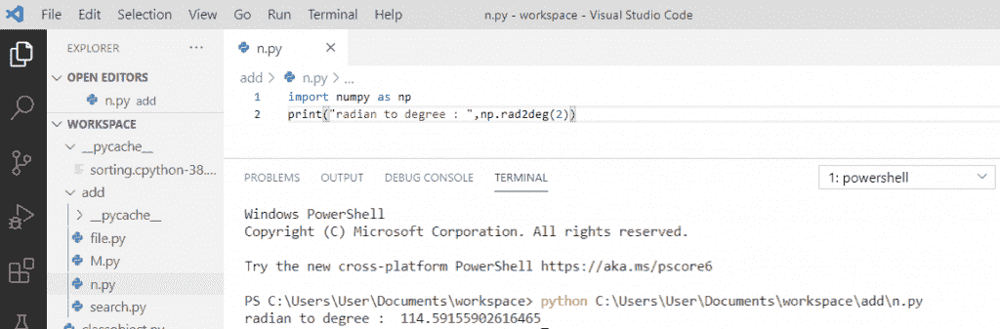
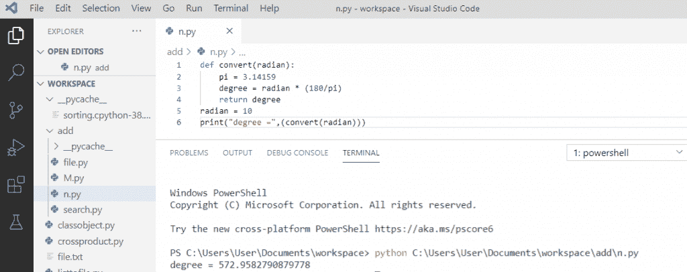
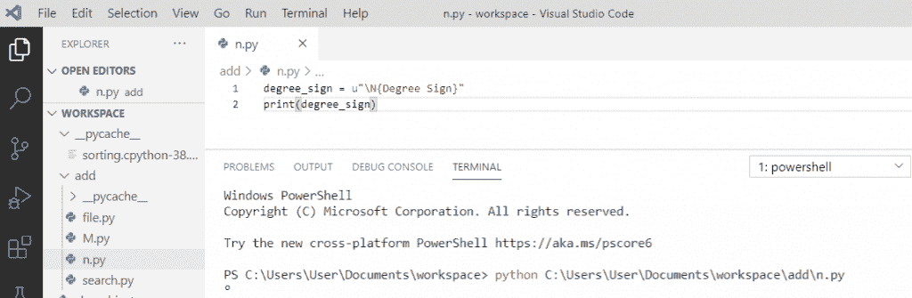
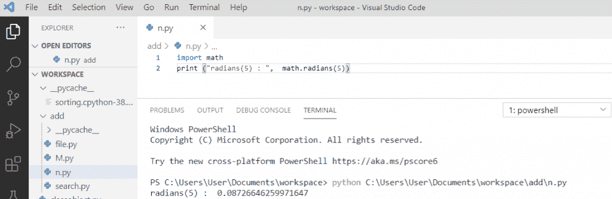
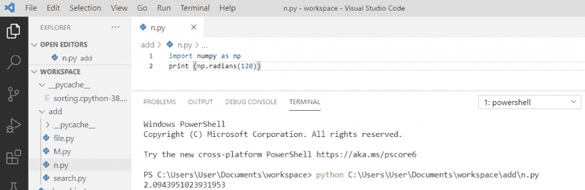

# 如何将 Python 角度转换为弧度

> 原文：<https://pythonguides.com/python-degrees-to-radians/>

[](https://sharepointsky.teachable.com/p/python-and-machine-learning-training-course)

在本 [python 教程中，](https://pythonguides.com/python-hello-world-program/)您将了解到 **Python 度到弧度**。让我们看看如何在 Python 中将**的角度转换成弧度。**

同样，我们将检查 **:**

*   什么是 python 数学模块？
*   Python 角度到弧度
*   Python 弧度到角度
*   使用 numpy 将 Python 角度转换为弧度
*   使用 numpy 将 Python 弧度转换为度数
*   写一个 python 程序把弧度转换成度数
*   如何用 python 打印度数符号
*   如何在 python 中将数字转换成弧度
*   在 python 中将角度从度转换为弧度

目录

[](#)

*   [什么是 python 数学模块？](#What_is_a_python_math_module "What is a python math module?")
*   [Python 度转弧度](#Python_degrees_to_radians "Python degrees to radians")
*   [Python 弧度转度数](#Python_radians_to_degrees "Python radians to degrees")
*   [Python 使用 numpy 将角度转换为弧度](#Python_degrees_to_radians_using_numpy "Python degrees to radians using numpy")
*   [Python 弧度到度数使用 numpy](#Python_radians_to_degrees_using_numpy "Python radians to degrees using numpy")
*   [写一个 python 程序把弧度转换成度数](#Write_a_python_program_to_convert_radian_to_degree "Write a python program to convert radian to degree")
*   [如何用 python 打印度数符号](#How_to_print_the_degree_symbol_in_python "How to print the degree symbol in python")
*   [如何用 python 将数字转换成弧度](#How_to_convert_a_number_to_radians_in_python "How to convert a number to radians in python")
*   [用 python 将角度从度转换成弧度](#Convert_angles_from_degrees_to_radians_in_python "Convert angles from degrees to radians in python")

## 什么是 python 数学模块？

Python 有一个**内置的**模块，可以用于数字的数学任务。**数学模块**包含计算给定角度的各种三角比的函数。

数学模块给出了两个角度转换函数，分别是**度()**和**弧度()**。**数学**模块有一套方法。

*   [Python 文件方法(附有用例子)](https://pythonguides.com/python-file-methods/)

## Python 度转弧度

在 python 中， `math.radians()` 方法用于将度数值转换为弧度。所以，我们先将**导入数学**模块。

**举例:**

```py
import math
print(math.radians(120))
```

写完上面的代码(python 角度到弧度)，你将打印出 `"math.radians(120)"` ，然后输出将显示为 `" 2.0943951023931953 "` 。

这里， `math.radians()` 将度数转换为弧度值。

可以参考下面截图 **python 度转弧度**。



Python degrees to radians

这就是我们如何在 Python 中将角度转换成弧度。

阅读[如何将 Python 数据帧转换成 JSON](https://pythonguides.com/how-to-convert-python-dataframe-to-json/)

## Python 弧度转度数

在这里，我们将看到如何在 python 中将弧度转换成角度。

为了将弧度转换成角度，我们将使用 `math.degrees()` 将弧度转换成角度。

**举例:**

```py
import math
radians = 1.5707963267948966
radians = math.degrees(radians)
print(radians)
```

写完上面的代码(python 弧度到度数)，你将打印出 `"math.degrees()"` ，然后输出将显示为 `" 90.0 "` 。这里， `math.degrees(radians)` 将弧度值转换为度数。

可以参考下面截图 **python 弧度转度数**。



Python radians to degrees

上面的代码，我们可以用 Python 中的来**转换弧度为度数。**

## Python 使用 numpy 将角度转换为弧度

让我们看看如何使用 numpy 将角度转换成弧度。

要将角度转换成弧度，我们必须先**导入 numpy** 包。它有一个内置的函数名 `deg2rad()` ，可以直接将角度转换为弧度。

**举例:**

```py
import numpy as np
print("degrees to radian: ",np.deg2rad(2))
```

写完上面的代码后(python 使用 numpy 将度数转换为弧度)，你将打印出 `" np.deg2rad(2)"` ，然后输出将显示为**"度数转换为弧度:0.03490658503988659 "** 。这里， `np.deg2rad(2)` 会将度数转换成弧度。

你可以参考下面的截图，用 numpy 把 **Python 的度数转换成弧度。**



Python degrees to radians using numpy

## Python 弧度到度数使用 numpy

要在 Python 中将弧度转换成度数，我们必须先**导入 numpy** 包。它有一个名为 `rad2deg()` 的内置函数，可以直接将弧度转换成角度。

**举例:**

```py
import numpy as np
print("radian to degree : ",np.rad2deg(2))
```

写完上面的代码后(python 弧度到度数使用 numpy)，你将打印 `" np.rad2deg(2)"` ，然后输出将显示为**"弧度到度数:114.56261646465 "**。这里， `np.rad2deg(2)` 会将弧度转换成度数。

你可以参考下面的截图使用 numpy 的 **python 弧度到度数。**



Python radians to degrees using numpy

## 写一个 python 程序把弧度转换成度数

在这个程序中，我们将圆周率取值为 3.14159，弧度取值为 10，打印时会将弧度转换为度数。

```py
def convert(radian):
    pi = 3.14159
    degree = radian * (180/pi)
    return degree
radian = 10
print("degree =",(convert(radian)))
```

写完上面的代码后(写一个 python 程序将弧度转换成度数)，你将打印出 `"convert(radian)"` ，然后输出将显示为`" degree = 572.952790879778 "`。这里，度数=弧度*(180/π)，弧度=10。所以这样，我们可以把弧度转换成度数。

你可以参考下面 python 程序把弧度转换成度数的截图。



Write a python program to convert radian to degree

## 如何用 python 打印度数符号

为了在 python 中打印度数符号，我们将使用**u " \ N {度数符号}"** ，并且我们已经使用了 `unicode` 来打印度数符号。

**举例:**

```py
degree_sign = u"\N{Degree Sign}"
print(degree_sign)
```

写完上面的代码(如何在 python 中打印度数符号)，一旦你将打印`(degree _ sign)`那么输出就会出现一个 `" "` 。这里，**u“\ N {度数符号}”**用于打印度数符号。

你可以参考下面的截图如何用 python 打印度数符号。



How to print the degree symbol in python

## 如何用 python 将数字转换成弧度

首先，我们需要**导入数学**模块。为了在 Python 中将一个**数字转换成弧度**，我们将使用**弧度(数字)**来将数字转换成弧度，并且我们需要使用**数学**对象来调用这个函数。

**举例:**

```py
import math
print("radians(5) :", math.radians(5))
```

写完上面的代码(如何在 python 中将一个数转换成弧度)，一旦你将打印出 `"math.radians(5)"` 那么输出将显示为**" radians(5):0.08726646259971647 "**。这里， `math.radians(5)` 用于在 python 中将一个数字转换成弧度。

你可以参考下面的截图如何在 python 中将一个数字转换成弧度。



How to convert a number to radians in python

## 用 python 将角度从度转换成弧度

现在，我们将看到如何在 python 中将角度从度转换成弧度。

我们将首先**导入** `numpy` 模块，然后我们将打印 `np.radians(120)` ，它将被转换为弧度。

**举例:**

```py
import numpy as np
print (np.radians(120))
```

你可以参考下面的截图用 python 把角度从度转换成弧度。



Convert angles from degrees to radians in python

您可能会喜欢以下 Python 教程:

*   [Python 中的链表](https://pythonguides.com/linked-lists-in-python/)
*   [如何用 Python 显示日历](https://pythonguides.com/display-calendar-in-python/)
*   [如何用 Python 制作计算器](https://pythonguides.com/make-a-calculator-in-python/)
*   [Python 打印 2 位小数](https://pythonguides.com/python-print-2-decimal-places/)
*   [Python 生成随机数和字符串](https://pythonguides.com/python-generate-random-number/)
*   [Python 将列表写入文件，并附有示例](https://pythonguides.com/python-write-list-to-file/)
*   [命令出错，退出状态为 1 python](https://pythonguides.com/command-errored-out-with-exit-status-1-python/)
*   [Python 将字符串写入文件](https://pythonguides.com/python-write-string-to-a-file/)
*   [Python 中的优先级队列](https://pythonguides.com/priority-queue-in-python/)
*   [Python 中的转义序列](https://pythonguides.com/escape-sequence-in-python/)

在这个 Python 教程中，我们学习了 **Python 角度到弧度的转换**。此外，我们还讨论了以下主题:

*   什么是 python 数学模块？
*   如何在 Python 中将角度转换为弧度
*   如何在 Python 中将弧度转换为角度
*   使用 numpy 将 Python 角度转换为弧度
*   使用 numpy 将 Python 弧度转换为度数
*   写一个 python 程序把弧度转换成度数
*   如何用 python 打印度数符号
*   如何在 python 中将数字转换成弧度
*   在 python 中将角度从度转换为弧度

[Bijay Kumar](https://pythonguides.com/author/fewlines4biju/)

Python 是美国最流行的语言之一。我从事 Python 工作已经有很长时间了，我在与 Tkinter、Pandas、NumPy、Turtle、Django、Matplotlib、Tensorflow、Scipy、Scikit-Learn 等各种库合作方面拥有专业知识。我有与美国、加拿大、英国、澳大利亚、新西兰等国家的各种客户合作的经验。查看我的个人资料。

[enjoysharepoint.com/](https://enjoysharepoint.com/)[](https://www.facebook.com/fewlines4biju "Facebook")[](https://www.linkedin.com/in/fewlines4biju/ "Linkedin")[](https://twitter.com/fewlines4biju "Twitter")