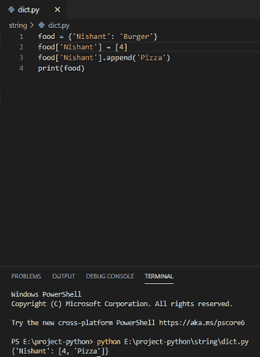
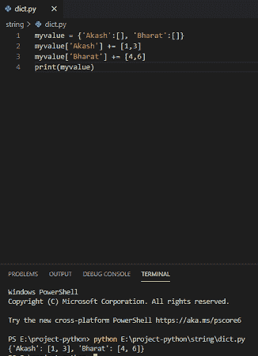
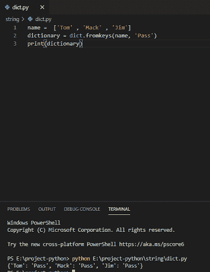
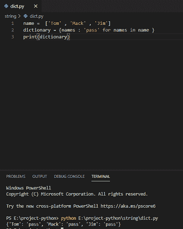
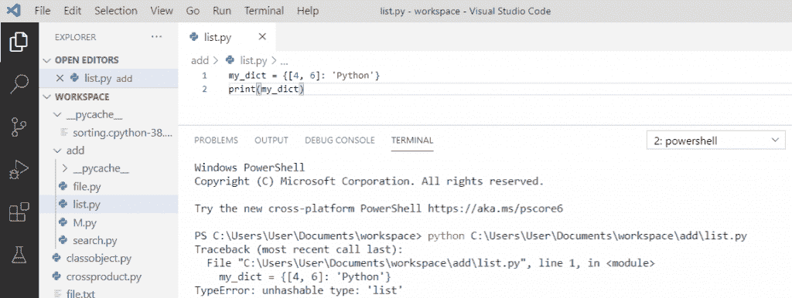
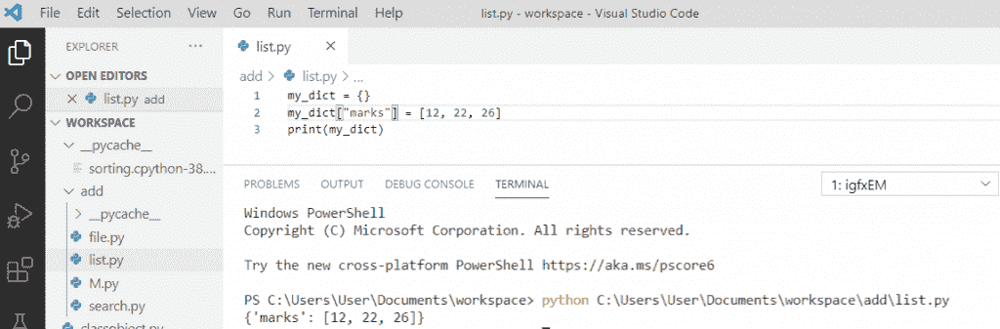

# Python 字典附加示例

> 原文：<https://pythonguides.com/python-dictionary-append/>

[](https://sharepointsky.teachable.com/p/python-and-machine-learning-training-course)

在本 [Python 教程](https://pythonguides.com/python-programming-for-the-absolute-beginner/)中，我们将学习 **Python 字典 append** 。此外，我们还将讨论:

*   Python 字典追加
*   Python 追加到字典中每个键的列表中
*   将列表转换为字典 python
*   将列表添加到字典 python

目录

[](#)

*   [Python 字典追加](#Python_dictionary_append "Python dictionary append")
*   [Python 追加到字典中每个键的列表](#Python_append_to_lists_of_each_key_inside_a_dictionary "Python append to lists of each key inside a dictionary")
*   [将列表转换为字典 python](#Convert_list_to_dictionary_python "Convert list to dictionary python")
*   [将列表添加到字典 python](#Add_list_to_dictionary_python "Add list to dictionary python")

## Python 字典追加

`Python dictionary append` 用于在现有字典中添加元素。在字典中，追加可以通过列表来完成，因为列表具有这个特性。

**举例:**

```py
food = {'Nishant': 'Burger'}
food['Nishant'] = [4]
food['Nishant'].append('Pizza')
print(food)
```

写完上面的代码(python dictionary append)，你将打印出 `"food"` ，然后输出将显示为 **" {'Nishant': [4，' pizza']} "** 。这里，append 用于添加字典中的元素。你可以参考下面的截图来创建一个 python 字典 append。



Python dictionary append

你可能喜欢 [Python 串联字典](https://pythonguides.com/python-concatenate-dictionary/)。

## Python 追加到字典中每个键的列表

通过使用“+”操作符，我们可以在 Python 的字典中添加每个键的列表。

**举例:**

```py
myvalue = {'Akash': [], 'Bharat': []}
myvalue['Akash'] += [1,3]
myvalue['Bharat'] += [4,6]
print(myvalue)
```

写完上面的代码(Python 追加到字典中每个键的列表中)，你将打印出 `"myvalue"` ，然后输出将显示为 **" {'Akash': [1，3]，' Bharat': [4，6]} "** 。这里，**“+”**运算符用于在字典中追加。你可以参考下面的截图来创建一个 python append 到字典中每个键的列表。



## 将列表转换为字典 python

在 Python 中，要将列表转换成字典，我们可以使用 dict.fromkey()方法将给定的列表转换成字典。

**举例:**

```py
name = ['Tom', 'Mack', 'Jim']
dictionary = dict.fromkeys(name, 'pass')
print(dictionary)
```

写完上面的代码(将 list 转换为 dictionary python)，你将打印出 `" dictionary "` ，然后输出将显示为 **" {'Tom': 'pass '，' Mack': 'pass '，' Jim': 'pass'} "** 。

在这里， `dict.fromkeys()` 会将列表转换成一个字典，并带有指定的值**“通过”**。你可以参考下面的转换列表到字典 python 的截图。



Convert list to dictionary python

我们还可以，**通过使用字典理解，在 python** 中将 list 转换成 dictionary。

**举例:**

```py
name = ['Tom', 'Mack', 'Jim']
dictionary = {names : 'pass' for names in name}
print(dictionary)
```

写完上面的代码(将 list 转换为 dictionary python)，你将打印出 `" dictionary "` ，然后输出将显示为 **" {'Tom': 'pass '，' Mack': 'pass '，' Jim': 'pass'} "** 。

这里， `dictionary comprehension` 会把列表转换成一个字典，每个键值都是一样的。你可以参考下面的截图将列表转换成字典 python。



读取 [Python 字符串以列出](https://pythonguides.com/python-string-to-list/)

## 将列表添加到字典 python

现在，让我们看看如何用 python 将列表**添加到字典中。**

python 字典中对**键**的限制是只有不可变的数据类型可以用作键。所以，我们不能用一个字典的列表作为一个键。如果我们试图这样做，我们将得到一个“TypeEerror”。

**举例:**

```py
my_dict = {[4, 6]: 'Python'}
print(my_dict)
```

写完上面的代码后，我们将打印出 `" my_dict "` 然后错误将显示为**" type error:unhashable type:' list ' "**。你可以参考下面的截图。



Add list to dictionary python

对字典中的**值**也可以这样做。让我们看看如何用 python 向字典添加列表。

**举例:**

```py
my_dict = {}
my_dict["marks"] = [12, 22, 26]
print(my_dict)
```

写完上面的代码后(给 dictionary python 添加一个列表)，你将打印出 `" my_dict "` ，然后输出将显示为**" { ' marks ":[12，22，26]} "** 。

在这里，我们可以看到列表被添加到字典中。你可以参考下面的截图给字典 python 添加一个列表。



Add list to dictionary python

这就是我们如何**将 list 转换成 dictionary python** 。

您可能会喜欢以下 Python 教程:

*   [在 Python 中检查列表是否为空](https://pythonguides.com/check-if-a-list-is-empty-in-python/)
*   [Python 将列表转换成字符串](https://pythonguides.com/python-convert-list-to-string/)
*   [Python 方块一号](https://pythonguides.com/python-square-a-number/)
*   [什么是 Python 字典+用 Python 创建字典](https://pythonguides.com/create-a-dictionary-in-python/)
*   [无换行符的 Python 打印](https://pythonguides.com/python-print-without-newline/)
*   [Python 字典方法](https://pythonguides.com/python-dictionary-methods/)
*   [如何在 Python 中创建列表](https://pythonguides.com/create-list-in-python/)
*   [Python 字符串函数](https://pythonguides.com/string-methods-in-python/)
*   [使用 Visual Studio 代码](https://pythonguides.com/python-hello-world-program/)用 python 创建一个 hello world 程序
*   [Python 访问修饰符+示例](https://pythonguides.com/python-access-modifiers/)
*   [用 Python 创建和修改 PDF 文件](https://pythonguides.com/create-and-modify-pdf-file-in-python/)
*   [Python 串联数组](https://pythonguides.com/python-concatenate-arrays/)

在本教程中，我们将讨论**如何向 Python 字典**追加一个条目。我们讨论了 Python 字典 append with examples。

[Bijay Kumar](https://pythonguides.com/author/fewlines4biju/)

Python 是美国最流行的语言之一。我从事 Python 工作已经有很长时间了，我在与 Tkinter、Pandas、NumPy、Turtle、Django、Matplotlib、Tensorflow、Scipy、Scikit-Learn 等各种库合作方面拥有专业知识。我有与美国、加拿大、英国、澳大利亚、新西兰等国家的各种客户合作的经验。查看我的个人资料。

[enjoysharepoint.com/](https://enjoysharepoint.com/)[](https://www.facebook.com/fewlines4biju "Facebook")[](https://www.linkedin.com/in/fewlines4biju/ "Linkedin")[](https://twitter.com/fewlines4biju "Twitter")