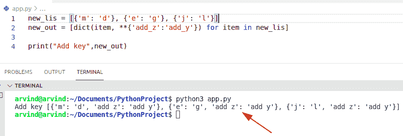
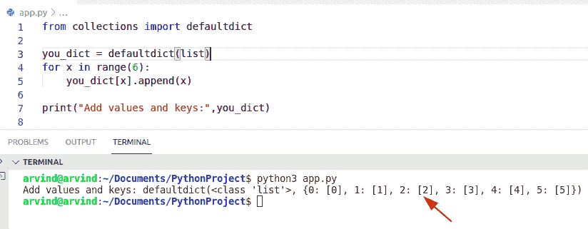

# Python 词典理解

> 原文：<https://pythonguides.com/python-dictionary-comprehension/>

[](https://sharepointsky.teachable.com/p/python-and-machine-learning-training-course)

在本 Python 教程中，我们将讨论 **Python 字典理解。**这里我们还将涵盖下面的例子:

*   Python 字典理解 if else
*   Python 字典理解多键
*   Python 字典理解示例
*   从列表中理解 Python 字典
*   Python 字典理解重复键
*   Python 字典理解过滤器
*   Python 字典理解附加
*   Python 字典理解添加键
*   用默认字典理解 Python 字典

目录

[](#)

*   [Python 字典理解](#Python_dictionary_comprehension "Python dictionary comprehension")
*   [Python 字典理解 if else](#Python_dictionary_comprehension_if_else "Python dictionary comprehension if else")
*   [Python 字典理解多键](#Python_dictionary_comprehension_multiple_keys "Python dictionary comprehension multiple keys ")
*   [Python 字典理解示例](#Python_dictionary_comprehension_example "Python dictionary comprehension example")
*   [Python 字典理解自列表](#Python_dictionary_comprehension_from_list "Python dictionary comprehension from list")
*   [Python 字典理解重复键](#Python_dictionary_comprehension_duplicate_keys "Python dictionary comprehension duplicate keys")
*   [Python 字典理解过滤器](#Python_dictionary_comprehension_filter "Python dictionary comprehension filter")
*   [Python 字典理解追加](#Python_dictionary_comprehension_append "Python dictionary comprehension append")
*   [Python 字典理解添加键](#Python_dict_comprehension_add_key "Python dict comprehension add key")
*   [用默认字典理解 Python 字典](#Python_dict_comprehension_with_default_dict "Python dict comprehension with default dict")

## Python 字典理解

*   在 Python 中，要将一个字典转换成另一个字典，我们可以使用字典理解方法。这种方法是创建字典的一种简便方法。
*   为了执行这个特定的任务，我们必须访问字典的键值对对象。
*   我们来看看如何使用 Python 中的字典理解法。要完成这个任务，你需要一些字典方法，比如 `items() keys()` 和 `values()` 。

**举例:**

```py
dic_key = ['m','u','t','z','x']
dic_val = [19,67,28,17,15]  
new_dic = { a:b for (a,b) in zip(dic_key, dic_val)} 

print (new_dic)
```

在上面的代码中，我们声明了一个名为**‘DIC _ key’**的列表，它只包含 keys 元素，类似于只包含值的**‘DIC _ val’**列表的情况。现在创建一个变量，展示一个字典理解方法。

**输出:**


Python dictionary comprehension

这就是如何在 Python 中检查字典理解方法

**Python 中字典理解方法的另一种解法**

这里我们可以看到如何使用另一个字典中的键值对来使用字典理解。

**源代码:**

```py
student_name = {'charles': 47, 'Nathan': 28, 'Adam': 19}

add_value = 92
new_dict = {item: new_value*add_value for (item, new_value) in student_name.items()}
print("New dictionary is:",new_dict)
```

在上面的代码中，你可以看到我们必须使用字典理解方法来改变原始字典的实际值。在这个例子中，我们必须使用**' ***操作符来更新我们的值。

下面是以下代码的截图


Python dictionary comprehension method

阅读: [Python 字典按值查找键](https://pythonguides.com/python-dictionary-find-a-key-by-value/)

## Python 字典理解 if else

*   这里可以看到如何在字典理解法中使用 if-else 条件。
*   在这种情况下，通过字典理解初始化新的原始字典。
*   在 Python 中，if-else 语句用于评估条件是真还是假。如果表达式为真，则执行' **if'** 语句，否则执行 **'else'** 语句。如果条件为真，那么将执行**‘else’**语句。

查看以下源代码:

```py
your_dict = {'new_key': {'m', 'u', 't'}, 'k2_new': {'John', 'George'}, 'k3_new': {'Smith', 'Denver'}}

dict_comp = {"u is contain in {}".format(n_key) if 'u' in n_val else "u not contain in {}".format(n_key): n_val for n_key, n_val in your_dict.items()}
print(dict_comp)
```

首先在这个例子中，我们将初始化一个字典，并给它们分配键值对元素。现在我们要用一个 if-else 语句来评估这个键是否包含**‘u’**。如果**‘u’**变量存储在给定的字典中，则条件为真，否则将显示**‘u’**不包含在字典中。

**执行:**


Python dictionary comprehension if else

这就是如何在词典中检查 else 条件的理解方法

**另一种检查如何在词典理解中使用 if-else 条件的方法。**

**举例:**

```py
my_dict = {"a":34,"v":16,"x":19,"l":20}

b = {x:('even no' if y%2==0 else 'odd no') for (x,y) in my_dict.items()}
print(b)
```

在这个例子中，我们可以检查字典的值是否是偶数，那么条件为真，否则条件为假。

下面是以下给定代码的实现


Python dictionary comprehension if-else method

阅读: [Python 将字典转换为列表](https://pythonguides.com/python-convert-dictionary-to-list/)

## Python 字典理解多键

*   在这里，我们可以通过字典理解方法来检查如何在字典中使用多个键。
*   为了完成这个特殊的任务，我们可以使用 np.zeroes 函数。此函数返回一个新形状和多个带零的键值对元素。

**举例:**

```py
import numpy as np
new_key=['a','z','y']
you_dict={a_key:np.zeros(2) for a_key in new_key}
print(you_dict)
```

下面是以下代码的截图


Python dictionary comprehension multiple keys

这就是如何在字典理解中使用多个键。

阅读: [Python 字典删除](https://pythonguides.com/python-dictionary-remove/)

## Python 字典理解示例

*   让我们举一个例子，检查如何在 Python 中使用字典理解方法。

**举例:**

这里让我们使用一系列数字并创建一个空字典。现在检查条件，如果变量**‘p’**能被 3 整除，那么这个数将乘以 4。

```py
new_num = range(21)
new_dict_for = {}

for p in new_num:
    if p%3==0:
        new_dict_for[p] = p**4

print(new_dict_for)
```

下面是以下给定代码的输出


Python dictionary comprehension example

阅读: [Python 字典长度](https://pythonguides.com/python-dictionary-length/)

## Python 字典理解自列表

*   这里我们可以看到如何在字典理解方法中使用列表。
*   为了完成这个任务，假设我们有一个姓名列表，我们可以使用字典理解方法初始化一个包含姓名的字典。在这个例子中，我们必须检查字典中可用的每个字符串的长度，它将显示为值。

**举例:**

```py
dictionary = ['John', 'George', 'Micheal','Potter']

b = {m:len(m) for m in dictionary}

print(b)
```

下面是以下代码的截图


Python dictionary comprehension from list

阅读: [Python 字典索引](https://pythonguides.com/python-dictionary-index/)

## Python 字典理解重复键

*   让我们看看如何使用字典理解方法来检查字典中是否存在重复的键。
*   对于这个问题，我们可以使用 itertool.chain()方法。这个函数总是返回一个可迭代的序列，属于迭代器的范畴。

**举例:**

```py
from itertools import chain

to_dictionary = {'m':9, 'o':7, 'g':7, 'h':6}
new_re_dict = {}
for k, v in to_dictionary.items():
	new_re_dict.setdefault(v, set()).add(k)
output = set(chain.from_iterable(
		new_val for k, new_val in new_re_dict.items()
		if len(new_val) > 1))

print("duplicate keys:",output)
```

下面是以下给定代码的执行过程


Python dictionary comprehension duplicate keys

这就是如何检查字典中是否存在重复键

**检查如何使用字典理解方法在 Python 中找到重复键的另一个例子**

**举例:**

```py
you_dictionary = {"George":12, "Micheal":19, "Micheal":15}

ne_dic = {}
for new_key, new_val in you_dictionary.items():
    ne_dic[new_val] = new_key
print(ne_dic)
```

在上面的代码中，我们使用了 dict.items()方法从字典中删除重复的键。在本例中，将值对与 key 元素进行比较。如果字典中有重复的 key，那么它将检查条件 **dic[new_val]== new_key** 并显示结果。

下面是以下代码的截图


Python dictionary comprehension duplicate keys method

阅读: [Python 字典初始化](https://pythonguides.com/python-dictionary-initialize/)

## Python 字典理解过滤器

*   这里我们可以看到如何在字典中使用 filter 方法。
*   在 Python 中，filter()是一个内置函数，它接受一个返回 filter 对象的 iterable 序列。
*   在这个例子中， **'fo_ne_dict'** 变量包含从字典中过滤的元素，这意味着它们的键可以被 3 整除。

**源代码:**

```py
my_dict = {9:"Richard",97:"Joseph",84:"Thomas",72:"Franco",6:"Apollo"}
fo_ne_dict = dict()

for (new_k, new_v) in my_dict.items():

   if new_k % 3 == 0:
       fo_ne_dict[new_k] = new_v
print('Dictionary comprehension filter:',fo_ne_dict)
```

下面是以下给定代码的实现


Python dictionary comprehension filter

这就是字典理解法中 filter()方法的使用方法。

阅读:[如何检查一个键是否存在于 Python 字典中](https://pythonguides.com/check-if-a-key-exists-in-a-python-dictionary/)

## Python 字典理解追加

*   要在字典中添加元素，我们可以很容易地使用 append()方法向字典中的键或值添加元素。
*   为了完成这个特定的任务，假设我们有一个字典，它的关键字是**“stu _ name”**和**“stu _ address”**。通过使用 append()方法，我们可以计算键值并以键值对的形式显示结果。

**代码:**

```py
student_dict = {"stu_name":[],"stu_address":[]};

new_dict = {"country":[],"City":[]};
student_dict["stu_name"].append("JOhn")
new_dict["country"].append("australia")
print(student_dict)
print(new_dict)
```

**执行:**


Python dictionary comprehension append

这就是如何在字典理解中使用 append()方法

阅读: [Python 字典过滤器](https://pythonguides.com/python-dictionary-filter/)

## Python 字典理解添加键

*   让我们看看如何通过字典理解方法向字典中添加关键元素。
*   在这个例子中，我们可以很容易地使用 `**` 操作符来添加字典中的元素。这是一个数学运算，帮助用户在特定的键中添加元素。

**举例:**

```py
new_lis = [{'m': 'd'}, {'e': 'g'}, {'j': 'l'}]
new_out = [dict(item, **{'add_z':'add_y'}) for item in new_lis]

print("Add key",new_out)
```

下面是以下给定代码的实现



Python dict comprehension add key

这就是如何在字典理解中添加关键元素

阅读: [Python 字典排序](https://pythonguides.com/python-dictionary-sort/)

## 用默认字典理解 Python 字典

这个方法总是返回一个类似字典的对象。在 Python 中，默认的 dict 方法从不引发键错误。在这个例子中，首先，您必须从集合中导入一个默认的 dict，初始化一个默认的 dict，并将这个列表传递给默认的工厂。

**举例:**

```py
from collections import defaultdict

you_dict = defaultdict(list)
for x in range(6):
    you_dict[x].append(x)

print("Add values and keys:",you_dict)
```

下面是以下给定代码的输出



Python dict comprehension with default dict

你可能也喜欢阅读以下与字典相关的文章。

*   [Python 字典值列表](https://pythonguides.com/python-dictionary-values-to-list/)
*   [Python 字典更新](https://pythonguides.com/python-dictionary-update/)
*   [Python 字典包含](https://pythonguides.com/python-dictionary-contains/)
*   [Python 字典流行](https://pythonguides.com/python-dictionary-pop/)
*   [Python 元组字典](https://pythonguides.com/python-dictionary-of-tuples/)
*   [Python 在字典中查找最大值](https://pythonguides.com/python-find-max-value-in-a-dictionary/)
*   [Python 从两个列表中创建一个字典](https://pythonguides.com/python-creates-a-dictionary-from-two-lists/)

在本 Python 教程中，我们讨论了 **Python 字典理解。**在这里，我们还将介绍以下示例:

*   Python 字典理解 if else
*   Python 字典理解多键
*   Python 字典理解示例
*   从列表中理解 Python 字典
*   Python 字典理解重复键
*   Python 字典理解过滤器
*   Python 字典理解附加
*   Python 字典理解添加键
*   用默认字典理解 Python 字典

[Bijay Kumar](https://pythonguides.com/author/fewlines4biju/)

Python 是美国最流行的语言之一。我从事 Python 工作已经有很长时间了，我在与 Tkinter、Pandas、NumPy、Turtle、Django、Matplotlib、Tensorflow、Scipy、Scikit-Learn 等各种库合作方面拥有专业知识。我有与美国、加拿大、英国、澳大利亚、新西兰等国家的各种客户合作的经验。查看我的个人资料。

[enjoysharepoint.com/](https://enjoysharepoint.com/)[](https://www.facebook.com/fewlines4biju "Facebook")[](https://www.linkedin.com/in/fewlines4biju/ "Linkedin")[](https://twitter.com/fewlines4biju "Twitter")