# Python 字典包含+个例子

> 原文：<https://pythonguides.com/python-dictionary-contains/>

[](https://sharepointsky.teachable.com/p/python-and-machine-learning-training-course)

在本 [Python 字典教程](https://pythonguides.com/create-a-dictionary-in-python/)中，我们将讨论 **Python 字典包含的内容。**这里我们还将涵盖下面的例子:

*   Python 字典包含值
*   Python 字典包含密钥
*   Python 字典包含列表作为值
*   Python 字典包含关键示例
*   Python 字典包含键值对
*   Python 字典包含另一个字典
*   Python 字典包含元素
*   Python 字典包含多个键
*   Python 字典包含重复的键
*   Python 字典键包含字符串

目录

[](#)

*   [Python 字典包含](#Python_dictionary_contains "Python dictionary contains")
*   [Python 字典包含值](#Python_dictionary_contains_value "Python dictionary contains value")
    *   [通过使用 get()和 key 方法](#By_using_get_and_key_method "By using get() and key method")
    *   [通过使用 in 运算符](#By_using_in_operator "By using in operator")
*   [Python 字典包含关键字](#Python_dictionary_contains_key "Python dictionary contains key")
*   [Python 字典包含列表作为值](#Python_dictionary_contains_list_as_value "Python dictionary contains list as value")
*   [Python 字典包含关键示例](#Python_dictionary_contain_key_example "Python dictionary contain key example")
*   [Python 字典包含键值对](#Python_dictionary_contains_key-value_pair "Python dictionary contains key-value pair")
*   [Python 字典包含另一个字典](#Python_dictionary_contains_another_dictionary "Python dictionary contains another dictionary")
*   [Python 字典包含元素](#Python_dictionary_contain_elements "Python dictionary contain elements")
*   [Python 字典包含多个键](#Python_dictionary_contains_multiple_keys "Python dictionary contains multiple keys")
*   [Python 字典包含重复键](#Python_dictionary_contains_duplicate_keys "Python dictionary contains duplicate keys")
*   [Python 字典键包含字符串](#Python_dictionary_key_contains_string "Python dictionary key contains string")

## Python 字典包含

*   让我们看看如何检查一个键/值对是否包含在 [Python 字典](https://pythonguides.com/python-dictionary-methods/)中。
*   检查字典中是否存在键/值对的最简单方法是使用操作符中的**。为了完成这个任务，我们可以在一个 [Python 元组](https://pythonguides.com/create-a-tuple-in-python/)中指定键/值对。要检查字典中是否不存在键/值对，我们可以使用 `not in` 操作符。**

**源代码:**

```py
my_dict = {"e":4,"l":6,"q":5}

print(('e', 4) in my_dict.items())
```

在上面的代码中，我们将首先初始化一个字典**‘my _ dict’，给**分配一个键值元素，并显示结果。

下面是以下给定代码的执行过程

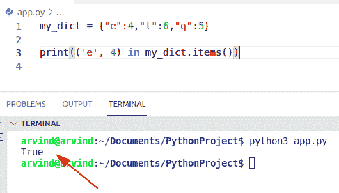

Python dictionary contains

阅读: [Python for 循环索引](https://pythonguides.com/python-for-loop-index/)

## Python 字典包含值

*   这里我们可以看到如何检查值是否包含在 Python 字典中。
*   为了解决这个问题，我们可以使用 values()和 if-in 语句方法。在 Python 中， `values()` 方法返回一个视图对象，显示所有与键相关的值。为了检查我们的值是否存在于可迭代序列中，我们可以使用操作符中的**。**
*   有各种方法来执行这个任务
    *   通过使用 get 和 key 方法
    *   通过使用 in 运算符

**语法:**

```py
If value in dict:
# dictionary contains(True)
else:
# dictionary not contains
```

**源代码:**

下面的源代码展示了 `if-in` 语句的操作，用于检查该值是否包含在字典中。

```py
new_dict = {"Ethan":78,"Mason":98,"Benjamin":72}
new_val = 98

if new_val in new_dict.values():
    print(f"True, Value contains in dictionary:",new_val)
else:
    print(f"False, Value does not contains in dictionary:",new_val)
```

如你所见，值**‘98’**包含在字典中，因此 if-in 语句实现。

下面是以下代码的截图

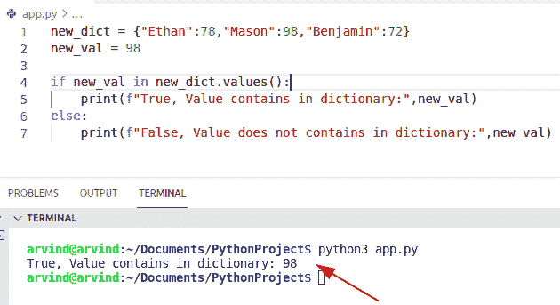

Python dictionary contains a value

阅读 [Python 请求用户输入](https://pythonguides.com/python-ask-for-user-input/)

### 通过使用 get()和 key 方法

在 Python 中，get 函数接受一个键，在这种情况下，这个键是 Python 中的一个内置函数，它总是返回给定键的值。如果字典中不包含该值，它将返回 None。

**举例:**

```py
ne_dictionary = {12:"OLiva",17:"Marry",16:"Gilchrist"}

key = 12

if ne_dictionary.get(key) == None:
    print('Value not contain')
else:
    print('Value contain') 
```

**输出:**

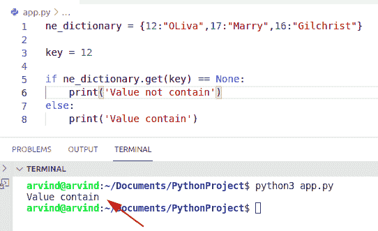

Python dictionary contains value get method

### 通过使用 in 运算符

让我们看看如何通过在操作符方法中使用**来检查值是否包含在 Python 字典中。**

**源代码:**

```py
ne_dictionary = {"q":12,"i":74,"p":23,"x":123}

print(74 in ne_dictionary.values())
```

。下面是以下给定代码的执行过程

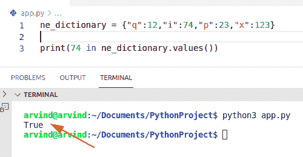

Python dictionary contains a value in operator

阅读: [Python 字典理解](https://pythonguides.com/python-dictionary-comprehension/)

## Python 字典包含关键字

*   在带有 `if` 语句的操作符中使用**，我们可以检查这个键是否包含在字典中或者 Python 中是否包含。**
*   在 Python 中，In 操作符主要检查一个键是否包含在字典中。如果键不存在，我们就不能使用 in 操作符。
*   在本例中，我们将给出条件，如果键存在，结果将显示**‘真’**，否则如果不存在，将返回**‘假’**。

**语法:**

```py
If key in dict:
 #key exist in dictionary (True)
else:
 #key does not exist in dictionary(False)
```

**源代码:**

```py
my_dictionary = {"Samuel":19,"Mathew":37,"Micheal":92} 

exist_ke = 'Potter'
if exist_ke in my_dictionary: 
        print("True, key contains in dict.\n" ) 

else: 
        print("False, key does not contains in dict.\n") 
```

在上面的代码中，您可以看到我们使用了 if-in 语句和操作符。现在在这个例子中，我们的字典中没有一个**‘Potter’**关键字，因此它将显示结果‘关键字不包含在字典中’。

**执行:**

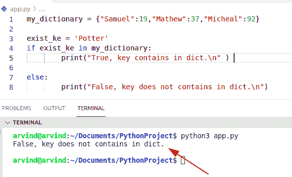

Python dictionary contains key

**另一个使用 has_key()方法检查关键字是否包含在字典中的例子**

为了检查特定的键是否存在于字典中，我们可以很容易地使用函数 `has_key` ()。如果键存在，此方法返回 true，否则返回 false。

**语法:**

```py
dict.has_keys()
```

**注意:**在 Python 中，has_key()函数只有 Python 2.7 版本才有。

**举例:**

```py
country_dict = {"cuba":52,"Estonia":47,"Kenya":82}
new_key = 'Kenya'

if country_dict.has_key(new_key):
    print("True, key contains:")
else:
    print("False,key not contain")
```

下面是以下给定代码的输出

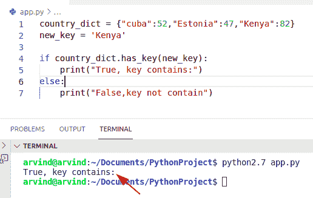

Python dictionary contains key method

阅读: [Python 字典按值查找键](https://pythonguides.com/python-dictionary-find-a-key-by-value/)

## Python 字典包含列表作为值

让我们看看如何使用 Python 中的运算符方法中的**来检查作为值的列表是否包含在字典中。**

**源代码:**

```py
you_dict = {"o":[1,14,2,],"m":[10,74,90],"n":[23,47,86]}

print([10,74,90] in you_dict.values())
```

首先在上面的代码中，我们将初始化一个字典，并以键值对的形式分配它们的元素。但是在这种情况下，值是列表形式的。现在，我们将检查该值是否包含在字典中的条件。

**实施:**

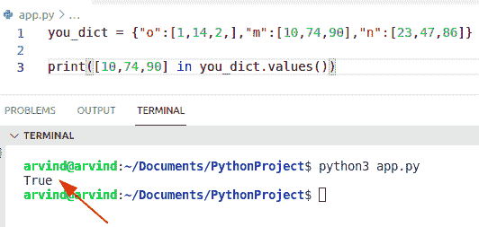

Python dictionary contains list as a value

阅读: [Python 将字典转换为列表](https://pythonguides.com/python-convert-dictionary-to-list/)

## Python 字典包含关键示例

*   让我们看看如何检查键是否包含在 Python 字典中。
*   为了执行这个任务，我们可以应用 python `keys()` 方法。该方法帮助用户检查该键是否包含在现有的字典中。
*   这个方法没有参数，总是返回一个字典中所有键的列表。在这个例子中，我们可以使用 if 语句和 keys()方法来区分**‘new _ key’**变量。如果它存在于字典中，那么它将显示结果**‘真’**，否则它将跳转到 else 部分的语句并返回**‘假’。**

**源代码:**

```py
stud_dict= {"Gayle":34,"Siemens":59,"pollard":70}
new_key = 'Siemens'

if new_key in stud_dict.keys():
    print("True, it contains:")
else:
    print("False, it does not contains")
```

下面是以下代码的截图

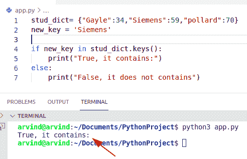

Python dictionary contains key example

**另一个使用 get()方法检查字典中是否存在关键字的例子**

在 Python 中，get()方法接受唯一的键参数，并将值和键一起返回。如果默认情况下字典中不存在该键，它将返回 `None` 值。

**语法:**

```py
dict.get
       (
        Key, 
        default=None
       )
```

**举例:**

```py
stud_dict= {"Oliver":943,"potter":178,"hemsworth":36}
se_ne_key = 'George'

if stud_dict.get(se_ne_key) == None:
    print('Key not exist')
else:
    print('Key exist') 
```

下面是以下给定代码的实现

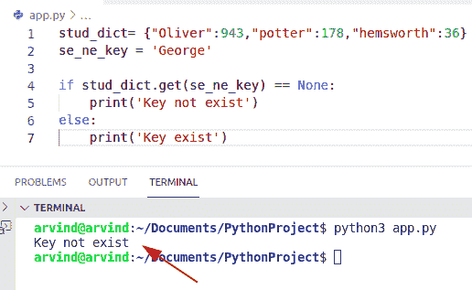

Python dictionary contains key example

阅读: [Python 字典删除](https://pythonguides.com/python-dictionary-remove/)

## Python 字典包含键值对

*   这里我们可以看到如何检查一个键/值对是否包含在 Python 字典中。检查字典中是否存在键/值对的最简单方法是使用操作符中的**。**

**举例:**

```py
new_dict={'Brazil':63,'Bermuda':71,'Ireland':189}

new_key,new_value = 'Bermuda',71                
z = new_key in new_dict and new_value == new_dict[new_key]
print("Keys and value exist in dictionary:",z)
```

下面是以下给定代码的执行过程

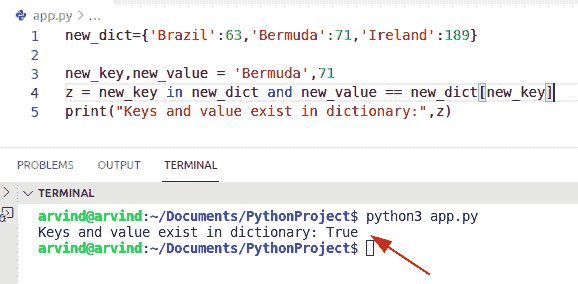

Python dictionary contains key-value pair

## Python 字典包含另一个字典

*   这里我们可以看到一个字典是否是 Python 中另一个字典的子集。
*   为了执行这个任务，我们可以使用 items()方法和< =操作符。在 Python 中，items()方法返回包含键值对的列表。
*   **< =** 运算符比较这些值，并以“真”或“假”的形式返回结果。

**源代码:**

```py
Country_dict = {'Kuwait' : 523, 'Jordan' : 876, 'Laos' : 921, 'Libya' : 167, 'Malta' : 763}
sub_country = {'Jordan' : 876, 'Libya' : 167, 'Malta' : 763}

print("Country names:",Country_dict)
print("Another dictionary:",sub_country)
new_output = sub_country.items() <= Country_dict.items()
print("Dictionary contains in another dict: ",new_output)
```

下面是以下代码的截图

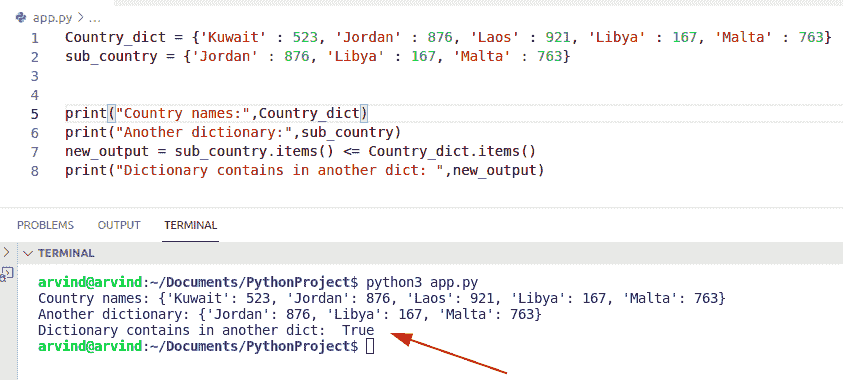

Python dictionary contains another dictionary

阅读: [Python 字典长度](https://pythonguides.com/python-dictionary-length/)

## Python 字典包含元素

*   为了检查元素是否包含在字典中，我们可以使用 Python 中的操作符中的**。**

**举例:**

```py
new_dictionary = {"z":18,"a":14,"c":10}

print(('a', 14) in new_dictionary.items())
```

下面是以下给定代码的实现

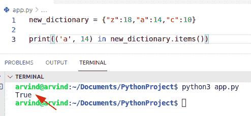

Python dictionary contains elements

阅读: [Python 字典索引](https://pythonguides.com/python-dictionary-index/)

## Python 字典包含多个键

*   让我们看看如何在 Python 中检查一个字典中是否包含多个键。
*   要执行这项任务，我们可以很容易地使用 issubset()方法。这个方法是 Python 中的内置函数，如果 dict1 的所有元素都包含在原始字典中，它将返回 true。

**代码:**

```py
Food_dict = {"Italian" : 25, "Mexican" : 31, "Chinese" :27}
# multiple keys
new_dict = set(['Italian', 'Mexican'])
print(new_dict.issubset(Food_dict.keys()))
```

首先在上面的代码中，我们将初始化一个字典，声明一个**‘new _ dict’**变量，并分配我们想要比较和显示输出的一组键。

下面是以下给定代码的实现

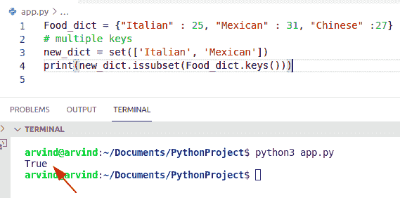

Python dictionary contains multiple keys

阅读: [Python 字典初始化](https://pythonguides.com/python-dictionary-initialize/)

## Python 字典包含重复键

在 Python 中检查字典中是否包含重复的键。我们可以很容易地使用方法链和 set()。该方法接受一系列 iterable 项，并返回单个 iterable 项。

**源代码:**

```py
from itertools import chain

new_dictionary = {'m':87, 'a':29, 'q':29, 'w':34}

find_key = {}
for new_k, new_val in new_dictionary.items():
    find_key.setdefault(new_val, set()).add(new_k)

output = set(chain.from_iterable(
         new_val for new_k, new_val in find_key.items()
         if len(new_val) > 1))
print("Duplicate values", output)
```

下面是以下代码的截图

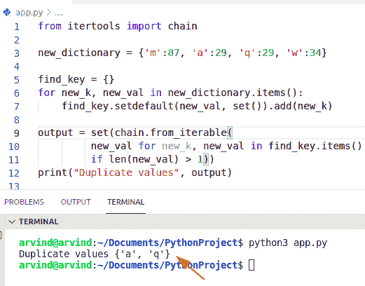

Python dictionary contains duplicate keys

阅读: [Python 字典过滤器](https://pythonguides.com/python-dictionary-filter/)

## Python 字典键包含字符串

为了执行这项任务，我们可以在 python 中应用 python keys()方法。该方法帮助用户检查键是否包含现有字典中的字符串。

**源代码:**

```py
new_dict= {"Andrew":146,"Hayden":190,"James":370}
new_key = 'Hayden'

if new_key in new_dict.keys():
    print("True, string contains:")
else:
    print("False, string does not contains")
```

**输出:**

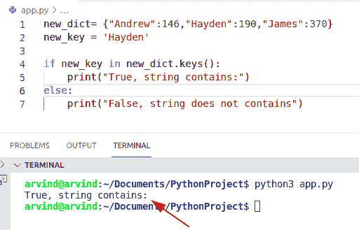

Python dictionary key contains a string

您可能也喜欢阅读:

*   [Python 循环遍历一个列表](https://pythonguides.com/python-loop-through-a-list/)
*   [Python 复制文件](https://pythonguides.com/python-copy-file/)
*   [Python 文件方法](https://pythonguides.com/python-file-methods/)
*   [集合 Python 的并集](https://pythonguides.com/union-of-sets-python/)
*   [Python 向 CSV 写列表](https://pythonguides.com/python-write-a-list-to-csv/)

在本 Python 教程中，我们讨论了 Python 字典包含的**。**在这里，我们还介绍了以下示例:

*   Python 字典包含值
*   Python 字典包含密钥
*   Python 字典包含列表作为值
*   Python 字典包含关键示例
*   Python 字典包含键值对
*   Python 字典包含另一个字典
*   Python 字典包含元素
*   Python 字典包含多个键
*   Python 字典包含重复的键
*   Python 字典键包含字符串

[Bijay Kumar](https://pythonguides.com/author/fewlines4biju/)

Python 是美国最流行的语言之一。我从事 Python 工作已经有很长时间了，我在与 Tkinter、Pandas、NumPy、Turtle、Django、Matplotlib、Tensorflow、Scipy、Scikit-Learn 等各种库合作方面拥有专业知识。我有与美国、加拿大、英国、澳大利亚、新西兰等国家的各种客户合作的经验。查看我的个人资料。

[enjoysharepoint.com/](https://enjoysharepoint.com/)[](https://www.facebook.com/fewlines4biju "Facebook")[](https://www.linkedin.com/in/fewlines4biju/ "Linkedin")[](https://twitter.com/fewlines4biju "Twitter")