# Python 字典计数+示例

> 原文：<https://pythonguides.com/python-dictionary-count/>

[](https://sharepointsky.teachable.com/p/python-and-machine-learning-training-course)

在本 [Python 教程](https://pythonguides.com/learn-python/)中，我们将使用 Python 中的一些例子来学习 **Python 字典计数**。此外，我们还将涉及这些主题。

*   Python 字典计数值
*   Python 字典计算重复值
*   每个键的 Python 字典计数值
*   Python 字典计数键出现次数
*   Python 字典计数值出现次数
*   Python 字典计数键
*   Python 字典计数频率
*   Python 字典计算唯一值
*   Python 使用计数创建字典
*   Python 使用条件计算字典中的项目
*   Python 字典更新计数
*   Python 字典计算列表中的项目
*   Python 在字典中统计单词
*   Python 排序字典计数

目录

[](#)

*   [Python 字典计数](#Python_dictionary_count "Python dictionary count")
*   [Python 字典计数值](#Python_dictionary_count_values "Python dictionary count values")
*   [Python 字典计数重复值](#Python_dictionary_count_duplicate_values "Python dictionary count duplicate values")
*   [Python 字典每个键的计数值](#Python_dictionary_count_values_per_key "Python dictionary count values per key")
*   [Python 字典统计关键字出现次数](#Python_dictionary_count_key_occurrences "Python dictionary count key occurrences")
*   [Python 字典计数值出现次数](#Python_dictionary_count_value_occurrences "Python dictionary count value occurrences")
*   [Python 字典计数键](#Python_dictionary_count_keys "Python dictionary count keys")
*   [Python 字典计数频率](#Python_dictionary_count_frequency "Python dictionary count frequency")
*   [Python 字典计算唯一值](#Python_dictionary_count_unique_values "Python dictionary count unique values")
*   [Python 创建带计数的字典](#Python_create_dictionary_with_count "Python create dictionary with count")
*   [Python 用条件](#Python_count_items_in_dictionary_with_condition "Python count items in dictionary with condition")统计字典中的条目
*   [Python 字典更新计数](#Python_dictionary_update_count "Python dictionary update count")
*   [Python 字典统计列表中的项目](#Python_dictionary_count_items_in_list "Python dictionary count items in list")
*   [Python 统计字典中的单词](#Python_count_words_in_dictionary "Python count words in dictionary")
*   [Python 排序字典计数](#Python_sort_dictionary_count "Python sort dictionary count")

## Python 字典计数

*   在本节中，我们将学习如何计算 Python 字典中的键和值。
*   为了执行这个特定的任务，我们将使用 `len()` 函数，该函数返回字典中**键值**对的总数。这个方法将检查 Python 中项目的大小。
*   如果你想找到存储在字典中的条目的计数，那么你必须使用 `len()` 函数，其中条目被表示为键值对。

**语法:**

让我们看一下语法并理解 Python `len()` 函数的工作原理

```py
len(dict)
```

*   **字典:**该参数表示要计算长度的字典

**举例:**

让我们举一个例子，检查如何计算 Python 字典中的条目

```py
my_dictionary = {'U.S.A':167,'United Kingdom':67,'Japan':167,'China':783}

result=len(my_dictionary)
print("Count dictionary items:",result)
```

在上面的例子中，我们创建了一个名为**‘my _ dictionary’**的简单字典，它包含了键值对形式的条目。之后，我们使用了 th `e len()` 函数，在这个函数中，我们指定了字典。一旦您将执行**e‘结果’**，那么输出将显示字典条目的计数**‘4’**。

下面是下面给出的代码的截图。

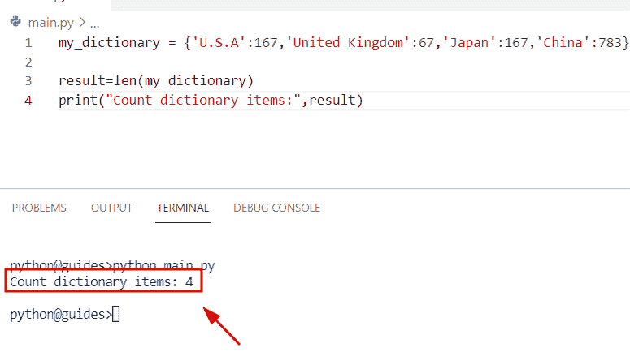

Python dictionary count keys and values

阅读:[获取字典 Python 中的第一个键](https://pythonguides.com/get-first-key-in-dictionary-python/)

## Python 字典计数值

*   在这个程序中，我们将了解如何计算 Python 字典中的值。
*   通过使用 len 函数，我们可以很容易地计算字典中键值对的数量。在这个例子中，我们只需要从字典中提取值。
*   为了完成这项任务，我们将使用 dict.values 方法。这个方法将帮助用户从给定的字典中获取所有的值。这是一个**内置的()**方法，可以在 Python 包中获得。

**语法:**

下面是 Python `dict.values()` 方法的语法。

```py
dictionary.values()
```

> **注意:** 该函数不带任何参数

**举例:**

让我们看看这个例子，并检查如何在 Python 中使用 `dict.values()` 函数。

**源代码:**

```py
Country_name = {'Germany':456,'U.S.A':789,'Malaysia':745}

new_output=len(Country_name.values())
print("Count values in dictionary:",new_output)
```

*   在下面的代码中，我们创建了一个名为**‘Country _ name’**的字典，其中包含了键值对形式的元素。
*   在那之后，我们声明了一个变量‘new _ output ’,在这个变量中我们指定了 `len()` 函数和 `dict.values()` 方法。
*   一旦执行**‘new _ output’**，结果将显示字典中的计数值。

下面是以下给定代码的实现。

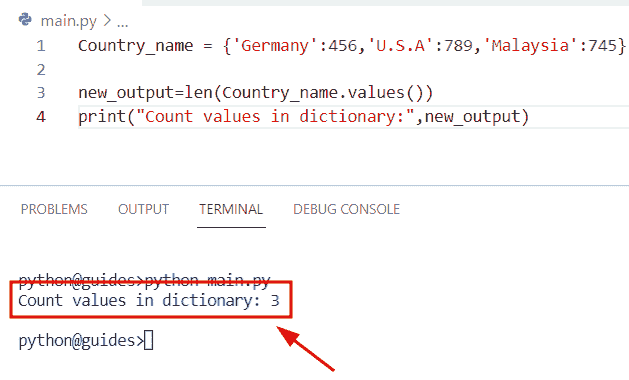

Python dictionary count values

阅读: [Python 字典增量值](https://pythonguides.com/python-dictionary-increment-value/)

## Python 字典计数重复值

*   在本节中，我们将学习如何计算 Python 字典中的重复值。
*   通过使用 `counter()` 方法，我们可以很容易地对字典中的重复值进行计数。这个方法是集合模块的一部分，用于计算可散列对象的数量。

**举例:**

```py
from collections import Counter

my_dict = {"John": 156, "U.S.A": 156, "France": 987,
         "George":678, "Australia": 156}

new_output = Counter(my_dict.values())
print("Count duplicate values:",new_output)
```

在下面给出的代码中，我们使用了 `counter()` 方法，并且在这个函数中，我们将 `dict.values()` 指定为一个参数。一旦执行了这段代码，它就会计算出字典中存在的重复值。

下面是下面给出的代码的截图。

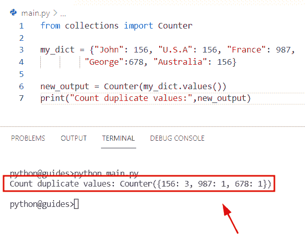

Python dictionary count duplicate values

阅读: [Python 列表字典](https://pythonguides.com/python-dictionary-of-lists/)

## Python 字典每个键的计数值

*   这里我们可以看到如何根据 key 元素计算字典中的值。
*   为了完成这个任务，我们将使用 `dictionary.items()` 方法。在 Python 中， `dictionary.items()` 方法用于返回元组列表，该列表包含以**键-值**对形式的字典元素。

**语法:**

让我们看看语法，了解一下 `dict.items()` 方法的工作原理。

```py
dictionary.items()
```

**举例:**

让我们举一个例子，检查如何按键计算字典中的值。

**源代码:**

```py
new_dictionary = {
    'France ': [56,23,45],
    'U.S.A ': [178,234,567],
    'United Kingdom ': [345,189,678,987],
    'China ': [134,2345,8954,2678,33],
}
for new_k, new_val in new_dictionary.items():
    print(new_k, len([item for item in new_val if item]))
```

下面是以下给定代码的实现。

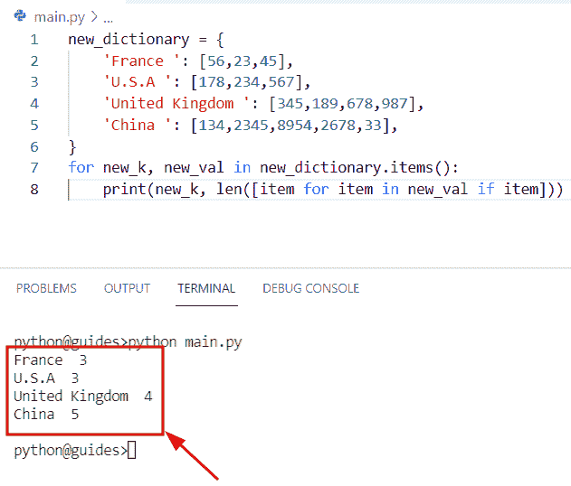

Python dictionary count values per key

阅读: [Python 字典扩展-完整教程](https://pythonguides.com/python-dictionary-extend/)

## Python 字典统计关键字出现次数

*   让我们看看如何计算 Python 字典中键的出现次数。
*   为了执行这个特定的任务，我们将使用 counter()和 chain()方法。首先，我们将创建一个字典，然后我们将使用 counter()函数，在这个方法中，我们将字典指定为一个参数。

**举例:**

```py
from collections import Counter
from itertools import chain

my_dictionary = [
    {16: 'George', 18: 'Oliva', 78: 'Lilly', 16: 'William'},
    {16: 'John', 16: 'James'},
    {78: 'Micheal', 18: 'Potter'},
]
new_output = Counter(chain.from_iterable(my_dictionary))
print("Count occurrence keys:",new_output)
```

下面是以下给定代码的实现。

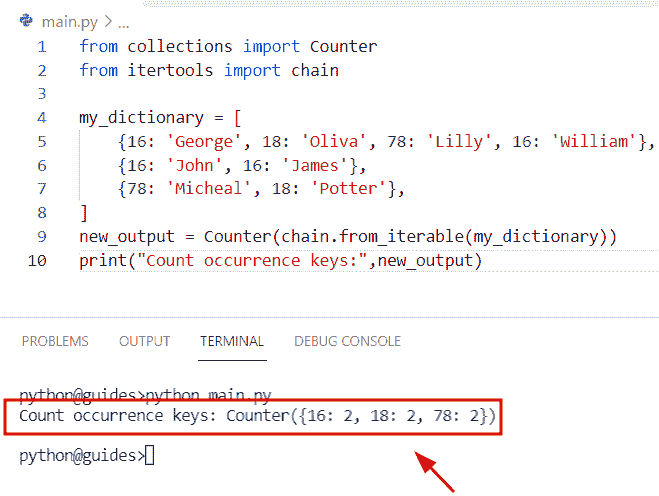

Python dictionary count key occurrences

正如您在屏幕截图中看到的，输出显示了出现键的计数。

阅读: [Python 字典副本带示例](https://pythonguides.com/python-dictionary-copy/)

## Python 字典计数值出现次数

*   在本节中，我们将学习如何计算 Python 字典中出现的值。
*   为了完成这项任务，我们将使用 `counter()` 模块。在 python 中，计数器用于计算 Python 中可迭代对象的值，这些值可以是**零、正整数、负整数。**
*   在这个例子中，我们将初始化一个列表，然后用它来分组值和每个值出现次数。

**举例:**

让我们举一个例子，看看如何在 Python 字典中计算值的出现次数。

**源代码:**

```py
from collections import Counter

my_new_dict = [{'George' : 167, 'John' : 267}, {'George' : 167, 'John' : 267}, 
             {'George' : 167, 'John' : 267}, {'George' : 167, 'John' : 267},
             {'George' : 167, 'John' : 267}, {'George' : 167, 'John' : 267} ]

new_k = 'John'
new_output = dict(Counter(sub[new_k] for sub in my_new_dict))
print(new_output)
```

你可以参考下面的截图。

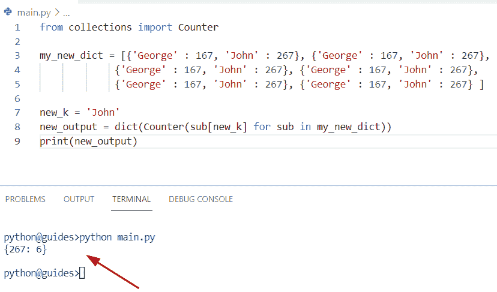

Python dictionary count value occurrences

阅读: [Python 字典多键](https://pythonguides.com/python-dictionary-multiple-keys/)

## Python 字典计数键

*   让我们看看如何计算 Python 字典中的关键元素。
*   通过使用 `len()` 函数，我们可以很容易地计算字典中键-值对的数量。在这个例子中，我们只需要从字典中提取关键元素。
*   为了执行这个细节，我们将使用 `dictionary.keys()` 方法。在 Python 中， `dictionary.keys()` 方法返回一个对象，该对象包含给定字典中可用的所有键的列表。

**语法:**

让我们看一下语法，理解一下 `dictionary.keys(` )方法的工作原理。

```py
dict.keys()
```

> **注意:** 这个方法不需要任何参数。

**举例:**

```py
new_dictionary = {'John':167,'William':267,'Micheal':745,'Chris':134}

new_result=len(new_dictionary.keys())
print("Count keys in dictionary:",new_result)
```

在上面的代码中，我们创建了一个名为**‘new _ dictionary’**的字典，其中我们以键-值对的形式分配元素。之后，我们使用了 `dictionary.keys()` 方法，通过使用 `len()` 函数来显示 keys 元素的计数

你可以参考下面的截图。

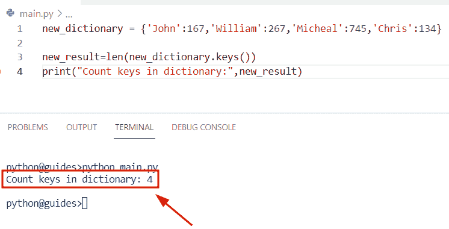

Python dictionary count keys

阅读: [Python 在字典中查找最大值](https://pythonguides.com/python-find-max-value-in-a-dictionary/)

## Python 字典计数频率

*   在本节中，我们将学习如何在 Python 字典中计算项目频率。
*   在这个例子中，我们有一个包含多个值的给定列表，我们必须使用**来计算列表中每个值的出现频率。items()** 方法，它将检查列表中每个元素出现的次数。
*   为了完成这个任务，我们将使用 `list.count()` 方法，它将遍历列表并计算频率。在 Python 中 `list.count()` 是一个内置的()函数，它会返回列表中对象或元素出现的次数。

**语法:**

让我们看一下语法并理解工作的 Python `list.count()` 方法

```py
list.count(element)
```

> **注:** 元素参数表示给定列表中要统计的元素。

**举例:**

让我们举一个例子，检查如何在 Python 字典中计算项目频率

**源代码:**

```py
new_list =[16,16,17,17,17,18,18,19,19,19]

frequency = {}
for items in new_list:
   frequency[items] = new_list.count(items)
for new_k, new_val in frequency.items():
   print("Count frequency:",frequency)
```

下面是下面给出的代码的截图。

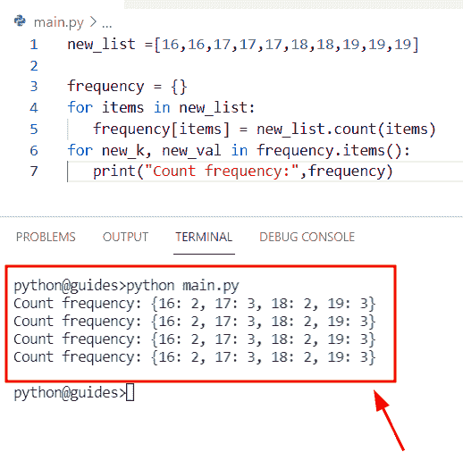

Python dictionary count frequency

阅读:[如何创建一个空的 Python 字典](https://pythonguides.com/how-to-create-an-empty-python-dictionary/)

## Python 字典计算唯一值

*   在本节中，我们将学习如何计算 Python 字典中的唯一值。
*   在这个例子中，我们使用了 itertools 模块和 chain 函数。这个函数接受多个 iterable，并且总是返回一个 iterable。该方法在 Python 包模块中可用。

**语法:**

下面是 `chain()` 函数的语法

```py
chain(*iterables)
```

**举例:**

```py
from collections import Counter
from itertools import chain

new_list = [{"Germany":167, "U.S.A": 144},
     {"Germany": 456, "U.S.A": 987},
     {"Germany": 98, "China": 77},
    {"Japan":42, "Australia":567}]
new_output=Counter(chain.from_iterable(e.values() for e in new_list))
print(new_output)
```

下面是以下给定代码的实现。

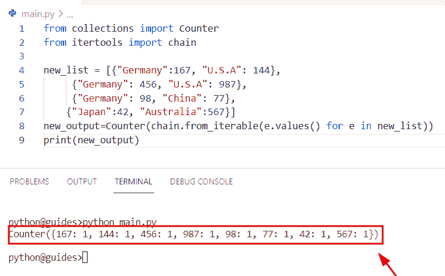

Python dictionary count unique values

阅读: [Python 字典转 CSV](https://pythonguides.com/python-dictionary-to-csv/)

## Python 创建带计数的字典

*   让我们看看如何在 Python 字典中用 count 创建字典。
*   为了执行这个特定的任务，我们将首先创建一个名为**‘new _ list’**的列表，然后分配多个元素。
*   接下来，我们将声明一个变量**‘new _ result’**，并使用 list comprehension 方法来迭代来自给定列表的值。

**举例:**

```py
new_list = ['U.S.A','U.S.A','Japan','Japan','Japan','Germany','Germany']

new_result = {m:new_list.count(m) for m in new_list}
print(new_result)
```

下面是以下代码的截图

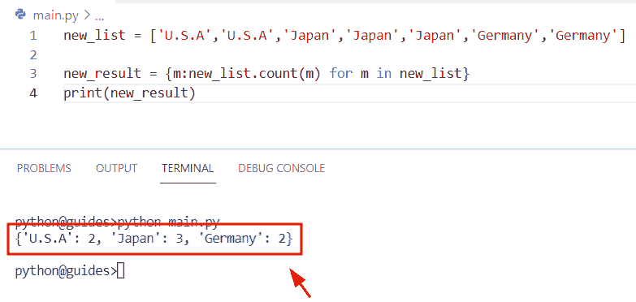

Python create a dictionary with a count

阅读: [Python 元组字典](https://pythonguides.com/python-dictionary-of-tuples/)

## Python 用条件统计字典中的条目

*   这里我们可以看到如何用条件计算 Python 字典中的条目。
*   在这个程序中，我们创建了一个函数**‘count _ items’**来计算 Python 字典中的条目数，然后我们将一个变量【T2’‘z’声明为 `0` ，并在 for 循环中使用 enumerator 方法对字典进行迭代。
*   在 Python 中, `enumerator()` 方法返回一个枚举对象，并为 iterable 对象的每个元素插入一个计数器。

**语法:**

让我们看一下语法，理解一下 `enumerator()` python 的工作原理

```py
enumerator(iterable,startindex)
```

**举例:**

让我们举一个例子，看看如何用条件计算 Python 字典中的条目。

```py
my_dictionary = {'George':17,'Micheal':15,'William':178,'John':432}

def count_items(my_dictionary):
    z = 0
    for i in enumerate(my_dictionary):
        z += 1
    return z

print("Count items in dictionary:",count_items(my_dictionary))
```

下面是以下给定代码的实现。

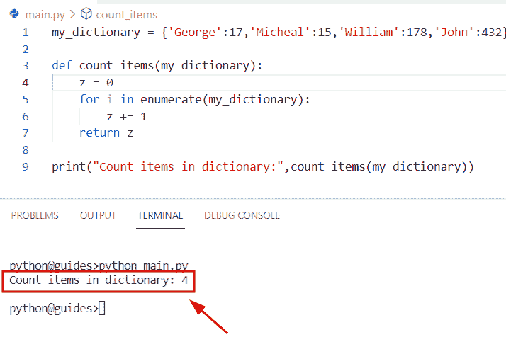

Python count items in a dictionary with condition

正如您在截图中看到的，输出显示字典中的计数项是 `4` 。

阅读: [Python 字典 pop](https://pythonguides.com/python-dictionary-pop/)

## Python 字典更新计数

*   在本节中，我们将学习如何在 Python 字典中更新计数。
*   为了执行这个特定的任务，首先我们将创建一个字典，并使用 `dictionary.update()` 函数更新一个新元素。更新字典元素后，我们必须使用 `len()` 函数，该函数返回字典中键-值对的总数。
*   获取更多关于 [Python 字典更新](https://pythonguides.com/python-dictionary-update/)的信息。你可以参考我们关于更新词典的详细文章。

**语法:**

下面是 `len()` 函数的语法

```py
len(dict)
```

**举例:**

```py
my_dictionary = {'U.S.A':167,'United Kingdom':67,'Japan':167,'China':783}
new_update = {'Germany':48}

my_dictionary.update(new_update)
print("Updated Dictionary:",my_dictionary)
result=len(my_dictionary)
print("Count dictionary items:",result)
```

下面是以下给定代码的执行。

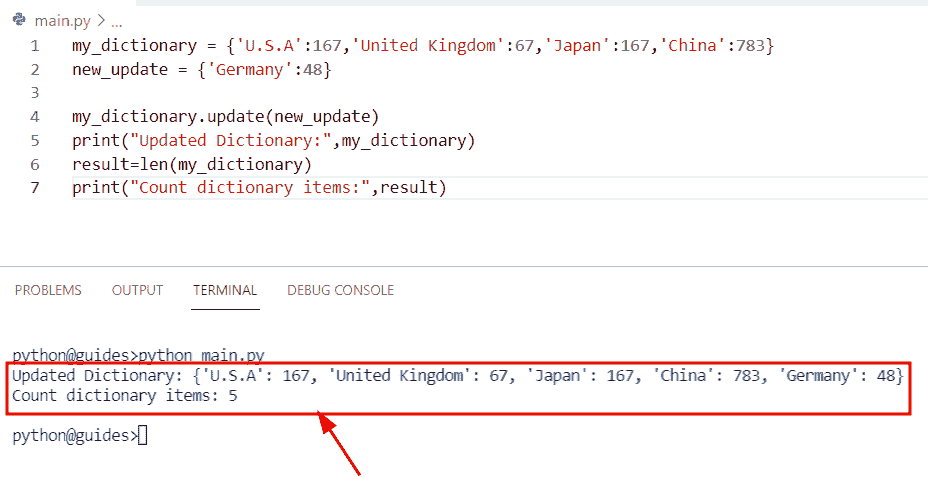

Python dictionary update count

阅读: [Python 字典按值查找键](https://pythonguides.com/python-dictionary-find-a-key-by-value/)

## Python 字典统计列表中的项目

*   在这个程序中，我们将学习如何使用 Python 字典对列表中的项目进行计数。
*   为了完成这项任务，我们将使用列表理解方法并迭代列表中的所有值。
*   接下来在列表理解方法中，我们将使用 `list.count()` 方法，该方法将帮助用户返回列表中对象或元素的次数。

**举例:**

```py
list = ['George','George','James','James','James','Micheal','Micheal']

new_output = {z:list.count(z) for z in list}
print("Count item in list:",new_output)
```

下面是以下给定代码的输出。

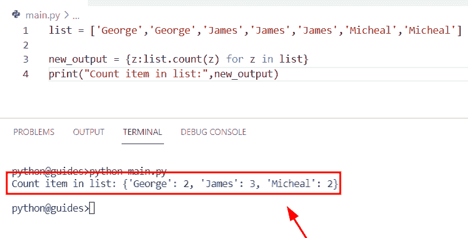

Python dictionary count items in a list

阅读: [Python 字典删除](https://pythonguides.com/python-dictionary-remove/)

## Python 统计字典中的单词

*   在这一节中，我们将学习如何计算 Python 字典中的单词。
*   为了执行这个特定的任务，首先我们将创建一个字典，并以键值对的形式分配元素。现在我们必须从给定的字典中获取计数单词。
*   通过使用 `len()` 函数，我们可以很容易地得到键和值的计数字。但是在这个函数中，我们将使用 `dict.keys()` 和 `dict.values()` 方法。这个方法将帮助用户从给定的字典中获取所有的值和键。

**举例:**

```py
my_dictionary = {'John':456,'Micheal':890,'George':156,'Oliva':789}

result=len(my_dictionary.keys())
result2=len(my_dictionary.values())
print("Count dictionary words keys:",result)
print("Count dictionary words values:",result2)
```

下面是以下给定代码的执行。

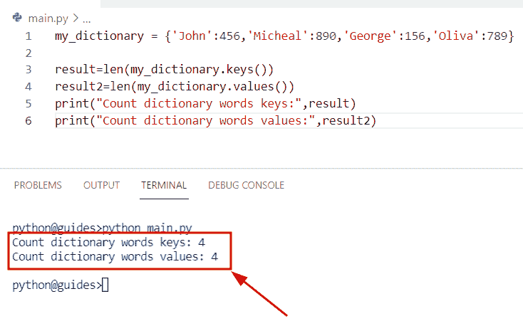

Python count words in a dictionary

## Python 排序字典计数

*   在 Python 中, `sorted()` 是一个内置函数，可以很容易地帮助用户对 Python 字典中的所有元素进行排序。
*   获取所有关于 `sorted()` 函数的信息。可以参考我们的详细文章 [Python 字典排序](https://pythonguides.com/python-dictionary-sort/)。

**举例:**

让我们看一下这个例子，理解一下 `sorted()` 函数的工作原理

**源代码:**

```py
my_dictionary = {"Austraila":6542,"United Kingdom":123,"U.S.A":98245,"France":1456} 

new_output = sorted(my_dictionary.values())
print("Sorted Values",new_output) 
```

在上面的代码中，我们刚刚创建了一个名为**‘my _ dictionary’**的简单字典，它包含一个键值对元素。

之后，我们使用了 `sorted()` 函数，在这个函数中，我们分配了 `dict.values()` 方法。一旦执行了这段代码，输出将显示排序后的值。

下面是下面给出的代码的截图。

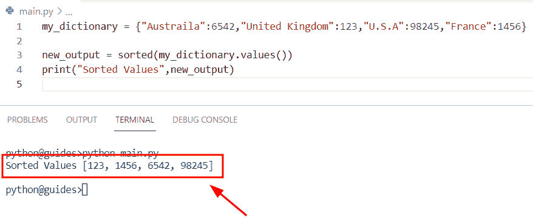

Python sort dictionary count

您可能也喜欢阅读以下 Python 教程。

*   [Python 字典键错误](https://pythonguides.com/python-dictionary-key-error/)
*   [遍历字典 Python](https://pythonguides.com/iterate-through-dictionary-python/)
*   [Python 字典索引-完整教程](https://pythonguides.com/python-dictionary-index/)
*   [Python 字典初始化–完整教程](https://pythonguides.com/python-dictionary-initialize/)
*   [Python 串联字典+例子](https://pythonguides.com/python-concatenate-dictionary/)

在这篇 python 教程中，我们已经通过 Python 中的一些例子学习了**如何计算字典**中的条目。此外，我们还将涉及这些主题。

*   Python 字典计数值
*   Python 字典计算重复值
*   每个键的 Python 字典计数值
*   Python 字典计数键出现次数
*   Python 字典计数值出现次数
*   Python 字典计数键
*   Python 字典计数频率
*   Python 字典计算唯一值
*   Python 使用计数创建字典
*   Python 使用条件计算字典中的项目
*   Python 字典更新计数
*   Python 字典计算列表中的项目
*   Python 在字典中统计单词
*   Python 排序字典计数

[Bijay Kumar](https://pythonguides.com/author/fewlines4biju/)

Python 是美国最流行的语言之一。我从事 Python 工作已经有很长时间了，我在与 Tkinter、Pandas、NumPy、Turtle、Django、Matplotlib、Tensorflow、Scipy、Scikit-Learn 等各种库合作方面拥有专业知识。我有与美国、加拿大、英国、澳大利亚、新西兰等国家的各种客户合作的经验。查看我的个人资料。

[enjoysharepoint.com/](https://enjoysharepoint.com/)[](https://www.facebook.com/fewlines4biju "Facebook")[](https://www.linkedin.com/in/fewlines4biju/ "Linkedin")[](https://twitter.com/fewlines4biju "Twitter")