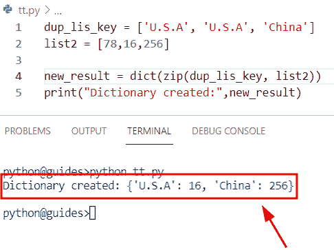
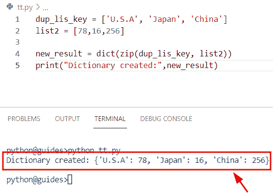
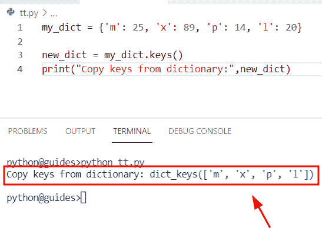
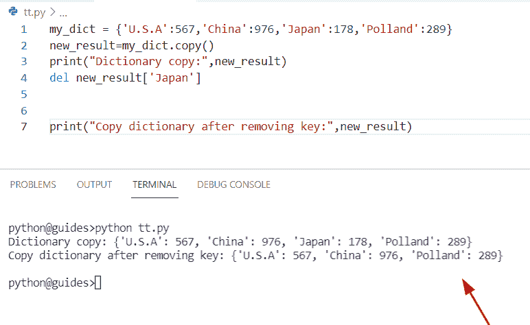
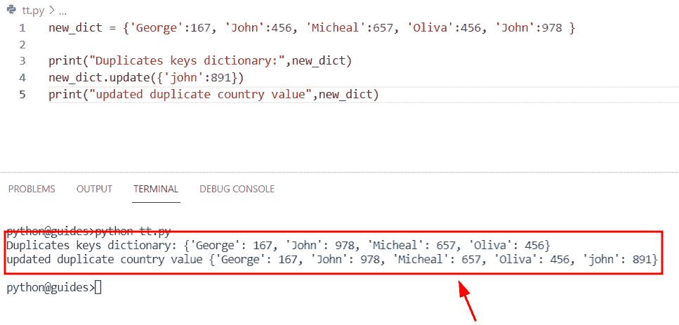
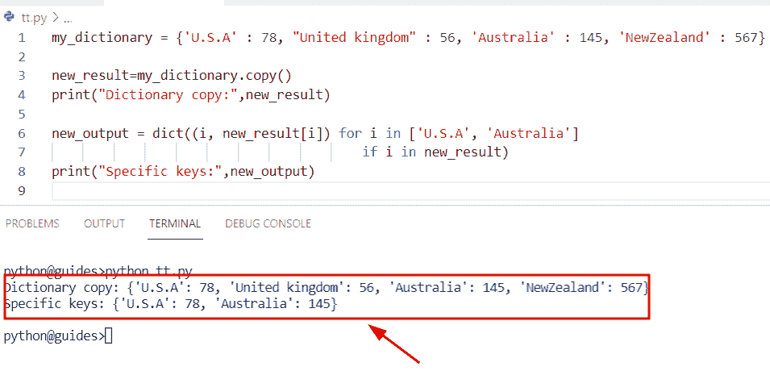
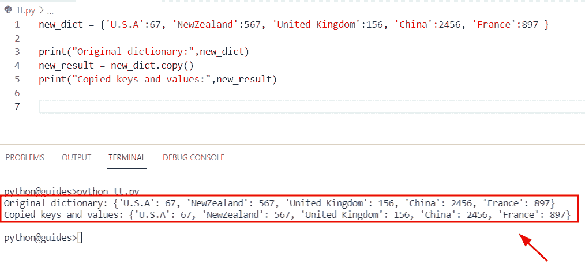

# Python 字典重复键

> 原文：<https://pythonguides.com/python-dictionary-duplicate-keys/>

[](https://sharepointsky.teachable.com/p/python-and-machine-learning-training-course)

在本 [Python 教程](https://pythonguides.com/learn-python/)中，我们将使用 Python 中的一些例子来学习关于 **Python 字典重复键**的内容。此外，我们还将涉及这些主题。

*   Python 字典重复键
*   Python 字典复制键
*   Python 字典移除重复的键
*   Python 复制字典删除键
*   Python 字典更新重复键
*   Python 字典复制特定的键
*   Python 字典复制键和值

目录

[](#)

*   [Python 字典重复键](#Python_dictionary_duplicate_keys "Python dictionary duplicate keys")
*   [Python 字典复制键](#Python_dictionary_copy_keys "Python dictionary copy keys")
*   [Python 字典删除重复键](#Python_dictionary_remove_duplicate_keys "Python dictionary remove duplicate keys")
*   [Python 复制字典移除键](#Python_copy_dict_remove_key "Python copy dict remove key")
*   [Python 字典更新重复键](#Python_dictionary_update_duplicate_keys "Python dictionary update duplicate keys")
*   [Python 字典复制特定的键](#Python_dict_copy_specific_keys "Python dict copy specific keys")
*   [Python 字典复制键和值](#Python_dictionary_copy_keys_and_values "Python dictionary copy keys and values")

## Python 字典重复键

*   在本节中，我们将学习如何使用 list Python 中的重复键来创建字典。
*   为了完成这个任务，我们将使用 `dict()` 的概念和 `zip()` 的方法。这些方法在 Python 中可用， `zip()` 方法将 iterable 作为参数，其中 iterable 可以是元组列表。
*   为了创建一个字典，我们将使用 `dict()` 方法。在 Python 中， `dict()` 方法会检查条件，如果参数中没有值，那么它会声明一个空字典。
*   在本例中，我们创建了两个名为**‘dup _ lis _ key’**和**‘list 2’**的列表，并在其中分配了字符串和整数值。
*   接下来，我们将声明一个变量“new_result ”,并使用 `dict()` 函数来创建一个字典。现在我们将把**‘dup _ lis _ key’**列表看作一个字典键，把**‘list 2’**看作一个字典值。

**举例:**

```py
dup_lis_key = ['U.S.A', 'U.S.A', 'China']
list2 = [78,16,256]

new_result = dict(zip(dup_lis_key, list2))
print("Dictionary created:",new_result)
```

在上面的例子中，我们已经创建了一个列表，其中我们已经指定了重复的国家名称**‘U . s . a’**。现在我们将检查重复键**‘美国’**是否会包含在字典中。

下面是下面给出的代码的截图。



Python dictionary duplicate keys

正如您在屏幕截图中看到的，输出显示了字典，但它在字典中没有重复的键，因为在 Python 字典中不允许重复的键。

如果你想从一个列表中得到所有这些值，并把它们存储在字典中，那么你必须对每个值使用唯一键。

让我们举一个例子，看看如何创建一个带有惟一键的 Python 字典

```py
dup_lis_key = ['U.S.A', 'Japan', 'China']
list2 = [78,16,256]

new_result = dict(zip(dup_lis_key, list2))
print("Dictionary created:",new_result)
```

在上面的代码中，我们刚刚将关键元素从**‘美国’**更新为**‘日本’**。一旦执行了这段代码，它将显示所有的关键元素和值。

下面是以下给定代码的实现



Python dictionary

另外，检查:[如果不是 Python 中的条件](https://pythonguides.com/if-not-condition-in-python/)

## Python 字典复制键

*   在这个程序中，我们将学习如何从 Python 字典中复制键。
*   为了执行这个特定的任务，我们将使用 `dict.keys()` 方法。这是 Python 包中的一个**内置()**方法，用于从字典中获取关键元素，并将它们存储到一个新列表中。
*   在这个例子中，我们只需要从给定的字典中复制关键元素。为了完成这项任务，首先我们将创建一个字典，在其中我们将分配**键值**对元素。接下来，我们将使用 `dict.keys()` 方法，其中 dict 是字典名。

**语法:**

让我们看一下语法并理解 `dict.keys()` 方法的工作原理

```py
dict.keys()
```

**举例:**

让我们举一个例子，检查如何使用 `dict.keys()` 方法从字典中复制关键元素

**源代码:**



Python dictionary copy keys

正如您在屏幕截图中看到的，输出显示了字典中的键。

阅读: [Python 返回函数](https://pythonguides.com/python-return-function/)

## Python 字典删除重复键

我们已经在一篇文章的 [Python dictionary remove](https://pythonguides.com/python-dictionary-remove/) 中讨论过这个主题。您将获得关于如何从 Python 字典中删除重复键的所有信息。

## Python 复制字典移除键

*   这里我们将看到如何在 Python 中从复制字典中移除键。
*   通过使用 `dict.copy()` 方法，我们可以很容易地将原始字典复制到另一个字典，这个方法是 python 中的内置函数，它不需要任何参数。根据程序，如果您打印**‘new _ result’**变量，输出将显示原始字典的浅层副本。
*   现在，我们将使用 del 关键字从复制的字典中删除键，这个关键字基本上用于删除 Python 中的条目。

**语法:**

下面是 Python `dict.copy()` 方法的语法

```py
dict.copy()
```

**源代码:**

```py
my_dict = {'U.S.A':567,'China':976,'Japan':178,'Polland':289}
new_result=my_dict.copy()
print("Dictionary copy:",new_result)
del new_result['Japan']

print("Copy dictionary after removing key:",new_result)
```

在上面的代码中，我们创建了一个名为**‘my _ dict’**的简单字典，并分配了键值对。之后，我们使用了 del 关键字，并指定了我们想要从字典中删除的键名 **['japan']** 。

下面是以下给定代码的实现



Python copy dict remove key

正如您在屏幕截图中看到的，输出显示“japan”键已从字典中删除。

阅读:[获取字典 Python 中的第一个键](https://pythonguides.com/get-first-key-in-dictionary-python/)

## Python 字典更新重复键

*   在本节中，我们将学习如何更新 Python 字典中的重复键。
*   为了完成这项任务，我们将使用 dictionary.update()函数。Python 包中提供了这个函数，它用于更新字典元素(键-值)对。
*   获取关于字典 `update()` 函数的详细信息。可以参考我们的文章 [Python 字典更新](https://pythonguides.com/python-dictionary-update/)。

**语法:**

让我们看一下语法并理解 Python`dictionary . update()`函数的工作原理。

```py
dict.update([other])
```

**举例:**

让我们举一个例子，看看如何在 Python 字典中更新重复的键

**来源` `代号:**

```py
new_dict = {'George':167, 'John':456, 'Micheal':657, 'Oliva':456, 'John':978 }

print("Duplicates keys dictionary:",new_dict)
new_dict.update({'john':891})
print("updated duplicate country value",new_dict)
```

在下面给出的代码中，我们创建了一个字典并分配了键值对元素。之后，我们使用了 `dict.update()` 方法，并将复制键作为参数传递。

你可以参考下面的截图



Python dictionary update duplicate keys

正如您在屏幕截图中看到的，输出显示**‘John’**关键元素已经更新。

阅读: [Python 字典增量值](https://pythonguides.com/python-dictionary-increment-value/)

## Python 字典复制特定的键

*   在这个例子中，我们将讨论如何从 Python 中复制的字典中获取特定的键。
*   为了执行这个特定的任务，首先我们将创建一个名为**‘my _ dictionary’**的字典，然后我们将使用 `dict.copy()` 函数来创建原始字典的浅层副本。
*   接下来，为了从字典中获取特定的键，我们将使用字典理解方法，在该方法中，我们在一个列表中指定了关键元素。

**举例:**

```py
my_dictionary = {'U.S.A' : 78, "United kingdom" : 56, 'Australia' : 145, 'NewZealand' : 567}

new_result=my_dictionary.copy()
print("Dictionary copy:",new_result)

new_output = dict((i, new_result[i]) for i in ['U.S.A', 'Australia']
										if i in new_result)
print("Specific keys:",new_output) 
```

下面是以下给定代码的执行。



Python dict copy specific keys

正如您在屏幕截图中看到的，输出显示了特定的键和值。

另外，请阅读: [Python 列表字典](https://pythonguides.com/python-dictionary-of-lists/)

## Python 字典复制键和值

*   在本节中，我们将学习如何在 Python 字典中复制键和值。
*   通过使用 `dictionary.copy()` 方法，我们可以很容易地将键值对元素从一个字典复制到另一个字典。
*   获取关于**字典更新()**功能的详细信息。可以参考我们的文章“ [Python 字典复制](https://pythonguides.com/python-dictionary-copy/)”。

**举例:**

让我们举个例子，看看如何在 Python 中使用 `dictionary.copy()` 函数

**源代码:**

```py
new_dict = {'U.S.A':67, 'NewZealand':567, 'United Kingdom':156, 'China':2456, 'France':897 }

print("Original dictionary:",new_dict)
new_result = new_dict.copy()
print("Copied keys and values:",new_result) 
```

在上面的代码中，首先，我们用一些键值对元素创建了一个名为‘new**_ dict’**的字典。然后，我们应用了 `dict.copy()` 函数，它将返回给定字典的浅层副本。

下面是以下给定代码的执行。



Python dictionary copy keys and values

您可能也喜欢阅读以下 Python 教程。

*   [Python 字典多键](https://pythonguides.com/python-dictionary-multiple-keys/)
*   [Python 字典扩展](https://pythonguides.com/python-dictionary-extend/)
*   [Python 字典到 CSV](https://pythonguides.com/python-dictionary-to-csv/)
*   [Python 元组字典](https://pythonguides.com/python-dictionary-of-tuples/)
*   [Python 字典多值](https://pythonguides.com/python-dictionary-multiple-values/)
*   [在 Python 中检查两个字典是否相等](https://pythonguides.com/check-if-two-dictionaries-are-equal-in-python/)

在本教程中，我们已经讨论了关于 **Python 字典重复键的。**此外，我们已经讨论了这些主题。

*   Python 字典重复键
*   Python 字典复制键
*   Python 字典移除重复的键
*   Python 复制字典删除键
*   Python 字典更新重复键
*   Python 字典复制特定的键
*   Python 字典复制键和值

[Bijay Kumar](https://pythonguides.com/author/fewlines4biju/)

Python 是美国最流行的语言之一。我从事 Python 工作已经有很长时间了，我在与 Tkinter、Pandas、NumPy、Turtle、Django、Matplotlib、Tensorflow、Scipy、Scikit-Learn 等各种库合作方面拥有专业知识。我有与美国、加拿大、英国、澳大利亚、新西兰等国家的各种客户合作的经验。查看我的个人资料。

[enjoysharepoint.com/](https://enjoysharepoint.com/)[](https://www.facebook.com/fewlines4biju "Facebook")[](https://www.linkedin.com/in/fewlines4biju/ "Linkedin")[](https://twitter.com/fewlines4biju "Twitter")