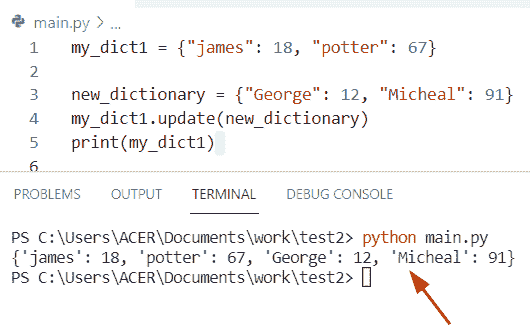
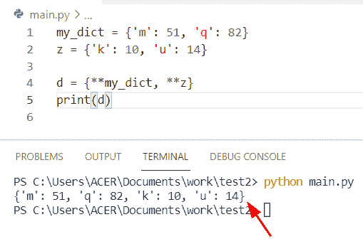
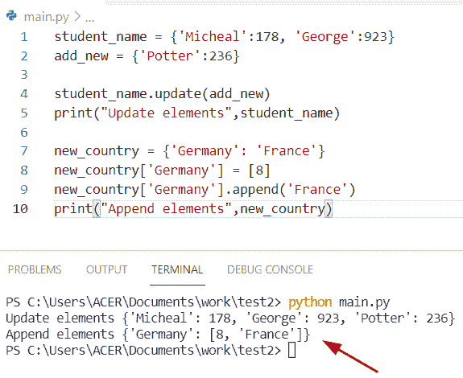
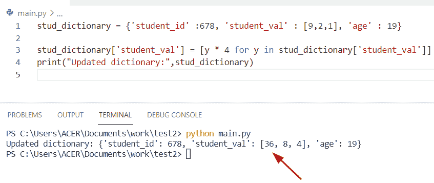
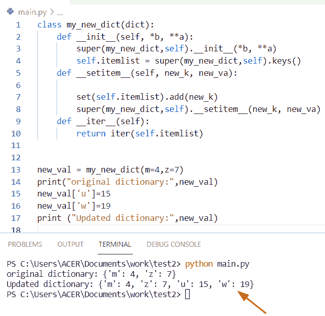
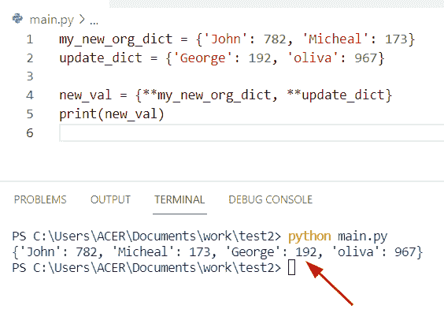
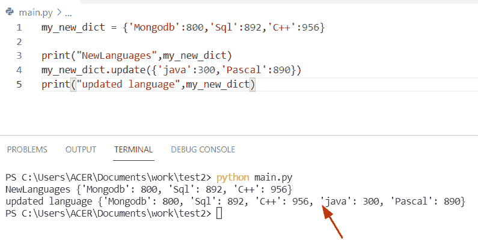

# Python 字典扩展-完整教程

> 原文：<https://pythonguides.com/python-dictionary-extend/>

[](https://sharepointsky.teachable.com/p/python-and-machine-learning-training-course)

在本 [Python 教程](https://pythonguides.com/python-hello-world-program/)中，我们将讨论 **Python 字典扩展。**在这里，我们还将介绍以下例子:

*   Python 字典扩展与追加
*   Python 字典扩展列表
*   Python 扩展字典类
*   Python 字典扩展函数
*   Python 用另一个扩展字典
*   Python 字典扩展与更新

目录

[](#)

*   [Python 字典扩展](#Python_dictionary_extend "Python dictionary extend")
*   [如何用 Python 扩展字典](#How_to_extend_a_dictionary_in_Python "How to extend a dictionary in Python")
*   [Python 字典扩展 vs 追加](#Python_dictionary_extend_vs_append "Python dictionary extend vs append")
*   [Python 字典扩展列表](#Python_dictionary_extend_list "Python dictionary extend list")
*   [Python 扩展字典类](#Python_extend_dictionary_class "Python extend dictionary class")
*   [Python 字典扩展功能](#Python_dictionary_extend_function "Python dictionary extend function")
*   [Python 用另一个](#Python_extend_dictionary_with_another "Python extend dictionary with another")扩展字典
*   [Python 字典扩展 vs 更新](#Python_dictionary_extend_vs_update "Python dictionary extend vs update")

## Python 字典扩展

*   在这个程序中，我们将看到如何用 Python 扩展字典。
*   在 Python 中， `dict.update()` 将帮助用户用键值对从一个字典扩展到另一个字典。

**举例:**

让我们举个例子，看看如何在 Python 中扩展一个[字典。](https://pythonguides.com/create-a-dictionary-in-python/)

```py
my_dict1 = {"james": 18, "potter": 67}

new_dictionary = {"George": 12, "Micheal": 91}
my_dict1.update(new_dictionary)
print(my_dict1)
```

在上面的例子中，我们首先初始化了两个字典**‘my _ dict 1’**和**‘new _ dictionary’**，它们包含键值对形式的元素。

现在我们必须使用 `dict.update()` 方法将字典扩展成另一个字典。

下面是以下代码的执行过程



Python dictionary extend

阅读:[如何用 Python 删除字典](https://pythonguides.com/delete-a-dictionary-in-python/)

## 如何用 Python 扩展字典

通过使用 `**` 操作符，我们可以执行这个特定的任务，这个方法将指定的字典元素添加到当前字典的末尾。

**源代码:**

```py
my_dict = {'m': 51, 'q': 82}
z = {'k': 10, 'u': 14}

d = {**my_dict, **z}
print(d)
```

**输出:**



Python dictionary extend

这就是如何在 Python 中**扩展一个字典。**

阅读 [Python 字典附加示例](https://pythonguides.com/python-dictionary-append/)

## Python 字典扩展 vs 追加

*   在 Python 字典中， `append()` 函数用于向字典中的键添加元素。在字典 extend()中，意味着将第一个字典与另一个字典连接起来。
*   在 Python 字典中，append()函数用于向字典中的键添加元素。在字典 extend()中，意味着将第一个字典与另一个字典连接起来。
*   在这个程序中，我们将学习 `update()` 函数，并检查如何在给定的字典中添加元素。在 Python 字典中，update()函数用于使用来自另一个字典的键值对形式的元素来更新字典。
*   在 Python 字典中，append 可以作为一个列表被 list 使用，我们也可以使用 `"+"` 运算符来追加字典中每个键的列表。

**举例:**

让我们举个例子，检查一下 Python 字典的 update 和 append()函数的组合

```py
student_name = {'Micheal':178, 'George':923}
add_new = {'Potter':236}

student_name.update(add_new)
print("Update elements",student_name)

new_country = {'Germany': 'France'}
new_country['Germany'] = [8]
new_country['Germany'].append('France')
print("Append elements",new_country)
```

写完上面的代码后，你会看到我们首先初始化了一个存储键值对元素的字典。这里的 `update()` 函数用于在字典中添加元素，并调用 print 语句来显示输出。

之后，创建另一个字典，并使用 append 函数将元素插入字典中。

下面是以下给定代码的执行过程



Python dictionary extend vs append

阅读[如何用 Python 将字典转换成 JSON](https://pythonguides.com/convert-dictionary-to-json-python/)

## Python 字典扩展列表

*   这里我们可以看到如何在 Python 字典中更新值列表。
*   通过使用列表理解方法，我们可以更新值列表，提取一个特定的键，然后在这个方法中迭代它的值。

**源代码:**

```py
stud_dictionary = {'student_id' :678, 'student_val' : [9,2,1], 'age' : 19}

stud_dictionary['student_val'] = [y * 4 for y in stud_dictionary['student_val']]
print("Updated dictionary:",stud_dictionary)
```

在上面的代码中，一旦你打印了 `"stud_dictionary"` ，那么结果将显示为一个 **"student_val":[36，8，4]。**在这个程序中， `"*"` 运算符用于更新列表中的值。您可以查看下面的截图来更新值列表。

**输出:**



Python dictionary extend the list

阅读 [Python 串联词典](https://pythonguides.com/python-concatenate-dictionary/)

## Python 扩展字典类

*   在这个程序中，我们将看到如何扩展一个 Python dictionary 类，它的实例将以键值对的形式保存其元素所包含的数据。
*   在这个例子中，我们可以应用像 dict 这样的子类，并使用像**‘self’和‘super’这样的内置关键字。**

**举例:**

```py
class my_new_dict(dict):
    def __init__(self, *b, **a):
        super(my_new_dict,self).__init__(*b, **a)
        self.itemlist = super(my_new_dict,self).keys()
    def __setitem__(self, new_k, new_va):

        set(self.itemlist).add(new_k)
        super(my_new_dict,self).__setitem__(new_k, new_va)
    def __iter__(self):
        return iter(self.itemlist)

new_val = my_new_dict(m=4,z=7)
print("original dictionary:",new_val)
new_val['u']=15
new_val['w']=19
print ("Updated dictionary:",new_val) 
```

**注意:**在这个例子中 `dict.keys()` 方法不返回一个列表，所以我们应用了“ **self。**项列表的方法。

在上面的代码中，一旦你打印了 `"new_val"` ，那么输出将显示为' **{'m':4，' z':7，' u':8} '。**在这个程序中，我们使用了函数 **'_init_'** ，在这个函数中，我们指定了 **'self '和' * args '【T7]作为参数。**

下面是以下给定代码的实现



Python extend dictionary class

阅读 [Python 字典更新示例](https://pythonguides.com/python-dictionary-update/)

## Python 字典扩展功能

**注意:**在 Python 字典中，没有我们可以在字典中应用的内置 extend()函数。所以在这种情况下，我们可以应用 `update ()` 函数，它将帮助用户使用来自另一个字典的键值对形式的元素来更新字典。

## Python 用另一个扩展字典

*   让我们看看如何用 Python 中的另一个字典**添加一个字典。**
*   通过使用 `**` 操作符，我们可以解决这个任务，这个方法将指定的字典元素以键-值对的形式插入到当前字典的末尾。

**举例:**

```py
my_new_org_dict = {'John': 782, 'Micheal': 173}
update_dict = {'George': 192, 'oliva': 967}

new_val = {**my_new_org_dict, **update_dict}
print(new_val) 
```

首先在上面的代码中，我们将初始化一个名为**‘my _ new _ org _ dict’**的存储元素的字典，然后使用另一个字典**‘update _ dict’。**

现在，在这个程序中，我们使用运算符“**”来追加元素。这里我们可以看到这个字典被添加到另一个字典中。

你可以参考下面的截图:



Python extend dictionary with another

## Python 字典扩展 vs 更新

*   这里我们将讨论 Python 中的 extend 和 update 方法之间的区别。
*   在 Python 中，字典中没有 extend()函数，但是我们可以在列表和元组中应用这个方法。在 Python 中， `update()` 函数用于修改字典，通过使用该方法，我们可以将旧字典连接到新字典。

**举例:**

```py
my_new_dict = {'Mongodb':800,'Sql':892,'C++':956}

print("NewLanguages",my_new_dict)
my_new_dict.update({'java':300,'Pascal':890})
print("updated language",my_new_dict)
```

下面是以下给定代码的输出



Python dictionary extend vs update

在本 Python 教程中，我们将讨论 **Python 字典扩展。**在这里，我们还将介绍以下示例:

*   Python 字典扩展与追加
*   Python 字典扩展列表
*   Python 扩展字典类
*   Python 字典扩展函数
*   Python 用另一个扩展字典
*   Python 字典扩展与更新

**相关帖子:**

*   [Python 字典值列表](https://pythonguides.com/python-dictionary-values-to-list/)
*   [Python 字典包含](https://pythonguides.com/python-dictionary-contains/)
*   [遍历字典 Python](https://pythonguides.com/iterate-through-dictionary-python/)
*   [Python 字典理解](https://pythonguides.com/python-dictionary-comprehension/)
*   [Python 字典按值查找键](https://pythonguides.com/python-dictionary-find-a-key-by-value/)
*   [Python 字典增量值](https://pythonguides.com/python-dictionary-increment-value/)
*   [Python 列表字典](https://pythonguides.com/python-dictionary-of-lists/)
*   [Python 统计文件中的字数](https://pythonguides.com/python-count-words-in-file/)
*   [在 python 中反转一个列表](https://pythonguides.com/reverse-a-list-in-python/)
*   [Python 将字典转换为列表](https://pythonguides.com/python-convert-dictionary-to-list/)

[Bijay Kumar](https://pythonguides.com/author/fewlines4biju/)

Python 是美国最流行的语言之一。我从事 Python 工作已经有很长时间了，我在与 Tkinter、Pandas、NumPy、Turtle、Django、Matplotlib、Tensorflow、Scipy、Scikit-Learn 等各种库合作方面拥有专业知识。我有与美国、加拿大、英国、澳大利亚、新西兰等国家的各种客户合作的经验。查看我的个人资料。

[enjoysharepoint.com/](https://enjoysharepoint.com/)[](https://www.facebook.com/fewlines4biju "Facebook")[](https://www.linkedin.com/in/fewlines4biju/ "Linkedin")[](https://twitter.com/fewlines4biju "Twitter")