# Python 字典过滤器+示例

> 原文：<https://pythonguides.com/python-dictionary-filter/>

[](https://sharepointsky.teachable.com/p/python-and-machine-learning-training-course)

在本 [Python 教程](https://pythonguides.com/python-download-and-installation/)中，我们将讨论 **Python 字典过滤器。**这里我们还将涵盖下面的例子:

*   Python 字典过滤器关键字
*   Python 字典按值过滤
*   Python 字典过滤无值
*   基于值的 Python 字典过滤器关键字
*   来自列表的 Python 过滤器字典
*   Python 字典过滤器 lambda
*   Python 字典过滤空值

目录

[](#)

*   [Python 字典过滤器](#Python_dictionary_filter "Python dictionary filter")
*   [Python 字典过滤键](#Python_dictionary_filter_keys "Python dictionary filter keys")
*   [Python 字典过滤无值](#Python_dictionary_filter_none_values "Python dictionary filter none values")
*   [如何过滤没有值的字典](#How_to_filter_a_dictionary_with_none_values "How to filter a dictionary with none values")
*   [基于值的 Python 字典过滤器关键字](#Python_dictionary_filter_key_based_on_value "Python dictionary filter key based on value")
*   [列表中的 Python 过滤器字典](#Python_filter_dictionary_from_list "Python filter dictionary from list")
*   [Python 字典过滤λ](#Python_dictionary_filter_lambda "Python dictionary filter lambda")
*   [Python 字典过滤空值](#Python_dict_filter_empty_values "Python dict filter empty values")

## Python 字典过滤器

*   让我们看看**如何使用 filter()函数在 Python** 中过滤一个字典。
*   这个 filter()函数将根据某个函数过滤 iterable 的元素。所以这个过滤函数用来过滤不想要的元素。

**语法:**

下面是过滤函数的语法

```py
filter(function,iterables)
```

所以这个过滤函数将从这些 iterables 中返回元素，这个函数将为真。当这个函数为这个 iterable 的任何值返回 true 时，这个值将由这个 filter 函数返回。

示例:

让我们举个例子，看看如何过滤一个 [Python 字典](https://pythonguides.com/create-a-dictionary-in-python/)。

```py
my_dict = {8:'u',4:'t',9:'z',10:'j',5:'k',3:'s'}

new_filt = dict(filter(lambda val: val[0] % 3 == 0, my_dict.items()))
print("Filter dictionary:",new_filt)
```

下面是以下代码的截图

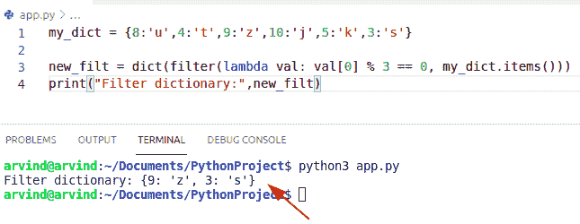

Python dictionary filter

另一个例子来检查如何在 Python 中过滤字典。

在这个例子中，字典中有偶数和奇数键元素。所以如果我们只想过滤那些值为偶数的元素。在这种情况下，如果键是偶数，则检查条件，然后将键-值对添加到新字典中。

**举例:**

```py
my_dict = {12:'b',14:'d',19:'c',10:'z',15:'p',4:'o'}

Dictionary = dict()

for (new_key, new_value) in my_dict.items():

   if new_key % 2 == 0:
       Dictionary[new_key] = new_value
print("Dictionary filter:",Dictionary)
```

下面是以下代码的截图

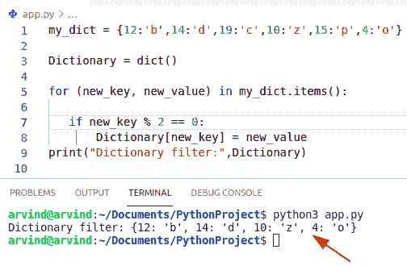

Python dictionary filter items function

阅读 [Python 字典索引](https://pythonguides.com/python-dictionary-index/)

再比如，如何使用简单的循环过滤一个 Python 字典。

**举例:**

让我们举一个例子，检查如何过滤字典

```py
my_dict = {3:'b',14:'d',12:'c',19:'z',16:'p',4:'o'}

loo_dict = dict()

for new_ke, new_val in my_dict.items():

    if new_ke%2 == 1:
        loo_dict[new_ke] = new_val
print("Filter Dictionary",loo_dict)
```

首先在这个例子中，我们将初始化一个字典并存储键-值对，其中 new_ke 变量检查条件是否为 **key%2==1** 。

下面是以下代码的截图

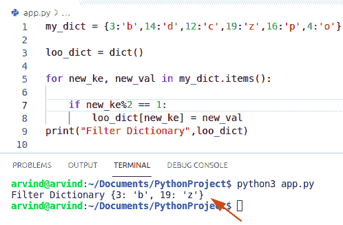

Python dictionary filter using a simple loop

阅读:[如何用 Python 删除字典](https://pythonguides.com/delete-a-dictionary-in-python/)

## Python 字典过滤键

*   让我们看看如何在 Python 字典中过滤关键字。
*   通过使用 for 循环和 **dict.items()函数**来遍历键值对。
*   在这个例子中，使用条件语句从字典中过滤关键字。在这种情况下，如果 key 大于 2，那么它过滤一个新的字典

**举例:**

让我们举一个例子，看看如何在字典中过滤关键字

```py
new_Dict = {2: "p", 16: "q", 17: "r",1:"u"}
to_dict = {}

for key, value in new_Dict.items():
    if (key > 2):

        to_dict[key] = value

print("Filtered Dictionary",to_dict)
```

下面是以下代码的截图

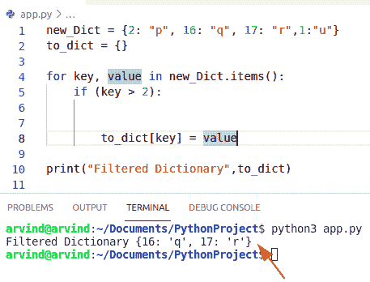

Python dictionary filter keys

另一个使用列表理解方法检查如何过滤字典中的关键字的例子

在本例中，创建一个 Python 字典，并将奇数和偶数值作为参数分配给它们。现在检查是否键是偶数，这意味着它可以被 2 整除使用字典理解。

**举例:**

```py
my_dict = {4: "John", 16: "George", 17: "Micheal",12:"James"}
filt_Dict = { key:value for (key,value) in my_dict.items() if key % 2 == 0}

print("Filtered key:",filt_Dict)
```

下面是以下代码的截图

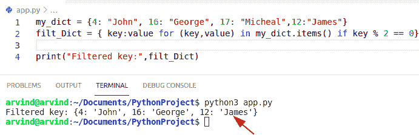

Python dictionary filter keys comprehension method

阅读 [Python 字典排序](https://pythonguides.com/python-dictionary-sort/)

## Python 字典过滤无值

*   让我们看看**如何在 Python** 中过滤没有值的字典。
*   通过使用 for 循环方法，我们必须对所有的键执行一个循环并检查值，如果它是 none 值，那么我们必须将它附加到一个存储所有键的列表中。

**举例:**

让我们举一个例子，看看如何过滤没有值的字典

```py
my_dict = {'Mangoes' : 4, 'Cherry' : 6, 'Banana' : None,'oranges': None}

output = []
for element in my_dict:
    if my_dict[element] is  None :
        output.append(element)

print("None keys element : ",output)
```

下面是以下代码的截图

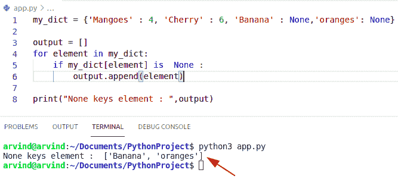

Python dictionary filter none values

## 如何过滤没有值的字典

通过使用过滤器和 [Python lambda 函数](https://pythonguides.com/python-anonymous-function/)，我们可以很容易地检查如何过滤没有值的字典。

**举例:**

```py
to_dictionary = dict(john = 8, lizeal = None, shane = 4, watson = None,george = 9)

non_val = dict(filter(lambda item: item[1] is None, to_dictionary.items()))
print(non_val)
```

下面是以下代码的截图

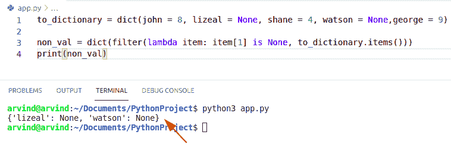

Python dictionary filter none values by filter method

读取 [Python 字典值以列出](https://pythonguides.com/python-dictionary-values-to-list/)

## 基于值的 Python 字典过滤器关键字

*   让我们看看如何在 Python 字典中过滤基于键的值。
*   通过使用 [Python list comprehension](https://pythonguides.com/python-list-comprehension/) ，我们可以轻松地执行这项任务。
*   首先，我们必须[初始化 Python 字典](https://pythonguides.com/python-dictionary-initialize/)并获得选择性字典键。

**举例:**

让我们举一个例子，看看如何根据值过滤一个键

```py
my_dict = {"Micheal" : 6, "George" : 8, "Andrew" : 15, "Luis" : 14}

value_list = ['George', 'Luis']

output = [my_dict[x] for x in value_list if x in my_dict]
print ("values based keys : ",output)
```

下面是以下代码的截图

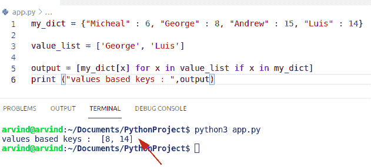

Python dictionary filter key based on the value

**检查如何过滤基于键的值的另一个示例**

通过使用字典理解，我们可以检查如何在 Python 中过滤基于键的值。

**举例:**

```py
to_dict = {'Australia': 220, 'Germany': 480, 'japan': 389, 'Malaysia': 350}

sel_val = {new_key:new_value for (new_key, new_value) in to_dict.items() if new_value >= 370}
print(sel_val)
```

下面是以下代码的截图

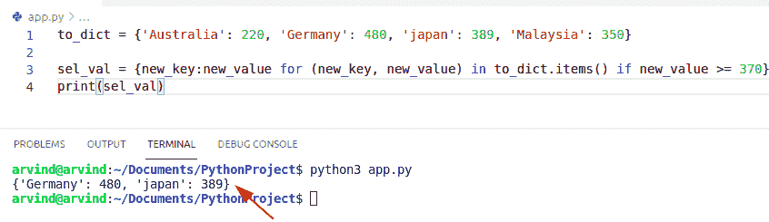

Python dictionary filter key based on value by dict

## 列表中的 Python 过滤器字典

*   让我们看看如何使用 Python 中的 list comprehension 方法从列表中过滤字典。
*   在本例中，我们将**创建一个新的字典列表**，并检查列表中的关键字是否可用。

**举例:**

让我们举一个例子，检查如何从列表中筛选字典。

```py
new_list = [{'john':7}, {'john':2}, {'john':9}]
def condition(dic):

    return dic['john'] > 7
new_filt = [x for x in new_list if condition(x)]
print(new_filt)
```

下面是以下代码的截图

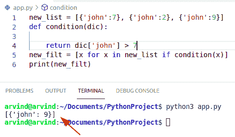

Python filter dictionary from the list

阅读 [Python 字典更新示例](https://pythonguides.com/python-dictionary-update/)

## Python 字典过滤λ

*   这里我们可以看到如何使用 Python 中的 lambda 函数**过滤字典。**
*   lambda 函数没有名字，这就是为什么它也被称为匿名函数。
*   在这个例子中，我们通过包含其值是长度为 8 的字符串的元素来初始化字典。

**举例:**

让我们举一个例子，看看如何使用 lambda 函数过滤字典。

```py
new_Dict = {2: "Australia", 16: "Germany", 17: "Japan",1:"China"}
my_dict = dict(filter(lambda val: len(val[1]) == 5,new_Dict.items()))

print(my_dict)
```

下面是以下代码的截图

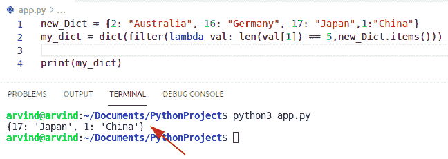

Python dictionary filter lambda

这就是如何使用 lambda 过滤 Python 字典。

## Python 字典过滤空值

*   在这里，我们可以看到如何过滤带有空值的 Python 字典。
*   通过使用列表理解，我们可以很容易地检查如何过滤含有空值的字典。

**举例:**

```py
my_dict = {'Mangoes' : '', 'Cherry' : '', 'Banana' : '','oranges': ''}

output = []
for element in my_dict:
    if my_dict[element] is  None :
        output.append(element)

print("Empty  element : ",output)
```

下面是以下代码的截图

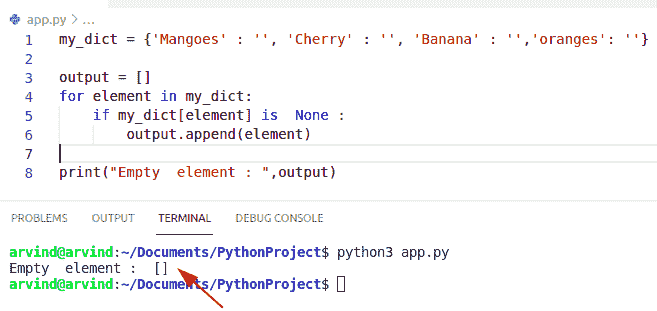

Python dict filter empty values

您可能会喜欢以下 Python 教程:

*   [Python 串联字典+例子](https://pythonguides.com/python-concatenate-dictionary/)
*   [从字符串 Python 中删除字符](https://pythonguides.com/remove-character-from-string-python/)
*   [Python 按空格分割字符串](https://pythonguides.com/python-split-string-by-space/)
*   [如何用 Python 将两个数相加](https://pythonguides.com/add-two-numbers-in-python/)
*   [使用 Python Tkinter 的身体质量指数计算器](https://pythonguides.com/bmi-calculator-using-python-tkinter/)
*   [Python 程序反转字符串的例子](https://pythonguides.com/python-program-to-reverse-a-string/)

在本 Python 教程中，我们将讨论 **Python 字典过滤器。**在这里，我们还将介绍以下示例:

*   Python 字典过滤器关键字
*   Python 字典按值过滤
*   Python 字典过滤无值
*   基于值的 Python 字典过滤器关键字
*   来自列表的 Python 过滤器字典
*   Python 字典过滤器 lambda
*   Python 字典过滤空值

[Bijay Kumar](https://pythonguides.com/author/fewlines4biju/)

Python 是美国最流行的语言之一。我从事 Python 工作已经有很长时间了，我在与 Tkinter、Pandas、NumPy、Turtle、Django、Matplotlib、Tensorflow、Scipy、Scikit-Learn 等各种库合作方面拥有专业知识。我有与美国、加拿大、英国、澳大利亚、新西兰等国家的各种客户合作的经验。查看我的个人资料。

[enjoysharepoint.com/](https://enjoysharepoint.com/)[](https://www.facebook.com/fewlines4biju "Facebook")[](https://www.linkedin.com/in/fewlines4biju/ "Linkedin")[](https://twitter.com/fewlines4biju "Twitter")