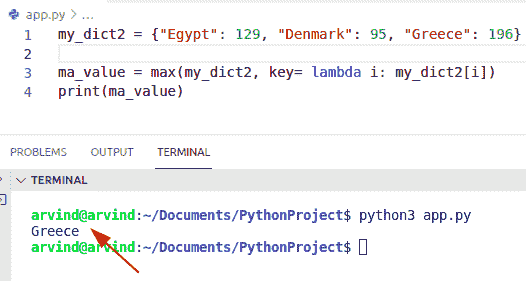

# Python 字典通过值查找键

> 原文：<https://pythonguides.com/python-dictionary-find-a-key-by-value/>

[](https://sharepointsky.teachable.com/p/python-and-machine-learning-training-course)

在这个 Python 教程中，我们将学习 **Python 字典，通过值**来查找键。此外，我们将讨论以下示例:

*   Python 字典按最大值查找键。
*   Python 字典通过索引获取键值
*   Python 字典使用值查找键
*   Python 字典获取键值对
*   Python 字典查找具有最大值的键
*   如果值存在，Python 字典获取键

目录

[](#)

*   [Python 字典按值查找键](#Python_dictionary_find_a_key_by_value "Python dictionary find a key by value")
    *   [通过使用 list.index()方法](#By_using_listindex_method "By using list.index() method")
    *   [通过使用 dict.items()方法](#By_using_dictitems_method "By using dict.items() method")
    *   [用列表理解法](#By_using_list_comprehension_method "By using list comprehension method")
*   [Python 字典按最大值查找关键字](#Python_dictionary_find_key_by_max_value "Python dictionary find key by max value")
    *   [获取具有最大值的密钥的另一个示例](#Another_example_to_get_the_key_with_max_value "Another example to get the key with max value")
    *   [通过使用λ函数](#By_using_lambda_function "By using lambda function")
*   [Python 字典通过索引获取键值](#Python_dictionary_get_key_value_by_index "Python dictionary get key value by index")
*   [Python 字典使用值](#Python_dictionary_find_key_using_value "Python dictionary find key using value")查找密钥
*   [Python 字典获取键值对](#Python_dictionary_get_key_value_pair "Python dictionary get key value pair")
    *   [检查如何获得键值对的另一个例子](#Another_example_to_check_how_to_get_key_value_pair "Another example to check how to get key value pair")
*   [Python 字典查找具有最大值的键](#Python_dictionary_find_key_with_maximum_value "Python dictionary find key with maximum value")
*   [如果值存在，Python 字典获取键](#Python_dictionary_get_key_if_value_exist "Python dictionary get key if value exist")

## Python 字典按值查找键

*   在这里，我们可以看到如何在 Python 中通过值获取键。
*   我们可以通过各种方法来完成这项任务，下面列出了一些我们可以使用的方法。
    *   通过使用 list.index()
    *   通过使用 dict.items()方法
    *   通过使用列表理解方法

### 通过使用 list.index()方法

index 方法总是返回列表或词典中的索引位置。

**源代码:**

```py
to_dictionary ={"Bulgaria":450, "Australia":610, "Canada":916}

new_ke_lis = list(to_dictionary.keys())
new_val = list(to_dictionary.values())

new_pos = new_val.index(610) # value from dictionary
print("Get a key by value:",new_ke_lis[new_pos])
```

下面是以下代码的截图


Python dictionary find a key by value

### 通过使用 dict.items()方法

该方法返回一个 dictionary view 对象，该对象以**键值**对的形式显示字典列表。

**举例:**

```py
my_dict={"a":6,"z":9,"f":17,"l":10} 
for key,value in my_dict.items():
    if value==9:
        print("key by value:",key)
```

**执行:**


Python dictionary find a key by value method

阅读:[如何用 Python 从一个列表创建字典](https://pythonguides.com/create-a-dictionary-from-one-list-in-python/)

### 用列表理解法

在 Python 中要获得具有最大值的键，我们可以使用 list comprehension 方法。这个方法将帮助用户执行每个元素以及 for 循环来迭代每个项目。

**举例:**

```py
new_dictionary={"m":45,"v":19,"q":87,"w":60} 

t={s for s in new_dictionary if new_dictionary[s]==19}
print("key by value:",t)
```

**输出:**


Python dictionary find a key by value

阅读: [Python 将字典转换为列表](https://pythonguides.com/python-convert-dictionary-to-list/)

## Python 字典按最大值查找关键字

*   让我们看看如何通过最大值找到密钥。
*   通过使用 max()函数，我们将在字典中找到具有最大值的键。
*   为了完成这项任务，首先我们将初始化一个字典，并为它们分配一个键值对元素。现在使用一个 max()函数来获得具有最大值的键。

**举例:**

```py
new_dict={"x":35,"q":29,"e":97,"w":60} 

new_ke = max(new_dict, key=new_dict.get)
print("To get Key maxvalue:",new_ke)
```

下面是以下给定代码的实现


Python dictionary find the key by max value

阅读:[如何用 python 创建字典键列表](https://pythonguides.com/create-a-list-of-dictionary-keys-in-python/)

### 获取具有最大值的密钥的另一个示例

通过使用 `itemgetter()` 函数和运算符模块，我们可以很容易地得到密钥。itemgetter()函数返回一个对象，该对象使用操作符模块从其操作数中收集一个项目。

让我们举一个例子，检查如何使用 itemgetter()函数来获取密钥。

源代码:

```py
import operator
my_dict1 = {"Bulgaria": 92, "Cuba": 81, "Cyprus": 96}

new_max_key = max(my_dict1.items(), key = operator.itemgetter(1))[0]
print("key with highest value:\n",new_max_key)
```

下面是以下代码的截图


Python dictionary find a key by max value itemgetter

### 通过使用λ函数

在 Python 中，lambda 函数不需要任何名字，它们是无名的。它们用于声明单行函数。在这个例子中，你只需要给函数一个值，然后提供一个表达式。

**举例:**

在这个例子中，我们必须检查如何使用 lambda 函数找到具有最大值的键

```py
my_dict2 = {"Egypt": 129, "Denmark": 95, "Greece": 196}

ma_value = max(my_dict2, key= lambda i: my_dict2[i])
print(ma_value)
```

**截图:**



Python dictionary find a key by the max value lambda function

阅读: [Python 字典删除](https://pythonguides.com/python-dictionary-remove/)

## Python 字典通过索引获取键值

*   让我们看看如何通过字典中的索引获得一个键-值对。
*   为了执行这个任务，我们可以使用枚举器方法。这是 Python 中的一个内置函数，允许用户检查发生了多少次迭代。这个方法可以直接用于循环，并将它们转换成一个列表。
*   让我们举一个例子，看看如何通过索引获得键值对。

```py
my_new_dict = {'c' : 43, 'i' : 61, 'x' : 93, 'l' : 54}

get_key = 'i'
new_search_key='l'

new_var = list(my_new_dict.items()) 
output = [ab for ab, new_key in enumerate(new_var) if new_key[0] == get_key]
result2 = [ab for ab, new_key in enumerate(new_var) if new_key[0] == new_search_key]

print("Get index value of key : ",output)
print("Get index value of key : ",result2) 
```

下面是以下给定代码的执行过程


Python dictionary get key value by index

另一个使用 dict()方法获取键值索引的例子

**源代码:**

```py
dict1 = {'JOhn' : 29, 'POtter' : 18, 'Chris' : 17, 'hemsworth' : 14}

ind_lis = list(dict1)
new_key = ind_lis[1]
print("Get key-value by index:",new_key)
```

下面是以下给定代码的输出


Python dictionary get key value by the index method

阅读: [Python 字典长度](https://pythonguides.com/python-dictionary-length/)

## Python 字典使用值查找密钥

在 Python 中使用值来查找键，我们可以通过比较所有值来从值中收集键，并获得特定的键。在这个例子中，我们可以使用 dict.items()方法。

**举例:**

让我们举一个例子，看看如何通过使用值来查找一个键。

```py
from typing import TextIO

def new_ke(val):
    for k, new_va in to_dictionary.items():
         if val == new_va:
             return k

    return 
to_dictionary ={"Australia":56, "China":72, "Turkey":93}
print("Key exist in dictionary:",new_ke(72))

print("key doesnot contain in dictionary:",new_ke(48))
```

下面是以下代码的截图


Python dictionary find a key using the value

阅读: [Python 字典索引](https://pythonguides.com/python-dictionary-index/)

## Python 字典获取键值对

*   为了在字典中获得键值对，我们可以很容易地使用枚举器方法。
*   这个方法帮助用户访问字典中键值元素位置的命名索引。

**举例:**

```py
dictionary1 = {"Iran" : 37, "Iraq" : 19, "Ireland" : 64}

for x in enumerate(dictionary1.items()):
    print("key-value pair in dictionary:",x)
```

下面是以下给定代码的实现


Python dictionary get key-value pair

### 检查如何获得键值对的另一个例子

为了完成这个特殊的任务，我们可以很容易地使用列表理解方法。该方法以键-值对的形式返回元素，并将结果显示为列表中键和值的元组。

**举例:**

```py
you_dictionary = {"Maldives" : 34, "Mexico" : 159, "Portugal" : 287}

print ("key-value pairs are : ")
print([(m, you_dictionary[m]) for m in you_dictionary])
```

下面是以下代码的截图


Python dictionary get key-value pair method

## Python 字典查找具有最大值的键

为了找到具有最大值的键，我们可以很容易地使用函数值()和键()。

源代码:

```py
to_dict2 = {'Zimbabwe':689, 'Ukraine':143, 'Italy':189}

new_value = list(to_dict2.values())
new_key = list(to_dict2.keys())
print(new_key[new_value.index(max(new_value))])
```

下面是以下给定代码的执行过程


Python dictionary find the key with maximum value

阅读: [Python 字典初始化](https://pythonguides.com/python-dictionary-initialize/)

## 如果值存在，Python 字典获取键

*   让我们看看如果值存在于字典中，如何得到一个键。

源代码:

```py
from typing import TextIO

def exe_ke(val):
    for x, new_va in your_dict.items():
         if val == new_va:
             return x

    return 
your_dict ={"m":124, "s":149, "u":98}
print("Value exist in dictionary:",exe_ke(149))

print("value doesnot exist in dictionary:",exe_ke(456))
```

执行


Python dictionary get key if a value exists

你可能也喜欢读下面的文章。

*   [Python 字典过滤器](https://pythonguides.com/python-dictionary-filter/)
*   [Python 字典排序](https://pythonguides.com/python-dictionary-sort/)
*   [Python 字典理解](https://pythonguides.com/python-dictionary-comprehension/)
*   [Python 字典包含](https://pythonguides.com/python-dictionary-contains/)
*   [Python 字典流行](https://pythonguides.com/python-dictionary-pop/)
*   [Python 列表字典](https://pythonguides.com/python-dictionary-of-lists/)
*   [从字典中获取所有值 Python](https://pythonguides.com/get-all-values-from-a-dictionary-python/)
*   [Python 从两个列表中创建一个字典](https://pythonguides.com/python-creates-a-dictionary-from-two-lists/)

在本 Python 教程中，我们学习了通过值查找键的 **Python 字典。此外，我们还讨论了以下示例:**

*   Python 字典按最大值查找键。
*   Python 字典通过索引获取键值
*   Python 字典使用值查找键
*   Python 字典获取键值对
*   Python 字典查找具有最大值的键

[Bijay Kumar](https://pythonguides.com/author/fewlines4biju/)

Python 是美国最流行的语言之一。我从事 Python 工作已经有很长时间了，我在与 Tkinter、Pandas、NumPy、Turtle、Django、Matplotlib、Tensorflow、Scipy、Scikit-Learn 等各种库合作方面拥有专业知识。我有与美国、加拿大、英国、澳大利亚、新西兰等国家的各种客户合作的经验。查看我的个人资料。

[enjoysharepoint.com/](https://enjoysharepoint.com/)[](https://www.facebook.com/fewlines4biju "Facebook")[](https://www.linkedin.com/in/fewlines4biju/ "Linkedin")[](https://twitter.com/fewlines4biju "Twitter")