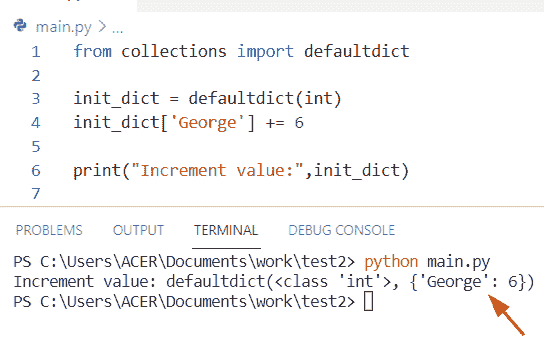
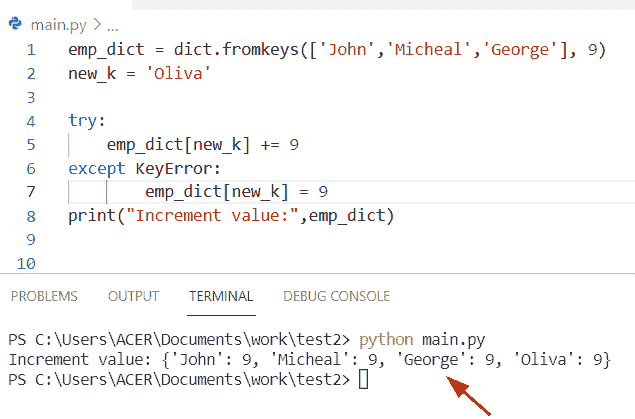
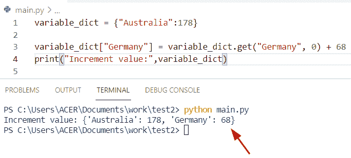
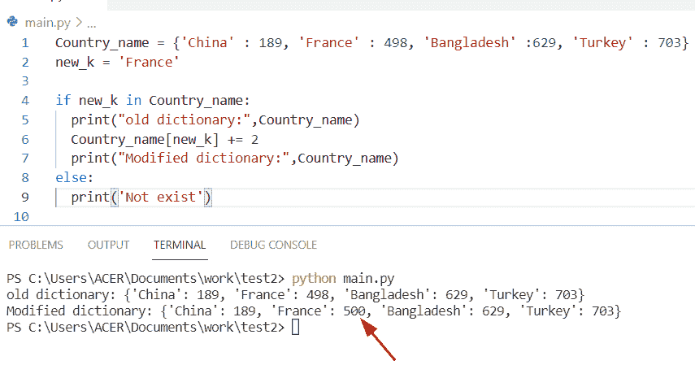
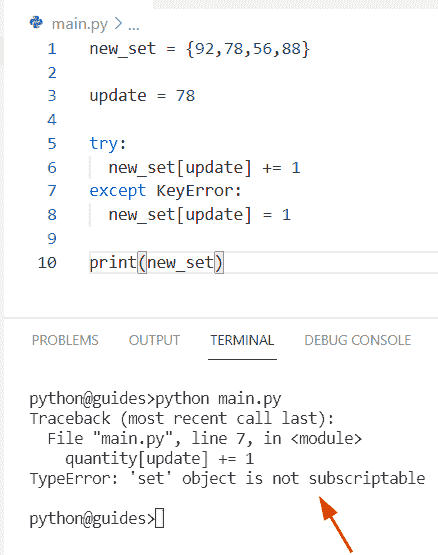
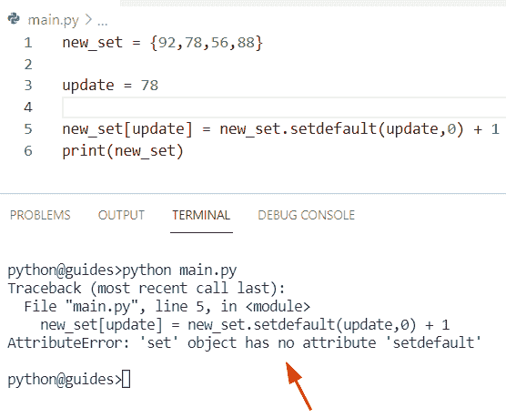
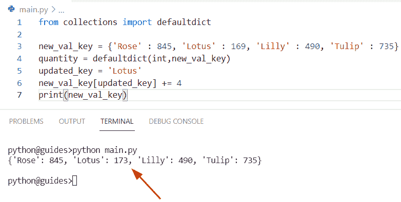
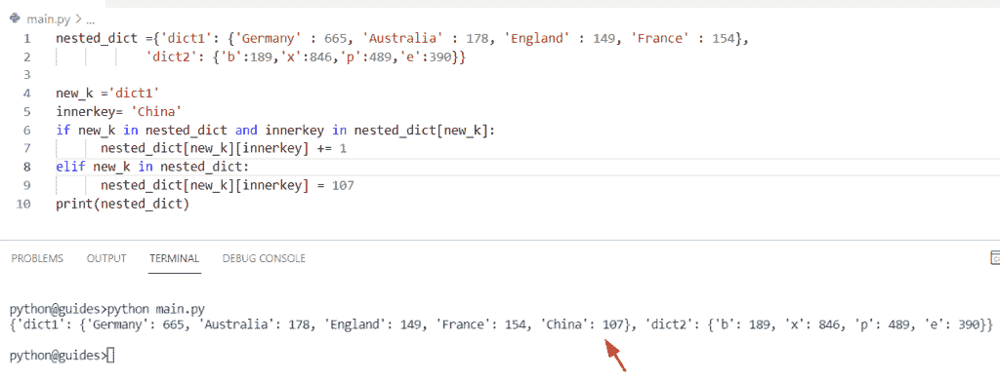
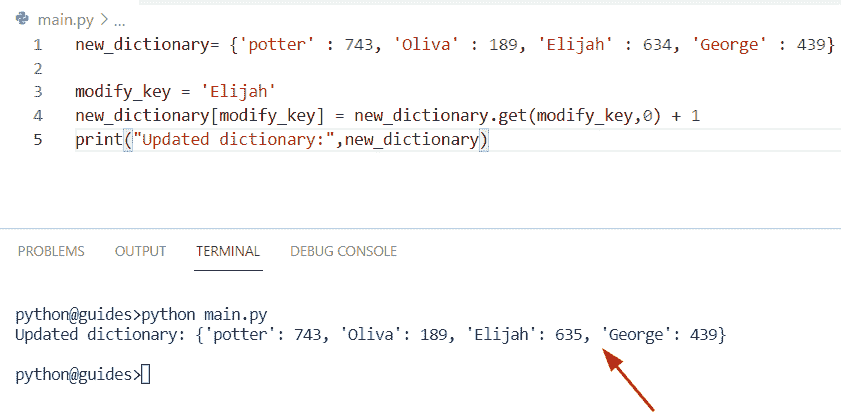

# Python 字典增量值

> 原文：<https://pythonguides.com/python-dictionary-increment-value/>

[](https://sharepointsky.teachable.com/p/python-and-machine-learning-training-course)

在本 [Python 教程](https://pythonguides.com/learn-python/)中，我们将讨论 **Python 字典` `增量值。**在这里，我们还将介绍以下例子:

*   如果存在关键字，Python 字典将增加值
*   Python 字典增量值或集合
*   Python 字典增加值
*   Python 嵌套字典增量值
*   Python 字典将值递增 1

目录

[](#)

*   [Python 字典增量值](#Python_dictionary_increment_value "Python dictionary increment value")
    *   [如何在 Python 中增加字典中的值](#How_to_increment_a_value_in_a_dictionary_in_Python "How to increment a value in a dictionary in Python")
*   [如果密钥存在，Python 字典增加值](#Python_dictionary_increment_value_if_key_exists "Python dictionary increment value if key exists")
*   [Python 字典增量值或集合](#Python_dict_increment_value_or_set "Python dict increment value or set")
*   [Python 字典增加值](#Python_dict_increase_value "Python dict increase value")
*   [Python 嵌套字典增量值](#Python_nested_dictionary_increment_value "Python nested dictionary increment value")
*   [Python 字典的值递增 1](#Python_dictionary_increment_value_by_1 "Python dictionary increment value by 1")

## Python 字典增量值

*   在这个程序中，我们将讨论如何用 Python 在字典中**增加一个值。**
*   通过使用 `defaultdict()` 方法，我们可以执行这个特定的任务。在 Python 中，集合模块提供了一个 `defaultdict()` 方法。

**源代码:**

```py
from collections import defaultdict

init_dict = defaultdict(int)
init_dict['George'] += 6

print("Increment value:",init_dict)
```

在上面的代码中，我们首先导入了一个 defaultdict 方法。现在创建一个变量 **'init_dict'** 并分配一个方法 defaultdict，我们必须在其中传递一个整数值。一旦你将打印**‘init _ dict’**，那么输出将以字典的形式显示。

下面是以下给定代码的执行过程



Python dictionary increment value

### 如何在 Python 中增加字典中的值

这是在字典中增加值的另一种方法。如果给定的键不包含在字典中，那么它将引发一个键错误。要解决这个错误，我们可以使用 try/except 块。

**举例:**

```py
emp_dict = dict.fromkeys(['John','Micheal','George'], 9)
new_k = 'Oliva'

try:
    emp_dict[new_k] += 9
except KeyError:
        emp_dict[new_k] = 9
print("Increment value:",emp_dict) 
```

下面是以下给定代码的输出



Python dictionary increment value

通过使用 `dict.get()` 方法，我们可以在字典中增加一个值

**源代码:**

```py
variable_dict = {"Australia":178}

variable_dict["Germany"] = variable_dict.get("Germany", 0) + 68
print("Increment value:",variable_dict) 
```

在上面的代码中，我们将一个 **dict[key]** 赋值给 68。现在我们可以使用 `dict.get()` 方法，如果关键字在字典中可用，该方法将返回值，否则将返回 0。

你可以参考下面的截图。



Python dictionary increment value

阅读: [Python 列表字典](https://pythonguides.com/python-dictionary-of-lists/)

## 如果密钥存在，Python 字典增加值

*   在这里，我们将看到如何检查给定的键是否存在于字典中，并按值递增。
*   通过使用 if 语句条件，我们可以解决这个特殊的任务。要检查该键是否存在，我们可以使用**‘if’**条件语句，如果它存在于字典中，它将递增该值。

**举例:**

```py
Country_name = {'China' : 189, 'France' : 498, 'Bangladesh' :629, 'Turkey' : 703}
new_k = 'France'

if new_k in Country_name:
  print("old dictionary:",Country_name)
  Country_name[new_k] += 2
  print("Modified dictionary:",Country_name)
else:
  print('Not exist') 
```

在上面的代码中，我们首先初始化一个由国家名组成的字典**‘Country _ name’**。在本例中，字典中的关键字是国家名称。现在我们必须增加键**【法兰西】**的值，首先我们创建一个变量并分配一个键元素。

之后，我们可以使用 if 条件来检查关键字**‘France’**在字典中是否可用。如果给定的条件是正确的，那么它将增加键值 1，否则它将显示**‘不存在’**。

下面是下面给出的代码的截图。



Python dictionary increment value if a key exists

阅读: [Python 字典扩展](https://pythonguides.com/python-dictionary-extend/)

## Python 字典增量值或集合

在这个程序中，我们将讨论如何在 Python 中增加集合中的值

通过使用异常处理方法，我们将使用一个 try-except 块，在本例中，我们将尝试从一个集合中增加给定值的值。

第一次尝试使用 try-except 块

**源代码:**

```py
new_set = {92,78,56,88}

update = 78

try:
  new_set[update] += 1
except KeyError:
  new_set[update] = 1

print(new_set)
```

**注意:**一旦您将打印**‘新 _ 设置’**，那么结果将显示一个错误**‘设置’**对象不可订阅。

你可以参考下面的截图



Python dict increment value or set

现在我们将尝试第二种方法 `setdefault()` 来解决这个特殊的任务

由给定集合求增量值的另一种方法

通过使用 `setdefault()` 方法，我们可以将值作为输入并返回更新后的值。如果该值存在于当前字典中，则该值将递增。

**源代码:**

```py
new_set = {92,78,56,88}

update = 78

new_set[update] = new_set.setdefault(update,0) + 1
print(new_set)
```

**输出:**



Python dict increment value or set

正如您在上面的屏幕截图中看到的，输出引发了 attribute error:“set”对象没有属性**“set default”**。

**结论:**在 Python 集合中，元素不可更改，只包含唯一值。所以我们不能增加集合中给定的值。

阅读: [Python 字典复制](https://pythonguides.com/python-dictionary-copy/)

## Python 字典增加值

*   在这个程序中，我们将看到如何在 Python 字典中增加一个值。
*   为了完成这个任务我们可以使用 `defaultdict()` 的概念方法。在 Python 中，collection 模块提供了一个 defaultdict 库，它是 dictionary 类的一个子类，总是返回一个对象。
*   在 Python 中， `defaultdict()` 方法从不引发键错误，它将创建一个新的键值对。

**举例:**

让我们举个例子，看看如何在 Python 字典中增加一个值

```py
from collections import defaultdict 

new_val_key = {'Rose' : 845, 'Lotus' : 169, 'Lilly' : 490, 'Tulip' : 735}
quantity = defaultdict(int,new_val_key)
updated_key = 'Lotus'
new_val_key[updated_key] += 4
print(new_val_key)
```

在上面的程序中，我们已经创建了一个字典，但是首先，我们必须从集合模块中导入 defaultdict 方法。现在我们将使用 `defaultdict()` 方法，其中我们将整数作为参数传递，第二个参数是 dictionary **'new_val_key'** 。

下面是以下代码的截图



Python dict increase value

阅读: [Python 字典多键](https://pythonguides.com/python-dictionary-multiple-keys/)

## Python 嵌套字典增量值

*   这里我们可以看到如何在嵌套字典中增加一个值。
*   在本例中，我们创建了一个包含多个字典的嵌套字典。现在我们想看看如何在嵌套字典中增加一个值。
*   为了执行这个任务，我们可以使用**‘if’**条件的概念，这将检查字典中是否存在这个键。

**源代码:**

```py
nested_dict ={'dict1': {'Germany' : 665, 'Australia' : 178, 'England' : 149, 'France' : 154},
            'dict2': {'b':189,'x':846,'p':489,'e':390}}

new_k ='dict1'
innerkey= 'China'
if new_k in nested_dict and innerkey in nested_dict[new_k]:
      nested_dict[new_k][innerkey] += 1
elif new_k in nested_dict:
      nested_dict[new_k][innerkey] = 107   
print(nested_dict)
```

下面是以下给定代码的执行过程



Python nested dictionary increment value

阅读: [Python 在字典中查找最大值](https://pythonguides.com/python-find-max-value-in-a-dictionary/)

## Python 字典的值递增 1

*   让我们看看如何在 Python 字典中将一个值递增 1。
*   通过使用 `get()` 函数，我们可以增加一个字典值，该方法将键值作为一个参数，它将检查条件，如果关键字不包含在字典中，它将返回默认值。如果给定的关键字存在于字典中，那么它将总是返回关键字的值。

**语法:**

下面是 `get()` 函数的语法

```py
dict.get(key, default=None)
```

**举例:**

让我们举个例子，看看如何在 Python 字典中增加一个值

```py
new_dictionary= {'potter' : 743, 'Oliva' : 189, 'Elijah' : 634, 'George' : 439}

modify_key = 'Elijah'
new_dictionary[modify_key] = new_dictionary.get(modify_key,0) + 1
print("Updated dictionary:",new_dictionary)
```

在上面的例子中，我们已经创建了一个字典，现在我们想用键**‘Elijah’**增加这个值。为此，我们创建了一个变量**‘修改密钥’**，并在其中分配一个密钥。

之后，我们使用了 `dict.get()` 函数，在这个函数中，我们传递了一个键作为参数，默认情况下，第二个参数值为 0。

你可以参考下面的截图



Python dictionary increment value by 1

正如你在截图中看到的，字典中包含了关键字**‘Elijah’**，它的值从 634 增加到 635。

你可能会喜欢读一些我们的 Python 字典教程。

*   [Python 元组字典](https://pythonguides.com/python-dictionary-of-tuples/)
*   [Python 中的 Case 语句](https://pythonguides.com/case-statement-in-python/)
*   [在 python 中反转一个列表](https://pythonguides.com/reverse-a-list-in-python/)
*   [Python 字典流行](https://pythonguides.com/python-dictionary-pop/)
*   [获取字典 Python 中的第一个键](https://pythonguides.com/get-first-key-in-dictionary-python/)
*   [使用 For 循环对 Python 中的列表元素求和](https://pythonguides.com/sum-elements-in-list-in-python-using-for-loop/)
*   [Python 将数据帧转换为列表](https://pythonguides.com/python-convert-dataframe-to-list/)
*   [Python 将字典转换成数组](https://pythonguides.com/python-convert-dictionary-to-an-array/)
*   [Python 字典到 CSV](https://pythonguides.com/python-dictionary-to-csv/)

在本 Python 教程中，我们将讨论 **Python 字典` `的增量值。**在这里，我们还将介绍以下例子:

*   如果存在关键字，Python 字典将增加值
*   Python 字典增量值或集合
*   Python 字典增加值
*   Python 嵌套字典增量值
*   Python 字典将值递增 1

[Bijay Kumar](https://pythonguides.com/author/fewlines4biju/)

Python 是美国最流行的语言之一。我从事 Python 工作已经有很长时间了，我在与 Tkinter、Pandas、NumPy、Turtle、Django、Matplotlib、Tensorflow、Scipy、Scikit-Learn 等各种库合作方面拥有专业知识。我有与美国、加拿大、英国、澳大利亚、新西兰等国家的各种客户合作的经验。查看我的个人资料。

[enjoysharepoint.com/](https://enjoysharepoint.com/)[](https://www.facebook.com/fewlines4biju "Facebook")[](https://www.linkedin.com/in/fewlines4biju/ "Linkedin")[](https://twitter.com/fewlines4biju "Twitter")