# Python 字典索引-完整教程

> 原文：<https://pythonguides.com/python-dictionary-index/>

[](https://sharepointsky.teachable.com/p/python-and-machine-learning-training-course)

在本 Python 教程中，我们将讨论 **Python 字典索引**。在这里，我们还将介绍以下示例:

*   键的 Python 字典索引
*   Python 字典索引值
*   Python 字典索引范围
*   Python 字典索引多个键
*   Python 字典索引存在
*   Python 字典索引号
*   Python 字典从值中获取索引
*   Python 字典索引与 get
*   Python 列表字典查找索引

目录

[](#)

*   [Python 字典索引](#Python_dictionary_index "Python dictionary index")
*   [键的 Python 字典索引](#Python_dictionary_index_of_key "Python dictionary index of key")
*   [如何从 Python 字典中访问密钥](#How_to_access_keys_from_a_Python_dictionary "How to access keys from a Python dictionary ")
*   [Python 字典索引值](#Python_dictionary_index_value "Python dictionary index value")
*   [如何从 Python 字典中访问值](#How_to_access_Values_from_Python_dictionary "How to access Values from Python dictionary")
*   [Python 字典索引范围](#Python_dictionary_index_range "Python dictionary index range")
*   [检查字典索引范围](#Check_dictionary_index_range "Check dictionary index range")
*   [Python 字典索引多个键](#Python_dictionary_index_multiple_keys "Python dictionary index multiple keys")
*   [使用索引从字典中检查多个关键字](#Check_multiple_keys_from_dictionary_using_index "Check multiple keys from dictionary using index")
*   [Python 字典索引存在](#Python_dictionary_index_exists "Python dictionary index exists")
*   [Python 字典索引号](#Python_dictionary_index_number "Python dictionary index number")
*   [Python 字典从值](#Python_dictionary_get_index_from_value "Python dictionary get index from value")获取索引
*   [Python 字典索引 vs 获取](#Python_dictionary_index_vs_get "Python dictionary index vs get")
*   [Python 列表字典查找索引](#Python_list_dict_find_index "Python list dict find index")

## Python 字典索引

*   在 [Python 字典](https://pythonguides.com/create-a-dictionary-in-python/)中，元素提供键值索引，其中顺序被保留。
*   让我们看看如何从字典中访问键值对。
*   使用索引语法 list[index]返回键，并使用 items()函数以键-值对的形式返回所有字典的集合，其中包含一个元组。

**举例:**

让我们举个例子，检查一下**如何访问 Python 字典**中的索引值。

```py
my_dict = {} 
my_dict['l'] = 4
my_dict['m'] = 6
my_dict['n'] = 9
new_value = list(my_dict.items())
print(new_value[2])
```

在上面的代码中，我们将首先初始化一个字典，并在列表中给它们分配一个字符。现在使用索引语法 list[index]并将它们分配给 **dict.items()函数**作为参数。

下面是以下代码的截图

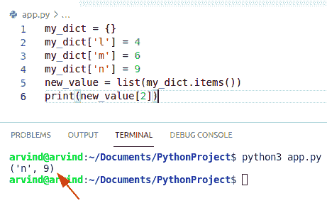

Python dictionary index

这就是如何访问 Python 字典索引。

阅读[如何用 Python 将字典转换成 JSON](https://pythonguides.com/convert-dictionary-to-json-python/)

## 键的 Python 字典索引

*   让我们看看如何使用 index 从 Python 字典中访问键。
*   通过将 list(*args)与字典一起使用，它将返回键的集合。我们可以很容易地使用索引从方法中访问所需的键，并将其转换为列表。
*   在这个例子中使用**list【index】**函数，它将返回列表中索引处的键。

**举例:**

让我们举一个例子，检查如何使用 **list[index]** 方法从字典中访问键。

```py
my_dict = {"m": 1, "l": 2}

new_key = list(my_dict)

index_key = new_key[0]

print(index_key)
```

下面是以下代码的截图

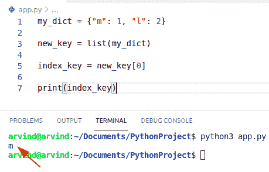

Python dictionary index of key

## 如何从 Python 字典中访问密钥

在本例中，我们将使用 Python list()函数以及 keys()、values()和 items()函数来执行此特定任务。

**举例:**

```py
my_dict = {'Australia' : 200, 'Germany' : 100, 'Europe' : 300, 'Switzerland' : 400}

find_key = 'Germany'
print("dictionary is : " + str(my_dict))
res = list(my_dict.keys()).index(find_key)
print("Index of find key is : " + str(res))
```

首先在上面的代码中，我们将初始化一个字典，同时初始化一个 `find_key` 字符串，并为它们分配一个键作为**“德国”**。使用 list()+keys()+index()在字典中访问所需的键索引。

下面是以下代码的截图

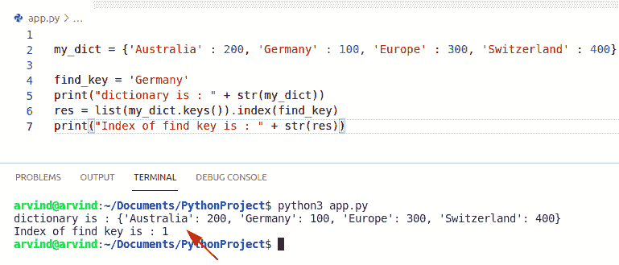

Python dictionary index of key list method

这就是如何**从 Python 字典**中访问键。

阅读 [Python 字典附加示例](https://pythonguides.com/python-dictionary-append/)

## Python 字典索引值

*   在这里，我们可以检查如何使用 Python 中的索引从字典中访问值。
*   使用 dictionary`comprehension+enumerator()`函数我们可以很容易地解决这个任务。
*   列表理解是用 Python 创建列表的最简单、最优雅的方式之一。
*   我们使用带有 for 循环的枚举函数来跟踪 iterable 中项的位置。
*   这些函数可用于访问索引值。

**举例:**

```py
new_list = ['John', 'James', 'Micheal', 'George']

output = {val : x + 1 for x, val in enumerate(new_list)}

print("after index keys : " + str(output))
```

在上面的代码中，我们将首先初始化一个列表，并使用`dictionary comprehension+enumerate()`函数从字典中访问所需的索引值。

下面是以下代码的截图

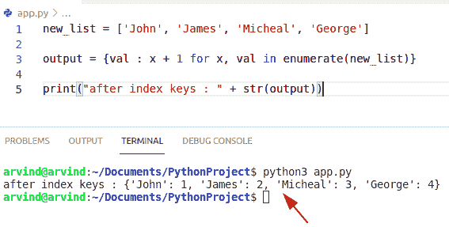

Python dictionary index value

这就是如何在 Python 字典中访问索引值。

## 如何从 Python 字典中获取值

*   在本例中，我们希望通过使用 `values()` 函数返回 Python 字典中所有值的集合。
*   这个函数可以用来映射索引，我们也可以使用索引语法 **list[index]** 来返回键。

**举例:**

让我们举一个例子，看看如何使用 Python 中的索引来访问字典中的值

```py
my_dict = {} 
my_dict['u'] = 8
my_dict['v'] = 7
my_dict['w'] = 6
new_value = list(my_dict.values())
print("Index number of specific value ",new_value[1])
```

下面是以下代码的截图

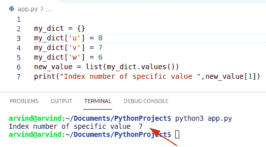

Python dictionary index value method

这是从 Python 字典中访问值的另一种方式。

阅读 [Python 串联词典+示例](https://pythonguides.com/python-concatenate-dictionary/)

## Python 字典索引范围

*   在 Python 中使用一个范围作为字典索引，我们可以很容易地使用循环方法。
*   在本例中，我们将对字典中所有指定的键运行一个循环，并对一系列值进行条件检查。

**举例:**

```py
my_dict = {'Oliver' : 4, 'William' :6, 'Wan' : 9, 'Lucas' : 7, 'Benjamin' : 5} 
a, b = 4,6

out = dict()
for key, val in my_dict.items():
    if int(val) >= a and int(val) <= b:
        out[key] = val

print("The range number : " + str(out)) 
```

首先在上面的代码中，我们将初始化一个字典，并为它们分配一个键-值对元素，同时初始化一个范围号，并使用循环方法遍历所有键的值并打印结果。

下面是以下代码的截图

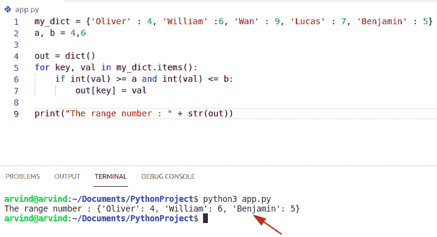

Python dictionary index range

## 检查字典索引范围

让我们看看如何在 Python 字典索引范围内使用 filter()和 lambda()函数。

**举例:**

```py
to_dict = {'Chinese' : 4, 'Italian' :6, 'Thai' : 10,'Mexican':5} 

c, d = 4, 6
new_out = {key: val for key, val in filter(lambda sub: int(sub[1]) >= c and
                                   int(sub[1]) <= d, to_dict.items())}
print("The index range value : " + str(new_out)) 
```

**注意:**在这个例子中，我们可以使用 `filter()` 和 `lambda` 函数来执行过滤的任务。

下面是以下代码的截图

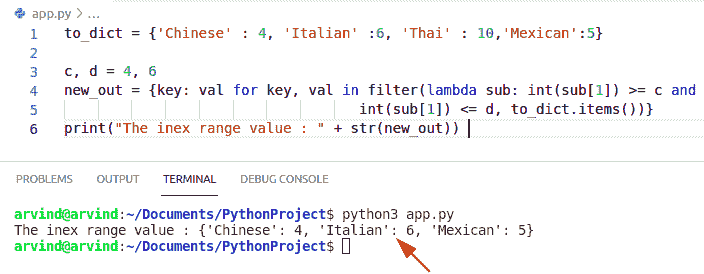

Python dictionary index range by the lambda function

阅读 [Python 字典更新示例](https://pythonguides.com/python-dictionary-update/)

## Python 字典索引多个键

*   让我们看看如何使用索引从 Python 字典中访问**多个键。**
*   在这个例子中，我们将结合 `list comprehension` 和 `enumerate()` 函数来获取字典中键的索引值。

**举例:**

```py
my_dict = {'Linnea' : 4, 'Shira' : 6, 'Amara' : 7, 'Beatriz' : 8}

index_key = "Amara"

out = list(my_dict.items()) 
new_value = [x for x, key in enumerate(out) if key[0] == index_key]

print("Index of search key is : " + str(new_value))
```

下面是以下代码的截图

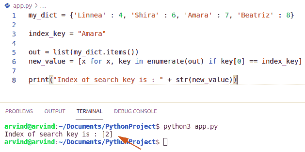

Python dictionary index multiple keys

## 使用索引从字典中检查多个关键字

通过使用 list[index]函数，我们将从给定的字典中获取索引值。

**举例:**

让我们举一个例子，看看如何使用索引从字典中访问多个键。

```py
my_dict = {"m": 1, "l": 2,"n":7}

new_key = list(my_dict)
index_k = new_key[0]
print(index_k)
index_key = new_key[2]
print(index_key)
```

在上面的例子中，我们将使用 multiple time list[index]函数，它将返回列表中索引处的键。

下面是以下代码的截图

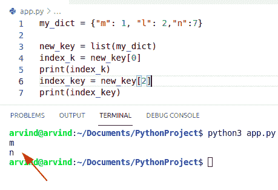

Python dictionary index multiple keys method

读取 [Python 字典值以列出](https://pythonguides.com/python-dictionary-values-to-list/)

## Python 字典索引存在

*   这里我们可以检查索引值是否存在于 Python 字典中。
*   在这个例子中，我们可以使用 any()方法返回字典中所有可用键的新列表。
*   这个函数是 Python 中的内置函数，如果给定的可迭代序列(如字典)的任何值为真，它将返回真，否则将返回假。

**举例:**

```py
dict = [{1: "m"}, {7: "n"}]
d= any(1 in d for d in dict)
print(d)
```

下面是以下代码的截图

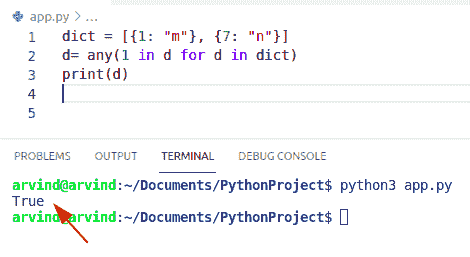

Python dictionary index exists

上面的代码，我们可以用来**检查索引是否存在于 Python 字典**中。

## Python 字典索引号

*   让我们看看如何用 Python 从字典中获取索引号。
*   使用 **list[index]** 函数从字典中获取索引号。它将返回键，并使用 items()函数从字典中返回一个集合。

**举例:**

```py
dictionary = {} 
dictionary['o'] = 4
dictionary['p'] = 9
dictionary['q'] = 6
new_value = list(dictionary.values())
print("Index number of specific value =",new_value[1])
```

下面是以下代码的截图

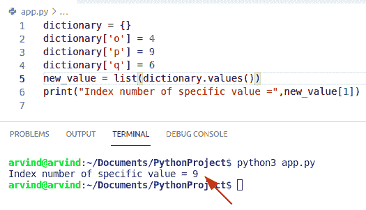

Python dictionary index number

这就是如何用 Python 从字典中**获得索引号。**

阅读 [Python 字典排序](https://pythonguides.com/python-dictionary-sort/)

## Python 字典从值获取索引

*   在 **Python 字典中从值**获取索引，我们可以通过使用两个函数的组合来解决这个任务，这两个函数是 `dict` 和 `Zip` 。
*   `dict()` 方法是 Python 中的内置函数，它返回一个对象或可迭代项。
*   `zip()` 函数可以用来映射索引和键。

**举例:**

让我们举一个例子，检查如何获得索引值

```py
to_dict = ['U.S.A', 'SouthAfrica', 'Paris', 'Polland']

new_value = dict(zip(to_dict, range(1, len(to_dict)+1)))
print("Index value : " + str(new_value))
```

首先在上面的代码中，我们将初始化一个列表，并使用 dict() +zip()函数从字典中访问所需的索引值

下面是以下代码的截图

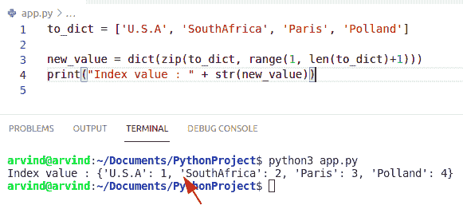

Python dictionary get index from the value

上面的代码，我们可以用来从 Python 字典的值中获取索引。

## Python 字典索引 vs 获取

*   这里我们就比较一下 **Python 字典索引**和 `get` ()函数。
*   在这种情况下， `get()` 方法用于返回项目的值。在使用**索引**的情况下，我们可以在保持顺序的情况下提供键值索引。
*   get()方法接受两个参数:要搜索的键和如果在字典中找不到该键时返回的默认值。

**语法:**

下面是 `get()` 函数的语法

```py
Dict.get
        (
         Key,
         default=None
        )
```

**举例:**

```py
my_dict = {"u":1, "v":2}
print(my_dict.get("u"))
print(my_dict.get("n"))
print(my_dict.get("n","Not Found ! "))

# index value
my_dict = {"m": 1, "l": 2}
new_value = list(my_dict)
index_value = new_value[0]
print(index_value)
```

下面是以下代码的截图

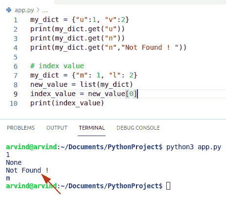

Python dictionary index vs get

阅读 [Python 字典过滤器](https://pythonguides.com/python-dictionary-filter/)

## Python 列表字典查找索引

*   让我们看看如何用 Python 从字典中找到索引。
*   在这个例子中，我们可以使用字典理解和 `len()` 函数来查找索引。
*   `len()` 函数是 Python 中的内置函数。

**举例:**

让我们举个例子，看看如何**从 Python 字典中找到索引。**

```py
new_list = ['John', 'George', 'James']

res = {x : new_list[x] for x in range(len(new_list))}
print("indexed value as list is :  " + str(res))
```

下面是以下代码的截图

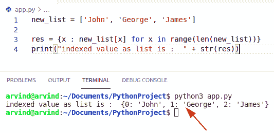

Python list dict find an index

您可能会喜欢以下 Python 教程:

*   [Python 字典初始化](https://pythonguides.com/python-dictionary-initialize/)
*   [Python 按空格分割字符串](https://pythonguides.com/python-split-string-by-space/)
*   [Python 字典理解](https://pythonguides.com/python-dictionary-comprehension/)
*   [Python 字典按值查找键](https://pythonguides.com/python-dictionary-find-a-key-by-value/)
*   [Python for 循环索引](https://pythonguides.com/python-for-loop-index/)

在本 Python 教程中，我们将讨论 **Python 字典索引**。在这里，我们还将看到 Python 创建字符串的示例:

*   键的 Python 字典索引
*   Python 字典索引值
*   Python 字典索引范围
*   Python 字典索引多个键
*   Python 字典索引存在
*   Python 字典索引号
*   Python 字典从值中获取索引
*   Python 字典索引与 get
*   Python 列表字典查找索引

[Bijay Kumar](https://pythonguides.com/author/fewlines4biju/)

Python 是美国最流行的语言之一。我从事 Python 工作已经有很长时间了，我在与 Tkinter、Pandas、NumPy、Turtle、Django、Matplotlib、Tensorflow、Scipy、Scikit-Learn 等各种库合作方面拥有专业知识。我有与美国、加拿大、英国、澳大利亚、新西兰等国家的各种客户合作的经验。查看我的个人资料。

[enjoysharepoint.com/](https://enjoysharepoint.com/)[](https://www.facebook.com/fewlines4biju "Facebook")[](https://www.linkedin.com/in/fewlines4biju/ "Linkedin")[](https://twitter.com/fewlines4biju "Twitter")