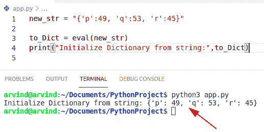

# Python 字典初始化-完整教程

> 原文：<https://pythonguides.com/python-dictionary-initialize/>

[](https://sharepointsky.teachable.com/p/python-and-machine-learning-training-course)

在本 [Python 教程](https://pythonguides.com/learn-python/)中，我们将讨论 **Python 字典初始化**。在这里，我们还将介绍以下示例:

*   Python 字典初始化为空
*   Python 字典初始化为 0
*   Python 字典初始化时没有值
*   Python 字典用值初始化
*   Python 字典用空列表初始化
*   如果为空，Python 字典初始化
*   Python 用键和值初始化字典
*   Python 用 for 循环初始化字典
*   Python 用多个键初始化字典
*   Python 用键初始化字典
*   Python 从字符串初始化字典
*   Python 初始化字典列表理解

目录

[](#)

*   [Python 字典初始化](#Python_dictionary_initialize "Python dictionary initialize")
*   [使用 dict()构造函数初始化 Python 中的字典](#Using_dict_constructor_to_initialize_dictionary_in_Python "Using dict() constructor to initialize dictionary in Python")
*   [使用 setdefault()函数初始化 Python 中的字典](#Using_setdefault_function_to_initialize_dictionary_in_Python "Using setdefault() function to initialize dictionary in Python")
*   [使用 fromKeys()方法初始化 Python 中的字典](#Using_fromKeys_method_to_initialize_a_dictionary_in_Python "Using fromKeys() method to initialize a dictionary in Python")
*   [使用 defaulltdict()方法初始化 Python 中的字典](#Using_defaulltdict_method_to_initialize_a_dictionary_in_Python "Using defaulltdict() method to initialize a dictionary in Python")
*   [使用 dict()和 zip()方法初始化 Python 中的字典](#Using_dict_and_zip_method_to_initialize_a_dictionary_in_Python "Using dict() and zip() method to initialize a dictionary in Python")
*   [Python 字典初始化为空](#Python_dictionary_initialize_empty "Python dictionary initialize empty")
*   [如何在 Python 中初始化空字典](#How_to_initialize_an_empty_dictionary_in_Python "How to initialize an empty dictionary in Python")
*   [Python 字典初始化为 0](#Python_dictionary_Initialize_to_0 "Python dictionary Initialize to 0")
*   [Python 字典初始化为无值](#Python_dictionary_initialize_with_none_values "Python dictionary initialize with none values")
*   [如何初始化没有值的字典](#How_to_initialize_a_dictionary_with_none_value "How to initialize a dictionary with none value")
*   [Python 字典用值](#Python_dictionary_initialize_with_values "Python dictionary initialize with values")初始化
*   [如何用值初始化字典](#How_to_initialize_a_dictionary_with_values "How to initialize a dictionary with values")
*   [Python 字典用空列表初始化](#Python_dictionary_initialize_with_empty_list "Python dictionary initialize with empty list")
*   [Python 字典如果为空则初始化](#Python_dictionary_initialize_if_empty "Python dictionary initialize if empty")
*   [检查 Python 字典是否为空](#Check_If_a_Python_dictionary_is_empty "Check If a Python dictionary is empty")
*   [Python 用键和值初始化字典](#Python_initialize_dictionary_with_keys_and_values "Python initialize dictionary with keys and values")
*   [Python 用 for 循环初始化字典](#Python_initialize_dictionary_with_for_loop "Python initialize dictionary with for loop")
*   [Python 用多个键初始化字典](#Python_initialize_dictionary_with_multiple_keys "Python initialize dictionary with multiple keys")
*   [Python 用键初始化字典](#Python_initialize_dictionary_with_keys "Python initialize dictionary with keys")
*   [Python 从字符串初始化字典](#Python_initialize_dictionary_from_string "Python initialize dictionary from string")
*   [Python 初始化字典列表理解](#Python_initialize_dictionary_list_comprehension "Python initialize dictionary list comprehension")

## Python 字典初始化

*   在 Python 中，字典是条目的无序集合，它包含键和值对，所以为了[创建字典](https://pythonguides.com/create-a-dictionary-in-python/)我们将使用“花括号”。
*   初始化意味着为开始做准备的过程。
*   在 Python 中有各种方法来初始化字典。
    *   使用 `dict()` 构造函数
    *   使用 `setdefault()` 函数
    *   使用 `fromKeys()` 方法
    *   使用 `defaultdict()` 方法
    *   使用 `dict()` 和 `zip()` 的方法

## 使用 dict()构造函数初始化 Python 中的字典

*   让我们看看**如何使用 dict()构造函数在 Python** 中初始化字典。
*   dict()构造函数可以通过以键值对的形式传递参数来初始化字典。

**举例:**

让我们举个例子，看看如何用 Python 初始化一个字典**。**

```py
my_dict = dict(Austraila=200, Newyork=300, Srilanka=600)
print("Initialze Dictionary",my_dict)
```

首先在上面的代码中，我们将[创建一个元组](https://pythonguides.com/create-a-tuple-in-python/)并在 dict()构造函数中传递参数。

下面是以下代码的截图


Python dictionary initialize

## 使用 setdefault()函数初始化 Python 中的字典

setdefault()方法返回列表理解中的键值。

**举例:**

```py
my_dictionary = {} 
[my_dictionary.setdefault(i, []) for i in range(4)] 

my_dictionary[0].append('George') 
my_dictionary[1].append('John') 

print ("Initialize dictionary : " + str(dict(my_dictionary)))
```

下面是以下代码的截图


Python dictionary initialize by setdefault method

这是如何在 Python 中设置 default()函数来初始化字典。

阅读 [Python 字典更新示例](https://pythonguides.com/python-dictionary-update/)

## 使用 fromKeys()方法初始化 Python 中的字典

如果你想用相同的值创建一个字典中的所有键，可以使用 fromkeys()函数，那么我们可以很容易地使用这个方法。

**举例:**

```py
new_key = ["James", "Potter", "mathew"]

Ini_dic = dict.fromkeys(new_key, 0)
print("Dictionary Initialization",Ini_dic)
```

下面是以下代码的截图


Python dictionary initialize by fromkeys method

这是如何用 Python 中的 fromKeys()方法初始化一个字典。

## 使用 defaulltdict()方法初始化 Python 中的字典

如果用户为不存在的键提供默认值，则可以使用 **Python dictionary defaultdict()函数**,然后它评估操作并初始化键值元素。

**举例:**

```py
from typing import DefaultDict

my_dictionary = DefaultDict(list)
my_dictionary[0].append('Kane') 
my_dictionary[1].append('Pollard') 
my_dictionary[2].append('Watson')
print ("Initialize dictionary : " + str(dict(my_dictionary)))
```

下面是以下代码的截图


Python dictionary initialize by defaultdict method

这是如何使用 defaulltdict()方法在 Python 中初始化一个字典。

读取 [Python 字典值以列出](https://pythonguides.com/python-dictionary-values-to-list/)

## 使用 dict()和 zip()方法初始化 Python 中的字典

**Python zip()函数**接受一个或多个 iterables，如 Python 元组和 Python 列表。然后我们将元组转换成字典。在这个例子中，我们必须将 index[list]作为参数传递。

**举例:**

```py
new_list = ["Australia", "Hong-Kong", "singapore"]

Ini_dict = dict(zip(new_list, [1]*len(new_list)))

print(Ini_dict)
```

以下是给定代码的屏幕截图:


Python dictionary Initialize a dictionary by dict and zip method

这是如何使用 dict()和 zip()方法在 Python 中初始化一个字典。

## Python 字典初始化为空

*   让我们看看如何通过使用左花括号符号{}来初始化一个空的 Python 字典
*   空字典也是由 dict()内置函数初始化的，没有任何参数。

**举例:**

```py
my_Dict = {}

print("Empty Dictionary",my_Dict)
print("Length of dictionary:", len(my_Dict))
```

下面是以下代码的截图


Python dictionary initialize empty

阅读 [Python 字典排序](https://pythonguides.com/python-dictionary-sort/)

## 如何在 Python 中初始化空字典

在这个例子中，我们可以检查如何使用 dict()函数在 Python 中创建一个空字典。函数返回一个存储字典键值对的对象。它是 Python 中的内置函数。

**举例:**

```py
Dictionary = dict()

# print dictionary
print("Empty Dictionary",Dictionary)
```

下面是以下代码的截图


Python dictionary initialize by dict method

上面的代码，我们可以用 Python 来初始化一个空字典。

## Python 字典初始化为 0

*   让我们看看如何使用 fromkeys()方法将 Python 字典值初始化为 0。
*   在这种情况下，如果 value 参数设置为=0，那么字典中的所有键都设置为提供的值。

**举例:**

```py
my_dict =dict.fromkeys(['Mangoes','Oranges','cherry'],0)
print("Initialize value=",my_dict)
```


Python dictionary Initialize to 0

这是一个初始化为 0 Python 字典的例子。

阅读 [Python 字典索引](https://pythonguides.com/python-dictionary-index/)

## Python 字典初始化为无值

*   这里我们可以检查如何通过使用 zip()和 repeat()函数用 non e 初始化一个 Python 字典。
*   在这个例子中，我们可以很容易地使用这些函数来执行这项任务。
*   Zip()函数基于迭代器项返回元组的迭代器元素，none 值与键相结合。而在 repeat()函数中我们可以很容易地给出这个数值将被打印多少次。

**举例:**

```py
from itertools import repeat

output = dict(zip(range(5), repeat(None)))

print("Initialize dictionary with None values : " + str(output))
```

首先在上面的代码中，我们将为 repeat()函数导入一个 `itertools` 库，并通过使用 `zip()+repeat()` 函数来获得 none 值。

下面是以下代码的截图


Python dictionary initialize with none value

这是用 none 值初始化 Python 字典。

## 如何初始化没有值的字典

这里我们可以很容易地使用 fromkeys() 函数来创建一个没有值的字典

**举例:**

```py
my_dict = dict.fromkeys(['London', 'Paris','Germany','France'])
print("Initailze dictionary none:",my_dict)
```

**注意:**在这个例子中，通过使用 fromkeys()函数，字典采用缺省值 none。

下面是以下代码的截图


Python dictionary initialize with none value from keys

## Python 字典用值初始化

*   让我们看看如何用 Python 中的值初始化字典。
*   在这个例子中我们可以使用 if __name__ == '__main__ ':和 `fromkeys()` 函数。
*   这是一个内置变量，它会返回模块的名字。每个模块包含一个名为“_name”的属性，该属性将返回该模块的名称。

**举例:**

```py
if __name__ == '__main__':
  my_dict = dict.fromkeys(['Chinese', 'Italian', 'Mexican','Thai'], [])
  my_dict.get('Chinese').append(1)

print(my_dict)
```

下面是以下代码的截图


Python dictionary initialize with values

## 如何用值初始化字典

在本例中，如果用户为不存在的键提供了默认值，则可以使用 default 函数，然后该函数计算操作并初始化键值元素。

**举例:**

```py
from typing import DefaultDict

my_dict = DefaultDict(list)
my_dict[0].append('Peach') 
my_dict[1].append('lilly') 
my_dict[2].append('Rose')
print ("Initialize dictionary with values : " + str(dict(my_dict)))
```

下面是以下代码的截图


Python dictionary initialize with value by defaultdict method

上面的代码，我们可以用 Python 中的值来初始化一个字典。

## Python 字典用空列表初始化

*   让我们看看**如何在 Python** 中用空列表初始化字典。
*   通过使用字典理解，我们首先声明键的数量，然后初始化空列表。
*   在这个例子中，我们使用一个空列表作为参数，以及初始化字典所需的元素范围。

**举例:**

让我们举一个例子，看看如何用一个空列表初始化一个字典。

```py
my_dictionary = {emp_list: [] for emp_list in range(3)}

print ("Initialize dictionary with empty list : " + str(my_dictionary))
```

下面是以下代码的截图


Python dictionary initialize with an empty list

## Python 字典如果为空则初始化

*   在这里，我们可以通过使用 len()函数来检查 Python 字典是否为空。
*   len()函数将返回给定字符串的大小或长度。在这个例子中，我们设置参数==0，这意味着列表中没有可用的字符串。

**举例:**

让我们举个例子，检查字典是否是空的

```py
my_dict = {}

if len(my_dict) == 0:
    print (" Initialize Dictionary is Empty")
```

下面是以下代码的截图


Python dictionary initialize if empty

## 检查 Python 字典是否为空

*   通过使用 bool()函数，我们可以执行这项任务。
*   首先，我们将初始化一个空字典，并在 bool()函数中传递一个空字符串，如果字典为空，该函数将返回 true。

**举例:**

```py
empt_dict = {}

Ini_dic = not bool(empt_dict)

print("Dictionary is empty : " + str(Ini_dic))
```

下面是以下代码的截图


Python dictionary initialize if empty bool method

这就是如何检查 Python 字典是否为空。

## Python 用键和值初始化字典

*   让我们讨论如何用键和值初始化字典。
*   在这个例子中，取两个存储元素或值的列表 new_key 和 new_value，下面的函数可以用来创建一个字典对象。
*   通过使用 zip()函数，我们可以将列表转换成字典。

**举例:**

让我们举一个例子，看看如何用键和值初始化一个字典

```py
new_key= ['m','n','o','p']
new_value= [4,6,7,9]
my_dict= dict(zip(new_key,new_value))
print(my_dict)
```

下面是以下代码的截图


Python dictionary initialize with keys and values

上面的 Python 代码我们可以用 Python 中的键和值来**初始化。**

## Python 用 for 循环初始化字典

*   让我们看看如何用 for 循环方法初始化一个字典。

**举例:**

```py
country = ["Malaysia", "Tokyo", "Russia"]
my_dic = { i: {} for i in country}
print(my_dic)
```

下面是以下代码的截图


Python initialize dictionary with for loop

这是如何在 Python 中用 for 循环初始化字典的**。**

## Python 用多个键初始化字典

*   让我们看看如何在 Python 中初始化一个带有多个键的字典。
*   在这个例子中，我们可以很容易地使用循环方法来创建一个有多个键的字典。

**举例:**

```py
to_dict = {}

multi_keys = ['Jennifer', 'potter', 'bill']

for keys in multi_keys:
    to_dict[keys] = 3

print("Initialize dictionary multiple key-value : " + str(to_dict))
```

下面是以下代码的截图


Python initialize dictionary with multiple keys

## Python 用键初始化字典

*   让我们看看如何用 Python 中的键来初始化字典。
*   使用 fromkeys()函数初始化一个带键的字典
*   在这个例子中，我们可以很容易地创建一个只有 keys 元素的列表，方法是使用 list of keys 作为 iterable 来初始化一个字典。

**举例:**

```py
new_list = ["p", "q"]

my_dict = dict.fromkeys(new_list)
print(my_dict)
```

下面是以下代码的截图


Python initialize dictionary with keys

**如何用键初始化字典**

通过遍历一个列表，我们可以很容易地检查如何用键初始化一个字典。

**举例:**

```py
new_keys = ["u", "v", "t"]

dict = {}
for x in new_keys:
    dict[x] = None
print(dict)
```

下面是以下代码的截图


Python dictionary initialize with keys iterate method

  **如何用键初始化字典**

通过使用 zip()函数声明一个带有键和相同长度值的字典，并作为参数 list-keys 传递。

**举例:**

```py
Ini_keys = ["z", "a", "l"]

my_dict = dict(zip(Ini_keys, [None]*len(Ini_keys)))
print(my_dict)
```

下面是以下代码的截图


Python dictionary initialize with keys zip method

## Python 从字符串初始化字典

*   让我们看看如何使用 eval()方法从字符串初始化字典。
*   这是 Python 中常用的内置函数，它计算字符串表达式并以字典形式返回输出。

**举例:**

让我们举一个例子，看看如何用 Python 从一个字符串初始化一个字典。

```py
new_str = "{'p':49, 'q':53, 'r':45}"

to_Dict = eval(new_str)
print("Initialize Dictionary from string:",to_Dict)
```

下面是以下代码的截图



Python initialize dictionary from string

## Python 初始化字典列表理解

*   让我们看看如何用列表理解方法初始化字典。
*   列表理解采用可迭代序列中的键值形式。

**举例:**

```py
new_key = ['z','y','u','w','r']
new_value = [4,5,6,2,9]  

to_dict = { k:v for (k,v) in zip(new_key, new_value)}  
print (to_dict)
```

下面是以下代码的截图


Python initialize dictionary list comprehension

这就是如何用列表理解方法初始化字典。

您可能会喜欢以下 Python 教程:

*   [Python NumPy 形状示例](https://pythonguides.com/python-numpy-shape/)
*   [PdfFileWriter Python 示例](https://pythonguides.com/pdffilewriter-python-examples/)
*   [Python 按空格分割字符串](https://pythonguides.com/python-split-string-by-space/)
*   [在 Python 中把字符串转换成浮点数](https://pythonguides.com/convert-string-to-float-in-python/)
*   [将浮点转换为整数 Python](https://pythonguides.com/convert-float-to-int-python/)
*   [PdfFileMerger Python 示例](https://pythonguides.com/pdffilemerger-python-examples/)

在这里我们了解到， **Python 字典初始化**和下面的例子:

*   Python 字典初始化为空
*   Python 字典初始化为 0
*   Python 字典初始化时没有值
*   Python 字典用值初始化
*   Python 字典用空列表初始化
*   如果为空，Python 字典初始化
*   Python 用键和值初始化字典
*   Python 用 for 循环初始化字典
*   Python 用多个键初始化字典
*   Python 用键初始化字典
*   Python 从字符串初始化字典
*   Python 初始化字典列表理解

[Bijay Kumar](https://pythonguides.com/author/fewlines4biju/)

Python 是美国最流行的语言之一。我从事 Python 工作已经有很长时间了，我在与 Tkinter、Pandas、NumPy、Turtle、Django、Matplotlib、Tensorflow、Scipy、Scikit-Learn 等各种库合作方面拥有专业知识。我有与美国、加拿大、英国、澳大利亚、新西兰等国家的各种客户合作的经验。查看我的个人资料。

[enjoysharepoint.com/](https://enjoysharepoint.com/)[](https://www.facebook.com/fewlines4biju "Facebook")[](https://www.linkedin.com/in/fewlines4biju/ "Linkedin")[](https://twitter.com/fewlines4biju "Twitter")