# Python 字典键错误

> 原文：<https://pythonguides.com/python-dictionary-key-error/>

[](https://sharepointsky.teachable.com/p/python-and-machine-learning-training-course)

在本 [Python 教程](https://pythonguides.com/learn-python/)中，我们将使用 Python 中的一些例子来研究**如何解决 Python 字典关键错误**。此外，我们还将涉及这些主题。

*   Python 字典键错误处理
*   Python 字典键错误，但键存在
*   Python 字典键错误 0
*   Python 字典键错误字符串
*   Python defaultdict 键错误
*   Python 字典键错误无
*   Python 字典删除键，没有错误
*   Python 字典尝试除键错误
*   Python 键错误嵌套字典

目录

[](#)

*   [Python 字典键错误](#Python_dictionary_key_error "Python dictionary key error")
*   [Python 字典键错误处理](#Python_dictionary_key_error_handling "Python dictionary key error handling")
*   [Python 字典密钥错误，但密钥存在](#Python_dictionary_key_error_but_key_exists "Python dictionary key error but key exists")
*   [Python 字典键错误 0](#Python_dictionary_key_error_0 "Python dictionary key error 0")
*   [Python 字典键错误字符串](#Python_dictionary_key_error_string "Python dictionary key error string")
*   [Python 默认关键字错误](#Python_defaultdict_key_error "Python defaultdict key error")
*   [Python 字典键错误无](#Python_dict_key_error_none "Python dict key error none")
*   [Python 字典移除键，无错误](#Python_dict_remove_key_without_error "Python dict remove key without error")
*   [Python 字典试除键错误](#Python_dictionary_try_except_key_error "Python dictionary try except key error")
*   [Python 键错误嵌套字典](#Python_key_error_nested_dictionary "Python key error nested dictionary")

## Python 字典键错误

*   在本节中，我们将讨论 Python 字典中的一个关键错误。
*   在 Python 中，当用于查找值的字典中不存在键时，会引发键错误。
*   例如，假设您有一个包含花括号内的键-值对的字典，现在如果您想要从字典中获取给定字典中不存在的特定键，那么它将引发一个错误。
*   要解决这个问题，您可以从存在的字典中选择该项，也可以使用 `try-except` 块来处理它。

**举例:**

```py
my_dict={'U.S.A':15,'France':18,'China':27}

result=my_dict['Japan']
print(result)
```

在下面给定的代码中，我们创建了一个名为**‘my _ dict’**的字典，其中包含键值对形式的元素，然后我们声明了一个变量**‘result’**，并分配了一个关键元素**‘日本’**。

下面是下面给出的代码的截图。

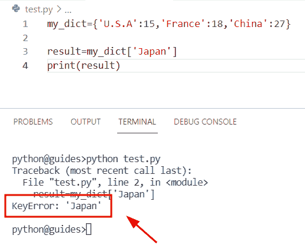

Python dictionary key error

正如您在屏幕截图中看到的，输出显示了关键字 error:“Japan”这背后的原因是字典中不存在该关键字，并且它不能返回任何值。

解决办法

让我们通过使用 `get()` 方法来看看这个错误的解决方案

*   在 Python 中， `get()` 方法用于消除键错误，如果找到键，它将检查条件，然后返回值，如果没有，它将引发错误。
*   该方法用于从字典中检索一个值，它采用两个参数来表示我们想要搜索的关键字，缺省值是 none。

**语法:**

下面是 Python `get()` 方法的语法

```py
dict.get(key[,value])
```

**举例:**

让我们举个例子，看看如何解决这个关键错误

**源代码:**

```py
my_dict={'U.S.A':15,'France':18,'China':27}

result=my_dict.get('japan',14)
print("Return value:",result)
```

下面是以下给定代码的执行过程

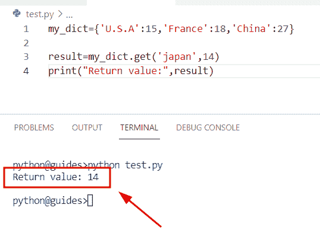

Solution of Python dictionary key error

正如您在截图中看到的，输出显示返回值为 `14` 。

另外，检查: [Python 字典重复键](https://pythonguides.com/python-dictionary-duplicate-keys/)

## Python 字典键错误处理

*   在这个程序中，我们将讨论如何通过使用 Python 中的异常处理来解决键错误问题。
*   在 Python 中，当你的程序出现错误或出错时，那么 `try-except` 方法将帮助用户捕捉和处理异常。

**举例:**

让我们举一个例子，看看如何通过使用处理来引发 Python 中的关键错误

```py
my_dictionary = {"George" : 678, "Oliva" : 897, "James" : 156}

try:  
  print (my_dictionary["Micheal"])  
except:  
  print ("key error:Key does not contain in dictionary") 
```

在这个例子中，我们创建了一个字典，它包含了以**键-值**对形式的元素，然后使用了 `try-except` 块。该方法将检查条件，如果关键字在字典中可用，则显示该关键字的值，如果关键字不可用，则显示消息**‘关键字不包含在字典中’**。

下面是以下给定代码的实现。

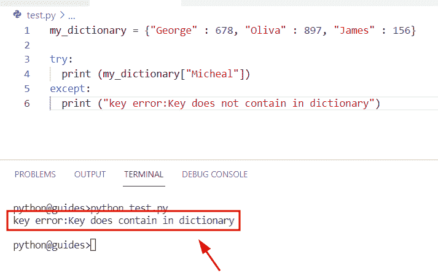

Python dictionary key error handling

**解决方案:**

让我们来看看这个错误的解决方案

**源代码:**

```py
my_dictionary = {"George" : 678, "Oliva" : 897, "James" : 156}

try:  
  print (my_dictionary["Oliva"])  
except:  
  print ("key error:Key does not contain in dictionary") 
```

在上面的代码中，我们创建了一个名为**‘my _ diction**ary’的字典，然后我们使用了处理概念 try-except，这意味着如果字典中有这个**e‘Oliva’**键，那么它将返回值。

下面是以下给定代码的执行过程

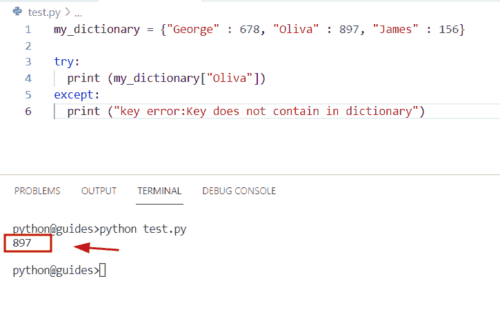

Solution of python key error handling

正如您在屏幕截图中看到的，输出显示的键值是' `897` '。

阅读:[获取字典 Python 中的第一个键](https://pythonguides.com/get-first-key-in-dictionary-python/)

## Python 字典密钥错误，但密钥存在

*   在本节中，我们将讨论如何解决字典 Python 中存在的键错误。
*   为了执行这个特定的任务，首先，我们将使用花括号创建一个字典，并用逗号分隔元素。
*   为了获得键错误，我们将使用 Python in 操作符，该操作数将检查字典中是否有键元素。

**举例:**

```py
country_name = {'U.S.A':178, 'France':456, 'China':754, 'Australia':345}

if 'Germany' in country_name:
    print("Key exist in dictionary")
else:
    print("Key error: Does not contain in dictionary") 
```

在上面的代码中，我们检查了字典中是否存在**‘Germany’**键。为了完成这个任务，我们首先设置条件，如果字典中存在**【德国】**键，那么它将返回一个值，否则它将显示**【键错误】**。

下面是以下给定代码的实现。

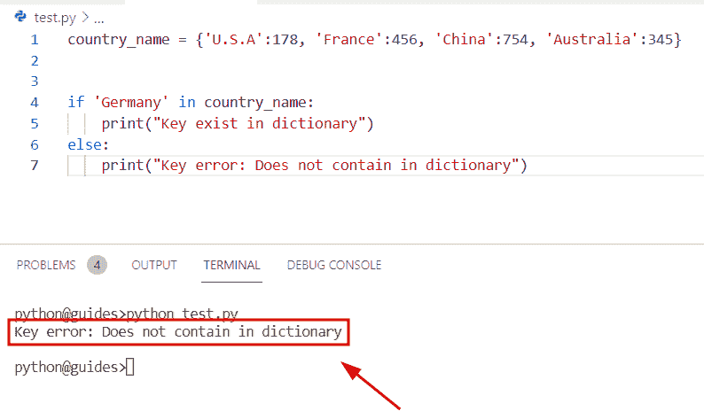

Python dictionary key error but key exists

阅读: [Python 字典增量值](https://pythonguides.com/python-dictionary-increment-value/)

## Python 字典键错误 0

*   在本期节目中，我们将讨论如何解决 Python 字典中的关键错误。
*   为了完成这项任务，我们将使用索引方法，这是一种获取字典键值的简单方法。
*   让我们举一个例子，我们将看到字典索引是如何工作的，它还将检查关键字在字典中是否可用。

**举例:**

```py
my_dictionary= {16: 'Germany', 19: 'Japan'} 

print(my_dictionary[0]) 
```

下面是以下给定代码的执行过程

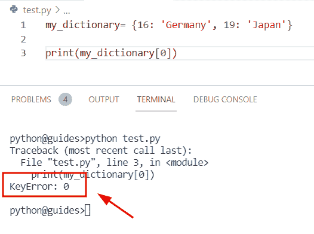

Python dictionary key error 0

正如你在截图中看到的，输出显示键错误 `0` ，这意味着它没有找到**键值**并返回 `0` 值。

让我们来看看这个错误的解决方法。

**解决方案:**

```py
my_dictionary= {0: 'Germany', 19: 'Japan'} 

print(my_dictionary[0]) 
```

在上面的代码中，我们已经更新了给定的字典**‘my _ dictionary’**，这意味着我们在字典中将键指定为 `0` ，并设置了值**‘德国’**。一旦执行了这段代码，输出将显示**‘Germany’**值。

下面是以下代码的截图

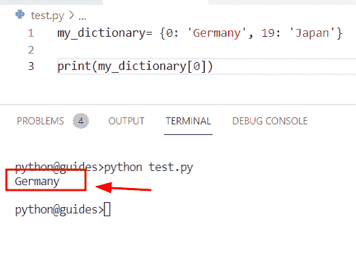

Solution of Python dictionary key error 0

阅读: [Python 列表字典](https://pythonguides.com/python-dictionary-of-lists/)

## Python 字典键错误字符串

*   在本期节目中，我们将讨论如何解决 Python 字典中的关键错误字符串。
*   在本例中，我们将使用索引方法来获取关键错误字符串。
*   为了完成这项任务，我们将在列表中分配给定字典中没有的未知键。

**举例:**

```py
my_dictionary = {'z':178,'y':785,'v':345}

print(my_dictionary['m'])
```

下面是以下给定代码的输出。

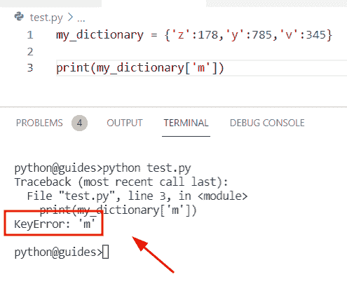

Python dictionary key error string

正如您在屏幕截图中看到的，输出显示了键错误，这意味着字典中不存在该键字符串。

**解决方案:**

让我们来看看这个错误的解决方法。

**举例:**

```py
my_dictionary = {'z':178,'y':785,'v':345}

print(my_dictionary['y'])
```

在上面的代码中，我们提到了给定字典中可用的列表中的键**‘y’**。一旦执行了这段代码，它将返回特定键的值。

下面是以下给定代码的实现。

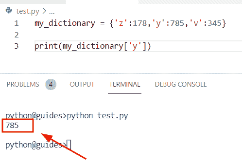

Solution of Python dictionary key error string

阅读: [Python 字典扩展](https://pythonguides.com/python-dictionary-extend/)

## Python 默认关键字错误

在 Python defaultdict 中，永远不会产生键错误。假设您有一个字典，现在您想通过使用默认的 `dict` 方法存在一个新的键，它不接受任何参数，为一个不存在的键生成一个默认值。

**举例:**

```py
from collections import defaultdict

my_dict = defaultdict(int)
print(my_dict[4])
```

下面是下面给出的代码的截图。

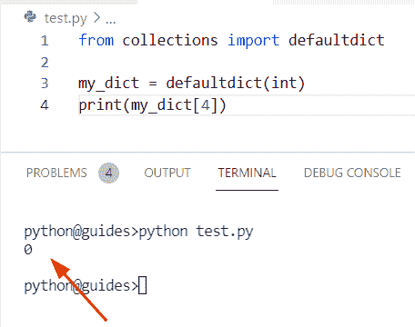

Python defaultdict key error

阅读: [Python 字典多键](https://pythonguides.com/python-dictionary-multiple-keys/)

## Python 字典键错误无

*   在本节中，我们将讨论如何在 Python 字典中获取键 error none 值。
*   为了执行这个特定的任务，我们将使用 `dict.get()` 方法。在 Python 中，get()方法用于消除键错误，如果找到键，它将检查条件，然后返回值，如果没有，它将引发错误。

**语法:**

下面是 `dictionary.get()` 方法的语法。

```py
dict.get(key[,value])
```

**举例:**

```py
my_dict={'a':12,'b':45}

new_result = my_dict.get('c')
print("Key error:",new_result)
```

下面是下面给出的代码的截图。

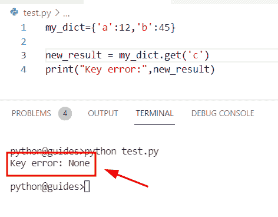

Python dict key error none

正如您在截图中看到的，输出显示了关键错误 `None` 。

**解决方案:**

```py
my_dict={'a':12,'b':45}

new_result = my_dict.get('a')
print(new_result)
```

在下面给出的代码中，我们已经创建了一个名为**‘my _ dict’**的字典，它包含了键值对形式的元素。之后，我们使用了 `dict.get()` 方法，并分配了字典中可用的关键元素。

下面是以下给定代码的实现。

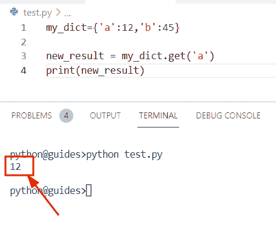

Solution of Python dict key error none

正如您在屏幕截图中看到的，输出显示了特定键的返回值。

阅读:[如何创建一个空的 Python 字典](https://pythonguides.com/how-to-create-an-empty-python-dictionary/)

## Python 字典移除键，无错误

*   在这个程序中，我们将从 Python 字典中无误地删除一个键。
*   为了完成这个任务，我们将使用 `dict.pop()` 方法，它将从字典中删除一个特定的键并返回它的值。
*   获取关于 `dict.pop()` 方法的更多信息。你可以参考我们关于 [Python 字典 pop](https://pythonguides.com/python-dictionary-pop/) 的详细文章。

**举例:**

```py
new_dictionary = {'U.S.A':456,'China':123,'Germany':975}

new_result = new_dictionary.pop('China')
print(new_result)
print("After removing the key:",new_dictionary)
```

你可以参考下面的截图。

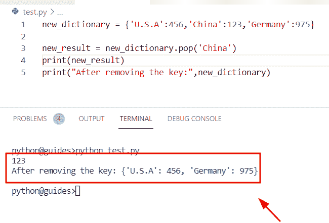

Python dict remove the key without error

正如您在截图中看到的，输出显示**‘China’**键已从字典中删除。

阅读: [Python 字典转 CSV](https://pythonguides.com/python-dictionary-to-csv/)

## Python 字典试除键错误

*   在这一节中，我们将讨论如何使用 Python 字典中的 `try-except` 块并获取键错误。
*   在 Python 中，try-except 块检查语句。如果代码未成功执行，则程序将在该行结束，并生成错误，而在 except 情况下，代码将成功运行。
*   在这个例子中，我们将创建一个包含键值对形式的元素的字典，然后我们将使用 try-except 块。该方法将检查条件，如果字典中有该键，则显示该键的值
*   如果密钥不可用，它将显示“密钥不包含在字典中”的消息。

**举例:**

```py
new_dict = {"U.S.A" : 156, "China" : 2356, "Germany" : 897}

try:  
  print (new_dict["Japan"])  
except:  
  print ("key error:Key does not contain in dictionary") 
```

下面是下面给出的代码的截图。

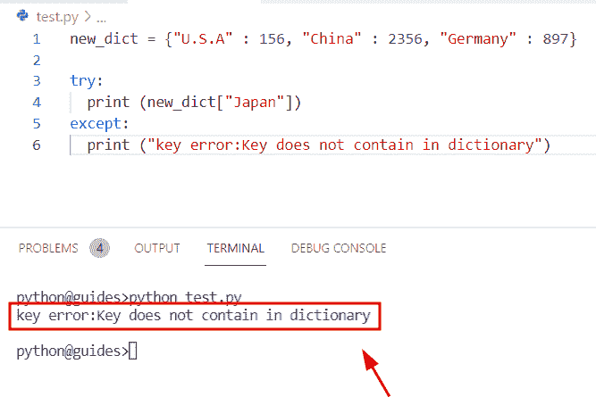

Python dictionary try-except key error

**解决方案:**

让我们来看看这个错误的解决方法。

**源代码:**

```py
new_dict = {"U.S.A" : 156, "China" : 2356, "Germany" : 897}

try:  
  print (new_dict["Germany"])  
except:  
  print ("key error:Key does not contain in dictionary") 
```

下面是以下给定代码的实现

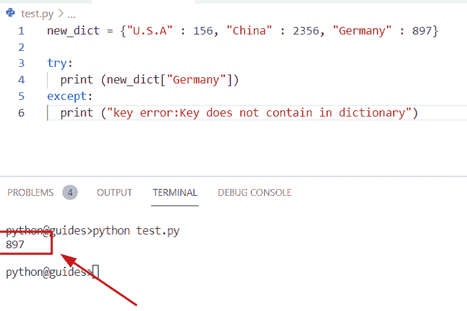

Solution of Python dictionary try-except key error

阅读: [Python 元组字典](https://pythonguides.com/python-dictionary-of-tuples/)

## Python 键错误嵌套字典

*   这里我们将讨论如何解决 Python 嵌套字典中的关键错误。
*   为了完成这项任务，我们首先将创建一个嵌套字典并分配多个字典。接下来，我们将使用 `dict.get()` 方法，该方法将帮助用户消除键错误，并检查条件，如果找到键，则返回值，如果没有，则引发错误。

**举例:**

```py
my_dict = { 'Country_name': {'Germany': 678},
                'Desgination': {'Developer': 987}}
new_result = my_dict.get('Number')
print("Key error:",new_result)
```

在上面的代码中，我们使用了 `dict.get()` 方法，并且在这个函数中，我们指定了未知的 key 元素。一旦执行了这段代码，输出将显示键错误值**‘None’**，这意味着我们在参数中分配的键在给定的字典中不存在。

下面是下面给出的代码的截图。

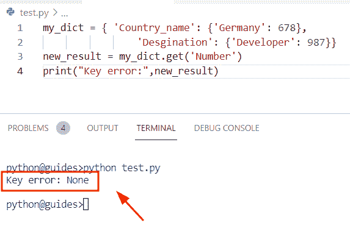

Python key error nested dictionary

**解决方案:**

让我们来看看这个错误的解决方法。

```py
my_dict = { 'Country_name': {'Germany': 678},
                'Desgination': {'Developer': 987}}
new_result = my_dict.get('Country_name')
print(new_result)
```

在上面的代码中，我们更新了 `dict.get()` 函数。在这个例子中，我们指定了当前键作为参数，这个键在给定的字典中是可用的。一旦执行了这段代码，它就会返回值。

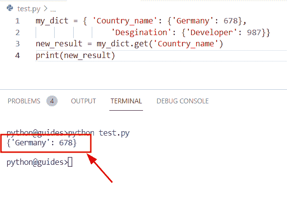

Solution of Python key error nested dictionary

您可能还想查看以下 python 教程。

*   [Python 字典包含+个例子](https://pythonguides.com/python-dictionary-contains/)
*   [Python 字典理解](https://pythonguides.com/python-dictionary-comprehension/)
*   [Python 字典按值搜索](https://pythonguides.com/python-dictionary-search-by-value/)
*   [Python 字典初始化](https://pythonguides.com/python-dictionary-initialize/)
*   [Python 字典多值](https://pythonguides.com/python-dictionary-multiple-values/)
*   [Python 将字典转换为列表](https://pythonguides.com/python-convert-dictionary-to-list/)

因此，在本教程中，我们已经学习了**如何使用 python 中的一些例子来解决 Python 字典键错误**。此外，我们还讨论了这些主题。

*   Python 字典键错误处理
*   Python 字典键错误，但键存在
*   Python 字典键错误 0
*   Python 字典键错误字符串
*   Python defaultdict 键错误
*   Python 字典键错误无
*   Python 字典删除键，没有错误
*   Python 字典尝试除键错误
*   Python 键错误嵌套字典

[Bijay Kumar](https://pythonguides.com/author/fewlines4biju/)

Python 是美国最流行的语言之一。我从事 Python 工作已经有很长时间了，我在与 Tkinter、Pandas、NumPy、Turtle、Django、Matplotlib、Tensorflow、Scipy、Scikit-Learn 等各种库合作方面拥有专业知识。我有与美国、加拿大、英国、澳大利亚、新西兰等国家的各种客户合作的经验。查看我的个人资料。

[enjoysharepoint.com/](https://enjoysharepoint.com/)[](https://www.facebook.com/fewlines4biju "Facebook")[](https://www.linkedin.com/in/fewlines4biju/ "Linkedin")[](https://twitter.com/fewlines4biju "Twitter")