# Python 字典长度——你需要知道的一切

> 原文：<https://pythonguides.com/python-dictionary-length/>

[](https://sharepointsky.teachable.com/p/python-and-machine-learning-training-course)

在本 [Python 教程](https://pythonguides.com/learn-python/)中，我们将讨论 **Python 字典长度**。在这里，我们还将介绍以下示例:

*   Python 字典值的长度
*   Python 字典密钥长度
*   Python 字典列表长度
*   Python 获取空字典的长度
*   Python 字典长度限制
*   Python 嵌套字典长度
*   Python 字典字符串长度
*   Python 字典大小限制
*   Python 字典单词长度
*   Python 字典密钥长度性能

目录

[](#)

*   [Python 字典长度](#Python_dictionary_length "Python dictionary length")
*   [Python 字典长度值](#Python_dictionary_length_of_values "Python dictionary length of values")
*   [Python 字典密钥长度](#Python_dictionary_length_of_keys "Python dictionary length of keys")
*   [如何在 Python 字典中找到键的长度](#How_to_find_the_length_of_keys_in_Python_Dictionary "How to find the length of keys in Python Dictionary ")
*   [Python 字典列表长度](#Python_dictionary_list_length "Python dictionary list length")
*   [查字典中的长度列表](#Check_the_list_of_length_in_a_dictionary "Check the list of length in a dictionary")
*   [Python 嵌套字典长度](#Python_nested_dictionary_length "Python nested dictionary length")
*   [Python 获取空字典长度](#Python_get_length_of_empty_dictionary "Python get length of empty dictionary")
*   [Python 字典字符串长度](#Python_dictionary_string_length "Python dictionary string length")
*   [Python 字典大小限制](#Python_dictionary_size_limit "Python dictionary size limit")
*   [Python 字典字长](#Python_dictionary_word_length "Python dictionary word length")
*   [Python 字典密钥长度性能](#Python_dictionary_key_length_performance "Python dictionary key length performance")

## Python 字典长度

*   要检查一个 [Python 字典](https://pythonguides.com/create-a-dictionary-in-python/)的长度，我们可以很容易地使用 Python 的内置函数 `len()` 。
*   这个函数以键值对的形式给出了字典中可用的长度数。
*   `Len()` 函数总是返回字典中给定的可迭代项数。这个方法实际上充当了一个自动定义数据的计数器。

**语法:**

下面是 `len()` 函数的语法

```py
len(dict)
```

**举例:**

我们举个例子，检查一下如何用 `len()` 方法求字典的长度。

```py
my_dict = {"Micheal":20,"george":30,"james":40}
print("Length of dictionary:",len(my_dict))
```

下面是下面给出的代码的截图。

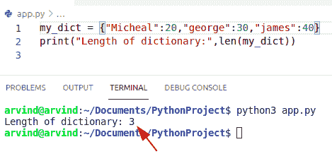

Python dictionary length

另一个例子是检查如何使用 Python 中的 `instance()` 方法找到字典的长度。

*   实例方法有两个参数。第一个参数是**对象**。我们需要传递一个对象作为参数。该对象可以是浮点数、整数或字符串。第二个参数是**类/类型**。这种方法将帮助用户找到字典的长度。
*   在本例中，首先我们将创建一个名为“ `emp_length` ”的变量。为了检查它是否是 dictionary 的实例，我们可以遍历 dictionary 中存在的所有给定值。

**举例:**

```py
my_dict ={
       'Emp_info':
           {
               'emp_name':'james',
               'L_name':'potter'
           },
       'emp_Age':40,
       'emp_position':'Developer',
       'addr':
           {

           'emp_City':'Newyork',
           'Country':'U.S.A'
           }       
      }
emp_length = len(my_dict)
for x in my_dict.values():

    if isinstance(x, dict):
        emp_length += len(x)
print("length of the dictionary:", emp_length)
```

下面是执行的截图。

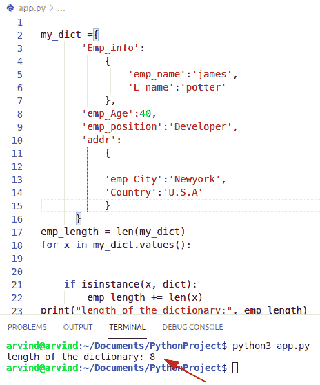

Python dictionary length by instance method

阅读: [Python while 循环多个条件](https://pythonguides.com/python-while-loop-multiple-conditions/)

## Python 字典长度值

*   让我们看看如何在 Python 字典中检查值的长度。
*   在这个例子中，我们可以很容易地使用列表理解方法来查找字典值的长度。
*   我们需要传递一个对象作为参数。该对象可以是浮点数、整数等

**举例:**

```py
def main():

    my_dict = {'nu_list':[2, 5, 7],
           'nu_tupple':(9, 7, 6),
           'intg':9,
           'str_nu':"qwert",
           }

    no_count = sum([1 if isinstance(my_dict[x], (str, int))
                 else len(my_dict[x]) 
                 for x in my_dict])

    print("total length of values is:", no_count)

if __name__ == '__main__':
    main()
```

以下给定代码的输出。

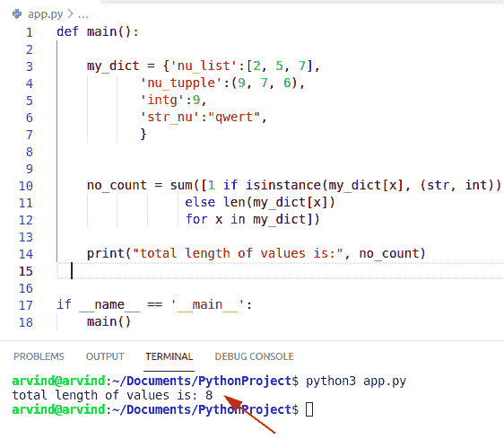

Python dictionary length of values

另一个例子是检查字典中值的长度。

*   这里我们可以检查如何使用 dict.items()方法在字典中查找值的长度。
*   该方法返回列表并检查字典中有多少值可用。这个方法没有参数。

**举例:**

让我们举一个例子，检查如何使用 dict.items()找到值的长度

```py
def main():

    my_dict = {'new_list':[9, 8, 9,7],
           'new_tupple':(4, 5, 6,8),
           'int_value':9,
           'new_str':"qwert"
           }

    cou_new = 0

    for ne_key, ne_val in my_dict.items():

        if isinstance(ne_val, int):
            cou_new += 1

        elif isinstance(ne_val, str):
            cou_new += 1

        else:
            cou_new += len(ne_val)
    print(" total length of value is:", cou_new)
if __name__ == '__main__':
    main()
```

下面给出了实现的截图。

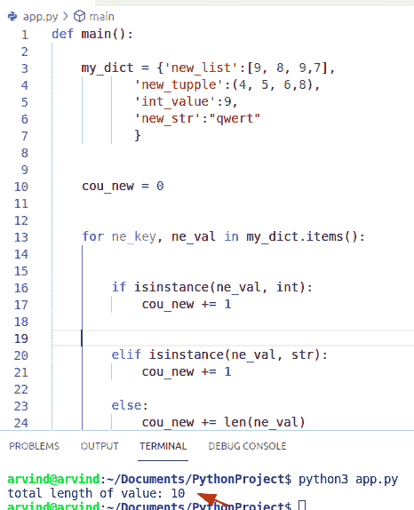

Python dictionary length of values by dict. items()

阅读: [Python Tkinter 竞猜](https://pythonguides.com/python-tkinter-quiz/)[——完整教程](https://pythonguides.com/python-tkinter-quiz/)

## Python 字典密钥长度

*   让我们看看如何在字典中查找键的长度。
*   在这个例子中，我们可以很容易地使用函数 len()来查找字典中键的长度。
*   该函数用于返回一个对象中可用的 iterable 项的数量。我们还可以使用 keys()方法通过 len()来计数。

**举例:**

让我们举一个例子，检查如何在字典中查找键的长度

```py
dictionary = {'l':4,'m':8,'n':9}
b = len(dictionary.keys())
print("Length of keys",b)
```

下面是以下给定代码的执行过程

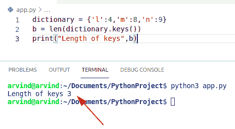

Python dictionary length of keys

## 如何在 Python 字典中找到键的长度

为了计算 Python 字典中的键的数量，我们可以很容易地使用函数 enumerate()和来返回对象中可用的 iterable 项的数量。

**举例:**

```py
my_dict = {'p':1,'r':2,'s':3,'t':7}

def New_key(dict):
    cou_no = 0
    for i in enumerate(dict):
        cou_no += 1
    return cou_no

print("Length of key",New_key(my_dict))
```

下面是以下给定代码的实现

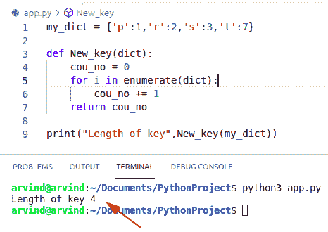

Python dictionary length of keys by enumerator

这是如何检查字典中键的长度。

又念: [Python 字典初始化](https://pythonguides.com/python-dictionary-initialize/)

## Python 字典列表长度

*   让我们看看如何在字典中查长度表。
*   在这个例子中，我们可以很容易地使用函数 isinstance()。IsInstance()方法有两个参数。第一个参数是一个对象。我们需要传递一个对象作为参数。该对象可以是浮点数、整数或字符串。

**举例:**

让我们举个例子，看看如何在字典中查找长度列表

```py
def main():

    my_dict = {'new_list':[10, 11, 19,7,18],}

    cou_new = 0
    for ne_key, ne_val in my_dict.items():

        if isinstance(ne_val, int):
            cou_new += 1

        elif isinstance(ne_val, str):
            cou_new += 1

        else:
            cou_new += len(ne_val)
    print(" Dictionary list length:", cou_new)
if __name__ == '__main__':
    main()
```

下面是以下给定代码的输出

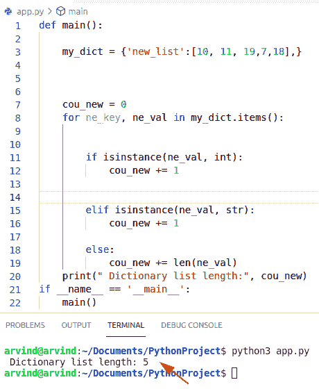

Python dictionary list length

阅读 [Python 字典方法](https://pythonguides.com/python-dictionary-methods/)

## 查字典中的长度列表

在这个例子中，我们可以很容易地使用函数 len()在 Python 中检查字典中的长度列表。

**举例:**

```py
new_list = [3,4,7,8,9]
print("Length of list dictionary:",len(new_list))
```

下面给出了以下代码的执行。

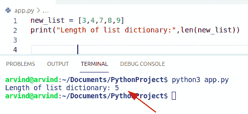

Python list length len() method

阅读: [Python 字典过滤器](https://pythonguides.com/python-dictionary-filter/)

## Python 嵌套字典长度

*   这里我们可以看到如何找到一个嵌套的 Python 字典的长度。
*   创建嵌套字典就像创建普通字典一样简单。主要区别在于每个值都是另一个字典。
*   在这个例子中，我们可以很容易地使用 isinstance()方法。

**举例:**

让我们举一个例子，看看如何找到一个嵌套字典的长度

```py
my_dict ={
       'student_info':
           {
               'stu_name':'MIcheal',
               'L_name':'George'
           },
       'stu_Age':25,
       'stu_position':'Gamer',
       'stu_addr':
           {

           'stu_City':'Paris',
           'Country':'France'
           }       
      }
new_len = len(my_dict)

for x in my_dict.values():

    if isinstance(x, dict):
        new_len += len(x)

print("length of dictionary:", new_len) 
```

下面给出了以下代码的实现。


Python nested dictionary length

另一个例子，检查如何找到一个嵌套字典的长度

在这个例子中，我们可以使用 Python 拥有的各种工具来计算这个嵌套字典中的元素。

**举例:**

```py
dict={'colours': 
         {'yellow': 'blue', 'pink': 'red', 'green': 'brown'}, 
       'Foods': 
         {'pasta': 'pizza', 'lamb': 'chicken', 'bread': 'butter'}}
b = len(dict)
c = len(dict['colours'])+len(dict['Foods'])
print("Nested dictionary length:",c)
```

下面给出了以下代码的输出。

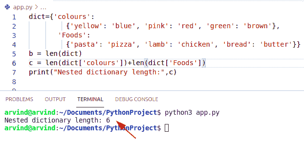

Python nested dictionary length method

## Python 获取空字典长度

*   这里我们可以检查如何在 Python 中获得空字典的长度。
*   通过使用 len()函数找出这个空字典的长度。
*   在这个例子中，我们将创建一个空字典，并计算出这个字典的长度。

**举例:**

让我们举一个例子，检查如何获得空字典的长度

```py
my_dict = {}

new_length = len(my_dict)

print('Length of empty dictionary:', new_length)
```

给定代码的执行如下。

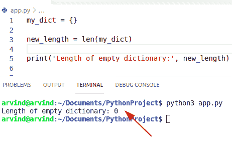

Python get the length of an empty dictionary

阅读: [Python NumPy max 带示例](https://pythonguides.com/python-numpy-max-with-examples/)

## Python 字典字符串长度

*   让我们看看如何在字典中检查字符串长度。
*   在本例中，我们将使用 isinstance()方法检查给定字典中有多少字符串。

**举例:**

```py
def main():

    to_dict = {
           'str_nu':"qwertyuiop",'str2':"edddddwgf"
           }

    no_count = sum([1 if isinstance(to_dict[y], (str, int))
                 else len(to_dict[y]) 
                 for y in to_dict])

    print("total string length is:", no_count)

if __name__ == '__main__':
    main()
```

给定代码的输出如下。

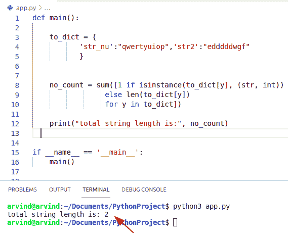

Python dictionary string length

另一个例子来检查如何计算字典中的字符串长度

通过使用 len()函数，我们可以得到给定字符串的长度。我们可以使用 len()函数来执行这个特定的任务。这个函数帮助用户计算对象中包含的元素数量。

**举例:**

让我们举一个例子，检查如何在字典中查找字符串长度

```py
my_dict = {'string1':"MIcheal",'string2':"JOhn",'string3':"George"}

print("Length of string in dictionary:",len(my_dict))
```

给定代码的实现如下。

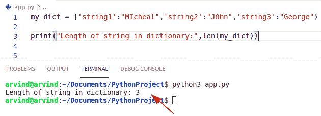

Python dictionary string length method

## Python 字典大小限制

*   这里我们可以看到如何获得字典的大小限制。
*   对于字典中的字符串键，它是 1 微秒的量级。timetaken 的增长适度地依赖于字典中存在的元素数量，可能类似于 log 值。
*   对于大于 2 的 26 次方(等于 67，108，864)的字典，性能会显著降低。从字典里读要多花 30 倍的时间。
*   如果你有效地选择大小 2 的 27 次方，等于 134，217，728，从字典中读取要长 9000 倍，但这取决于你的系统。它不会显示输出，因为计算机在到达 2^27.之前内存不足所以字典里没有大小限制。

## Python 字典字长

要在字典中查找单词长度，首先将其插入列表并设置。现在定义一个函数，名为`word _ length`h，对应于一个键的单词列表存储了文本中所有长度等于键值的唯一单词。

**举例:**

我们举个例子，查查怎么在字典里找一个词的长度。

```py
from collections import defaultdict
def word_length(sentence):
    my_dict = defaultdict(set)

    for word in sentence.split():
        my_dict[len(word)].add(word)    

    return {key : list(value) for key, value in my_dict.items()}
sentence = "Python is a best programming language"
print(word_length(sentence))
```

给定代码的输出如下。

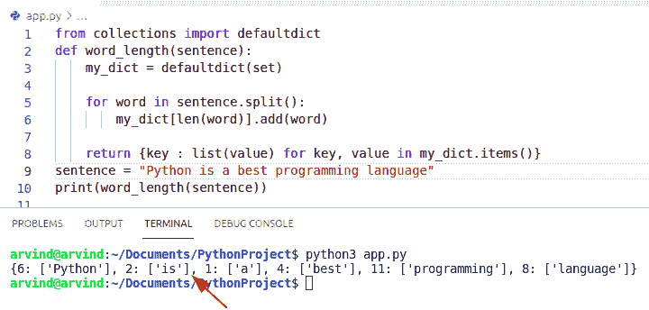

Python dictionary word length

阅读: [Python NumPy 形状](https://pythonguides.com/python-numpy-shape/)

## Python 字典密钥长度性能

*   让我们看看如何在字典中查找键的长度。
*   在这个例子中，我们可以很容易地使用函数 len()来查找字典中键的长度。

**举例:**

```py
my_dict = {'p':5,'q':2,'r':1}
d = len(my_dict.keys())
print("Length of keys",d)
```

下面是以下代码的截图

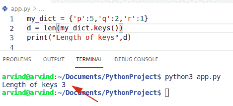

Python dictionary key length performance

您可能也会喜欢以下文章:

*   [Python 反向 NumPy 数组](https://pythonguides.com/python-reverse-numpy-array/)
*   [Python NumPy 空数组](https://pythonguides.com/python-numpy-empty-array/)
*   [Python NumPy 平均值](https://pythonguides.com/python-numpy-average/)
*   [什么是 python Django](https://pythonguides.com/what-is-python-django/)
*   [Python Django vs Flask](https://pythonguides.com/python-django-vs-flask/)

在本 Python 教程中，我们将讨论 **Python 字典**长度。在这里，我们还将介绍以下示例:

*   Python 字典值的长度
*   Python 字典密钥长度
*   Python 字典列表长度
*   Python 获取空字典的长度
*   Python 字典长度限制
*   Python 嵌套字典长度
*   Python 字典字符串长度
*   Python 字典大小限制
*   Python 字典单词长度
*   Python 字典密钥长度性能

[Bijay Kumar](https://pythonguides.com/author/fewlines4biju/)

Python 是美国最流行的语言之一。我从事 Python 工作已经有很长时间了，我在与 Tkinter、Pandas、NumPy、Turtle、Django、Matplotlib、Tensorflow、Scipy、Scikit-Learn 等各种库合作方面拥有专业知识。我有与美国、加拿大、英国、澳大利亚、新西兰等国家的各种客户合作的经验。查看我的个人资料。

[enjoysharepoint.com/](https://enjoysharepoint.com/)[](https://www.facebook.com/fewlines4biju "Facebook")[](https://www.linkedin.com/in/fewlines4biju/ "Linkedin")[](https://twitter.com/fewlines4biju "Twitter")