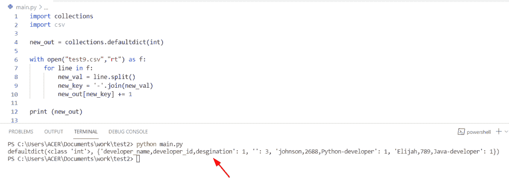

# Python 字典多键

> 原文：<https://pythonguides.com/python-dictionary-multiple-keys/>

[](https://sharepointsky.teachable.com/p/python-and-machine-learning-training-course)

在本 Python 教程中，我们将讨论 **Python 字典多键**。在这里，我们还将介绍以下示例:

*   Python 字典多个键相同的值
*   Python 字典同名的多个键
*   Python 字典一次多个键
*   Python 字典多键获取
*   Python 字典多键值
*   Python 字典多键级别
*   Python 字典两个键

目录

[](#)

*   [Python 字典多键](#Python_dictionary_multiple_keys "Python dictionary multiple keys")
    *   [检查如何在 Python 字典中添加多个键的另一种方法](#Another_way_to_check_how_to_add_multiple_keys_in_Python_dictionary "Another way to check how to add multiple keys in Python dictionary")
    *   [通过使用具有多个关键字的元组](#By_using_tuples_with_multiple_keys "By using tuples with multiple keys")
*   [Python 字典多个键相同值](#Python_dictionary_multiple_keys_same_value "Python dictionary multiple keys same value")
    *   [检查字典中具有相同值的多个关键字的替代方法](#Alternative_way_to_check_multiple_keys_in_dictionary_with_same_value "Alternative way to check multiple keys in dictionary with same value")
*   [Python 字典同名多键](#Python_dictionary_multiple_keys_with_same_name "Python dictionary multiple keys with same name")
*   [Python 字典多键获取](#Python_dictionary_multiple_keys_get "Python dictionary multiple keys get")
*   [Python 字典多键值](#Python_dictionary_multiple_key_values "Python dictionary multiple key values")
*   [Python 字典多个关键级别](#Python_dictionary_multiple_key_levels "Python dictionary multiple key levels")
*   [Python 字典的两个键](#Python_dictionary_two_keys "Python dictionary two keys")

## Python 字典多键

*   让我们看看如何创建一个带有多个键的 Python 字典。
*   通过使用 for 循环方法，我们可以执行这个特定的任务来检查字典中是否包含每个值。要创建 for 循环，请使用 items 遍历键值对字典。
*   在这个例子中，我们首先用多个键初始化一个字典，然后创建一个空字典，结果以键-值对的形式存储在字典中。当遍历字典时，返回值是字典的键。

**源代码:**

```py
new_dict = {}

new_k = ['micheal', 'George', 'Oliva']
for org_key in new_k:
	new_dict[org_key] = 6

print("Create dictinary with multiple keys:",new_dict)
```

下面是以下给定代码的执行过程


Python dictionary multiple keys

### 检查如何在 Python 字典中添加多个键的另一种方法

*   这里我们可以看到解决如何在 Python 字典中添加多个键的替代方法。
*   要创建一个有多个键的字典，我们可以用一个值来应用 mapped 方法，它允许用户同时更新所有键的值。

**举例:**

```py
new_lis = [1,2,3]

you_dict = {"John" : new_lis, "Potter" : new_lis}
print(you_dict)
```

在上面的代码中，我们将首先初始化一个列表，然后使用映射字符串值到一个对象。如您所见，输出将显示每个键都包含自己的值[1，2，3]。

下面是以下给定代码的执行过程


Python dictionary multiple keys methods

### 通过使用具有多个关键字的元组

*   在这里，我们可以看到在创建具有多个键的字典时如何使用元组概念。
*   为了完成这个特定的任务，首先我们将初始化一个空字典，然后使用元组形式的值。在 Python 字典中，元组是可哈希的对象，可以用作键或值。然后，检查条件“key”是否包含在给定的列表中。

**源代码:**

```py
my_dict={}

my_dict[('Country','Name')]='Germany'

my_dict[('Ipl','year')]='2014'

my_dict[('student','name')]='Elite'

new_key=('Country','Name')

if new_key in my_dict:

    print( my_dict[new_key] )
```

下面是以下代码的截图


Python dictionary multiple keys

阅读: [Python 在字典中查找最大值](https://pythonguides.com/python-find-max-value-in-a-dictionary/)

## Python 字典多个键相同值

*   让我们看看如何给字典中的多个键分配相同的值。
*   这里我们可以使用 dict.keys()方法的概念，该方法将返回一个对象，该对象显示元组中所有键的字典。

**源代码:**

```py
class new_dict(dict):
    def keylist(self, new_k, new_val):
        for n_key in new_k:
            self[n_key] = new_val

b = new_dict()
b.keylist(('l', 'o', 'i'), 5)
print(b)
```

首先在上面的代码中，我们将创建一个函数‘new _ dict’并分配一个字典‘dict’。现在使用 for 循环方法迭代“keylist”并显示具有相同值的多个键。

下面是以下给定代码的执行过程


Python dictionary multiple keys same value

### 检查字典中具有相同值的多个关键字的替代方法

在这个例子中，我们可以应用字典理解方法的概念。在 Python 中，字典理解方法是通过合并两组列表形式的数据来创建字典。

```py
you_dictionary = {
    new_key: new_val
    for keys, new_val in [(['y', 'q', 'x'], 40), (['i', 'l'], 40)]
    for new_key in keys
    }
print("Multiple keys same value:",you_dictionary)
```

首先在上面的代码中，我们将初始化一个字典，并为它们分配一个字典理解方法作为参数。现在，我必须存储多个具有相关值的键，并将它们包含在一个列表中。

下面是以下给定代码的输出


Python dictionary multiple keys same value

阅读:[如何创建一个空的 Python 字典](https://pythonguides.com/how-to-create-an-empty-python-dictionary/)

## Python 字典同名多键

*   在 Python 字典中，如果你想显示多个具有相同值的键，那么你必须使用 for 循环的概念和列表理解方法。
*   在这里，我们创建一个列表，并给它们赋值 2，这意味着这些键将显示相同的名称两次。然后声明一个变量“new_val ”,并以列表的形式给它们赋值。
*   现在初始化一个空字典，并使用 for 循环的概念来迭代一个列表，并应用列表理解来允许您从现有列表创建列表。

**举例:**

```py
new_lis = [2]
new_val = [[18, 21, 56], [14, 10, 61]]

my_new_dictionary = {}

for m in new_lis:
    my_new_dictionary[m] = new_val

for key,val in my_new_dictionary.items():
    for val in my_new_dictionary[key]:
        print("new_key: {} :: same_nam_val: {}".format(key, val))
```

下面是以下给定代码的实现


Python dictionary multiple keys with the same name

从输出中可以看到，多个键在字典中有相同的名称。

阅读: [Python 字典转 CSV](https://pythonguides.com/python-dictionary-to-csv/)

## Python 字典多键获取

*   这里我们可以看到如何在 Python 字典中获取多个键。
*   要完成这项任务，我们可以使用 for 循环方法来检查每个值是否包含在字典中。要声明一个 for 循环方法，请使用 items 来遍历字典的键值对。

**举例:**

```py
my_dict = {}

new_k = ['lichard', 'John', 'james']
for org_key in new_k:
	my_dict[org_key] = 8

print("Get multiple keys with value:",my_dict)
```

首先，在上面的代码中，我们将创建一个空字典，并声明一个变量，为它们分配一个键列表，关联值为 8。现在显示结果，您可以获得多个带有值的键。

下面是以下给定代码的输出


Python dictionary multiple keys get

阅读: [Python 将字典转换为数组](https://pythonguides.com/python-convert-dictionary-to-an-array/)

## Python 字典多键值

*   让我们看看如何从 Python 字典中获得多个键值。
*   在这个例子中，如果您想要获得多个键值，那么您需要将一个对象与每个键值相关联。在给定的字典中，键是字符串，对于每一个键，我们分配一个数字列表作为值。

**源代码:**

```py
my_dict = {'n': [4,2,3,4],
             'z': [18,23,45,7,],
             'u': [78,34,5,6],
             'q': [19,10,12,34],
             'p': [446,76,5,9]}

new_val = my_dict['q']
print('Multiple Values of key "q" are:',new_val) 
```

在上面的代码中，我们从字典中选择一个关键字为“q”的条目，它将返回与该关键字相关的所有值。

下面是以下给定代码的执行过程


Python dictionary multiple key values

阅读: [Python 元组字典](https://pythonguides.com/python-dictionary-of-tuples/)

## Python 字典多个关键级别

*   这里我们可以看到如何从字典中获取多个键级别。
*   为了解决这个问题，我们可以使用 defaultdict()方法的概念来获得多个密钥级别。在 Python 中，默认的 dict 将简单地创建您想要访问的任何项目。该方法总是返回类似字典的对象。
*   现在，如果你想以写模式打开一个文件，你可以使用 open()函数。为此，您需要导入一个 CSV 和收集模块。

**源代码:**

```py
import collections
import csv

new_out = collections.defaultdict(int)

with open("test9.csv","rt") as f:
    for line in f:
        new_val = line.split()
        new_key = '-'.join(new_val)
        new_out[new_key] += 1

print (new_out)
```

下面是以下给定代码的输出



Python dictionary multiple key levels

正如您可以看到的输出，它以字典的形式显示了多个键级别。

阅读: [Python 从两个列表中创建了一个字典](https://pythonguides.com/python-creates-a-dictionary-from-two-lists/)

## Python 字典的两个键

*   让我们看看如何组合两个键并获得多个键值。
*   在这里，我们创建一个列表，并给它们赋值 2，这意味着这些键将显示相同的名称两次。然后声明一个变量“new_val ”,并以列表的形式给它们赋值。
*   在本例中，您可以使用任何对象作为键，并包含一个列表形式的值。

**举例:**

```py
lis1 = [2]
new_val2 = [[18, 21, 56], [14, 10, 61]]

you_dictionary = {}

for z in lis1:
    you_dictionary[z] = new_val2

for key,val in you_dictionary.items():
    for val in you_dictionary[key]:
        print("new_key: {} :: same_nam_val: {}".format(key, val))
```

下面是以下给定代码的输出


Python dictionary two keys

你可能也喜欢阅读下面的教程。

*   [Python 字典流行](https://pythonguides.com/python-dictionary-pop/)
*   [Python 循环遍历一个列表](https://pythonguides.com/python-loop-through-a-list/)
*   [Python 将数据帧转换为列表](https://pythonguides.com/python-convert-dataframe-to-list/)
*   [获取字典 Python 中的第一个键](https://pythonguides.com/get-first-key-in-dictionary-python/)
*   [Python 字典增量值](https://pythonguides.com/python-dictionary-increment-value/)
*   [Python for 循环索引](https://pythonguides.com/python-for-loop-index/)
*   [Python 字典复制](https://pythonguides.com/python-dictionary-copy/)
*   [在 Python 中检查两个字典是否相等](https://pythonguides.com/check-if-two-dictionaries-are-equal-in-python/)

在本 Python 教程中，我们已经讨论了 **Python 字典多键**。在这里，我们还介绍了以下示例:

*   Python 字典多个键相同的值
*   Python 字典同名的多个键
*   Python 字典一次多个键
*   Python 字典多键获取
*   Python 字典多键值
*   Python 字典多键级别
*   Python 字典多键类型
*   Python 字典两个键

[Bijay Kumar](https://pythonguides.com/author/fewlines4biju/)

Python 是美国最流行的语言之一。我从事 Python 工作已经有很长时间了，我在与 Tkinter、Pandas、NumPy、Turtle、Django、Matplotlib、Tensorflow、Scipy、Scikit-Learn 等各种库合作方面拥有专业知识。我有与美国、加拿大、英国、澳大利亚、新西兰等国家的各种客户合作的经验。查看我的个人资料。

[enjoysharepoint.com/](https://enjoysharepoint.com/)[](https://www.facebook.com/fewlines4biju "Facebook")[](https://www.linkedin.com/in/fewlines4biju/ "Linkedin")[](https://twitter.com/fewlines4biju "Twitter")