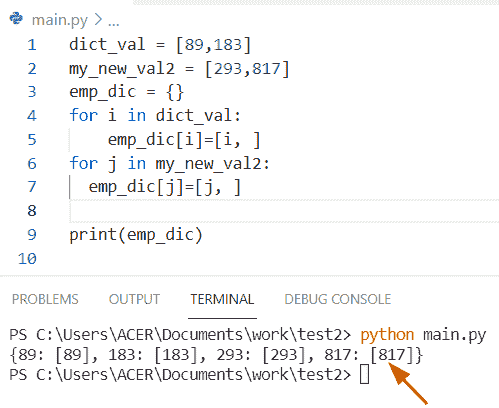

# Python 列表词典–详细指南

> 原文：<https://pythonguides.com/python-dictionary-of-lists/>

[](https://sharepointsky.teachable.com/p/python-and-machine-learning-training-course)

在本 [Python 教程](https://pythonguides.com/learn-python/)中，我们将讨论列表的 **Python 字典` `。**在这里，我们还将介绍以下例子:

*   Python 列表字典追加
*   Python 列表字典获取值
*   Python 列表到数据帧的字典
*   列表到 CSV 的 Python 字典
*   Python 列表字典迭代
*   Python 列表字典到字典列表
*   Json 列表的 Python 字典
*   Python 列表访问字典
*   Python 列表字典示例
*   Python 列表排序字典
*   Python 字典列出了所有键
*   键和值的 Python 字典列表
*   元组的 Python 字典列表
*   具有列表理解功能的 Python 字典
*   带列表追加的 Python 字典
*   带有列表项的 Python 字典
*   列表中的 Python 字典删除重复项
*   两个列表的 Python 字典
*   Python 字典列表更新
*   Python 字典列表索引
*   Python 列表字典获取所有值
*   Python 字典列表值追加
*   Python 字典 vs 列表
*   按值列出 Python 过滤器字典
*   numpy 数组的 Python 字典

目录

[](#)

*   [Python 列表字典](#Python_dictionary_of_lists "Python dictionary of lists")
*   [Python 列表字典追加](#Python_dictionary_of_lists_append "Python dictionary of lists append")
    *   [在字典中追加列表的另一个例子](#Another_example_to_append_lists_in_the_dictionary "Another example to append lists in the dictionary")
*   [Python 列表字典获取值](#Python_dictionary_of_lists_get_value "Python dictionary of lists get value")
    *   [另一个例子是检查如何从 Python 列表字典中获取值](#Another_example_is_to_check_how_to_get_values_from_the_Python_dictionary_of_lists "Another example is to check how to get values from the Python dictionary of lists")
*   [Python 列表到数据帧的字典](#Python_dictionary_of_lists_to_dataframe "Python dictionary of lists to dataframe")
*   [列表到 CSV 的 Python 字典](#Python_dictionary_of_lists_to_CSV "Python dictionary of lists to CSV")
*   [Python 列表字典迭代](#Python_dictionary_of_lists_iterate "Python dictionary of lists iterate")
*   [Python 字典列表到字典列表](#Python_dictionary_of_lists_to_list_of_dictionaries "Python dictionary of lists to list of dictionaries")
*   [Python 列表字典到 JSON](#Python_dictionary_of_lists_to_JSON "Python dictionary of lists to JSON")
*   [Python 列表访问字典](#Python_dictionary_of_lists_access "Python dictionary of lists access")
*   [Python 列表字典示例](#Python_dictionary_of_lists_example "Python dictionary of lists example")
*   [Python 列表排序字典](#Python_dictionary_of_lists_sort "Python dictionary of lists sort")
*   [Python 字典列出所有键](#Python_dictionary_list_all_keys "Python dictionary list all keys")
    *   [检查如何从字典列表中获取所有键的替代方法](#Alternative_way_to_check_how_to_get_all_keys_from_dictionary_list "Alternative way to check how to get all keys from dictionary list")
*   [Python 字典中键和值的列表](#Python_dictionary_list_of_keys_and_value "Python dictionary list of keys and value")
    *   [通过键和值的列表创建字典的另一个例子](#Another_example_to_create_dictionary_by_a_list_of_keys_and_values "Another example to create dictionary by a list of keys and values")
*   [Python 字典元组列表](#Python_dictionary_list_of_tuple "Python dictionary list of tuple")
    *   [检查如何转换元组字典列表的另一种方法](#An_alternative_way_to_check_how_to_convert_a_dictionary_list_of_tuple "An alternative way to check how to convert a dictionary list of tuple")
*   [带列表理解的 Python 字典](#Python_dictionary_with_list_comprehension "Python dictionary with list comprehension")
*   [带列表项的 Python 字典](#Python_dict_with_list_items "Python dict with list items")
*   [列表中的 Python 字典删除重复项](#Python_dict_in_list_remove_duplicate "Python dict in list remove duplicate")
*   [Python 字典中的两个列表](#Python_dictionary_of_two_lists "Python dictionary of two lists")
    *   [从两个列表中创建字典的另一个例子](#Another_example_to_create_a_dictionary_from_two_list "Another example to create a dictionary from two list")
*   [Python 字典列表更新](#Python_dictionary_list_update "Python dictionary list update")
*   [Python 字典列表索引](#Python_dictionary_list_index "Python dictionary list index")
*   [Python 字典列表获取所有值](#Python_dictionary_of_list_get_all_values "Python dictionary of list get all values")
*   [Python 字典列表值追加](#Python_dictionary_list_value_append "Python dictionary list value append")
*   [Python 字典 vs 列表](#Python_dictionary_vs_list "Python dictionary vs list")
*   [Python 按值过滤字典列表](#Python_filter_dictionary_list_by_value "Python filter dictionary list by value")
*   [numpy 数组的 Python 字典](#Python_dictionary_of_numpy_array "Python dictionary of numpy array")

## Python 列表字典

*   在这个节目中，我们将讨论如何创建一个列表字典。
*   在 Python 中，列表字典意味着我们必须以列表的形式赋值。
*   在 Python 字典中，它是一种无序且不可变的数据类型，可以用作 keys 元素。要创建一个列表字典，首先，我们在花括号中插入键值来获取字典的值，然后在方括号中使用键值。

**例子:**

让我们举一个例子，看看如何用 Python 创建一个列表字典

通过使用默认的 `dict()` 方法，我们可以解决这个任务

**语法:**

下面是默认的 `dict()` 方法的语法

```py
defaultdict(default_factory)
```

**源代码:**

```py
from collections import defaultdict

my_new_list = [('Micheal', 18), ('George', 91), ('Oliva', 74)]
new_dictionary = defaultdict(list)

for new_k, new_val in my_new_list:
    new_dictionary[new_k].append(new_val)

print("Dictionary of lists",new_dictionary)
```

写完上面的代码后，一旦你将打印 `"new_dictionary"` 那么结果将显示为 **"{'Micheal':[18]}。**这里，默认的 dict()方法用于迭代元组列表。


Python dictionary of lists

检查如何创建列表字典的另一种方法是使用下标方法

在这个例子中，我们通过应用 subscript 方法在字典中插入了一个列表作为值。在 Python 字典中，下标方法可以添加到现有值中，也可以修改为 Python 字典。

**源代码:**

```py
new_emp_dictionary = {}

new_emp_dictionary["new_ke"] = [64, 91]
new_emp_dictionary["new_ke2"] = ["Germany", "Australia", "China"]

print("Created dictionary of lists:",new_emp_dictionary) 
```

下面是以下给定代码的输出


Python dictionary of lists

阅读: [Python 字典扩展](https://pythonguides.com/python-dictionary-extend/)

## Python 列表字典追加

*   这里我们可以看到如何在字典中追加列表。
*   在这个程序中，我们创建了一个列表，并将新列表追加到值中。在 Python 字典中， `append()` 方法用于在给定的字典中插入元素。

**源代码:**

```py
new_empty_dict = {}

new_empty_dict["Student_id"] = [26, 34]
nw_list = ['Oliva', 'Elijah', 'George']
new_empty_dict["Student_id"].append(nw_list)
print(new_empty_dict)
```

在上面的代码中，我们首先初始化一个名为**“new _ empty _ dictionary”**的空字典，然后通过创建 **dict[key]来添加列表作为值。**然后创建一个新列表，我们必须将这个列表作为子列表添加到**“new _ empty _ dict”中。**一旦您将打印 **'new_empty_dict'** ，那么输出将显示为 **'{"student_id":[26，34]}。**

你可以参考下面的截图


Python dictionary of lists append

### 在字典中追加列表的另一个例子

**源代码:**

```py
country_name = {'France':[65, 28, 89], 'Germany':[16, 32, 81]}

country_name['Germany'].append(665)
print(country_name)
```

在上面的代码中，我们首先初始化一个字典，该字典以键值对的形式存储元素。之后，将关键元素作为一个列表分配，并为其添加值**‘665’。**

下面是以下给定代码的实现


Python dictionary of lists append

阅读: [Python 字符串列表](https://pythonguides.com/python-string-to-list/)

## Python 列表字典获取值

*   让我们看看如何在 Python 列表字典中获取值。
*   为了执行这个任务，我们使用它的键作为一个列表，给我们提供那个元素的值，这是一个列表。

**举例:**

```py
student_info = {'Student_id':[85, 47, 49], 'Student_age':[91, 116, 913]}

print("values from list1:",student_info['Student_id'])
print("values from second list:",student_info['Student_age'])
```

在上面的程序中，我们创建了一个字典并调用了一个 print 语句，以只包含值的列表的形式显示结果。

你可以参考下面的截图


Python dictionary of lists get value

### 另一个例子是检查如何从 Python 列表字典中获取值

通过使用 `dict.values()` 方法，我们可以执行这个特定的任务，这个函数返回一个对象，该对象显示为给定字典中所有值的列表。

**源代码:**

```py
d = {"key1": [9,2,3], "key2": [17,81,76]}

b = list(d.values())
print(b)
```

在这个例子中，我们使用了 `list()` 函数，在这个函数中我们传递了 dict。**价值观()**方法作为论证。一旦你打印出“b”，输出将显示为 **[9，2，3]。**

下面是以下给定代码的执行过程


Python dictionary of lists get value

阅读: [Python 字典副本带示例](https://pythonguides.com/python-dictionary-copy/)

## Python 列表到数据帧的字典

*   在这个程序中，我们将看到如何为数据帧创建一个列表字典。
*   在这个例子中，我们已经通过使用 `dataframe()` 方法将一个列表字典转换为一个 dataframe，其中字典中的键被视为列标题，值被表示为列值。
*   在 Python 中，dataframe 是行和列形式的数据结构，它在 Python pandas 模块中可用。

**举例:**

```py
import pandas as pd

student_info = {'student_name':['Oliva','Potter'],'Student_age':[32,21]}
df2 = pd.DataFrame(student_info)
print(df2)
```

在上面的例子中，你可以看到，首先我们导入了一个 pandas 库，然后创建了一个字典，其中每个键对应于数据帧中的一个列标题。

下面是以下给定代码的输出


Python dictionary of lists to dataframe

阅读: [Python 字典多键](https://pythonguides.com/python-dictionary-multiple-keys/)

## 列表到 CSV 的 Python 字典

*   让我们看看如何创建一个列表字典并将它们转换成 CSV 文件。
*   通过使用 `CSV.dictwriter()` 方法，我们可以将字典列表写入 CSV 文件。在 Python 中，此方法返回将数据转换为字符串的 writer 对象。
*   在 Python 中，如果你想用写权限打开一个文件名，那么你可以在 `open()` 方法中使用**“w”**关键字作为参数。

**源代码:**

```py
import csv
new_dictionary = {"China": [23,45,67], "Egypt": [71,189,672], "Australia": [823,567.910]}
with open("test1.csv", "w") as f:
   new_val = csv.writer(f)
   new_val.writerow(new_dictionary.keys())
   new_val.writerows(zip(*new_dictionary.values()))
```

在上面的代码中，我们应用了**编写器的概念。writerow()** 对于多个行值，这个方法只接受键值，在这个函数中，我们将 zip 函数作为参数传递。

下面是 CSV 文件的截图和输出代码


Python dictionary of lists to CSV

**源代码:**

```py
import csv
new_dictionary = {"China": [23,45,67], "Egypt": [71,189,672], "Australia": [823,567.910]}
with open("test1.csv", "w") as f:
   new_val = csv.writer(f)
   new_val.writerow(new_dictionary.keys())
   new_val.writerows(zip(*new_dictionary.values()))
```

注意:这是创建列表字典的输入代码，结果将以 `CSV` 文件模式显示

你可以参考下面的截图来为 CSV 创建一个列表字典


Python dictionary of lists to CSV

阅读:[从字符串 Python 中删除字符](https://pythonguides.com/remove-character-from-string-python/)

## Python 列表字典迭代

*   这里我们可以看到如何在 Python 字典中迭代值列表。
*   通过使用列表理解方法，我们将迭代字典中的所有条目。在本例中，我们创建了一个字典，其中包含大多数键的值列表，这意味着一些键对应多个值。

**源代码:**

```py
employee_dict = {'Potter' : [72,187,924], 'Chris' : [179,823,349], 'Hemsworth' : [147,723,912]}

new_output = [[z for z in employee_dict[u]] for u in employee_dict.keys()]

print(new_output)
```

在上面的例子中，一旦你打印了 `"new_output"` ，那么结果将显示为一个 **[72，187，924]。**之后，我们通过使用列表理解方法迭代所有的键-值对，每个对将产生一个对列表，其中每个键元素将保持不变，但每个对中的值将发生变化。

下面是以下给定代码的执行过程


Python dictionary of lists iterate

阅读: [Python 在字典中查找最大值](https://pythonguides.com/python-find-max-value-in-a-dictionary/)

## Python 字典列表到字典列表

*   在这个程序中，我们将看到如何将一个列表的字典转换成字典的列表。
*   通过使用列表理解方法，我们可以很容易地以键-值对的形式遍历每个字典元素，并将其与字典列表相关联。

**源代码:**

```py
country_name = { "China" : [843,956], "Turkey" : [554,125], "Spain" : [819,167] }

new_output = [{new_k : new_val[r] for new_k, new_val in country_name.items()}
		for r in range(2)]

print (new_output) 
```

下面是以下给定代码的实现


Python dictionary of lists to list of dictionaries

阅读:[如何创建一个空的 Python 字典](https://pythonguides.com/how-to-create-an-empty-python-dictionary/)

## Python 列表字典到 JSON

*   让我们看看如何将列表字典转换成 JSON。
*   通过使用列表理解方法，我们可以执行这项任务，首先我们导入了一个 JSON 库，然后创建了一个字典。通过使用 `JSON.dumps()` 方法，将另一个变量 detail 声明为包含字典到 `JSON` 中。

**举例:**

```py
import json

new_dictionary = {

     'Colors_name' : ['Orange', 'Blue', 'Yellow'],
     'Fruits_name'  : ['Banana', 'Cherry', 'Apple']

}
z = [{"Colors_name":m, "Fruits_name":n} for m, n in zip(new_dictionary["Colors_name"], new_dictionary["Fruits_name"])]
dict_json = json.dumps(z)
print(dict_json)
```

你可以参考下面的截图


Python dictionary of lists to JSON

阅读: [Python 字典转 CSV](https://pythonguides.com/python-dictionary-to-csv/)

## Python 列表访问字典

*   在这个程序中，我们将看到如何访问列表字典。
*   这里我们可以应用列表理解方法来访问列表字典。

**举例:**

```py
new_dictionary = dict()

new_values = ['829', '452', '158']

for i in new_values:
	for new_element in range(int(i), int(i) + 2):
		new_dictionary.setdefault(new_element, []).append(i)

print(new_dictionary)
```

下面是以下代码的截图


Python dictionary of lists access

## Python 列表字典示例

让我们举一个不同方法的例子，看看如何创建一个列表字典。

**源代码:**

```py
dict_val = [89,183]
my_new_val2 = [293,817]
emp_dic = {}
for i in dict_val:
	emp_dic[i]=[i, ]
for j in my_new_val2:
  emp_dic[j]=[j, ]

print(emp_dic)
```

在上面的代码中，我们首先初始化一个列表**‘dict _ val’，**，然后我们必须创建一个空列表。现在我们使用 for 循环方法来迭代列表中的每个可用值。

**输出:**



Python dictionary of lists example

阅读: [Python 将字典转换为数组](https://pythonguides.com/python-convert-dictionary-to-an-array/)

## Python 列表排序字典

*   让我们看看如何在 Python 中对列表字典进行排序。
*   在 Python 中，通过值或键对字典进行排序，我们可以使用 `sorted()` 函数。使用这个函数，我们可以通过键对字典进行排序，它需要三个参数 iterable、key 和 reverse。
*   假设我们有一个包含我们国家名称元素的 Python 字典。所以现在我们想按照值和键的升序对列表字典进行排序。

**举例:**

```py
Country_dictionary = {'Paris': [67,187,9,41],
			'England': [118,724,90,54],
			'Japan': [165,43,256,87]}

new_output = {new_k : sorted(Country_dictionary[new_k]) for new_k in sorted(Country_dictionary)}
print("Sorted dictionary list:",new_output)
```

在上面的代码中，我们使用了 `sorted()+ loop` 方法的概念。在使用 for 循环时，**【new _ k】**是按照内部键值对结果 iterable 进行排序。

你可以参考下面的截图


Python dictionary of lists sort

阅读: [Python 元组字典](https://pythonguides.com/python-dictionary-of-tuples/)

## Python 字典列出所有键

*   在这个程序中，我们将讨论如何从字典列表中获取所有的键。
*   在 Python 中，字典提供了函数 `keys()` ，帮助用户从字典列表中获取所有的键，并且该方法将总是返回一个 iterable 序列，该序列显示一个包含来自给定字典列表的所有键的列表。

**举例:**

```py
employee_dictionary = {'Adam':[93,21,117], 'Gilchrist': [48,95,643], 'Hayden': [70,61,58]}

print("All keys from dictionary:",employee_dictionary.keys())
```

在上面的代码中，我们首先初始化一个字典，它包含键值对形式的元素。现在，一旦你打印出`" employee _ dictionary . keys()"`，输出将显示为 **['亚当'，'吉尔克里斯特'，'海登']。**

下面是以下给定代码的实现


Python dictionary list all keys

### 检查如何从字典列表中获取所有键的替代方法

通过使用 list comprehension 方法，我们可以遍历给定字典的所有键，然后使用 print 语句逐个显示每个键。

源代码

```py
employee_dictionary = {'Adam':[93,21,117], 'Gilchrist': [48,95,643], 'Hayden': [70,61,58]}

[print("Get all keys from dictionary:",new_k) for new_k in employee_dictionary]
```

下面是以下代码的截图


Python dictionary list all keys

阅读: [Python 从两个列表中创建了一个字典](https://pythonguides.com/python-creates-a-dictionary-from-two-lists/)

## Python 字典中键和值的列表

*   在这里，我们可以看到如何通过键和值的列表来创建字典。
*   从键和值的列表创建字典的最简单的方法是应用 `dict()` 函数，并在函数内部将 `zip()` 方法作为参数。

**源代码:**

```py
new_dict_keys = ['Cherry','Orange','Mangoes','Banana']

new_dict_values = [56,98,67,119]
int_dict = dict(zip(new_dict_values,new_dict_keys))
print("Create dictionary:",int_dict) 
```

下面是以下给定代码的执行过程


Python dictionary list of keys and value

### 通过键和值的列表创建字典的另一个例子

通过使用字典理解方法，我们可以合并两组列表形式的数据。

**源代码:**

```py
Country_name = ['Japan', 'U.S.A', 'China','Istanbul']
new_val = [96,118,438,702]

new_output = {Country_name[m]: new_val[m] for m in range(len(Country_name))}
print(new_output) 
```

这个程序是通过值和键创建字典列表的另一种方法。为此，我们首先初始化一个列表**‘Country _ name’**，该列表包含关键字形式的元素。现在创建一个变量，并将这两个列表指定为字典理解方法。一旦你打印了**‘new _ output’**，它就会显示为 **{'japan:96'}。**

你可以参考下面的截图


Python dictionary list of keys and value

阅读: [Python 字典 pop](https://pythonguides.com/python-dictionary-pop/)

## Python 字典元组列表

*   这里我们可以讨论如何转换元组的字典列表。
*   在 Python 中，字典提供了一个函数，这个函数是 `dict.items()` 方法，这个方法将总是返回一个视图对象，这个对象显示为包含键值元组对的字典列表。

**举例:**

```py
student_name = {"Elijah": 192, "Oliva": 278, "Potter": 589}

new_lis_tup = student_name.items()
new_result = list(new_lis_tup)
print(new_result)
```

在上面的例子中，我们已经通过使用字典**“学生名”**的 `dict.items()` 方法将字典转换为元组列表，并且该方法将总是返回一个键值对列表作为对象。现在使用 list()方法并传递 **'new_lis_tup'** 作为参数并调用 print 语句，它会以列表元组的形式显示结果。

下面是以下给定代码的实现


Python dictionary list of tuple

### 检查如何转换元组字典列表的另一种方法

通过使用 for 循环和 `append()` 方法的组合，我们可以执行这个特定的任务。

**源代码:**

```py
employee_name = {"Chris": 729, "George": 190, "Oliva": 389}

new_element = [] 

for new_k in employee_name: 
   new_element.append((new_k, employee_name[new_k])) 
print("Convert dictionary to list of tuple:",new_element) 
```

在上面的例子中，我们首先创建了一个空列表，然后使用 for 循环方法迭代字典的所有关键元素。在 Python 中，这个方法将每个元素一个接一个地插入到列表中。

下面是以下给定代码的输出


Python dictionary list of tuple

阅读: [Python 循环遍历一个列表](https://pythonguides.com/python-loop-through-a-list/)

## 带列表理解的 Python 字典

*   在 Python 中创建具有列表理解的字典，我们使用了 `zip()` 函数的概念，这个方法提供了一个元组列表。
*   在这个例子中，我们创建了两个列表，分别是键和值，然后使用列表理解方法来帮助生成一个 dictionary 对象。

**源代码:**

```py
Country_key = ['Australia','France','Polland','Japan']
Country_new_val = [56,83,19,89]

new_dictionary = { new_key:new_val for (new_key,new_val) in zip(Country_key, Country_new_val)}
print (new_dictionary) 
```

你可以参考下面的截图


Python dictionary with list comprehension

## 带列表项的 Python 字典

*   这里我们可以看到如何创建一个包含列表项的字典。
*   通过使用 **list()和 dict[key]** 方法，我们可以将列表分配给字典的值。

**源代码:**

```py
init_dict = {}
init_dict["Newzealand"] = [67,29,87]
init_dict["Switzerland"] = [118,490,289]
init_dict["Polland"] = [102,201,801]

print("Created dictionary with list items:",init_dict)
```

在上面的代码中，我们首先要初始化一个空字典，然后使用 **dict[key]=value** 语法这个方法将帮助用户在一个空字典中添加一个列表。现在，一旦你打印出 `"init_dict"` ，它就会以字典的形式显示结果。

下面是以下给定代码的输出


Python dict with list items

## 列表中的 Python 字典删除重复项

*   在本期节目中，我们将讨论如何删除列表中重复的词典。
*   利用列表理解法，我们可以解决这个问题。在本例中，我们创建了一个包含多个具有重复元素的字典的列表。
*   现在，我们必须从列表中删除重复的字典。首先，我们创建一个变量**‘new _ output’**，并分配一个列表理解方法，在该方法中，枚举器函数允许您循环遍历 iterable 对象并将它们转换为一个列表。

**源代码:**

```py
my_new_list = [{"Rose" : 1}, {"Lilly" : 2}, {"Tulip" : 3}, {"Lotus" : 2},{"Rose":1}]

new_output = [m for u, m in enumerate(my_new_list) if m not in my_new_list[u + 2:]]

print ("Remove duplicate from list:",new_output)
```

下面是以下给定代码的执行过程


Python dict in list remove duplicate

阅读: [Python 字典包含](https://pythonguides.com/python-dictionary-contains/)

## Python 字典中的两个列表

*   让我们看看如何用 Python 从两个列表创建一个字典。
*   在这个例子中，我们可以合并两个列表，得到一个新的字典。为了完成这个任务，我们使用了 zip(iterator)方法，在这个函数中，我们传递了两个给定的列表**“new _ list”、“new_val”。**现在我们使用 dict()方法将 **zip(迭代器)**转换成一个字典。

**举例:**

```py
new_list = ["t", "u"]

new_val = [18,56]
m = zip(new_list, new_val)
init_dict = dict(m)
print(init_dict)
```

下面是以下代码的截图


Python dictionary of two lists

### 从两个列表中创建字典的另一个例子

通过使用字典理解方法

**源代码:**

```py
employee_name = ['Arish', 'Elijah', 'Oliva','Hemsworth']
val_lis = [193,692,108,297]

new_result = {employee_name[n]: val_lis[n] for n in range(len(employee_name))}
print("Created dictionary from two lists:",new_result)
```

这个程序是从两个列表中创建字典的另一种方法。为了做到这一点，我们首先初始化一个列表**‘employee _ name’**，它包含了键形式的元素。现在创建一个变量，并将这两个列表指定为字典理解方法。一旦你打印了**‘新输出’**，它就会显示为 **{}。**

你可以参考下面的截图


Python dictionary of two lists

阅读: [Python for 循环索引](https://pythonguides.com/python-for-loop-index/)

## Python 字典列表更新

*   让我们讨论如何用 Python 更新字典列表的值。
*   在这个程序中，我们创建了一个字典列表，然后我们必须通过**索引[0]** 来访问字典。现在我们可以使用 `append()` 函数在给定的列表中插入**‘乔治’**值。
*   如果你想访问第一个字典的属性**‘stu _ name’**，你可以使用**‘new _ student _ list’[0][‘stu _ name’]。**现在，如果你想更新列表的值，你可以使用 `append()` 函数，也可以应用 `pop()` 方法从列表中删除一个元素。

**源代码:**

```py
new_student_list = [
  {'Desgination' : 'Developer', 'stu_name' : ['Chris', 'James']},
  {'Desgination2' : 'Tester', 'stu_name' : ['Hemsworth', 'Potter']}
]
new_student_list[0]
new_student_list[0]['stu_name'].append('George')
new_student_list[0]['stu_name'].pop(2)
print(new_student_list) 
```

下面是以下给定代码的实现


Python dictionary list update

## Python 字典列表索引

*   这里我们可以看到如何创建一个带有列表索引值的字典。
*   为了执行这个任务，我们可以使用 **dict()和 enumerator()** 方法的概念。在 Python 中, `enumerate()` 方法允许用户迭代一个给定的序列，它接受一个 iterable 作为参数。

**源代码:**

```py
fruits_name = ['Oranges', 'Grapes', 'Banana'] #list_name

new_output = dict(enumerate(fruits_name))
print(new_output) 
```

在上面的代码中，首先，我们初始化一个列表**‘fruits _ name’**，它包含字符串形式的元素。现在声明一个变量并使用枚举器函数获取索引，同时我们必须使用 `dict()` 方法将列表转换成字典。

你可以参考下面的截图


Python dictionary list index

阅读: [Python 字典理解](https://pythonguides.com/python-dictionary-comprehension/)

## Python 字典列表获取所有值

*   在这个程序中，我们将讨论如何从字典列表中获取所有值。
*   在 Python 中，字典提供了一个函数 `value()` ，帮助用户从字典列表中获取所有值，这个方法将总是返回一个 iterable 序列，该序列显示一个包含给定字典列表中所有值的列表。

**举例:**

```py
student_information = {'Oliva':[170,439,198], 'Cinderalla': [810,289,534], 'Mathew': [129,309,775]}

print("All values from dictionary:",student_information.values())
```

**说明:**

在上面的代码中，我们首先初始化一个字典，它包含键值对形式的元素。现在，一旦你打印了`" student _ information . values()"`，那么输出将显示为 **([[170，439，198]])。**

下面是以下代码的截图


Python dictionary of the list get all values

阅读: [Python 字典按值查找键](https://pythonguides.com/python-dictionary-find-a-key-by-value/)

## Python 字典列表值追加

*   这里我们可以看到如何通过追加一个列表值来创建一个字典。
*   通过使用 `default.dict()` 方法，我们将初始化一个字典，默认值基于类型参数。

**源代码:**

```py
import collections

my_new_dictionary = collections.defaultdict(list)
my_new_dictionary["127"].append("Potter")
print(my_new_dictionary) 
```

下面是以下给定代码的输出


Python dictionary list value append

## Python 字典 vs 列表

*   Python 字典是一个可变的数据集合，它以唯一的键和值的形式存在，由**花括号**表示，并由**逗号分隔。**值可以是任何数据类型，而键元素必须是不可变的。
*   在 Python 中，通过将所有元素存储在方括号**方括号[]** 中并用**‘逗号’分隔来声明一个列表。**项目可以是整型、浮点型、字符串型等。
*   在 Python 列表中，输入值的顺序保持不变，而在 Python 字典中，不能保证顺序不变。
*   列表中有非常简单和有用的方法，Python 列表在集合数据结构中完成工作，而 dictionary 允许用户通过使用 for 循环方法迭代其键和值。

**举例:**

让我们举个例子，看看列表和字典的区别

**源代码:**

```py
new_dictionary = {1: 'Geeks', 2: 'For', 3: 'Geeks'}

print("New dict contains keys and values:",new_dictionary)
new_list = [3,4,5,9,12] 
print("Generated list contains intger values:",new_list) 
```

这里我们只是简单地创建了一个包含元素的字典和列表。现在，一旦你将打印**“新字典”和“新列表”**，那么输出将显示“ **[3，4，5，9，12]”。**

你可以参考下面的截图


Python dictionary vs list

## Python 按值过滤字典列表

*   这里我们可以看到如何通过值过滤字典列表。
*   在 Python 中， `filter()` 函数将过滤所有元素，并根据给定的标准显示字典中的某些键。

**源代码:**

```py
new_lis_val = [{'a':'z'},{'a':'z'},{'a':'z'}, {'a':'u'}]

selected_list = ['u']
filt_dict = [m for m in new_lis_val if m['a'] in selected_list]
print(filt_dict)
```

在上面的例子中，我们创建了一个字典列表，每个字典都有一个键**‘a’**，它可以有值**‘z’和‘u’。**现在我们创建了一个键值列表‘selected _ list’。现在我们想把这些字典过滤成一个列表。

下面是以下给定代码的输出


Python filter dictionary list by value

阅读: [Python 字典增量值](https://pythonguides.com/python-dictionary-increment-value/)

## numpy 数组的 Python 字典

*   在这个程序中，我们将讨论如何将字典转换成 numpy 数组。
*   为了执行这个特定的任务，我们可以应用方法 **dict.items()。**在 Python 中， `dict.items()` 方法返回一组键值对元素，然后使用 `list(obj)` 我们可以将字典转换成列表。

**举例:**

```py
import numpy as np

nump_dict = {6: 36, 4: 16, 8: 64, 9: 81,
				11: 121, 12: 144, 13: 169}

new_outpt = np.array(list(nump_dict.items()))
print("Converted dictionary to numpy array:",new_outpt)
```

首先在这个例子中，我们创建了一个字典，它包含一个键作为数字，一个值作为它的平方。现在我们已经通过使用 `dict.items()` 方法将一个字典转换为一个 numpy 数组。

下面是以下给定代码的执行过程


Python dictionary of numpy array

另外，检查: [Python 字典键错误](https://pythonguides.com/python-dictionary-key-error/)

在这个 Python 教程中，我们讨论了列表的 **Python 字典` `。**在这里，我们还介绍了以下例子:

*   Python 列表字典追加
*   Python 列表字典获取值
*   Python 列表到数据帧的字典
*   列表到 CSV 的 Python 字典
*   Python 列表字典迭代
*   Python 列表字典到字典列表
*   Json 列表的 Python 字典
*   Python 列表访问字典
*   Python 列表字典示例
*   Python 列表排序字典
*   Python 字典列出了所有键
*   键和值的 Python 字典列表
*   元组的 Python 字典列表
*   具有列表理解功能的 Python 字典
*   带列表追加的 Python 字典
*   带有列表项的 Python 字典
*   列表中的 Python 字典删除重复项
*   两个列表的 Python 字典
*   Python 字典列表更新
*   Python 字典列表索引
*   Python 列表字典获取所有值
*   Python 字典列表值追加
*   Python 字典 vs 列表
*   按值列出 Python 过滤器字典
*   numpy 数组的 Python 字典

[Bijay Kumar](https://pythonguides.com/author/fewlines4biju/)

Python 是美国最流行的语言之一。我从事 Python 工作已经有很长时间了，我在与 Tkinter、Pandas、NumPy、Turtle、Django、Matplotlib、Tensorflow、Scipy、Scikit-Learn 等各种库合作方面拥有专业知识。我有与美国、加拿大、英国、澳大利亚、新西兰等国家的各种客户合作的经验。查看我的个人资料。

[enjoysharepoint.com/](https://enjoysharepoint.com/)[](https://www.facebook.com/fewlines4biju "Facebook")[](https://www.linkedin.com/in/fewlines4biju/ "Linkedin")[](https://twitter.com/fewlines4biju "Twitter")