# Python 集合字典

> 原文：<https://pythonguides.com/python-dictionary-of-sets/>

[](https://sharepointsky.teachable.com/p/python-and-machine-learning-training-course)

在这个 [Python 教程](https://pythonguides.com/learn-python/)中，我们将使用 Python 中的一些例子来研究**如何从集合**创建字典。此外，我们还将涉及这些主题。

*   Python 集合字典
*   Python 列表词典
*   Python 列表字典追加
*   Python 字典键集
*   Python 字典集值
*   Python 字典集默认
*   Python 字典集列表元组
*   两个列表的 Python 字典
*   包含 CSV 列表的 Python 字典
*   Python 字典设置为空
*   Python 反向列表字典
*   要列出的列表 Python 字典
*   要设置的 Python 字典键
*   要设置的 Python 字典值

目录

[](#)

*   [Python 集合字典](#Python_Dictionary_of_sets "Python Dictionary of sets")
*   [Python 列表字典](#Python_dictionary_of_lists "Python dictionary of lists")
*   [Python 列表字典追加](#Python_dictionary_of_lists_append "Python dictionary of lists append")
*   [Python 字典键集](#Python_dictionary_sets_of_Keys "Python dictionary sets of Keys")
*   [Python 字典设定值](#Python_dictionary_set_value "Python dictionary set value")
*   [Python 字典设置默认值](#Python_dictionary_setdefault "Python dictionary setdefault")
*   [Python 字典设置列表元组](#Python_dictionary_set_list_tuple "Python dictionary set list tuple")
*   [Python 字典中的两个列表](#Python_dictionary_of_two_lists "Python dictionary of two lists")
*   [带 CSV 列表的 Python 字典](#Python_dictionary_with_list_to_CSV "Python dictionary with list to CSV")
*   [Python 字典置空](#Python_dictionary_set_empty "Python dictionary set empty")
*   [Python 逆向列表字典](#Python_reverse_dictionary_of_lists "Python reverse dictionary of lists")
*   [Python 字典中的 list to list](#Python_dictionary_of_lists_to_list "Python dictionary of lists to list")
*   [Python 字典键设置](#Python_dictionary_keys_to_set "Python dictionary keys to set")
*   [要设置的 Python 字典值](#Python_dictionary_values_to_set "Python dictionary values to set")

## Python 集合字典

*   在这一节中，我们将讨论如何用 Python 从集合中创建字典。
*   为了执行这个特定的任务，我们将导入 `defaultdict()` 模块，然后我们将把列表中的键变量赋值为一个字典形式的值。
*   在 Python 中， `defaultdict()` 类似于一个字典，但是它被声明为一个函数，并且不接受任何参数，也永远不会引发错误。

**语法:**

下面是 `defaultdict()` 方法的语法。

```py
defaultdict(defaultfactory)
```

**举例:**

让我们举一个例子，看看如何用 Python 从两个集合创建一个字典。

**源代码:**

```py
from collections import defaultdict

new_dict = defaultdict(set)
new_dict["Employees_id"] |= {56, 23, 98, 134, 945}
new_dict["Employee_age"] |= {34, 45, 37, 29, 31}
print("Creation of dictionary from two sets:",new_dict)
```

下面是以下给定代码的执行。

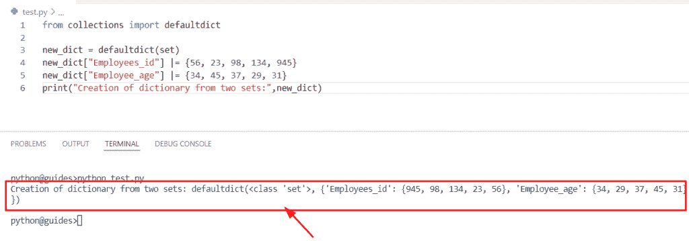

Python Dictionary of sets

另外，检查: [Python 字典多值](https://pythonguides.com/python-dictionary-multiple-values/)

## Python 列表字典

*   在这个程序中，我们将讨论如何用 Python 从列表中创建一个字典。
*   为了完成这个任务，我们将使用 `subscript()` 方法在字典中插入一个列表作为值。

**举例:**

```py
empty_dict = {}

empty_dict["Country_name"] = ['USA', 'France']
empty_dict["Student_name"] = ['George', "James", "William"]

print("Created dictionary of lists:",empty_dict)
```

下面是以下给定代码的执行。

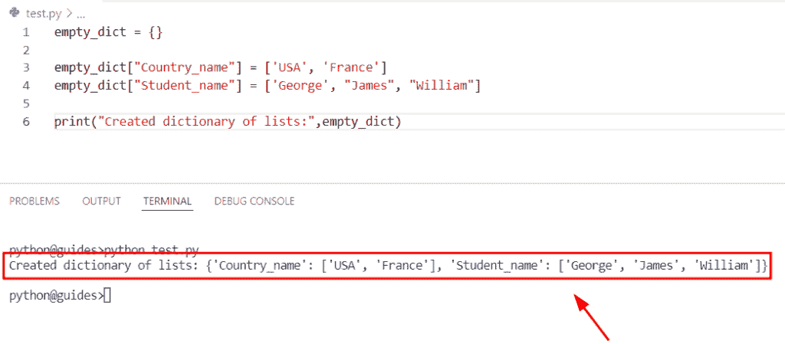

Python dictionary of lists

阅读: [Python 字典键错误](https://pythonguides.com/python-dictionary-key-error/)

## Python 列表字典追加

我们已经在 [Python 列表字典](https://pythonguides.com/python-dictionary-of-lists/)中介绍了这个主题。你可以在上面的链接中参考我们的详细文章。

## Python 字典键集

*   在这一节中，我们将讨论如何从 Python 中的键集创建字典。
*   要完成这项任务，首先我们将创建一个列表，并将国家名称指定为一个关键元素，然后我们将使用 `dict.fromkeys()` 方法，它将返回关键字以及 none 值。

**举例:**

```py
Set_of_keys = ['Germany', 'France', 'Spain']

result = dict.fromkeys(Set_of_keys, None)
print(result) 
```

下面是以下代码的截图

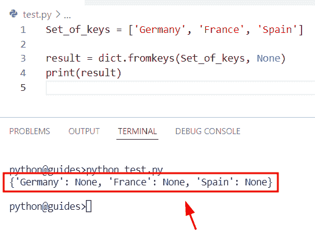

Python dictionary sets of Keys

阅读: [Python 字典重复键](https://pythonguides.com/python-dictionary-duplicate-keys/)

## Python 字典设定值

*   在这个程序中，我们将讨论如何通过在 Python 中设置值来创建字典。
*   为了完成这个任务，我们将使用下标方法，这个方法将帮助用户从一组值中创建一个字典。

**举例:**

```py
new_dict = {}

new_dict["USA"] = [16, 28, 39]
new_dict["United Kingdom"] = [56, 98, 113]
new_dict["France"] = [32, 87, 44]
new_dict["Germany"] =[14,56,92]
print("Created dictionary from set values:",new_dict)
```

在上面的代码中，我们首先创建了一个空字典，用于在其中插入值，然后我们声明了一个特定的键和一组值。一旦执行了这段代码，输出将显示新的字典，其中包含了以**键值**对形式的元素。

下面是以下给定代码的实现。

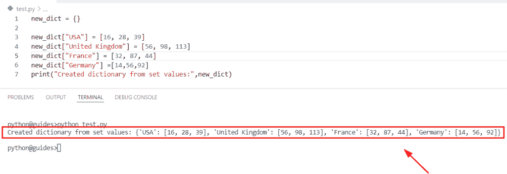

Python dictionary set value

阅读:[获取字典 Python 中的第一个键](https://pythonguides.com/get-first-key-in-dictionary-python/)

## Python 字典设置默认值

*   在本节中，我们将讨论如何在 Python 字典中使用 setdefault 方法。
*   在 Python 中， `setdefault()` 方法返回与指定键相关联的键值。它将检查字典中是否有该关键字，然后返回值，否则，如果字典中没有该关键字，并且没有给定默认值，则返回 none 值。
*   这个方法有两个参数:键和默认值，这个函数类似于 `get()` 函数。

**语法:**

下面是 Python 中 `setdefault()` 函数的语法。

```py
setdefault
          (
           key
           [,
           default
           ]
          )
```

*   它只包含两个主要参数
    *   **key:** 该参数表示我们要搜索的键。
    *   **默认值:**该参数在密钥不可用时使用，然后它将返回值。

> **注意:**这个方法总是返回字典中可用的**键值**元素。

**举例:**

我们举个例子，检查一下**如何使用 Python 字典**中的 setdefault 方法。

**源代码:**

```py
Country_name={'France':456,'China':145,'USA':678,'United Kingdom':345}

result=Country_name.setdefault('China') #key is available
print(result)
# if the key is not available
not_key=Country_name.setdefault('Japan')
print(not_key)
```

下面是以下给定代码的实现。

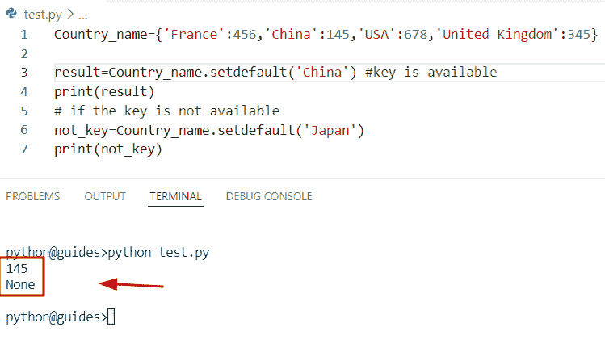

Python dictionary setdefault

阅读: [Python 字典增量值](https://pythonguides.com/python-dictionary-increment-value/)

## Python 字典设置列表元组

*   这里我们将讨论如何用 Python 从元组列表中创建字典。
*   为了执行这个特定的任务，首先，我们将创建一个元组列表，然后我们将使用 `dict()` 方法，这个方法将容易地将给定的元组列表转换成字典。
*   在 Python 中， `dict()` 是一个构造函数，它将帮助用户从任何对象创建字典，如**元组、列表**等。

**举例:**

让我们举一个例子，检查一下**如何用 Python** 从元组列表中创建一个字典。

**源代码:**

```py
lis_of_tup = [('George', 156), ('William', 678), ('Oliva', 789), ('Elijah', 954), ('James', 222),('John',765)]

new_output = dict(lis_of_tup)
print("Conversion of list of tuples into dictionary:",new_output)
```

下面是下面给出的代码的截图。

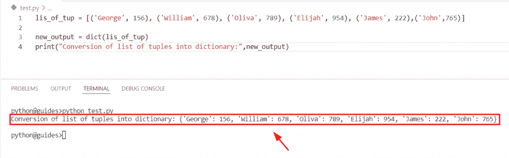

Python dictionary set list tuple

阅读: [Python 字典副本带示例](https://pythonguides.com/python-dictionary-copy/)

## Python 字典中的两个列表

*   在这一节中，我们将讨论如何用 Python 从两个列表中创建一个字典。
*   为了完成这个任务，我们将使用 `dict()` 和 `zip()` 方法，这个方法将帮助用户把给定的两个列表转换成字典。
*   在 Python 中， `zip()` 函数连接两个可迭代对象，对象可以是列表或元组。该方法将一个或多个可迭代对象作为参数，并总是基于给定对象返回元组的迭代器。

**语法:**

让我们看一下语法并理解 Python `zip()` 函数的工作原理。

```py
zip(*iterable)
```

**举例:**

让我们举个例子，检查一下**如何用 Python** 从两个列表中创建一个字典。

**源代码:**

```py
lis1=['USA','Australia','Germany','UnitedKingdom']
lis2=[12,34,56,78]

new_result=dict(zip(lis1,lis2))
print("Conversion of two lists into dictionary:",new_result)
```

下面是以下给定代码的实现。

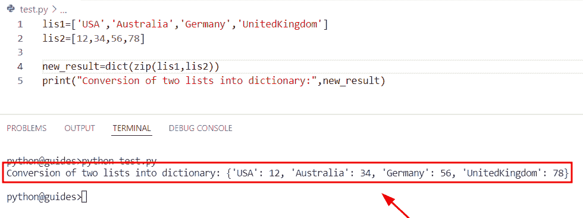

Python dictionary of two lists

阅读: [Python 字典多键](https://pythonguides.com/python-dictionary-multiple-keys/)

## 带 CSV 列表的 Python 字典

*   在这个例子中，我们将讨论如何用 Python 将带有列表的字典转换成 `CSV` 。
*   为了完成这项任务，首先，我们将创建一个字典，它包含键值对形式的元素，并且值可以存储在一个列表中。
*   在这个例子中，我们将使用 `CSV` 模块并将字典加载到一个 `CSV` 文件中。为此，我们将使用 `open()` 方法。

**举例:**

```py
import csv
my_dict = {"USA": [56,89,174], "France": [145,278,344], "China": [13,29,34]}
with open("final.csv", 'w') as outfile:
   dict_csv = csv.writer(outfile)
   dict_csv.writerow(my_dict.keys())
   dict_csv.writerows(zip(*my_dict.values()))
```

下面是 CSV 文件的屏幕截图，其中的键和值是相关联的。

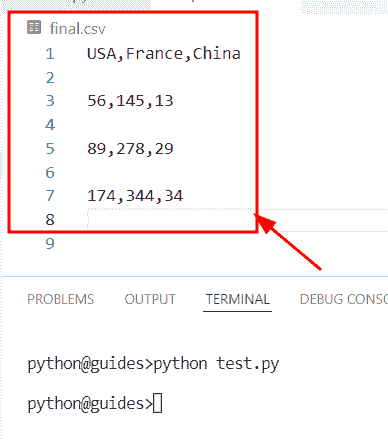

Python dictionary with list to CSV

阅读:[如何创建一个空的 Python 字典](https://pythonguides.com/how-to-create-an-empty-python-dictionary/)

## Python 字典置空

*   在本节中，我们将讨论如何在 Python 字典中创建空集。
*   为了完成这项任务，首先，我们将使用花括号**来初始化一个空字典，一旦执行了这段代码，输出将显示空字典和数据类型。**
*   接下来，我们将使用 set 关键字和 open **括号()**创建一个空集。一旦执行了这段代码，输出将显示设置的数据类型。

**举例:**

```py
new_var = {}
print("Initialize dictionary:",type(new_var))

new_var = set()
print("Initialize empty set:",type(new_var))
```

下面是以下代码的截图

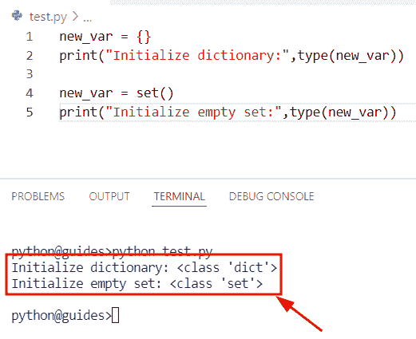

Python dictionary set empty

阅读: [Python 字典转 CSV](https://pythonguides.com/python-dictionary-to-csv/)

## Python 逆向列表字典

*   在这个程序中，我们将讨论如何在 Python 中反转列表的字典。
*   为了执行这个特定的任务，我们将使用字典理解方法，其中我们将使用 `dict.items()` 方法。

**举例:**

```py
new_dict={4:[12,45,89],5:[167,67,897]}

result={new_val: new_k for new_k, values in new_dict.items() for new_val in values}
print(result)
```

下面是以下给定代码的执行过程

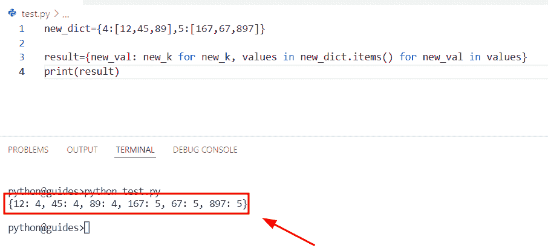

Python reverse dictionary of lists

正如您在屏幕截图中看到的，输出显示了列表值的反序。

阅读: [Python 将字典转换为数组](https://pythonguides.com/python-convert-dictionary-to-an-array/)

## Python 字典中的 list to list

*   在这一节中，我们将讨论如何将列表字典转换成 Python 列表。
*   为了执行这个特定的任务，首先我们将创建一个名为**‘my _ dictionary’**的字典，它包含以**键值**对形式的元素，这些值将被视为列表，然后我们将使用字典理解方法。

**举例:**

```py
my_dictionary = {'Apple' : [23,45,68], 'Oranges' : [17,29,34], 'Mangoes' : [145, 987]}

new_output = [[new_k] + new_value for new_k, new_value in my_dictionary.items()]
print(new_output)
```

你可以参考下面的截图。

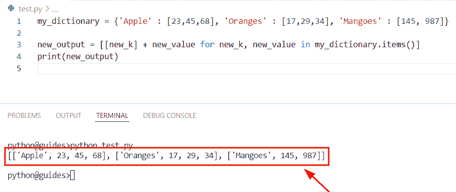

Python dictionary of lists to list

阅读: [Python 元组字典](https://pythonguides.com/python-dictionary-of-tuples/)

## Python 字典键设置

*   在这一节中，我们将讨论如何从字典中提取键并将它们存储到 Python 集合中。
*   首先，我们将初始化两个字典，然后通过使用 **union |** 方法，我们可以轻松地从字典中提取关键元素，并将它们存储到一个列表中。

**举例:**

```py
new_dict1 = {'John': 16, 'Petter': 26, 'Hemsworth': 89}
new_dict2 = {'Chris': 89, 'Petter': 26, 'James': 78}
new_result = new_dict1.keys() | new_dict2.keys()
#Extract keys and store in set
print(new_result)
print(type(new_result))
```

一旦执行了这段代码，输出将以集合的形式显示关键元素，以及我们提到的结果的数据类型。

下面是以下给定代码的实现。

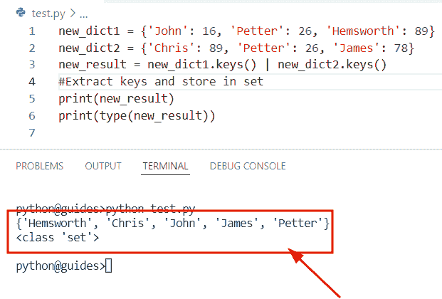

Python dictionary keys to set

阅读: [Python 从两个列表中创建了一个字典](https://pythonguides.com/python-creates-a-dictionary-from-two-lists/)

## 要设置的 Python 字典值

*   在这里，我们将讨论如何从字典中提取值并将它们存储到 Python 集合中。
*   在这个程序中，我们创建了一个包含元素的字典，然后我们将使用字典理解方法和 `dict.items()` 方法。
*   提取关键元素后，我们将迭代这些值，并将它们存储到列表中。

**举例:**

```py
my_dict = {'USA': 67, 'Germany': 89, 'Australia': 178}

new_result={y:x for x,y in my_dict.items()}.keys()

s = set()
for i in new_result:
    s.add(i)
print(s)
print(type(s)) 
```

下面是以下给定代码的输出。

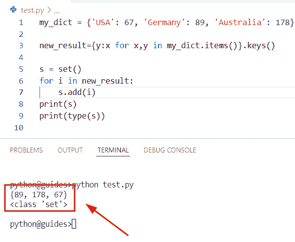

Python dictionary values to set

您可能也喜欢阅读以下 Python 教程。

*   [Python 字典包含+个例子](https://pythonguides.com/python-dictionary-contains/)
*   [Python 字典理解](https://pythonguides.com/python-dictionary-comprehension/)
*   [Python 将字典转换为列表](https://pythonguides.com/python-convert-dictionary-to-list/)

在这篇 python 教程中，我们使用 Python 中的一些例子学习了如何从集合创建字典。此外，我们还讨论了这些主题。

*   Python 集合字典
*   Python 列表词典
*   Python 列表字典追加
*   Python 字典键集
*   Python 字典集值
*   Python 字典集默认
*   Python 字典集列表元组
*   两个列表的 Python 字典
*   包含 CSV 列表的 Python 字典
*   Python 字典设置为空
*   Python 反向列表字典
*   要列出的列表 Python 字典
*   要设置的 Python 字典键
*   要设置的 Python 字典值

[Bijay Kumar](https://pythonguides.com/author/fewlines4biju/)

Python 是美国最流行的语言之一。我从事 Python 工作已经有很长时间了，我在与 Tkinter、Pandas、NumPy、Turtle、Django、Matplotlib、Tensorflow、Scipy、Scikit-Learn 等各种库合作方面拥有专业知识。我有与美国、加拿大、英国、澳大利亚、新西兰等国家的各种客户合作的经验。查看我的个人资料。

[enjoysharepoint.com/](https://enjoysharepoint.com/)[](https://www.facebook.com/fewlines4biju "Facebook")[](https://www.linkedin.com/in/fewlines4biju/ "Linkedin")[](https://twitter.com/fewlines4biju "Twitter")