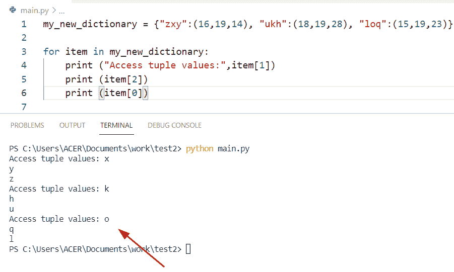

# Python 字典元组列表

> 原文：<https://pythonguides.com/python-dictionary-of-tuples/>

[](https://sharepointsky.teachable.com/p/python-and-machine-learning-training-course)

在本 [Python 教程](https://pythonguides.com/python-and-machine-learning-training-course/)中，我们将讨论 **Python 字典中的元组列表。**下面我们还将介绍以下示例:

*   Python 字典元组列表
*   Python 字典元组作为键
*   Python 字典 vs 元组
*   Python 字典元组值
*   Python 创建元组字典
*   Python 元组排序字典
*   命名元组的 Python 字典
*   Python 解包元组字典
*   如何在字典 python 中添加元组作为键
*   Python 迭代字典元组
*   带元组键的 Python 迭代字典
*   字典中的 Python 访问元组
*   Python 字典追加元组
*   Python 字典到元组数组

目录

[](#)

*   [Python 元组字典](#Python_dictionary_of_tuples "Python dictionary of tuples")
*   [Python 字典元组列表](#Python_dictionary_list_of_tuples "Python dictionary list of tuples")
*   [Python 字典元组为关键字](#Python_dictionary_tuples_as_key "Python dictionary tuples as key")
*   [Python 字典 vs 元组](#Python_dictionary_vs_tuples "Python dictionary vs tuples")
*   [Python 字典元组值](#Python_dictionary_tuple_values "Python dictionary tuple values")
*   [Python 创建元组字典](#Python_create_dict_of_tuples "Python create dict of tuples")
*   [Python 元组排序字典](#Python_sort_dictionary_of_tuples "Python sort dictionary of tuples")
*   [命名元组的 Python 字典](#Python_dictionary_of_named_tuples "Python dictionary of named tuples")
*   [Python 解包元组字典](#Python_unpack_dictionary_of_tuples "Python unpack dictionary of tuples")
*   [Python 迭代字典元组](#Python_iterate_dictionary_tuple "Python iterate dictionary tuple")
*   [Python 用元组键迭代字典](#Python_iterate_dictionary_with_tuple_key "Python iterate dictionary with tuple key")
*   [Python 访问字典中的元组](#Python_access_tuple_in_dictionary "Python access tuple in dictionary")
*   [Python 字典追加元组](#Python_dictionary_append_tuple "Python dictionary append tuple")
*   [Python 字典到元组数组](#Python_dict_to_tuple_array "Python dict to tuple array")

## Python 元组字典

*   在 Python 中要从字典中获取所有元组，我们可以使用列表理解方法。
*   为了从 iterable 中创建一个列表，我们可以使用 list comprehension 方法，并终止每个元素以及 for 循环来迭代每个值。

**举例:**

让我们举一个例子，看看如何从字典中获取元组形式的键和值。

```py
my_new_dic = { 'England': 435, 'France': 12, 'Egypt': 31 }

new_tup = [(key, value) for key, value in my_new_dic.items()]
print(new_tup)
```

在上面的代码中，我们首先创建了一个字典，并为它们分配了键值对元素。现在声明一个变量，使用一行代码，这是 list comprehension 方法，它被转换成一个元组列表。

下面是以下代码的截图


Python dictionary of tuples

**检查如何从字典中获取元组的替代示例**。

在这个例子中，我们将使用一个 `dict()` 函数从元组中获取一个字典。该方法返回一个 iterable 对象，并将其转换为字典形式。

**源代码:**

```py
def Convert(new_tu, my_dict):
    my_dict = dict(new_tu)
    return my_dict

new_val = [("k", 167), ("z", 179), ("u", 179), 
    ("m", 267), ("a", 445), ("l", 134)]
new_dict = {}
print (Convert(new_val, new_dict))
```

下面是以下给定代码的执行过程


Python dictionary of tuples using dict

## Python 字典元组列表

*   这里我们可以看到如何将元组列表转换成 Python 字典。
*   在这个例子中，首先我们将初始化一个包含元组的列表，并使用 `dict()` 方法将元组列表转换成字典并打印结果。它将以包含键值对的字典的形式显示输出。
*   在 Python **中，dict()** 方法将一个元组列表作为参数，每个元组存储一个键值对元素，并返回到一个字典中。

**源代码:**

```py
new_tup = [('g',19), ('n', 21), ('l', 17), ('q', 39), ('d', 55)]

new_res = dict(new_tup)
print(new_res)
```

下面是以下给定代码的输出


Python dictionary list of tuples

阅读: [Python 字典 pop](https://pythonguides.com/python-dictionary-pop/)

## Python 字典元组为关键字

*   让我们看看如何从 Python 字典中获取一个元组作为键。
*   为了执行这个特定的任务，我们可以使用 list comprehension 方法来迭代每个字典元素，并获得字典中可用的元组键。
*   从字典中访问元组元素，并将它们包含在一个列表中。我们必须初始化一个字典，并将元组键和值作为参数传递。现在，为了从字典中获取所有的元组键，我们必须使用 Python list comprehension 方法。

**举例:**

```py
to_dictionary = {(19, 25) : 'rose', (65, 47, 91) : 'lily', (57, 199) : 'Jasmine'}

new_output = [element for new_key in to_dictionary for element in new_key]
print("tuple key elements of dictionary are:",new_output) 
```

下面是以下代码的截图


Python dictionary tuples as key

阅读: [Python 从两个列表中创建了一个字典](https://pythonguides.com/python-creates-a-dictionary-from-two-lists/)

## Python 字典 vs 元组

*   字典和元组之间的主要区别是:
*   在 Python 中，元组用逗号表示并包含在括号中，而字典用大括号表示。
*   在 Python 元组的情况下，它们是不可变的，这意味着您不能更改现有的元素。
*   在 Python 字典中，它是一个无序的数据集合，包含键值对形式的元素，而元组是一个有序的数据集合，包含简单的字符或整数，用逗号表示。
*   在 Python 中， `reverse()` 方法不能用在元组中，因为它们是不可变的。我们可以使用索引和切片方法。在字典的例子中，我们不能改变或反转给定的元素，因为字典中的条目是以键-值对的形式出现的。

**源代码:**

```py
my_new_lis = [('o',67), ('m', 149), ('b', 190), ('c', 123), ('e', 55)]

new_res = dict(my_new_lis)
print(new_res) # dictionary example

new_tup = [4,9,12,'m']
print(tuple(new_tup)) # tuple example
```

在这个例子中，我们已经初始化了一个列表，并且包含了元组形式的元素。现在我想把这个列表转换成一个字典，为此我将创建一个变量并使用 `dict()` 方法把这个列表转换成一个字典。之后，我将创建一个新的列表，并使用一个 print 语句，在该语句中，我将传递关键字**‘元组’**作为参数，并显示结果。

下面是以下给定代码的执行过程


Python dictionary vs tuples

阅读: [Python 字典包含](https://pythonguides.com/python-dictionary-contains/)

## Python 字典元组值

*   让我们看看如何从字典中获取一个元组作为值。
*   为了解决这个问题，我们可以使用列表理解方法来迭代每个字典元素，并获得存在于字典中的元组的值。

**源代码:**

```py
you_dict = {(112, 189) : 'c', (192,981,278) : 'f', (176,156) : 'l'}

new_output = [element for new_value in you_dict for element in new_value]
print("tuple values elements of dictionary are:",new_output)
```

下面是以下给定代码的实现


Python dictionary tuple values

阅读: [Python 元组排序列表](https://pythonguides.com/python-sort-list-of-tuples/)

## Python 创建元组字典

*   这里我们可以看到如何通过访问元组来创建字典。
*   为了完成这个任务，我们将使用 `dict()` 方法来帮助用户将元组转换成字典。该方法将一组元组作为参数，并将它们返回到字典形式。

**举例:**

```py
new_value = ((18, "m"), (169, "v"), (779, "x"), (189, "b"))

new_dict = dict((j, k) for k, j in new_value)
print("created dictionary",new_dict)
```

在上面的代码中，我们要使用 `dict()` 方法，并传递字典理解方法作为参数来声明一个字典。正如您在屏幕截图中看到的，输出获得了键值对元素。

下面是以下给定代码的输出


Python create dict of tuples

阅读: [Python 串联元组](https://pythonguides.com/python-concatenate-tuples/)

## Python 元组排序字典

*   在 Python 中按元组对字典进行排序，我们可以使用 **dict()、sorted()和 lambda()** 函数的组合。在这个例子中 `dict()` 方法被用来重新排列元素并按顺序重新分配字典。
*   `Sort()` 方法将帮助用户对给定元组的元素进行升序或降序排序，lambda 函数用于根据给定值计算乘积。

**源代码:**

```py
new_my_dict = {(34, 38) : 17, (13, 98) : 45, (43, 45): 19, (5, 10): 2}

new_out = dict(sorted(new_my_dict.items(), key = lambda element: element[0][1] * element[0][0]))
print("Sort dict by tuples:",new_out) 
```

下面是以下代码的截图


Python sort dictionary of tuples

阅读: [Python 循环遍历一个列表](https://pythonguides.com/python-loop-through-a-list/)

## 命名元组的 Python 字典

*   在 Python 中 `namedtuple()` 是集合模块类别下的内置函数。为了创建具有特定字段的元组子类，我们可以使用 `namedtuple()` 方法。
*   该方法可以访问给定命名元组中的值和键。要在 Python 中创建命名元组，我们必须导入一个集合模块。

**举例:**

```py
import collections

employee = collections.namedtuple('emp_info',['emp_name','emp_age','emp_id'])
new_dict = { 'emp_name' : "Hayden", 'emp_age' : 26 , 'emp_id' : '1678' }
print ("nametuple from dict",employee(**new_dict))
```

首先在这个例子中，我们将初始化一个字典并在其中包含元素。现在使用 `**` 操作符从给定的字典中返回 namedtuple()。

下面是以下给定代码的执行过程


Python dictionary of named tuples

阅读: [Python 将字典转换为列表](https://pythonguides.com/python-convert-dictionary-to-list/)

## Python 解包元组字典

在 Python 中要解包一个字典并转换成一个元组，我们可以使用 `tuple()` 方法。解包意味着将一个字典实现为一个函数调用。

**源代码:**

```py
my_dictionary = {'George' : 17, 'John' : 19, 'Micheal' : 13}

new_val = tuple(my_dictionary)
print(new_val)
```

下面是以下代码的截图


Python unpack dictionary of tuples

检查如何将字典元素解包为元组的另一个示例

通过使用 **'='** 操作符和多个变量，我们可以很容易地解决这个问题。在本例中，我们向给定的字典声明逗号分隔的变量，并将它们存储在“count_dict”变量中。

**举例:**

```py
count_dict = {'Afghanistan' : 19, 'colombia' : 14, 'srilanka' : 36}

z, l, m = count_dict
new_val_key = z, l, m
print(new_val_key)
```

下面是以下给定代码的输出


Python unpack dictionary of tuples method

这就是如何将字典键解包到一个元组中。

阅读: [Python 字典删除](https://pythonguides.com/python-dictionary-remove/)

## Python 迭代字典元组

在这一节中，我们可以看到如何在 Python 中迭代字典。在这个例子中，键是一个元组，值是整数。现在我们将使用 dict()方法，它接受元组列表上的 for 循环实例。

**源代码:**

```py
new_tup = dict({
  ('m', 'n'): 18,
  ('y', 'z'): 28
})

for new_key, new_val in new_tup.items():
   print("iterate dictionary:",new_key,  " - ", new_val) 
```

下面是以下给定代码的实现


Python iterate dictionary tuple

阅读: [Python 字典长度](https://pythonguides.com/python-dictionary-length/)

## Python 用元组键迭代字典

*   在 Python 中，要使用元组键遍历字典，我们可以很容易地使用 for 循环方法来访问字典中可用的每个元素。
*   在这个例子中，为了迭代元组键，我们可以应用 append 方法并传递参数**‘you _ dict**’。现在，它将迭代这个变量名为**‘new _ val’的元组列表。**

**源代码:**

```py
i, j, k = "i", "j", "k"
you_dict = {(17, i): 237, (17, k): 789, (19, j): 851}
new_val = list()

num = 0 
for i in you_dict:
    new_val.append(list(i[1])) 
    new_val[num].append(you_dict[i]) 
    num += 1
new_val = dict(new_val) 
print("iterate tuple keys",new_val)
```

下面是以下给定代码的输出


Python iterate dictionary with tuple key

阅读: [Python 字典初始化](https://pythonguides.com/python-dictionary-initialize/)

## Python 访问字典中的元组

*   让我们看看如何在 Python 字典中访问元组。
*   这里我想访问字典中的元组值。要完成这项任务，首先我必须用一个惟一键和一个包含三个值的元组初始化一个字典。现在我想迭代每个键，为此我们可以使用 dict()方法中的 item，这个函数不带任何参数。它总是返回所有字典元素的列表。

**源代码:**

```py
my_new_dictionary = {"zxy":(16,19,14), "ukh":(18,19,28), "loq":(15,19,23)}

for item in my_new_dictionary:
    print ("Access tuple values:",item[1])
    print (item[2])
    print (item[0]) 
```

下面是以下给定代码的执行过程



Python access tuple in the dictionary

阅读: [Python 字典索引](https://pythonguides.com/python-dictionary-index/)

## Python 字典追加元组

*   让我们看看如何在 Python 字典中将存储多个值的元组添加到单个键中。
*   在本例中，您只需将您的键映射到一个列表，并将元组添加到该列表中。为了执行这个特定的任务，我们将创建一个字典并分配一个键值元素，但是在本例中，值代表列表。现在声明一个变量，并使用 append 函数在字典中添加一个元组。

**举例:**

```py
student_dict = {'johnson': [(67,89,24)]}

b = student_dict['johnson'].append((123,173,992))
print("append tuple in dictionary",student_dict)
```

下面是以下代码的截图


Python dictionary append a tuple

阅读: [Python 字典排序](https://pythonguides.com/python-dictionary-sort/)

## Python 字典到元组数组

*   让我们看看如何将 Python 字典转换成元组数组。
*   在这个例子中，首先我们将创建一个字典，并为它们分配键值对。现在声明一个变量' `new_arr` ，并将 `new_key` 和 `new_val` 变量作为元组参数传递。要将字典转换成元组数组，可以使用列表理解方法。

**源代码:**

```py
my_new_dict = { 'i': 189, 'o': 149, 'z': 216 }

new_arr = [(new_key, new_val) for new_key, new_val in my_new_dict.items()]
print("Dictionary to tuple array",new_arr)
```

下面是以下代码的截图


Python dict to tuple array

您可能还想阅读以下文章:

*   [Python 将字典转换成数组](https://pythonguides.com/python-convert-dictionary-to-an-array/)
*   [Python 字典复制](https://pythonguides.com/python-dictionary-copy/)
*   [Python 集合字典](https://pythonguides.com/python-dictionary-of-sets/)
*   [Python 字典键错误](https://pythonguides.com/python-dictionary-key-error/)
*   [Python 列表字典](https://pythonguides.com/python-dictionary-of-lists/)

在本 Python 教程中，我们讨论了元组的 **Python 字典。**在这里，我们还介绍了以下示例:

*   Python 字典元组列表
*   Python 字典元组作为键
*   Python 字典 vs 元组
*   Python 字典元组值
*   Python 创建元组字典
*   Python 元组排序字典
*   命名元组的 Python 字典
*   Python 解包元组字典
*   如何在字典 python 中添加元组作为键
*   Python 迭代字典元组
*   带元组键的 Python 迭代字典
*   字典中的 Python 访问元组
*   Python 字典追加元组
*   Python 字典到元组数组

[Bijay Kumar](https://pythonguides.com/author/fewlines4biju/)

Python 是美国最流行的语言之一。我从事 Python 工作已经有很长时间了，我在与 Tkinter、Pandas、NumPy、Turtle、Django、Matplotlib、Tensorflow、Scipy、Scikit-Learn 等各种库合作方面拥有专业知识。我有与美国、加拿大、英国、澳大利亚、新西兰等国家的各种客户合作的经验。查看我的个人资料。

[enjoysharepoint.com/](https://enjoysharepoint.com/)[](https://www.facebook.com/fewlines4biju "Facebook")[](https://www.linkedin.com/in/fewlines4biju/ "Linkedin")[](https://twitter.com/fewlines4biju "Twitter")