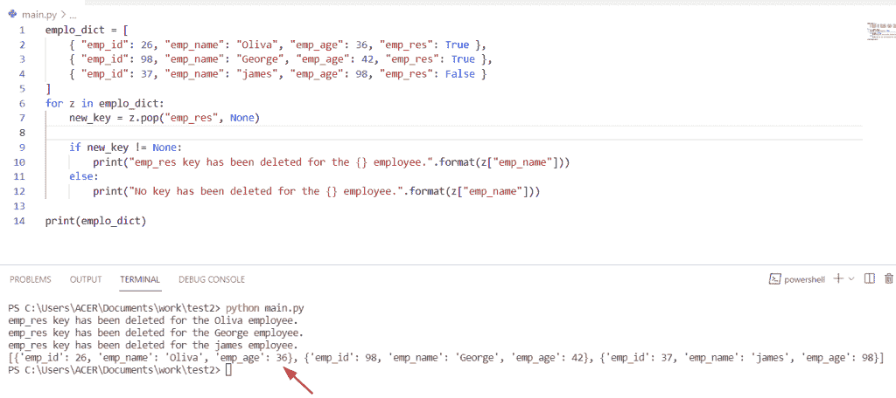
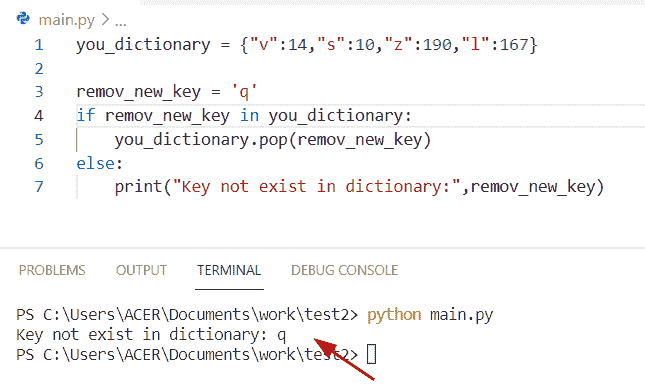

# Python 字典 pop

> 原文：<https://pythonguides.com/python-dictionary-pop/>

[](https://sharepointsky.teachable.com/p/python-and-machine-learning-training-course)

在本 [Python 教程](https://pythonguides.com/python-hello-world-program/)中，我们将讨论 **Python 字典 pop。**这里我们还将涵盖下面的例子:

*   Python 字典弹出方法
*   Python 字典流行示例
*   Python 字典 pop vs del
*   Python 字典弹出多个键
*   Python 字典 pop vs popitem
*   Python 字典 pop 键和值
*   Python 字典 pop(如果存在)
*   Python 字典流行项目
*   Python 字典弹出最后一个元素
*   Python 字典在迭代期间弹出
*   列表中的 Python 流行词典

目录

[](#)

*   [Python 字典流行](#Python_dictionary_pop "Python dictionary pop")
*   [Python 字典弹出方法](#Python_dictionary_pop_method "Python dictionary pop method")
*   [Python 字典 pop vs del](#Python_dictionary_pop_vs_del "Python dictionary pop vs del")
*   [Pop()方法示例](#Pop_method_example "Pop() method example")
*   [Python 字典弹出多个键](#Python_dictionary_pop_multiple_keys "Python dictionary pop multiple keys")
    *   [如何移除 Python 字典中多个键的替代示例](#Alternative_example_of_how_to_remove_multiple_keys_in_Python_dictionary "Alternative example of how to remove multiple keys in Python dictionary ")
*   [Python 字典 pop vs popitem](#Python_dictionary_pop_vs_popitem "Python dictionary pop vs popitem")
*   [Pop()方法示例](#Pop_method_example-2 "Pop() method example")
*   [Python 字典 pop 键和值](#Python_dictionary_pop_key_and_value "Python dictionary pop key and value")
*   [Python 字典弹出如果存在](#Python_dictionary_pop_if_exists "Python dictionary pop if exists")
*   [Python 字典弹出项](#Python_dictionary_pop_item "Python dictionary pop item")
*   [Python 字典弹出最后一个元素](#Python_dictionary_pop_last_element "Python dictionary pop last element")
*   [Python 字典在迭代期间弹出](#Python_dictionary_pop_during_iteration "Python dictionary pop during iteration")
*   [列表中的 Python 流行词典](#Python_pop_dictionary_from_list "Python pop dictionary from list")

## Python 字典流行

*   在 Python 中要从字典中删除一个元素，我们可以应用 `pop()` 方法。这个方法检查条件，如果一个键或值不包含在字典中，那么它返回一个键错误，否则如果字典中有一个键，它将删除一个项并返回它的值。
*   `pop()` 方法是 Python 中的内置函数，它从字典中删除指定的键或值。

**语法:**

下面是字典 `pop()` 方法的语法

```py
dict.pop(key,default)
```

*   该方法由几个参数组成:
    *   **Key:**Key 参数用于从字典中删除。
    *   **Default:** 如果字典中没有这个键，那么它将返回默认值。

**Return:**pop()方法返回

*   如果存在一个键，从字典中取出元素
*   如果在参数中没有指定默认值，那么它将引发一个键错误

**源代码:**

让我们举一个例子，看看如何使用 `pop()` 方法从字典中删除一个元素

```py
my_dict = {'george':92,'john':14,'Micheal':25}

rem_key = my_dict.pop('john')
print("remove key",rem_key)
print(my_dict)
```

下面是以下代码的截图


python dictionary pop

阅读: [Python 字典包含](https://pythonguides.com/python-dictionary-contains/)

## Python 字典弹出方法

dictionary `pop()` 方法帮助用户从字典中删除关键元素并返回其值。

让我们举一个例子，检查字典中是否没有某个键

```py
new_dictionary = {'China':234,'Africa':145,'Australia':178}

new_key = new_dictionary.pop('Germany')
print(new_key)
```

在上面的代码中，我们已经初始化了一个字典，并将元素以**键值**对的形式放置。在本例中，我们将检查字典中是否没有某个键。为了解决这个问题，我们可以使用 `pop()` 方法来检查条件。如您所见， `pop()` 方法将一个键作为参数传递，但是字典中没有**‘德国**’键，这引发了一个键错误。

下面是以下给定代码的执行过程


Python dictionary pop method

阅读: [Python 字典理解](https://pythonguides.com/python-dictionary-comprehension/)

## Python 字典 pop vs del

`pop()` 和 `del()` 的主要区别在于

*   在 Python 中**‘del’**是关键字， `pop()` 是方法。在 `del()` 的情况下，它不返回任何值，而在 pop()方法的情况下，如果我们想从字典中删除一个键，可以使用 `pop()` ，它将返回值。
*   在 pop()方法中，如果你没有提到 pop()方法参数中的最后一个参数，那么它将返回一个键错误。而在 del()的情况下，如果一个键不在字典中，那么它将返回一个键错误。
*   在 Python 中使用索引从列表中删除对象，我们可以很容易地使用' del '关键字和 pop()方法。
*   这两种方法的主要区别在于,' del '关键字不返回任何内容，而 pop()方法返回从字典中删除的元素。

**语法:**

下面是' del '关键字的语法

```py
del dict["key"]
```

**举例:**

让我们举一个例子，检查如何在字典中使用 del 关键字

```py
my_dict = {'Python':79,'java':26,'Sql':17}

del my_dict['java']
print(my_dict) 
```

这里我们将创建一个程序，使用 del 关键字从字典中删除一个键。在这个例子中，我们必须从字典中删除一个**‘Java’**键。为了完成这项任务，我们将使用 del 关键字。

下面是以下给定代码的执行过程


python del keyword

阅读: [Python 字典按值查找键](https://pythonguides.com/python-dictionary-find-a-key-by-value/)

## Pop()方法示例

**源代码:**

```py
emplo_dict = [
	{ "emp_id": 26, "emp_name": "Oliva", "emp_age": 36, "emp_res": True },
	{ "emp_id": 98, "emp_name": "George", "emp_age": 42, "emp_res": True },
	{ "emp_id": 37, "emp_name": "james", "emp_age": 98, "emp_res": False }
]
for z in emplo_dict:
	new_key = z.pop("emp_res", None)

	if new_key != None:
		print("emp_res key has been deleted for the {} employee.".format(z["emp_name"]))
	else:
		print("No key has been deleted for the {} employee.".format(z["emp_name"]))

print(emplo_dict)
```

在上面的代码中，我们创建了一个包含三个字典的列表。每个字典存储四个键和值对。在本例中，我们想使用 pop()方法从字典中删除**‘EMP RES**’键。现在我们将使用 Python 中的**‘if 语句’**检查**“EMP _ RES”**键是否已经从字典中删除。让我们看看 new_key 是否有一个非 none 的值，这意味着我们的键被删除了。

下面是以下给定代码的执行过程



python pop example

阅读: [Python 将字典转换为列表](https://pythonguides.com/python-convert-dictionary-to-list/)

## Python 字典弹出多个键

*   在 Python 中要从字典中删除多个键，我们可以很容易地应用 pop()和 list comprehension 方法。
*   在这个例子中，我们只是使用 pop()方法从字典中删除一个元素。

**举例:**

让我们举一个例子，看看如何使用 pop()方法删除字典中的多个键

```py
my_dictionary = {'Cyprus' : 1, 'Cuba' : 2, 'Africa' : 3, 'England' : 4, 'china' : 5}

mul_keys = ['Cuba', 'Africa', 'china']
[my_dictionary.pop(key) for key in mul_keys]
print(" Dictionary after Remove multiple keys : ",my_dictionary)
```

在上面的代码中，我们创建了一个字典并包含键值对元素。现在初始化一个列表，存储我们想要从字典中删除的元素。然后使用 list comprehension 方法迭代列表项并打印结果。

下面是以下代码的截图


Python dictionary pop multiple keys

阅读: [Python 字典删除](https://pythonguides.com/python-dictionary-remove/)

### 如何移除 Python 字典中多个键的替代示例

这里可以看到 pop()和 for 循环方法的结合方法。这个方法帮助用户迭代变量的每个键。在这个例子中，元素从给定的键列表中删除。

```py
new_dictionary = {'Egypt': 67, 'Estonia': 13, 'Geogria': 87, 'Hungary': 98};
rem_ele = ('Egypt', 'Estonia', 'Hungary');
for i in rem_ele:
    new_dictionary.pop(i);
print("Available dictionary after remove keys",new_dictionary);
```

下面是以下给定代码的输出


remove multiple keys using pop in python

阅读: [Python While 循环条件](https://pythonguides.com/python-while-loop-condition/)

## Python 字典 pop vs popitem

*   在 Python 中，这两种方法用于从字典中删除元素。 `pop()` 方法以键值对的形式删除元素，而如果我们想使用 `popitem()` 方法从字典中删除最后一个键值对元素。
*   在 python 中，3.7 版本从字典中删除了特定的最后一个键值对元素，并以元组的形式显示结果。
*   `pop()` 和 `popitem()` 的主要区别在于，pop()元素可以删除带有特定键的元素，而在 popitem()的情况下，我们将从字典中删除最后输入的元素。
*   在 `popitem()` 方法中，如果我们想要删除一个项目，但是字典是空的，那么它将产生一个错误，而在 pop()方法中，如果字典中没有这个键，它将显示一个键错误。

**语法:**

下面是 popitem()方法的语法

```py
dictionary.popitem()
```

**注意:**它不接受任何参数

**pop item()示例的源代码**

```py
new_dict = {'Mathew':56, 'Hayden':78, 'oliva': 27, 'gilchrist': 189}

output = new_dict.popitem()
print('Remove key = ', output)
print('New original dictionary: ', new_dict)
```

下面是以下给定代码的实现


Python dictionary pop vs popitem

阅读: [Python 字典长度](https://pythonguides.com/python-dictionary-length/)

## Pop()方法示例

**源代码:**

```py
you_dict = {
  'student_id': 78,
  'stu_post': 'Python developer'
}

rem_key = you_dict.pop('stu_post', None)
print(rem_key)
print("Dictionary after remove key",you_dict) 
```

在上面的代码中，我们必须在一个 `dictionary.pop()` 方法中使用两个参数。在本例中，我们将检查字典中是否存在该键，如果不存在，将删除该元素，否则将显示 None。

下面是以下给定代码的输出


python dict pop vs popitem method

## Python 字典 pop 键和值

*   在 Python 中要从字典中移除键和值对，我们可以应用 `pop()` 方法。
*   为了解决这个问题，我们首先创建一个字典，并为它们分配键值对元素。现在使用 `pop()` 方法从字典中删除一个特定的键值对。

**语法:**

下面是 `pop()` 方法的语法

```py
dict.pop(key[, default])
```

**源代码:**

```py
my_new_dict = {"b":18,"c":10,"u":19,"r":67}

delete_key = my_new_dict.pop("c")
print("Original dictionary",my_new_dict)
print("Remove key-value pair",delete_key)
```

**执行:**


Python dictionary pop key and value

阅读: [Python 字典索引](https://pythonguides.com/python-dictionary-index/)

## Python 字典弹出如果存在

*   让我们看看如何检查一个键是否包含在 Python 字典中。
*   如果指定的键在字典中不可用，并且在 `pop()` 方法参数中没有默认值，那么它将引发一个键错误。
*   让我们举一个例子，检查如何通过使用 `pop()` 方法删除字典中不存在的元素，我们还将检查如果我们没有在 `pop()` 方法参数中传递默认值，将会发生什么。

**源代码:**

```py
you_dictionary = {"v":14,"s":10,"z":190,"l":167}

remov_new_key = 'q'
if remov_new_key in you_dictionary:
    you_dictionary.pop(remov_new_key)
else:
    print("Key not exist in dictionary:",remov_new_key)
```

下面是以下给定代码的输出



Python dictionary pop if exists

阅读: [Python 字典初始化](https://pythonguides.com/python-dictionary-initialize/)

## Python 字典弹出项

在 Python 字典中， `popitem()` 方法删除一个元素，并将其返回为元组对形式。在 `popitem()` 方法中，它总是以后进先出的顺序返回，这意味着 i t 从字典中删除特定的最后一个键值对元素。

**举例:**

让我们举个例子，看看如何使用 `popitem()` 方法从 Python 字典中删除一个元素

```py
stdent_dict = {'George': 46, 'John':345, 'Micheal': 169, 'Potter': 543}  

b = stdent_dict.popitem()  
print("Delete last pair",b)  
print("New dictionary",stdent_dict) 
```

下面是以下给定代码的实现


Python dictionary pop item

阅读: [Python 字典过滤器](https://pythonguides.com/python-dictionary-filter/)

## Python 字典弹出最后一个元素

*   要从 python 字典中删除最后一个元素，我们可以很容易地使用 `pop()` 方法。

**源代码:**

```py
my_dictionary = {'e':189,'h':192,'f':223}

rem_las = my_dictionary.pop('f')
print("remove last element",rem_las)
print(my_dictionary) 
```

在上面的代码中，我们初始化了一个字典，并以键值对的形式放置元素。在这个例子中，我们将检查如何从字典中删除最后一个元素。为了解决这个问题，我们将声明一个变量**‘rem _ las’**并分配一个 pop 方法，在该方法中我们传递一个关键元素参数**‘f’。**现在，它将检查字典中是否存在该关键字。它将显示从字典中删除最后一个元素的结果。

下面是以下代码的截图


Python dictionary pop last element

阅读: [Python 字典排序](https://pythonguides.com/python-dictionary-sort/)

## Python 字典在迭代期间弹出

*   使用 pop()方法迭代 python 字典并删除项目。

**举例:**

```py
to_dict = {"j":14,"n":16,"l":12,"z":15}
for new_key in dict(to_dict):
    if to_dict[new_key] % 2 == 0:
        to_dict.pop(new_key)
print(to_dict)
```

在这个例子中，你可以看到我们已经迭代了所有的键-值对，如果值是偶数，它将从字典中删除，而在奇数元素中，它将显示在输出中。

下面是以下代码的截图


Python dictionary pop during iteration

阅读: [Python 字典值列表](https://pythonguides.com/python-dictionary-values-to-list/)

## 列表中的 Python 流行词典

*   在 Python 中要从字典列表中删除元素，我们可以应用 del 和 loop 方法。
*   在这个例子中，它将比较条件，如果键值在字典中可用，它将删除整个字典对。

**源代码:**

```py
student_list = [{"student_id" :56, "address" : "England"},
             {"student_id" : 78, "address" : "Germany"},
             {"student_id" :923, "address" : "France"}]

for m in range(len(student_list)):
    if student_list[m]['student_id'] == 923:
        del student_list[m]
        break
print ("List after remove: ",student_list)
```


Python pop dictionary from the list

您可能也喜欢阅读以下文章:

*   [Python 从两个列表中创建一个字典](https://pythonguides.com/python-creates-a-dictionary-from-two-lists/)
*   [Python 元组字典](https://pythonguides.com/python-dictionary-of-tuples/)
*   [从字典中获取所有值 Python](https://pythonguides.com/get-all-values-from-a-dictionary-python/)

在本 Python 教程中，我们将讨论 **Python 字典 pop。**在这里，我们还将介绍以下示例:

*   Python 字典弹出方法
*   Python 字典流行示例
*   Python 字典 pop vs del
*   Python 字典弹出多个键
*   Python 字典 pop vs popitem
*   Python 字典 pop 键和值
*   Python 字典 pop(如果存在)
*   Python 字典流行项目
*   Python 字典弹出最后一个元素
*   Python 字典在迭代期间弹出
*   列表中的 Python 流行词典

[Bijay Kumar](https://pythonguides.com/author/fewlines4biju/)

Python 是美国最流行的语言之一。我从事 Python 工作已经有很长时间了，我在与 Tkinter、Pandas、NumPy、Turtle、Django、Matplotlib、Tensorflow、Scipy、Scikit-Learn 等各种库合作方面拥有专业知识。我有与美国、加拿大、英国、澳大利亚、新西兰等国家的各种客户合作的经验。查看我的个人资料。

[enjoysharepoint.com/](https://enjoysharepoint.com/)[](https://www.facebook.com/fewlines4biju "Facebook")[](https://www.linkedin.com/in/fewlines4biju/ "Linkedin")[](https://twitter.com/fewlines4biju "Twitter")