# 如何在 Python 中从字典中移除键

> 原文：<https://pythonguides.com/python-dictionary-remove/>

[](https://sharepointsky.teachable.com/p/python-and-machine-learning-training-course)

在本 [Python 教程](https://pythonguides.com/python-download-and-installation/)中，我们将讨论 **Python 字典移除。**我们还将检查，如何用 Python 从字典中删除键？在这里，我们还将介绍以下示例:

*   Python 字典移除键
*   Python 字典移除重复的键
*   Python 字典移除元素
*   Python 字典移除最后一个键
*   Python 字典移除键值对
*   Python 字典移除空值
*   Python 字典基于值移除键
*   Python 字典不移除任何值
*   Python 字典移除重复值
*   Python 字典移除值

目录

[](#)

*   [Python 字典删除](#Python_dictionary_remove "Python dictionary remove")
*   [Python 字典移除键](#Python_dictionary_remove_key "Python dictionary remove key ")
*   [通过使用 del 关键字从字典中删除一个键](#By_using_del_keyword_to_remove_a_key_from_dictionary "By using del keyword to remove a key from dictionary")
*   [利用字典理解和 item()方法](#By_using_dict_comprehension_and_item_method "By using dict comprehension and item() method")
*   [Python 字典删除重复键](#Python_dictionary_remove_dupliacte_keys "Python dictionary remove dupliacte keys")
*   [Python 字典删除元素](#Python_dictionary_remove_element "Python dictionary remove element")
*   [Python 字典删除最后一个键](#Python_dictionary_remove_last_key "Python dictionary remove last key")
*   [Python 字典移除键值对](#Python_dictionary_remove_key-value_pair "Python dictionary remove key-value pair")
*   [Python 字典删除空值](#Python_dictionary_remove_empty_values "Python dictionary remove empty values")
*   [Python 字典基于值](#Python_dictionary_remove_key_based_on_value "Python dictionary remove key based on value")移除键
*   [Python 字典删除无值](#Python_dictionary_remove_none_values "Python dictionary remove none values")
*   [Python 字典删除重复值](#Python_dictionary_remove_duplicate_values "Python dictionary remove duplicate values")
*   [Python 字典删除值](#Python_dictionary_remove_value "Python dictionary remove value")

## Python 字典删除

*   让我们看看如何在 Python 中**移除字典。**
*   在 Python 中，clear()方法用于删除字典 Python。
*   该方法删除字典中所有可用的键值对，并总是返回一个 none 值或空字典。

**语法:**

下面是 `clear()` 方法的语法

```py
dict.clear()
```

**举例:**

让我们举一个例子，看看如何在 Python 中删除字典

```py
my_dict = {'john':3,'George':6,'Smith':9,'Brown':6}
b = dict.clear(my_dict)
print("Remove dictionary:",b)
```

下面是以下给定代码的示例

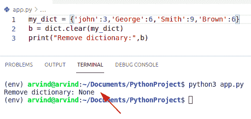

Python dictionary remove

阅读: [Python 字典长度](https://pythonguides.com/python-dictionary-length/)

## Python 字典移除键

*   这里我们可以看到如何用 Python 从字典中删除一个键。
*   要在字典中删除一个键，有多种方法可以完成这项任务。
*   从字典中删除键的方法如下
    *   通过使用 pop()方法
    *   通过使用 del 关键字
    *   通过使用字典理解和 item()方法

**例子:**

让我们举一个例子，看看如何使用 pop()方法从字典中删除一个键。

在 Python 中，pop()方法可用于从字典中移除键和值。此方法可用于从特定索引值中移除一项。pop()方法只接受一个参数，即我们想要从字典中删除的键的名称。

**代码:**

```py
my_dict = {'Australia':250,'Germany':650,'Japan':900,'England':500}
rem_key = my_dict.pop('Germany')

print("Remove Key from dictionary:",rem_key)
print(my_dict)
```

下面是以下代码的截图

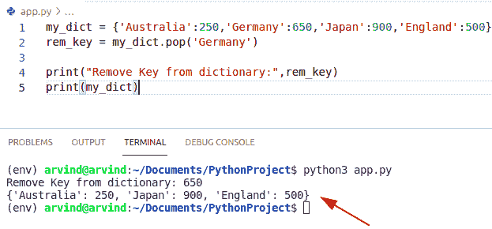

Python dictionary remove key

阅读: [Python 字典索引](https://pythonguides.com/python-dictionary-index/)

## 通过使用 del 关键字从字典中删除一个键

*   在 python 中，del 关键字可用于删除字典中可用的对象或项目。
*   如果字典中没有键，此方法将引发键错误。

**代码:**

```py
my_dict = {'U.S.A':450,'China':320,'Japan':680,'Polland':500}
del my_dict['Japan']

print("Remove a key from dictionary:",my_dict)
```

下面是以下给定代码的执行过程

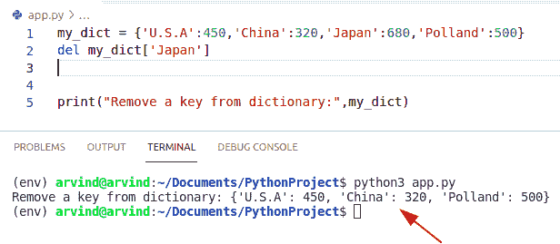

Python dictionary remove the key from del

阅读: [Python 字典初始化](https://pythonguides.com/python-dictionary-initialize/)

## 利用字典理解和 item()方法

*   在 Python 中，items()和 dict comprehension 也可以帮助用户从字典中删除一个键。
*   items()方法不带参数，总是返回一个要存储在列表中的条目。
*   Dict comprehension 主要用于通过包含所有键值对来创建字典。

让我们举一个例子，检查如何使用 dict comprehension 和 items()方法从字典中删除一个键

```py
to_dict = {"Mangoes" : 40, "Grapes" :29, "Oranges" : 39, "Apple" : 49}

new_key = {key:val for key, val in to_dict.items() if key != 'Grapes'}

print ("Remove after key is :",(new_key))
```

下面是以下代码的截图

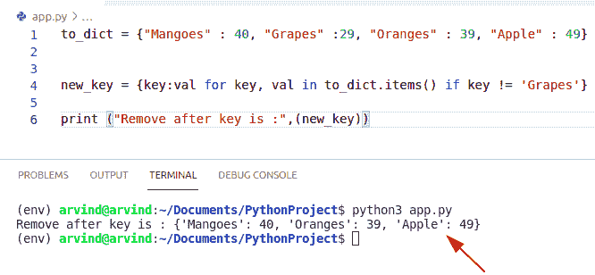

Python dictionary remove the key from dict comprehension

## Python 字典删除重复键

*   这里我们可以看到如何用 Python 从字典中删除重复的键。
*   通过使用 loop 和 items()方法，我们可以很容易地从字典中删除重复的条目。
*   首先在这个例子中，我们将初始化一个字典并使用循环删除字典中的重复键，这个方法将从我们的字典中删除任何重复的值。

**举例:**

让我们举一个例子，看看如何从字典中删除重复的键

```py
my_dictionary = { 'John' : 20, 'George' : 45, 'james' : 10, 'George' : 60, 'potter' : 70}

new_key = []
output = dict()
for new_k, new_val in my_dictionary.items():
    if new_val not in new_key:
        new_key.append(new_val)
        output[new_k] = new_val

print("Remove duplicate key is:",output)
```

下面是以下代码的截图

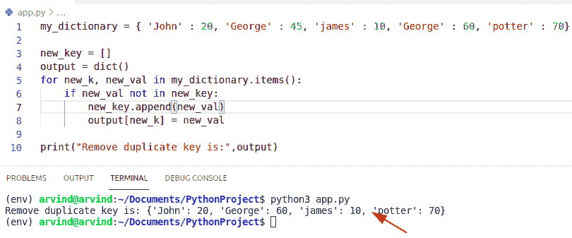

Python dictionary remove duplicate keys

这是如何在 Python 中从字典中删除重复的键。

又念: [Python 字典过滤器](https://pythonguides.com/python-dictionary-filter/)

## Python 字典删除元素

*   让我们看看如何从字典中去掉一个柠檬。
*   通过使用 dict.keys 方法和 del 关键字，我们可以很容易地从字典中删除一个元素。
*   dict.keys()方法总是返回一个显示字典中键的列表的项目。现在创建一个 for 循环来迭代字典中的条目。
*   在这个例子中，创建一个变量“selected_key ”,并给它们分配一个我们必须从字典中删除的 key 元素。使用 del 关键字并检查索引值，然后调用 break 语句。

**举例:**

让我们举一个例子，看看如何从字典中删除一个元素

```py
my_dict = {"Italian": 9, "Chinese" : 12, "Mexican": 7}

select_key = "Chinese"
new_key ="Italian"
for n_key in my_dict.keys():
  if n_key == select_key:
    del my_dict[n_key]
    break
for n_key in my_dict.keys():
  if n_key == new_key:
    del my_dict[n_key]
    break
print("Remove element from dictionary",my_dict)
```

下面是以下代码的截图

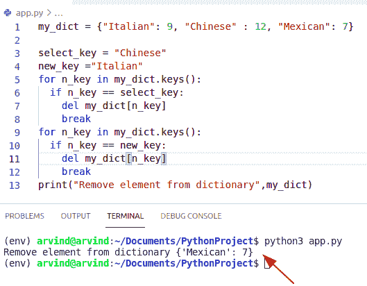

Python dictionary remove element

这是如何在 Python 中从字典中移除元素。

检查如何从字典中删除元素的另一个例子

在这个例子中，我们可以很容易地使用 pop()方法从字典中删除一个元素。首先，我们将创建一个员工列表并存储两个字典。每本词典包含三个关键字。现在我们必须使用 `pop()` 方法从字典中删除一个元素。

**举例:**

```py
employee_info = { "emp_id": 234, "emp_name": "Adam", "emp_address": "England" }

new_key = employee_info.pop("emp_address")
print(new_key)
print("Remove element from dictionary",employee_info)
```

下面是以下代码的截图

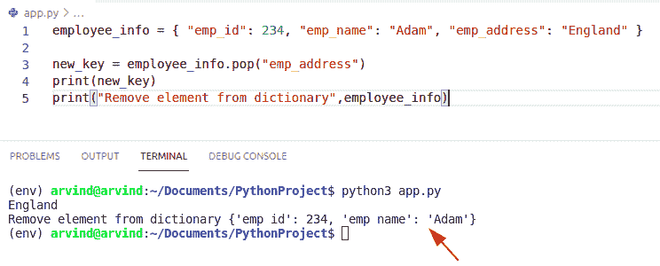

Python dictionary remove element pop

阅读: [Python 字典值列表](https://pythonguides.com/python-dictionary-values-to-list/)

## Python 字典删除最后一个键

*   让我们看看如何用 Python 删除字典中的最后一个键。
*   在这个例子中我们可以很容易地使用 items()和 for 循环方法从字典中删除最后一个键。

**举例:**

让我们举一个例子，看看如何从字典中删除最后一个键

```py
my_dict = {"Steve": 234,"Mark": 134,"Robert": 278,"Chris": 43}
remove_key = 'Chris' # last key
to_dictionary = {}
for new_key, new_value in my_dict.items():
    if new_key is not remove_key:
        to_dictionary[new_key] = new_value
my_dict = to_dictionary
print(" Remove last key from dictionary:",my_dict)
```

下面是以下代码的截图

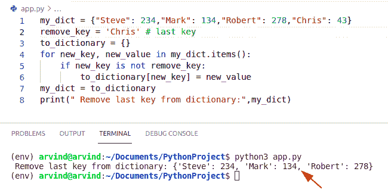

Python dictionary remove the last key

检查如何从字典中删除最后一个键的另一个例子

*   在这个例子中，我们可以很容易地使用 pop.item()方法从字典中删除最后一个键。

**举例:**

```py
new_dictionary = {"Andrew": 120,"Hayden": 140,"Mathew": 210,"Gilchrisht": 174}
rem_key = new_dictionary.popitem()

print("remove last key:",rem_key) # remove last key
print(new_dictionary)
```

下面是以下代码的截图

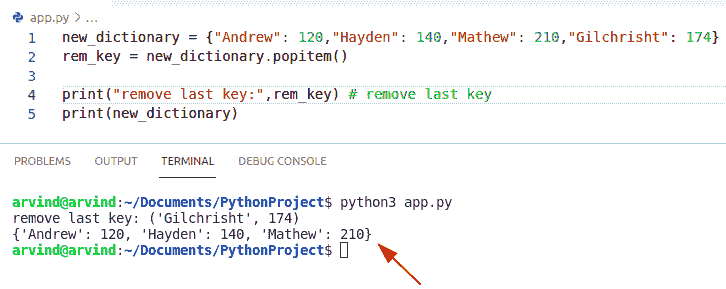

Python dictionary remove the last key

阅读: [Python 字典更新](https://pythonguides.com/python-dictionary-update/)

## Python 字典移除键值对

*   这里我们可以看到如何从 Python 字典中移除键值对。
*   通过使用 del 关键字，我们可以从字典中删除键值对。

**举例:**

让我们举一个例子，看看如何从字典中删除键值对

```py
my_dict = {"a": 120,"b": 30,"c": 150,"d": 143}
del my_dict["b"]

print("remove key-value pair:",my_dict)
```

下面是以下代码的截图

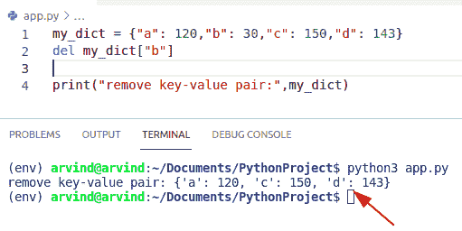

Python dictionary remove key-value pair

检查如何从字典中删除键值对的另一个例子

*   通过使用 popitem()方法，我们可以很容易地从字典中删除键值对。
*   在 python 中，popitem()方法不带任何参数。此方法用于从字典中移除随机元素，并始终返回其值。

**语法:**

下面是 popitem()方法的语法

```py
dict.popitem()
```

**举例:**

```py
my_dict = {"m": 60,"n": 40,"o": 10,"p": 14}
new_item = my_dict.popitem()

print("remove key-value pair:",new_item)
print(my_dict)
```

下面是以下代码的截图

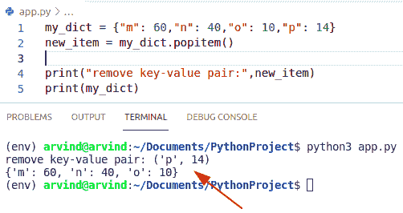

Python dictionary remove key-value pair

这就是如何在 Python 中从字典中删除键值对。

阅读: [Python 串联词典](https://pythonguides.com/python-concatenate-dictionary/)

## Python 字典删除空值

*   让我们看看如何用 Python 从字典中删除空值。
*   通过使用列表理解方法，我们可以很容易地完成这项任务。

**举例:**

```py
to_dict = [{"u": 10,"v": 50,"p": '',"z":''}]
output = [element for element in ({new_key: new_val for new_key, new_val in sub.items() if new_val} for sub in to_dict) if element]

print("Remove empty values: ",output)
```

首先在上面的例子中，我们将初始化一个列表，并通过使用列表理解删除空值。

下面是以下代码的截图

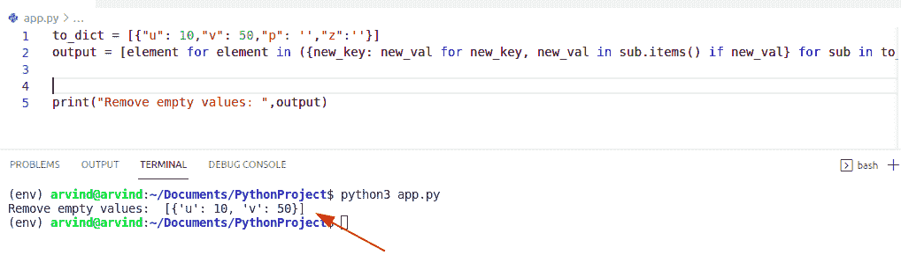

Python dictionary remove empty values

## Python 字典基于值移除键

*   在这里，我们可以看到如何从 Python 字典中删除基于键的值。
*   通过使用字典理解和 items()方法，我们可以很容易地删除基于值的键。

**举例:**

```py
my_dict = {"u" : 12, "d" :16, "e" : 19, "f" : 15}

rem_key = {n_key:n_val for n_key, n_val in my_dict.items() if n_val != 19} # selected value

print ("Remove after key based on value is :",(rem_key))
```

下面是以下代码的截图

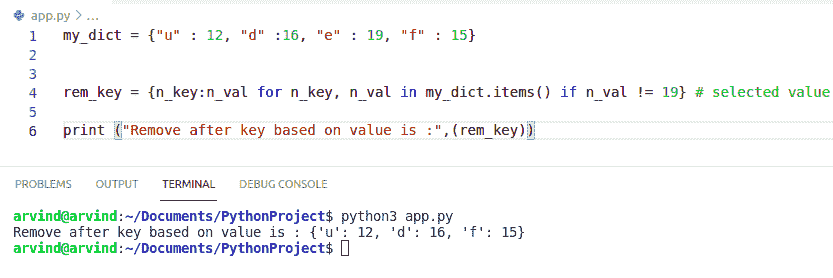

Python dictionary remove key based on the value

这就是如何根据值移除键

又念: [Python 字典追加](https://pythonguides.com/python-dictionary-append/)

## Python 字典删除无值

*   让我们看看如何在 Python 中从字典中删除 none 值。
*   通过使用 for 循环和列表理解方法，我们可以很容易地从字典中删除任何值。
*   在这个例子中，我们将首先初始化一个列表，并使用列表理解方法来检查键值对是否不存在或者不在字典中

**举例:**

让我们举一个例子，看看如何从字典中删除 none 值

```py
to_dict = {'t': 40, 's': 30,'d':None,'n':None}

output = []
for value in to_dict:
    if to_dict[value] is not None :
        output.append(value)

print(output)
```

下面是以下代码的截图

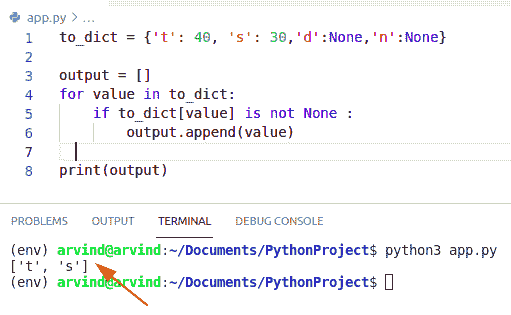

Python dictionary remove none values

## Python 字典删除重复值

*   要从 Python 字典中删除重复值，我们可以很容易地使用字典理解方法。

**举例:**

让我们举一个例子，看看如何从字典中删除重复的值

```py
my_dictionary = {'Australia': 20, 'Switzerland': 30,'Newzeland':30,'Moscow':70}

new_element = {new_val : new_key for new_key, new_val in my_dictionary.items()}
new_output = {new_val : new_key for new_key, new_val in new_element.items()}
print(new_output)
```

下面是以下代码的截图

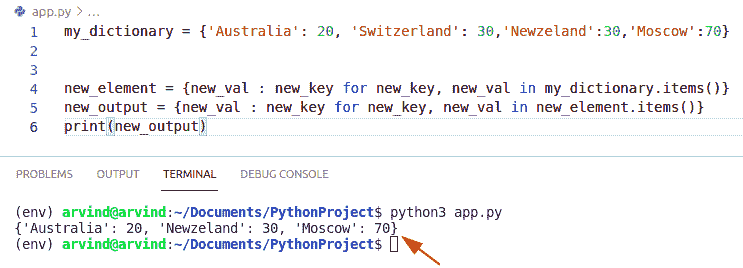

Python dictionary remove duplicate values

## Python 字典删除值

*   让我们看看如何用 Python 从字典中删除一个值。
*   通过使用 dict comprehension 和 items()方法，我们可以很容易地从字典中删除值。
*   items()方法总是返回字典的一个对象。该对象是键值元组的集合。items()方法不接受任何参数。
*   Dict comprehension 主要用于通过包含所有键值对来创建字典。

**举例:**

让我们举一个例子，看看如何从字典中删除一个值

```py
dictionary = {"a" : 40, "z" :29, "c" : 39, "v" : 49}

rem_value = {new_key:new_val for new_key, new_val in dictionary.items() if new_val != 49}

print ("Remove after value is :",(rem_value))
```

下面是以下代码的截图

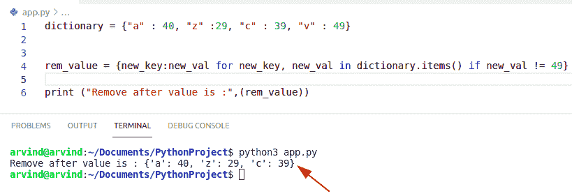

Python dictionary remove the value

这是如何在 Python 中从字典中删除一个值

你可能也喜欢阅读以下内容。

*   [如何安装 matplotlib python](https://pythonguides.com/how-to-install-matplotlib-python/)
*   [Python 字典按值查找键](https://pythonguides.com/python-dictionary-find-a-key-by-value/)
*   [Python 字典理解](https://pythonguides.com/python-dictionary-comprehension/)
*   [什么是 Python Django](https://pythonguides.com/what-is-python-django/)

在本 Python 教程中，我们将讨论 **Python 字典移除。**在这里，我们还将介绍以下示例:

*   Python 字典移除键
*   Python 字典移除重复的键
*   Python 字典移除元素
*   Python 字典移除最后一个键
*   Python 字典移除键值对
*   Python 字典移除空值
*   Python 字典基于值移除键
*   Python 字典移除重复值
*   Python 字典不移除任何值
*   Python 字典移除值

[Bijay Kumar](https://pythonguides.com/author/fewlines4biju/)

Python 是美国最流行的语言之一。我从事 Python 工作已经有很长时间了，我在与 Tkinter、Pandas、NumPy、Turtle、Django、Matplotlib、Tensorflow、Scipy、Scikit-Learn 等各种库合作方面拥有专业知识。我有与美国、加拿大、英国、澳大利亚、新西兰等国家的各种客户合作的经验。查看我的个人资料。

[enjoysharepoint.com/](https://enjoysharepoint.com/)[](https://www.facebook.com/fewlines4biju "Facebook")[](https://www.linkedin.com/in/fewlines4biju/ "Linkedin")[](https://twitter.com/fewlines4biju "Twitter")